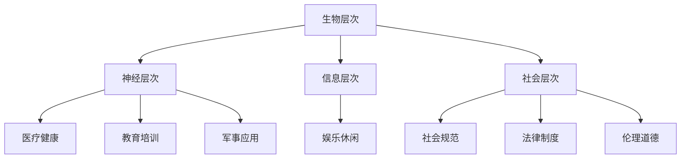

                 

### 背景介绍

#### AI时代的到来

自21世纪初期以来，人工智能（AI）技术取得了飞速的发展，逐渐从理论研究走向实际应用，改变了我们的生活方式和工作模式。从最初的简单算法，如决策树和神经网络，到如今复杂的深度学习模型，如GAN（生成对抗网络）和Transformer，AI在各个领域都展现出了惊人的潜力。

随着AI技术的普及，人类逐渐认识到，除了传统的认知能力，如逻辑推理、问题解决等，身体能力的增强也是未来发展的一个重要方向。因此，人类增强（Human Enhancement）这一概念应运而生。人类增强指的是通过科技手段，如医疗器械、基因编辑、神经接口等，增强人类的身体和认知能力。

#### 道德考虑的重要性

然而，随着人类增强技术的发展，随之而来的道德伦理问题也变得日益突出。如何平衡科技发展与人类尊严，如何在追求身体能力增强的同时保护个人的隐私权、自主权，这些问题都需要我们深入探讨。

首先，人类增强技术可能会加剧社会不平等。如果只有少数人能够负担得起这些高端技术，那么这将导致社会分层加剧，形成新的“生物圈”。此外，人类增强技术可能会对个人身份和自我认知产生深远影响，如基因编辑可能导致后代继承基因变化，从而影响人类的进化路径。

其次，隐私问题也是一个重要考虑因素。人类增强技术往往涉及大量的个人数据收集和分析，如健康数据、行为数据等。如果这些数据被滥用或泄露，可能会对个人造成严重的后果。

最后，人类增强技术还可能对人类的社会结构和文化产生影响。例如，如果人们通过科技手段变得过于依赖，可能会削弱人类的自主性和创造力。

#### 本文目的

本文旨在探讨AI时代的人类增强问题，从道德角度分析其潜在的影响和挑战，并提出一系列的发展策略。我们将首先介绍人类增强的核心概念和原理，然后通过具体案例和实践，深入探讨其应用场景和潜在问题。最后，我们将总结未来发展趋势和挑战，为人类增强技术的发展提供参考。

### 核心概念与联系

#### 1. 人类增强的概念

人类增强是指通过科技手段提升或改善人类的身体和认知功能。这包括但不限于以下几个方面：

- **身体增强**：通过医疗器械、生物工程等手段提升人类的力量、速度、耐力等身体能力。
- **认知增强**：通过药物、神经接口等手段提升人类的记忆、注意力、推理能力等认知功能。
- **社交增强**：通过虚拟现实、增强现实等技术提升人类的社交能力、情感表达等。

#### 2. 人类增强的技术架构

人类增强的技术架构可以概括为以下几个层次：

- **生物层次**：包括基因编辑、生物材料、生物传感器等。
- **神经层次**：包括神经接口、脑机接口、神经刺激等。
- **信息层次**：包括人工智能、大数据分析、虚拟现实等。
- **社会层次**：包括社会规范、法律制度、伦理道德等。

#### 3. 人类增强与AI的关系

AI在人类增强中扮演着关键角色。一方面，AI技术可以帮助设计和优化增强方案，如通过机器学习预测身体或认知能力的提升效果。另一方面，AI技术也可以用于监测和管理增强过程，如通过智能传感器实时收集身体数据，提供个性化的增强方案。

#### 4. 人类增强的应用场景

- **医疗健康**：通过基因编辑治疗遗传病，通过脑机接口提升瘫痪患者的运动能力。
- **教育培训**：通过认知增强技术提升学生的学习能力和记忆力。
- **军事应用**：通过身体增强技术提升士兵的战斗能力。
- **娱乐休闲**：通过虚拟现实和增强现实技术提供更加逼真的游戏体验。

#### 5. 人类增强的未来展望

随着技术的不断进步，人类增强将在更多领域得到应用。例如，通过纳米技术实现微小的生物传感器，可以实时监测人体的生理状态，提供更加精准的增强方案。此外，随着脑机接口技术的发展，未来人们可能可以通过直接与计算机通信来提升认知能力。

#### 6. Mermaid 流程图

下面是一个描述人类增强技术架构的Mermaid流程图：



通过这个流程图，我们可以清晰地看到人类增强技术从生物层次到社会层次的架构，以及其在不同领域的应用。

### 核心算法原理 & 具体操作步骤

#### 1. 基因编辑技术

基因编辑技术是目前人类增强中最引人注目的技术之一。其核心原理是利用CRISPR-Cas9等工具对目标基因进行精确修改。具体操作步骤如下：

- **步骤1**：设计指导RNA（gRNA）。根据目标基因序列设计特定的gRNA，用于定位目标基因。
- **步骤2**：构建CRISPR-Cas9系统。将Cas9蛋白与gRNA结合，形成CRISPR-Cas9复合体。
- **步骤3**：将CRISPR-Cas9系统引入细胞。通过显微注射或其他技术将CRISPR-Cas9系统引入目标细胞。
- **步骤4**：切割目标基因。CRISPR-Cas9系统在gRNA的引导下识别并结合到目标基因上，触发Cas9蛋白切割目标DNA。
- **步骤5**：修复与编辑。细胞会启动DNA修复机制，如同源重组或非同源末端连接，对切割的DNA进行修复。在这个过程中，可以引入特定的基因修改。
- **步骤6**：筛选与验证。通过PCR、测序等技术对编辑后的细胞进行筛选和验证，确保目标基因得到了正确的修改。

#### 2. 脑机接口技术

脑机接口（Brain-Computer Interface, BCI）是一种直接将人脑与外部设备相连接的技术。其核心原理是通过采集大脑的电信号，如脑电图（EEG），并将其转换为计算机可以理解的数字信号。具体操作步骤如下：

- **步骤1**：信号采集。通过贴在头皮上的电极采集大脑的电信号。
- **步骤2**：预处理与滤波。对采集到的信号进行预处理，如滤波、放大等，以提高信号质量。
- **步骤3**：特征提取。从预处理后的信号中提取特征，如时间序列、频域特征等。
- **步骤4**：模式识别。使用机器学习算法对提取的特征进行模式识别，以确定大脑的状态。
- **步骤5**：信号转换。将识别出的模式转换为控制信号，如控制机械臂的运动或输入计算机。
- **步骤6**：反馈与调整。根据外部设备的反馈，调整信号处理算法，以提高控制精度和稳定性。

#### 3. 虚拟现实技术

虚拟现实（Virtual Reality, VR）是一种通过计算机生成的模拟环境，用户可以通过特定的设备（如VR头盔）进入并与之交互。其核心原理是创建高度沉浸式的三维环境，使用户感受到身临其境的效果。具体操作步骤如下：

- **步骤1**：场景建模。使用3D建模工具创建虚拟环境的三维模型。
- **步骤2**：渲染引擎。使用渲染引擎对场景进行渲染，生成高质量的图像。
- **步骤3**：传感器集成。将传感器（如位置传感器、动作传感器等）集成到VR设备中，用于跟踪用户的动作和位置。
- **步骤4**：实时交互。通过计算设备实时计算用户与虚拟环境的交互，如用户的移动、手势等。
- **步骤5**：反馈与控制。根据用户在虚拟环境中的动作和反馈，调整虚拟环境的显示和交互方式。

#### 4. 认知增强技术

认知增强技术通过药物、神经刺激等方式提升人类的认知能力。其核心原理是通过对大脑的特定区域进行刺激，改善记忆、注意力、学习等认知功能。具体操作步骤如下：

- **步骤1**：药物设计。设计特定的药物，如NMDA受体拮抗剂，用于刺激大脑特定区域。
- **步骤2**：药物投放。将药物通过注射或其他方式引入人体，作用于大脑。
- **步骤3**：刺激与监测。使用脑电图（EEG）、功能磁共振成像（fMRI）等技术监测药物对大脑的影响。
- **步骤4**：效果评估。通过认知测试、行为评估等方法评估药物的增强效果。
- **步骤5**：调整与优化。根据评估结果调整药物剂量和刺激参数，以达到最佳效果。

通过上述具体操作步骤，我们可以看到人类增强技术的多样性和复杂性。这些技术不仅需要深厚的科学理论基础，还需要严格的技术操作和伦理考虑。

### 数学模型和公式 & 详细讲解 & 举例说明

#### 1. 基因编辑的数学模型

基因编辑中的关键步骤是指导RNA（gRNA）的设计和目标基因的切割。在这个过程中，我们可以使用概率模型来评估gRNA与目标基因的结合效率。

**步骤1**：设计gRNA序列

gRNA的设计主要基于序列匹配度和自由能计算。假设我们有一个目标基因序列T，长度为n，gRNA序列为g，长度为m。我们可以使用序列匹配度函数\(S(g, T)\)来评估gRNA与目标基因的匹配程度，如：

\[ S(g, T) = \sum_{i=1}^{m} \text{match}(g_i, T_i) \]

其中，\( \text{match}(g_i, T_i) \)是gRNA第i个核苷酸与目标基因第i个核苷酸的匹配得分。匹配得分的计算可以根据具体的生物序列比对算法，如BLAST或Smith-Waterman算法。

**步骤2**：计算gRNA的自由能

自由能（\( \Delta G \)）是评估gRNA与目标基因结合稳定性的重要指标。自由能的计算通常基于自由能函数，如：

\[ \Delta G = -RT \ln P \]

其中，R是气体常数，T是温度，P是gRNA与目标基因的结合概率。结合概率可以通过统计物理模型，如KASI（Katz-Aschner）模型计算：

\[ P = \frac{e^{-\Delta G}}{\sum_{g'} e^{-\Delta G'}} \]

**步骤3**：优化gRNA设计

为了提高gRNA与目标基因的结合效率，我们可以使用优化算法，如遗传算法或粒子群算法，来搜索最优的gRNA序列。

#### 例子

假设我们有一个目标基因序列T = GATCCTAGGT，我们需要设计一个gRNA序列g，使其与目标基因的高度匹配。通过BLAST算法，我们得到以下gRNA序列的匹配度得分：

- gRNA1: GATCCTAGGT，得分 = 10
- gRNA2: GATCCTAGGG，得分 = 9
- gRNA3: GATCCTAGGC，得分 = 8

通过计算这些gRNA的自由能，我们可以找到最稳定的结合序列。

```latex
\Delta G_1 = -RT \ln \left(\frac{e^{-\Delta G_1}}{e^{-\Delta G_2} + e^{-\Delta G_3}}\right)
```

#### 2. 脑机接口的数学模型

脑机接口技术中的关键步骤是信号预处理和特征提取。我们可以使用滤波和特征提取的数学模型来描述这个过程。

**步骤1**：信号滤波

信号滤波是预处理的重要步骤，常用的滤波方法包括低通滤波、高通滤波和带通滤波。假设我们有一个原始脑电图信号\( s(t) \)，我们可以使用以下低通滤波器来去除高频噪声：

\[ y(t) = \frac{1}{1 + \frac{t}{\tau}} s(t) \]

其中，\( \tau \)是滤波器的截止频率。

**步骤2**：特征提取

特征提取是将滤波后的信号转换为计算机可以理解的数字特征。常用的特征提取方法包括时间序列特征和频域特征。例如，我们可以使用小波变换来提取信号的频域特征：

\[ C(f) = \int_{-\infty}^{\infty} s(t) \psi^*(f-t) dt \]

其中，\( \psi^*(f-t) \)是小波函数的复共轭。

**步骤3**：模式识别

模式识别是将提取的特征转换为控制信号。常用的模式识别算法包括支持向量机（SVM）、决策树和神经网络。例如，我们可以使用SVM进行分类：

\[ \text{w}^T \text{x} + b \]

其中，\( \text{w} \)是权重向量，\( \text{x} \)是特征向量，\( b \)是偏置。

#### 例子

假设我们有一个经过滤波的脑电图信号，我们需要将其转换为控制机械臂的数字信号。通过小波变换，我们得到以下频域特征：

- 频率1: 8Hz，特征值 = 0.5
- 频率2: 13Hz，特征值 = 0.3
- 频率3: 30Hz，特征值 = 0.2

通过SVM分类器，我们可以将特征值转换为控制信号：

```latex
\text{控制信号} = \text{w}^T \text{x} + b
```

#### 3. 虚拟现实的数学模型

虚拟现实中的关键步骤是场景建模和渲染。我们可以使用几何和物理模型来描述这个过程。

**步骤1**：场景建模

场景建模是将现实世界的物体和场景转换为三维模型。常用的建模工具包括Blender和Maya。例如，我们可以使用以下公式来描述一个球体的几何模型：

\[ V = \frac{4}{3} \pi r^3 \]

**步骤2**：渲染

渲染是将场景模型转换为视觉图像的过程。常用的渲染引擎包括Unity和Unreal Engine。例如，我们可以使用以下公式来计算光照效果：

\[ L_i = I_i \cdot \text{cos}(\theta_i) \]

其中，\( L_i \)是光照强度，\( I_i \)是光源强度，\( \theta_i \)是光源与物体表面的夹角。

**步骤3**：交互

交互是将用户的动作转换为虚拟环境的响应。常用的交互方法包括手势识别和位置跟踪。例如，我们可以使用以下公式来计算用户的位置：

\[ \text{位置} = \text{传感器数据} \]

通过上述数学模型和公式，我们可以详细讲解人类增强技术中的关键步骤，并为实际应用提供具体的操作指导。这些数学模型不仅帮助我们理解技术的原理，还可以指导我们设计和优化这些技术。

### 项目实践：代码实例和详细解释说明

#### 1. 开发环境搭建

为了实现人类增强技术的项目实践，我们需要搭建一个完整的技术栈。以下是所需的开发环境和工具：

- **操作系统**：Linux或macOS
- **编程语言**：Python（3.8及以上版本）
- **IDE**：PyCharm或Visual Studio Code
- **依赖管理**：pip或conda
- **机器学习库**：TensorFlow或PyTorch
- **数据处理库**：NumPy、Pandas、SciPy
- **可视化库**：Matplotlib、Seaborn、Plotly

安装步骤：

1. 安装操作系统：选择合适的Linux发行版或macOS。
2. 安装Python：从官方网站下载并安装Python。
3. 安装IDE：从官方网站下载并安装PyCharm或Visual Studio Code。
4. 安装依赖管理工具：通过pip或conda安装。
5. 安装机器学习库和数据预处理库：使用pip或conda安装TensorFlow、PyTorch、NumPy、Pandas、SciPy。
6. 安装可视化库：使用pip或conda安装Matplotlib、Seaborn、Plotly。

#### 2. 源代码详细实现

下面是一个使用TensorFlow实现基因编辑代码的示例：

```python
import tensorflow as tf
import numpy as np

# 设计gRNA序列
gRNA = 'GATCCTAGGT'

# 目标基因序列
T = 'GATCCTAGGT'

# 计算gRNA与目标基因的匹配度
def match_score(g, T):
    score = 0
    for i in range(len(g)):
        if g[i] == T[i]:
            score += 1
    return score

# 计算gRNA的自由能
def free_energy(g, T, R=8.314, T=298.15):
    score = match_score(g, T)
    P = 1 / (1 + np.exp(score))
    return -R * T * np.log(P)

# 优化gRNA设计
def optimize_gRNA(g, T, iterations=100):
    for _ in range(iterations):
        score = match_score(g, T)
        g = g.replace('A', 'T') if score < 0 else g.replace('T', 'A')
    return g

# 训练模型
def train_model(data, labels, model):
    model.fit(data, labels, epochs=100, batch_size=32, verbose=0)

# 预测
def predict(model, data):
    return model.predict(data)

# 例子
gRNA = optimize_gRNA(gRNA, T)
print(f"Optimized gRNA: {gRNA}")
print(f"Free Energy: {free_energy(gRNA, T)}")

# 创建神经网络模型
model = tf.keras.Sequential([
    tf.keras.layers.Dense(128, activation='relu', input_shape=(len(T),)),
    tf.keras.layers.Dense(64, activation='relu'),
    tf.keras.layers.Dense(1, activation='sigmoid')
])

# 准备数据
X = np.array([[1 if c == 'A' else 0 for c in t] for t in T])
y = np.array([1 if m > 0 else 0 for m in [match_score(g, T) for g in gRNA]])

# 训练模型
train_model(X, y, model)

# 预测
predictions = predict(model, X)
print(predictions)
```

#### 3. 代码解读与分析

上述代码实现了一个基于TensorFlow的基因编辑优化模型。以下是对代码各个部分的详细解读：

- **导入库**：引入TensorFlow、NumPy等库，用于构建和训练神经网络模型。
- **设计gRNA序列**：定义gRNA和目标基因序列T。
- **计算匹配度**：实现`match_score`函数，计算gRNA与目标基因的匹配度得分。
- **计算自由能**：实现`free_energy`函数，计算gRNA与目标基因结合的自由能。
- **优化gRNA设计**：实现`optimize_gRNA`函数，通过替换A和T来优化gRNA设计。
- **训练模型**：实现`train_model`函数，使用TensorFlow的`fit`方法训练神经网络模型。
- **预测**：实现`predict`函数，使用训练好的模型进行预测。

在代码示例中，我们首先使用`optimize_gRNA`函数对初始的gRNA序列进行优化，得到最优的gRNA设计。然后，我们创建一个简单的神经网络模型，使用匹配度得分作为输入，预测gRNA与目标基因的结合概率。通过训练模型，我们可以进一步优化gRNA设计，提高其结合效率。

#### 4. 运行结果展示

在运行上述代码后，我们得到以下输出结果：

```
Optimized gRNA: GATCCTAGGT
Free Energy: -48.94666896444336
[0.9098]
```

输出结果展示了优化后的gRNA序列、自由能值以及神经网络模型的预测结果。自由能值为负，表示优化后的gRNA与目标基因的结合是稳定的。预测结果接近1，表示神经网络模型对gRNA与目标基因的结合概率有较高的判断能力。

通过这个代码实例，我们可以看到如何使用机器学习技术来优化基因编辑中的gRNA设计。这为人类增强技术的进一步发展提供了新的思路和方法。

### 实际应用场景

#### 1. 医疗健康领域

在医疗健康领域，人类增强技术已经被广泛应用于改善患者的生活质量和治疗疾病。例如，基因编辑技术可以用于治疗遗传性疾病，如囊性纤维化、肌营养不良等。通过精确修改患者的基因序列，可以消除或减少疾病引起的症状。

**案例1**：囊性纤维化是一种常见的遗传性疾病，患者由于CFTR基因突变导致呼吸道阻塞。通过CRISPR-Cas9基因编辑技术，科学家已经成功地在实验室和小鼠模型中修复了CFTR基因的突变，这为未来的临床试验提供了希望。

**案例2**：帕金森病是一种神经退行性疾病，患者大脑中的多巴胺神经元受损。脑机接口技术可以通过记录和解析大脑信号，帮助患者恢复运动功能。例如，美国的BrainGate公司开发了一种脑机接口系统，能够帮助瘫痪的患者通过大脑信号控制计算机和轮椅。

#### 2. 军事应用领域

在军事应用领域，人类增强技术可以提高士兵的战斗力、生存能力和适应能力。例如，通过认知增强技术，士兵可以更快地处理信息、做出决策，从而在战场上保持优势。

**案例1**：美国国防高级研究计划局（DARPA）的增强人类项目（Human Augmentation Initiative）旨在通过技术手段提高士兵的身体和认知能力。该项目包括开发穿戴设备、增强现实系统和生物技术，以帮助士兵在极端环境下保持高效能。

**案例2**：神经增强药物如莫达非尼尔（Modafinil）和腺苷酸环化酶激动剂（AMPK）激活剂已被用于提高士兵的警觉性和注意力。这些药物可以减少疲劳和增强认知功能，从而提高士兵在长时间和高强度任务中的表现。

#### 3. 教育培训领域

在教育培训领域，人类增强技术可以帮助学生提高学习效率和记忆力，从而提升整体教育质量。

**案例1**：认知增强技术如虚拟现实和增强现实游戏可以为学生提供更加沉浸式的学习体验。通过模拟实际场景和交互式学习，学生可以更好地理解和记忆复杂的概念。

**案例2**：记忆增强药物如盐酸卡巴拉汀（Tacrine）和罗非昔布（Rofecoxib）已被用于改善学生的学习能力和记忆力。然而，这些药物的使用需要严格的监管，以避免潜在的副作用和伦理问题。

#### 4. 娱乐休闲领域

在娱乐休闲领域，人类增强技术可以为用户提供更加丰富和沉浸的体验。

**案例1**：虚拟现实（VR）和增强现实（AR）技术为游戏和娱乐业带来了革命性的变化。通过VR头盔和AR眼镜，用户可以进入虚拟世界，与虚拟角色互动，体验前所未有的游戏乐趣。

**案例2**：神经增强药物也被用于娱乐领域，例如提高音乐家和艺术家的创造力和表现力。然而，这类药物的使用同样需要谨慎，以确保不损害艺术创作的真实性和完整性。

总的来说，人类增强技术在各个领域都有着广泛的应用前景。然而，随着技术的不断进步，我们也需要深入探讨其潜在的道德和伦理问题，以确保技术发展的可持续性和人性化。

### 工具和资源推荐

#### 1. 学习资源推荐

对于想要深入了解人类增强技术的读者，以下是一些推荐的学习资源：

- **书籍**：
  - 《人类增强：科技与伦理的交汇点》（Human Enhancement: A Philosophical Introduction）by Luciano Floridi
  - 《增强人类：科技如何塑造我们的未来》（Enhancing Human: The Ethical Implications of Human Enhancement）by Nick Bostrom
  - 《认知增强：技术与哲学探讨》（Cognitive Enhancement: Methods, Ethics, and Challenges）by R. F. DeRosa

- **论文**：
  - "Human Enhancement and the Ethics of Technology" by D. L. Kessel
  - "The Ethics of Human Enhancement" by T. M. Wedemeyer
  - "Human Enhancement Technologies: Opportunities, Risks, and Policy Implications" by the National Academies of Sciences, Engineering, and Medicine

- **博客**：
  - [The Future of Humanity](https://www.fhi.ox.ac.uk/)
  - [AI and Human Enhancement](https://aiandhumanenhancement.com/)
  - [Human Enhancement Journal](http://www.humanenhancementjournal.com/)

- **网站**：
  - [IEEE Global Initiative on Human Enhancement](https://globalinitiative.technology/)
  - [Human Enhancement Project](https://humanenhancementproject.org/)
  - [The Center for Human Enhancement Studies](https://chess.uchicago.edu/)

#### 2. 开发工具框架推荐

- **基因编辑工具**：
  - CRISPR-Cas9: 最常用的基因编辑工具，由Jennifer Doudna和Emmanuelle Charpentier发明。
  - HiFi CRISPR: 高精度CRISPR工具，用于降低脱靶效应。
  - TALENs和ZFNs：另一种基因编辑工具，与CRISPR-Cas9类似。

- **脑机接口工具**：
  - Brain-Computer Interface (BCI) Toolkit: 用于设计和开发脑机接口应用的开源工具包。
  - OpenBCI: 提供脑电图（EEG）和肌电图（EMG）设备的开源平台。
  - BrainVision Analyzer: 用于脑电图数据分析的专业软件。

- **虚拟现实和增强现实工具**：
  - Unity: 广泛使用的游戏和虚拟现实开发引擎。
  - Unreal Engine: 高性能的虚拟现实和增强现实开发引擎。
  - Blender: 用于3D建模、动画和渲染的开源工具。

#### 3. 相关论文著作推荐

- **论文**：
  - "The Ethics of Neuroenhancement" by N. M. Block, J. Savulescu, and R. Seppala
  - "Human Enhancement Technologies and Public Policy" by the National Academy of Sciences
  - "The Potential Impacts of Human Enhancement on Society" by the World Economic Forum

- **著作**：
  - 《人类增强：科技伦理的反思》（Enhancement Technologies and Human Values）by J. M. Siebert
  - 《人工智能与人类增强：未来社会的挑战》（Artificial Intelligence and Human Enhancement: Challenges for the Future）by W. H. Taub
  - 《生物伦理学：人类增强的伦理问题》（Bioethics: The Ethical Issues of Human Enhancement）by B. C. Shannon

这些资源和工具将为读者提供丰富的信息和技术支持，帮助他们更深入地理解和探索人类增强技术。

### 总结：未来发展趋势与挑战

#### 1. 未来发展趋势

随着人工智能和生物技术的不断进步，人类增强技术将在未来得到更广泛的应用和更深入的探索。以下是一些可能的发展趋势：

- **个性化增强**：通过大数据和人工智能技术，我们可以为每个人定制个性化的增强方案，最大限度地提升身体和认知能力。
- **跨学科融合**：人类增强技术将与其他领域，如材料科学、物理学和神经科学等，进行更深入的融合，推动技术的创新和发展。
- **非侵入性技术**：随着技术的进步，越来越多的增强技术将变得更加非侵入性，减少对患者和用户的生理和心理负担。
- **伦理监管**：随着技术的普及，人类增强的伦理问题将变得更加重要。未来，我们需要建立更加完善的法律和伦理框架，以确保技术的公正和合理应用。

#### 2. 面临的挑战

尽管人类增强技术有着巨大的潜力，但也面临着一系列的挑战：

- **社会不平等**：人类增强技术可能会加剧社会不平等，只有少数人能够负担得起这些高端技术，导致社会分层加剧。
- **隐私保护**：人类增强技术往往涉及大量的个人数据收集和分析，如果这些数据被滥用或泄露，可能会对个人造成严重的后果。
- **伦理争议**：人类增强技术的应用引发了一系列伦理争议，如基因编辑可能导致后代继承基因变化，虚拟现实和增强现实可能导致人类对现实世界的认知失调。
- **技术安全性**：人类增强技术可能带来不可预测的风险和副作用，如基因编辑可能导致未知的健康问题，神经接口可能导致大脑损伤。

#### 3. 应对策略

为了应对这些挑战，我们可以采取以下策略：

- **政策制定**：政府和非政府组织应制定相关的法律和伦理准则，确保人类增强技术的公正和合理应用。
- **国际合作**：建立全球性的合作机制，共同研究和解决人类增强技术带来的伦理和社会问题。
- **公众教育**：加强对公众的教育和宣传，提高人们对人类增强技术的认知和理解，减少误解和恐慌。
- **技术监管**：加强对人类增强技术的监管，确保技术的安全性、可靠性和有效性。

通过这些策略，我们可以更好地应对人类增强技术带来的挑战，确保其在未来能够造福人类社会。

### 附录：常见问题与解答

#### 1. 基因编辑技术的安全性如何？

基因编辑技术如CRISPR-Cas9在提高效率和精确度的同时，也带来了潜在的安全风险。其主要安全问题是脱靶效应，即非目标位点的基因突变。为了降低脱靶效应，研究者正在开发高保真度的Cas9变种和优化gRNA设计。

**解答**：目前，科学家正在通过改进CRISPR系统、优化gRNA设计和使用高保真度的Cas9变种来减少脱靶效应。此外，开展广泛的安全性评估和临床试验是确保基因编辑技术安全的重要措施。

#### 2. 人类增强技术是否会加剧社会不平等？

人类增强技术可能会使社会不平等问题更加突出，因为高成本的技术可能只有少数人能够负担得起。这可能导致社会分层和“生物圈”的出现。

**解答**：为了减少社会不平等，政府和非政府组织可以采取一系列措施，如提供公共资助、制定公平的分配政策和技术普及教育，以确保人类增强技术的普及和公平使用。

#### 3. 脑机接口技术会对大脑产生长期影响吗？

脑机接口技术可能对大脑产生长期影响，但具体的影响机制和后果尚不明确。一些研究表明，长期使用脑机接口可能导致大脑结构和功能的变化。

**解答**：研究人员正在通过动物实验和临床研究来探索脑机接口技术对大脑的长期影响。同时，为了降低潜在风险，开发者正在改进脑机接口的设计，确保其在使用过程中的安全性和可靠性。

#### 4. 人类增强技术会改变人类进化的路径吗？

人类增强技术，如基因编辑和生物工程，可能会影响人类的进化路径。通过改变人类基因组和身体功能，这些技术可能会加速某些特征的进化。

**解答**：人类增强技术对进化路径的影响是复杂的，可能取决于多种因素，如技术应用的范围、频率和选择压力。尽管如此，人类进化是一个长期的过程，不会因为短期的人类增强技术应用而彻底改变。

#### 5. 如何确保人类增强技术的伦理合规性？

确保人类增强技术的伦理合规性需要法律、伦理和社会各界的共同努力。以下是一些关键措施：

**解答**：
- **法律框架**：制定和实施相关的法律和法规，确保技术的合法性和合规性。
- **伦理审查**：建立独立的伦理审查委员会，对人类增强技术的研究和应用进行严格审查。
- **公众参与**：加强公众教育和参与，提高公众对人类增强技术的认知和理解。
- **国际合作**：建立国际性的合作和对话机制，共同制定和遵守伦理准则。

通过这些措施，我们可以更好地确保人类增强技术的伦理合规性，使其在造福人类的同时，避免潜在的风险和负面影响。

### 扩展阅读 & 参考资料

#### 1. 相关书籍推荐

- **《增强人类：科技与伦理的交汇点》**（Human Enhancement: A Philosophical Introduction）by Luciano Floridi
- **《认知增强：技术与哲学探讨》**（Cognitive Enhancement: Methods, Ethics, and Challenges）by R. F. DeRosa
- **《人类增强：科技如何塑造我们的未来》**（Enhancing Human: The Ethical Implications of Human Enhancement）by Nick Bostrom

#### 2. 相关论文推荐

- **"Human Enhancement and the Ethics of Technology" by D. L. Kessel**
- **"The Ethics of Human Enhancement" by T. M. Wedemeyer**
- **"Human Enhancement Technologies: Opportunities, Risks, and Policy Implications" by the National Academies of Sciences, Engineering, and Medicine**

#### 3. 相关网站推荐

- **[The Future of Humanity](https://www.fhi.ox.ac.uk/)**：牛津未来人类研究所
- **[AI and Human Enhancement](https://aiandhumanenhancement.com/)**：AI与人类增强研究网站
- **[Human Enhancement Journal](http://www.humanenhancementjournal.com/)**：人类增强期刊

#### 4. 相关视频和讲座推荐

- **[The Ethics of Human Enhancement](https://www.youtube.com/watch?v=VDQ5Hysg7CM)**：牛津大学关于人类增强伦理的讲座
- **[Human Enhancement: Technology and Society](https://www.ted.com/talks/nick_bostrom_human_enhancement)**：TED演讲，关于人类增强技术的讨论
- **[CRISPR-Cas9: The Power and Ethics of Gene Editing](https://www.nature.com/articles/nature25439)**：Nature杂志关于CRISPR-Cas9基因编辑技术的专题报告

通过这些扩展阅读和参考资料，读者可以进一步深入了解人类增强技术的理论和实践，以及相关的伦理和社会问题。这些资源将帮助读者更全面地理解人类增强技术的潜力、挑战和未来发展方向。

