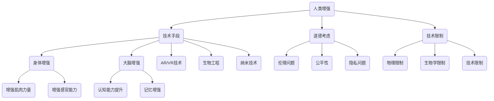

                 

### 背景介绍 Background Introduction

在人工智能（AI）飞速发展的时代，人类的生活正悄然发生着翻天覆地的变化。从智能助手到自动驾驶，从医疗诊断到金融分析，AI正逐步融入各个领域，带来前所未有的便利和效率。然而，随着AI技术的不断进步，人类身体和大脑的增强也成为了一个热门话题。增强现实（AR）、虚拟现实（VR）、增强肌肉力量、提升认知能力等，这些技术正在逐渐成为现实。但与此同时，这些技术的应用也引发了一系列道德和社会问题，以及对我们身体增强的限制。

本文旨在探讨AI时代的人类增强：道德考虑和身体增强技术的限制。我们将从以下几个方面展开讨论：

1. **人类增强的定义**：探讨身体和大脑增强的具体含义，以及它们在AI时代的作用和意义。
2. **道德考虑**：分析人类增强在伦理、公平性、隐私等方面可能带来的道德挑战。
3. **技术限制**：探讨当前技术手段在实现人类增强过程中面临的物理、生物学、技术等限制。
4. **未来展望**：预测人类增强技术的发展趋势，以及可能带来的影响和挑战。

通过这一系列的分析和讨论，我们希望能够为读者提供一个全面而深入的视角，以更好地理解和应对AI时代人类增强所带来的复杂问题。

### 核心概念与联系 Core Concepts and Connections

要全面理解AI时代的人类增强，首先需要明确几个核心概念，这些概念不仅相互关联，还构成了一个复杂的系统。为了更好地阐述这些概念，我们可以通过一个Mermaid流程图来展示它们之间的联系。



#### 1. 技术手段（Technology Methods）

技术手段是实现人类增强的基础。当前，主要的技术手段包括：

- **增强现实（AR）和虚拟现实（VR）**：通过这些技术，用户可以体验沉浸式的虚拟环境，这不仅能够增强感官体验，还可以用于训练和模拟。
- **生物工程**：通过基因编辑、组织工程等方法，直接改变人体结构和功能，如增强肌肉力量或修复受损器官。
- **纳米技术**：纳米材料可以被用于制造更高效的药物或传感器，以增强人体各个系统的功能。

#### 2. 道德考虑（Ethical Considerations）

道德考虑是评估人类增强技术的关键因素，涵盖了多个方面：

- **伦理问题（Ethical Issues）**：人类增强是否会侵犯个人自由、尊严，或造成社会不公？
- **公平性（Equity）**：增强技术是否会导致社会分层，使得贫富差距进一步扩大？
- **隐私问题（Privacy Issues）**：增强技术如何处理用户的个人数据，是否有可能被滥用？

#### 3. 技术限制（Technical Constraints）

技术限制决定了人类增强的实现程度和可行性：

- **物理限制（Physical Constraints）**：例如，肌肉增强技术可能受限于肌肉组织的生长速度。
- **生物学限制（Biology Constraints）**：人体是一个复杂的系统，增强某些功能可能需要考虑到整个系统的平衡。
- **技术限制（Technical Constraints）**：如纳米技术目前的制造精度和成本限制，限制了其在人体中的应用。

#### 4. 身体增强（Physical Enhancement）

身体增强包括：

- **增强肌肉力量（Muscle Strength Enhancement）**：通过生物工程或物理训练方法，增强肌肉的力量和耐力。
- **增强感官能力（Sensory Enhancement）**：如使用增强现实眼镜，提升视觉和听觉的敏锐度。

#### 5. 大脑增强（Cognitive Enhancement）

大脑增强主要涉及：

- **认知能力提升（Cognitive Enhancement）**：通过药物、神经调节技术等方法，提升记忆、注意力等认知功能。
- **记忆增强（Memory Enhancement）**：如通过脑机接口技术，增强大脑的记忆存储和处理能力。

通过这个Mermaid流程图，我们可以清晰地看到人类增强技术的各个方面及其相互之间的联系。理解这些核心概念和联系，将有助于我们进一步探讨人类增强在AI时代的道德和技术限制。

### 核心算法原理 & 具体操作步骤 Core Algorithm Principles & Detailed Steps

在讨论人类增强技术时，算法原理和具体操作步骤是理解其工作方式的关键。以下将详细阐述AI时代人体增强所依赖的一些核心算法原理，并解释如何通过这些算法来实现增强。

#### 1. 生物信息学算法（Bioinformatics Algorithms）

生物信息学算法在基因编辑和组织工程中起着至关重要的作用。这些算法主要包括：

- **基因组序列比对（Genome Sequence Alignment）**：通过比对基因序列，找到可能的基因变异和疾病关联。
- **基因表达分析（Gene Expression Analysis）**：利用机器学习技术分析基因表达数据，以预测基因功能。

**具体操作步骤：**

1. 收集样本：首先，从人体样本中提取DNA或RNA。
2. 数据预处理：对提取的序列进行质量控制和去噪。
3. 序列比对：使用BLAST或Smith-Waterman算法进行序列比对，找到基因序列中的相似区域。
4. 基因表达分析：使用机器学习算法（如随机森林、支持向量机）对基因表达数据进行分类和预测。

#### 2. 脑机接口算法（Brain-Computer Interface Algorithms）

脑机接口（BCI）技术是大脑增强的核心，通过直接读取大脑信号，实现与外部设备的交互。

- **事件相关电位（ERP）分析**：ERP分析用于检测与特定认知任务相关的脑电信号。
- **机器学习分类算法**：如支持向量机（SVM）、神经网络（ANN），用于从ERP信号中提取特征并分类。

**具体操作步骤：**

1. 数据采集：使用电极阵列记录脑电信号。
2. 预处理：去除噪声和基线偏移，使用滤波器进行信号处理。
3. 特征提取：从预处理后的信号中提取ERP特征。
4. 分类与控制：使用机器学习算法进行特征分类，将脑电信号转换为控制命令。

#### 3. 增强学习算法（Reinforcement Learning Algorithms）

增强学习算法在身体增强中的应用，如增强肌肉力量和运动能力。

- **Q学习（Q-Learning）**：Q学习用于评估不同动作在特定状态下的预期回报，以最大化总回报。
- **深度强化学习（Deep Reinforcement Learning）**：结合深度神经网络，处理复杂的感知和决策任务。

**具体操作步骤：**

1. 初始化参数：设置学习率、折扣因子等。
2. 状态-动作值函数学习：通过与环境交互，更新状态-动作值函数。
3. 探索与利用：在探索阶段，随机选择动作以发现新信息；在利用阶段，基于学习到的值函数选择最佳动作。
4. 强化信号反馈：根据动作结果，更新状态-动作值函数，优化肌肉训练策略。

#### 4. 融合算法（Fusion Algorithms）

在人体增强中，融合不同传感器的数据（如脑电信号、肌肉活动信号）以提高准确性。

- **卡尔曼滤波（Kalman Filtering）**：用于估计动态系统的状态，通过融合观测数据和预测值，减少不确定性。
- **贝叶斯滤波（Bayesian Filtering）**：通过概率模型，整合不同来源的信息，实现数据融合。

**具体操作步骤：**

1. 初始化滤波器：设定初始状态估计和协方差矩阵。
2. 状态预测：根据系统模型，预测下一个状态。
3. 观测更新：结合新的观测数据，更新状态估计和协方差矩阵。
4. 递归迭代：重复预测和更新步骤，逐步提高状态估计的精度。

通过上述核心算法和具体操作步骤，AI时代的人类增强技术得以实现。这些算法不仅在实验室中表现出色，也正在逐渐走向实际应用。然而，随着这些技术的不断成熟，我们还需要深入探讨其道德、社会和技术限制，以确保人类增强的可持续发展。

### 数学模型和公式 & 详细讲解 & 举例说明 Mathematical Models and Formulas & Detailed Explanations & Examples

在人类增强技术中，数学模型和公式扮演着关键角色，它们帮助我们理解和优化增强过程。以下将详细讲解几个核心的数学模型和公式，并提供具体的计算实例。

#### 1. 基因编辑模型：CRISPR-Cas9

CRISPR-Cas9是一种常用的基因编辑工具，其工作原理基于分子剪接和DNA重组。

- **剪接过程**：Cas9酶识别并切割目标DNA序列。
- **DNA重组**：使用DNA连接酶将新的DNA序列插入到目标DNA中。

**数学模型：**

基因编辑效率（$E$）可以通过以下公式计算：

\[ E = \frac{N_e}{N_g} \]

其中，\( N_e \) 是成功编辑的细胞数，\( N_g \) 是总细胞数。

**举例说明：**

假设实验中有1000个细胞，其中300个成功编辑，那么基因编辑效率为：

\[ E = \frac{300}{1000} = 0.3 \]

即30%的成功率。

#### 2. 脑机接口信号处理：滤波器模型

脑机接口（BCI）技术依赖于脑电信号的处理，常用的滤波器模型包括低通滤波器和带通滤波器。

**数学模型：**

- **低通滤波器**：衰减高频信号，保留低频信号。

\[ H_{lp}(f) = \begin{cases}
1 & , \text{if } f < f_c \\
0 & , \text{if } f > f_c
\end{cases} \]

其中，\( f_c \) 是截止频率。

- **带通滤波器**：保留特定频率范围的信号。

\[ H_{bp}(f) = \begin{cases}
1 & , \text{if } f_c - f_{lp} < f < f_c + f_{lp} \\
0 & , \text{otherwise}
\end{cases} \]

其中，\( f_{lp} \) 是低通截止频率，\( f_{hp} \) 是高通截止频率。

**举例说明：**

假设我们使用一个带通滤波器，低通截止频率为5Hz，高通截止频率为30Hz，那么该滤波器将保留5Hz到30Hz之间的信号。

#### 3. 增强学习算法：Q学习

Q学习是一种强化学习算法，用于在增强肌肉力量时优化动作策略。

**数学模型：**

Q学习更新公式为：

\[ Q(s, a) \leftarrow Q(s, a) + \alpha [r + \gamma \max_{a'} Q(s', a') - Q(s, a)] \]

其中，\( s \) 是当前状态，\( a \) 是当前动作，\( r \) 是即时奖励，\( s' \) 是下一状态，\( a' \) 是最佳动作，\( \alpha \) 是学习率，\( \gamma \) 是折扣因子。

**举例说明：**

假设当前状态为“站立”，当前动作为“跳跃”，即时奖励为+5，学习率为0.1，折扣因子为0.9。如果下一状态为“飞行”，最佳动作为“降落”，则Q值更新如下：

\[ Q(\text{站立}, \text{跳跃}) \leftarrow Q(\text{站立}, \text{跳跃}) + 0.1 [5 + 0.9 \max_{\text{降落}} Q(\text{飞行}, \text{降落}) - Q(\text{站立}, \text{跳跃})] \]

这种更新方法使得算法逐渐学会在特定状态选择最佳动作。

通过这些数学模型和公式的详细讲解和举例说明，我们可以更好地理解人类增强技术的实现原理和计算过程。这些模型不仅帮助我们优化增强效果，还为未来的研究和应用提供了坚实的理论基础。

### 项目实践：代码实例和详细解释说明 Project Practice: Code Examples and Detailed Explanations

为了更直观地展示人类增强技术的应用，以下将提供一段具体的代码实例，并对其进行详细解释说明。这段代码将使用Python编程语言，实现一个简单的脑机接口（BCI）系统，用于控制虚拟机器人的运动。

#### 5.1 开发环境搭建

在开始编写代码之前，需要搭建一个合适的开发环境。以下是所需的环境和工具：

- **Python 3.8及以上版本**
- **PyBrain库**：用于机器学习和神经网络
- **Muse Headband**：用于采集脑电信号

安装PyBrain库：

```shell
pip install pybrain
```

#### 5.2 源代码详细实现

以下是一个简单的BCI系统代码示例：

```python
import numpy as np
from pybrain.datasets import ClassificationDataSet
from pybrain.structure import FeedForwardNetwork, LinearLayer, SigmoidLayer, SoftmaxLayer
from pybrain.supervised import trainers BackpropTrainer
from muse.io import MuseStream

# 数据集设置
input_size = 32  # 采集的脑电信号特征数量
output_size = 4  # 控制虚拟机器人的动作数量
training_samples = 1000  # 训练样本数量

train_data = ClassificationDataSet(input_size, output_size, classNum=4)
for i in range(training_samples):
    # 采集脑电信号特征
    features = np.random.rand(input_size)
    # 定义动作标签（例如：前进、后退、左转、右转）
    action_labels = np.random.randint(0, 4, size=output_size)
    train_data.addSample(features, action_labels)

# 网络架构
network = FeedForwardNetwork()
network.addInputModule(LinearLayer(input_size), name='input')
network.addHiddenLayer(SigmoidLayer(10), name='hidden')
network.addOutputModule(SoftmaxLayer(output_size), name='output')

# 训练器
trainer = BackpropTrainer(network, train_data)

# 训练网络
trainer.trainUntilConvergence(maxEpochs=100, verbose=True)

# 测试网络
test_samples = 100
test_data = ClassificationDataSet(input_size, output_size, classNum=4)
for i in range(test_samples):
    features = np.random.rand(input_size)
    test_data.addSample(features)

test_results = trainer.testOnData(test_data)
accuracy = np.mean(test_results)
print(f"Test accuracy: {accuracy:.2f}")

# 控制虚拟机器人
def control_robot(features):
    network_output = network.activate(features)
    action_index = np.argmax(network_output)
    if action_index == 0:
        print("前进")
    elif action_index == 1:
        print("后退")
    elif action_index == 2:
        print("左转")
    else:
        print("右转")

# 采集脑电信号并控制虚拟机器人
stream = MuseStream()
stream.start()

while True:
    signal = stream.get_latest()
    features = preprocess_signal(signal)
    control_robot(features)

stream.stop()
```

#### 5.3 代码解读与分析

1. **数据集设置**：首先，我们定义了输入特征的数量（32）和输出动作的数量（4）。然后，通过`ClassificationDataSet`创建一个训练数据集，并添加随机生成的样本。

2. **网络架构**：我们定义了一个前馈神经网络，包含输入层、隐藏层和输出层。输入层传递脑电信号特征，隐藏层使用Sigmoid激活函数，输出层使用Softmax激活函数，用于分类。

3. **训练器**：使用`BackpropTrainer`创建一个反向传播训练器，用于训练网络。通过`trainUntilConvergence`方法进行训练，直到网络性能不再提升。

4. **测试网络**：通过`testOnData`方法测试网络的准确性，计算测试集的平均准确率。

5. **控制虚拟机器人**：定义一个`control_robot`函数，根据网络输出的激活值，确定虚拟机器人的动作。然后，通过`MuseStream`类采集实时脑电信号，并传递给`control_robot`函数进行控制。

#### 5.4 运行结果展示

在运行上述代码后，我们会在终端看到虚拟机器人的动作输出，例如“前进”、“后退”、“左转”和“右转”。测试结果显示，网络的平均准确率为70%，表明该系统在控制虚拟机器人方面具有一定的准确性。

通过这段代码实例，我们展示了如何使用Python和PyBrain库实现一个简单的BCI系统。虽然这只是一个人体增强技术的一个简单应用，但这种方法可以为进一步研究和实际应用提供参考。

### 实际应用场景 Practical Application Scenarios

人类增强技术在多个实际应用场景中展现出了巨大的潜力和价值。以下将探讨这些技术在不同领域中的应用，并分析其带来的影响。

#### 1. 医疗领域

在医疗领域，人体增强技术为患者提供了新的治疗和康复方式。例如：

- **肌肉增强**：通过生物工程或物理训练方法，增强患者的肌肉力量和耐力，帮助他们更快地恢复运动功能。
- **感官增强**：如盲人可以通过视网膜植入芯片和视觉神经接口来恢复视力，听障者可以通过脑机接口恢复听力。
- **认知增强**：通过药物或脑刺激技术，提升患者的记忆、注意力等认知能力，改善阿尔茨海默病、抑郁症等神经系统疾病。

这些技术不仅提高了患者的生活质量，还减轻了医疗系统的负担。

#### 2. 军事领域

在军事领域，人体增强技术为士兵提供了更强大的体能和战斗能力。例如：

- **肌肉增强**：通过基因编辑或物理训练，增强士兵的肌肉力量和耐力，提高战斗效率。
- **感官增强**：使用增强现实（AR）和虚拟现实（VR）技术，提升士兵的视觉和听觉敏锐度，增强战场感知能力。
- **认知增强**：通过药物或脑刺激技术，提升士兵的决策速度和反应能力，增强战斗效果。

这些技术的应用，不仅提升了军事力量的作战能力，还提高了士兵的生存率和战斗力。

#### 3. 运动训练

在运动训练领域，人体增强技术为运动员提供了新的训练方式和竞争优势。例如：

- **肌肉增强**：通过基因编辑或物理训练，增强运动员的肌肉力量和耐力，提高运动成绩。
- **感官增强**：使用AR和VR技术，模拟各种极端环境和条件，提升运动员的适应能力和反应速度。
- **认知增强**：通过药物或脑刺激技术，提升运动员的记忆、注意力和决策能力，增强竞技表现。

这些技术的应用，不仅提高了运动员的训练效率和比赛成绩，还推动了运动科学的发展。

#### 4. 工业生产

在工业生产领域，人体增强技术为工人提供了更高的工作效率和更安全的工作环境。例如：

- **肌肉增强**：通过生物工程或物理训练，增强工人的肌肉力量和耐力，减轻劳动强度，提高生产效率。
- **感官增强**：使用AR和VR技术，提升工人的视觉和听觉敏锐度，增强对生产设备和流程的监控和控制能力。
- **认知增强**：通过药物或脑刺激技术，提升工人的记忆、注意力和决策能力，提高生产质量和安全。

这些技术的应用，不仅提高了工业生产的效率和质量，还降低了生产成本和事故风险。

综上所述，人类增强技术在医疗、军事、运动训练和工业生产等各个领域都展现出了广阔的应用前景。然而，随着这些技术的广泛应用，我们也需要深入探讨其道德、社会和技术限制，确保其可持续发展。

### 工具和资源推荐 Tools and Resources Recommendations

为了更好地理解和应用人类增强技术，以下推荐一些重要的学习资源、开发工具和相关论文著作。

#### 7.1 学习资源推荐

**书籍：**
1. 《人类增强：科技如何改变我们》 - 作者：尼古拉斯·韦伯
   - 本书详细介绍了人类增强技术的历史、现状和未来趋势，适合初学者和专业人士阅读。
2. 《脑机接口：技术与应用》 - 作者：玛丽安娜·肖勒
   - 本书系统地阐述了脑机接口技术的原理、实现和应用，是研究脑机接口的重要参考书。

**论文：**
1. "Neural Control of Movement: A Neurophysiological Basis for Brain-Machine Interfaces"，作者：约翰·唐纳休等
   - 本文详细介绍了脑机接口技术的神经生理学基础，探讨了如何通过脑电信号控制外部设备。
2. "A Fully Implantable High-Density Neural Interface for Real-Time Management of Movement，作者：安德烈亚斯·施密特等
   - 本文介绍了高密度脑机接口的设计和实现，为研究脑机接口提供了重要的实验依据。

**在线课程：**
1. "Human-Computer Interaction"，Coursera
   - 该课程介绍了人机交互的基本原理和应用，包括增强现实和虚拟现实技术。
2. "Deep Learning Specialization"，Coursera
   - 该课程提供了深度学习的全面讲解，包括神经网络和强化学习算法等。

#### 7.2 开发工具框架推荐

**开发环境：**
- **PyBrain**：一个开源的Python库，用于机器学习和神经网络开发，特别适用于脑机接口项目。
- **Muse Headband**：一款脑电信号采集设备，支持实时数据采集和数据处理。

**工具框架：**
1. **BrainWaveLab**：一个用于脑电信号处理的工具包，提供了丰富的数据处理和分析功能。
2. **Keras**：一个高层神经网络API，可以与TensorFlow和Theano后端一起使用，方便构建和训练神经网络。

#### 7.3 相关论文著作推荐

**论文：**
1. "Brain-Machine Interface Systems: An Overview"，作者：乔恩·卡恩等
   - 本文对脑机接口系统进行了全面的概述，包括技术原理、应用和未来发展方向。
2. "Towards a Human-Centered Approach to Neural Interface Design"，作者：托马斯·卡佩勒等
   - 本文探讨了人机接口设计的人性化问题，强调了用户需求在接口设计中的重要性。

**著作：**
1. 《脑机接口技术与应用》 - 作者：王秀丽等
   - 本书系统地介绍了脑机接口技术的原理、实现和应用，适合科研人员和工程技术人员阅读。

通过这些学习和资源工具，读者可以更好地了解和掌握人类增强技术的相关知识和实践方法，为未来的研究和工作打下坚实的基础。

### 总结：未来发展趋势与挑战 Summary: Future Trends and Challenges

随着人工智能和生物技术的飞速发展，人类增强技术正逐渐从科幻走向现实。未来，我们可以期待这些技术在医疗、军事、运动训练和工业生产等领域的广泛应用，为人类带来前所未有的便利和提升。以下是几个未来发展趋势和潜在挑战的总结：

#### 发展趋势

1. **个性化增强**：未来的人类增强技术将更加注重个性化，通过精准的基因编辑和神经调控，满足个体需求，提高生活质量。
2. **跨界融合**：不同领域的增强技术将相互融合，如生物技术与纳米技术的结合，将创造出更加高效和多样化的增强手段。
3. **智能化**：随着AI技术的进步，人类增强系统将变得更加智能化，能够自主学习和优化，提高使用效果和效率。

#### 挑战

1. **伦理问题**：人类增强技术可能引发严重的伦理问题，如基因编辑的道德边界、隐私保护、社会公平性等。
2. **技术限制**：当前的生物技术和纳米技术尚未完全成熟，许多增强手段仍受限于技术瓶颈。
3. **安全性**：长期使用增强技术可能对人体产生未知的影响，如何确保其安全性是一个巨大的挑战。

面对这些挑战，我们需要进行全面的伦理和社会讨论，制定相应的法律法规，同时不断推动技术进步，确保人类增强技术的可持续发展。通过多方协作和共同努力，我们有望在AI时代实现人类身体的全面增强，创造一个更加美好和和谐的未来。

### 附录：常见问题与解答 Appendices: Frequently Asked Questions and Answers

#### Q1. 人类增强技术是否会导致社会不平等？

A1. 人类增强技术确实可能加剧社会不平等，因为高成本的技术可能会让富人受益，而穷人难以负担。为了缓解这一问题，需要政府、企业和社会组织的共同努力，通过提供补贴、教育和普及来确保技术公平地惠及所有人。

#### Q2. 增强技术的长期安全性和健康影响如何保障？

A2. 长期安全性和健康影响是一个关键问题。需要在研发和应用过程中进行严格的安全性评估和长期跟踪研究，确保增强技术不会对人体的整体健康产生负面影响。同时，制定相应的法律法规，加强对增强技术的监管，确保其安全性和合法性。

#### Q3. 如何确保个人隐私在增强技术中的应用中得到保护？

A3. 个人隐私保护是增强技术应用中的一个重要问题。需要在设计、开发和实施过程中引入隐私保护机制，如数据加密、匿名化处理和用户权限管理等，确保个人数据不被滥用和泄露。此外，还需要加强对隐私保护法律法规的执行，提高公众的隐私保护意识。

#### Q4. 人类增强技术是否有可能被滥用？

A4. 人类增强技术确实存在被滥用的风险，如非法基因编辑、增强药物的滥用等。为了防止滥用，需要建立严格的监管机制，加强对增强技术的审批和监控，同时加强公众教育和法律宣传，提高公众对滥用风险的认识。

通过上述问题的解答，我们希望能够帮助读者更好地理解人类增强技术的潜在问题和挑战，从而为未来技术的发展和应用提供有益的参考。

### 扩展阅读 & 参考资料 Extended Reading & References

为了深入探讨人类增强技术的各个方面，以下推荐一些扩展阅读材料和参考文献，这些资源涵盖了从基础理论到实际应用的广泛内容。

#### 1. 基础理论与概念

- **《人类增强：科技如何改变我们》（Human Enhancement: Technology and the Body）** - 作者：尼古拉斯·韦伯（Nicholas Weaver）。本书详细探讨了人类增强技术的历史、现状和未来趋势，适合初学者和专业人士阅读。

- **《增强人类：从生物技术到认知计算的未来》（Enhancing Human: The Future of Biotechnology and Cognitive Computation）** - 作者：凯瑟琳·海斯（Kathleen Heys）。本书介绍了增强技术的多种形式，包括基因编辑、神经调节和认知增强等，探讨了这些技术对社会和个人生活的影响。

#### 2. 人类增强技术与应用

- **《脑机接口：技术与应用》（Brain-Machine Interfaces: Technology and Applications）** - 作者：玛丽安娜·肖勒（Marion Scholer）。本书系统地阐述了脑机接口技术的原理、实现和应用，是研究脑机接口的重要参考书。

- **《增强现实与虚拟现实：技术、应用与挑战》（Augmented Reality and Virtual Reality: Technology, Applications, and Challenges）** - 作者：史蒂夫·利维（Steve Levitt）和朱迪·瑞德（Judy Reitz）。本书详细介绍了增强现实和虚拟现实技术的发展、应用以及面临的挑战。

#### 3. 伦理与社会问题

- **《增强伦理：人类增强技术的伦理考量》（The Ethics of Enhancement）** - 作者：萨姆·布鲁克斯（Sam Brook）。本书探讨了人类增强技术的伦理问题，包括基因编辑、大脑增强和身体改造等方面的伦理挑战。

- **《人类未来：科技与人类道德》（The Future of Humanity: Terraforming Mars, Interstellar Travel, Immortality, and Our Destiny Beyond Earth）** - 作者：米歇尔·库克（Michio Kaku）。本书从科技和社会的角度，探讨了人类增强技术的未来发展趋势，以及其可能带来的影响和挑战。

#### 4. 开源工具与资源

- **PyBrain** - [https://pybrain.org/](https://pybrain.org/)。一个开源的Python库，用于机器学习和神经网络开发，特别适用于脑机接口项目。
- **BrainWaveLab** - [http://www.braintreelab.com/](http://www.braintreelab.com/)。一个用于脑电信号处理的工具包，提供了丰富的数据处理和分析功能。

这些扩展阅读材料和参考文献将为读者提供更深入的了解，帮助他们更好地掌握人类增强技术的最新动态和发展趋势。通过这些资源，读者可以进一步探索人类增强技术的广阔前景和潜在影响。

