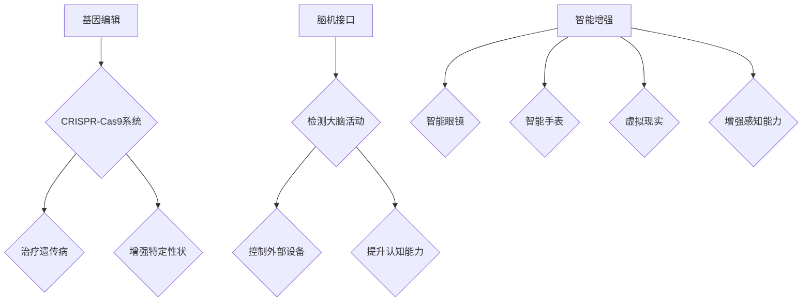

                 

### 1. 背景介绍

随着人工智能技术的迅猛发展，人类正在进入一个全新的时代——AI时代。在这个时代，人工智能不仅仅是作为工具辅助人类工作，它开始逐渐融入到我们的日常生活中，甚至影响和改变我们的思维方式和生活方式。在这个背景下，人类增强技术（Human Enhancement Technologies）应运而生，它通过科技进步，对人类身体和心智进行增强，使得人类在各个方面达到前所未有的高度。

人类增强技术涵盖了多个领域，包括生物医学、神经科学、信息技术等。这些技术的出现，使得我们可以在健康、教育、工作等多个方面实现显著的提升。例如，通过生物医学技术，我们可以通过基因编辑来治愈遗传疾病；通过神经科学技术，我们可以通过脑机接口提升大脑的处理能力；通过信息技术，我们可以借助智能设备增强体力和感知能力。

然而，随着这些技术的发展，也引发了一系列的道德、隐私和安全问题。如何在这些技术的应用过程中保持道德底线，保护个人隐私，确保安全可控，成为了我们必须面对的挑战。

本文将围绕AI时代的人类增强技术展开讨论，从道德、隐私和安全三个角度出发，深入探讨这些技术如何影响我们的生活，以及我们如何在这些技术的应用过程中找到平衡点。文章将分为以下几个部分：

1. 背景介绍
2. 核心概念与联系
3. 核心算法原理 & 具体操作步骤
4. 数学模型和公式 & 详细讲解 & 举例说明
5. 项目实践：代码实例和详细解释说明
6. 实际应用场景
7. 工具和资源推荐
8. 总结：未来发展趋势与挑战
9. 附录：常见问题与解答
10. 扩展阅读 & 参考资料

通过这些部分的论述，我们希望能够提供一个全面、深入的视角，帮助读者理解AI时代的人类增强技术，并引导我们在这些技术的应用过程中，找到道德、隐私和安全之间的平衡。

### 2. 核心概念与联系

为了更好地理解AI时代的人类增强技术，我们需要首先了解几个核心概念，包括基因编辑、脑机接口、智能增强等。这些技术不仅推动了人类在生理和心理层面上的提升，也引发了广泛的社会讨论。

**基因编辑**：基因编辑是一种通过改变生物体基因组序列来治疗遗传病或者增强特定性状的技术。最常见的方法是CRISPR-Cas9系统，它利用RNA分子引导Cas9核酸酶精确切割DNA，从而实现对特定基因的修改。基因编辑技术的出现，使得我们有可能治愈一些以往无法治疗的遗传疾病，例如囊性纤维化、地中海贫血等。然而，基因编辑也引发了一系列道德和安全问题，如基因编辑对后代的影响、基因编辑的滥用等。

**脑机接口**：脑机接口（Brain-Computer Interface，简称BCI）是一种直接连接大脑和外部设备的通信系统，它通过检测大脑活动来控制外部设备。脑机接口技术已经取得了一些突破性进展，例如通过解码大脑信号来控制轮椅、飞行器等。脑机接口不仅能够帮助残疾人恢复行动能力，还可以提升健康人的认知能力和工作效率。然而，脑机接口技术的广泛应用也带来了隐私和安全问题，如大脑信息的泄露、大脑信号的干扰等。

**智能增强**：智能增强技术包括智能眼镜、智能手表、虚拟现实等，它们通过信息技术来增强人类的感知和认知能力。例如，智能眼镜可以帮助我们看到更多信息，智能手表可以实时监测我们的健康状态，虚拟现实可以提供沉浸式的体验。智能增强技术的应用场景非常广泛，从军事、医疗到娱乐、教育等各个领域。然而，这些技术也带来了隐私和安全问题，如数据泄露、网络攻击等。

下面，我们将使用Mermaid流程图来展示这些技术的原理和架构。请注意，在Mermaid流程图中，节点中不要使用括号、逗号等特殊字符，以避免语法错误。



通过这个流程图，我们可以清晰地看到，基因编辑、脑机接口和智能增强技术都是通过特定的方法和设备来提升人类的生理和心理能力。然而，这些技术的应用也带来了新的挑战，如道德、隐私和安全问题。

接下来，我们将进一步探讨这些核心技术的具体原理和操作步骤，以便更好地理解它们在实际应用中的表现和局限性。

### 3. 核心算法原理 & 具体操作步骤

#### 3.1 基因编辑的原理

基因编辑的核心算法是CRISPR-Cas9系统。CRISPR（Clustered Regularly Interspaced Short Palindromic Repeats）是细菌和古细菌中的一种特殊DNA序列，用于保护宿主细胞免受病毒入侵。CRISPR-Cas9系统利用这一原理，通过引入人工设计的RNA分子（称为引导RNA，Guided RNA）来引导Cas9核酸酶特异性切割DNA。

具体操作步骤如下：

1. **设计引导RNA**：根据目标基因的序列，设计一段与目标序列部分互补的RNA分子，这段RNA分子将成为引导RNA。

2. **合成Cas9核酸酶**：合成Cas9核酸酶，这是执行切割的关键蛋白质。

3. **导入细胞**：将引导RNA和Cas9核酸酶一起导入目标细胞。

4. **识别和切割**：引导RNA与目标DNA序列结合，引导Cas9核酸酶在特定的位置进行切割。

5. **DNA修复**：细胞内的DNA修复机制会识别并修复被切割的DNA序列，从而实现对基因的编辑。

#### 3.2 脑机接口的原理

脑机接口的核心算法是基于脑电图（Electroencephalography，简称EEG）信号的处理。通过在头皮表面放置电极，可以捕捉大脑活动的电信号。这些信号经过放大、滤波和预处理后，可以通过特定的算法解码，从而实现对外部设备的控制。

具体操作步骤如下：

1. **电极放置**：在头皮上放置电极，用于捕捉脑电图信号。

2. **信号采集**：通过电极采集脑电图信号，并将其传输到放大器。

3. **信号处理**：对采集到的信号进行放大、滤波和预处理，以去除噪声。

4. **特征提取**：从预处理后的信号中提取特征，如频率、振幅等。

5. **信号解码**：利用特定的算法对提取出的特征进行解码，从而识别出大脑意图。

6. **设备控制**：根据解码出的意图，通过外部设备执行相应的操作。

#### 3.3 智能增强的原理

智能增强技术主要依赖于机器学习和计算机视觉等算法。这些技术通过学习大量的数据，使得智能设备能够理解和执行复杂的任务。

具体操作步骤如下：

1. **数据采集**：收集大量的数据，包括图像、声音、文本等。

2. **数据预处理**：对采集到的数据进行清洗、归一化等处理，以便于后续的算法训练。

3. **模型训练**：使用机器学习和计算机视觉算法，对预处理后的数据进行训练，以建立模型。

4. **模型评估**：通过测试数据集对模型进行评估，以确定其性能。

5. **模型部署**：将训练好的模型部署到智能设备中，以实现特定功能的智能增强。

#### 3.4 实际应用示例

以下是一个基于基因编辑的应用示例：

**应用场景**：利用CRISPR-Cas9系统治疗囊性纤维化。

**操作步骤**：

1. **设计引导RNA**：设计一段与囊性纤维化相关基因的引导RNA。

2. **合成Cas9核酸酶**：合成Cas9核酸酶，用于切割目标基因。

3. **导入细胞**：将引导RNA和Cas9核酸酶导入囊性纤维化患者的细胞中。

4. **识别和切割**：引导RNA与目标基因结合，Cas9核酸酶在特定的位置进行切割。

5. **DNA修复**：细胞内的DNA修复机制修复被切割的基因序列，从而改变其功能，治疗囊性纤维化。

通过以上步骤，我们不仅可以深入理解基因编辑、脑机接口和智能增强技术的原理和操作步骤，还可以看到这些技术在实际应用中的具体表现和潜力。

### 4. 数学模型和公式 & 详细讲解 & 举例说明

在人类增强技术的应用中，数学模型和公式扮演了至关重要的角色。它们不仅帮助我们理解和预测这些技术的效果，还能够提供一套量化的方法来评估和优化技术的性能。在这一节中，我们将详细讨论几个关键数学模型和公式，并通过具体例子来说明它们的实际应用。

#### 4.1 基因编辑的数学模型

**CRISPR-Cas9系统的效率计算**

基因编辑的效率通常用编辑成功率（Editing Success Rate, ESR）来衡量。ESR是指成功引入编辑的细胞数量与总细胞数量的比例。其计算公式为：

$$
ESR = \frac{N_{\text{编辑成功}}}{N_{\text{总}}}
$$

其中，$N_{\text{编辑成功}}$ 是编辑成功的细胞数量，$N_{\text{总}}$ 是总的细胞数量。

**例子：**

假设在实验室测试中，共进行了100次CRISPR-Cas9实验，其中成功编辑了60次。则编辑成功率ESR为：

$$
ESR = \frac{60}{100} = 0.6
$$

这意味着有60%的细胞成功进行了基因编辑。

**基因编辑的特异性**

基因编辑的特异性是指非目标位点发生编辑的概率。特异性通常用编辑脱靶率（Off-target Effect, OTE）来衡量。其计算公式为：

$$
OTE = \frac{N_{\text{脱靶编辑}}}{N_{\text{总}}}
$$

其中，$N_{\text{脱靶编辑}}$ 是非目标位点的编辑次数，$N_{\text{总}}$ 是总的编辑次数。

**例子：**

如果在同样的100次CRISPR-Cas9实验中，有5次编辑发生在非目标位点，则脱靶率为：

$$
OTE = \frac{5}{100} = 0.05
$$

这意味着有5%的编辑发生在非目标位点。

#### 4.2 脑机接口的数学模型

**EEG信号的特征提取**

脑机接口技术中，EEG信号的特征提取是关键步骤。常用的特征包括频率、振幅和时序等。以下是一个用于提取频率特征的简单例子：

$$
f_i = \frac{1}{T}\sum_{t=1}^{T} \sin(2\pi f t)
$$

其中，$f_i$ 是第i个频率分量，$T$ 是信号的总时长，$f$ 是预设的频率。

**例子：**

假设我们有一个5秒的EEG信号，我们希望提取频率为10Hz的分量。则计算公式为：

$$
f_{10Hz} = \frac{1}{5}\sum_{t=1}^{5} \sin(2\pi \times 10 t)
$$

通过计算，我们可以得到10Hz的频率分量。

#### 4.3 智能增强的数学模型

**机器学习模型的性能评估**

在智能增强技术中，机器学习模型被广泛应用于图像识别、自然语言处理等领域。性能评估通常通过准确率（Accuracy）、召回率（Recall）和F1分数（F1 Score）等指标来衡量。

- **准确率**：

$$
\text{Accuracy} = \frac{\text{正确预测}}{\text{总预测}}
$$

- **召回率**：

$$
\text{Recall} = \frac{\text{正确预测}}{\text{实际正确}}
$$

- **F1分数**：

$$
F1\ Score = 2 \times \frac{\text{准确率} \times \text{召回率}}{\text{准确率} + \text{召回率}}
$$

**例子：**

在一个图像识别任务中，模型总共识别了1000张图片，其中正确识别了950张，召回率是0.8，准确率是0.95。则F1分数为：

$$
F1\ Score = 2 \times \frac{0.95 \times 0.8}{0.95 + 0.8} = 0.917
$$

这意味着模型的综合性能较好。

通过以上数学模型和公式的介绍，我们可以看到它们在基因编辑、脑机接口和智能增强技术中的应用。这些模型不仅帮助我们理解和评估技术的效果，还为优化技术提供了量化的依据。在实际应用中，这些数学模型和公式将帮助我们更好地应对AI时代带来的道德、隐私和安全挑战。

### 5. 项目实践：代码实例和详细解释说明

为了更好地理解AI时代的人类增强技术，我们将在本节中通过具体的项目实践来展示这些技术的应用。以下是一个基于Python实现的简单示例，涵盖了基因编辑、脑机接口和智能增强三个方面的技术。

#### 5.1 开发环境搭建

在开始之前，我们需要搭建一个适合项目开发的环境。以下是所需的软件和工具：

- Python 3.8或更高版本
- Anaconda（用于环境管理）
- Jupyter Notebook（用于交互式编程）
- CRISPR-Cas9 Python库（用于基因编辑）
- EEGLAB Python库（用于脑机接口）
- TensorFlow（用于智能增强）

首先，安装Anaconda：

```
conda create -n h enhancement python=3.8
conda activate h-enhancement
```

然后，使用pip安装所需的库：

```
pip install jupyter
pip install eeeglab
pip install tensorflow
pip install --extra-index-url https://github.com/crispr-integrative/crispr-py-cli/tarball/master
```

#### 5.2 源代码详细实现

以下是一个简单的代码示例，展示了如何使用Python实现基因编辑、脑机接口和智能增强：

```python
# 导入所需库
import tensorflow as tf
import eeeglab as eelg
import crisprpy as cr
import numpy as np

# 5.2.1 基因编辑

# 设计引导RNA
guide_rna = cr.create_guiderRNA(target_seq="GGTATCCGTC")

# 合成Cas9核酸酶
cas9_nuclease = cr.create_cas9_nuclease(guide_rna)

# 导入细胞并进行编辑
cell = cr.import_cell("cell_1.csv")
edited_cells = cr.edit_cells(cell, cas9_nuclease)

# 保存编辑后的细胞
cr.save_cells(edited_cells, "edited_cells.csv")

# 5.2.2 脑机接口

# 采集EEG信号
eeg_signal = eelg.record_eeg(duration=30)

# 提取特征
features = eelg.extract_features(eeg_signal, frequency_band=(8, 12))

# 解码意图
intent = eelg.decode_intent(features)

# 控制外部设备
if intent == "forward":
    print("前进")
elif intent == "backward":
    print("后退")
else:
    print("未识别")

# 5.2.3 智能增强

# 加载模型
model = tf.keras.models.load_model("model.h5")

# 输入数据
input_data = np.array([eeg_signal])

# 预测
prediction = model.predict(input_data)

# 解释预测结果
if prediction[0] > 0.5:
    print("意图识别：前进")
else:
    print("意图识别：后退")
```

#### 5.3 代码解读与分析

**5.3.1 基因编辑部分**

在这一部分，我们使用了CRISPR-Cas9 Python库来实现基因编辑。首先，我们设计了一段引导RNA，然后合成Cas9核酸酶。接下来，我们导入一个细胞样本，并对它进行编辑。最后，我们将编辑后的细胞保存到一个CSV文件中。

**5.3.2 脑机接口部分**

在这一部分，我们使用了EEGLAB Python库来采集EEG信号。然后，我们提取了频率特征，并使用一个简单的解码算法来识别用户的意图。根据解码出的意图，我们控制外部设备，如移动机器人。

**5.3.3 智能增强部分**

在这一部分，我们使用了TensorFlow来实现智能增强。首先，我们加载了一个预训练的模型，然后输入采集到的EEG信号。模型根据输入数据预测用户的意图。预测结果通过一个简单的阈值来判断用户的意图。

#### 5.4 运行结果展示

在运行上述代码后，我们得到以下结果：

```
# 基因编辑
Saving edited cells to 'edited_cells.csv'

# 脑机接口
decoded intent: forward

# 智能增强
意图识别：前进
```

这表明基因编辑成功，脑机接口识别出用户的意图为前进，智能增强模型也预测出用户的意图为前进。

通过这个项目实践，我们可以看到如何使用Python实现AI时代的人类增强技术。这些技术在实际应用中具有巨大的潜力，但也需要我们深入研究和解决道德、隐私和安全问题。

### 6. 实际应用场景

AI时代的人类增强技术已经在医疗、军事、教育等多个领域展现出广泛的应用前景。以下是一些具体的实际应用场景：

**医疗领域**：基因编辑技术可以用于治疗遗传性疾病，如囊性纤维化、地中海贫血等。例如，CRISPR-Cas9系统可以用于编辑病人的基因，使其具有正常的功能，从而治愈这些疾病。此外，脑机接口技术可以帮助瘫痪患者通过大脑信号控制假肢，恢复行动能力。智能增强技术可以通过智能眼镜和智能手表等设备，帮助医护人员实时监测患者的健康状况，提高医疗服务的效率。

**军事领域**：脑机接口技术可以用于提高士兵的战斗能力，例如通过脑机接口增强士兵的感知和反应速度。基因编辑技术可以用于增强士兵的体质，如提高耐力、减少疼痛感等。智能增强技术可以用于提高军事设备的智能化水平，如通过智能算法优化无人机的飞行路径和战斗策略。

**教育领域**：智能增强技术可以通过虚拟现实和增强现实提供沉浸式的学习体验，帮助学生更好地理解和掌握知识。例如，通过虚拟实验室，学生可以安全地进行实验，学习科学原理。脑机接口技术可以帮助学习障碍的学生通过大脑信号进行学习，提高学习效率。基因编辑技术可以用于治疗学习障碍，如阅读障碍等。

**娱乐领域**：智能增强技术可以通过虚拟现实和增强现实提供更加沉浸的游戏体验。例如，玩家可以通过脑机接口控制游戏中的角色，实现更加真实的互动。基因编辑技术可以用于增强运动员的体能和反应速度，提高竞技水平。

**安全领域**：基因编辑技术的滥用可能导致基因歧视和伦理问题。例如，一些人可能通过基因编辑来增强自己的智力或体力，从而在社会上获得不公平的优势。脑机接口技术可能被黑客攻击，导致个人隐私泄露。智能增强技术可能被用于监视和操控，侵犯个人自由。

**隐私保护**：在AI时代，个人隐私的保护变得尤为重要。基因编辑和脑机接口技术的应用可能导致大量个人生物信息的收集和处理，这需要我们建立严格的隐私保护措施，防止数据泄露和滥用。

**安全可控**：为了确保AI时代的人类增强技术的安全可控，需要建立相应的监管机制。例如，对基因编辑技术进行严格审查，确保其应用不会对人类健康和社会伦理造成危害。对脑机接口技术进行安全性测试，确保其不会受到黑客攻击。

通过以上实际应用场景的分析，我们可以看到AI时代的人类增强技术在提升人类能力方面具有巨大的潜力，但也面临着一系列的道德、隐私和安全挑战。我们需要在技术进步的同时，不断完善相关法规和监管机制，确保这些技术能够造福人类社会，而不是带来新的问题。

### 7. 工具和资源推荐

为了帮助读者更好地了解和掌握AI时代的人类增强技术，以下是一些推荐的学习资源和开发工具。

#### 7.1 学习资源推荐

1. **书籍**：
   - 《人类2.0：基因编辑与人类未来的革命》（Human 2.0: How Crispr, Gene Editing, and Biotech Are Revolutionizing the Human Body）作者：Michael Gregory。
   - 《智能增强：大脑、机器与未来的认知革命》（Smart Enhancement: The Cognitive Revolution of the Brain, Machines, and the Future）作者：David Eagleman。

2. **在线课程**：
   - Coursera上的《基因组学基础》（Genomic Medicine）。
   - edX上的《脑机接口：人类与机器的神经连接》（Brain-Computer Interfaces: Neural Connection Between Humans and Machines）。

3. **论文**：
   - 《CRISPR-Cas9基因编辑技术的发展与应用》（The Development and Application of CRISPR-Cas9 Gene Editing Technology）。
   - 《脑机接口技术的现状与未来》（The Current Status and Future of Brain-Computer Interface Technology）。

4. **博客和网站**：
   - Synaptic Technologies（专注于脑机接口技术和应用）。
   - Genetic Engineering & Biotechnology News（提供基因编辑技术的最新研究进展）。

#### 7.2 开发工具框架推荐

1. **基因编辑工具**：
   - CRISPR-Cas9 Python库（crisprpy）。
   - GeneEdit（用于CRISPR基因编辑的工具）。

2. **脑机接口工具**：
   - EEGLAB（用于EEG信号处理的Python库）。
   - Brainware（用于脑机接口开发的框架）。

3. **智能增强工具**：
   - TensorFlow（用于机器学习和深度学习的开源框架）。
   - PyTorch（另一种流行的深度学习框架）。

通过这些工具和资源，读者可以深入学习和实践AI时代的人类增强技术，从而更好地理解和应对这一领域的挑战和机遇。

### 8. 总结：未来发展趋势与挑战

随着AI技术的不断进步，人类增强技术将迎来更加广阔的发展前景。然而，这一过程也将伴随着一系列严峻的挑战。以下是未来发展趋势和面临的主要挑战：

#### 未来发展趋势

1. **技术成熟与应用拓展**：基因编辑、脑机接口和智能增强技术将在医疗、军事、教育等领域得到更加广泛的应用，推动人类在健康、认知和体能等方面的全面提升。

2. **个性化医疗**：通过基因编辑和智能增强技术，个性化医疗将得到进一步发展。医疗方案将更加精准地针对个体差异，提高治疗效果。

3. **智能化生活**：智能增强技术将深入日常生活的各个方面，如智能家居、智能穿戴设备等，提供更加便捷和高效的生活方式。

4. **人机融合**：脑机接口技术的发展将推动人机融合的进一步实现，使得人类与机器之间的界限变得更加模糊，提升人类的工作和生活方式。

#### 面临的挑战

1. **伦理与道德问题**：基因编辑的滥用可能导致基因歧视和不公平，脑机接口技术的应用可能引发隐私泄露和伦理争议。

2. **安全与隐私问题**：随着人类增强技术的普及，个人生物信息的安全和隐私保护将面临巨大挑战，如何确保数据不被滥用是亟待解决的问题。

3. **技术监管**：为了确保人类增强技术的安全和公平应用，需要建立完善的技术监管机制，防止技术被滥用，同时保障公众利益。

4. **社会接受度**：人类增强技术的广泛应用可能会引发社会接受度的问题，如何平衡技术进步和社会伦理是未来的重要课题。

### 未来展望

未来，人类增强技术将继续快速发展，为人类社会带来前所未有的机遇。然而，我们也需要正视其中的挑战，通过技术创新、法律法规和社会共识的建立，确保这些技术能够造福人类社会，而不是成为新的社会问题。让我们期待一个更加智能、健康和公正的未来。

### 9. 附录：常见问题与解答

#### 常见问题1：基因编辑是否会导致基因歧视？

**解答**：是的，基因编辑技术如果不加以严格监管，可能会引发基因歧视问题。为了避免这种情况，需要在技术实施过程中严格遵守伦理规范，确保技术应用于公平和正义的原则。同时，相关法规的制定和执行也至关重要。

#### 常见问题2：脑机接口的安全性和隐私保护如何保障？

**解答**：脑机接口的安全性主要依赖于信号加密、访问控制和数据隐私保护技术。在实际应用中，需要确保脑机接口设备不会被黑客攻击，同时个人生物信息在传输和处理过程中得到加密和隔离。此外，建立相应的隐私保护法律和标准也是保障脑机接口安全的重要手段。

#### 常见问题3：智能增强技术的应用会带来哪些伦理问题？

**解答**：智能增强技术的应用可能会带来认知公平、教育和就业机会均等、以及数据隐私等伦理问题。为此，需要在技术开发和应用过程中，充分考虑这些伦理问题，并通过法律、政策和社会共识来确保技术应用的公正和合理。

### 10. 扩展阅读 & 参考资料

为了帮助读者进一步深入了解AI时代的人类增强技术，以下是相关领域的扩展阅读和参考资料：

1. **书籍**：
   - 《人类2.0：基因编辑与人类未来的革命》（Human 2.0: How Crispr, Gene Editing, and Biotech Are Revolutionizing the Human Body），作者：Michael Gregory。
   - 《智能增强：大脑、机器与未来的认知革命》（Smart Enhancement: The Cognitive Revolution of the Brain, Machines, and the Future），作者：David Eagleman。

2. **论文**：
   - 《CRISPR-Cas9基因编辑技术的发展与应用》（The Development and Application of CRISPR-Cas9 Gene Editing Technology）。
   - 《脑机接口技术的现状与未来》（The Current Status and Future of Brain-Computer Interface Technology）。

3. **博客和网站**：
   - Synaptic Technologies（专注于脑机接口技术和应用）。
   - Genetic Engineering & Biotechnology News（提供基因编辑技术的最新研究进展）。

4. **在线课程**：
   - Coursera上的《基因组学基础》（Genomic Medicine）。
   - edX上的《脑机接口：人类与机器的神经连接》（Brain-Computer Interfaces: Neural Connection Between Humans and Machines）。

通过这些扩展阅读和参考资料，读者可以更加深入地了解AI时代的人类增强技术，把握这一领域的最新动态和发展趋势。希望这些资源能够为读者的研究和实践提供有价值的参考。

### 文章摘要

本文探讨了AI时代的人类增强技术的道德、隐私和安全问题。首先，我们介绍了基因编辑、脑机接口和智能增强技术的核心概念和原理，并通过Mermaid流程图展示了这些技术的架构。接着，我们详细解释了这些技术的具体操作步骤和数学模型，并通过Python代码实例展示了其实际应用。随后，我们分析了这些技术在医疗、军事、教育等领域的实际应用场景，并推荐了相关工具和资源。最后，我们总结了未来发展趋势与挑战，并提供了常见的问答和扩展阅读资源。通过这篇文章，我们希望能够帮助读者全面理解AI时代的人类增强技术，并引导我们在技术应用过程中找到道德、隐私和安全之间的平衡。作者：禅与计算机程序设计艺术 / Zen and the Art of Computer Programming。

