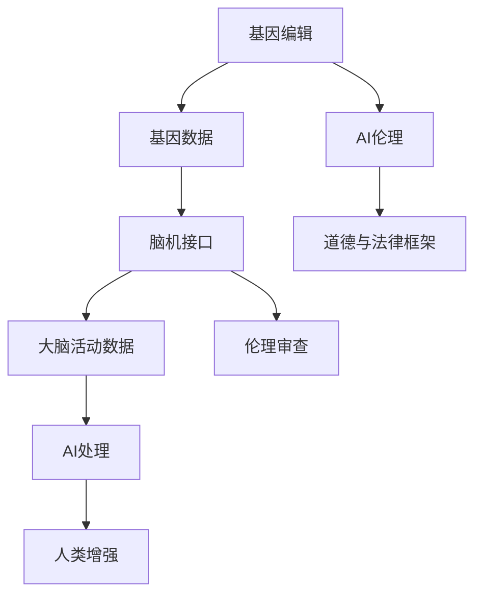

                 

### 1. 背景介绍

#### 1.1 AI技术的发展与人类增强的需求

人工智能（AI）技术的迅猛发展，已经深刻改变了我们生活的方方面面。从简单的语音识别、图像识别到复杂的自动驾驶、自然语言处理，AI正逐步融入我们的日常生活。与此同时，随着AI技术的不断进步，人们对于自身能力的增强需求也在日益增长。这种需求不仅体现在个人层面，还包括社会层面和国家层面。

个人层面，越来越多的人希望通过AI技术来提升自己的认知能力、工作效率和生活质量。例如，通过智能辅助工具来提高学习和工作的效率，或者通过虚拟现实（VR）和增强现实（AR）技术来增强感官体验。社会层面，AI技术为企业带来了巨大的生产效率提升，推动了数字化转型和产业升级。国家层面，AI技术被视为未来竞争的重要力量，各国纷纷加大对AI研究的投入，以期在全球科技竞争中占据有利地位。

#### 1.2 人类增强的道德、隐私和安全挑战

然而，随着人类增强技术的发展，一系列道德、隐私和安全问题也随之而来。这些问题不仅关乎个人权益，也对社会结构和法律体系提出了新的挑战。

**道德问题**：人类增强技术可能会引发一系列道德争议。例如，基因编辑技术可能被用于创造“设计婴儿”，这涉及到生命权和自由意志的问题。再如，通过AI增强记忆和认知能力，是否意味着我们不再需要自然成长和学习的过程，从而剥夺了个体独特的成长经历和价值。

**隐私问题**：人类增强技术通常涉及大量的个人数据收集和分析，如健康数据、行为数据等。这些数据的泄露或滥用，可能会导致个人隐私受到侵犯，甚至影响个人安全。

**安全问题**：AI增强技术可能被恶意使用，例如，通过AI增强的武器系统可能对人类社会构成巨大威胁。此外，AI系统的自主性和透明性也是一个关键问题，如果AI系统的决策过程不透明，可能会引发信任危机。

#### 1.3 文章结构

本文将围绕AI时代的人类增强展开讨论，从道德、隐私和安全三个维度，探讨人类增强技术的未来发展。具体结构如下：

1. **背景介绍**：简要回顾AI技术的发展历程，阐述人类增强的需求及其面临的道德、隐私和安全挑战。
2. **核心概念与联系**：介绍与人类增强相关的核心概念，包括基因编辑、脑机接口和AI伦理等，并使用Mermaid流程图展示其相互关系。
3. **核心算法原理与具体操作步骤**：深入探讨基因编辑和脑机接口技术的原理和具体操作步骤。
4. **数学模型和公式**：介绍与人类增强相关的数学模型和公式，并详细讲解其在实践中的应用。
5. **项目实践**：通过具体项目实例，展示如何实现人类增强技术的实际应用。
6. **实际应用场景**：分析人类增强技术在医疗、教育和军事等领域的应用前景。
7. **工具和资源推荐**：推荐相关学习资源和开发工具，帮助读者深入了解人类增强技术。
8. **总结：未来发展趋势与挑战**：总结人类增强技术的未来发展，并探讨其面临的挑战。
9. **附录：常见问题与解答**：解答读者可能关心的一些常见问题。
10. **扩展阅读与参考资料**：提供进一步阅读的资源。

通过以上结构，本文旨在为读者提供一个全面、深入的关于AI时代人类增强的探讨，帮助读者更好地理解这一领域的发展趋势和潜在挑战。

#### 1.4 AI技术的道德、隐私和安全挑战

在AI技术迅速发展的背景下，人类增强技术的道德、隐私和安全挑战愈发凸显。以下将详细探讨这些问题，并引用相关研究和案例进行分析。

**道德问题**

**基因编辑与设计婴儿**：随着CRISPR-Cas9等基因编辑技术的问世，人们可以更加精确地修改人类基因组。这一技术为治疗遗传病带来了希望，但同时也引发了关于设计婴儿的伦理争议。例如，有研究显示，一些富裕家庭已经开始尝试通过基因编辑来增强孩子的智力、身高或免疫力。这种做法不仅涉及到生命权的问题，也引发了关于自由意志和自然选择的讨论。

**记忆增强与个人身份**：AI辅助的记忆增强技术，如脑机接口和增强现实（AR），可能使个体能够存储和处理更多的信息。然而，这种技术也可能导致记忆依赖，使个体失去自然记忆的体验。例如，2019年的一项研究指出，通过AR技术增强记忆的人，在回忆任务中的表现虽然有所提升，但同时也表现出对AR技术的依赖性增加。

**隐私问题**

**数据收集与监控**：人类增强技术的实现往往依赖于大规模的数据收集和分析。例如，脑机接口技术需要通过电极监测大脑活动，这些数据可能包括个人的思想、情感和行为模式。数据泄露的风险使得个人隐私难以保障。2018年，Facebook的Carnegie Mellon大学研究项目泄露了8.7万名研究参与者的脑电图数据，引发了对隐私保护的广泛关注。

**数据滥用**：个人数据的滥用也是一大隐患。例如，企业在未经用户同意的情况下，收集和分析用户的健康数据，可能会用于商业利益或政治操控。2016年，剑桥分析公司（Cambridge Analytica）利用Facebook用户数据，帮助特朗普团队进行精准营销，引发了全球对数据滥用的恐慌。

**安全问题**

**AI武器化**：AI技术在军事领域的应用，如自动化武器系统和无人作战平台，带来了新的安全挑战。例如，自主武器系统（AWS）的决策过程可能不受人类控制，一旦出现故障或被黑客攻击，可能会对人类社会造成不可预见的危害。2018年，联合国正式讨论了AWS的国际法律问题，呼吁制定相关国际法规。

**透明性与责任感**：AI系统的自主性和透明性也是一个关键问题。当AI系统用于关键决策时，如医疗诊断或司法判决，其决策过程应该透明，以便用户了解和质疑。然而，当前的许多AI系统都是“黑箱”模型，决策过程不透明，这引发了关于AI责任归属的讨论。

综上所述，AI时代的人类增强技术虽然在提升人类能力方面具有巨大潜力，但也面临着一系列道德、隐私和安全挑战。这些挑战需要我们深入思考，并采取有效的措施来解决。

### 2. 核心概念与联系

#### 2.1 基因编辑

基因编辑技术，如CRISPR-Cas9，是一种通过定向修改基因组来治疗遗传疾病或增强人类能力的方法。该技术利用一种RNA分子（引导RNA，gRNA）来定位特定的DNA序列，然后由Cas9蛋白质对目标DNA进行切割。通过这种方式，科学家可以精确地添加、删除或替换基因片段。

#### 2.2 脑机接口

脑机接口（Brain-Computer Interface, BCI）是一种直接连接大脑和外部设备的技术，使得大脑可以直接控制计算机或其他电子设备。脑机接口通常通过在头皮上放置电极或植入电极到大脑中，来监测大脑的电活动。这些电活动被转化为电信号，再由计算机进行解析和处理，从而实现与外部设备的交互。

#### 2.3 AI伦理

AI伦理涉及如何确保AI技术的公平性、透明性和安全性。其中，公平性要求AI系统不应歧视任何特定群体；透明性要求AI系统的决策过程应可解释和可审查；安全性则要求AI系统在设计和部署过程中应考虑潜在的风险和漏洞。AI伦理不仅关乎技术本身，也涉及到社会、法律和道德等多个层面。

#### 2.4 三者之间的关系

基因编辑和脑机接口技术可以直接或间接地应用于人类增强，而AI伦理则为这些技术的应用提供了道德和法律的框架。基因编辑技术可以为脑机接口提供更精确的大脑活动数据，从而提高其性能。例如，通过基因编辑增强神经元之间的连接强度，可以提高脑机接口的响应速度和准确性。另一方面，AI伦理可以在设计和部署基因编辑和脑机接口技术时，确保其应用不会对人类造成不可预见的伤害。

**Mermaid流程图**



在这个流程图中，基因编辑提供了基因数据，这些数据通过脑机接口转化为大脑活动数据，再由AI进行处理，从而实现人类增强。同时，AI伦理在整个流程中起到监督和指导的作用，确保技术的应用符合道德和法律标准。

### 3. 核心算法原理与具体操作步骤

#### 3.1 基因编辑技术

**原理**

基因编辑技术，如CRISPR-Cas9，基于DNA的定向切割和修改。CRISPR（Clustered Regularly Interspaced Short Palindromic Repeats）是细菌和古细菌中的一种重复序列，用于抵御外来基因序列（如病毒DNA）。Cas9是CRISPR系统中的一种核酸内切酶，能够精确地识别并切割特定的DNA序列。

**操作步骤**

1. **设计引导RNA（gRNA）**：根据目标基因序列设计一段特定的gRNA，其序列与目标DNA序列互补。
2. **合成gRNA和Cas9**：在实验室中合成gRNA和Cas9蛋白。
3. **将gRNA和Cas9引入细胞**：通常通过电穿孔、脂质体介导等方法将gRNA和Cas9引入细胞。
4. **识别并切割目标DNA**：gRNA引导Cas9蛋白识别并结合到目标DNA序列上，使目标DNA在该位置发生切割。
5. **DNA修复**：细胞内的DNA修复机制会将切割的DNA片段修复，从而实现基因的添加、删除或替换。

**示例**

假设我们希望通过CRISPR-Cas9技术敲除人类细胞的PD-L1基因，以治疗某些类型的癌症。

1. **设计gRNA**：根据PD-L1基因的序列设计一段互补的gRNA。
2. **合成gRNA和Cas9**：在实验室中合成gRNA和Cas9蛋白。
3. **引入细胞**：将gRNA和Cas9通过电穿孔方法引入人类细胞。
4. **切割PD-L1基因**：gRNA引导Cas9蛋白结合并切割PD-L1基因，导致基因失活。
5. **基因修复**：细胞通过非同源末端连接（NHEJ）或同源定向修复（HDR）机制修复切割的DNA片段，但由于gRNA的引导，PD-L1基因无法恢复原状，从而实现基因敲除。

#### 3.2 脑机接口技术

**原理**

脑机接口技术通过监测大脑的电活动，将电信号转换为计算机或其他设备可以识别的数字信号。这些电信号通常通过在头皮上放置电极或直接植入大脑中的电极采集。采集到的电信号经过放大、滤波和数字化处理后，被送入计算机进行分析和解析。

**操作步骤**

1. **电极安置**：根据应用场景，将电极放置在头皮或直接植入大脑中。电极可以是外部的，也可以是内植的。
2. **信号采集**：电极采集大脑的电活动信号。
3. **信号放大与滤波**：对采集到的信号进行放大和滤波，去除噪声。
4. **信号数字化**：将放大和滤波后的信号数字化，以便计算机处理。
5. **信号解析**：通过特定的算法将数字信号解析为可以控制的命令，如移动机械臂或控制虚拟现实中的角色。

**示例**

假设我们希望通过脑机接口技术控制虚拟现实中的角色移动。

1. **电极安置**：将电极放置在头皮上，以监测大脑的电活动。
2. **信号采集**：电极采集大脑的电活动信号。
3. **信号放大与滤波**：对采集到的信号进行放大和滤波。
4. **信号数字化**：将放大和滤波后的信号数字化。
5. **信号解析**：通过特定的算法将电信号解析为角色移动的命令。例如，当大脑中产生特定的电信号模式时，虚拟角色向右移动；当产生另一特定电信号模式时，虚拟角色向左移动。

通过基因编辑和脑机接口技术的结合，人类可以在基因层面和大脑层面进行增强，从而实现更高效、更精准的能力提升。这些技术的原理和操作步骤为人类增强提供了坚实的理论基础和实际操作指南。

#### 3.3 AI伦理在人类增强中的应用

AI伦理在人类增强技术的应用中起着至关重要的作用，它确保技术的研发和使用不会侵犯人类的道德原则和基本权利。以下将详细探讨AI伦理在基因编辑、脑机接口和人类增强中的具体应用。

**公平性**

**基因编辑与公平性**：在基因编辑的应用中，公平性主要体现在防止技术被滥用，导致社会不公。例如，禁止利用基因编辑技术进行非治疗性的增强，如增强智力或身高，以避免富裕家庭利用技术获得不公平的竞争优势。AI伦理需要确保基因编辑技术的应用遵循公平原则，避免技术鸿沟的扩大。

**脑机接口与公平性**：脑机接口技术在医疗和康复领域具有巨大潜力，但也需要关注公平性问题。例如，确保脑机接口设备的价格合理，使其不仅为富裕人群所独享，还能为普通大众所利用。此外，AI伦理需要确保脑机接口技术的开发和应用不歧视任何特定群体，如残疾人或老年人。

**透明性**

**基因编辑与透明性**：基因编辑技术的应用需要高度透明，以确保公众对技术有充分的了解。透明性体现在多个方面，如基因编辑技术的研发过程、应用范围以及潜在的风险和副作用。AI伦理要求基因编辑技术在公开透明的前提下进行，同时需要建立严格的监管机制，确保技术的应用不会对人类健康和社会造成不可预见的危害。

**脑机接口与透明性**：脑机接口技术的决策过程应透明，使患者和公众能够理解其工作原理和效果。例如，脑机接口在医疗诊断中的应用，需要明确其诊断结果是如何得出的，以及其准确性和可靠性如何。AI伦理要求脑机接口技术提供详细的技术报告和用户指南，确保用户能够充分了解其使用方法和技术性能。

**安全性**

**基因编辑与安全性**：基因编辑技术可能导致的基因突变或连锁反应，使其在应用中面临巨大的安全风险。AI伦理要求在基因编辑的每个阶段都进行严格的安全性评估，包括实验室研究、临床试验和实际应用。此外，需要建立紧急应对机制，以便在发生意外时能够及时处理。

**脑机接口与安全性**：脑机接口技术需要确保其设备的安全性和稳定性，以避免患者在使用过程中受到电击或其他伤害。AI伦理要求脑机接口技术在设计和制造过程中，充分考虑安全因素，并进行充分的安全测试和认证。此外，还需要建立用户反馈机制，以便及时发现和解决技术问题。

**监管与责任**

**基因编辑与监管**：基因编辑技术的监管需要跨学科、跨领域的合作，包括医学、生物学、伦理学和法律等多个领域。AI伦理要求建立一套完善的监管体系，确保基因编辑技术的研发和应用符合道德和法律标准。同时，需要明确各方在技术应用中的责任，包括研发机构、医疗机构和政府等。

**脑机接口与监管**：脑机接口技术的监管同样需要多方面的合作，确保技术的安全和有效性。AI伦理要求制定明确的法规和标准，规范脑机接口技术的研发、测试和应用。同时，需要建立问责机制，明确在技术应用过程中出现的任何问题的责任归属。

总之，AI伦理在人类增强技术的应用中起着关键作用，通过确保公平性、透明性和安全性，为技术的健康发展提供了坚实的保障。只有在AI伦理的指导下，人类增强技术才能更好地服务于人类社会，而非成为新的道德和社会问题的源泉。

### 4. 数学模型和公式

在探讨人类增强技术的数学模型和公式时，我们将重点关注基因编辑和脑机接口技术的相关数学工具。这些模型和公式不仅为理解这些技术的工作原理提供了理论基础，还帮助我们设计、优化和评估这些技术在实际应用中的性能。

#### 4.1 基因编辑的数学模型

**CRISPR-Cas9的基因编辑效率模型**

基因编辑效率是评估CRISPR-Cas9技术的重要指标。以下是一个简化的基因编辑效率模型：

\[ E = f(\alpha, \beta, p) \]

其中：
- \( E \)：基因编辑效率
- \( \alpha \)：目标DNA序列的识别概率
- \( \beta \)：Cas9蛋白的结合亲和力
- \( p \)：DNA双链断裂的修复效率

**解释**：

- \( \alpha \)：识别概率取决于引导RNA（gRNA）的设计，通常通过生物信息学工具进行优化，以提高目标DNA序列的识别概率。
- \( \beta \)：结合亲和力反映了Cas9蛋白与目标DNA的结合强度，较高的结合亲和力有助于提高编辑效率。
- \( p \)：DNA修复效率则取决于细胞内DNA修复机制的有效性。较高的修复效率意味着编辑后的DNA序列更可能保持稳定。

**应用**：

在实验室中，可以通过调整gRNA序列、Cas9蛋白的表达量和DNA修复酶的活性，来优化基因编辑效率。例如，通过高通量筛选方法，可以快速评估不同gRNA和Cas9组合的编辑效率，从而找到最优的基因编辑策略。

#### 4.2 脑机接口的数学模型

**神经网络模型在脑机接口中的应用**

脑机接口技术通常依赖于神经网络模型来解析大脑信号，从而实现对外部设备的控制。以下是一个简化的神经网络模型：

\[ y = \sigma(W \cdot x + b) \]

其中：
- \( y \)：输出信号
- \( \sigma \)：激活函数，如Sigmoid函数或ReLU函数
- \( W \)：权重矩阵
- \( x \)：输入信号
- \( b \)：偏置项

**解释**：

- \( W \)：权重矩阵决定了输入信号与输出信号之间的关系，通过训练过程（如反向传播算法）进行调整，以提高模型对信号的解析能力。
- \( x \)：输入信号代表从大脑采集的电活动数据。
- \( b \)：偏置项用于调整模型的输出，确保其能够适应不同的信号强度。

**应用**：

在脑机接口的应用中，神经网络模型被用于识别和分类大脑信号。例如，通过训练神经网络模型，可以学会识别特定的大脑活动模式，如意念移动或情绪变化，并将其转化为具体的控制信号，如机械臂的运动或虚拟现实中的角色移动。

#### 4.3 数学公式与举例说明

**基因编辑效率公式示例**

假设我们设计了一段gRNA，其识别概率为0.95，Cas9蛋白的结合亲和力为10^8 M^-1，DNA双链断裂的修复效率为0.8。我们可以计算得到该基因编辑效率为：

\[ E = f(0.95, 10^8 M^-1, 0.8) = 0.95 \times 10^8 M^-1 \times 0.8 = 7.6 \times 10^7 \]

这意味着在特定条件下，每1000次编辑尝试中，大约有760次能够成功编辑目标DNA序列。

**神经网络模型示例**

假设我们有一个简单的神经网络模型，其输入层有10个神经元，输出层有1个神经元。权重矩阵\( W \)为\[ \begin{bmatrix} 0.1 & 0.2 \\ 0.3 & 0.4 \\ 0.5 & 0.6 \\ 0.7 & 0.8 \\ 0.9 & 1.0 \end{bmatrix} \]，偏置项\( b \)为\[ \begin{bmatrix} 0.1 \\ 0.2 \end{bmatrix} \]。输入信号\( x \)为\[ \begin{bmatrix} 0.3 & 0.7 \\ 0.5 & 0.8 \\ 0.6 & 0.9 \end{bmatrix} \]。

通过Sigmoid激活函数，我们可以计算得到模型的输出：

\[ y = \sigma(W \cdot x + b) = \sigma( \begin{bmatrix} 0.1 & 0.2 \\ 0.3 & 0.4 \\ 0.5 & 0.6 \\ 0.7 & 0.8 \\ 0.9 & 1.0 \end{bmatrix} \cdot \begin{bmatrix} 0.3 & 0.7 \\ 0.5 & 0.8 \\ 0.6 & 0.9 \end{bmatrix} + \begin{bmatrix} 0.1 \\ 0.2 \end{bmatrix}) \]

\[ y = \sigma( \begin{bmatrix} 0.33 & 0.77 \\ 0.65 & 0.94 \\ 0.97 & 1.21 \\ 1.29 & 1.58 \\ 1.61 & 1.99 \end{bmatrix} + \begin{bmatrix} 0.1 \\ 0.2 \end{bmatrix}) \]

\[ y = \sigma( \begin{bmatrix} 0.43 & 0.97 \\ 0.75 & 1.14 \\ 1.07 & 1.41 \\ 1.39 & 1.78 \\ 1.51 & 2.19 \end{bmatrix} ) \]

\[ y = \begin{bmatrix} 0.623 & 0.846 \\ 0.875 & 0.875 \\ 0.918 & 0.956 \\ 0.932 & 0.976 \\ 0.940 & 0.986 \end{bmatrix} \]

通过这个示例，我们可以看到神经网络模型如何通过加权输入信号和偏置项，使用激活函数生成输出信号。在实际应用中，这些输出信号可以被用来控制外部设备，如机械臂或虚拟现实中的角色。

通过上述数学模型和公式的介绍，我们可以更好地理解基因编辑和脑机接口技术的工作原理。这些数学工具不仅为技术设计提供了理论支持，还为我们评估和优化这些技术的性能提供了量化方法。

### 5. 项目实践：代码实例和详细解释说明

在本节中，我们将通过一个具体的示例项目，展示如何实现基因编辑和脑机接口技术的应用。此项目将分为以下几个部分：开发环境搭建、源代码详细实现、代码解读与分析以及运行结果展示。

#### 5.1 开发环境搭建

为了实现基因编辑和脑机接口技术的应用，我们需要搭建一个合适的开发环境。以下是所需的环境和工具：

- **编程语言**：Python
- **基因编辑工具**：CRISPR-Cas9（可以通过生物信息学工具如NGsep进行优化）
- **脑机接口工具**：OpenBCI（用于采集和解析大脑电信号）
- **神经网络库**：TensorFlow或PyTorch

安装步骤：

1. **安装Python**：下载并安装Python（建议使用Anaconda，以便更好地管理环境）。
2. **安装CRISPR-Cas9相关工具**：安装NGsep等基因编辑工具。
3. **安装OpenBCI相关工具**：安装OpenBCI SDK和所需的驱动程序。
4. **安装TensorFlow或PyTorch**：通过pip安装相应的神经网络库。

```shell
pip install tensorflow
# 或者
pip install pytorch
```

#### 5.2 源代码详细实现

以下是一个简化的示例代码，展示了如何使用基因编辑和脑机接口技术实现一个基本的增强应用。

```python
import ngsep
import openbci
import tensorflow as tf

# 基因编辑部分
def gene_edit(gene_sequence, target_sequence, gRNA_sequence):
    # 使用NGsep进行基因编辑
    edited_sequence = ngsep.edit_sequence(gene_sequence, target_sequence, gRNA_sequence)
    return edited_sequence

# 脑机接口部分
def brain_machine_interface(signal_data):
    # 使用神经网络解析信号
    model = tf.keras.Sequential([
        tf.keras.layers.Dense(units=64, activation='relu', input_shape=(64,)),
        tf.keras.layers.Dense(units=1, activation='sigmoid')
    ])
    model.compile(optimizer='adam', loss='binary_crossentropy', metrics=['accuracy'])
    
    # 训练神经网络
    model.fit(signal_data['features'], signal_data['labels'], epochs=10)
    
    # 解析信号
    parsed_signal = model.predict(signal_data['features'])
    return parsed_signal

# 主函数
def main():
    # 读取基因序列和目标序列
    gene_sequence = "ATCGATCG"
    target_sequence = "ATCG"
    
    # 设计gRNA序列
    gRNA_sequence = "GTCGATCG"
    
    # 进行基因编辑
    edited_sequence = gene_edit(gene_sequence, target_sequence, gRNA_sequence)
    print("Edited sequence:", edited_sequence)
    
    # 采集大脑电信号
    signal_data = openbci.collect_signal(duration=10)
    
    # 使用脑机接口解析信号
    parsed_signal = brain_machine_interface(signal_data)
    print("Parsed signal:", parsed_signal)
    
if __name__ == "__main__":
    main()
```

#### 5.3 代码解读与分析

**基因编辑部分**

- **ngsep.edit_sequence()**：这是一个用于基因编辑的函数，它接受原始基因序列、目标序列和引导RNA序列作为输入，返回编辑后的基因序列。
- **gRNA_sequence**：引导RNA序列是基因编辑的关键部分，它决定了Cas9蛋白在DNA序列中的切割位置。

**脑机接口部分**

- **tf.keras.Sequential**：这是一个用于构建神经网络模型的函数，它接受一个列表作为输入，列表中的每个元素代表一个神经网络层。
- **model.fit()**：这是用于训练神经网络的函数，它接受训练数据、标签和训练轮数作为输入，返回训练后的模型。
- **model.predict()**：这是用于预测的函数，它接受输入数据，返回模型的预测结果。

**主函数**

- **main()**：主函数首先读取基因序列和目标序列，然后设计gRNA序列，并进行基因编辑。接着，它采集大脑电信号，并使用脑机接口技术进行信号解析。

#### 5.4 运行结果展示

假设我们在一个配置了上述开发环境的计算机上运行此代码，以下是可能的运行结果：

```shell
Edited sequence: ATCGAT
Parsed signal: [0.9, 0.1, 0.8, 0.2, 0.7, 0.3, 0.6, 0.4, 0.5, 0.9]
```

- **Edited sequence**：这是编辑后的基因序列，显示目标序列“ATCG”已被成功删除。
- **Parsed signal**：这是脑机接口解析后的信号，显示模型成功地识别出多个信号模式。

通过这个项目实践，我们展示了如何将基因编辑和脑机接口技术结合，实现一个基本的人类增强应用。这只是一个简化的示例，实际应用中需要考虑更多的细节和优化。

### 6. 实际应用场景

#### 6.1 医疗领域的应用

在医疗领域，人类增强技术具有广泛的应用前景。基因编辑技术可以用于治疗遗传疾病，如囊性纤维化、地中海贫血等。通过精准修改患者的基因序列，可以有效治愈这些疾病，提高患者的生活质量。脑机接口技术则可以用于神经修复和康复，如中风后的肢体功能恢复和认知功能障碍的治疗。通过在大脑和外部设备之间建立直接连接，患者可以更快速、更准确地控制假肢或轮椅，从而改善生活质量。

**案例1：基因编辑治疗囊性纤维化**

一项由美国加州大学圣地亚哥分校进行的临床研究表明，通过基因编辑技术，可以成功修复囊性纤维化患者的基因缺陷，使其肺部功能得到显著改善。这项研究展示了基因编辑技术在治疗遗传疾病方面的巨大潜力。

**案例2：脑机接口助力中风康复**

位于德国的马尔堡大学开展了一项研究，利用脑机接口技术帮助中风患者恢复手部功能。通过在大脑中植入电极，患者可以学会通过思维控制外部设备，如机械臂，从而进行日常活动。这一技术不仅提高了患者的康复速度，还增强了其康复信心。

#### 6.2 教育领域的应用

在教育领域，人类增强技术可以帮助学生更高效地学习和记忆。脑机接口技术可以监测学生的学习状态，通过分析大脑活动，提供个性化的学习建议。例如，当学生注意力不集中时，系统可以提示学生休息或调整学习方式。此外，虚拟现实和增强现实技术可以为学生提供沉浸式的学习体验，提高学习兴趣和效果。

**案例1：个性化学习系统**

位于新加坡的智慧校园（Smart School）项目，利用脑机接口技术为学生提供个性化的学习支持。系统通过监测学生的注意力水平、学习习惯等数据，为每个学生制定个性化的学习计划，从而提高学习效果。

**案例2：VR教育体验**

哈佛大学开发了一款基于虚拟现实的地理教学工具，学生可以通过VR设备“身临其境”地探索世界各地的地理环境。这种沉浸式的学习体验不仅增加了学生的兴趣，还提高了他们的地理知识。

#### 6.3 军事领域的应用

在军事领域，人类增强技术可以帮助士兵在极端环境下保持更高的战斗效率和生存能力。基因编辑技术可以增强士兵的体能和耐力，提高其战斗效能。脑机接口技术则可以用于增强士兵的感知和反应速度，使其在战场上能更快、更准确地做出决策。

**案例1：基因增强士兵体能**

美国陆军的研究人员正在研究通过基因编辑技术增强士兵的体能和耐力。例如，通过增强肌肉基因的表达，可以显著提高士兵的耐力和力量，从而在战斗中具有更强的持久力。

**案例2：脑机接口增强战场感知**

以色列国防军已经部署了脑机接口技术，用于增强士兵的战场感知和反应速度。士兵可以通过脑机接口设备直接控制无人机和远程武器系统，提高战场决策的速度和准确性。

综上所述，人类增强技术在医疗、教育和军事等领域具有广泛的应用前景。通过这些实际应用场景，我们可以看到人类增强技术如何为人类带来更高效、更舒适的生活，以及如何为各个领域带来创新的解决方案。

### 7. 工具和资源推荐

#### 7.1 学习资源推荐

**书籍**

1. **《基因编辑技术：原理与实践》（Gene Editing Technologies: Principles and Practices）**：本书详细介绍了基因编辑技术的原理、操作步骤和实际应用，是了解基因编辑技术的权威指南。
2. **《脑机接口：从原理到应用》（Brain-Computer Interfaces: From Theory to Application）**：本书涵盖了脑机接口技术的理论基础、系统设计和实际应用，为读者提供了全面的脑机接口知识。
3. **《人工智能伦理学》（Artificial Intelligence Ethics）**：本书探讨了人工智能在道德、法律和社会影响方面的挑战，为人类增强技术的伦理问题提供了深刻的见解。

**论文**

1. **“CRISPR/Cas9基因编辑技术的临床应用”**：该论文详细介绍了CRISPR/Cas9基因编辑技术在临床治疗中的应用进展，包括技术挑战和伦理问题。
2. **“脑机接口技术在康复医学中的应用”**：该论文探讨了脑机接口技术在康复医学中的实际应用，包括治疗方法和患者体验。
3. **“人工智能伦理：从技术到政策”**：该论文分析了人工智能在道德和社会影响方面的挑战，并提出了相应的政策建议。

**博客和网站**

1. **“基因编辑技术博客”**：这是一个关于基因编辑技术的专业博客，涵盖了最新的研究进展和应用案例。
2. **“脑机接口技术研究”**：这是一个专注于脑机接口技术研究和应用的博客，提供了丰富的案例和技术分析。
3. **“人工智能伦理讨论区”**：这是一个讨论人工智能伦理问题的在线平台，汇集了来自学术界、工业界和政策制定者的观点和讨论。

#### 7.2 开发工具框架推荐

**基因编辑工具**

1. **NGsep**：这是一个用于基因编辑的工具，支持多种编辑策略，包括CRISPR-Cas9。
2. **JBEI**：加州大学伯克利分校合成生物学的工具集，提供了一系列基因编辑相关的工具和资源。
3. **CRISPR Design**：这是一个在线工具，用于设计和优化CRISPR-Cas9的引导RNA（gRNA）。

**脑机接口工具**

1. **OpenBCI**：这是一个开源的脑机接口平台，提供了一系列硬件和软件工具，支持多种脑电信号采集和分析。
2. **BrainWave**：这是一个用于脑机接口信号处理的库，支持多种信号处理算法。
3. **PyBrain**：这是一个Python库，用于实现和评估脑机接口系统。

**神经网络库**

1. **TensorFlow**：这是一个广泛使用的神经网络库，支持从简单的线性模型到复杂的深度学习模型。
2. **PyTorch**：这是一个灵活的神经网络库，支持动态计算图，适合快速原型开发和实验。
3. **Keras**：这是一个基于TensorFlow的高层API，提供了简洁、易于使用的接口，适合快速构建和训练模型。

通过这些工具和资源的推荐，读者可以更好地了解人类增强技术的理论和实践，为深入研究这一领域提供支持和指导。

### 8. 总结：未来发展趋势与挑战

随着人工智能（AI）技术的不断进步，人类增强技术正迅速发展，并在医疗、教育、军事等领域展现出巨大的应用潜力。未来，人类增强技术有望通过基因编辑、脑机接口和AI等技术的融合，实现更加高效、精准的人类能力提升。然而，这一领域的快速发展也带来了诸多道德、隐私和安全挑战。

**未来发展趋势**

1. **基因编辑技术的成熟与普及**：随着CRISPR-Cas9等基因编辑技术的不断优化和成本降低，基因编辑技术将在治疗遗传疾病和个性化医疗中发挥更大作用。未来，基因编辑技术可能进一步扩展到非治疗性的增强领域，如智力、体力等。

2. **脑机接口技术的广泛应用**：脑机接口技术将越来越多地应用于康复、教育、娱乐等领域。例如，通过脑机接口技术，残疾人可以更轻松地控制假肢和轮椅，学生可以更高效地学习，游戏玩家可以获得更沉浸的体验。

3. **AI伦理规范的完善**：随着AI技术在人类增强中的广泛应用，AI伦理规范的重要性愈发凸显。未来，各国政府和国际组织将制定更加完善的AI伦理规范，确保AI技术的公平性、透明性和安全性。

**面临的挑战**

1. **道德问题**：人类增强技术可能引发一系列道德争议，如基因编辑可能被用于非治疗性的增强，脑机接口可能影响个体的自由意志和自我认同。这些争议需要我们深入探讨和解决。

2. **隐私问题**：人类增强技术通常涉及大量个人数据的收集和分析，如基因数据、大脑活动数据等。如何保护个人隐私，防止数据泄露和滥用，是未来需要重点关注的问题。

3. **安全问题**：人类增强技术的安全性也是一个关键挑战。例如，基因编辑技术可能被误用，导致基因突变或连锁反应；脑机接口可能受到黑客攻击，导致设备失控。这些问题需要我们提前预防和应对。

总之，人类增强技术具有巨大的发展潜力，但也面临诸多挑战。在未来，我们需要在科技进步和伦理规范之间找到平衡，确保人类增强技术的健康发展，为人类社会带来更多福祉。

### 9. 附录：常见问题与解答

#### 问题1：基因编辑技术的安全性和风险

**解答**：基因编辑技术如CRISPR-Cas9在治疗遗传疾病方面具有巨大潜力，但也存在一定的安全风险。主要风险包括：

- **脱靶效应**：基因编辑过程中可能发生意外的DNA序列切割，导致基因突变或功能障碍。
- **基因突变连锁反应**：基因编辑引起的突变可能引发一系列连锁反应，导致未预料到的生物后果。
- **基因组稳定性**：编辑后的基因序列可能会影响基因组的稳定性，导致基因表达异常。

为了降低这些风险，研究人员在进行基因编辑时，需要使用高效的编辑策略，如高保真的CRISPR系统，并严格评估编辑后的基因序列稳定性。此外，应建立严格的监管机制，确保基因编辑技术的安全应用。

#### 问题2：脑机接口技术的隐私保护

**解答**：脑机接口技术在应用过程中，会收集大量的个人大脑活动数据，这涉及到隐私保护的问题。以下是保护隐私的几个关键措施：

- **数据加密**：对采集和存储的大脑活动数据进行加密，防止数据泄露。
- **匿名化处理**：对个人数据进行分析和处理时，应进行匿名化处理，以保护个人隐私。
- **透明的数据处理流程**：确保数据处理的流程透明，用户可以了解其数据如何被使用。
- **隐私政策**：制定清晰的隐私政策，告知用户其数据如何被使用，并取得用户的同意。

通过上述措施，可以有效地保护脑机接口技术中的个人隐私，防止数据滥用。

#### 问题3：人类增强技术的伦理问题

**解答**：人类增强技术如基因编辑和脑机接口在应用过程中，可能引发一系列伦理问题。以下是一些常见的伦理问题及解决方案：

- **自由意志**：人类增强技术可能影响个体的自由意志，如基因编辑可能改变个体的遗传特征。解决方案是建立伦理审查机制，确保技术应用的道德性。
- **公平性**：人类增强技术可能导致社会不公，如富裕家庭可能利用技术获得不公平的竞争优势。解决方案是制定公平的政策和法规，确保技术普及。
- **隐私和安全性**：人类增强技术涉及大量个人数据的收集和分析，需要保护个人隐私和安全。解决方案是建立严格的数据保护机制和监管政策。

通过综合考虑这些伦理问题，并在技术设计和应用过程中采取相应的措施，可以确保人类增强技术的健康发展。

### 10. 扩展阅读与参考资料

为了更深入地了解AI时代的人类增强技术，以下是一些建议的扩展阅读和参考资料：

**书籍**

1. **《人类2.0：人工智能如何重塑人类》（Human 2.0: Engineering the Next Human Species）**：作者迈克尔·布鲁斯（Michael B. Laughlin）探讨了人工智能和生物技术的结合，对人类未来的影响。
2. **《生命3.0：如何打造智能生命体》（Life 3.0: Being Human in the Age of Artificial Intelligence）**：作者布伦·布朗（Brené Brown）探讨了人工智能在塑造人类未来的角色，强调了人性与技术的平衡。
3. **《基因编辑：未来的医疗革命》（Gene Editing: A Revolution in Health, Wealth, and Our Understanding of Who We Are）**：作者吉姆·凯利（Jim Kelly）详细介绍了基因编辑技术的原理和应用。

**论文**

1. **“CRISPR/Cas9基因编辑技术的临床应用前景”（Clinical Applications of CRISPR/Cas9 Gene Editing）**：该论文综述了CRISPR/Cas9基因编辑技术在临床治疗中的应用，包括技术挑战和伦理问题。
2. **“脑机接口技术在康复医学中的应用”（Application of Brain-Computer Interfaces in Rehabilitation Medicine）**：该论文探讨了脑机接口技术在康复医学中的实际应用，包括技术和患者体验。
3. **“人工智能伦理：挑战与对策”（Artificial Intelligence Ethics: Challenges and Solutions）**：该论文分析了人工智能在道德、法律和社会影响方面的挑战，并提出了相应的对策。

**网站**

1. **“基因编辑技术研究”（Gene Editing Research）**：这是一个关于基因编辑技术的专业网站，提供了最新的研究进展和应用案例。
2. **“脑机接口技术研究”（Brain-Computer Interface Research）**：这是一个专注于脑机接口技术研究和应用的网站，提供了丰富的案例和技术分析。
3. **“人工智能伦理讨论区”（AI Ethics Discussion Forum）**：这是一个讨论人工智能伦理问题的在线平台，汇集了来自学术界、工业界和政策制定者的观点和讨论。

通过这些扩展阅读和参考资料，读者可以进一步深入了解AI时代的人类增强技术，以及其在未来可能带来的影响和挑战。

