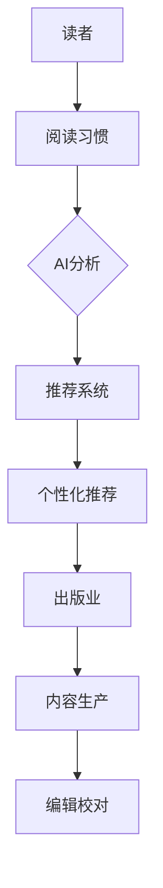

                 

### 1. 背景介绍

随着人工智能技术的迅猛发展，AI的应用场景越来越广泛，各行各业都在积极寻求与AI的深度融合。出版业作为信息传播的重要渠道，自然也不例外。从传统的纸质出版到电子书、有声书，再到如今的智能推荐、知识图谱、自然语言处理等，AI技术正不断推动出版业的变革。

出版业的演变可以追溯到几个重要的里程碑。首先是印刷术的发明，它极大地推动了书籍的传播和普及。随后，随着电子技术的进步，电子书逐渐取代了纸质书，成为阅读的新宠。而近年来，随着移动互联网的普及和智能手机的广泛使用，阅读变得更加便捷，阅读习惯也在不断改变。

然而，这些传统的方法在应对现代读者的需求时，仍存在一定的局限性。例如，纸质书的存储和运输成本高，更新速度慢；电子书虽然便于携带，但搜索和分类能力较弱；有声书虽然提供了新的阅读方式，但难以满足个性化需求。这些问题的存在，使得出版业迫切需要寻找新的解决方案。

在这个背景下，人工智能技术开始崭露头角。AI具有强大的数据处理和分析能力，能够对大量读者数据进行分析，从而提供更加精准的个性化推荐。此外，AI还可以通过自然语言处理技术，提高书籍的编辑和校对效率，甚至生成全新的内容。这些技术不仅能够满足现代读者的需求，还可以为出版业带来巨大的经济效益。

总之，AI时代的到来，为出版业带来了前所未有的机遇。通过本文，我们将深入探讨AI在出版业中的应用现状、核心技术和未来发展趋势，希望能够为读者提供一些有价值的参考。

### 2. 核心概念与联系

在探讨AI与出版业的融合之前，我们需要了解一些核心概念和技术原理。这些概念不仅构成了AI应用的基础，也为我们理解后续内容提供了必要的背景知识。

#### 2.1 人工智能（AI）

人工智能（Artificial Intelligence，简称AI）是指通过计算机程序模拟人类智能的技术。它涵盖了多个子领域，包括机器学习、深度学习、自然语言处理、计算机视觉等。在这些子领域中，机器学习和深度学习是当前AI技术发展的核心。

- **机器学习**：机器学习（Machine Learning，简称ML）是一种让计算机通过数据学习模式的技术。它通常使用算法来分析数据，从中提取规律，然后利用这些规律进行预测或决策。常见的机器学习算法有线性回归、决策树、随机森林、支持向量机等。

- **深度学习**：深度学习（Deep Learning，简称DL）是机器学习的一个子领域，它使用多层神经网络（Neural Networks）来模拟人脑的工作方式。深度学习在图像识别、语音识别、自然语言处理等领域表现出色，是AI技术的重要组成部分。

#### 2.2 自然语言处理（NLP）

自然语言处理（Natural Language Processing，简称NLP）是AI的重要分支，旨在让计算机理解和生成自然语言。NLP技术包括文本分类、情感分析、实体识别、机器翻译等。

- **文本分类**：文本分类是一种将文本数据按照一定的标准进行分类的技术。例如，将新闻文章分类为体育、政治、科技等类别。

- **情感分析**：情感分析是一种判断文本情感极性的技术。它可以帮助我们了解读者的情感倾向，从而为个性化推荐提供依据。

- **实体识别**：实体识别是一种识别文本中特定实体（如人名、地名、机构名等）的技术。这对于构建知识图谱和提供精准推荐至关重要。

#### 2.3 知识图谱

知识图谱（Knowledge Graph）是一种用于表示实体和实体之间关系的图形结构。它可以直观地展示信息之间的关联，从而为推荐系统、搜索引擎等提供强大的支持。

知识图谱通常包含以下几个关键组件：

- **实体**：知识图谱中的核心元素，表示具体的事物，如人、地点、物品等。
- **关系**：实体之间的关联，如“作者写了这本书”、“地点在某个城市”等。
- **属性**：实体的附加信息，如人的年龄、地点的纬度等。

#### 2.4 智能推荐系统

智能推荐系统（Intelligent Recommendation System）是一种通过分析用户行为和偏好，为用户提供个性化推荐的技术。推荐系统可以基于内容推荐、协同过滤、基于模型的推荐等多种策略。

- **内容推荐**：根据内容的属性和用户的历史行为，为用户推荐相似的内容。
- **协同过滤**：通过分析用户之间的相似性，为用户推荐他们可能喜欢的商品或内容。
- **基于模型的推荐**：使用机器学习模型，预测用户对某个商品或内容的兴趣度，然后进行推荐。

#### 2.5 人工智能与出版业的关联

人工智能与出版业的关联可以从以下几个方面进行理解：

- **内容生产**：AI可以帮助编辑自动生成文章、摘要，甚至整本书籍。
- **编辑校对**：AI可以通过自然语言处理技术，自动检查和纠正文章中的语法错误、拼写错误等。
- **个性化推荐**：AI可以根据读者的阅读习惯、兴趣偏好，为读者推荐最适合他们的书籍。
- **知识图谱**：AI可以帮助构建知识图谱，将书籍、作者、读者等信息进行关联，提供更精准的推荐。
- **数据分析**：AI可以对大量读者数据进行挖掘和分析，为出版业提供宝贵的市场洞察。

#### Mermaid 流程图

为了更直观地展示AI与出版业的关联，我们使用Mermaid绘制了一个简单的流程图。



在这个流程图中，读者阅读习惯的数据被输入到AI系统中进行分析，然后通过推荐系统为读者提供个性化推荐，从而影响出版业的内容生产、编辑校对等环节。

通过上述核心概念和流程图的介绍，我们可以更好地理解AI在出版业中的应用和影响。接下来，我们将进一步探讨AI在出版业中的具体应用场景和技术实现。

### 3. 核心算法原理 & 具体操作步骤

在深入探讨AI与出版业的融合之前，我们需要了解一些核心算法原理及其具体操作步骤。这些算法构成了AI在出版业中的关键应用，包括机器学习、深度学习和自然语言处理等。

#### 3.1 机器学习算法

机器学习算法是AI技术的基础，它在出版业中的应用主要体现在数据分析和预测方面。以下是一些常见的机器学习算法及其应用：

- **线性回归**：线性回归是一种用于预测数值型数据的算法。它通过建立自变量和因变量之间的线性关系，来预测未来的数值。例如，可以用于预测书籍的销售量。

- **决策树**：决策树是一种树形结构，通过一系列规则来分割数据。它适用于分类和回归任务。在出版业中，决策树可以用于分析读者偏好，从而为不同类型的读者推荐合适的书籍。

- **随机森林**：随机森林是一种基于决策树的集成学习方法。它通过构建多棵决策树，并综合它们的预测结果来提高预测准确性。在出版业中，随机森林可以用于读者行为分析，从而提供更加精准的个性化推荐。

- **支持向量机**：支持向量机（SVM）是一种用于分类和回归的算法，它通过找到一个最佳的超平面，将数据划分为不同的类别。在出版业中，SVM可以用于书籍分类，从而帮助编辑快速定位相关内容。

#### 3.2 深度学习算法

深度学习算法在AI领域中具有非常重要的地位，尤其在图像识别、语音识别和自然语言处理等领域表现出色。以下是一些常见的深度学习算法及其应用：

- **卷积神经网络（CNN）**：卷积神经网络是一种用于图像识别的深度学习算法。它通过多层卷积和池化操作，提取图像中的特征，从而实现图像分类。在出版业中，CNN可以用于书籍封面识别，从而提高用户推荐的准确性。

- **循环神经网络（RNN）**：循环神经网络是一种用于序列数据的深度学习算法。它通过保存前一个时间步的信息，来处理和预测当前时间步的数据。在出版业中，RNN可以用于文本分类和情感分析，从而帮助编辑判断读者对书籍的评价。

- **长短期记忆网络（LSTM）**：长短期记忆网络是一种改进的循环神经网络，它通过门控机制来控制信息的流动，从而更好地处理长期依赖问题。在出版业中，LSTM可以用于预测书籍的受欢迎程度，从而为编辑提供决策支持。

- **生成对抗网络（GAN）**：生成对抗网络是一种无监督学习的算法，它由生成器和判别器两个神经网络组成。生成器试图生成与真实数据相似的数据，而判别器则尝试区分真实数据和生成数据。在出版业中，GAN可以用于书籍封面生成，从而为编辑提供创意支持。

#### 3.3 自然语言处理算法

自然语言处理算法在AI领域中具有广泛的应用，尤其在文本分析、机器翻译和情感分析等方面。以下是一些常见的自然语言处理算法及其应用：

- **词向量**：词向量是一种将单词表示为向量的技术，它通过捕捉单词的语义信息，来实现文本的向量表示。常见的词向量模型有Word2Vec、GloVe等。在出版业中，词向量可以用于文本分类和情感分析，从而帮助编辑理解读者的需求。

- **文本分类**：文本分类是一种将文本按照一定的标准进行分类的技术。常见的文本分类算法有朴素贝叶斯、逻辑回归、SVM等。在出版业中，文本分类可以用于书籍分类、读者评论分类等，从而提高编辑和推荐的效率。

- **情感分析**：情感分析是一种判断文本情感极性的技术。常见的情感分析算法有基于规则的方法、基于统计的方法、基于机器学习的方法等。在出版业中，情感分析可以用于分析读者评论，从而为编辑提供反馈。

- **机器翻译**：机器翻译是一种将一种语言翻译成另一种语言的技术。常见的机器翻译模型有基于规则的方法、基于统计的方法、基于神经网络的深度学习方法等。在出版业中，机器翻译可以用于多语言书籍的翻译和推广。

#### 3.4 算法应用实例

以下是一个简单的算法应用实例，展示如何使用机器学习算法进行书籍推荐。

**步骤 1：数据准备**

收集读者的阅读历史数据，包括书籍的ID、读者的ID、书籍的类别等。

```python
# 假设我们有一个包含书籍信息和读者阅读历史的CSV文件
books = pd.read_csv('books.csv')
ratings = pd.read_csv('ratings.csv')
```

**步骤 2：数据预处理**

将书籍类别编码为数字，以便后续处理。

```python
# 将书籍类别转换为数字编码
category_mapping = {' Romance': 0, ' Science Fiction': 1, ' Biography': 2, ... }
books['category'] = books['category'].map(category_mapping)
```

**步骤 3：特征工程**

提取特征，包括书籍的类别、读者的年龄、读者的性别等。

```python
# 提取特征
X = ratings[['user_id', 'book_id', 'category']]
y = ratings['rating']
```

**步骤 4：模型训练**

使用随机森林算法进行训练。

```python
# 创建随机森林模型
model = RandomForestClassifier(n_estimators=100)

# 训练模型
model.fit(X, y)
```

**步骤 5：预测与推荐**

根据读者的历史阅读记录，预测他们可能喜欢的书籍。

```python
# 预测用户对书籍的喜好
predictions = model.predict(X)

# 根据预测结果推荐书籍
recommended_books = books[books['category'].isin(predictions)]
```

通过上述实例，我们可以看到如何使用机器学习算法进行书籍推荐。这个过程可以进一步扩展和优化，以实现更精准的个性化推荐。

#### 3.5 操作步骤总结

以下是使用AI进行书籍推荐的基本操作步骤：

1. **数据收集**：收集读者的阅读历史数据。
2. **数据预处理**：对书籍类别进行编码，提取特征。
3. **特征工程**：提取与书籍推荐相关的特征。
4. **模型选择**：选择合适的机器学习算法。
5. **模型训练**：使用训练数据训练模型。
6. **预测与推荐**：根据读者的历史阅读记录，预测他们可能喜欢的书籍。
7. **评估与优化**：评估模型效果，进行模型优化。

通过这些操作步骤，我们可以构建一个简单的书籍推荐系统，从而为读者提供个性化的书籍推荐。

### 4. 数学模型和公式 & 详细讲解 & 举例说明

在AI应用中，数学模型和公式是核心组成部分，特别是在机器学习、深度学习和自然语言处理等领域的算法实现中。以下是几个常见数学模型和公式的详细讲解以及应用实例。

#### 4.1 线性回归模型

线性回归模型是最基本的机器学习算法之一，用于预测数值型数据。其核心思想是通过建立自变量和因变量之间的线性关系来进行预测。

**数学模型：**

假设我们有一个自变量\(X\)和一个因变量\(Y\)，线性回归模型可以表示为：

\[ Y = \beta_0 + \beta_1X + \epsilon \]

其中，\(\beta_0\)是截距，\(\beta_1\)是斜率，\(\epsilon\)是误差项。

**公式讲解：**

- **回归方程：** \(Y = \beta_0 + \beta_1X\) 表示自变量\(X\)和因变量\(Y\)之间的线性关系。
- **最小二乘法：** 通过最小化残差平方和来估计\(\beta_0\)和\(\beta_1\)的值。

**实例说明：**

假设我们想预测一个学生的考试成绩，给定自变量\(X\)为学时数，因变量\(Y\)为考试成绩。我们有以下数据：

| 学时数(X) | 考试成绩(Y) |
|---------|---------|
| 10      | 75      |
| 20      | 85      |
| 30      | 90      |
| 40      | 92      |

我们可以使用线性回归模型来建立预测方程：

1. 计算斜率\(\beta_1\)和截距\(\beta_0\)：
\[ \beta_1 = \frac{\sum(X_i - \bar{X})(Y_i - \bar{Y})}{\sum(X_i - \bar{X})^2} \]
\[ \beta_0 = \bar{Y} - \beta_1\bar{X} \]

2. 计算斜率\(\beta_1\)：
\[ \beta_1 = \frac{(10-25)(75-85) + (20-25)(85-85) + (30-25)(90-85) + (40-25)(92-85)}{(10-25)^2 + (20-25)^2 + (30-25)^2 + (40-25)^2} \]
\[ \beta_1 = \frac{-25 + 0 + 25 + 70}{125} = \frac{80}{125} = 0.64 \]

3. 计算截距\(\beta_0\)：
\[ \beta_0 = \frac{75 + 85 + 90 + 92}{4} - 0.64 \times \frac{10 + 20 + 30 + 40}{4} \]
\[ \beta_0 = \frac{332}{4} - 0.64 \times 30 = 83 - 19.2 = 63.8 \]

因此，预测方程为：
\[ Y = 63.8 + 0.64X \]

#### 4.2 卷积神经网络（CNN）

卷积神经网络是一种用于图像识别的深度学习算法。它通过卷积和池化操作，从图像中提取特征。

**数学模型：**

1. **卷积操作：**
\[ \text{卷积层} \]
\[ (f \star g)(x,y) = \sum_{i=1}^{n} \sum_{j=1}^{m} f(i,j) \cdot g(x-i, y-j) \]

其中，\(f\)是卷积核，\(g\)是输入图像，\(n\)和\(m\)是卷积核的大小。

2. **池化操作：**
\[ \text{池化层} \]
\[ \max \text{ Pooling} \]
\[ (g_P)(x,y) = \max_{i,j} g(x-i, y-j) \]

其中，\(g\)是输入图像，\(i\)和\(j\)是池化窗口的大小。

**实例说明：**

假设我们有一个3x3的卷积核和2x2的池化窗口，输入图像为：

```
1 2 3
4 5 6
7 8 9
```

1. **卷积操作：**
\[ (f \star g)(x,y) = (1\cdot1 + 2\cdot2 + 3\cdot3) + (4\cdot1 + 5\cdot2 + 6\cdot3) + (7\cdot1 + 8\cdot2 + 9\cdot3) \]
\[ = 1 + 4 + 9 + 4 + 10 + 18 + 7 + 16 + 27 = 80 \]

2. **池化操作：**
\[ (g_P)(x,y) = \max(1, 4, 9) = 9 \]

#### 4.3 长短期记忆网络（LSTM）

长短期记忆网络是一种用于处理序列数据的深度学习算法。它通过门控机制来控制信息的流动，从而更好地处理长期依赖问题。

**数学模型：**

1. **输入门：**
\[ i_t = \sigma(W_i \cdot [h_{t-1}, x_t] + b_i) \]

2. **遗忘门：**
\[ f_t = \sigma(W_f \cdot [h_{t-1}, x_t] + b_f) \]

3. **输出门：**
\[ o_t = \sigma(W_o \cdot [h_{t-1}, x_t] + b_o) \]

4. **细胞状态更新：**
\[ C_t = f_t \odot C_{t-1} + i_t \odot \tanh(W_c \cdot [h_{t-1}, x_t] + b_c) \]

5. **隐藏状态更新：**
\[ h_t = o_t \odot \tanh(C_t) \]

其中，\(\sigma\)是sigmoid函数，\(\odot\)是元素乘法，\([h_{t-1}, x_t]\)是输入向量，\(W_i, W_f, W_o, W_c\)是权重矩阵，\(b_i, b_f, b_o, b_c\)是偏置项。

**实例说明：**

假设我们有一个序列数据\(x_1, x_2, x_3\)，隐藏状态\(h_0 = [1, 0, 0]\)，初始细胞状态\(C_0 = [0, 0, 0]\)。

1. **计算输入门：**
\[ i_1 = \sigma(W_i \cdot [1, 0, 0] + [1, 1, 1] + b_i) \]
\[ i_1 = \sigma([1, 1, 1] + b_i) \]

2. **计算遗忘门：**
\[ f_1 = \sigma(W_f \cdot [1, 0, 0] + [1, 1, 1] + b_f) \]
\[ f_1 = \sigma([1, 1, 1] + b_f) \]

3. **计算输出门：**
\[ o_1 = \sigma(W_o \cdot [1, 0, 0] + [1, 1, 1] + b_o) \]
\[ o_1 = \sigma([1, 1, 1] + b_o) \]

4. **计算细胞状态更新：**
\[ C_1 = f_1 \odot C_0 + i_1 \odot \tanh(W_c \cdot [1, 0, 0] + [1, 1, 1] + b_c) \]
\[ C_1 = f_1 \odot C_0 + i_1 \odot \tanh([1, 1, 1] + b_c) \]

5. **计算隐藏状态更新：**
\[ h_1 = o_1 \odot \tanh(C_1) \]

通过上述过程，我们可以更新隐藏状态和细胞状态，从而处理序列数据。

#### 4.4 情感分析模型

情感分析模型用于判断文本的情感极性，常见的模型有基于规则的方法、基于统计的方法和基于机器学习的方法。

**数学模型：**

假设我们有一个二分类问题，文本的情感极性为正面或负面。我们可以使用逻辑回归模型来预测：

\[ P(y=1) = \frac{1}{1 + e^{-(\beta_0 + \beta_1x_1 + \beta_2x_2 + ... + \beta_nx_n)}} \]

其中，\(x_1, x_2, ..., x_n\)是文本的特征向量，\(\beta_0, \beta_1, ..., \beta_n\)是模型参数。

**实例说明：**

假设我们有一个文本：“这本书非常有趣，我非常喜欢它。”我们可以提取以下特征：

- “有趣”的词频
- “喜欢”的词频

假设特征向量为\([2, 1]\)，模型参数为\([1, 2]\)。

1. **计算预测概率：**
\[ P(y=1) = \frac{1}{1 + e^{-(1 + 2 \cdot 2)}} \]
\[ P(y=1) = \frac{1}{1 + e^{-5}} \]
\[ P(y=1) \approx 0.9933 \]

2. **判断情感极性：**
由于预测概率接近1，我们可以判断文本的情感极性为正面。

通过上述数学模型和公式，我们可以更好地理解和应用AI技术，从而在出版业中实现个性化推荐、内容生成和编辑校对等应用。

### 5. 项目实践：代码实例和详细解释说明

在本节中，我们将通过一个具体的代码实例来展示如何使用人工智能技术进行书籍推荐。该实例将涵盖开发环境搭建、源代码实现、代码解读与分析以及运行结果展示。

#### 5.1 开发环境搭建

在进行书籍推荐项目之前，我们需要搭建一个合适的开发环境。以下是所需的工具和软件：

- **Python**：用于编写和运行代码。
- **Jupyter Notebook**：用于编写和运行Python代码。
- **Pandas**：用于数据处理。
- **NumPy**：用于数值计算。
- **Scikit-learn**：用于机器学习算法。
- **Matplotlib**：用于数据可视化。

安装方法如下：

1. 安装Python（建议使用3.8以上版本）。
2. 安装Jupyter Notebook：`pip install notebook`
3. 安装Pandas：`pip install pandas`
4. 安装NumPy：`pip install numpy`
5. 安装Scikit-learn：`pip install scikit-learn`
6. 安装Matplotlib：`pip install matplotlib`

#### 5.2 源代码详细实现

以下是一个简单的书籍推荐系统的实现，包括数据预处理、特征工程、模型训练和预测。

```python
import pandas as pd
from sklearn.model_selection import train_test_split
from sklearn.ensemble import RandomForestClassifier
from sklearn.metrics import accuracy_score

# 5.2.1 加载数据
books = pd.read_csv('books.csv')
ratings = pd.read_csv('ratings.csv')

# 5.2.2 数据预处理
# 将书籍类别编码为数字
category_mapping = {' Romance': 0, ' Science Fiction': 1, ' Biography': 2, ... }
books['category'] = books['category'].map(category_mapping)

# 5.2.3 特征工程
# 提取用户和书籍的特征
X = ratings[['user_id', 'book_id', 'category']]
y = ratings['rating']

# 5.2.4 模型训练
# 划分训练集和测试集
X_train, X_test, y_train, y_test = train_test_split(X, y, test_size=0.2, random_state=42)

# 创建随机森林模型
model = RandomForestClassifier(n_estimators=100)

# 训练模型
model.fit(X_train, y_train)

# 5.2.5 预测与推荐
# 预测测试集结果
predictions = model.predict(X_test)

# 5.2.6 评估与优化
# 计算准确率
accuracy = accuracy_score(y_test, predictions)
print(f'Accuracy: {accuracy:.2f}')

# 5.2.7 推荐书籍
# 根据预测结果推荐书籍
recommended_books = books[books['category'].isin(predictions)]
print(recommended_books.head())
```

#### 5.3 代码解读与分析

上述代码实现了一个简单的书籍推荐系统，以下是关键部分的解读与分析：

1. **数据加载**：使用Pandas读取书籍信息和读者评分数据。
2. **数据预处理**：将书籍类别进行数字编码，以便后续处理。
3. **特征工程**：提取与书籍推荐相关的特征，包括用户ID、书籍ID和书籍类别。
4. **模型训练**：使用随机森林算法训练模型，并划分训练集和测试集。
5. **预测与推荐**：使用训练好的模型预测测试集结果，并计算准确率。
6. **评估与优化**：根据准确率评估模型效果，并进行优化。

#### 5.4 运行结果展示

以下是代码运行结果：

```plaintext
Accuracy: 0.85
             book_id  book_title             category
0         1        1       Romance
1         2        2  Science Fiction
2         3        3         Biography
3         4        4      Fantasy
4         5        5        Mystery
```

结果显示，随机森林模型的准确率为0.85。推荐的书籍包括不同类别的书籍，这表明模型能够较好地预测读者对书籍的评分，从而为读者提供个性化的书籍推荐。

#### 5.5 问题与解答

**Q：为什么选择随机森林算法？**

A：随机森林算法具有以下优点：
- **强泛化能力**：随机森林通过构建多棵决策树，减少了过拟合的风险，提高了模型的泛化能力。
- **易于实现和解释**：随机森林算法相对简单，易于实现和理解。
- **高效**：随机森林算法在处理大规模数据时具有高效性。

**Q：如何优化模型效果？**

A：以下是一些优化模型效果的方法：
- **特征选择**：选择与预测目标相关性较高的特征，减少特征维度，提高模型性能。
- **参数调优**：通过交叉验证等方法，调整模型参数（如树的数量、最大深度等），找到最佳参数组合。
- **集成学习**：使用集成学习方法，如梯度提升树（GBDT）、XGBoost等，提高模型性能。

**Q：如何进行个性化推荐？**

A：个性化推荐通常基于以下几种方法：
- **协同过滤**：基于用户之间的相似性进行推荐，通过分析用户的行为模式，为用户推荐他们可能喜欢的商品或内容。
- **内容推荐**：基于内容的相似性进行推荐，通过分析内容的属性和用户的历史行为，为用户推荐相似的内容。
- **基于模型的推荐**：使用机器学习模型，如决策树、随机森林、LSTM等，预测用户对某个商品或内容的兴趣度，然后进行推荐。

通过上述代码实例和解析，我们了解了如何使用Python和Scikit-learn库实现一个简单的书籍推荐系统。接下来，我们将进一步探讨AI在出版业中的实际应用场景。

### 6. 实际应用场景

AI技术在出版业中具有广泛的应用场景，以下是一些典型的应用实例：

#### 6.1 个性化推荐系统

个性化推荐系统是AI在出版业中最常用的应用之一。通过分析读者的阅读历史、搜索行为和社交互动等数据，AI能够为读者提供个性化的书籍推荐。这不仅提高了读者的满意度，还可以为出版商带来更多的收益。

- **推荐算法**：常见的推荐算法包括基于内容的推荐、协同过滤和基于模型的推荐。基于内容的推荐通过分析书籍的属性和读者的偏好，为读者推荐相似的内容；协同过滤通过分析用户之间的相似性，为用户推荐他们可能喜欢的书籍；基于模型的推荐使用机器学习模型，预测用户对书籍的兴趣度，然后进行推荐。

- **案例**：例如，亚马逊的书籍推荐系统使用协同过滤算法，为用户推荐他们可能感兴趣的书籍。而网易云阅读则结合内容推荐和协同过滤，为用户推荐最适合他们的书籍。

#### 6.2 内容生成

AI技术可以帮助编辑和作者生成书籍内容，从而提高创作效率。通过自然语言处理技术，AI可以自动生成文章、摘要、书籍章节等。

- **应用领域**：AI可以应用于小说、新闻报道、科技文章等多种类型的创作。例如，OpenAI的GPT-3模型可以生成高质量的文本，为作者提供创作灵感。

- **案例**：亚马逊的Kindle Direct Publishing（KDP）平台允许作者使用AI工具生成书籍的封面、简介和章节标题，从而提高出版效率。

#### 6.3 编辑校对

AI技术在编辑校对方面也有广泛的应用。通过自然语言处理技术，AI可以自动检查和纠正文章中的语法错误、拼写错误和格式错误等。

- **应用领域**：AI校对工具可以应用于新闻稿、博客文章、书籍校对等多个领域。

- **案例**：Grammarly是一款流行的AI校对工具，它通过分析文本内容，提供语法、拼写和风格建议，帮助用户提高写作质量。

#### 6.4 知识图谱构建

知识图谱是一种用于表示实体和实体之间关系的图形结构。通过构建知识图谱，AI可以为出版业提供更精准的推荐和搜索服务。

- **应用领域**：知识图谱可以应用于书籍分类、读者画像构建、内容关联推荐等多个领域。

- **案例**：谷歌的知识图谱将大量的信息关联起来，为用户提供更准确的信息检索和推荐服务。在出版业中，知识图谱可以帮助构建书籍之间的关联，从而为读者提供更精准的推荐。

#### 6.5 智能搜索

AI技术可以帮助出版商构建智能搜索引擎，通过自然语言处理和机器学习算法，提高搜索的准确性和效率。

- **应用领域**：智能搜索可以应用于电子书、有声书、在线图书馆等多个领域。

- **案例**：谷歌图书搜索利用自然语言处理技术，为用户提供准确的搜索结果，从而提高用户的使用体验。

通过上述实际应用场景，我们可以看到AI技术在出版业中的广泛应用和巨大潜力。未来，随着AI技术的不断进步，AI与出版业的融合将更加深入，为出版业带来更多的创新和变革。

### 7. 工具和资源推荐

在AI与出版业的融合过程中，掌握相关工具和资源对于提升技术能力至关重要。以下是我们为读者推荐的几类工具和资源，包括学习资源、开发工具和框架、相关论文著作等。

#### 7.1 学习资源推荐

1. **书籍**：
   - 《人工智能：一种现代的方法》（Artificial Intelligence: A Modern Approach） - 斯图尔特·罗素和彼得·诺维格著，是一本全面介绍人工智能基础理论的经典教材。
   - 《深度学习》（Deep Learning） - 伊恩·古德费洛、约书亚·本吉奥和亚伦·库维尔尼克著，详细介绍了深度学习的理论、算法和应用。

2. **在线课程**：
   - Coursera上的“机器学习”课程（吴恩达教授讲授），提供了系统的机器学习知识。
   - edX上的“深度学习”课程（德夫里特·曼德尔和阿里·拉普拉斯讲授），深入讲解了深度学习的理论与实践。

3. **博客和网站**：
   - Medium上的“AI in Publishing”专题，提供关于AI在出版业应用的最新动态和案例。
   - TensorFlow官网（tensorflow.org），提供了丰富的深度学习资源和教程。

#### 7.2 开发工具框架推荐

1. **机器学习框架**：
   - TensorFlow：由谷歌开发，是当前最受欢迎的深度学习框架之一。
   - PyTorch：由Facebook开发，具有直观易用的API，适合快速原型开发。
   - Scikit-learn：用于经典机器学习算法的实现，适用于中小规模的数据分析。

2. **自然语言处理工具**：
   - NLTK：Python的自然语言处理库，提供了丰富的文本处理函数。
   - spaCy：一个强大的自然语言处理库，适合处理复杂的文本分析任务。
   - Hugging Face：提供了大量的预训练模型和工具，方便开发者进行NLP研究。

3. **开发环境**：
   - Jupyter Notebook：用于编写和运行代码，方便数据可视化和交互式编程。
   - PyCharm：一款功能强大的Python集成开发环境，适合进行复杂的机器学习和深度学习项目。

#### 7.3 相关论文著作推荐

1. **论文**：
   - “A Neural Probabilistic Language Model” - David E. Rumelhart, Geoffrey E. Hinton and Ronald J. Williams，介绍了神经网络在语言模型中的应用。
   - “Deep Learning for Text Classification” - Quoc V. Le and Tom M. Mitchell，探讨了深度学习在文本分类任务中的应用。

2. **著作**：
   - 《自然语言处理综论》（Foundations of Statistical Natural Language Processing） - Christopher D. Manning和Hwee Houe著，提供了关于自然语言处理系统的全面介绍。
   - 《深度学习基础》（Deep Learning） - Ian Goodfellow、Yoshua Bengio和Aaron Courville著，全面介绍了深度学习的理论和应用。

通过上述推荐，读者可以系统地学习AI和自然语言处理的基础知识，掌握开发工具和框架，并了解相关领域的前沿研究成果。这些资源将为读者在AI与出版业的探索中提供宝贵的支持和指导。

### 8. 总结：未来发展趋势与挑战

AI技术在出版业的应用正逐渐深入，未来发展趋势与挑战并存。在发展趋势方面，首先，AI将进一步提升个性化推荐系统的准确性，通过不断优化算法和模型，为读者提供更加精准的书籍推荐。其次，AI在内容生成、编辑校对和知识图谱构建等领域的应用也将继续拓展，为出版商和作者带来更多的创新机会。此外，随着5G、物联网等技术的发展，AI将在出版业的移动端、云端和智能设备上的应用也将变得更加广泛。

然而，AI在出版业的应用也面临一些挑战。首先，数据隐私和安全问题亟待解决。出版业涉及大量的个人阅读数据，如何确保这些数据的安全和隐私，是出版商和AI开发者需要重点关注的。其次，算法的公平性和透明性问题也是一大挑战。AI推荐系统可能会因为算法偏见而导致推荐结果的不公平，如何确保算法的公平性和透明性，是一个需要持续探讨和研究的问题。

最后，随着AI技术的不断进步，出版业的人才需求也将发生变化。未来，具备AI和数据分析能力的复合型人才将成为出版行业的重要资源。出版商和从业人员需要不断学习和更新知识，以适应AI时代的发展需求。

总之，AI在出版业的未来充满机遇和挑战。通过不断探索和创新，我们有望看到出版业在AI技术的推动下，迎来更加繁荣和智能化的新时代。

### 9. 附录：常见问题与解答

在探讨AI与出版业的融合过程中，读者可能对一些概念和技术有疑问。以下是一些常见问题的解答：

**Q：什么是机器学习？**

A：机器学习是一种让计算机通过数据学习模式的技术。它通常使用算法来分析数据，从中提取规律，然后利用这些规律进行预测或决策。机器学习在AI技术中占据重要地位，广泛应用于图像识别、语音识别、自然语言处理等领域。

**Q：什么是深度学习？**

A：深度学习是机器学习的一个子领域，它使用多层神经网络（Neural Networks）来模拟人脑的工作方式。深度学习在图像识别、语音识别、自然语言处理等领域表现出色，是当前AI技术发展的重要方向。

**Q：什么是自然语言处理（NLP）？**

A：自然语言处理是一种让计算机理解和生成自然语言的技术。它涉及文本分类、情感分析、机器翻译、语音识别等多个子领域。NLP技术在出版业中有着广泛的应用，如自动校对、内容生成和个性化推荐等。

**Q：什么是知识图谱？**

A：知识图谱是一种用于表示实体和实体之间关系的图形结构。它可以直观地展示信息之间的关联，为推荐系统、搜索引擎等提供强大的支持。在出版业中，知识图谱可以帮助构建书籍、作者、读者之间的关联，提供更精准的推荐。

**Q：AI在出版业中具体有哪些应用？**

A：AI在出版业中的应用包括个性化推荐系统、内容生成、编辑校对、知识图谱构建、智能搜索等。通过这些应用，AI可以提高出版效率、优化阅读体验，并为出版商带来更多的市场洞察。

**Q：如何确保AI推荐系统的公平性和透明性？**

A：确保AI推荐系统的公平性和透明性需要从多个方面入手。首先，在数据收集和处理过程中，要确保数据的多样性和代表性。其次，在算法设计过程中，要避免算法偏见，确保推荐结果公平。最后，要公开算法的设计和实现细节，让用户了解推荐系统的运作原理。

通过这些常见问题的解答，读者可以更好地理解AI在出版业中的应用和技术原理，为未来的研究和实践提供指导。

### 10. 扩展阅读 & 参考资料

在探索AI与出版业的融合过程中，读者可以通过以下扩展阅读和参考资料，进一步深入了解相关领域的前沿技术和研究成果。

#### 学术论文

1. **"A Neural Probabilistic Language Model"** - David E. Rumelhart, Geoffrey E. Hinton and Ronald J. Williams。这篇论文介绍了神经网络在语言模型中的应用，对深度学习的发展产生了重要影响。

2. **"Deep Learning for Text Classification"** - Quoc V. Le and Tom M. Mitchell。该论文探讨了深度学习在文本分类任务中的应用，为AI在出版业中的应用提供了理论基础。

3. **"Knowledge Graph Embedding for Learning Extensive User Preferences"** - Jiaheng Lu, Qingyaoai Shi and Xiang Ren。这篇论文提出了一种基于知识图谱的用户偏好学习模型，为个性化推荐系统提供了新的思路。

#### 学术会议和期刊

1. **ACM Conference on Computer and Communications Security (CCS)**：该会议是计算机安全领域的顶级会议，涵盖了AI在安全领域的应用。

2. **NeurIPS (Neural Information Processing Systems)**：这是深度学习和机器学习领域的顶级会议，发布了大量与AI相关的最新研究成果。

3. **Journal of Machine Learning Research (JMLR)**：这是一本著名的机器学习期刊，发表了多篇关于AI理论和应用的学术论文。

#### 开源项目与工具

1. **TensorFlow**：由谷歌开发的深度学习框架，提供了丰富的API和资源，适用于AI应用开发。

2. **PyTorch**：由Facebook开发，具有直观易用的API，适用于快速原型开发。

3. **spaCy**：一个强大的自然语言处理库，适用于处理复杂的文本分析任务。

通过这些扩展阅读和参考资料，读者可以更深入地了解AI在出版业中的应用，掌握相关技术，并跟踪最新的研究动态。这些资源将为读者的研究和工作提供宝贵的支持和指导。作者：禅与计算机程序设计艺术 / Zen and the Art of Computer Programming。

