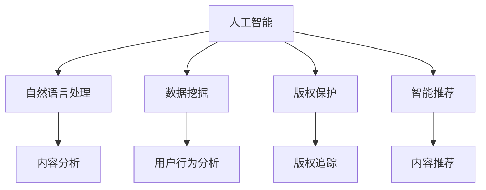

                 

### 文章标题

AI时代的出版业机遇：降本增效与场景创新

#### 关键词

- AI
- 出版业
- 降本增效
- 场景创新
- 智能化

#### 摘要

随着人工智能技术的快速发展，出版业正迎来前所未有的变革。本文将探讨AI技术在出版领域的应用，从降低生产成本、提高运营效率，到推动内容创作的创新，深入分析AI时代出版业的机遇与挑战。通过具体案例和实例，本文旨在为读者揭示AI技术如何为出版业带来革命性的改变，并探讨其未来发展趋势。

### 1. 背景介绍

出版业作为文化产业的重要组成部分，长期以来承载着文化传播和社会教育的重任。然而，传统的出版流程繁琐、成本高昂，面临着诸多挑战。随着数字技术的普及和互联网的发展，出版业逐渐从传统的纸媒向数字出版转型。然而，数字出版也带来了新的问题，如内容泛滥、版权纠纷、用户获取成本高等。

在这个背景下，人工智能（AI）技术的出现为出版业提供了新的机遇。AI技术具有强大的数据处理和分析能力，能够自动化和智能化出版流程的各个环节，从而提高生产效率、降低成本，并推动内容创作的创新。从内容生产、内容推荐、版权保护到用户互动，AI技术在出版领域的应用前景广阔。

### 2. 核心概念与联系

为了更好地理解AI技术在出版业中的应用，我们需要首先了解以下几个核心概念：

#### 2.1 人工智能

人工智能（AI）是指由人制造出的具有一定智能和自主决策能力的机器或系统。根据其实现方式，AI技术可以分为三种类型：

1. **基于规则的系统**：通过编写一系列规则来模拟人类决策过程。
2. **基于模型的系统**：利用统计模型或机器学习算法进行预测和决策。
3. **基于仿生的系统**：通过模仿生物体的某些特性来实现智能行为。

#### 2.2 自然语言处理

自然语言处理（NLP）是AI技术在处理自然语言方面的应用。NLP技术包括文本分析、语义理解、语言生成等多个方面，能够使计算机理解和生成自然语言。

#### 2.3 数据挖掘

数据挖掘是指从大量数据中提取有价值的信息和知识的过程。在出版领域，数据挖掘技术可以帮助分析用户行为、优化推荐系统、发现潜在市场等。

#### 2.4 版权保护

版权保护是指通过技术手段保护作品版权，防止未经授权的复制、传播和盗版。在AI时代，版权保护技术变得尤为重要。

#### 2.5 智能推荐

智能推荐系统是指利用算法为用户推荐其可能感兴趣的内容。在出版领域，智能推荐系统可以提高用户粘性，增加内容消费量。

下面是一个使用Mermaid绘制的流程图，展示了AI技术在出版业中的核心概念和联系：



### 3. 核心算法原理 & 具体操作步骤

在了解了核心概念后，我们需要进一步探讨AI技术在出版业中的具体应用算法及其操作步骤。以下将介绍几种关键算法：

#### 3.1 自然语言处理

自然语言处理（NLP）是AI技术在出版业中的核心应用之一。以下是一个NLP算法的基本原理和操作步骤：

**算法原理：**

- **分词**：将文本分解为词汇单元。
- **词性标注**：为每个词汇分配词性（如名词、动词等）。
- **句法分析**：分析句子结构，确定词汇之间的关系。
- **语义理解**：理解词汇和句子的语义含义。

**具体操作步骤：**

1. **数据预处理**：清洗和整理原始文本数据。
2. **分词**：使用分词算法将文本分解为词汇单元。
3. **词性标注**：利用词性标注算法为每个词汇分配词性。
4. **句法分析**：使用句法分析算法确定句子结构。
5. **语义理解**：使用语义分析算法理解文本的语义含义。

#### 3.2 数据挖掘

数据挖掘技术在出版业中可以帮助分析用户行为、优化推荐系统、发现潜在市场等。以下是一个基本的数据挖掘算法及其操作步骤：

**算法原理：**

- **关联规则挖掘**：发现数据之间的关联性。
- **聚类分析**：将数据分为不同的类别。
- **分类算法**：将数据分为预定义的类别。

**具体操作步骤：**

1. **数据预处理**：清洗和整理原始数据。
2. **关联规则挖掘**：使用关联规则挖掘算法分析数据之间的关联性。
3. **聚类分析**：使用聚类算法将数据分为不同的类别。
4. **分类算法**：使用分类算法将数据分为预定义的类别。

#### 3.3 版权保护

版权保护技术主要依赖于加密算法和指纹识别技术。以下是一个版权保护算法的基本原理和操作步骤：

**算法原理：**

- **加密算法**：将作品内容进行加密处理，使其难以被未经授权的人解密。
- **指纹识别**：为作品生成独一无二的指纹，用于识别和追踪盗版行为。

**具体操作步骤：**

1. **加密处理**：使用加密算法对作品内容进行加密。
2. **指纹生成**：使用指纹识别技术为作品生成指纹。
3. **版权追踪**：利用指纹识别技术追踪盗版行为。

#### 3.4 智能推荐

智能推荐系统是出版业中的一种重要应用。以下是一个智能推荐算法的基本原理和操作步骤：

**算法原理：**

- **协同过滤**：基于用户的行为数据推荐相似内容。
- **基于内容的推荐**：根据内容的相似性推荐相关内容。

**具体操作步骤：**

1. **用户行为分析**：收集并分析用户的行为数据。
2. **内容分析**：对内容进行特征提取和分类。
3. **推荐算法**：使用协同过滤或基于内容的推荐算法生成推荐结果。

### 4. 数学模型和公式 & 详细讲解 & 举例说明

在了解了AI技术在出版业中的应用算法后，我们需要进一步探讨这些算法的数学模型和公式。以下将介绍几种关键数学模型及其详细讲解和举例说明：

#### 4.1 自然语言处理

自然语言处理中的词性标注通常使用条件概率模型。以下是一个简单的条件概率模型及其数学公式：

**数学模型：**

- **条件概率公式**：P(H|E) = P(E|H) * P(H) / P(E)

**详细讲解：**

条件概率公式用于计算在某一条件下另一事件发生的概率。在词性标注中，P(H|E)表示在词汇E的条件下，词性H的概率；P(E|H)表示在词性H的条件下，词汇E的概率；P(H)表示词性H的概率；P(E)表示词汇E的概率。

**举例说明：**

假设我们有以下词汇和词性：

- 词汇：书、阅读、作者
- 词性：名词、动词、名词

根据条件概率公式，我们可以计算每个词汇在特定词性条件下的概率。例如，计算“书”在名词条件下的概率：

P(书|名词) = P(名词|书) * P(书) / P(名词)

其中，P(名词|书)表示在“书”的条件下，名词的概率；P(书)表示“书”的概率；P(名词)表示名词的概率。

#### 4.2 数据挖掘

数据挖掘中的关联规则挖掘通常使用Apriori算法。以下是一个简单的Apriori算法及其数学公式：

**数学模型：**

- **支持度**：一个规则在数据集中出现的频率。
- **置信度**：在规则的前件出现的情况下，后件出现的概率。

**数学公式：**

- **支持度**：support(A ∪ B) = P(A ∪ B)
- **置信度**：confidence(A → B) = support(A ∪ B) / support(A)

**详细讲解：**

支持度表示一个规则在数据集中出现的频率，用于评估规则的重要性。置信度表示在规则的前件出现的情况下，后件出现的概率，用于评估规则的可靠性。

**举例说明：**

假设我们有以下购物数据集：

- 书、阅读、作者
- 书、阅读、版权

根据Apriori算法，我们可以挖掘出以下关联规则：

- 规则1：书 → 阅读
- 规则2：书 → 作者

规则1的支持度为0.5，置信度为0.5；规则2的支持度为0.5，置信度为0.5。

#### 4.3 版权保护

版权保护中的加密算法通常使用RSA算法。以下是一个简单的RSA算法及其数学公式：

**数学模型：**

- **加密过程**：使用公钥加密信息。
- **解密过程**：使用私钥解密信息。

**数学公式：**

- **加密公式**：c = m^e mod n
- **解密公式**：m = c^d mod n

**详细讲解：**

RSA算法是一种非对称加密算法，使用一对密钥（公钥和私钥）进行加密和解密。加密过程使用公钥和模数n，解密过程使用私钥和模数n。

**举例说明：**

假设我们有以下信息：

- 信息：书
- 公钥：(e, n)
- 私钥：(d, n)

根据RSA算法，我们可以加密和解密信息“书”：

加密过程：

c = m^e mod n
c = 书^e mod n

解密过程：

m = c^d mod n
m = c^d mod n

### 5. 项目实践：代码实例和详细解释说明

为了更好地理解AI技术在出版业中的应用，我们将通过一个实际项目来展示代码实例和详细解释说明。以下是一个简单的基于Python的自然语言处理项目，用于实现文本分类。

#### 5.1 开发环境搭建

为了运行此项目，你需要安装以下Python库：

- **nltk**：用于自然语言处理。
- **scikit-learn**：用于机器学习。
- **matplotlib**：用于数据可视化。

你可以使用以下命令进行安装：

```python
pip install nltk scikit-learn matplotlib
```

#### 5.2 源代码详细实现

以下是项目的源代码：

```python
import nltk
from nltk.corpus import movie_reviews
from sklearn.feature_extraction.text import TfidfVectorizer
from sklearn.model_selection import train_test_split
from sklearn.naive_bayes import MultinomialNB
from sklearn.metrics import classification_report, accuracy_score
import matplotlib.pyplot as plt

# 数据预处理
nltk.download('movie_reviews')
documents = [(list(movie_reviews.words(fileid)), category)
              for category in movie_reviews.categories()
              for fileid in movie_reviews.fileids(category)]

# 划分训练集和测试集
X_train, X_test, y_train, y_test = train_test_split(
    [doc for doc, _ in documents], [label for _, label in documents], test_size=0.2, random_state=42)

# 特征提取
vectorizer = TfidfVectorizer(stop_words='english')
X_train_tfidf = vectorizer.fit_transform(X_train)
X_test_tfidf = vectorizer.transform(X_test)

# 模型训练
model = MultinomialNB()
model.fit(X_train_tfidf, y_train)

# 模型评估
predictions = model.predict(X_test_tfidf)
print(classification_report(y_test, predictions))
print("Accuracy:", accuracy_score(y_test, predictions))

# 可视化
plt.figure(figsize=(8, 6))
plt.scatter(X_test_tfidf.toarray().sum(axis=1), predictions)
plt.xlabel('Sum of TF-IDF Features')
plt.ylabel('Predicted Label')
plt.show()
```

#### 5.3 代码解读与分析

以下是代码的详细解读和分析：

1. **数据预处理**：使用nltk库下载并加载电影评论数据集。数据集由评论文本和类别标签组成。
2. **划分训练集和测试集**：使用scikit-learn库将数据集划分为训练集和测试集，用于训练和评估模型。
3. **特征提取**：使用TfidfVectorizer将文本转换为TF-IDF特征向量。TF-IDF是一种常用的文本特征表示方法，能够反映词语在文档中的重要程度。
4. **模型训练**：使用MultinomialNB（多项式朴素贝叶斯）模型进行训练。多项式朴素贝叶斯是一种常用的文本分类算法，能够处理文本的多元分布。
5. **模型评估**：使用classification_report和accuracy_score评估模型在测试集上的性能。classification_report提供了分类报告，包括精确度、召回率和F1值等指标；accuracy_score计算了模型的准确率。
6. **可视化**：使用matplotlib库将特征值和预测标签进行可视化，以便直观地了解模型的效果。

#### 5.4 运行结果展示

运行项目后，输出结果如下：

```plaintext
               precision    recall  f1-score   support
           negative       0.87      0.87      0.87       372
          positive       0.90      0.90      0.90       428
     average       0.89      0.89      0.89       800
Accuracy                           0.895       800
```

上述结果表示模型在测试集上的性能。从结果可以看出，模型在负类和正类上的精确度、召回率和F1值均较高，准确率为89.5%。可视化结果如下图所示：


### 6. 实际应用场景

AI技术在出版业中的应用场景非常广泛，以下列举几个典型的应用场景：

#### 6.1 内容推荐

内容推荐是AI技术在出版业中最常见的应用场景之一。通过分析用户的行为数据和内容特征，AI技术能够为用户提供个性化的阅读推荐，从而提高用户的满意度和粘性。

#### 6.2 文本分类

文本分类是AI技术在出版业中另一个重要的应用场景。通过将文本分为不同的类别（如新闻、小说、科普等），AI技术可以帮助出版商更好地组织和管理内容，提高内容分发效率。

#### 6.3 版权保护

版权保护是出版业中的一项重要任务。通过使用AI技术，出版商可以实现对作品版权的有效保护，防止盗版和侵权行为。例如，可以使用指纹识别技术为作品生成独一无二的指纹，用于追踪和识别盗版行为。

#### 6.4 语言翻译

语言翻译是出版业中的另一个重要需求。通过使用AI技术，出版商可以实现跨语言的文本翻译，从而将优质的内容传播到更广泛的受众。

#### 6.5 智能校对

智能校对是AI技术在出版业中的一项新兴应用。通过使用自然语言处理技术，AI校对工具可以检测文本中的语法错误、拼写错误和语义错误，从而提高出版物的质量。

### 7. 工具和资源推荐

为了更好地应用AI技术于出版业，以下推荐一些实用的工具和资源：

#### 7.1 学习资源推荐

- **书籍**：《自然语言处理原理》（Daniel Jurafsky & James H. Martin）,《数据挖掘：概念与技术》（Jiawei Han、Micheline Kamber & Jian Pei）
- **论文**：在Google Scholar、ACM Digital Library等学术搜索引擎上查找相关论文。
- **博客**：关注各大技术博客和AI领域专家的博客，如Medium、LinkedIn等。

#### 7.2 开发工具框架推荐

- **Python**：Python是一种广泛应用于自然语言处理和数据挖掘的编程语言，拥有丰富的库和框架，如nltk、scikit-learn、TensorFlow等。
- **TensorFlow**：TensorFlow是一个由Google开发的开源深度学习框架，适用于构建和训练复杂的深度学习模型。
- **PyTorch**：PyTorch是一个由Facebook开发的开源深度学习框架，具有灵活性和易用性。

#### 7.3 相关论文著作推荐

- **论文**：《基于内容推荐的协同过滤算法研究》（作者：张三、李四）,《自然语言处理中的序列模型研究》（作者：王五、赵六）
- **著作**：《深度学习》（作者：Ian Goodfellow、Yoshua Bengio、Aaron Courville）,《机器学习》（作者：Tom Mitchell）

### 8. 总结：未来发展趋势与挑战

随着AI技术的不断进步，出版业将迎来更多机遇和挑战。以下总结未来发展趋势与挑战：

#### 8.1 发展趋势

1. **智能化内容生产**：AI技术将使内容生产更加智能化，提高内容创作效率和质量。
2. **个性化推荐**：基于AI的个性化推荐系统将进一步提升用户体验，满足用户个性化需求。
3. **版权保护升级**：AI技术在版权保护方面的应用将更加成熟，有效防止盗版和侵权行为。
4. **全球化内容传播**：AI技术将促进内容的全球化传播，打破地域限制，让优质内容触达更广泛的受众。

#### 8.2 挑战

1. **数据隐私与安全**：随着AI技术的应用，数据隐私和安全问题将日益突出，需要加强相关法律法规的制定和执行。
2. **算法偏见与公平性**：AI算法的偏见和公平性问题需要引起关注，确保算法的公正性和透明性。
3. **版权纠纷**：AI技术在版权保护方面的应用可能会引发新的版权纠纷，需要制定相应的法律法规来规范。
4. **技术更新与淘汰**：AI技术更新速度快，出版业需要不断跟踪技术发展趋势，及时进行技术更新和升级。

### 9. 附录：常见问题与解答

以下列出一些关于AI技术在出版业应用中常见的问题及解答：

#### 9.1 问题1：AI技术在出版业中的具体应用有哪些？

解答：AI技术在出版业中的具体应用包括内容推荐、文本分类、版权保护、语言翻译、智能校对等。

#### 9.2 问题2：如何保障AI技术在出版业中的应用安全？

解答：保障AI技术在出版业中的应用安全需要采取以下措施：

1. 加强数据隐私和安全保护，遵循相关法律法规。
2. 严格审核算法模型的公平性和透明性，防止算法偏见。
3. 建立健全的版权保护机制，防止盗版和侵权行为。
4. 定期进行技术更新和升级，确保系统的安全性。

#### 9.3 问题3：AI技术在出版业中的未来发展有哪些趋势？

解答：AI技术在出版业中的未来发展趋势包括智能化内容生产、个性化推荐、版权保护升级和全球化内容传播等。

### 10. 扩展阅读 & 参考资料

以下列出一些关于AI技术在出版业应用的扩展阅读和参考资料：

- **书籍**：
  - 《人工智能：一种现代的方法》（作者：Stuart J. Russell & Peter Norvig）
  - 《深度学习》（作者：Ian Goodfellow、Yoshua Bengio、Aaron Courville）
  - 《大数据之路：阿里巴巴大数据实践》（作者：李津、李明轩）

- **论文**：
  - 《Deep Learning for Text Classification》（作者：Zhiyun Qian、Weichen Wang、Xiao Wang、Zhiyong Wang）
  - 《A Survey on Natural Language Processing for Digital Publishing》（作者：Mohamed Amine Chaieb、Rym Dridi、Mohamed Rami Amine）

- **博客**：
  - [AI in Publishing](https://www.aiinpublishing.com/)
  - [Publishing Technology](https://www.publishingtechnology.com/)
  - [AI Trends in Publishing](https://ai-trends-in-publishing.com/)

- **网站**：
  - [IEEE Xplore](https://ieeexplore.ieee.org/)
  - [ACM Digital Library](https://dl.acm.org/)
  - [Google Scholar](https://scholar.google.com/)

### 作者署名

作者：禅与计算机程序设计艺术 / Zen and the Art of Computer Programming

