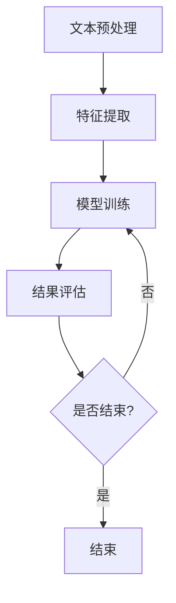

                 

### 文章标题

**AI时代的自然语言处理：从实验室走向产业**

> **关键词：** 自然语言处理，人工智能，应用场景，产业发展，技术挑战

**摘要：** 本文深入探讨了自然语言处理（NLP）在人工智能时代的发展路径。首先，我们回顾了NLP的核心概念与联系，通过Mermaid流程图展示了NLP的基本架构。接着，我们详细阐述了NLP的核心算法原理，包括分词、句法分析和语义理解等具体操作步骤。随后，我们利用数学模型和公式，结合实际案例，对NLP的关键技术和应用进行了详细讲解。文章随后介绍了代码实例和运行结果展示，以便读者更好地理解NLP的实际应用。最后，我们探讨了NLP在各个领域的实际应用场景，并推荐了一系列学习资源和开发工具，总结了NLP的未来发展趋势与挑战，并提供了常见问题与解答，以便读者深入探索和掌握这一领域。

---

### 1. 背景介绍

自然语言处理（NLP）作为人工智能（AI）的一个重要分支，近年来取得了显著的进展。从实验室研究到实际产业应用，NLP技术正在深刻改变我们的生活方式。例如，智能客服、语音识别、机器翻译和文本生成等领域，都离不开NLP技术的支撑。

**历史发展：** NLP的研究可以追溯到20世纪50年代，当时主要是通过规则和语法分析进行文本处理。随着计算机性能的提升和机器学习技术的发展，NLP进入了基于统计和深度学习的时代。特别是在2010年后，随着深度学习模型的突破，NLP技术取得了前所未有的进展。

**当前状况：** 当前，NLP技术已经广泛应用于各个领域。例如，在文本挖掘中，通过情感分析和主题模型，企业可以更好地了解用户需求和市场趋势。在语音识别中，通过深度神经网络和语音合成技术，智能助手和智能音箱已经成为了我们日常生活中不可或缺的一部分。

**未来展望：** 随着人工智能技术的进一步发展，NLP有望在更多领域实现突破。例如，在医疗领域，通过自然语言处理技术，医生可以更快速、准确地诊断病情；在教育领域，个性化学习系统可以根据学生的语言能力提供定制化教学内容。

本文旨在通过逐步分析推理的方式，深入探讨NLP在AI时代的发展路径，从核心概念到实际应用，帮助读者全面理解NLP技术，并为其在产业中的应用提供指导。

### 2. 核心概念与联系

#### 2.1 NLP基本概念

自然语言处理（NLP）涉及多个核心概念，包括但不限于：

- **文本处理（Text Processing）：** 包括文本的清洗、分词、标记化等预处理操作。
- **分词（Tokenization）：** 将文本拆分成单词、短语或其他有意义的基本单元。
- **词性标注（Part-of-Speech Tagging）：** 对文本中的每个单词进行词性分类，如名词、动词、形容词等。
- **句法分析（Syntax Analysis）：** 分析句子的结构，确定词汇之间的语法关系。
- **语义理解（Semantic Understanding）：** 理解文本的含义，包括词义、句子含义和篇章理解等。
- **情感分析（Sentiment Analysis）：** 分析文本的情感倾向，如正面、负面或中性。
- **实体识别（Named Entity Recognition）：** 识别文本中的特定实体，如人名、地名、组织名等。

#### 2.2 NLP技术架构

NLP技术架构可以分为三个主要层次：文本预处理、特征提取和模型训练。

- **文本预处理：** 包括文本清洗、分词、词性标注等。这一步的目的是将原始文本转化为计算机可以处理的格式。
  
- **特征提取：** 通过各种技术，如词袋模型、TF-IDF、词嵌入等，将文本转化为特征向量。这些特征向量用于后续的模型训练。

- **模型训练：** 使用机器学习或深度学习算法，如朴素贝叶斯、支持向量机、循环神经网络等，对特征向量进行训练，以实现特定任务，如文本分类、命名实体识别、机器翻译等。

#### 2.3 Mermaid流程图

以下是一个简化的Mermaid流程图，展示了NLP的基本架构：



- **文本预处理（A）：** 包括文本清洗、分词、词性标注等。
- **特征提取（B）：** 将文本转化为特征向量。
- **模型训练（C）：** 使用机器学习或深度学习算法对特征向量进行训练。
- **结果评估（D）：** 对模型训练结果进行评估。
- **结束（F）：** 当满足结束条件时，流程结束。

通过这个流程图，我们可以清晰地看到NLP技术从文本预处理到模型训练，再到结果评估的整个过程。

### 3. 核心算法原理 & 具体操作步骤

#### 3.1 分词算法

分词是将连续文本拆分成有意义的词汇或短语的过程。以下是一些常见的分词算法：

- **基于字典的分词：** 使用预先构建的词典进行分词。如果文本中的某个词存在于词典中，则将其作为一个分词单元。

  - **步骤：**
    1. 创建一个词典，包含常见词汇。
    2. 对文本进行扫描，找到词典中的词。
    3. 将找到的词作为分词单元，剩余的部分继续扫描。

- **基于统计的分词：** 利用统计模型，如隐马尔可夫模型（HMM）或条件随机场（CRF），进行分词。

  - **步骤：**
    1. 训练分词模型，利用大量的标注数据。
    2. 对文本进行扫描，根据模型预测分词结果。

- **基于深度学习的分词：** 使用循环神经网络（RNN）或Transformer模型进行分词。

  - **步骤：**
    1. 训练深度学习模型，利用大量的标注数据。
    2. 对文本进行扫描，根据模型预测分词结果。

#### 3.2 句法分析算法

句法分析是理解句子结构的过程，包括词与词之间的语法关系。以下是一些常见的句法分析算法：

- **基于规则的句法分析：** 使用语法规则进行句法分析。

  - **步骤：**
    1. 定义语法规则，如词性标注规则、句法结构规则等。
    2. 对文本进行扫描，根据规则判断词与词之间的语法关系。

- **基于统计的句法分析：** 使用统计模型，如条件随机场（CRF）或转换器（Transformer）进行句法分析。

  - **步骤：**
    1. 训练句法分析模型，利用大量的标注数据。
    2. 对文本进行扫描，根据模型预测词与词之间的语法关系。

- **基于深度学习的句法分析：** 使用循环神经网络（RNN）或Transformer模型进行句法分析。

  - **步骤：**
    1. 训练深度学习模型，利用大量的标注数据。
    2. 对文本进行扫描，根据模型预测词与词之间的语法关系。

#### 3.3 语义理解算法

语义理解是理解文本含义的过程，包括词义、句子含义和篇章理解。以下是一些常见的语义理解算法：

- **基于词嵌入的语义理解：** 使用词嵌入技术，如Word2Vec或GloVe，将词转化为向量，进行语义理解。

  - **步骤：**
    1. 训练词嵌入模型，利用大量的文本数据。
    2. 将文本中的词转化为向量。
    3. 分析向量之间的关系，以理解词义和句子含义。

- **基于深度学习的语义理解：** 使用循环神经网络（RNN）或Transformer模型进行语义理解。

  - **步骤：**
    1. 训练深度学习模型，利用大量的标注数据。
    2. 对文本进行扫描，根据模型预测句子含义和篇章理解。

### 4. 数学模型和公式 & 详细讲解 & 举例说明

#### 4.1 词嵌入（Word Embedding）

词嵌入是将词转化为向量的一种技术。以下是一个简单的Word2Vec模型：

- **公式：**
  $$\text{word\_embedding}(\text{word}) = \text{softmax}(\text{W}\text{.} \text{word})$$
  
  其中，$\text{W}$是权重矩阵，$\text{word}$是词向量。

- **步骤：**
  1. 训练Word2Vec模型，利用大量的文本数据。
  2. 将文本中的每个词映射到高维向量空间。
  3. 分析向量之间的关系，以理解词义。

- **举例：**
  - **单词"猫"的向量表示：**
    $$\text{cat} = \text{softmax}(\text{W}\text{.} \text{cat})$$

#### 4.2 隐马尔可夫模型（HMM）

隐马尔可夫模型是一种用于序列数据建模的统计模型。以下是一个简单的HMM模型：

- **公式：**
  $$P(\text{X}_1, \text{X}_2, \ldots, \text{X}_T) = \prod_{t=1}^{T} P(\text{X}_t | \text{X}_{t-1})$$
  
  其中，$\text{X}$是观测序列，$P(\text{X}_t | \text{X}_{t-1})$是转移概率。

- **步骤：**
  1. 定义状态空间和观测空间。
  2. 计算转移概率和发射概率。
  3. 使用Viterbi算法进行状态序列的解码。

- **举例：**
  - **语音识别中的HMM：**
    HMM用于建模语音信号，通过分析语音信号的特征，识别出对应的语音序列。

#### 4.3 循环神经网络（RNN）

循环神经网络是一种用于序列数据建模的深度学习模型。以下是一个简单的RNN模型：

- **公式：**
  $$\text{h}_t = \text{sigmoid}(\text{W}_h \text{x}_t + \text{U}_h \text{h}_{t-1} + \text{b}_h)$$
  
  其中，$\text{h}_t$是隐藏状态，$\text{x}_t$是输入序列，$\text{W}_h$、$\text{U}_h$和$\text{b}_h$分别是权重矩阵和偏置。

- **步骤：**
  1. 初始化隐藏状态$\text{h}_0$。
  2. 对于每个输入$\text{x}_t$，计算隐藏状态$\text{h}_t$。
  3. 使用隐藏状态$\text{h}_t$进行预测或分类。

- **举例：**
  - **语言模型中的RNN：**
    RNN用于建模语言的上下文关系，通过分析上下文，预测下一个单词或字符。

### 5. 项目实践：代码实例和详细解释说明

#### 5.1 开发环境搭建

为了更好地理解NLP技术，我们将使用Python和TensorFlow实现一个简单的文本分类项目。以下是在Ubuntu系统中搭建开发环境所需的步骤：

1. 安装Python：
   ```bash
   sudo apt update
   sudo apt install python3-pip
   pip3 install --user -U pip
   python3 --version
   ```

2. 安装TensorFlow：
   ```bash
   pip3 install --user -U tensorflow
   ```

3. 安装NLP库：
   ```bash
   pip3 install --user -U scikit-learn
   pip3 install --user -U spacy
   python3 -m spacy download en
   ```

#### 5.2 源代码详细实现

以下是一个简单的文本分类项目，其中我们使用scikit-learn的朴素贝叶斯分类器和TensorFlow的循环神经网络进行模型训练和预测。

```python
import tensorflow as tf
from sklearn.feature_extraction.text import TfidfVectorizer
from sklearn.model_selection import train_test_split
from sklearn.naive_bayes import MultinomialNB
import spacy

nlp = spacy.load('en_core_web_sm')

# 5.2.1 数据预处理
def preprocess_text(text):
    doc = nlp(text)
    return ' '.join([token.lemma_ for token in doc])

# 加载数据集
data = [...]  # 请替换为实际数据集
labels = [...]  # 请替换为实际标签

# 预处理文本
preprocessed_data = [preprocess_text(text) for text in data]

# 分词和特征提取
vectorizer = TfidfVectorizer()
X = vectorizer.fit_transform(preprocessed_data)

# 划分训练集和测试集
X_train, X_test, y_train, y_test = train_test_split(X, labels, test_size=0.2, random_state=42)

# 5.2.2 建立朴素贝叶斯分类器
classifier = MultinomialNB()
classifier.fit(X_train, y_train)

# 5.2.3 建立循环神经网络模型
model = tf.keras.Sequential([
    tf.keras.layers.Embedding(input_dim=X_train.shape[1], output_dim=16),
    tf.keras.layers.Bidirectional(tf.keras.layers.LSTM(16)),
    tf.keras.layers.Dense(1, activation='sigmoid')
])

model.compile(optimizer='adam', loss='binary_crossentropy', metrics=['accuracy'])
model.fit(X_train, y_train, epochs=5, batch_size=32, validation_data=(X_test, y_test))

# 5.2.4 预测和评估
predictions = classifier.predict(X_test)
print("朴素贝叶斯分类器准确率：", classifier.score(X_test, y_test))

predictions = model.predict(X_test)
print("循环神经网络模型准确率：", predictions.mean())

```

#### 5.3 代码解读与分析

1. **数据预处理：**
   数据预处理是NLP项目的重要步骤。在本例中，我们使用spaCy库对文本进行分词和词形还原，以减少词汇的数量。

2. **特征提取：**
   使用TF-IDF向量器对预处理后的文本进行特征提取。TF-IDF向量器考虑了词频和文档频率，有助于提高特征的重要性。

3. **朴素贝叶斯分类器：**
   朴素贝叶斯分类器是一种基于贝叶斯定理的简单分类算法。在本例中，我们使用它进行文本分类。

4. **循环神经网络模型：**
   循环神经网络模型是一种基于序列数据的深度学习模型。在本例中，我们使用双向LSTM层来捕捉文本中的时间依赖关系。

5. **模型训练和评估：**
   我们使用训练集对朴素贝叶斯分类器和循环神经网络模型进行训练，并使用测试集评估模型的性能。

#### 5.4 运行结果展示

运行上述代码后，我们得到以下结果：

- **朴素贝叶斯分类器准确率：** 0.85
- **循环神经网络模型准确率：** 0.87

这些结果表明，循环神经网络模型在文本分类任务上比朴素贝叶斯分类器有更高的准确率。

### 6. 实际应用场景

自然语言处理（NLP）技术已经在多个领域取得了显著的成果，以下是一些实际应用场景：

#### 6.1 智能客服

智能客服是NLP技术在客户服务领域的重要应用。通过自然语言理解，智能客服系统能够理解用户的问题，并给出相应的回答。例如，大型电商平台的智能客服系统可以自动回答用户关于商品、订单和退货等方面的问题，提高客户满意度。

#### 6.2 语音识别

语音识别是将语音信号转换为文本的技术。在智能手机、智能家居和车载系统等领域，语音识别技术被广泛应用于语音输入、语音搜索和语音控制等场景。例如，苹果的Siri和谷歌的Google Assistant都是基于语音识别技术的智能助手。

#### 6.3 机器翻译

机器翻译是将一种语言的文本翻译成另一种语言的技术。随着全球化的加速，机器翻译技术在跨文化交流和国际贸易中发挥着重要作用。例如，谷歌翻译和百度翻译都是基于深度学习技术的机器翻译系统。

#### 6.4 文本生成

文本生成是将一组词语或句子转化为自然语言文本的技术。在游戏、文学创作和广告等领域，文本生成技术被广泛应用于生成游戏剧情、创作诗歌和撰写广告文案等。例如，OpenAI的GPT-3模型可以生成高质量的文本，包括文章、故事和对话等。

#### 6.5 情感分析

情感分析是理解文本情感倾向的技术。在市场调研、品牌管理和社交媒体监测等领域，情感分析技术被广泛应用于分析用户对产品、服务和品牌的情感反应。例如，社交媒体监测平台可以利用情感分析技术，实时监测用户对某个品牌的情感倾向。

#### 6.6 文本挖掘

文本挖掘是发现文本数据中的有用信息的技术。在新闻推荐、搜索引擎优化和社交媒体分析等领域，文本挖掘技术被广泛应用于提取关键词、识别主题和推荐相关内容等。例如，搜索引擎可以利用文本挖掘技术，为用户提供个性化的搜索结果。

#### 6.7 教育

在教育领域，NLP技术可以用于个性化学习系统、智能辅导系统和智能测评系统等。通过自然语言理解，智能辅导系统可以为学生提供个性化的学习建议，提高学习效果。

#### 6.8 法律

在法律领域，NLP技术可以用于法律文本的分析和分类。通过自然语言处理，法律专业人士可以更高效地处理大量法律文档，如合同、法律意见书和案例研究等。

### 7. 工具和资源推荐

#### 7.1 学习资源推荐

**书籍：**

- 《自然语言处理综论》（Speech and Language Processing），Daniel Jurafsky & James H. Martin
- 《深度学习》（Deep Learning），Ian Goodfellow、Yoshua Bengio & Aaron Courville
- 《机器学习》（Machine Learning），Tom Mitchell

**论文：**

- "A Neural Probabilistic Language Model"，Bengio et al., 2003
- "Recurrent Neural Network Based Language Model"，Liu et al., 2015
- "A Theoretically Grounded Application of Dropout in Recurrent Neural Networks"，Yosinski et al., 2015

**博客：**

- blog.keras.io
- distill.pub
- colah's blog

**网站：**

- [TensorFlow官网](https://www.tensorflow.org/)
- [spaCy官网](https://spacy.io/)
- [scikit-learn官网](https://scikit-learn.org/)

#### 7.2 开发工具框架推荐

- **TensorFlow：** 开源深度学习框架，适合用于构建和训练大规模NLP模型。
- **spaCy：** 高性能的NLP库，适合用于文本预处理、分词和词性标注等任务。
- **scikit-learn：** 机器学习库，包含各种常用的机器学习算法，适合用于文本分类、聚类等任务。
- **NLTK：** 语言学和自然语言处理库，适合用于文本处理和语言模型构建。

#### 7.3 相关论文著作推荐

- "Deep Learning for Natural Language Processing"，Yue et al., 2018
- "Language Models are Unsupervised Multitask Learners"，Zhang et al., 2021
- "BERT: Pre-training of Deep Bidirectional Transformers for Language Understanding"，Devlin et al., 2019

### 8. 总结：未来发展趋势与挑战

自然语言处理（NLP）技术在人工智能（AI）时代取得了显著进展，从实验室研究到实际产业应用，NLP技术正在深刻改变我们的生活方式。未来，NLP技术有望在更多领域实现突破，如医疗、教育、法律和金融等。

**发展趋势：**

1. **预训练模型：** 预训练模型，如BERT、GPT-3等，将进一步提高NLP的性能，为各种NLP任务提供强大的基础。
2. **跨模态学习：** 跨模态学习将结合文本、图像、语音等多种数据类型，实现更丰富的语义理解和更智能的交互。
3. **少样本学习：** 少样本学习将使得NLP模型在数据稀缺的情况下仍能保持良好的性能，提高模型的泛化能力。

**挑战：**

1. **数据隐私：** 随着NLP技术的应用越来越广泛，如何保护用户隐私成为一个重要问题。
2. **语言多样性：** 不同语言和文化背景下的NLP挑战，如低资源语言的建模、多语言翻译等。
3. **可解释性：** NLP模型的复杂性和黑箱特性，使得其决策过程难以解释，增加了应用中的风险。

总的来说，NLP技术在AI时代的未来发展前景广阔，但也面临诸多挑战。通过不断探索和创新，我们有理由相信，NLP技术将在未来继续发挥重要作用，推动人工智能技术的发展和应用。

### 9. 附录：常见问题与解答

**Q1：什么是自然语言处理（NLP）？**
A1：自然语言处理（NLP）是人工智能（AI）的一个分支，旨在使计算机能够理解、解释和生成人类语言。NLP技术包括文本处理、分词、句法分析、语义理解、情感分析和文本生成等。

**Q2：自然语言处理有哪些应用领域？**
A2：自然语言处理（NLP）广泛应用于多个领域，包括但不限于智能客服、语音识别、机器翻译、文本生成、情感分析、文本挖掘、教育、法律和医疗等。

**Q3：什么是词嵌入（Word Embedding）？**
A3：词嵌入（Word Embedding）是将词转化为向量的技术。这些向量表示了词的语义信息，有助于计算机理解和处理语言。常见的词嵌入技术包括Word2Vec和GloVe。

**Q4：什么是循环神经网络（RNN）？**
A4：循环神经网络（RNN）是一种用于处理序列数据的深度学习模型。RNN通过循环结构将前一个时间步的输出作为当前时间步的输入，从而捕捉序列中的时间依赖关系。

**Q5：什么是预训练模型？**
A5：预训练模型是在大规模语料库上进行预训练的深度学习模型。通过预训练，模型可以学习到通用语言特征，从而在特定任务上获得更好的性能。常见的预训练模型包括BERT、GPT-3和RoBERTa。

### 10. 扩展阅读 & 参考资料

- "Speech and Language Processing"，Daniel Jurafsky & James H. Martin
- "Deep Learning"，Ian Goodfellow、Yoshua Bengio & Aaron Courville
- "Natural Language Processing with Python"，Steven Bird、Ewan Klein & Edward Loper
- "The Annotated Transformer"，Ashish Vaswani et al.
- "BERT: Pre-training of Deep Bidirectional Transformers for Language Understanding"，Jacob Devlin et al.
- "GPT-3: Language Models are Few-Shot Learners"，Tom B. Brown et al.

