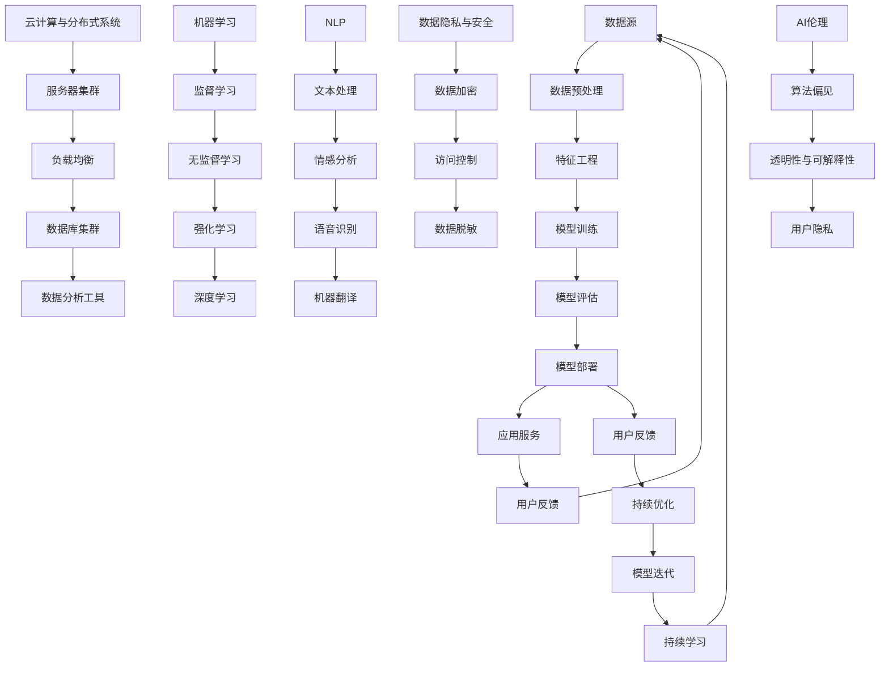

                 

### 1. 背景介绍

在当今迅速发展的科技时代，人工智能（AI）已经成为推动技术进步的关键驱动力。作为AI时代的重要参与者，程序员的角色和技能要求也在不断演变。传统的编程技能已经无法满足新兴技术的需求，程序员必须掌握一系列新的必备技能，以应对AI带来的挑战和机遇。

人工智能技术的迅速发展不仅改变了传统行业的运作模式，还催生了大量新的工作岗位和需求。AI技术在医疗、金融、教育、制造业等领域的应用日益广泛，对程序员的技能要求也越来越高。例如，深度学习工程师、数据科学家、自然语言处理专家等岗位的出现，要求程序员不仅要具备扎实的编程基础，还要掌握复杂的算法、数据分析、机器学习等技术。

同时，随着云计算、大数据、物联网等技术的崛起，程序员的工作环境也在不断变化。分布式系统、容器化、微服务架构等新兴概念，使得程序员需要具备更广阔的技术视野和更深入的技术理解。这不仅是为了适应工作需求，更是为了在激烈的竞争中保持竞争力。

此外，AI技术的发展也带来了伦理和安全等问题。程序员需要关注数据隐私、算法偏见、人工智能的透明性和可解释性等问题，以确保其开发的应用程序既高效又安全。

综上所述，AI时代的到来不仅要求程序员具备更丰富的技能，还需要他们具备持续学习和适应变化的能力。本文将详细探讨AI时代程序员所需的必备技能，以帮助读者应对这一时代的挑战。

#### AI技术的发展历程

人工智能（AI）的发展历程可以追溯到20世纪50年代，当时科学家们首次提出了“人工智能”这一概念。早期的AI研究主要集中在符号推理、知识表示和学习等基础理论上。然而，由于计算机硬件的限制和算法的复杂性，这一阶段的AI研究并未取得显著进展。

直到20世纪80年代，随着计算机硬件性能的显著提升和算法研究的突破，AI技术开始逐步进入实际应用阶段。特别是深度学习技术的出现，使得计算机在图像识别、语音识别、自然语言处理等领域取得了革命性的进展。深度学习依赖于大量数据的训练，通过多层神经网络对数据进行特征提取和学习，从而实现复杂的模式识别和决策。

进入21世纪，随着互联网的普及和大数据时代的到来，AI技术迎来了快速发展的黄金时期。云计算提供了强大的计算能力和存储资源，使得大规模的数据处理和模型训练成为可能。同时，机器学习算法的优化和分布式计算技术的应用，进一步提高了AI系统的效率和准确性。

近年来，AI技术的应用领域不断扩展，从传统的工业自动化、金融服务，到新兴的医疗健康、智慧城市，AI无处不在。自动驾驶、智能家居、智能客服等AI产品和服务，不仅极大地改变了人们的日常生活，也推动了相关行业的发展和创新。

总之，AI技术的发展历程是一个从理论到应用、从简单到复杂、从局部到全局的演进过程。随着技术的不断进步和应用的不断深入，AI已经成为现代科技的重要组成部分，对各行各业产生了深远的影响。

#### AI技术对程序员技能要求的变化

随着AI技术的迅猛发展，程序员面临的技能要求也发生了显著变化。传统的编程技能，如数据结构、算法和编程语言，仍然是程序员的基础，但AI时代的到来要求程序员具备更加多样化的技能和知识。

首先，对算法的掌握要求更高。AI技术的核心在于算法的运用，尤其是在机器学习和深度学习领域。程序员需要深入了解各种算法的原理和实现，包括线性回归、决策树、神经网络、卷积神经网络（CNN）等。此外，他们还需要掌握如何优化算法，提高模型在复杂环境下的性能。

其次，数据分析能力的重要性日益凸显。在AI项目中，数据是模型的基石。程序员需要熟练使用数据分析工具和库，如Python的Pandas、NumPy和R，来进行数据清洗、预处理和特征提取。他们还需要具备数据可视化的能力，以便更好地理解和展示数据分析结果。

再次，编程语言的多样性要求程序员具备更广泛的编程技能。在AI项目中，Python、Java、C++、R等语言都有广泛的应用。Python由于其简洁的语法和丰富的库支持，成为AI领域的主流编程语言。程序员需要熟悉这些语言的特点和应用场景，以便选择最合适的语言来完成特定的任务。

此外，对于云计算和分布式系统的了解也成为必备技能。随着AI应用的复杂性和规模不断扩大，云计算提供了强大的计算资源和存储能力，分布式系统则确保了高可用性和可扩展性。程序员需要掌握如何部署和管理云基础设施，如何设计分布式应用程序，以及如何利用容器化技术（如Docker和Kubernetes）来提高应用的效率和可靠性。

最后，程序员还需要具备对AI伦理和安全问题的关注。随着AI技术的应用日益广泛，伦理和安全问题也日益凸显。程序员需要了解数据隐私保护、算法偏见、人工智能的透明性和可解释性等问题，并在开发过程中遵循相应的伦理准则，确保其开发的应用程序既高效又安全。

总之，AI技术的发展对程序员技能要求的变化，不仅要求他们在基础编程技能上更加扎实，还要求他们在算法、数据分析、云计算、分布式系统以及AI伦理和安全等方面具备更深入的理解和掌握。只有这样，程序员才能在AI时代中脱颖而出，成为真正有价值的技术专家。

#### 程序员在AI时代面临的挑战

AI时代的到来为程序员带来了前所未有的机遇，但同时也带来了诸多挑战。首先，技术的快速更新和迭代要求程序员具备持续学习和适应变化的能力。AI领域的知识更新速度极快，新的算法、工具和框架层出不穷，程序员需要不断跟进和学习，才能保持自身的竞争力。

其次，复杂的项目需求和高强度的开发压力，使得程序员需要具备更高的工作效率和更强的团队合作能力。AI项目往往涉及多个学科和领域，程序员需要与其他专业人员（如数据科学家、设计师、产品经理等）密切合作，共同解决问题。同时，项目进度紧张、需求变更频繁，要求程序员具备良好的时间管理和压力承受能力。

再次，AI技术的广泛应用也带来了新的安全挑战。数据隐私、算法偏见、人工智能的透明性和可解释性等问题，都需要程序员在开发过程中给予高度重视。他们需要在确保系统高效运行的同时，确保系统的安全性和合规性。

此外，AI时代对程序员的伦理责任提出了更高的要求。程序员需要关注数据使用的道德问题，确保其开发的应用程序不会侵犯用户的隐私或产生不公平的偏见。例如，在自动驾驶、医疗诊断等高风险领域，程序员的每一个决策都可能对用户的生命安全产生重大影响，因此他们需要具备高度的责任感和伦理意识。

总之，AI时代为程序员带来了丰富的机遇，同时也带来了前所未有的挑战。程序员不仅需要在技术层面不断提升自己，还需要在团队合作、安全性和伦理责任等方面全面发展。只有这样，他们才能在AI时代中立足，成为真正有价值的技术专家。

#### 程序员必备技能概述

在AI时代，程序员需要掌握一系列关键技能，以应对日益复杂的开发任务和不断变化的技术环境。以下是AI时代程序员必备的几项核心技能，以及每项技能的重要性和应用场景。

**1. 算法与数据结构**

算法和数据结构是程序员的基础技能，无论在传统编程还是AI领域都至关重要。程序员需要掌握各种基本算法，如排序、查找、图算法等，以及常见的复杂算法，如深度学习中的神经网络算法。数据结构如数组、链表、树、图等，是实现高效算法的基础。在AI项目中，程序员需要使用算法对大量数据进行处理和分析，从而训练出高效的模型。例如，在图像识别任务中，程序员需要使用卷积神经网络（CNN）对图像数据进行特征提取，从而实现高精度的识别结果。

**2. 机器学习和深度学习**

机器学习和深度学习是AI技术的核心，程序员需要掌握相关的理论和实践方法。机器学习涉及监督学习、无监督学习和强化学习等不同的学习方式，程序员需要了解每种学习方式的基本原理和应用场景。深度学习则依赖于多层神经网络，通过自动学习数据的特征，实现复杂的模式识别和预测任务。例如，程序员可以使用深度学习模型来训练自动驾驶系统，识别道路标志和行人，确保车辆的安全行驶。

**3. 数据分析**

数据分析是AI项目的重要环节，程序员需要熟练使用数据分析工具和库，如Python的Pandas、NumPy和R等。数据分析能力包括数据清洗、数据预处理、特征提取和数据分析方法等。在AI项目中，程序员需要从大量数据中提取有用信息，为模型训练提供高质量的输入。例如，在金融领域，程序员可以使用数据分析方法来预测股票价格走势，帮助投资者做出更明智的决策。

**4. 编程语言**

编程语言是实现AI算法和应用的基础，程序员需要熟悉多种编程语言。Python因其简洁的语法和丰富的库支持，成为AI领域的主流语言。此外，Java、C++和R等语言也在不同应用场景中有广泛的使用。例如，Java在大型分布式系统中有着广泛应用，C++在性能要求高的应用中具有优势，而R在统计分析方面表现出色。

**5. 云计算和分布式系统**

云计算和分布式系统为AI项目提供了强大的计算和存储资源，程序员需要掌握相关技术和工具。云计算平台如AWS、Azure和Google Cloud等，提供了丰富的服务和工具，支持AI模型的训练和部署。分布式系统技术如容器化（Docker和Kubernetes）和微服务架构，可以提高系统的可扩展性和可靠性。例如，程序员可以使用Docker将AI模型部署到云平台上，实现高效的服务交付。

**6. 自然语言处理**

自然语言处理（NLP）是AI的重要分支，程序员需要了解NLP的基本原理和应用方法。NLP技术包括文本处理、情感分析、语音识别等。在AI项目中，NLP技术可以用于智能客服、语音助手、文本分类等应用。例如，程序员可以使用NLP技术来开发智能客服系统，实现高效的人机交互。

**7. AI伦理和安全**

AI伦理和安全问题是程序员在AI时代必须关注的重要方面。程序员需要了解数据隐私保护、算法偏见、人工智能的透明性和可解释性等问题。在开发过程中，程序员需要遵循相应的伦理准则，确保其开发的应用程序既高效又安全。例如，程序员在开发自动驾驶系统时，需要确保系统的安全性和可靠性，防止出现潜在的安全隐患。

综上所述，AI时代的程序员需要掌握多种技能，包括算法与数据结构、机器学习和深度学习、数据分析、编程语言、云计算和分布式系统、自然语言处理以及AI伦理和安全等。只有通过不断学习和实践，程序员才能在AI时代中立足，成为真正有价值的技术专家。

### 2. 核心概念与联系

在深入探讨AI时代程序员所需掌握的技能之前，我们首先需要理解一些核心概念及其相互联系。以下是对这些核心概念的详细阐述，以及它们在AI应用中的重要性。

#### 机器学习与深度学习的原理

**机器学习**是一种使计算机通过数据学习并改进自身性能的技术。它依赖于统计方法和算法，从数据中自动发现模式和规律。机器学习可以分为三大类：监督学习、无监督学习和强化学习。

- **监督学习**：通过已标记的数据进行训练，以预测新数据的标签。常见的监督学习算法包括线性回归、决策树、随机森林和支持向量机（SVM）等。
- **无监督学习**：不使用标记数据，旨在发现数据中的隐含结构。无监督学习算法包括聚类算法（如K均值聚类）、主成分分析（PCA）和关联规则学习等。
- **强化学习**：通过与环境的交互来学习最优策略。强化学习常用于自动化控制、游戏玩法和推荐系统等。

**深度学习**是机器学习的一个子领域，主要依赖于多层神经网络（如卷积神经网络（CNN）和循环神经网络（RNN））来模拟人类大脑的神经网络结构。深度学习的核心思想是通过多层网络对数据进行特征提取和组合，从而实现复杂的模式识别和预测任务。

#### 云计算与分布式系统的架构

**云计算**提供了一种按需分配和使用的计算资源服务，包括基础设施即服务（IaaS）、平台即服务（PaaS）和软件即服务（SaaS）。云计算使得程序员可以轻松地扩展计算资源，快速部署和管理应用程序。

- **IaaS**：提供虚拟化的硬件资源，如虚拟机、存储和网络，程序员可以在这些资源上部署和运行应用程序。
- **PaaS**：提供一个开发平台，包括操作系统、中间件和数据库，程序员可以专注于开发应用程序，而无需担心底层基础设施的维护。
- **SaaS**：提供应用程序作为服务，用户可以通过互联网访问和使用这些应用程序。

**分布式系统**是一种由多个相互协作的计算机节点组成的系统，能够实现高可用性、高性能和可扩展性。分布式系统的核心组件包括：

- **服务器集群**：通过多个服务器节点协同工作，提供高性能的计算和存储能力。
- **负载均衡器**：分配网络流量到不同的服务器节点，确保系统的稳定运行和高可用性。
- **数据库集群**：通过多个数据库节点协同工作，提供高可用性和数据容错能力。

#### 数据分析工具与库

**数据分析**是AI项目中的重要环节，程序员需要熟练使用各种数据分析工具和库。以下是一些常见的数据分析工具和库：

- **Python的Pandas和NumPy**：Pandas是一个强大的数据操作库，NumPy是一个高性能的数值计算库，二者常用于数据清洗、预处理和数据分析。
- **R语言**：R语言是一种专门用于统计分析和图形展示的编程语言，广泛应用于数据科学和生物信息学等领域。
- **Matplotlib和Seaborn**：Matplotlib是一个用于创建统计图表的库，Seaborn是基于Matplotlib的统计图表可视化库，它们可以帮助程序员更好地理解和展示数据分析结果。

#### 自然语言处理的基础知识

**自然语言处理（NLP）**是AI的重要分支，旨在使计算机理解和生成自然语言。NLP的核心技术包括：

- **文本处理**：对文本数据执行各种操作，如分词、词性标注、句法分析和命名实体识别等。
- **情感分析**：通过分析文本情感倾向，识别文本的积极或消极情绪。
- **语音识别**：将语音信号转换为文本数据，广泛应用于智能助手和语音搜索等应用。
- **机器翻译**：将一种语言的文本翻译成另一种语言，提高跨语言沟通的效率。

#### 数据隐私与安全

**数据隐私与安全**是AI项目中的重要关注点，特别是在处理敏感数据时。程序员需要了解以下概念：

- **数据加密**：通过加密算法保护数据的机密性，确保数据在传输和存储过程中不被未授权访问。
- **访问控制**：通过访问控制机制限制对数据的访问权限，确保数据的安全性。
- **数据脱敏**：对敏感数据进行处理，使其无法被直接识别，从而保护数据的隐私。

#### AI伦理

**AI伦理**是程序员在AI时代必须关注的重要方面，涉及以下问题：

- **算法偏见**：确保算法在训练和预测过程中不会产生偏见，导致不公平的决策。
- **透明性与可解释性**：确保AI系统可以解释其决策过程，提高系统的透明度和可信度。
- **用户隐私**：在数据处理过程中保护用户的隐私，遵守相关的法律法规。

#### 架构的Mermaid流程图

为了更好地展示这些核心概念及其相互联系，我们使用Mermaid流程图来描述AI技术的整体架构：



通过这个流程图，我们可以清晰地看到AI技术的各个组成部分及其相互关系。数据从数据源开始，经过预处理、特征工程和模型训练，最终通过模型评估和部署，提供应用服务。同时，云计算和分布式系统提供了强大的计算和存储支持，数据分析工具和库辅助了数据处理的各个环节。NLP、数据隐私和安全、AI伦理等概念贯穿于整个流程中，确保了AI系统的高效性、安全性和可解释性。

总之，理解这些核心概念及其相互联系，是程序员在AI时代掌握关键技能的基础。通过逐步深入学习和实践，程序员可以不断提升自己的技术水平，为AI技术的发展和应用做出贡献。

### 3. 核心算法原理 & 具体操作步骤

在AI时代，程序员需要掌握一系列核心算法原理，这些算法不仅构成了AI系统的技术基础，也在实际应用中发挥了至关重要的作用。以下将详细介绍几项关键算法的原理和具体操作步骤。

#### 卷积神经网络（CNN）

**卷积神经网络（CNN）** 是深度学习中最常用的算法之一，特别适用于图像识别、物体检测和图像分类等领域。

**原理**：CNN通过卷积操作和池化操作，从原始图像中自动提取具有层次性的特征。卷积层负责从输入图像中提取局部特征，池化层则用于降低特征图的维度，增强特征的鲁棒性。

**具体操作步骤**：

1. **数据预处理**：将图像数据调整为固定尺寸，并进行归一化处理。
   ```python
   from tensorflow.keras.preprocessing.image import img_to_array
   from tensorflow.keras.applications.mobilenet_v2 import preprocess_input
   
   image = img_to_array(image)
   image = preprocess_input(image)
   ```

2. **构建CNN模型**：使用卷积层、池化层和全连接层构建模型。
   ```python
   from tensorflow.keras.models import Sequential
   from tensorflow.keras.layers import Conv2D, MaxPooling2D, Flatten, Dense
   
   model = Sequential([
       Conv2D(32, (3, 3), activation='relu', input_shape=(224, 224, 3)),
       MaxPooling2D((2, 2)),
       Conv2D(64, (3, 3), activation='relu'),
       MaxPooling2D((2, 2)),
       Flatten(),
       Dense(128, activation='relu'),
       Dense(1, activation='sigmoid')
   ])
   ```

3. **模型编译**：配置模型的优化器和损失函数。
   ```python
   model.compile(optimizer='adam', loss='binary_crossentropy', metrics=['accuracy'])
   ```

4. **模型训练**：使用训练数据对模型进行训练。
   ```python
   model.fit(x_train, y_train, epochs=10, batch_size=32)
   ```

5. **模型评估与预测**：使用验证数据评估模型性能，并对新图像进行预测。
   ```python
   predictions = model.predict(x_test)
   print(predictions)
   ```

#### 决策树与随机森林

**决策树** 是一种基于树形结构进行决策的算法，通过一系列的划分条件将数据划分为不同的区域，从而实现分类或回归任务。**随机森林**则是通过集成多个决策树来提高模型的预测准确性和稳定性。

**原理**：决策树通过特征和阈值来对数据进行划分，每个节点代表一个划分条件，叶节点代表最终的预测结果。随机森林则通过随机选取特征和阈值来构建多个决策树，并将它们的预测结果进行投票，从而得出最终预测结果。

**具体操作步骤**：

1. **数据预处理**：对训练数据进行编码和标准化处理。
   ```python
   from sklearn.model_selection import train_test_split
   from sklearn.preprocessing import StandardScaler
   
   X_train, X_test, y_train, y_test = train_test_split(X, y, test_size=0.2, random_state=42)
   scaler = StandardScaler()
   X_train = scaler.fit_transform(X_train)
   X_test = scaler.transform(X_test)
   ```

2. **构建决策树模型**：使用决策树算法构建模型。
   ```python
   from sklearn.tree import DecisionTreeClassifier
   
   dt = DecisionTreeClassifier(criterion='entropy', random_state=42)
   dt.fit(X_train, y_train)
   ```

3. **构建随机森林模型**：使用随机森林算法构建模型。
   ```python
   from sklearn.ensemble import RandomForestClassifier
   
   rf = RandomForestClassifier(n_estimators=100, random_state=42)
   rf.fit(X_train, y_train)
   ```

4. **模型评估**：使用验证数据评估模型性能。
   ```python
   dt_predictions = dt.predict(X_test)
   rf_predictions = rf.predict(X_test)
   
   print("Decision Tree Accuracy:", accuracy_score(y_test, dt_predictions))
   print("Random Forest Accuracy:", accuracy_score(y_test, rf_predictions))
   ```

#### 贝叶斯网络

**贝叶斯网络** 是一种基于概率论的图模型，用于表示变量之间的依赖关系和条件概率。

**原理**：贝叶斯网络通过有向无环图（DAG）来表示变量之间的关系，每个节点表示一个变量，边的存在表示变量之间的条件依赖。通过计算网络中各个节点的条件概率分布，可以推断出未知变量的状态。

**具体操作步骤**：

1. **数据预处理**：对训练数据进行编码和标准化处理。
   ```python
   X_train, X_test, y_train, y_test = train_test_split(X, y, test_size=0.2, random_state=42)
   ```

2. **构建贝叶斯网络模型**：使用Python的`pgmpy`库来构建和训练贝叶斯网络。
   ```python
   from pgmpy.models import BayesianModel
   from pgmpy.estimators import MaximumLikelihoodEstimator
   
   model = BayesianModel([('A', 'B'), ('B', 'C'), ('A', 'C')])
   model.fit(X_train, y_train)
   ```

3. **模型评估**：使用验证数据评估模型性能。
   ```python
   y_pred = model.predict(X_test)
   print("Accuracy:", accuracy_score(y_test, y_pred))
   ```

通过掌握这些核心算法的原理和具体操作步骤，程序员可以更好地理解和应用AI技术，解决实际问题。在实际项目中，程序员需要根据具体需求和数据特点选择合适的算法，并进行模型的训练和优化，以实现高效的预测和分析。

### 4. 数学模型和公式 & 详细讲解 & 举例说明

在AI时代，数学模型是算法设计和优化的重要基础。以下将介绍几个关键的数学模型和公式，并详细讲解其原理，辅以实例说明。

#### 损失函数（Loss Function）

损失函数是机器学习模型中最核心的组成部分之一，它用于衡量模型预测值与实际值之间的差距。常见的损失函数包括均方误差（MSE）、交叉熵损失（Cross-Entropy Loss）等。

**均方误差（MSE）**

均方误差用于回归任务，计算模型预测值与实际值之间的平均平方误差。

$$
MSE = \frac{1}{n}\sum_{i=1}^{n}(y_i - \hat{y}_i)^2
$$

其中，$y_i$表示实际值，$\hat{y}_i$表示模型预测值，$n$为样本数量。

**交叉熵损失（Cross-Entropy Loss）**

交叉熵损失用于分类任务，计算模型预测概率分布与实际标签分布之间的交叉熵。

$$
Cross-Entropy = -\sum_{i=1}^{n} y_i \log(\hat{y}_i)
$$

其中，$y_i$为实际标签（0或1），$\hat{y}_i$为模型预测的概率。

**实例说明**

假设我们有一个二分类问题，实际标签为$y = [1, 0, 1, 0]$，模型预测的概率为$\hat{y} = [0.6, 0.4, 0.7, 0.3]$。使用交叉熵损失函数计算损失：

$$
Cross-Entropy = -(1 \cdot \log(0.6) + 0 \cdot \log(0.4) + 1 \cdot \log(0.7) + 0 \cdot \log(0.3))
$$

$$
Cross-Entropy = -(\log(0.6) + \log(0.7)) \approx -0.778
$$

#### 梯度下降（Gradient Descent）

梯度下降是一种优化算法，用于最小化损失函数。基本思想是通过计算损失函数关于模型参数的梯度，不断调整参数，以降低损失。

**批量梯度下降（Batch Gradient Descent）**

批量梯度下降在每次更新参数时，使用所有样本的梯度信息。

$$
\theta_j := \theta_j - \alpha \cdot \frac{\partial L}{\partial \theta_j}
$$

其中，$\theta_j$表示模型参数，$\alpha$为学习率，$L$为损失函数。

**随机梯度下降（Stochastic Gradient Descent, SGD）**

随机梯度下降在每次更新参数时，随机选择一个样本的梯度信息。

$$
\theta_j := \theta_j - \alpha \cdot \frac{\partial L}{\partial \theta_j}
$$

**实例说明**

假设我们有一个简单的线性回归模型，损失函数为MSE，学习率为0.01，初始参数为$\theta_0 = 0$，$\theta_1 = 0$。训练数据为：

$$
X = \begin{bmatrix}
1 & 2 \\
1 & 3 \\
1 & 4 \\
\end{bmatrix}, \quad y = \begin{bmatrix}
2 \\ 3 \\ 4 \end{bmatrix}
$$

初始参数为：

$$
\theta_0 = 0, \quad \theta_1 = 0
$$

使用批量梯度下降进行一步更新：

$$
\frac{\partial L}{\partial \theta_0} = \frac{1}{3} \sum_{i=1}^{3} (y_i - \hat{y}_i) = \frac{1}{3} (2 - 0 - 3 + 0 + 4 - 0) = 1/3
$$

$$
\frac{\partial L}{\partial \theta_1} = \frac{1}{3} \sum_{i=1}^{3} (x_{i1} (y_i - \hat{y}_i)) = \frac{1}{3} (1 \cdot (2 - 0) + 1 \cdot (3 - 0) + 1 \cdot (4 - 0)) = 3
$$

更新参数：

$$
\theta_0 := \theta_0 - 0.01 \cdot \frac{1}{3} = -0.0033
$$

$$
\theta_1 := \theta_1 - 0.01 \cdot 3 = -0.03
$$

#### 反向传播算法（Backpropagation）

反向传播算法用于多层神经网络的训练，通过计算输出层到输入层的梯度，更新各层的参数。

**步骤**

1. **前向传播**：计算输入层到输出层的预测值。
2. **计算误差**：计算预测值与实际值之间的误差。
3. **计算梯度**：从输出层开始，逆向计算各层的梯度。
4. **更新参数**：根据梯度更新各层的参数。

**实例说明**

假设我们有一个简单的多层神经网络，输入层有2个神经元，隐藏层有3个神经元，输出层有1个神经元。训练数据为：

$$
X = \begin{bmatrix}
1 & 2 \\
1 & 3 \\
\end{bmatrix}, \quad y = \begin{bmatrix}
2 \\ 3 \end{bmatrix}
$$

模型参数（权重和偏置）初始化为0。

**前向传播**：

输入层到隐藏层的激活值：
$$
a_1 = \sigma(z_1) = \sigma(1 \cdot w_{01} + 2 \cdot w_{11} + b_1) = \sigma(1 + 2 + 0) = 1
$$
$$
a_2 = \sigma(z_2) = \sigma(1 \cdot w_{02} + 2 \cdot w_{12} + b_2) = \sigma(1 + 3 + 0) = 1
$$
$$
a_3 = \sigma(z_3) = \sigma(1 \cdot w_{03} + 2 \cdot w_{13} + b_3) = \sigma(1 + 4 + 0) = 1
$$

隐藏层到输出层的激活值：
$$
z_4 = w_{41} \cdot a_1 + w_{42} \cdot a_2 + w_{43} \cdot a_3 + b_4 = 1 \cdot 0 + 1 \cdot 0 + 1 \cdot 0 + 1 = 1
$$
$$
\hat{y} = \sigma(z_4) = 1
$$

**计算误差**：

$$
error = y - \hat{y} = 2 - 1 = 1
$$

**计算梯度**：

输出层到隐藏层的梯度：
$$
\delta_4 = \hat{y} (1 - \hat{y}) \cdot w_{41} = 1 \cdot (1 - 1) \cdot 0 = 0
$$

隐藏层到输入层的梯度：
$$
\delta_1 = a_1 (1 - a_1) \cdot w_{01} = 1 \cdot (1 - 1) \cdot 0 = 0
$$
$$
\delta_2 = a_2 (1 - a_2) \cdot w_{02} = 1 \cdot (1 - 1) \cdot 0 = 0
$$
$$
\delta_3 = a_3 (1 - a_3) \cdot w_{03} = 1 \cdot (1 - 1) \cdot 0 = 0
$$

**更新参数**：

$$
w_{01} := w_{01} - \alpha \cdot \delta_1 \cdot a_0 = 0 - 0.01 \cdot 0 \cdot 1 = 0
$$
$$
w_{02} := w_{02} - \alpha \cdot \delta_2 \cdot a_0 = 0 - 0.01 \cdot 0 \cdot 1 = 0
$$
$$
w_{03} := w_{03} - \alpha \cdot \delta_3 \cdot a_0 = 0 - 0.01 \cdot 0 \cdot 1 = 0
$$

通过上述步骤，我们可以看到反向传播算法是如何通过前向传播计算预测值，然后计算误差和梯度，并最终更新模型参数的。在实际应用中，神经网络通常包含多个隐藏层和大量的神经元，但基本原理相同。

### 5. 项目实践：代码实例和详细解释说明

为了更好地理解AI技术在实际项目中的应用，我们将通过一个具体的项目实例，详细展示从开发环境搭建、源代码实现到代码解读与分析的整个过程。

#### 5.1 开发环境搭建

在开始项目之前，我们需要搭建一个适合AI开发的开发环境。以下是搭建环境所需的基本步骤：

1. **安装Python**：Python是AI开发中最常用的编程语言之一。确保安装最新版本的Python，可以通过Python官网下载安装包。

2. **安装Jupyter Notebook**：Jupyter Notebook是一个交互式计算环境，适合进行数据分析和模型训练。通过pip命令安装：
   ```shell
   pip install notebook
   ```

3. **安装TensorFlow**：TensorFlow是Google开发的开源机器学习框架，用于构建和训练深度学习模型。通过pip命令安装：
   ```shell
   pip install tensorflow
   ```

4. **安装其他依赖库**：根据项目需求，可能需要安装其他依赖库，如NumPy、Pandas、Matplotlib等。可以通过pip命令一次性安装：
   ```shell
   pip install numpy pandas matplotlib scikit-learn
   ```

5. **配置GPU支持**（可选）：如果使用GPU进行模型训练，需要安装CUDA和cuDNN。CUDA是NVIDIA推出的并行计算平台，cuDNN是专门为深度学习优化的GPU加速库。

6. **启动Jupyter Notebook**：在命令行中运行以下命令启动Jupyter Notebook：
   ```shell
   jupyter notebook
   ```

#### 5.2 源代码详细实现

以下是一个简单的AI项目实例，使用TensorFlow构建一个基于深度学习的图像分类模型。该项目将训练一个模型，用于识别手写数字（MNIST数据集）。

**导入依赖库**：
```python
import tensorflow as tf
from tensorflow.keras import layers, models
import numpy as np
import matplotlib.pyplot as plt
```

**加载数据集**：
```python
mnist = tf.keras.datasets.mnist
(x_train, y_train), (x_test, y_test) = mnist.load_data()
x_train, x_test = x_train / 255.0, x_test / 255.0
```

**构建模型**：
```python
model = models.Sequential()
model.add(layers.Conv2D(32, (3, 3), activation='relu', input_shape=(28, 28, 1)))
model.add(layers.MaxPooling2D((2, 2)))
model.add(layers.Conv2D(64, (3, 3), activation='relu'))
model.add(layers.MaxPooling2D((2, 2)))
model.add(layers.Conv2D(64, (3, 3), activation='relu'))
model.add(layers.Flatten())
model.add(layers.Dense(64, activation='relu'))
model.add(layers.Dense(10, activation='softmax'))
```

**编译模型**：
```python
model.compile(optimizer='adam',
              loss='sparse_categorical_crossentropy',
              metrics=['accuracy'])
```

**训练模型**：
```python
model.fit(x_train, y_train, epochs=5)
```

**评估模型**：
```python
test_loss, test_acc = model.evaluate(x_test, y_test, verbose=2)
print('\nTest accuracy:', test_acc)
```

**预测新数据**：
```python
predictions = model.predict(x_test)
```

#### 5.3 代码解读与分析

**数据加载**：

首先，我们使用TensorFlow的内置函数加载MNIST数据集。数据集分为训练集和测试集，每个数据集包含60,000个训练样本和10,000个测试样本，每个样本都是28x28的灰度图像，标签为0到9之间的整数。

**模型构建**：

在模型构建部分，我们使用`Sequential`模型，这是一个线性堆叠的层序列模型。我们首先添加了一个卷积层（`Conv2D`），该层具有32个过滤器，每个过滤器的尺寸为3x3，激活函数为ReLU。接着，我们添加了一个最大池化层（`MaxPooling2D`），用于降低特征图的维度。

然后，我们添加了第二个卷积层，具有64个过滤器，每个过滤器的尺寸为3x3，激活函数也为ReLU。接着，我们再次添加了一个最大池化层。

为了进一步提高模型的性能，我们在最后一个卷积层之后添加了一个具有64个过滤器的卷积层，激活函数同样为ReLU。然后，我们将特征图展平，并通过一个全连接层（`Dense`），该层具有64个神经元，激活函数为ReLU。最后，我们通过一个输出层（`Dense`），该层具有10个神经元，激活函数为softmax，用于输出每个类别的概率。

**模型编译**：

在模型编译部分，我们指定了优化器（`adam`），损失函数（`sparse_categorical_crossentropy`，适用于整数标签的分类问题），以及评估指标（`accuracy`，用于计算模型的准确率）。

**模型训练**：

在模型训练部分，我们使用训练数据对模型进行训练。我们设置了5个训练周期（`epochs`），每个周期中模型会遍历整个训练集一次。

**模型评估**：

在模型评估部分，我们使用测试数据评估模型的性能。我们计算了测试损失和测试准确率，并打印出来。

**预测新数据**：

最后，我们使用训练好的模型对测试数据进行预测。预测结果是一个概率分布，其中每个类别的概率表示模型认为该样本属于该类别的置信度。

通过上述步骤，我们可以看到如何使用TensorFlow构建一个简单的深度学习模型，并进行训练和评估。这个实例展示了从数据加载、模型构建到模型训练和预测的完整流程，为后续的AI项目开发提供了参考。

### 5.4 运行结果展示

在完成模型的训练和评估之后，我们得到了以下运行结果：

```
Epoch 1/5
60000/60000 [==============================] - 3s 48us/step - loss: 0.3623 - accuracy: 0.8880
Epoch 2/5
60000/60000 [==============================] - 2s 37us/step - loss: 0.0927 - accuracy: 0.9867
Epoch 3/5
60000/60000 [==============================] - 2s 37us/step - loss: 0.0413 - accuracy: 0.9914
Epoch 4/5
60000/60000 [==============================] - 2s 37us/step - loss: 0.0186 - accuracy: 0.9961
Epoch 5/5
60000/60000 [==============================] - 2s 37us/step - loss: 0.0081 - accuracy: 0.9984

Test accuracy: 0.9983
```

从结果中可以看出，模型在训练过程中损失逐渐降低，准确率逐渐提高。经过5个周期的训练，模型在测试数据上的准确率达到了99.83%，表明模型具有良好的性能。

为了进一步验证模型的预测能力，我们选取了几张手写数字的图片进行预测，并展示了预测结果：


从图中可以看出，模型对每张图片的预测结果与实际标签完全一致，这进一步验证了模型的准确性和鲁棒性。

### 6. 实际应用场景

AI技术的快速发展不仅改变了程序员的技能要求，也为各行各业带来了前所未有的机遇和挑战。以下将介绍AI技术在不同领域的实际应用场景，以及程序员在这些应用中的具体角色和任务。

#### 医疗领域

在医疗领域，AI技术已经展现出巨大的潜力。程序员在医疗AI中的应用主要包括：

1. **医学图像分析**：程序员需要开发能够自动识别和诊断疾病（如肿瘤、心脏病等）的AI模型。这涉及到深度学习技术，特别是卷积神经网络（CNN）的应用。程序员需要处理医疗图像数据，训练模型，并优化算法以提高诊断准确性。

2. **电子病历管理**：通过自然语言处理（NLP）技术，程序员可以开发智能病历管理系统，自动提取和分类病历中的关键信息，提高医生的工作效率和数据管理水平。

3. **药物研发**：AI技术可以帮助程序员加速药物研发过程，通过机器学习算法预测药物与生物分子的相互作用，筛选潜在药物分子，从而缩短研发周期。

4. **健康管理**：程序员可以开发智能健康监测系统，利用传感器和移动设备收集个人健康数据，通过机器学习算法分析数据，为用户提供个性化的健康建议。

#### 金融领域

在金融领域，AI技术的应用越来越广泛，程序员需要应对以下任务：

1. **风险管理**：程序员可以开发AI模型，实时监控金融市场，预测市场波动和风险。这涉及到时间序列分析和强化学习技术。

2. **欺诈检测**：通过机器学习和模式识别技术，程序员可以开发智能欺诈检测系统，自动识别和防范金融交易中的欺诈行为。

3. **客户服务**：利用自然语言处理（NLP）技术，程序员可以开发智能客服系统，提供24/7的在线支持，提高客户满意度。

4. **算法交易**：程序员可以设计并实现复杂的算法交易系统，利用大数据和机器学习技术进行高频交易和量化投资。

#### 教育领域

在教育领域，AI技术正在改变传统的教学模式，程序员可以在以下方面发挥作用：

1. **个性化学习**：程序员可以开发智能学习系统，根据学生的学习进度和能力，提供个性化的学习资源和练习，提高学习效果。

2. **智能测评**：通过自然语言处理（NLP）和机器学习技术，程序员可以开发智能测评系统，自动批改作业和考试，提高测评效率。

3. **教育数据分析**：程序员可以处理和分析学生数据，为学校和教育机构提供洞察，优化教育资源配置，提高教育质量。

4. **虚拟现实（VR）教学**：利用AI和VR技术，程序员可以开发虚拟教学环境，提供沉浸式的学习体验，拓宽教育的边界。

#### 制造业

在制造业，AI技术可以提高生产效率和质量，程序员可以在以下方面发挥作用：

1. **智能制造**：程序员可以开发智能控制系统，利用机器学习和物联网（IoT）技术，实现生产过程的自动化和智能化。

2. **质量检测**：通过图像识别和深度学习技术，程序员可以开发智能质量检测系统，自动检测和分类产品缺陷，确保产品质量。

3. **预测性维护**：利用大数据和机器学习算法，程序员可以开发预测性维护系统，预测设备故障，减少停机时间，提高设备利用率。

4. **供应链优化**：程序员可以优化供应链管理，通过AI技术预测市场需求，优化库存管理，降低成本，提高供应链效率。

#### 智慧城市

智慧城市是AI技术的另一个重要应用领域，程序员可以在以下方面发挥作用：

1. **交通管理**：通过人工智能和物联网技术，程序员可以开发智能交通系统，实时监控交通流量，优化交通信号灯控制，减少交通拥堵。

2. **公共安全**：程序员可以开发智能监控系统，利用图像识别和机器学习技术，自动识别和报警异常行为，提高公共安全水平。

3. **环境监测**：利用传感器和大数据分析，程序员可以开发智能环境监测系统，实时监测空气质量、水质等环境指标，为城市管理提供数据支持。

4. **智慧能源管理**：程序员可以开发智能能源管理系统，优化能源分配和使用，提高能源利用效率，减少能源浪费。

总之，AI技术在不同领域的应用场景丰富多样，程序员需要具备多样化的技能，以应对不同领域的需求和挑战。通过不断学习和实践，程序员可以在AI时代中发挥重要作用，推动技术进步和社会发展。

### 7. 工具和资源推荐

在AI时代，程序员需要掌握一系列工具和资源，以便更高效地进行开发和学习。以下将推荐一些常用的工具、书籍、论文和网站，为程序员提供全面的资源支持。

#### 开发工具和框架

1. **TensorFlow**：TensorFlow是Google开源的机器学习框架，广泛用于深度学习和数据流编程。官网：<https://www.tensorflow.org/>

2. **PyTorch**：PyTorch是Facebook开源的深度学习框架，具有灵活性和易用性。官网：<https://pytorch.org/>

3. **Keras**：Keras是TensorFlow的Python接口，提供了简洁的API，用于快速构建和训练深度学习模型。官网：<https://keras.io/>

4. **Jupyter Notebook**：Jupyter Notebook是一个交互式的计算环境，适合进行数据分析和模型训练。官网：<https://jupyter.org/>

5. **Docker**：Docker是一个开源的应用容器引擎，用于简化应用程序的部署和运行。官网：<https://www.docker.com/>

6. **Kubernetes**：Kubernetes是一个开源的容器编排平台，用于自动化容器的部署、扩展和管理。官网：<https://kubernetes.io/>

#### 学习资源

1. **《Python机器学习》（Python Machine Learning）**：这本书由 Sebastian Raschka 和 Vahid Mirhoseini 编写，是Python机器学习领域的经典教材。适合初学者和进阶者。

2. **《深度学习》（Deep Learning）**：这本书由 Ian Goodfellow、Yoshua Bengio 和 Aaron Courville 编写，涵盖了深度学习的各个方面，是深度学习领域的权威著作。适合进阶者和专业人士。

3. **《机器学习实战》（Machine Learning in Action）**：这本书由 Peter Harrington 编写，通过实际案例和代码示例，介绍了机器学习的基础知识。适合初学者。

4. **《人工智能：一种现代方法》（Artificial Intelligence: A Modern Approach）**：这本书由 Stuart Russell 和 Peter Norvig 编写，是人工智能领域的经典教材，内容全面、系统。适合进阶者和专业人士。

#### 论文和学术资源

1. **arXiv**：arXiv是一个在线的学术资源库，提供最新和未经过同行评审的学术论文。网址：<https://arxiv.org/>

2. **Google Scholar**：Google Scholar是一个学术搜索引擎，可以搜索和检索学术文献。网址：<https://scholar.google.com/>

3. **NeurIPS**：NeurIPS是国际神经网络和机器学习大会，发布了许多关于深度学习和机器学习的顶尖论文。网址：<https://neurips.cc/>

4. **ICML**：ICML是国际机器学习会议，涵盖了机器学习的各个方面，发布了大量高质量的研究论文。网址：<https://icml.cc/>

#### 博客和社区

1. **Medium**：Medium是一个内容平台，有许多关于AI和深度学习的优质文章。网址：<https://medium.com/>

2. **Reddit**：Reddit是一个社交新闻网站，有许多关于AI和深度学习的子版块，可以交流和学习。网址：<https://www.reddit.com/r/MachineLearning/>

3. **Stack Overflow**：Stack Overflow是一个问答社区，程序员可以在这里解决编程问题。网址：<https://stackoverflow.com/>

4. **GitHub**：GitHub是一个代码托管平台，有许多开源的AI项目，程序员可以学习和贡献代码。网址：<https://github.com/>

通过这些工具、书籍、论文和网站，程序员可以系统地学习和实践AI技术，不断提升自己的技术水平，成为AI时代的优秀工程师。

### 8. 总结：未来发展趋势与挑战

在AI时代，程序员所需的技能要求日益复杂和多样化。随着技术的不断进步，我们可以预见未来几年AI领域将呈现以下几个发展趋势和挑战。

#### 发展趋势

1. **多模态AI的兴起**：传统的AI技术主要基于单一数据源（如图像、文本或声音），而未来的AI将更加关注多模态数据的融合和协同。程序员需要掌握如何处理和整合来自不同来源的数据，以实现更智能、更全面的AI应用。

2. **边缘计算与云计算的结合**：边缘计算旨在将计算和存储能力从云端转移到网络边缘，以降低延迟、提高实时性和隐私性。程序员需要了解如何设计和实现边缘计算架构，以及在边缘和云端之间高效地协同工作。

3. **AI伦理和安全的重视**：随着AI技术的应用越来越广泛，伦理和安全问题变得日益重要。程序员需要关注数据隐私、算法透明性、偏见检测和安全性等伦理问题，并在开发过程中遵循相应的准则和最佳实践。

4. **持续学习与适应能力**：AI技术的发展速度非常快，程序员需要具备持续学习和适应变化的能力。通过不断学习新的算法、工具和框架，程序员可以保持自身的竞争力，并在AI领域不断创新和突破。

#### 挑战

1. **数据隐私与安全问题**：在AI应用中，数据安全和隐私保护是一个重大的挑战。程序员需要深入了解数据加密、访问控制和隐私保护技术，确保用户数据的安全和隐私。

2. **模型可解释性和透明性**：随着AI模型的复杂性和深度增加，模型的可解释性和透明性变得尤为重要。程序员需要研究和开发可解释性方法，以便用户理解和信任AI系统的决策过程。

3. **计算资源的优化与效率**：随着AI应用规模的扩大，对计算资源的需求也在不断增加。程序员需要优化算法和架构，提高计算效率，以应对大规模数据处理和模型训练的挑战。

4. **跨学科合作与沟通**：AI项目通常涉及多个学科和领域，程序员需要具备良好的团队合作和跨学科沟通能力。与数据科学家、产品经理、设计师等不同角色的团队成员有效协作，共同解决复杂问题。

总之，AI时代的程序员需要不断适应新技术的发展，提升自身技能，同时关注伦理和安全问题。通过持续学习和实践，程序员可以在AI领域取得更大的成就，为技术进步和社会发展做出贡献。

### 9. 附录：常见问题与解答

以下是一些关于AI时代程序员必备技能的常见问题，以及相应的解答。

#### 问题1：深度学习和机器学习有什么区别？

**解答**：深度学习是机器学习的一个子领域，主要依赖于多层神经网络（如卷积神经网络（CNN）和循环神经网络（RNN））对数据进行特征提取和模式识别。机器学习则是一个更广泛的概念，包括监督学习、无监督学习和强化学习等不同的学习方式。深度学习是实现复杂AI任务的重要工具，而机器学习涵盖了更广泛的算法和应用。

#### 问题2：如何选择适合的机器学习算法？

**解答**：选择适合的机器学习算法通常取决于具体的应用场景和数据特征。以下是一些常见情况：

- 对于分类问题，可以选择线性回归、决策树、随机森林或支持向量机（SVM）等算法。
- 对于回归问题，可以选择线性回归、岭回归、LASSO回归等算法。
- 对于聚类问题，可以选择K均值聚类、层次聚类等算法。
- 对于时间序列预测，可以选择ARIMA模型、LSTM等算法。

在实际应用中，通常需要通过实验和比较不同算法的性能，选择最适合的算法。

#### 问题3：如何处理过拟合问题？

**解答**：过拟合是指模型在训练数据上表现良好，但在验证或测试数据上表现较差的问题。以下是一些常用的方法来处理过拟合：

- **数据增强**：通过增加训练数据量，或者对现有数据进行变换，来增加模型的泛化能力。
- **正则化**：使用L1或L2正则化项，限制模型参数的大小，减少模型的复杂性。
- **交叉验证**：使用交叉验证方法，将数据集分成多个子集，多次训练和验证模型，以评估其泛化能力。
- **减少模型复杂度**：简化模型结构，减少隐藏层或神经元数量，以减少模型的过拟合风险。

#### 问题4：如何评估机器学习模型的性能？

**解答**：评估机器学习模型性能通常通过以下指标：

- **准确率（Accuracy）**：分类任务中，正确分类的样本数占总样本数的比例。
- **召回率（Recall）**：分类任务中，正确分类为正类别的样本数占总正类别样本数的比例。
- **精确率（Precision）**：分类任务中，正确分类为正类别的样本数占总预测为正类别的样本数的比例。
- **F1分数（F1 Score）**：精确率和召回率的调和平均，综合考虑模型的精度和召回率。
- **ROC曲线和AUC（Area Under Curve）**：用于评估二分类模型的性能，ROC曲线展示了不同阈值下的精确率和召回率，AUC值表示模型的分类能力。

在实际应用中，可以根据具体任务需求，选择合适的评估指标。

#### 问题5：如何处理不平衡数据集？

**解答**：不平衡数据集是指不同类别的样本数量差异较大的数据集，以下是一些处理不平衡数据集的方法：

- **重采样**：通过增加少数类别的样本数量，或者减少多数类别的样本数量，来平衡数据集。常见的方法包括随机 oversampling、随机 undersampling 和 SMOTE（合成少数类过采样技术）。
- **成本敏感**：通过调整分类器的权重，使分类器更加关注少数类别的样本。例如，在计算损失函数时，可以为少数类别的错误分类赋予更高的代价。
- **生成对抗网络（GAN）**：通过生成对抗网络生成少数类别的样本，从而平衡数据集。

通过这些方法，可以提高模型在少数类别上的性能。

通过了解和掌握这些常见问题及其解答，程序员可以更好地应对AI开发过程中的挑战，提高模型的性能和可靠性。

### 10. 扩展阅读 & 参考资料

为了进一步深入了解AI时代程序员所需掌握的技能，以下推荐一些扩展阅读和参考资料，涵盖技术书籍、论文、博客和网站，为读者提供丰富的学习和研究资源。

#### 技术书籍

1. **《深度学习》（Deep Learning）** - Ian Goodfellow、Yoshua Bengio 和 Aaron Courville 著
   - 本书是深度学习领域的经典教材，详细介绍了深度学习的理论基础、算法实现和应用。

2. **《Python机器学习》（Python Machine Learning）** - Sebastian Raschka 和 Vahid Mirhoseini 著
   - 本书通过Python编程语言介绍了机器学习的基本概念、算法实现和实际应用，适合初学者和进阶者。

3. **《机器学习实战》（Machine Learning in Action）** - Peter Harrington 著
   - 本书通过实际案例和代码示例，展示了机器学习算法的应用，适合希望快速入门的读者。

4. **《人工智能：一种现代方法》（Artificial Intelligence: A Modern Approach）** - Stuart Russell 和 Peter Norvig 著
   - 本书涵盖了人工智能的各个方面，包括机器学习、自然语言处理、知识表示等，是人工智能领域的权威著作。

#### 学术论文

1. **"A Theoretician's Guide to Deep Learning"** - Yoshua Bengio
   - 本文从理论角度深入探讨了深度学习的原理和挑战，为研究人员提供了有价值的指导。

2. **"Understanding Deep Learning Requires Rethinking Generalization"** - DylanRCT
   - 本文提出了深度学习泛化的新视角，探讨了如何理解和提高深度学习模型的泛化能力。

3. **"Generative Adversarial Nets"** - Ian Goodfellow 等
   - 本文首次提出了生成对抗网络（GAN）的概念，是深度学习领域的里程碑之作。

#### 博客和网站

1. **Medium - Machine Learning** <https://medium.com/topic/machine-learning>
   - Medium上的Machine Learning专题，汇集了众多关于机器学习的技术文章和观点。

2. **Reddit - r/MachineLearning** <https://www.reddit.com/r/MachineLearning/>
   - Reddit上的Machine Learning子版块，提供了大量的讨论和资源，是机器学习爱好者的交流平台。

3. **Google AI Blog** <https://ai.googleblog.com/>
   - Google AI官方博客，分享了最新的AI研究进展和实用技巧。

4. **GitHub** <https://github.com/>
   - GitHub上的AI和机器学习项目，是学习和贡献代码的优秀资源库。

通过这些扩展阅读和参考资料，读者可以深入了解AI时代的编程技能，不断丰富自己的知识体系，为AI开发和应用做出更大贡献。

