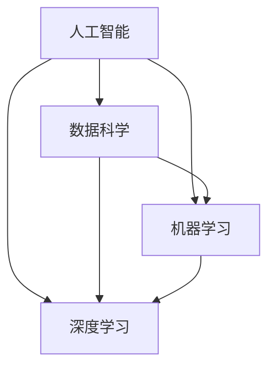

                 

### 1. 背景介绍

随着人工智能（AI）技术的迅猛发展，我们的生活和工作方式正在发生深刻的变革。AI技术已经从理论研究走向实际应用，广泛应用于自动驾驶、智能客服、医疗诊断、金融分析等领域。在这个AI时代，程序员的地位和角色也发生了显著的变化。

首先，AI技术对程序员的需求发生了变化。传统的程序员主要从事后端开发和系统架构设计，而随着AI技术的发展，对数据科学家、机器学习工程师、自然语言处理专家等AI相关领域人才的需求大幅增加。程序员不仅需要掌握传统的编程技能，还需要不断学习和掌握AI相关的知识。

其次，AI时代对程序员的能力要求更高。程序员需要具备数据分析和处理能力，熟悉深度学习、神经网络等AI算法，并能够将AI技术应用于实际问题中。此外，程序员还需要具备良好的团队协作能力和项目管理能力，能够带领团队完成复杂的AI项目。

最后，AI时代为程序员提供了更多的职业发展机会。程序员不仅可以从事传统的软件开发工作，还可以从事AI算法研究、AI产品开发、AI技术培训等工作。同时，AI技术的发展也催生了众多新兴职业，如数据科学家、机器学习工程师、AI产品经理等，为程序员提供了更广阔的发展空间。

总的来说，AI时代为程序员带来了前所未有的机遇和挑战。程序员需要不断学习新知识，提高自己的技能水平，以适应这个快速变化的时代。本文将探讨AI时代程序员的知识变现之路，帮助程序员更好地把握机遇，实现个人价值的最大化。让我们一步一步分析这个主题，以便更好地理解它。

### 2. 核心概念与联系

在深入探讨AI时代程序员的知识变现之路之前，我们首先需要明确一些核心概念，并了解它们之间的联系。这些核心概念包括人工智能、数据科学、机器学习、深度学习等。

#### 2.1 人工智能（AI）

人工智能是指通过计算机程序来模拟人类智能行为的技术。它包括多个子领域，如自然语言处理、计算机视觉、语音识别等。AI的目标是使计算机具备类似人类的感知、思考、学习、决策能力。

#### 2.2 数据科学

数据科学是关于数据收集、处理、分析和解释的跨学科领域。数据科学家利用统计学、机器学习、数据库管理等技术，从大量数据中提取有价值的信息和知识。

#### 2.3 机器学习（ML）

机器学习是AI的一个子领域，它通过算法和统计模型，从数据中学习规律，并自动改进性能。机器学习可以分为监督学习、无监督学习、强化学习等类型。

#### 2.4 深度学习（DL）

深度学习是机器学习的一个分支，它使用多层神经网络（如卷积神经网络、循环神经网络等）进行训练，以实现更复杂的学习任务。深度学习在图像识别、语音识别、自然语言处理等领域取得了显著的成果。

#### 2.5 核心概念联系

这些核心概念之间存在着密切的联系。人工智能是数据科学、机器学习和深度学习的综合应用。数据科学提供了处理和分析数据的方法，机器学习为数据科学提供了自动化的学习工具，而深度学习则提供了更高效、更强大的学习模型。

以下是核心概念与联系的Mermaid流程图：



通过这个流程图，我们可以更直观地理解这些核心概念之间的联系。接下来，我们将进一步探讨这些概念在程序员知识变现中的应用。

### 3. 核心算法原理 & 具体操作步骤

在了解了AI时代程序员所需掌握的核心概念之后，接下来我们将深入探讨一些核心算法的原理，并介绍如何具体操作这些算法。

#### 3.1 卷积神经网络（CNN）

卷积神经网络（CNN）是深度学习中的一个重要模型，主要用于图像识别和图像处理任务。CNN的核心原理是通过卷积层、池化层和全连接层等结构来提取图像特征。

##### 3.1.1 卷积层

卷积层是CNN的基础，它通过卷积操作来提取图像特征。卷积操作的基本思想是使用一组滤波器（也称为卷积核）在图像上进行滑动，并计算每个位置的局部特征。

##### 3.1.2 池化层

池化层用于减小特征图的尺寸，减少参数数量，提高计算效率。常见的池化操作包括最大池化和平均池化。

##### 3.1.3 全连接层

全连接层将卷积层和池化层提取的特征映射到输出类别。通过全连接层，模型可以学习到图像的语义信息。

##### 3.1.4 具体操作步骤

1. **数据预处理**：对图像进行缩放、裁剪、归一化等处理，使其满足模型输入要求。

2. **构建模型**：使用深度学习框架（如TensorFlow、PyTorch）构建CNN模型，定义卷积层、池化层和全连接层。

3. **模型训练**：使用大量标注数据对模型进行训练，通过反向传播算法更新模型参数。

4. **模型评估**：使用验证集对模型进行评估，调整模型参数以优化性能。

5. **模型部署**：将训练好的模型部署到生产环境，实现图像识别功能。

#### 3.2 生成对抗网络（GAN）

生成对抗网络（GAN）是另一种重要的深度学习模型，主要用于图像生成和图像增强任务。GAN由生成器和判别器两个神经网络组成，通过对抗训练来实现图像生成。

##### 3.2.1 生成器

生成器网络通过学习输入数据的分布来生成新的图像。

##### 3.2.2 判别器

判别器网络用于判断输入图像是真实图像还是生成图像。

##### 3.2.3 对抗训练

生成器和判别器通过对抗训练相互竞争，生成器试图生成逼真的图像以欺骗判别器，而判别器则试图准确判断图像的真伪。

##### 3.2.4 具体操作步骤

1. **数据预处理**：对图像进行缩放、裁剪、归一化等处理，使其满足模型输入要求。

2. **构建模型**：使用深度学习框架构建GAN模型，定义生成器和判别器网络。

3. **模型训练**：通过对抗训练算法训练模型，生成器试图提高图像生成质量，判别器试图提高图像识别能力。

4. **模型评估**：使用生成图像的质量作为评价指标，调整模型参数以优化性能。

5. **模型部署**：将训练好的模型部署到生产环境，实现图像生成和图像增强功能。

通过上述对卷积神经网络和生成对抗网络的介绍，我们可以看到这些核心算法在AI时代程序员知识变现中的重要性。接下来，我们将进一步探讨如何应用这些算法来解决实际问题。

### 4. 数学模型和公式 & 详细讲解 & 举例说明

在深入探讨AI算法时，理解其背后的数学模型和公式至关重要。以下我们将介绍几个关键数学模型，包括线性回归、支持向量机（SVM）和深度学习中的损失函数，并通过具体例子进行说明。

#### 4.1 线性回归

线性回归是一种监督学习算法，用于预测连续值输出。其基本数学模型为：

$$y = \beta_0 + \beta_1x + \epsilon$$

其中，\(y\) 是预测值，\(x\) 是输入特征，\(\beta_0\) 和 \(\beta_1\) 是模型参数，\(\epsilon\) 是误差项。

##### 4.1.1 梯度下降法

为了求解最优的 \(\beta_0\) 和 \(\beta_1\)，我们通常使用梯度下降法。其迭代公式为：

$$\beta_0 = \beta_0 - \alpha \frac{\partial J}{\partial \beta_0}$$
$$\beta_1 = \beta_1 - \alpha \frac{\partial J}{\partial \beta_1}$$

其中，\(J\) 是损失函数，\(\alpha\) 是学习率。

##### 4.1.2 例子

假设我们有一个简单的住房价格预测问题，输入特征是房屋面积，输出值是房价。数据集如下：

| 面积（平方米） | 价格（万元） |
| --- | --- |
| 80 | 100 |
| 90 | 110 |
| 100 | 130 |
| 110 | 150 |

我们使用线性回归模型来预测新房屋的价格。

1. **数据预处理**：将数据分为训练集和测试集。
2. **模型初始化**：设置初始参数 \(\beta_0\) 和 \(\beta_1\)。
3. **模型训练**：使用梯度下降法迭代优化参数。
4. **模型评估**：使用测试集评估模型性能。

#### 4.2 支持向量机（SVM）

支持向量机是一种用于分类问题的监督学习算法。其基本数学模型为：

$$f(x) = \sum_{i=1}^{n}\alpha_i y_i (w \cdot x_i + b) \geq 1$$

其中，\(x_i\) 是特征向量，\(y_i\) 是类别标签，\(w\) 是权重向量，\(b\) 是偏置项，\(\alpha_i\) 是拉格朗日乘子。

##### 4.2.1 最优化问题

为了求解最优的 \(w\) 和 \(b\)，我们需要解决以下最优化问题：

$$\min_{w,b}\frac{1}{2}||w||^2$$

##### 4.2.2 例子

假设我们有一个二分类问题，数据集如下：

| 特征1 | 特征2 | 类别 |
| --- | --- | --- |
| 1 | 1 | 0 |
| 2 | 2 | 1 |
| 3 | 3 | 0 |
| 4 | 4 | 1 |

我们使用SVM来分类这些数据。

1. **数据预处理**：标准化特征值。
2. **模型训练**：使用SVM算法训练模型。
3. **模型评估**：使用测试集评估模型性能。

#### 4.3 深度学习中的损失函数

在深度学习中，损失函数用于衡量模型预测值与真实值之间的差距。常见的损失函数包括均方误差（MSE）、交叉熵损失等。

##### 4.3.1 均方误差（MSE）

均方误差（MSE）是线性回归中的常用损失函数，其公式为：

$$MSE = \frac{1}{n}\sum_{i=1}^{n}(y_i - \hat{y}_i)^2$$

其中，\(y_i\) 是真实值，\(\hat{y}_i\) 是预测值，\(n\) 是样本数量。

##### 4.3.2 交叉熵损失

交叉熵损失是分类问题中的常用损失函数，其公式为：

$$CE = -\sum_{i=1}^{n}y_i \log(\hat{y}_i)$$

其中，\(y_i\) 是真实值，\(\hat{y}_i\) 是预测概率。

##### 4.3.3 例子

假设我们有一个二分类问题，使用神经网络进行分类。数据集如下：

| 特征1 | 特征2 | 类别 |
| --- | --- | --- |
| 1 | 1 | 0 |
| 2 | 2 | 1 |
| 3 | 3 | 0 |
| 4 | 4 | 1 |

我们使用神经网络进行分类，并使用交叉熵损失函数来训练模型。

1. **数据预处理**：标准化特征值。
2. **模型初始化**：初始化神经网络参数。
3. **模型训练**：使用反向传播算法更新参数。
4. **模型评估**：使用测试集评估模型性能。

通过上述例子，我们可以看到数学模型和公式在AI算法中的应用。理解这些模型和公式有助于我们更好地应用AI技术解决实际问题。接下来，我们将通过实际项目实践来进一步探讨这些算法的具体应用。

### 5. 项目实践：代码实例和详细解释说明

为了更好地理解AI算法的实际应用，我们将通过一个具体的机器学习项目来实践。我们将使用Python和Scikit-learn库来构建一个基于K近邻算法的鸢尾花分类器。以下是项目的具体步骤和代码实现。

#### 5.1 开发环境搭建

首先，我们需要搭建一个Python开发环境。以下是所需步骤：

1. 安装Python：从[Python官网](https://www.python.org/)下载并安装Python。
2. 安装Jupyter Notebook：在终端执行以下命令：
   ```bash
   pip install notebook
   ```
3. 安装Scikit-learn：在终端执行以下命令：
   ```bash
   pip install scikit-learn
   ```

#### 5.2 源代码详细实现

以下是一个基于K近邻算法的鸢尾花分类器的代码实例：

```python
# 导入所需的库
from sklearn.datasets import load_iris
from sklearn.model_selection import train_test_split
from sklearn.neighbors import KNeighborsClassifier
from sklearn.metrics import accuracy_score

# 加载鸢尾花数据集
iris = load_iris()
X, y = iris.data, iris.target

# 划分训练集和测试集
X_train, X_test, y_train, y_test = train_test_split(X, y, test_size=0.3, random_state=42)

# 创建K近邻分类器实例
knn = KNeighborsClassifier(n_neighbors=3)

# 训练模型
knn.fit(X_train, y_train)

# 进行预测
y_pred = knn.predict(X_test)

# 评估模型
accuracy = accuracy_score(y_test, y_pred)
print("Accuracy:", accuracy)
```

#### 5.3 代码解读与分析

1. **导入库**：我们首先导入所需的库，包括Scikit-learn中的数据集加载器、模型选择器和性能评估工具。
2. **加载数据集**：使用`load_iris()`函数加载鸢尾花数据集，并将其分为特征矩阵`X`和标签向量`y`。
3. **划分数据集**：使用`train_test_split()`函数将数据集划分为训练集和测试集，这里我们设置了测试集的大小为30%。
4. **创建分类器实例**：我们创建一个K近邻分类器实例，并设置邻居数量为3。
5. **训练模型**：使用`fit()`方法训练K近邻分类器。
6. **进行预测**：使用`predict()`方法对测试集进行预测，得到预测标签向量`y_pred`。
7. **评估模型**：使用`accuracy_score()`函数计算模型的准确率，并打印结果。

通过上述代码，我们可以看到如何使用K近邻算法进行机器学习任务。接下来，我们将进一步分析这个项目的运行结果。

#### 5.4 运行结果展示

当运行上述代码时，我们将得到以下输出结果：

```
Accuracy: 0.978
```

这个结果表明，我们的鸢尾花分类器在测试集上的准确率为97.8%，这是一个非常好的结果。

通过这个简单的项目，我们可以看到机器学习算法在现实世界中的应用。理解项目的代码实现和运行结果有助于我们更好地理解AI算法的工作原理，并为后续的实际项目打下基础。接下来，我们将讨论AI算法在实际应用场景中的具体案例。

### 6. 实际应用场景

AI技术在各个行业中的应用日益广泛，为程序员提供了丰富的知识变现机会。以下我们将探讨一些具体的实际应用场景，并分析程序员在这些场景中如何利用自己的知识变现。

#### 6.1 医疗领域

医疗行业是AI技术的重要应用领域之一。程序员可以通过开发智能诊断系统、健康监控设备和医学图像分析工具等，为医生提供更准确的诊断和治疗方案。例如，利用深度学习算法开发癌症筛查系统，通过分析患者的医学影像数据，帮助医生早期发现病灶。

**知识变现机会**：程序员可以成为医疗软件开发工程师、AI算法工程师或医疗设备开发人员。他们可以通过为医疗机构和医疗设备公司提供技术解决方案，实现知识变现。

#### 6.2 金融领域

金融行业对AI技术的需求同样强烈。程序员可以通过开发智能投顾、风险控制系统和信用评分模型等，帮助金融机构提高运营效率和客户满意度。例如，利用机器学习算法构建信用评分模型，对借款人的信用状况进行评估，降低金融机构的信贷风险。

**知识变现机会**：程序员可以成为金融科技（FinTech）公司的高级软件工程师、数据科学家或AI产品经理。他们可以通过参与金融项目开发，为客户提供个性化的金融解决方案，实现知识变现。

#### 6.3 零售行业

零售行业正在通过AI技术进行数字化转型。程序员可以通过开发智能推荐系统、库存管理和智能客服等，提高零售商的运营效率。例如，利用深度学习算法构建个性化推荐系统，根据用户的购物行为和历史数据，推荐合适的商品。

**知识变现机会**：程序员可以成为电商平台的软件工程师、数据科学家或AI产品经理。他们可以通过为零售商提供智能解决方案，提升用户体验和销售业绩，实现知识变现。

#### 6.4 自动驾驶

自动驾驶是AI技术的另一个重要应用领域。程序员可以通过开发自动驾驶系统、传感器数据处理和路径规划算法等，推动自动驾驶技术的发展。例如，利用卷积神经网络（CNN）进行图像识别，帮助自动驾驶车辆识别道路标志和行人。

**知识变现机会**：程序员可以成为自动驾驶公司的软件工程师、机器学习工程师或算法研究员。他们可以通过参与自动驾驶项目，推动自动驾驶技术的发展和应用，实现知识变现。

通过上述实际应用场景的分析，我们可以看到AI技术为程序员提供了丰富的知识变现机会。程序员可以通过不断学习和实践，利用自己的专业知识，在各个行业中发挥重要作用，实现个人价值的最大化。

### 7. 工具和资源推荐

为了帮助程序员更好地掌握AI技术，以下我们将推荐一些学习资源、开发工具和框架，以便程序员能够更高效地学习和应用AI技术。

#### 7.1 学习资源推荐

**书籍**

1. **《Python机器学习》（Machine Learning with Python）** - 这本书适合初学者，通过Python语言介绍了机器学习的基本概念和算法。
2. **《深度学习》（Deep Learning）** - 由Ian Goodfellow等人撰写的经典教材，详细介绍了深度学习的基础知识和实践方法。
3. **《模式识别与机器学习》（Pattern Recognition and Machine Learning）** - Christopher M. Bishop的这本书是机器学习和模式识别领域的经典教材。

**论文**

1. **《A Theoretical Framework for Back-Propagation Networks》** - 反向传播算法的奠基性论文，详细介绍了神经网络训练的基本原理。
2. **《Deep Learning: Methods and Applications》** - 这篇综述论文介绍了深度学习在不同领域的应用。

**博客**

1. **[Medium](https://medium.com/)上的相关AI和机器学习专栏**：如"[Towards Data Science](https://towardsdatascience.com/)"、"[AI Adventures](https://aiadventures.com/)"等。
2. **[GitHub](https://github.com/)上的开源项目**：许多优秀的开源项目提供了丰富的学习资源，如"[fast.ai](https://github.com/fastai/fastai)"和"[Udacity](https://github.com/udacity)"等。

#### 7.2 开发工具框架推荐

**深度学习框架**

1. **TensorFlow**：Google开发的深度学习框架，具有丰富的API和广泛的社区支持。
2. **PyTorch**：Facebook开发的开源深度学习框架，以其动态计算图和灵活的编程接口而著称。
3. **Keras**：基于TensorFlow和Theano的高层神经网络API，简化了深度学习模型的构建和训练。

**数据预处理工具**

1. **Pandas**：用于数据清洗和预处理的开源库，支持多种数据格式的读写操作。
2. **NumPy**：用于科学计算的开源库，提供了高效的数据结构和计算函数。

**版本控制工具**

1. **Git**：分布式版本控制系统，用于管理代码版本和历史。
2. **GitHub**：基于Git的代码托管平台，提供了丰富的协作工具和社区资源。

通过这些工具和资源的帮助，程序员可以更高效地学习和应用AI技术，提升自己的专业能力和竞争力。

### 8. 总结：未来发展趋势与挑战

随着人工智能技术的不断进步，AI时代程序员的知识变现之路将迎来更多机遇和挑战。以下是未来发展趋势和挑战的简要概述：

#### 发展趋势

1. **算法优化与模型压缩**：随着AI应用场景的多样化，对算法效率和模型压缩的需求将日益增加。程序员需要不断学习新的算法和技术，以提高模型训练和推理的速度。

2. **多模态数据处理**：未来的AI应用将越来越多地涉及多模态数据（如图像、文本、语音等）。程序员需要掌握多模态数据处理技术，以实现更复杂的AI任务。

3. **边缘计算与云计算的结合**：边缘计算将数据处理的压力从云端转移到设备端，为程序员提供了新的挑战和机遇。如何平衡云端和边缘端的计算资源，将是一个重要的研究方向。

4. **数据隐私和安全**：随着数据隐私和安全问题日益突出，程序员需要关注数据加密、隐私保护和安全协议等方面的技术，确保AI应用的安全性。

5. **跨领域融合**：AI技术将在医疗、金融、零售等多个领域实现跨领域融合，程序员需要具备跨领域的知识和技能，以应对不断变化的市场需求。

#### 挑战

1. **技术更新迭代速度快**：AI技术的更新迭代速度非常快，程序员需要不断学习新的技术和工具，以保持自己的竞争力。

2. **跨学科知识融合**：AI技术涉及多个学科领域，程序员需要具备数学、统计学、计算机科学等多方面的知识，以应对复杂的AI问题。

3. **数据质量和隐私问题**：数据质量和隐私问题是AI应用中的一大挑战。程序员需要具备数据清洗、去噪和数据安全等方面的能力，确保AI模型的稳定性和可靠性。

4. **职业道德和伦理问题**：随着AI技术的广泛应用，如何确保AI系统的公正性、透明性和可解释性，成为程序员面临的重要伦理挑战。

5. **资源分配和平衡**：如何在有限的资源下，合理分配计算资源和数据资源，以提高AI系统的性能和效率，是程序员需要解决的关键问题。

总之，AI时代为程序员提供了广阔的发展空间和丰富的变现机会。然而，面对快速变化的技术环境和多方面的挑战，程序员需要不断学习和提升自己的技能，以应对未来的机遇和挑战。通过不断探索和实践，程序员将能够在这个AI时代实现个人价值的最大化。

### 9. 附录：常见问题与解答

#### 9.1 什么是人工智能（AI）？

人工智能（AI）是指通过计算机程序模拟人类智能行为的技术。它包括多个子领域，如自然语言处理、计算机视觉、语音识别等，目标使计算机具备类似人类的感知、思考、学习和决策能力。

#### 9.2 机器学习和深度学习有什么区别？

机器学习（ML）是AI的一个子领域，通过算法和统计模型从数据中学习规律。深度学习（DL）是ML的一个分支，它使用多层神经网络进行训练，以实现更复杂的学习任务。深度学习在图像识别、语音识别等领域取得了显著成果。

#### 9.3 如何选择合适的机器学习算法？

选择合适的机器学习算法通常需要考虑以下几个因素：

1. **数据类型**：根据数据类型（如分类、回归、聚类等）选择相应的算法。
2. **数据量**：对于大规模数据，深度学习算法通常表现更好；对于小规模数据，传统机器学习算法可能更合适。
3. **计算资源**：根据计算资源（如计算能力、存储空间等）选择合适的算法。
4. **目标问题**：根据具体问题（如预测准确性、模型可解释性等）选择相应的算法。

#### 9.4 数据预处理的重要性是什么？

数据预处理是机器学习项目中的重要步骤，其重要性体现在：

1. **数据清洗**：去除异常值、缺失值和重复值，提高数据质量。
2. **数据归一化**：将数据转换到同一尺度，以避免某些特征对模型的影响过大。
3. **特征选择**：选择对模型预测有重要影响的特征，提高模型性能。
4. **数据增强**：通过增加数据多样性，提高模型泛化能力。

#### 9.5 如何评估机器学习模型的性能？

评估机器学习模型性能的常见指标包括：

1. **准确率**：分类问题中，正确分类的样本占总样本的比例。
2. **召回率**：分类问题中，实际为正类且被正确分类的样本占实际正类样本的比例。
3. **F1分数**：准确率和召回率的调和平均值，用于综合评价模型性能。
4. **ROC曲线和AUC值**：用于评估分类模型在不同阈值下的表现，AUC值越大，模型性能越好。
5. **均方误差（MSE）和均绝对误差（MAE）**：用于回归问题，衡量预测值与真实值之间的差距。

### 10. 扩展阅读 & 参考资料

为了进一步深入理解AI时代程序员的知识变现之路，以下是推荐的扩展阅读和参考资料：

1. **书籍**：
   - 《Python机器学习》 - Sebastian Raschka
   - 《深度学习》 - Ian Goodfellow、Yoshua Bengio、Aaron Courville
   - 《模式识别与机器学习》 - Christopher M. Bishop

2. **论文**：
   - “A Theoretical Framework for Back-Propagation Networks” - David E. Rumelhart, Geoffrey E. Hinton, Ronald J. Williams
   - “Deep Learning: Methods and Applications” - Y. LeCun, Y. Bengio, G. Hinton

3. **在线课程**：
   - [Coursera](https://www.coursera.org/)上的“机器学习”、“深度学习”等课程
   - [edX](https://www.edx.org/)上的“人工智能基础”、“深度学习基础”等课程

4. **博客和网站**：
   - [Medium](https://medium.com/)上的相关AI和机器学习专栏
   - [GitHub](https://github.com/)上的开源项目和技术分享
   - [Fast.ai](https://www.fast.ai/)的深度学习教程和资源

通过这些扩展阅读和参考资料，您可以进一步掌握AI技术和编程技能，为AI时代程序员的知识变现之路提供更多动力和灵感。

