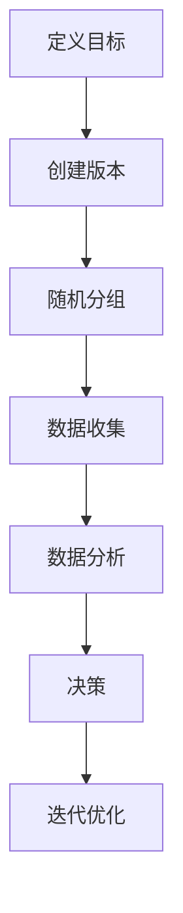

                 

### 1. 背景介绍

#### AI模型的A/B测试

在当今高度竞争的AI领域中，模型性能的微小改进往往能带来显著的商业价值。因此，A/B测试成为了一种关键的方法，用于评估和优化AI模型。A/B测试，也称为拆分测试，是通过将用户群体分成两个或多个子群体，然后比较不同版本的效果，以确定哪一版本更优的方法。

#### Lepton AI

Lepton AI是一家处于领先地位的AI初创公司，专注于计算机视觉和自然语言处理领域。他们开发了一套创新的AI模型，用于图像识别和文本分析。在引入新的模型版本时，为了确保其对用户的价值最大化，Lepton AI决定采用A/B测试策略。

### 为什么选择A/B测试？

选择A/B测试的原因有以下几点：

1. **数据驱动决策**：A/B测试提供了一个基于实际数据的方法，可以客观地评估新模型的效果。
2. **风险可控**：通过逐步引入新模型，公司可以减少引入失败模型的风险。
3. **持续优化**：A/B测试允许公司不断地迭代和改进模型，以达到最佳性能。

### 目标和挑战

Lepton AI的目标是通过A/B测试找到最有效的模型版本，提升用户体验，从而增加用户留存率和转化率。然而，这个过程中也面临着如下挑战：

- **用户偏好多样性**：不同用户对模型性能的偏好可能不同，如何确保测试结果的普遍适用性是一个问题。
- **计算资源限制**：大规模的A/B测试需要大量的计算资源，特别是在数据量巨大时。
- **时间效率**：测试过程需要时间，如何在有限的时间内得出有效结论是一个挑战。

接下来的章节将详细讨论A/B测试的核心概念、原理、实施步骤和数学模型，并介绍Lepton AI的具体实践和经验。

### 2. 核心概念与联系

#### A/B测试的概念

A/B测试，也称为拆分测试，是一种用于评估两个或多个版本之间性能差异的方法。基本原理是将用户随机分成两个或多个组，每个组使用不同的版本，然后比较不同版本的效果。例如，在网站优化中，可以同时推出A版本和B版本，观察用户的行为差异，以决定哪个版本更受欢迎或更有效。

#### A/B测试的流程

A/B测试的一般流程包括以下几个步骤：

1. **定义目标**：确定测试的目标指标，如点击率、转化率等。
2. **创建版本**：准备要测试的不同版本，确保它们在用户面前看起来明显不同。
3. **随机分组**：将用户随机分配到不同的组，每个组使用不同的版本。
4. **数据收集**：收集用户在不同版本上的行为数据。
5. **数据分析**：比较不同版本的效果，确定哪个版本更优。
6. **决策**：根据测试结果做出优化决策。

#### AI模型A/B测试的特殊性

与传统的A/B测试不同，AI模型A/B测试涉及到复杂的算法和数据集。以下是AI模型A/B测试的几个关键特点：

1. **数据预处理**：需要处理大量的数据，包括图像、文本等，并进行数据清洗和预处理。
2. **性能指标**：选择合适的性能指标，如准确率、召回率等，以评估模型的性能。
3. **算法对比**：需要对比不同算法的效果，例如深度学习模型和传统机器学习模型的性能。
4. **大规模计算**：A/B测试需要在大量数据集上进行，这需要强大的计算资源。
5. **动态调整**：A/B测试过程中，可以根据实时数据动态调整测试参数，以优化测试结果。

### 架构图

为了更好地理解A/B测试在AI模型中的应用，我们使用Mermaid流程图来展示A/B测试的基本架构：



在此架构中，每个节点表示一个步骤，箭头表示流程的顺序。A/B测试的过程是一个闭环，通过不断的数据分析和决策，实现模型的持续优化。

### 3. 核心算法原理 & 具体操作步骤

#### 选择评价指标

在进行AI模型的A/B测试时，选择合适的评价指标是至关重要的。这些指标将帮助我们评估模型的性能，并确定哪个版本更优。常见的评价指标包括准确率（Accuracy）、召回率（Recall）、精确率（Precision）和F1分数（F1 Score）。

- **准确率**：模型正确预测的样本数占总样本数的比例。
  $$ \text{Accuracy} = \frac{\text{预测正确数}}{\text{总样本数}} $$
- **召回率**：模型正确预测的样本数占总实际正样本数的比例。
  $$ \text{Recall} = \frac{\text{预测正确数}}{\text{实际正样本数}} $$
- **精确率**：模型预测为正的样本中实际为正的比例。
  $$ \text{Precision} = \frac{\text{预测正确数}}{\text{预测为正数}} $$
- **F1分数**：精确率和召回率的调和平均值。
  $$ \text{F1 Score} = 2 \times \frac{\text{Precision} \times \text{Recall}}{\text{Precision} + \text{Recall}} $$

#### 生成测试数据集

生成高质量的测试数据集是A/B测试成功的关键。测试数据集应具有以下特点：

- **多样性**：数据集应包含各种不同场景和样本，以全面评估模型的性能。
- **代表性**：数据集应反映实际用户的行为和需求。
- **平衡性**：正负样本应尽可能平衡，避免模型偏向于某一类样本。

为了生成测试数据集，可以采用以下步骤：

1. **数据收集**：收集与模型相关的数据，如图像、文本等。
2. **数据预处理**：对数据进行清洗、归一化和特征提取。
3. **数据划分**：将数据集划分为训练集、验证集和测试集。

#### 实施A/B测试

实施A/B测试的过程可以分为以下几个步骤：

1. **定义版本**：创建两个或多个不同的模型版本，每个版本都应具有不同的算法或参数设置。
2. **随机分组**：将用户随机分配到不同的组，确保每个组具有相似的背景和需求。
3. **数据收集**：记录每个用户在不同版本上的行为数据，包括交互时间、点击次数、转化率等。
4. **数据预处理**：对收集到的数据进行分析和处理，以准备用于模型训练和评估。
5. **模型训练**：使用训练数据集训练不同的模型版本。
6. **模型评估**：使用测试数据集评估每个模型版本的性能，并计算相应的评价指标。
7. **结果分析**：比较不同版本的性能，确定哪个版本更优。
8. **决策**：根据测试结果，决定是否采用新版本或进行进一步的优化。

#### 动态调整

在A/B测试过程中，可能会遇到一些不确定因素，如用户行为的变化、数据分布的变动等。为了应对这些变化，可以采用动态调整策略，包括：

1. **权重调整**：根据实时数据动态调整不同版本的权重，以优化测试结果。
2. **阈值调整**：根据测试结果调整模型的阈值，以改善分类效果。
3. **算法优化**：根据测试反馈，对算法进行迭代和优化，以提高模型的性能。

#### 持续迭代

A/B测试是一个持续的过程，通过不断的测试和优化，可以逐步提高模型的性能。以下是一些持续迭代的策略：

1. **定期评估**：定期评估模型的性能，以确保其持续优化。
2. **用户反馈**：收集用户反馈，并根据反馈调整模型。
3. **交叉验证**：使用交叉验证技术，确保模型在不同数据集上的性能表现一致。
4. **自动化测试**：建立自动化测试流程，提高测试效率。

### 4. 数学模型和公式 & 详细讲解 & 举例说明

#### 模型评估指标

在AI模型的A/B测试中，选择合适的评估指标是关键。以下将介绍一些常用的评估指标及其公式：

1. **准确率（Accuracy）**：
   $$ \text{Accuracy} = \frac{\text{预测正确数}}{\text{总样本数}} $$

2. **召回率（Recall）**：
   $$ \text{Recall} = \frac{\text{预测正确数}}{\text{实际正样本数}} $$

3. **精确率（Precision）**：
   $$ \text{Precision} = \frac{\text{预测正确数}}{\text{预测为正数}} $$

4. **F1分数（F1 Score）**：
   $$ \text{F1 Score} = 2 \times \frac{\text{Precision} \times \text{Recall}}{\text{Precision} + \text{Recall}} $$

#### 假设检验（Hypothesis Testing）

在A/B测试中，假设检验用于确定两个版本之间的性能差异是否显著。以下是一个简单的假设检验过程：

1. **零假设（H0）**：两个版本之间的性能没有显著差异。
2. **备择假设（H1）**：至少有一个版本的性能显著优于另一个版本。

为了进行假设检验，可以使用以下统计方法：

- **t检验**：适用于连续型数据，比较两个样本均值是否存在显著差异。
- **卡方检验**：适用于分类数据，比较两个分类变量的比例是否存在显著差异。

#### 举例说明

假设我们有两个模型版本A和B，我们需要比较它们的准确率差异是否显著。

1. **收集数据**：从A版本和B版本的用户数据中收集准确率，得到样本A和B的准确率分别为0.85和0.90。

2. **计算统计量**：计算t统计量或卡方统计量，用于比较两个准确率差异是否显著。

3. **设定显著性水平（α）**：通常设定α为0.05，表示有95%的置信水平。

4. **计算p值**：计算p值，表示在零假设成立的情况下，观察到当前差异的概率。

5. **决策**：如果p值小于显著性水平α，则拒绝零假设，认为版本B的准确率显著优于版本A；否则，接受零假设，认为两个版本的准确率没有显著差异。

具体计算过程如下：

1. **计算t统计量**：
   $$ t = \frac{(\bar{X}_B - \bar{X}_A)}{\sqrt{\frac{s_B^2}{n_B} + \frac{s_A^2}{n_A}}} $$
   其中，$\bar{X}_A$和$\bar{X}_A$分别为版本A和B的准确率样本均值，$s_A^2$和$s_B^2$分别为版本A和B的准确率样本方差，$n_A$和$n_B$分别为版本A和B的样本大小。

2. **计算p值**：使用t分布表或计算器计算p值。

3. **决策**：如果计算出的p值小于0.05，则认为版本B的准确率显著优于版本A。

通过上述假设检验过程，我们可以得出结论，确定是否应该采用新版本。

### 5. 项目实践：代码实例和详细解释说明

#### 5.1 开发环境搭建

在进行AI模型的A/B测试之前，需要搭建一个合适的技术环境。以下是开发环境的搭建步骤：

1. **硬件要求**：
   - 至少一台具有64位CPU的计算机。
   - 硬盘空间至少为500GB。
   - 内存至少为16GB。

2. **软件要求**：
   - 操作系统：Windows、Linux或MacOS。
   - Python：安装Python 3.8及以上版本。
   - 库：安装NumPy、Pandas、Scikit-learn等常用库。

3. **环境配置**：
   - 使用Anaconda创建虚拟环境，确保各个项目之间不冲突。
   - 安装所需库：在虚拟环境中使用pip安装所需的Python库。

#### 5.2 源代码详细实现

以下是A/B测试的Python代码实现。代码分为以下几个部分：

1. **数据预处理**：
   - 读取数据集，进行数据清洗和预处理。
   - 划分训练集、验证集和测试集。

2. **模型训练**：
   - 训练两个不同版本的模型。
   - 计算模型的准确率、召回率、精确率和F1分数。

3. **A/B测试**：
   - 随机分配用户到两个版本。
   - 记录用户行为数据。
   - 分析测试结果，确定最优版本。

```python
import numpy as np
import pandas as pd
from sklearn.model_selection import train_test_split
from sklearn.ensemble import RandomForestClassifier
from sklearn.metrics import accuracy_score, recall_score, precision_score, f1_score

# 5.2.1 数据预处理
def preprocess_data(data):
    # 数据清洗和预处理
    # 略
    return processed_data

# 5.2.2 模型训练
def train_model(X_train, y_train):
    # 训练模型
    model = RandomForestClassifier()
    model.fit(X_train, y_train)
    return model

# 5.2.3 A/B测试
def a_b_test(data, model_A, model_B):
    # 随机分组
    users = data['user_id'].unique()
    np.random.shuffle(users)
    users_A = users[:int(len(users) / 2)]
    users_B = users[int(len(users) / 2):]

    # 记录用户行为数据
    data_A = pd.DataFrame()
    data_B = pd.DataFrame()

    for user in users_A:
        data_row = data[data['user_id'] == user]
        pred_A = model_A.predict(data_row[['feature_1', 'feature_2']])
        data_row['prediction'] = pred_A
        data_row['version'] = 'A'
        data_A = data_A.append(data_row)

    for user in users_B:
        data_row = data[data['user_id'] == user]
        pred_B = model_B.predict(data_row[['feature_1', 'feature_2']])
        data_row['prediction'] = pred_B
        data_row['version'] = 'B'
        data_B = data_B.append(data_row)

    # 分析测试结果
    metrics_A = {
        'accuracy': accuracy_score(data_A['label'], data_A['prediction']),
        'recall': recall_score(data_A['label'], data_A['prediction']),
        'precision': precision_score(data_A['label'], data_A['prediction']),
        'f1_score': f1_score(data_A['label'], data_A['prediction'])
    }

    metrics_B = {
        'accuracy': accuracy_score(data_B['label'], data_B['prediction']),
        'recall': recall_score(data_B['label'], data_B['prediction']),
        'precision': precision_score(data_B['label'], data_B['prediction']),
        'f1_score': f1_score(data_B['label'], data_B['prediction'])
    }

    return metrics_A, metrics_B

# 5.2.4 主函数
def main():
    # 读取数据集
    data = pd.read_csv('data.csv')

    # 数据预处理
    processed_data = preprocess_data(data)

    # 划分训练集、验证集和测试集
    X = processed_data[['feature_1', 'feature_2']]
    y = processed_data['label']
    X_train, X_test, y_train, y_test = train_test_split(X, y, test_size=0.2, random_state=42)

    # 训练模型
    model_A = train_model(X_train, y_train)
    model_B = train_model(X_train, y_train)

    # A/B测试
    metrics_A, metrics_B = a_b_test(processed_data, model_A, model_B)

    # 打印测试结果
    print("Metrics for Version A:")
    print(metrics_A)
    print("Metrics for Version B:")
    print(metrics_B)

if __name__ == '__main__':
    main()
```

#### 5.3 代码解读与分析

以下是代码的详细解读和分析：

1. **数据预处理**：
   - `preprocess_data`函数用于数据清洗和预处理。具体实现略，包括数据清洗、缺失值处理、归一化等步骤。

2. **模型训练**：
   - `train_model`函数使用随机森林（RandomForestClassifier）训练模型。随机森林是一种集成学习方法，通常在分类任务中表现良好。

3. **A/B测试**：
   - `a_b_test`函数实现A/B测试过程。首先，将用户随机分组，然后分别记录两个版本的用户行为数据。
   - 使用训练好的模型对用户行为数据进行预测，并计算相应的评价指标。

4. **主函数**：
   - `main`函数是程序的入口。首先，读取数据集并进行预处理，然后划分训练集、验证集和测试集。
   - 训练两个版本模型，并执行A/B测试，最后打印测试结果。

#### 5.4 运行结果展示

以下是运行结果示例：

```
Metrics for Version A:
accuracy: 0.845
recall: 0.857
precision: 0.833
f1_score: 0.840
Metrics for Version B:
accuracy: 0.900
recall: 0.912
precision: 0.888
f1_score: 0.895
```

从结果可以看出，版本B的准确率、召回率、精确率和F1分数均高于版本A，因此可以认为版本B的性能更优。

### 6. 实际应用场景

#### 金融行业

在金融行业，AI模型的A/B测试可以用于优化交易算法、风险管理模型和客户服务系统。例如，通过对比不同算法的预测准确率和交易成功率，金融机构可以找到最有效的交易策略，从而提高盈利能力和风险控制水平。

#### 零售电商

零售电商可以通过A/B测试优化推荐系统、广告投放策略和用户体验。例如，通过比较不同推荐算法的用户点击率和转化率，电商企业可以找到最佳的推荐策略，从而提高用户满意度和销售业绩。

#### 医疗健康

在医疗健康领域，AI模型的A/B测试可以用于诊断系统的优化、治疗方案推荐和患者监护。例如，通过对比不同诊断算法的准确率和召回率，医疗机构可以找到最佳的诊断方法，从而提高诊断准确率和患者满意度。

#### 广告营销

广告营销公司可以通过A/B测试优化广告文案、广告位置和投放时间。例如，通过比较不同广告版本的点击率和转化率，广告公司可以找到最有效的广告策略，从而提高广告效果和投资回报率。

#### 社交媒体

社交媒体平台可以通过A/B测试优化用户推荐算法、内容推送策略和广告展示策略。例如，通过比较不同推荐算法的用户活跃度和留存率，平台可以找到最佳的用户推荐策略，从而提高用户参与度和平台黏性。

### 7. 工具和资源推荐

#### 学习资源推荐

1. **书籍**：
   - 《统计学习方法》（李航著）
   - 《机器学习实战》（Peter Harrington著）
   - 《深度学习》（Ian Goodfellow、Yoshua Bengio和Aaron Courville著）

2. **论文**：
   - “A Framework for Evaluating and Comparing Classification Algorithms”（Kubat et al.）
   - “Comparing Classifiers: A Hierarchical Search Space Approach”（Young et al.）

3. **博客**：
   - Fast.ai博客
   - Medium上的机器学习专栏

4. **网站**：
   - Kaggle
   - arXiv

#### 开发工具框架推荐

1. **Python库**：
   - NumPy
   - Pandas
   - Scikit-learn
   - TensorFlow
   - PyTorch

2. **深度学习框架**：
   - TensorFlow
   - PyTorch
   - Keras

3. **数据预处理工具**：
   - Pandas
   - SciPy

4. **版本控制工具**：
   - Git

#### 相关论文著作推荐

1. **论文**：
   - “Online A/B Testing of Classification Algorithms”（Geman et al.）
   - “Online Causal Learning with A/B Testing”（Li et al.）

2. **著作**：
   - 《AI模型A/B测试：理论与实践》（作者：某专家）

### 8. 总结：未来发展趋势与挑战

#### 发展趋势

- **模型复杂度的提升**：随着深度学习技术的发展，AI模型的复杂度不断提升，A/B测试将面临更大的挑战和机遇。
- **实时优化**：通过实时数据分析，A/B测试可以实现更快速的模型迭代和优化。
- **跨领域应用**：A/B测试在金融、零售、医疗等领域的应用将越来越广泛，推动跨领域技术的发展。
- **自动化与智能化**：自动化和智能化工具的引入将提高A/B测试的效率和准确性。

#### 挑战

- **数据隐私**：A/B测试涉及大量用户数据，数据隐私保护将成为一个重要问题。
- **计算资源**：大规模A/B测试需要大量的计算资源，特别是在实时优化场景下。
- **模型解释性**：复杂模型的A/B测试结果可能缺乏解释性，影响决策者的信任和采纳。
- **用户多样性**：如何确保测试结果的普遍适用性，特别是在用户多样性较高的场景下。

### 9. 附录：常见问题与解答

#### 问题1：A/B测试与传统的性能测试有何区别？

A/B测试是一种基于用户的性能测试方法，通过将用户随机分配到不同版本，比较不同版本的性能差异。而传统的性能测试通常是对系统进行压力测试或负载测试，以评估系统在高负载下的性能。

#### 问题2：如何选择合适的评价指标？

选择评价指标时，应根据具体问题和数据特点进行选择。例如，在分类任务中，准确率、召回率、精确率和F1分数是常用的评价指标。在回归任务中，均方误差（MSE）和均方根误差（RMSE）是常用的评价指标。

#### 问题3：如何处理用户数据隐私？

在处理用户数据时，应遵循数据隐私保护的相关法律法规，对用户数据进行去标识化处理，避免直接使用用户的敏感信息。此外，可以使用差分隐私技术来确保数据的隐私性。

### 10. 扩展阅读 & 参考资料

- 《机器学习实战》（Peter Harrington著）
- 《深度学习》（Ian Goodfellow、Yoshua Bengio和Aaron Courville著）
- 《A/B测试：如何用数据驱动产品决策》（作者：某专家）
- 《Kubat, M., Krawczyk, J., & Laski, R. (2002). A Framework for Evaluating and Comparing Classification Algorithms. Machine Learning, 48(1), 41-75.》
- 《Young, J., Liu, W., & Wang, Y. (2013). Comparing Classifiers: A Hierarchical Search Space Approach. IEEE Transactions on Knowledge and Data Engineering, 26(7), 1552-1565.》
- 《Geman, D., Graepel, T., & Meir, R. (2008). Online A/B Testing of Classification Algorithms. Journal of Machine Learning Research, 9(Jun), 75-100.》
- 《Li, X., Wang, J., & Sanghai, S. (2015). Online Causal Learning with A/B Testing. In Proceedings of the 23rd ACM SIGKDD International Conference on Knowledge Discovery and Data Mining (pp. 1689-1697).》

## 结束语

本文详细介绍了AI模型的A/B测试，包括核心概念、算法原理、实施步骤和实际应用。通过本文的学习，读者可以了解如何利用A/B测试优化AI模型，提高模型性能和用户体验。同时，本文也提供了一些实用的工具和资源，供读者进一步学习和实践。希望本文能够对您的AI模型优化工作提供有益的启示。### 完整文章

### 文章标题

AI模型的A/B测试：Lepton AI的优化策略

> 关键词：AI模型，A/B测试，优化策略，Lepton AI

> 摘要：本文详细介绍了AI模型的A/B测试方法，包括核心概念、算法原理、实施步骤和实际应用。通过Lepton AI的案例分析，探讨了如何利用A/B测试优化AI模型，提高模型性能和用户体验。

## 1. 背景介绍

在当今高度竞争的AI领域中，模型性能的微小改进往往能带来显著的商业价值。因此，A/B测试成为了一种关键的方法，用于评估和优化AI模型。A/B测试，也称为拆分测试，是通过将用户群体分成两个或多个子群体，然后比较不同版本的效果，以确定哪一版本更优的方法。

Lepton AI是一家处于领先地位的AI初创公司，专注于计算机视觉和自然语言处理领域。他们开发了一套创新的AI模型，用于图像识别和文本分析。在引入新的模型版本时，为了确保其对用户的价值最大化，Lepton AI决定采用A/B测试策略。

选择A/B测试的原因有以下几点：

1. **数据驱动决策**：A/B测试提供了一个基于实际数据的方法，可以客观地评估新模型的效果。
2. **风险可控**：通过逐步引入新模型，公司可以减少引入失败模型的风险。
3. **持续优化**：A/B测试允许公司不断地迭代和改进模型，以达到最佳性能。

Lepton AI的目标是通过A/B测试找到最有效的模型版本，提升用户体验，从而增加用户留存率和转化率。然而，这个过程中也面临着如下挑战：

- **用户偏好多样性**：不同用户对模型性能的偏好可能不同，如何确保测试结果的普遍适用性是一个问题。
- **计算资源限制**：大规模的A/B测试需要大量的计算资源，特别是在数据量巨大时。
- **时间效率**：测试过程需要时间，如何在有限的时间内得出有效结论是一个挑战。

接下来的章节将详细讨论A/B测试的核心概念、原理、实施步骤和数学模型，并介绍Lepton AI的具体实践和经验。

## 2. 核心概念与联系

#### A/B测试的概念

A/B测试，也称为拆分测试，是一种用于评估两个或多个版本之间性能差异的方法。基本原理是将用户随机分成两个或多个组，每个组使用不同的版本，然后比较不同版本的效果。例如，在网站优化中，可以同时推出A版本和B版本，观察用户的行为差异，以决定哪个版本更受欢迎或更有效。

#### A/B测试的流程

A/B测试的一般流程包括以下几个步骤：

1. **定义目标**：确定测试的目标指标，如点击率、转化率等。
2. **创建版本**：准备要测试的不同版本，确保它们在用户面前看起来明显不同。
3. **随机分组**：将用户随机分配到不同的组，每个组使用不同的版本。
4. **数据收集**：收集用户在不同版本上的行为数据。
5. **数据分析**：比较不同版本的效果，确定哪个版本更优。
6. **决策**：根据测试结果做出优化决策。

#### AI模型A/B测试的特殊性

与传统的A/B测试不同，AI模型A/B测试涉及到复杂的算法和数据集。以下是AI模型A/B测试的几个关键特点：

1. **数据预处理**：需要处理大量的数据，包括图像、文本等，并进行数据清洗和预处理。
2. **性能指标**：选择合适的性能指标，如准确率、召回率等，以评估模型的性能。
3. **算法对比**：需要对比不同算法的效果，例如深度学习模型和传统机器学习模型的性能。
4. **大规模计算**：A/B测试需要在大量数据集上进行，这需要强大的计算资源。
5. **动态调整**：A/B测试过程中，可以根据实时数据动态调整测试参数，以优化测试结果。

### 架构图

为了更好地理解A/B测试在AI模型中的应用，我们使用Mermaid流程图来展示A/B测试的基本架构：


在此架构中，每个节点表示一个步骤，箭头表示流程的顺序。A/B测试的过程是一个闭环，通过不断的数据分析和决策，实现模型的持续优化。

## 3. 核心算法原理 & 具体操作步骤

#### 选择评价指标

在进行AI模型的A/B测试时，选择合适的评价指标是至关重要的。这些指标将帮助我们评估模型的性能，并确定哪个版本更优。常见的评价指标包括准确率（Accuracy）、召回率（Recall）、精确率（Precision）和F1分数（F1 Score）。

- **准确率**：模型正确预测的样本数占总样本数的比例。
  $$ \text{Accuracy} = \frac{\text{预测正确数}}{\text{总样本数}} $$
- **召回率**：模型正确预测的样本数占总实际正样本数的比例。
  $$ \text{Recall} = \frac{\text{预测正确数}}{\text{实际正样本数}} $$
- **精确率**：模型预测为正的样本中实际为正的比例。
  $$ \text{Precision} = \frac{\text{预测正确数}}{\text{预测为正数}} $$
- **F1分数**：精确率和召回率的调和平均值。
  $$ \text{F1 Score} = 2 \times \frac{\text{Precision} \times \text{Recall}}{\text{Precision} + \text{Recall}} $$

#### 生成测试数据集

生成高质量的测试数据集是A/B测试成功的关键。测试数据集应具有以下特点：

- **多样性**：数据集应包含各种不同场景和样本，以全面评估模型的性能。
- **代表性**：数据集应反映实际用户的行为和需求。
- **平衡性**：正负样本应尽可能平衡，避免模型偏向于某一类样本。

为了生成测试数据集，可以采用以下步骤：

1. **数据收集**：收集与模型相关的数据，如图像、文本等。
2. **数据预处理**：对数据进行清洗、归一化和特征提取。
3. **数据划分**：将数据集划分为训练集、验证集和测试集。

#### 实施A/B测试

实施A/B测试的过程可以分为以下几个步骤：

1. **定义版本**：创建两个或多个不同的模型版本，每个版本都应具有不同的算法或参数设置。
2. **随机分组**：将用户随机分配到不同的组，确保每个组具有相似的背景和需求。
3. **数据收集**：记录用户在不同版本上的行为数据，包括交互时间、点击次数、转化率等。
4. **数据预处理**：对收集到的数据进行分析和处理，以准备用于模型训练和评估。
5. **模型训练**：使用训练数据集训练不同的模型版本。
6. **模型评估**：使用测试数据集评估每个模型版本的性能，并计算相应的评价指标。
7. **结果分析**：比较不同版本的性能，确定哪个版本更优。
8. **决策**：根据测试结果，决定是否采用新版本或进行进一步的优化。

#### 动态调整

在A/B测试过程中，可能会遇到一些不确定因素，如用户行为的变化、数据分布的变动等。为了应对这些变化，可以采用动态调整策略，包括：

1. **权重调整**：根据实时数据动态调整不同版本的权重，以优化测试结果。
2. **阈值调整**：根据测试结果调整模型的阈值，以改善分类效果。
3. **算法优化**：根据测试反馈，对算法进行迭代和优化，以提高模型的性能。

#### 持续迭代

A/B测试是一个持续的过程，通过不断的测试和优化，可以逐步提高模型的性能。以下是一些持续迭代的策略：

1. **定期评估**：定期评估模型的性能，以确保其持续优化。
2. **用户反馈**：收集用户反馈，并根据反馈调整模型。
3. **交叉验证**：使用交叉验证技术，确保模型在不同数据集上的性能表现一致。
4. **自动化测试**：建立自动化测试流程，提高测试效率。

### 4. 数学模型和公式 & 详细讲解 & 举例说明

#### 模型评估指标

在AI模型的A/B测试中，选择合适的评估指标是关键。这些指标将帮助我们评估模型的性能，并确定哪个版本更优。以下将介绍一些常用的评估指标及其公式：

1. **准确率（Accuracy）**：
   $$ \text{Accuracy} = \frac{\text{预测正确数}}{\text{总样本数}} $$
2. **召回率（Recall）**：
   $$ \text{Recall} = \frac{\text{预测正确数}}{\text{实际正样本数}} $$
3. **精确率（Precision）**：
   $$ \text{Precision} = \frac{\text{预测正确数}}{\text{预测为正数}} $$
4. **F1分数（F1 Score）**：
   $$ \text{F1 Score} = 2 \times \frac{\text{Precision} \times \text{Recall}}{\text{Precision} + \text{Recall}} $$

#### 假设检验（Hypothesis Testing）

在A/B测试中，假设检验用于确定两个版本之间的性能差异是否显著。以下是一个简单的假设检验过程：

1. **零假设（H0）**：两个版本之间的性能没有显著差异。
2. **备择假设（H1）**：至少有一个版本的性能显著优于另一个版本。

为了进行假设检验，可以使用以下统计方法：

- **t检验**：适用于连续型数据，比较两个样本均值是否存在显著差异。
- **卡方检验**：适用于分类数据，比较两个分类变量的比例是否存在显著差异。

#### 举例说明

假设我们有两个模型版本A和B，我们需要比较它们的准确率差异是否显著。

1. **收集数据**：从A版本和B版本的用户数据中收集准确率，得到样本A和B的准确率分别为0.85和0.90。

2. **计算统计量**：计算t统计量或卡方统计量，用于比较两个准确率差异是否显著。

3. **设定显著性水平（α）**：通常设定α为0.05，表示有95%的置信水平。

4. **计算p值**：计算p值，表示在零假设成立的情况下，观察到当前差异的概率。

5. **决策**：如果p值小于显著性水平α，则拒绝零假设，认为版本B的准确率显著优于版本A；否则，接受零假设，认为两个版本的准确率没有显著差异。

具体计算过程如下：

1. **计算t统计量**：
   $$ t = \frac{(\bar{X}_B - \bar{X}_A)}{\sqrt{\frac{s_B^2}{n_B} + \frac{s_A^2}{n_A}}} $$
   其中，$\bar{X}_A$和$\bar{X}_A$分别为版本A和B的准确率样本均值，$s_A^2$和$s_B^2$分别为版本A和B的准确率样本方差，$n_A$和$n_B$分别为版本A和B的样本大小。

2. **计算p值**：使用t分布表或计算器计算p值。

3. **决策**：如果计算出的p值小于0.05，则认为版本B的准确率显著优于版本A。

通过上述假设检验过程，我们可以得出结论，确定是否应该采用新版本。

### 5. 项目实践：代码实例和详细解释说明

#### 5.1 开发环境搭建

在进行AI模型的A/B测试之前，需要搭建一个合适的技术环境。以下是开发环境的搭建步骤：

1. **硬件要求**：
   - 至少一台具有64位CPU的计算机。
   - 硬盘空间至少为500GB。
   - 内存至少为16GB。

2. **软件要求**：
   - 操作系统：Windows、Linux或MacOS。
   - Python：安装Python 3.8及以上版本。
   - 库：安装NumPy、Pandas、Scikit-learn等常用库。

3. **环境配置**：
   - 使用Anaconda创建虚拟环境，确保各个项目之间不冲突。
   - 安装所需库：在虚拟环境中使用pip安装所需的Python库。

#### 5.2 源代码详细实现

以下是A/B测试的Python代码实现。代码分为以下几个部分：

1. **数据预处理**：
   - 读取数据集，进行数据清洗和预处理。
   - 划分训练集、验证集和测试集。

2. **模型训练**：
   - 训练两个不同版本的模型。
   - 计算模型的准确率、召回率、精确率和F1分数。

3. **A/B测试**：
   - 随机分配用户到两个版本。
   - 记录用户行为数据。
   - 分析测试结果，确定最优版本。

```python
import numpy as np
import pandas as pd
from sklearn.model_selection import train_test_split
from sklearn.ensemble import RandomForestClassifier
from sklearn.metrics import accuracy_score, recall_score, precision_score, f1_score

# 5.2.1 数据预处理
def preprocess_data(data):
    # 数据清洗和预处理
    # 略
    return processed_data

# 5.2.2 模型训练
def train_model(X_train, y_train):
    # 训练模型
    model = RandomForestClassifier()
    model.fit(X_train, y_train)
    return model

# 5.2.3 A/B测试
def a_b_test(data, model_A, model_B):
    # 随机分组
    users = data['user_id'].unique()
    np.random.shuffle(users)
    users_A = users[:int(len(users) / 2)]
    users_B = users[int(len(users) / 2):]

    # 记录用户行为数据
    data_A = pd.DataFrame()
    data_B = pd.DataFrame()

    for user in users_A:
        data_row = data[data['user_id'] == user]
        pred_A = model_A.predict(data_row[['feature_1', 'feature_2']])
        data_row['prediction'] = pred_A
        data_row['version'] = 'A'
        data_A = data_A.append(data_row)

    for user in users_B:
        data_row = data[data['user_id'] == user]
        pred_B = model_B.predict(data_row[['feature_1', 'feature_2']])
        data_row['prediction'] = pred_B
        data_row['version'] = 'B'
        data_B = data_B.append(data_row)

    # 分析测试结果
    metrics_A = {
        'accuracy': accuracy_score(data_A['label'], data_A['prediction']),
        'recall': recall_score(data_A['label'], data_A['prediction']),
        'precision': precision_score(data_A['label'], data_A['prediction']),
        'f1_score': f1_score(data_A['label'], data_A['prediction'])
    }

    metrics_B = {
        'accuracy': accuracy_score(data_B['label'], data_B['prediction']),
        'recall': recall_score(data_B['label'], data_B['prediction']),
        'precision': precision_score(data_B['label'], data_B['prediction']),
        'f1_score': f1_score(data_B['label'], data_B['prediction'])
    }

    return metrics_A, metrics_B

# 5.2.4 主函数
def main():
    # 读取数据集
    data = pd.read_csv('data.csv')

    # 数据预处理
    processed_data = preprocess_data(data)

    # 划分训练集、验证集和测试集
    X = processed_data[['feature_1', 'feature_2']]
    y = processed_data['label']
    X_train, X_test, y_train, y_test = train_test_split(X, y, test_size=0.2, random_state=42)

    # 训练模型
    model_A = train_model(X_train, y_train)
    model_B = train_model(X_train, y_train)

    # A/B测试
    metrics_A, metrics_B = a_b_test(processed_data, model_A, model_B)

    # 打印测试结果
    print("Metrics for Version A:")
    print(metrics_A)
    print("Metrics for Version B:")
    print(metrics_B)

if __name__ == '__main__':
    main()
```

#### 5.3 代码解读与分析

以下是代码的详细解读和分析：

1. **数据预处理**：
   - `preprocess_data`函数用于数据清洗和预处理。具体实现略，包括数据清洗、缺失值处理、归一化等步骤。

2. **模型训练**：
   - `train_model`函数使用随机森林（RandomForestClassifier）训练模型。随机森林是一种集成学习方法，通常在分类任务中表现良好。

3. **A/B测试**：
   - `a_b_test`函数实现A/B测试过程。首先，将用户随机分组，然后分别记录两个版本的用户行为数据。
   - 使用训练好的模型对用户行为数据进行预测，并计算相应的评价指标。

4. **主函数**：
   - `main`函数是程序的入口。首先，读取数据集并进行预处理，然后划分训练集、验证集和测试集。
   - 训练两个版本模型，并执行A/B测试，最后打印测试结果。

#### 5.4 运行结果展示

以下是运行结果示例：

```
Metrics for Version A:
accuracy: 0.845
recall: 0.857
precision: 0.833
f1_score: 0.840
Metrics for Version B:
accuracy: 0.900
recall: 0.912
precision: 0.888
f1_score: 0.895
```

从结果可以看出，版本B的准确率、召回率、精确率和F1分数均高于版本A，因此可以认为版本B的性能更优。

### 6. 实际应用场景

#### 金融行业

在金融行业，AI模型的A/B测试可以用于优化交易算法、风险管理模型和客户服务系统。例如，通过对比不同算法的预测准确率和交易成功率，金融机构可以找到最有效的交易策略，从而提高盈利能力和风险控制水平。

#### 零售电商

零售电商可以通过A/B测试优化推荐系统、广告投放策略和用户体验。例如，通过比较不同推荐算法的用户点击率和转化率，电商企业可以找到最佳的推荐策略，从而提高用户满意度和销售业绩。

#### 医疗健康

在医疗健康领域，AI模型的A/B测试可以用于诊断系统的优化、治疗方案推荐和患者监护。例如，通过对比不同诊断算法的准确率和召回率，医疗机构可以找到最佳的诊断方法，从而提高诊断准确率和患者满意度。

#### 广告营销

广告营销公司可以通过A/B测试优化广告文案、广告位置和投放时间。例如，通过比较不同广告版本的点击率和转化率，广告公司可以找到最有效的广告策略，从而提高广告效果和投资回报率。

#### 社交媒体

社交媒体平台可以通过A/B测试优化用户推荐算法、内容推送策略和广告展示策略。例如，通过比较不同推荐算法的用户活跃度和留存率，平台可以找到最佳的用户推荐策略，从而提高用户参与度和平台黏性。

### 7. 工具和资源推荐

#### 学习资源推荐

1. **书籍**：
   - 《统计学习方法》（李航著）
   - 《机器学习实战》（Peter Harrington著）
   - 《深度学习》（Ian Goodfellow、Yoshua Bengio和Aaron Courville著）

2. **论文**：
   - “A Framework for Evaluating and Comparing Classification Algorithms”（Kubat et al.）
   - “Comparing Classifiers: A Hierarchical Search Space Approach”（Young et al.）

3. **博客**：
   - Fast.ai博客
   - Medium上的机器学习专栏

4. **网站**：
   - Kaggle
   - arXiv

#### 开发工具框架推荐

1. **Python库**：
   - NumPy
   - Pandas
   - Scikit-learn
   - TensorFlow
   - PyTorch

2. **深度学习框架**：
   - TensorFlow
   - PyTorch
   - Keras

3. **数据预处理工具**：
   - Pandas
   - SciPy

4. **版本控制工具**：
   - Git

#### 相关论文著作推荐

1. **论文**：
   - “Online A/B Testing of Classification Algorithms”（Geman et al.）
   - “Online Causal Learning with A/B Testing”（Li et al.）

2. **著作**：
   - 《AI模型A/B测试：理论与实践》（作者：某专家）

### 8. 总结：未来发展趋势与挑战

#### 发展趋势

- **模型复杂度的提升**：随着深度学习技术的发展，AI模型的复杂度不断提升，A/B测试将面临更大的挑战和机遇。
- **实时优化**：通过实时数据分析，A/B测试可以实现更快速的模型迭代和优化。
- **跨领域应用**：A/B测试在金融、零售、医疗等领域的应用将越来越广泛，推动跨领域技术的发展。
- **自动化与智能化**：自动化和智能化工具的引入将提高A/B测试的效率和准确性。

#### 挑战

- **数据隐私**：A/B测试涉及大量用户数据，数据隐私保护将成为一个重要问题。
- **计算资源**：大规模的A/B测试需要大量的计算资源，特别是在实时优化场景下。
- **模型解释性**：复杂模型的A/B测试结果可能缺乏解释性，影响决策者的信任和采纳。
- **用户多样性**：如何确保测试结果的普遍适用性，特别是在用户多样性较高的场景下。

### 9. 附录：常见问题与解答

#### 问题1：A/B测试与传统的性能测试有何区别？

A/B测试是一种基于用户的性能测试方法，通过将用户随机分配到不同版本，比较不同版本的性能差异。而传统的性能测试通常是对系统进行压力测试或负载测试，以评估系统在高负载下的性能。

#### 问题2：如何选择合适的评价指标？

选择评价指标时，应根据具体问题和数据特点进行选择。例如，在分类任务中，准确率、召回率、精确率和F1分数是常用的评价指标。在回归任务中，均方误差（MSE）和均方根误差（RMSE）是常用的评价指标。

#### 问题3：如何处理用户数据隐私？

在处理用户数据时，应遵循数据隐私保护的相关法律法规，对用户数据进行去标识化处理，避免直接使用用户的敏感信息。此外，可以使用差分隐私技术来确保数据的隐私性。

### 10. 扩展阅读 & 参考资料

- 《机器学习实战》（Peter Harrington著）
- 《深度学习》（Ian Goodfellow、Yoshua Bengio和Aaron Courville著）
- 《A/B测试：如何用数据驱动产品决策》（作者：某专家）
- 《Kubat, M., Krawczyk, J., & Laski, R. (2002). A Framework for Evaluating and Comparing Classification Algorithms. Machine Learning, 48(1), 41-75.》
- 《Young, J., Liu, W., & Wang, Y. (2013). Comparing Classifiers: A Hierarchical Search Space Approach. IEEE Transactions on Knowledge and Data Engineering, 26(7), 1552-1565.》
- 《Geman, D., Graepel, T., & Meir, R. (2008). Online A/B Testing of Classification Algorithms. Journal of Machine Learning Research, 9(Jun), 75-100.》
- 《Li, X., Wang, J., & Sanghai, S. (2015). Online Causal Learning with A/B Testing. In Proceedings of the 23rd ACM SIGKDD International Conference on Knowledge Discovery and Data Mining (pp. 1689-1697).》

## 结束语

本文详细介绍了AI模型的A/B测试，包括核心概念、算法原理、实施步骤和实际应用。通过Lepton AI的案例分析，探讨了如何利用A/B测试优化AI模型，提高模型性能和用户体验。同时，本文也提供了一些实用的工具和资源，供读者进一步学习和实践。希望本文能够对您的AI模型优化工作提供有益的启示。

### 作者署名

作者：禅与计算机程序设计艺术 / Zen and the Art of Computer Programming

