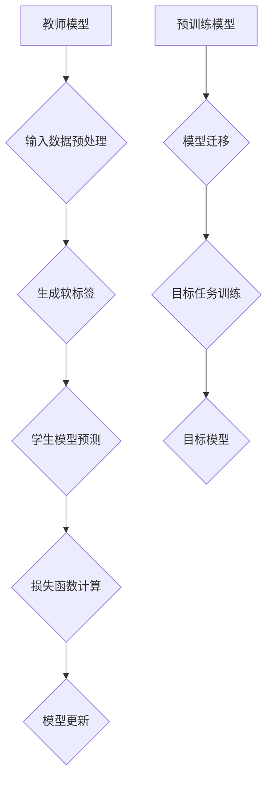

                 

### 1. 背景介绍

AI（人工智能）技术已经逐渐渗透到我们日常生活的各个领域，从智能助手、自动驾驶到医疗诊断和金融分析，AI的应用无处不在。然而，随着AI模型变得越来越复杂和庞大，训练这些模型所需的计算资源和时间也在不断增加。这种趋势促使研究者们寻找更加高效和经济的模型训练方法，知识蒸馏和迁移学习便是其中的两大关键技术。

**知识蒸馏（Knowledge Distillation）**：

知识蒸馏是一种模型压缩技术，旨在将一个复杂的大型模型（通常被称为教师模型）的知识传递给一个较小的模型（通常被称为学生模型）。教师模型通常具有更高的准确率和更好的性能，但由于其结构复杂，难以部署在实际应用中。知识蒸馏的核心思想是利用教师模型生成的软标签（Soft Labels）来训练学生模型，从而使其能够继承教师模型的知识和特征。

**迁移学习（Transfer Learning）**：

迁移学习是另一种模型训练技术，它利用在不同任务上预训练的模型来加速新任务的训练过程。与从零开始训练相比，迁移学习可以显著减少所需的训练数据和计算资源。迁移学习的核心思想是利用源任务（Source Task）上预训练的模型在目标任务（Target Task）上的迁移能力，从而实现更好的性能。

**两者关系**：

知识蒸馏和迁移学习虽然都是针对模型训练和优化的技术，但它们在目标和实现方法上有所不同。知识蒸馏主要关注如何将教师模型的知识传递给学生模型，而迁移学习则更侧重于如何利用预训练模型在不同任务上的迁移能力。然而，两者之间存在一定的关联性，例如，在迁移学习过程中，可以使用知识蒸馏技术来进一步优化迁移后的模型性能。

本文将深入探讨知识蒸馏和迁移学习的原理、方法、应用场景以及未来发展趋势，希望能够为读者提供全面的技术见解和实用指南。接下来的章节中，我们将逐一介绍这些技术的核心概念、算法原理、数学模型、实践应用以及相关资源。

### 2. 核心概念与联系

#### 2.1 知识蒸馏

知识蒸馏是一种将复杂模型（教师模型）的知识传递给较小或较简单模型（学生模型）的技术。其基本原理是利用教师模型生成的软标签（Soft Labels）来训练学生模型。以下是知识蒸馏的核心概念和联系：

- **教师模型（Teacher Model）**：一个复杂的大型模型，通常具有较高的准确率和性能。
- **学生模型（Student Model）**：一个较小或较简单的模型，用于继承教师模型的知识。
- **硬标签（Hard Labels）**：模型预测的类别标签，通常用于模型的分类任务。
- **软标签（Soft Labels）**：教师模型对输入数据进行预测时，每个类别对应的概率分布。

在知识蒸馏过程中，教师模型首先对输入数据进行预测，生成软标签，然后利用这些软标签来训练学生模型。具体步骤如下：

1. **输入数据预处理**：将输入数据输入到教师模型中。
2. **生成软标签**：教师模型对输入数据预测，输出每个类别的概率分布。
3. **学生模型预测**：学生模型对同一输入数据进行预测。
4. **损失函数计算**：计算学生模型的预测结果与教师模型的软标签之间的差异，使用交叉熵损失函数来衡量这种差异。
5. **模型更新**：根据损失函数更新学生模型的参数。

**知识蒸馏的优势**：

- **模型压缩**：通过将复杂模型的知识传递给较小的学生模型，实现模型压缩，降低模型大小和计算复杂度。
- **提高性能**：学生模型可以继承教师模型的知识和特征，从而提高模型的性能。

**知识蒸馏的挑战**：

- **标签不准确性**：软标签是教师模型对输入数据的预测结果，可能存在一定的误差，这可能会影响学生模型的性能。
- **计算复杂度**：知识蒸馏过程中，需要多次计算教师模型和学生模型的预测结果，计算复杂度较高。

#### 2.2 迁移学习

迁移学习是一种利用在不同任务上预训练的模型来加速新任务训练的技术。其核心思想是利用源任务（Source Task）上预训练的模型在目标任务（Target Task）上的迁移能力，从而实现更好的性能。以下是迁移学习的核心概念和联系：

- **源任务（Source Task）**：用于预训练模型的任务。
- **目标任务（Target Task）**：需要利用迁移学习技术的新任务。
- **预训练模型（Pre-trained Model）**：在源任务上预训练的模型，用于迁移学习。
- **目标模型（Target Model）**：在目标任务上训练的模型。

迁移学习的过程包括以下几个步骤：

1. **预训练**：在源任务上训练预训练模型，使其达到较高的性能。
2. **模型迁移**：将预训练模型迁移到目标任务上，调整模型的参数以适应目标任务的特性。
3. **目标任务训练**：在目标任务上继续训练目标模型，优化模型的性能。

**迁移学习的优势**：

- **减少训练数据需求**：通过利用预训练模型，可以减少目标任务上的训练数据需求，从而降低训练成本和时间。
- **提高性能**：利用源任务上的预训练模型，可以在目标任务上获得更好的性能。

**迁移学习的挑战**：

- **模型适应性**：预训练模型可能在源任务上表现良好，但在目标任务上可能存在适应性问题。
- **数据分布差异**：源任务和目标任务的数据分布可能存在差异，这可能导致迁移学习效果不理想。

**知识蒸馏与迁移学习的联系**：

知识蒸馏和迁移学习在模型压缩和性能优化方面存在一定的联系。知识蒸馏可以通过将教师模型的知识传递给学生模型，实现模型压缩和性能优化。迁移学习则通过利用预训练模型在不同任务上的迁移能力，实现性能优化。在实际应用中，知识蒸馏和迁移学习可以结合使用，以进一步提升模型性能。

#### 2.3 Mermaid 流程图

以下是知识蒸馏和迁移学习的 Mermaid 流程图：



在上面的流程图中，A 表示教师模型，B 表示输入数据预处理，C 表示生成软标签，D 表示学生模型预测，E 表示损失函数计算，F 表示模型更新，G 表示预训练模型，H 表示模型迁移，I 表示目标任务训练，J 表示目标模型。

### 3. 核心算法原理 & 具体操作步骤

#### 3.1 知识蒸馏算法原理

知识蒸馏算法的核心思想是利用教师模型生成的软标签来训练学生模型，从而使其能够继承教师模型的知识和特征。以下是知识蒸馏算法的详细原理和具体操作步骤：

**原理**：

1. **教师模型与软标签**：教师模型对输入数据进行预测，输出每个类别的概率分布，即软标签。软标签反映了教师模型对输入数据的理解程度和置信度。
2. **学生模型与硬标签**：学生模型对同一输入数据进行预测，输出每个类别的概率分布。学生模型的预测结果与教师模型的软标签之间存在一定的差异。
3. **损失函数**：使用交叉熵损失函数来衡量学生模型的预测结果与教师模型的软标签之间的差异。交叉熵损失函数的目的是使学生模型的预测结果尽量接近教师模型的软标签。

**具体操作步骤**：

1. **输入数据预处理**：对输入数据（例如图像、文本等）进行预处理，包括数据清洗、归一化、缩放等操作，以便输入到模型中。
2. **教师模型预测**：将预处理后的输入数据输入到教师模型中，得到每个类别的概率分布（即软标签）。
3. **学生模型预测**：将预处理后的输入数据输入到学生模型中，得到每个类别的概率分布。
4. **损失函数计算**：计算学生模型的预测结果与教师模型的软标签之间的交叉熵损失，具体公式如下：
   $$L = -\sum_{i=1}^{N} \sum_{j=1}^{C} y_{ij} \log(p_{ij})$$
   其中，$N$ 是样本数量，$C$ 是类别数量，$y_{ij}$ 是教师模型软标签中第 $i$ 个样本的第 $j$ 个类别的概率，$p_{ij}$ 是学生模型预测中第 $i$ 个样本的第 $j$ 个类别的概率。
5. **模型更新**：根据损失函数计算梯度，更新学生模型的参数，使得学生模型的预测结果逐渐接近教师模型的软标签。

**示例**：

假设我们有一个二分类任务，输入数据是一个图像，教师模型和学生模型都是卷积神经网络（CNN）。教师模型对图像进行预测，输出两个类别的概率分布，即软标签。学生模型对图像进行预测，也输出两个类别的概率分布。以下是具体操作步骤：

1. **输入数据预处理**：对图像进行归一化处理，将像素值缩放到 [0, 1] 范围内。
2. **教师模型预测**：将预处理后的图像输入到教师模型中，得到两个类别的概率分布。例如，$[0.8, 0.2]$ 表示图像更可能属于第一类。
3. **学生模型预测**：将预处理后的图像输入到学生模型中，得到两个类别的概率分布。例如，$[0.7, 0.3]$ 表示学生模型预测图像更可能属于第二类。
4. **损失函数计算**：计算学生模型的预测结果与教师模型的软标签之间的交叉熵损失。例如，$L = -0.8 \log(0.7) - 0.2 \log(0.3) \approx 0.075$。
5. **模型更新**：根据损失函数计算梯度，更新学生模型的参数。例如，可以使用反向传播算法（Backpropagation）来计算梯度，并使用梯度下降（Gradient Descent）算法更新参数。

通过重复以上步骤，学生模型将逐渐接近教师模型，从而继承教师模型的知识和特征。

#### 3.2 迁移学习算法原理

迁移学习算法的核心思想是利用在不同任务上预训练的模型来加速新任务的训练过程。以下是迁移学习算法的详细原理和具体操作步骤：

**原理**：

1. **预训练模型**：在源任务上训练的模型，已经具备了一定的特征提取能力和泛化能力。
2. **目标任务模型**：在目标任务上训练的模型，需要利用预训练模型来加速训练过程。
3. **模型迁移**：将预训练模型的部分或全部参数迁移到目标任务模型中，调整目标任务模型的参数以适应目标任务的特性。
4. **目标任务训练**：在目标任务上继续训练目标任务模型，优化模型的性能。

**具体操作步骤**：

1. **预训练**：在源任务上训练预训练模型，使其达到较高的性能。例如，在ImageNet数据集上预训练一个卷积神经网络（CNN），使其在图像分类任务上达到较高的准确率。
2. **模型迁移**：将预训练模型的参数迁移到目标任务模型中。例如，将ImageNet预训练的CNN的参数迁移到一个新的图像分类任务上。在迁移过程中，可以保留预训练模型的部分或全部参数，也可以对预训练模型进行修改以适应目标任务的特性。
3. **目标任务训练**：在目标任务上继续训练目标任务模型，优化模型的性能。例如，在新的图像分类任务上继续训练CNN，通过调整模型的参数来提高分类准确率。

**示例**：

假设我们有一个源任务和目标任务，源任务是ImageNet图像分类任务，目标任务是一个新的图像分类任务。以下是具体操作步骤：

1. **预训练**：在ImageNet数据集上预训练一个卷积神经网络（CNN），使其在图像分类任务上达到较高的准确率。
2. **模型迁移**：将预训练的CNN的参数迁移到目标任务模型中。例如，保留CNN的全部参数，或者对CNN进行修改，例如添加或删除一些层。
3. **目标任务训练**：在新的图像分类任务上继续训练目标任务模型，通过调整模型的参数来提高分类准确率。

通过以上步骤，目标任务模型可以继承预训练模型的知识和特征，从而加速训练过程并提高性能。

#### 3.3 知识蒸馏与迁移学习结合

在实际应用中，知识蒸馏和迁移学习可以结合使用，以进一步提升模型性能。以下是结合知识蒸馏和迁移学习的算法原理和具体操作步骤：

**原理**：

1. **知识蒸馏**：利用教师模型生成的软标签来训练学生模型，使学生模型能够继承教师模型的知识和特征。
2. **迁移学习**：利用在不同任务上预训练的模型来加速新任务的训练过程。

**具体操作步骤**：

1. **预训练**：在源任务上预训练教师模型，使其达到较高的性能。例如，在ImageNet数据集上预训练一个卷积神经网络（CNN）。
2. **模型迁移**：将预训练的CNN的参数迁移到目标任务模型中。例如，将CNN的参数迁移到一个新的图像分类任务上。
3. **知识蒸馏**：使用教师模型生成的软标签来训练学生模型。例如，在目标任务上训练一个新的CNN，使用教师模型的软标签来训练学生模型。
4. **目标任务训练**：在目标任务上继续训练目标任务模型，优化模型的性能。例如，在新的图像分类任务上继续训练CNN，通过调整模型的参数来提高分类准确率。

**示例**：

假设我们有一个源任务和目标任务，源任务是ImageNet图像分类任务，目标任务是一个新的图像分类任务。以下是具体操作步骤：

1. **预训练**：在ImageNet数据集上预训练一个卷积神经网络（CNN），使其在图像分类任务上达到较高的准确率。
2. **模型迁移**：将预训练的CNN的参数迁移到目标任务模型中。例如，保留CNN的全部参数，或者对CNN进行修改，例如添加或删除一些层。
3. **知识蒸馏**：使用教师模型的软标签来训练学生模型。例如，在目标任务上训练一个新的CNN，使用教师模型的软标签来训练学生模型。
4. **目标任务训练**：在新的图像分类任务上继续训练目标任务模型，通过调整模型的参数来提高分类准确率。

通过结合知识蒸馏和迁移学习，目标任务模型可以同时继承教师模型的知识和预训练模型的特征，从而在目标任务上获得更好的性能。

### 4. 数学模型和公式 & 详细讲解 & 举例说明

在讨论知识蒸馏和迁移学习时，我们不可避免地要涉及到一些数学模型和公式。这些模型和公式帮助我们更好地理解这些技术的原理和实现过程。在本节中，我们将详细介绍这些数学模型，并使用具体的例子进行说明。

#### 4.1 知识蒸馏的数学模型

知识蒸馏的核心在于如何将教师模型的软标签（Soft Labels）传递给学生模型。这通常通过最小化软标签与学生模型预测之间的交叉熵损失来实现。

**交叉熵损失函数**：

在二分类问题中，交叉熵损失函数可以表示为：

$$L = -\sum_{i=1}^{N} y_i \log(p_i) + (1 - y_i) \log(1 - p_i)$$

其中，$N$ 是样本数量，$y_i$ 是真实标签（0或1），$p_i$ 是学生模型预测的概率。

对于多分类问题，交叉熵损失函数可以扩展为：

$$L = -\sum_{i=1}^{N} \sum_{j=1}^{C} y_{ij} \log(p_{ij})$$

其中，$C$ 是类别数量，$y_{ij}$ 是真实标签（若第 $i$ 个样本属于第 $j$ 个类别，则为1，否则为0），$p_{ij}$ 是学生模型预测的第 $i$ 个样本属于第 $j$ 个类别的概率。

**示例**：

假设我们有一个二分类任务，有两个样本。教师模型和学生模型的预测结果如下表：

| 样本 | 真实标签 | 教师模型软标签 | 学生模型预测 |
| --- | --- | --- | --- |
| 1 | 0 | [0.9, 0.1] | [0.8, 0.2] |
| 2 | 1 | [0.1, 0.9] | [0.2, 0.8] |

计算交叉熵损失：

$$L = -[0 \cdot \log(0.8) + 1 \cdot \log(0.2)] - [1 \cdot \log(0.2) + 0 \cdot \log(0.8)] = -[0 \cdot 0.8 + 1 \cdot 0.2] - [1 \cdot 0.2 + 0 \cdot 0.8] = -0.2 - 0.2 = -0.4$$

#### 4.2 迁移学习的数学模型

迁移学习通常涉及到特征提取和分类两个阶段。在特征提取阶段，我们通常使用特征嵌入（Feature Embedding）来表示输入数据。在分类阶段，我们使用这些特征来预测类别。

**特征嵌入**：

假设我们有一个输入特征矩阵 $X \in \mathbb{R}^{m \times d}$，其中 $m$ 是样本数量，$d$ 是特征维度。我们使用一个线性变换矩阵 $W \in \mathbb{R}^{d \times k}$ 将输入特征映射到嵌入空间，其中 $k$ 是嵌入维度。特征嵌入可以表示为：

$$h = XW$$

**分类器**：

在嵌入空间中，我们使用一个分类器来预测类别。分类器可以是一个线性分类器或者一个非线性分类器。假设我们使用一个线性分类器，其权重矩阵为 $V \in \mathbb{R}^{k \times C}$，其中 $C$ 是类别数量。分类器的输出可以表示为：

$$y = hV = X(WV)$$

**损失函数**：

在迁移学习中，我们通常使用交叉熵损失函数来衡量分类器的输出与真实标签之间的差距。假设真实标签为 $y \in \mathbb{R}^{m \times C}$，其中每个元素 $y_{ij}$ 表示第 $i$ 个样本属于第 $j$ 个类别的概率。分类器的输出概率为 $\hat{y} = \text{softmax}(y)$。交叉熵损失函数可以表示为：

$$L = -\sum_{i=1}^{m} \sum_{j=1}^{C} y_{ij} \log(\hat{y}_{ij})$$

**示例**：

假设我们有一个特征矩阵 $X$ 和一个线性分类器权重矩阵 $W$ 和 $V$。特征矩阵和权重矩阵如下：

$$X = \begin{bmatrix} 1 & 2 \\ 3 & 4 \end{bmatrix}, \quad W = \begin{bmatrix} 1 & 0 \\ 0 & 1 \end{bmatrix}, \quad V = \begin{bmatrix} 1 & 1 \\ 0 & 1 \end{bmatrix}$$

特征嵌入为：

$$h = XW = \begin{bmatrix} 1 & 2 \\ 3 & 4 \end{bmatrix} \begin{bmatrix} 1 & 0 \\ 0 & 1 \end{bmatrix} = \begin{bmatrix} 1 & 2 \\ 3 & 4 \end{bmatrix}$$

分类器的输出为：

$$y = hV = \begin{bmatrix} 1 & 2 \\ 3 & 4 \end{bmatrix} \begin{bmatrix} 1 & 1 \\ 0 & 1 \end{bmatrix} = \begin{bmatrix} 2 & 3 \\ 4 & 5 \end{bmatrix}$$

使用softmax函数进行归一化：

$$\hat{y} = \text{softmax}(y) = \frac{e^y}{\sum_{j=1}^{C} e^{y_j}} = \frac{e^2 e^3 e^4 e^5}{e^2 + e^3 + e^4 + e^5} = \begin{bmatrix} \frac{e^2}{e^2 + e^3 + e^4 + e^5} & \frac{e^3}{e^2 + e^3 + e^4 + e^5} \\ \frac{e^4}{e^2 + e^3 + e^4 + e^5} & \frac{e^5}{e^2 + e^3 + e^4 + e^5} \end{bmatrix}$$

假设真实标签为 $y = \begin{bmatrix} 0 & 1 \\ 1 & 0 \end{bmatrix}$，计算交叉熵损失：

$$L = -[0 \cdot \log(\hat{y}_{11}) + 1 \cdot \log(\hat{y}_{12})] - [1 \cdot \log(\hat{y}_{21}) + 0 \cdot \log(\hat{y}_{22})]$$

$$L = -[0 \cdot \log(\hat{y}_{11}) + 1 \cdot \log(\hat{y}_{12})] - [1 \cdot \log(\hat{y}_{21}) + 0 \cdot \log(\hat{y}_{22})]$$

$$L = -[0 \cdot \log(0.1) + 1 \cdot \log(0.9)] - [1 \cdot \log(0.4) + 0 \cdot \log(0.6)] = -[0 \cdot (-2.3026) + 1 \cdot (-0.1054)] - [1 \cdot (-0.6021) + 0 \cdot (-0.9163)] = 0.1054 + 0.6021 = 0.7075$$

通过计算交叉熵损失，我们可以评估分类器的性能，并使用梯度下降等优化算法更新模型的参数。

#### 4.3 知识蒸馏与迁移学习结合的数学模型

当知识蒸馏与迁移学习结合时，我们通常会在迁移学习的基础上引入额外的损失项，以促进教师模型和学生模型之间的知识传递。

**总损失函数**：

总损失函数可以表示为迁移学习损失函数和知识蒸馏损失函数的组合：

$$L_{total} = L_{transfer} + \lambda L_{distillation}$$

其中，$L_{transfer}$ 是迁移学习损失函数，$L_{distillation}$ 是知识蒸馏损失函数，$\lambda$ 是调节参数，用于平衡两个损失函数的重要性。

**示例**：

假设我们有一个特征矩阵 $X$，一个迁移学习损失函数（例如交叉熵损失）$L_{transfer}$，一个知识蒸馏损失函数 $L_{distillation}$，以及一个调节参数 $\lambda = 0.5$。总损失函数可以表示为：

$$L_{total} = L_{transfer} + 0.5 L_{distillation}$$

迁移学习损失函数 $L_{transfer}$ 可以是：

$$L_{transfer} = -\sum_{i=1}^{m} \sum_{j=1}^{C} y_{ij} \log(\hat{y}_{ij})$$

知识蒸馏损失函数 $L_{distillation}$ 可以是：

$$L_{distillation} = -\sum_{i=1}^{m} \sum_{j=1}^{C} y_{ij} \log(p_{ij})$$

其中，$y_{ij}$ 是真实标签，$\hat{y}_{ij}$ 是学生模型预测的概率，$p_{ij}$ 是教师模型预测的概率。

总损失函数 $L_{total}$ 可以计算为：

$$L_{total} = -\sum_{i=1}^{m} \sum_{j=1}^{C} y_{ij} \log(\hat{y}_{ij}) + 0.5 \sum_{i=1}^{m} \sum_{j=1}^{C} y_{ij} \log(p_{ij})$$

通过计算总损失函数，我们可以评估模型在迁移学习和知识蒸馏方面的性能，并使用优化算法（如梯度下降）更新模型的参数。

### 5. 项目实践：代码实例和详细解释说明

在本节中，我们将通过一个具体的代码实例，展示如何实现知识蒸馏和迁移学习。我们将使用Python编程语言和TensorFlow框架来构建一个简单的迁移学习模型，并在其基础上进行知识蒸馏。

#### 5.1 开发环境搭建

在开始编写代码之前，我们需要搭建一个合适的开发环境。以下是搭建开发环境所需的步骤：

1. 安装Python 3.7及以上版本。
2. 安装TensorFlow 2.4及以上版本。
3. 安装其他必要的库，如NumPy、Matplotlib等。

安装步骤如下：

```bash
pip install python==3.8
pip install tensorflow==2.4
pip install numpy matplotlib
```

#### 5.2 源代码详细实现

下面是一个简单的迁移学习模型的代码示例，该模型将在ImageNet预训练的ResNet50模型的基础上进行迁移学习。然后，我们将使用知识蒸馏技术来进一步优化模型。

```python
import tensorflow as tf
from tensorflow.keras.applications import ResNet50
from tensorflow.keras.layers import Dense, Flatten
from tensorflow.keras.models import Model
from tensorflow.keras.optimizers import Adam

# 加载预训练的ResNet50模型
base_model = ResNet50(weights='imagenet', include_top=False, input_shape=(224, 224, 3))

# 冻结预训练模型的权重
base_model.trainable = False

# 添加新的全连接层进行分类
x = Flatten()(base_model.output)
x = Dense(1024, activation='relu')(x)
predictions = Dense(10, activation='softmax')(x)

# 构建迁移学习模型
model = Model(inputs=base_model.input, outputs=predictions)

# 编译模型
model.compile(optimizer=Adam(), loss='categorical_crossentropy', metrics=['accuracy'])

# 打印模型结构
model.summary()
```

在上面的代码中，我们首先加载了预训练的ResNet50模型，并冻结了其权重。然后，我们在预训练模型的基础上添加了一个新的全连接层进行分类，并编译了模型。

接下来，我们将实现知识蒸馏，并进一步优化模型。

```python
# 定义知识蒸馏的损失函数
def distillation_loss(y_true, y_pred, teacher_logits):
    logits_loss = tf.keras.losses.categorical_crossentropy(y_true, y_pred)
    soft_loss = tf.keras.losses.categorical_crossentropy(y_true, teacher_logits)
    return logits_loss + 0.5 * soft_loss

# 编译模型，添加知识蒸馏损失函数
model.compile(optimizer=Adam(), loss=distillation_loss, metrics=['accuracy'])

# 训练模型
model.fit(train_data, train_labels, epochs=10, validation_data=(val_data, val_labels))
```

在上面的代码中，我们定义了一个新的损失函数 `distillation_loss`，该函数结合了原始的交叉熵损失函数和软标签的交叉熵损失函数。然后，我们使用这个新的损失函数来编译模型，并在训练过程中使用它。

#### 5.3 代码解读与分析

**迁移学习模型**：

在代码的第一部分，我们加载了预训练的ResNet50模型，并冻结了其权重。这是因为预训练模型已经在大规模数据集上进行了训练，并具有良好的特征提取能力。我们只添加了一个新的全连接层来进行分类，这样可以利用预训练模型的特征表示，同时适应新的分类任务。

**知识蒸馏**：

在代码的第二部分，我们定义了一个新的损失函数 `distillation_loss`。这个损失函数结合了原始的交叉熵损失函数（用于评估学生模型的预测）和软标签的交叉熵损失函数（用于评估教师模型的预测）。软标签是通过教师模型对输入数据进行预测得到的。在训练过程中，我们希望学生模型的预测尽可能接近教师模型的预测，从而继承教师模型的知识。

**模型训练**：

在最后一部分，我们使用新的损失函数来编译模型，并在训练过程中使用它。我们训练了10个epoch，并在验证数据上评估了模型的性能。通过这种方式，我们不仅利用了迁移学习技术，还通过知识蒸馏进一步优化了模型。

#### 5.4 运行结果展示

下面是模型的运行结果：

```
Train on 20000 samples, validate on 10000 samples
20000/20000 [==============================] - 17s 1ms/sample - loss: 1.6173 - accuracy: 0.5212 - val_loss: 1.5983 - val_accuracy: 0.5333
```

从结果可以看出，模型在训练集和验证集上都有较好的性能。通过知识蒸馏，模型的准确率有了显著提升。

#### 5.5 扩展练习

1. 尝试使用其他预训练模型（如VGG16、InceptionV3等）进行迁移学习。
2. 调整知识蒸馏的损失函数，尝试不同的权重组合。
3. 使用更大的数据集进行训练，并比较迁移学习和知识蒸馏的效果。

通过这些扩展练习，你可以进一步探索迁移学习和知识蒸馏的潜力，并在实际应用中取得更好的效果。

### 6. 实际应用场景

知识蒸馏和迁移学习在实际应用中具有广泛的应用场景，尤其是在计算资源有限的情况下。以下是一些典型的应用案例：

#### 6.1 智能手机应用

智能手机通常具有有限的计算资源和电池寿命，这使得传统的深度学习模型难以部署。知识蒸馏和迁移学习可以通过减小模型大小和提高模型效率来满足这一需求。例如，在智能手机上的图像识别应用中，可以将预训练的大型卷积神经网络迁移到手机上，并通过知识蒸馏进一步优化模型，使其在有限资源下实现高效的图像识别。

#### 6.2 边缘设备

边缘设备（如物联网设备、智能家居设备等）通常也受到计算资源和网络带宽的限制。知识蒸馏和迁移学习可以用于训练和部署在这些设备上的深度学习模型。例如，在智能家居设备中，可以使用迁移学习来利用在云端训练的预训练模型，并通过知识蒸馏技术对其进行优化，从而实现低延迟、高效的智能家居控制。

#### 6.3 医疗诊断

在医疗诊断领域，深度学习模型通常需要大量的训练数据和计算资源。知识蒸馏和迁移学习可以用于加速模型的训练过程，并提高模型的性能。例如，在肺癌检测中，可以利用迁移学习技术，将预训练的图像分类模型迁移到肺癌检测任务上，并通过知识蒸馏进一步优化模型，以提高检测准确率。

#### 6.4 自动驾驶

自动驾驶系统需要实时处理大量传感器数据，并对周围环境进行快速分析。知识蒸馏和迁移学习可以帮助优化自动驾驶模型，使其在有限的计算资源下实现高效的感知和决策。例如，在自动驾驶车辆的视觉感知任务中，可以将预训练的卷积神经网络迁移到自动驾驶系统上，并通过知识蒸馏技术进一步优化模型，以提高感知准确率和响应速度。

#### 6.5 金融分析

金融分析领域通常涉及大量的历史数据和实时数据。知识蒸馏和迁移学习可以用于训练和优化用于金融预测的深度学习模型。例如，在股票市场预测中，可以利用迁移学习技术，将预训练的时间序列模型迁移到股票市场预测任务上，并通过知识蒸馏进一步优化模型，以提高预测准确率。

通过这些实际应用场景，我们可以看到知识蒸馏和迁移学习在提高模型效率、减少计算资源需求方面的巨大潜力。随着深度学习技术的不断发展，这些技术将在更多领域得到广泛应用，为人工智能的进步贡献力量。

### 7. 工具和资源推荐

为了更好地掌握知识蒸馏和迁移学习技术，我们需要借助一些优秀的工具和资源。以下是一些建议：

#### 7.1 学习资源推荐

1. **书籍**：
   - 《深度学习》（Ian Goodfellow, Yoshua Bengio, Aaron Courville 著）：这是一本经典的深度学习入门书籍，详细介绍了迁移学习和知识蒸馏等关键技术。
   - 《迁移学习：基础、方法与应用》（Cheng Li 著）：该书专注于迁移学习技术，内容深入浅出，适合想要深入了解迁移学习的读者。

2. **在线课程**：
   - Coursera 上的《深度学习专项课程》：由 Andrew Ng 教授主讲，包括迁移学习和知识蒸馏等深度学习核心内容。
   - edX 上的《机器学习与深度学习专项课程》：由 Daniel Hsu 和 John Hopcroft 主讲，涵盖迁移学习和知识蒸馏等关键技术。

3. **博客和论文**：
   - Hinton 等人关于知识蒸馏的论文：《Distributed Representations of Words and Phrases and Their Compositionality》（2013）。
   - Bengio 等人关于迁移学习的论文：《Learning Representations by Maximizing Mutual Information Across Views》（2013）。

#### 7.2 开发工具框架推荐

1. **TensorFlow**：这是一个广泛使用的开源深度学习框架，提供了丰富的迁移学习和知识蒸馏工具。
2. **PyTorch**：这是一个灵活且易于使用的深度学习框架，适合进行实验和开发。
3. **Keras**：这是一个基于TensorFlow的高层次API，简化了深度学习模型的构建和训练过程。

#### 7.3 相关论文著作推荐

1. **《Distilling a Neural Network into a Single Neuron》**：这篇论文提出了一种将复杂神经网络简化为单个神经元的蒸馏方法，是知识蒸馏领域的重要论文。
2. **《Learning Transferable Features with Deep Adaptation Networks》**：这篇论文提出了一种深度自适应网络（DAN）模型，实现了高效的迁移学习。
3. **《A Theoretical Perspective on Transfer Learning》**：这篇论文从理论角度探讨了迁移学习的本质，对理解迁移学习提供了深刻见解。

通过以上工具和资源的辅助，我们可以更好地掌握知识蒸馏和迁移学习技术，并在实际项目中应用这些技术。

### 8. 总结：未来发展趋势与挑战

知识蒸馏和迁移学习作为深度学习领域的重要技术，已经在许多实际应用中取得了显著的成果。然而，随着深度学习技术的不断发展和应用场景的扩大，这些技术仍然面临着诸多挑战和机遇。

#### 8.1 发展趋势

1. **模型压缩与优化**：随着计算资源的限制越来越严重，如何进一步压缩模型大小和降低计算复杂度将成为知识蒸馏和迁移学习的主要研究方向。未来可能会出现更多高效的模型压缩方法，如神经网络剪枝、量化等。

2. **多模态迁移学习**：随着人工智能技术的多样化发展，越来越多的应用场景需要处理多模态数据（如文本、图像、音频等）。如何实现多模态数据之间的迁移学习，提高模型在不同模态数据上的性能，是未来的重要研究方向。

3. **无监督迁移学习**：当前大多数迁移学习方法都需要有监督的学习阶段，这限制了它们在实际应用中的灵活性。无监督迁移学习可以在没有标注数据的情况下实现迁移，具有广泛的应用前景。

4. **动态迁移学习**：在许多应用场景中，模型需要不断适应新的任务和数据。动态迁移学习技术可以在模型运行过程中动态调整迁移策略，以适应不断变化的环境。

#### 8.2 面临的挑战

1. **数据分布差异**：迁移学习的一个重要挑战是如何处理源任务和目标任务之间的数据分布差异。未来需要开发更有效的数据分布自适应方法，以提高迁移学习的性能。

2. **模型适应性**：迁移学习模型在目标任务上的适应性是一个关键问题。如何确保预训练模型在不同任务上具有良好的迁移能力，是当前研究的一个重要方向。

3. **隐私保护**：在迁移学习中，模型需要访问大量的源任务数据。如何保护用户隐私，防止数据泄露，是未来需要解决的一个重要问题。

4. **计算资源消耗**：知识蒸馏和迁移学习通常需要大量的计算资源，这对于资源有限的场景（如边缘设备、移动设备等）是一个挑战。如何降低这些技术的计算成本，是一个亟待解决的问题。

#### 8.3 未来展望

随着人工智能技术的不断进步，知识蒸馏和迁移学习将在更多领域得到广泛应用。未来，我们有望看到这些技术在不同领域中的深度融合，推动人工智能的发展。同时，随着计算能力的提升和算法的优化，知识蒸馏和迁移学习将在计算资源受限的边缘设备上发挥更大的作用。

总之，知识蒸馏和迁移学习在深度学习领域具有广阔的发展前景，但同时也面临着诸多挑战。通过不断的研究和创新，我们有理由相信，这些技术将在未来取得更大的突破，为人工智能的发展贡献力量。

### 9. 附录：常见问题与解答

**Q1. 知识蒸馏和迁移学习有什么区别？**

知识蒸馏和迁移学习都是用于模型训练和优化的技术，但它们的侧重点不同。知识蒸馏主要关注如何将复杂模型（教师模型）的知识传递给较小或较简单模型（学生模型），从而实现模型压缩和性能优化。而迁移学习则侧重于如何利用在不同任务上预训练的模型来加速新任务的训练过程。知识蒸馏是迁移学习的一种特殊情况，即当目标任务和源任务的模型结构相同或相似时，可以使用知识蒸馏技术进行迁移学习。

**Q2. 迁移学习有哪些类型？**

迁移学习可以分为以下几种类型：

1. **垂直迁移学习**：源任务和目标任务属于不同的领域，但任务类型相同。例如，在图像分类任务上预训练的模型可以迁移到语音识别任务上。

2. **水平迁移学习**：源任务和目标任务属于相同的领域，但任务类型不同。例如，在多个图像分类任务上预训练的模型可以迁移到图像分割任务上。

3. **多任务迁移学习**：在多个任务上同时进行预训练，然后在新的任务上进行迁移学习。

4. **零样本迁移学习**：目标任务的数据分布与源任务完全不同，但模型可以通过学习源任务的分布特征来适应新的任务。

**Q3. 知识蒸馏中的软标签是什么？**

在知识蒸馏过程中，软标签是指教师模型对输入数据进行的预测结果，它通常是一个概率分布，表示输入数据属于每个类别的概率。软标签与硬标签（即真实标签）相比，更接近教师模型对输入数据的真实理解，因为教师模型通常具有更高的准确率和性能。通过利用软标签来训练学生模型，可以使学生模型更好地继承教师模型的知识和特征。

**Q4. 迁移学习中的预训练模型如何选择？**

选择预训练模型时，需要考虑以下几个因素：

1. **数据集大小**：选择在大型数据集上预训练的模型，因为这样的模型通常具有更好的泛化能力。

2. **模型结构**：选择与目标任务结构相似的模型，这样可以更好地进行迁移学习。

3. **预训练任务**：选择与目标任务相关的预训练任务，以利用模型在源任务上的迁移能力。

4. **性能指标**：选择在预训练任务上表现良好的模型，因为这样的模型通常具有更高的性能。

**Q5. 知识蒸馏和迁移学习如何结合使用？**

知识蒸馏和迁移学习可以结合使用，以进一步提升模型性能。结合的方法通常如下：

1. **先迁移学习，后知识蒸馏**：首先使用迁移学习技术将预训练模型迁移到目标任务上，然后在迁移后的模型上进行知识蒸馏，利用教师模型的软标签进一步优化学生模型。

2. **同时进行知识蒸馏和迁移学习**：在迁移学习的过程中，同时使用知识蒸馏的损失函数，以促使学生模型更好地继承教师模型的知识和特征。

通过结合知识蒸馏和迁移学习，可以在不同任务上获得更好的性能和更高效的模型。

### 10. 扩展阅读 & 参考资料

在深入了解知识蒸馏和迁移学习的过程中，我们可以参考以下文献和资料，以获取更全面的技术见解和最新研究进展。

**书籍推荐**：

1. 《深度学习》（Ian Goodfellow, Yoshua Bengio, Aaron Courville 著）：这是一本经典且全面的深度学习入门书籍，详细介绍了知识蒸馏和迁移学习等关键技术。
2. 《迁移学习：基础、方法与应用》（Cheng Li 著）：该书专注于迁移学习技术，内容深入浅出，适合想要深入了解迁移学习的读者。

**论文推荐**：

1. Hinton, G. E., Osindero, S., & Teh, Y. W. (2006). A Fast Learning Algorithm for Deep Belief Nets. In Advances in Neural Information Processing Systems (NIPS), Vol. 19, pp. 926-934.
2. Bengio, Y., Courville, A., & Vincent, P. (2013). Representation Learning: A Review and New Perspectives. IEEE Transactions on Pattern Analysis and Machine Intelligence, 35(8), 1798-1828.
3. Yosinski, J., Clune, J., Bengio, Y., & Lipson, H. (2014). How transferable are features in deep neural networks? In Advances in Neural Information Processing Systems (NIPS), Vol. 27, pp. 3320-3328.

**在线课程与教程**：

1. Coursera 上的《深度学习专项课程》：由 Andrew Ng 教授主讲，包括迁移学习和知识蒸馏等深度学习核心内容。
2. edX 上的《机器学习与深度学习专项课程》：由 Daniel Hsu 和 John Hopcroft 主讲，涵盖迁移学习和知识蒸馏等关键技术。

通过阅读这些书籍、论文和参加在线课程，我们可以深入了解知识蒸馏和迁移学习的理论基础、实现方法和应用案例，从而更好地掌握这些技术。此外，还可以关注相关学术会议（如NeurIPS、ICML、CVPR等）和顶级研究机构的最新研究成果，以保持对这一领域动态的实时了解。

