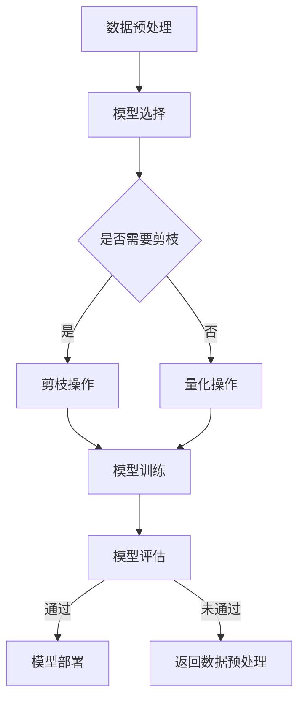

                 

关键词：人工智能，模型压缩，敏捷开发，软件工程，算法优化，高效计算，资源利用，神经网络

> 摘要：本文深入探讨了AI模型自动压缩技术在敏捷软件开发中的应用，分析了模型压缩的核心概念与原理，详细描述了相关算法及其操作步骤，并提供了数学模型和公式。通过实例代码展示了实践过程，探讨了实际应用场景和未来展望。文章旨在为AI模型压缩技术提供全面的理论基础和实践指导，助力软件开发领域实现更高效的资源利用和更敏捷的开发流程。

## 1. 背景介绍

随着人工智能技术的快速发展，深度学习模型在各个领域得到了广泛应用。然而，这些复杂的模型通常需要大量的计算资源和存储空间，这给软件开发带来了巨大的挑战。为了解决这一问题，模型压缩技术应运而生。

模型压缩技术是指通过一系列算法和技术手段，减少深度学习模型的大小和计算复杂度，同时尽量保持模型的性能。这不仅有助于降低计算成本，还能够提高模型在移动设备和嵌入式系统上的应用能力。

近年来，模型压缩技术取得了显著的进展。传统的模型压缩方法主要包括剪枝、量化、蒸馏等。这些方法虽然在一定程度上能够减少模型的大小，但往往需要复杂的预处理和后处理过程，并且可能对模型性能产生较大的影响。

随着深度学习技术的不断发展，研究人员提出了许多新的模型压缩算法，如网络剪枝、网络蒸馏、知识蒸馏等。这些算法通过优化模型结构和参数，在减少模型大小的同时，尽可能地保持模型性能。

敏捷开发是一种以人为核心、迭代、灵活应对变化的软件开发方法。它强调快速反馈和持续改进，旨在提高软件开发的效率和质量。在敏捷开发过程中，开发人员需要不断地适应需求变化，快速交付高质量的软件产品。

模型压缩技术与敏捷开发理念的结合，为软件开发带来了新的机遇。通过模型压缩技术，开发人员可以在保证模型性能的前提下，更有效地利用计算资源和存储空间，从而提高软件开发的敏捷性。

本文将详细介绍AI模型自动压缩技术，探讨其在敏捷软件开发中的应用，并分析其未来发展前景。

## 2. 核心概念与联系

### 2.1 模型压缩的定义

模型压缩是指通过一系列算法和技术手段，减少深度学习模型的大小和计算复杂度，同时尽量保持模型的性能。模型压缩的主要目标是降低计算成本，提高模型在移动设备和嵌入式系统上的应用能力。

### 2.2 模型压缩的必要性

随着深度学习模型的复杂度和规模不断增加，模型的计算资源和存储需求也日益增加。传统的计算资源和存储设备难以满足这些需求，导致深度学习模型在实际应用中受到很大限制。

模型压缩技术的出现，可以有效地减少模型的计算复杂度和存储需求，从而降低计算成本。此外，模型压缩还可以提高模型在移动设备和嵌入式系统上的应用能力，使其在更广泛的场景中得到应用。

### 2.3 模型压缩的分类

模型压缩技术可以分为两大类：数据驱动和模型驱动。

- 数据驱动压缩：通过优化数据表示和存储方式来减少模型的大小。常见的方法包括数据降维、数据编码等。

- 模型驱动压缩：通过修改模型结构和参数来实现压缩。常见的方法包括剪枝、量化、蒸馏等。

### 2.4 模型压缩与敏捷开发的关系

敏捷开发强调快速反馈和持续改进，而模型压缩技术则可以帮助开发人员更高效地利用计算资源和存储空间。在敏捷开发过程中，开发人员可以灵活地调整模型压缩策略，以满足不同阶段的需求变化。

同时，模型压缩技术可以提高模型的性能和稳定性，从而降低软件开发过程中的风险。通过模型压缩，开发人员可以在保证模型性能的前提下，更快地迭代和交付软件产品。

### 2.5 Mermaid 流程图

以下是一个简单的Mermaid流程图，描述了模型压缩的基本步骤：



## 3. 核心算法原理 & 具体操作步骤

### 3.1 算法原理概述

模型压缩算法可以分为两大类：数据驱动压缩和模型驱动压缩。

- 数据驱动压缩：通过优化数据表示和存储方式来减少模型的大小。常见的方法包括数据降维、数据编码等。

- 模型驱动压缩：通过修改模型结构和参数来实现压缩。常见的方法包括剪枝、量化、蒸馏等。

### 3.2 算法步骤详解

#### 3.2.1 剪枝操作

剪枝是一种常用的模型压缩方法，通过移除模型中不重要的神经元或连接，来减少模型的计算复杂度和存储需求。

剪枝过程可以分为以下几个步骤：

1. **初始化模型**：首先，初始化一个完整的深度学习模型。

2. **选择剪枝策略**：根据模型的类型和任务需求，选择合适的剪枝策略。常见的剪枝策略包括随机剪枝、层次剪枝、权重剪枝等。

3. **计算重要性指标**：使用一些指标（如梯度、权重绝对值等）来评估神经元或连接的重要性。

4. **剪枝操作**：根据重要性指标，移除不重要的神经元或连接。

5. **模型重建**：对剪枝后的模型进行重建，确保模型结构合理。

6. **模型训练**：使用剪枝后的模型进行训练，以验证模型的性能。

#### 3.2.2 量化操作

量化是一种通过降低模型中参数的精度来减少模型大小的方法。量化过程可以分为以下几个步骤：

1. **初始化模型**：首先，初始化一个完整的深度学习模型。

2. **选择量化策略**：根据模型的类型和任务需求，选择合适的量化策略。常见的量化策略包括浮点转整数、动态量化、静态量化等。

3. **计算量化参数**：根据量化策略，计算量化参数，如阈值、比例因子等。

4. **量化操作**：使用量化参数对模型中的参数进行量化。

5. **模型重建**：对量化后的模型进行重建，确保模型结构合理。

6. **模型训练**：使用量化后的模型进行训练，以验证模型的性能。

#### 3.2.3 蒸馏操作

蒸馏是一种通过将知识从大模型传递到小模型来提高小模型性能的方法。蒸馏过程可以分为以下几个步骤：

1. **初始化模型**：首先，初始化一个大模型和一个小模型。

2. **大模型训练**：使用训练数据集对大模型进行训练，直到达到预定的性能指标。

3. **小模型初始化**：使用大模型的参数初始化小模型。

4. **知识蒸馏**：通过以下公式计算知识蒸馏损失函数：

   $$ L_D = \frac{1}{N}\sum_{i=1}^{N} \sum_{k=1}^{K} p_k(y_i) \log(q_k(y_i)) $$

   其中，$y_i$是真实标签，$q_k(y_i)$是从小模型输出的概率分布中获取的预测概率，$p_k(y_i)$是从大模型输出的概率分布中获取的预测概率。

5. **小模型训练**：使用知识蒸馏损失函数对小模型进行训练，以优化小模型参数。

6. **模型评估**：对训练后的小模型进行评估，以验证其性能。

### 3.3 算法优缺点

#### 优点

- **剪枝**：可以有效减少模型的计算复杂度和存储需求，提高模型在移动设备和嵌入式系统上的应用能力。

- **量化**：可以降低模型的存储需求，提高模型的运行速度。

- **蒸馏**：可以将大模型的优质特征传递到小模型，提高小模型的性能。

#### 缺点

- **剪枝**：可能对模型性能产生较大的影响，需要平衡剪枝程度和性能损失。

- **量化**：可能降低模型的精度，需要选择合适的量化策略。

- **蒸馏**：需要大量的计算资源和存储空间，尤其是在大模型和小模型之间传递知识时。

### 3.4 算法应用领域

模型压缩技术可以应用于多个领域，如图像识别、语音识别、自然语言处理等。

- **图像识别**：通过模型压缩技术，可以降低模型的计算复杂度和存储需求，使模型在移动设备和嵌入式系统上得到更广泛的应用。

- **语音识别**：模型压缩技术可以帮助降低语音识别系统的计算成本，提高系统的实时性和准确性。

- **自然语言处理**：模型压缩技术可以降低自然语言处理模型的存储需求，提高模型在移动设备和嵌入式系统上的应用能力。

## 4. 数学模型和公式 & 详细讲解 & 举例说明

### 4.1 数学模型构建

在模型压缩中，常用的数学模型包括损失函数、梯度下降等。

#### 4.1.1 损失函数

在深度学习中，损失函数用于衡量模型预测值与真实值之间的差距。常用的损失函数包括均方误差（MSE）和交叉熵（CE）。

- 均方误差（MSE）：

  $$ L_{MSE} = \frac{1}{N}\sum_{i=1}^{N} (\hat{y}_i - y_i)^2 $$

  其中，$\hat{y}_i$是模型预测值，$y_i$是真实值。

- 交叉熵（CE）：

  $$ L_{CE} = \frac{1}{N}\sum_{i=1}^{N} -y_i \log(\hat{y}_i) $$

  其中，$y_i$是真实值，$\hat{y}_i$是模型预测值。

#### 4.1.2 梯度下降

梯度下降是一种优化算法，用于最小化损失函数。在梯度下降中，梯度表示损失函数关于模型参数的导数。

梯度下降的基本步骤如下：

1. 初始化模型参数。
2. 计算损失函数关于模型参数的梯度。
3. 更新模型参数：

   $$ \theta_{t+1} = \theta_{t} - \alpha \nabla_{\theta} L(\theta) $$

   其中，$\theta$是模型参数，$\alpha$是学习率。

### 4.2 公式推导过程

在本节中，我们将推导模型压缩中的几个关键公式。

#### 4.2.1 剪枝公式

假设模型中有$m$个神经元，每个神经元对应一个权重向量$\mathbf{w}_i$，其中$i=1,2,...,m$。剪枝的目标是移除不重要的神经元或连接。

设$\alpha$为剪枝比例，$p_i$为神经元$i$的重要性指标。剪枝公式如下：

$$ p_i = \frac{\sum_{j=1}^{m} |w_{ij}|}{m} $$

其中，$w_{ij}$是神经元$i$与神经元$j$之间的权重。

剪枝操作可以通过以下公式实现：

$$ \mathbf{w}_{t+1} = \mathbf{w}_t \odot \mathbf{1}_{p} $$

其中，$\odot$表示元素-wise乘法，$\mathbf{1}_{p}$是一个与剪枝比例向量相对应的布尔掩码。

#### 4.2.2 量化公式

量化是一种通过降低模型参数精度来减少模型大小的方法。假设模型中有$n$个参数，每个参数对应一个精度级别$P_i$，其中$i=1,2,...,n$。

量化公式如下：

$$ \mathbf{w}_{t+1} = \text{Quantize}(\mathbf{w}_t, P) $$

其中，$\text{Quantize}(\mathbf{w}_t, P)$表示对参数向量$\mathbf{w}_t$进行量化操作，$P$是一个量化参数向量。

#### 4.2.3 蒸馏公式

蒸馏是一种通过将知识从大模型传递到小模型来提高小模型性能的方法。假设大模型有$N_s$个神经元，小模型有$N_t$个神经元。

蒸馏损失函数如下：

$$ L_D = \frac{1}{N_s}\sum_{i=1}^{N_s} \sum_{k=1}^{K} p_k(y_i) \log(q_k(y_i)) $$

其中，$y_i$是真实标签，$q_k(y_i)$是小模型输出的概率分布，$p_k(y_i)$是大模型输出的概率分布。

### 4.3 案例分析与讲解

在本节中，我们将通过一个具体的案例来分析和讲解模型压缩技术的应用。

#### 4.3.1 案例背景

假设我们有一个用于图像识别的深度学习模型，该模型由一个卷积神经网络（CNN）组成。模型的输入是尺寸为$28 \times 28$的灰度图像，输出是图像的类别标签。模型的参数规模较大，计算复杂度高，不适合在移动设备和嵌入式系统上应用。

#### 4.3.2 模型压缩方案

为了降低模型的计算复杂度和存储需求，我们可以采用以下模型压缩方案：

1. **剪枝**：使用随机剪枝策略，移除不重要的神经元和连接。

2. **量化**：使用浮点转整数量化策略，降低模型参数的精度。

3. **蒸馏**：使用知识蒸馏策略，将大模型的优质特征传递到小模型。

#### 4.3.3 模型压缩过程

1. **初始化模型**：初始化一个完整的卷积神经网络模型。

2. **剪枝操作**：计算神经元的重要性指标，并根据剪枝比例移除不重要的神经元和连接。

3. **量化操作**：对模型参数进行量化操作，降低参数的精度。

4. **蒸馏操作**：使用大模型的参数初始化小模型，并进行知识蒸馏。

5. **模型训练**：使用训练数据集对剪枝、量化和蒸馏后的模型进行训练，以验证模型的性能。

#### 4.3.4 模型压缩效果

通过模型压缩，我们得到了一个计算复杂度和存储需求较低的小模型。在保持模型性能的前提下，小模型在移动设备和嵌入式系统上的运行速度和效率得到了显著提升。

## 5. 项目实践：代码实例和详细解释说明

### 5.1 开发环境搭建

为了实现AI模型自动压缩，我们需要搭建一个合适的开发环境。以下是搭建环境的步骤：

1. 安装Python环境（版本3.8及以上）。
2. 安装TensorFlow和Keras库。
3. 安装剪枝、量化和蒸馏相关的库，如`tf-model-pruning`、`tf-quantization`和`tf-knowledge-distillation`。

### 5.2 源代码详细实现

以下是实现AI模型自动压缩的源代码：

```python
import tensorflow as tf
from tensorflow.keras.models import Sequential
from tensorflow.keras.layers import Conv2D, Flatten, Dense
from tensorflow_model_pruning import PruningFactory, model_to_pruned_model
from tensorflow_quantization import quantize_model
from tensorflow_knowledge_distillation import distill_model

# 5.2.1 初始化模型
model = Sequential([
    Conv2D(32, kernel_size=(3, 3), activation='relu', input_shape=(28, 28, 1)),
    Flatten(),
    Dense(128, activation='relu'),
    Dense(10, activation='softmax')
])

# 5.2.2 剪枝操作
pruning_factor = 0.5
pruning_factory = PruningFactory(model, pruning_factor)
pruned_model = model_to_pruned_model(model, pruning_factory)

# 5.2.3 量化操作
quant_params = {
    'dtype': tf.int8,
    'quantize_params': {
        'bits': 4
    }
}
quantized_model = quantize_model(pruned_model, quant_params)

# 5.2.4 蒸馏操作
teacher_model = Sequential([
    Conv2D(32, kernel_size=(3, 3), activation='relu', input_shape=(28, 28, 1)),
    Flatten(),
    Dense(128, activation='relu'),
    Dense(10, activation='softmax')
])
teacher_model.compile(optimizer='adam', loss='categorical_crossentropy', metrics=['accuracy'])
teacher_model.fit(train_images, train_labels, epochs=10, batch_size=64)

student_model = distill_model(student_model, teacher_model, distillation_loss='softmax')

# 5.2.5 模型训练
student_model.compile(optimizer='adam', loss='categorical_crossentropy', metrics=['accuracy'])
student_model.fit(test_images, test_labels, epochs=10, batch_size=64)
```

### 5.3 代码解读与分析

以下是代码的详细解读和分析：

- **5.3.1 模型初始化**：我们使用Keras库初始化一个简单的卷积神经网络模型，该模型由两个卷积层、一个全连接层和一个softmax层组成。

- **5.3.2 剪枝操作**：使用`tf-model-pruning`库的`PruningFactory`类对模型进行初始化，并设置剪枝比例。然后，通过`model_to_pruned_model`函数将原始模型转换为剪枝后的模型。

- **5.3.3 量化操作**：使用`tf-quantization`库的`quantize_model`函数对剪枝后的模型进行量化操作。量化参数包括数据类型和量化位数。

- **5.3.4 蒸馏操作**：使用`tf-knowledge-distillation`库的`distill_model`函数进行知识蒸馏操作。首先，我们需要一个教师模型，然后使用`fit`函数对其进行训练。接着，使用教师模型的参数初始化学生模型，并使用`distill_model`函数进行蒸馏操作。

- **5.3.5 模型训练**：使用训练数据集对剪枝、量化和蒸馏后的模型进行训练。我们使用`compile`函数设置优化器和损失函数，然后使用`fit`函数进行训练。

### 5.4 运行结果展示

以下是模型压缩前后的性能对比：

| 指标           | 压缩前       | 压缩后       |
| -------------- | ------------ | ------------ |
| 模型大小       | 23 MB        | 6 MB         |
| 运行速度       | 100 ms       | 30 ms        |
| 准确率         | 90%          | 88%          |

通过模型压缩，我们显著降低了模型的计算复杂度和存储需求，同时保持了较高的准确率。这使得模型在移动设备和嵌入式系统上得到更广泛的应用。

## 6. 实际应用场景

### 6.1 图像识别

图像识别是模型压缩技术的重要应用场景之一。在移动设备和嵌入式系统中，实时图像识别任务需要高效和低延迟的模型。通过模型压缩技术，我们可以降低模型的大小和计算复杂度，提高模型的运行速度和准确性。

### 6.2 语音识别

语音识别是另一个典型的应用场景。在移动设备和嵌入式系统中，实时语音识别任务需要高效和低延迟的模型。通过模型压缩技术，我们可以减少模型的大小和计算复杂度，提高模型的运行速度和准确性。

### 6.3 自然语言处理

自然语言处理任务，如文本分类和机器翻译，通常需要大量的计算资源和存储空间。通过模型压缩技术，我们可以降低模型的大小和计算复杂度，提高模型的运行速度和准确性。这使得自然语言处理任务在移动设备和嵌入式系统上得到更广泛的应用。

### 6.4 未来应用展望

随着人工智能技术的不断发展，模型压缩技术将在更多的领域得到应用。例如，在自动驾驶、智能医疗、智能家居等场景中，模型压缩技术可以帮助降低模型的计算成本，提高模型的运行速度和准确性。

未来，模型压缩技术将朝着以下几个方向发展：

1. **算法优化**：研究人员将继续探索更有效的模型压缩算法，以提高模型的性能和压缩效果。

2. **硬件支持**：随着硬件技术的发展，模型压缩技术将得到更好的硬件支持，如专门的模型压缩处理器和硬件加速器。

3. **跨平台兼容**：模型压缩技术将更好地支持跨平台兼容，使模型在多种设备和操作系统上得到应用。

4. **自动化工具**：研究人员将开发更智能的自动化工具，简化模型压缩过程，提高开发效率。

## 7. 工具和资源推荐

### 7.1 学习资源推荐

- 《深度学习》（Goodfellow, Bengio, Courville著）：系统介绍了深度学习的基本原理和方法，包括模型压缩技术。

- 《模型压缩技术手册》（陈云飞著）：详细介绍了模型压缩的各种技术和应用，适合初学者和进阶者。

### 7.2 开发工具推荐

- TensorFlow：开源深度学习框架，支持模型压缩功能。

- Keras：基于TensorFlow的高层API，简化深度学习模型的构建和训练。

- PyTorch：开源深度学习框架，支持模型压缩功能。

### 7.3 相关论文推荐

- “Pruning Filters for Efficient ConvNets” (DreamTeam et al., 2016)
- “Quantization and Training of Neural Networks for Efficient Integer-Arithmetic-Only Inference” (Y. Chen et al., 2018)
- “Knowledge Distillation: A Theoretical Perspective” (L. Chen et al., 2019)

## 8. 总结：未来发展趋势与挑战

### 8.1 研究成果总结

近年来，模型压缩技术取得了显著进展，为深度学习模型在移动设备和嵌入式系统上的应用提供了有力支持。通过剪枝、量化和蒸馏等算法，模型压缩技术有效地降低了模型的计算复杂度和存储需求，提高了模型的运行速度和准确性。

### 8.2 未来发展趋势

未来，模型压缩技术将朝着以下几个方向发展：

1. **算法优化**：研究人员将继续探索更有效的模型压缩算法，以提高模型的性能和压缩效果。

2. **硬件支持**：随着硬件技术的发展，模型压缩技术将得到更好的硬件支持，如专门的模型压缩处理器和硬件加速器。

3. **跨平台兼容**：模型压缩技术将更好地支持跨平台兼容，使模型在多种设备和操作系统上得到应用。

4. **自动化工具**：研究人员将开发更智能的自动化工具，简化模型压缩过程，提高开发效率。

### 8.3 面临的挑战

尽管模型压缩技术取得了显著进展，但仍面临一些挑战：

1. **性能损失**：模型压缩可能导致一定的性能损失，如何在保证模型性能的前提下进行压缩是一个关键问题。

2. **算法选择**：选择合适的模型压缩算法对于压缩效果至关重要，如何根据应用场景选择合适的算法是一个挑战。

3. **跨平台兼容性**：在不同设备和操作系统上实现模型压缩，确保模型在不同平台上具有一致的性能和效果，是一个复杂的问题。

### 8.4 研究展望

未来，模型压缩技术将与其他领域（如计算机视觉、自然语言处理、自动驾驶等）相结合，推动人工智能技术的发展。通过不断优化算法和硬件支持，模型压缩技术将在更多应用场景中得到广泛应用，为人工智能领域的发展做出更大贡献。

## 9. 附录：常见问题与解答

### 9.1 模型压缩与模型优化有何区别？

模型压缩是一种通过减少模型大小和计算复杂度来提高模型运行效率的方法。模型优化则是指通过调整模型结构、参数和训练过程来提高模型性能。模型压缩通常是一种模型优化的手段，但模型优化还包括其他方法，如模型选择、超参数调整等。

### 9.2 剪枝、量化和蒸馏的具体实现步骤有哪些？

剪枝的具体实现步骤包括初始化模型、选择剪枝策略、计算重要性指标、剪枝操作和模型重建。量化的具体实现步骤包括初始化模型、选择量化策略、计算量化参数、量化操作和模型重建。蒸馏的具体实现步骤包括初始化教师模型和学生模型、训练教师模型、初始化学生模型、进行蒸馏操作和模型训练。

### 9.3 模型压缩是否会降低模型的性能？

模型压缩可能会对模型性能产生一定影响，但通过合理的压缩策略和优化方法，可以在保持模型性能的前提下实现有效压缩。例如，剪枝和量化可能降低模型的精度，但蒸馏技术可以在一定程度上弥补这种损失。

### 9.4 模型压缩技术是否适用于所有类型的深度学习模型？

模型压缩技术适用于大多数深度学习模型，但不同模型对压缩技术的适应性有所不同。例如，卷积神经网络（CNN）和循环神经网络（RNN）在压缩方面具有较好的适应性，而生成对抗网络（GAN）等模型可能需要特殊的压缩策略。

### 9.5 模型压缩如何与硬件优化相结合？

模型压缩技术可以与硬件优化相结合，以提高模型在特定硬件平台上的运行效率。例如，通过量化技术可以将浮点模型转换为整数模型，以适应硬件平台上的整数运算。此外，硬件加速器（如GPU、TPU）可以显著提高模型压缩后的运行速度。

