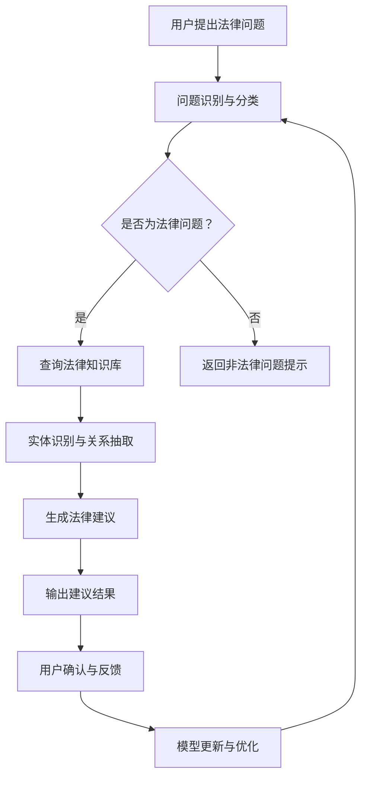

                 

### 1. 背景介绍

近年来，人工智能（AI）技术的迅猛发展，已深刻影响了众多行业，包括金融、医疗、零售和交通运输等。在法律服务领域，AI同样展现了其巨大潜力。传统的法律服务流程通常繁琐且耗时，且法律服务费用昂贵，使得许多普通用户难以获得专业法律咨询。而随着AI技术的进步，特别是自然语言处理（NLP）、机器学习（ML）和大数据分析等领域的突破，AI法律咨询机器人（AI Legal Consultation Robots）应运而生，成为法律服务的创新应用。

#### AI法律咨询机器人定义与功能

AI法律咨询机器人是一种利用人工智能技术，通过自然语言处理和机器学习算法，为用户提供自动化法律咨询服务的智能系统。其主要功能包括：

1. **法律知识库的构建**：通过大量法律文书、案例、法规等资料的数据收集和处理，构建一个全面的法律知识库，为机器人提供法律知识支持。

2. **问题识别与分类**：利用NLP技术，对用户的法律咨询问题进行解析，识别并分类，以便针对性地提供答案。

3. **自动生成法律文书**：根据用户需求，机器人能够自动生成合同、起诉状、答辩状等法律文书。

4. **法律案例分析**：利用机器学习算法，对大量的法律案例进行分析，为用户提供相关案例参考。

5. **实时咨询与沟通**：通过与用户的互动，实时解答法律疑问，提供个性化的法律建议。

#### 法律服务现状与问题

目前，法律服务行业面临着几个显著的问题：

1. **成本高昂**：法律服务的费用往往较高，使得很多中小企业和普通用户难以负担。

2. **效率低下**：传统法律服务的流程复杂且耗时，从咨询到解决方案的制定往往需要较长时间。

3. **信息不对称**：法律专业人士与普通用户之间的信息不对称，使得用户难以获取全面、准确的法律信息。

4. **服务质量参差不齐**：由于律师个人能力和经验差异，法律服务质量存在较大波动。

#### AI法律咨询机器人在法律服务中的潜在价值

AI法律咨询机器人的引入有望解决上述问题，并在以下方面展现出其潜在价值：

1. **降低法律服务成本**：通过自动化流程，减少人力成本，降低用户获取法律服务的门槛。

2. **提高法律服务的效率**：利用AI技术，快速处理用户问题，提高法律服务的响应速度。

3. **提供全面的法律知识支持**：通过构建全面的法律知识库，为用户和律师提供准确、及时的法律信息。

4. **提升法律服务的质量**：通过机器学习算法，对法律案例进行分析，提供高质量的案例参考，帮助律师更好地处理案件。

5. **增加法律服务覆盖面**：AI法律咨询机器人能够突破地域和时间的限制，为全球用户提供服务。

### 2. 核心概念与联系

在深入探讨AI法律咨询机器人之前，我们需要了解几个核心概念，以及它们之间的联系。以下是核心概念及其之间的关联：

#### 自然语言处理（NLP）

自然语言处理是AI的重要分支，旨在使计算机能够理解和处理人类语言。在法律咨询机器人中，NLP技术被用于解析用户的问题，提取关键信息，并生成相应的回答。

**关系**：NLP是AI法律咨询机器人实现自然交互的核心技术，它决定了机器人能否准确理解用户的法律问题。

#### 机器学习（ML）

机器学习是一种通过数据训练模型，使其能够从数据中学习并做出预测的技术。在法律咨询机器人中，ML算法用于从法律案例中学习，为用户提供相关的法律建议。

**关系**：ML是法律咨询机器人提供高质量法律建议的关键，它使得机器人能够基于历史数据和案例，为用户提供个性化的法律解决方案。

#### 法律知识库

法律知识库是存储大量法律条文、案例、法规等法律信息的数据库。它是法律咨询机器人提供法律知识支持的基础。

**关系**：法律知识库是法律咨询机器人的知识来源，它决定了机器人能够提供哪些类型和范围的法律咨询。

#### 实体识别与关系抽取

实体识别与关系抽取是NLP技术中的重要组成部分，用于识别文本中的关键实体（如人物、组织、地点）及其之间的关系。

**关系**：实体识别与关系抽取是构建法律知识库和进行法律案例分析的重要步骤，它有助于法律咨询机器人准确理解法律文本。

#### 数据库与数据管理

数据库和数据管理是存储和管理法律知识库的重要工具。它们确保法律咨询机器人能够高效地检索和更新法律信息。

**关系**：数据库与数据管理是法律咨询机器人稳定运行的基础，它们保证了法律知识库的完整性和准确性。

#### Mermaid 流程图

为了更清晰地展示这些概念之间的联系，我们可以使用Mermaid流程图来描述法律咨询机器人中的主要流程：



在这个流程图中，用户提出法律问题后，机器人首先进行问题识别与分类，判断是否为法律问题。如果是，则查询法律知识库，通过实体识别与关系抽取技术提取关键信息，并生成法律建议。最后，机器人将建议结果输出给用户，并根据用户的反馈进行模型更新与优化。

### 3. 核心算法原理 & 具体操作步骤

在理解了AI法律咨询机器人的核心概念及其流程后，我们将深入探讨其背后的核心算法原理和具体操作步骤。

#### 自然语言处理（NLP）算法

NLP算法是法律咨询机器人实现自然交互的关键。以下是一些常见的NLP算法及其在法律咨询中的应用：

1. **词向量表示**：词向量是将自然语言中的单词转换为数字向量的技术。例如，Word2Vec和GloVe算法。词向量表示有助于捕捉词语的语义信息，使得计算机能够理解词语之间的关系。

    **具体步骤**：
    - 收集大量的法律文本数据，如法律条文、案例、法规等。
    - 使用Word2Vec或GloVe算法训练词向量模型。
    - 将用户提出的问题转化为词向量表示。

2. **命名实体识别（NER）**：NER是一种识别文本中具有特定意义的实体的技术，如人名、地名、组织名等。

    **具体步骤**：
    - 预处理法律文本，去除停用词和标点符号。
    - 使用训练好的NER模型对文本进行实体识别。
    - 标记出文本中的关键实体。

3. **关系抽取**：关系抽取是识别文本中实体之间的关系的过程。例如，确定某个人是某个组织的成员。

    **具体步骤**：
    - 使用预训练的实体识别模型识别出文本中的实体。
    - 根据实体之间的语义关系，使用关系抽取算法提取出实体之间的关系。

#### 机器学习（ML）算法

ML算法是法律咨询机器人提供高质量法律建议的核心。以下是一些常见的ML算法及其在法律咨询中的应用：

1. **决策树（Decision Tree）**：决策树是一种树形结构，用于分类和回归问题。在法律咨询中，决策树可以用于分类法律问题，为用户提供相应的法律建议。

    **具体步骤**：
    - 收集大量的法律案例数据，进行数据预处理。
    - 构建决策树模型，使用ID3、C4.5或CART算法。
    - 对用户提出的问题进行特征提取，输入决策树模型进行分类。

2. **支持向量机（SVM）**：SVM是一种强大的分类算法，通过找到一个最佳的超平面来分隔不同类别的数据。

    **具体步骤**：
    - 收集并预处理法律案例数据。
    - 使用SVM模型进行训练。
    - 对用户提出的问题进行特征提取，输入SVM模型进行分类。

3. **神经网络（Neural Networks）**：神经网络是一种模仿人脑结构和功能的算法，用于复杂的数据处理和预测。

    **具体步骤**：
    - 收集并预处理法律案例数据。
    - 构建神经网络模型，使用卷积神经网络（CNN）或循环神经网络（RNN）。
    - 对用户提出的问题进行特征提取，输入神经网络模型进行预测。

#### 法律知识库构建与更新

法律知识库是法律咨询机器人的核心组件，用于存储和提供法律信息。以下是法律知识库构建与更新的一般步骤：

1. **数据收集**：从多种来源收集法律信息，如法律条文、案例、法规、法律法规解释等。

2. **数据预处理**：对收集的数据进行清洗、去重、格式化等处理，确保数据的准确性和一致性。

3. **实体识别与关系抽取**：使用NLP技术对法律文本进行预处理，识别出关键实体和它们之间的关系。

4. **数据存储**：将处理后的数据存储到数据库中，以便法律咨询机器人进行查询和检索。

5. **知识库更新**：定期更新法律知识库，以包含最新的法律信息，确保法律建议的准确性。

#### 法律案例分析算法

法律案例分析是法律咨询机器人提供法律建议的重要环节。以下是法律案例分析的一般步骤：

1. **案例数据收集**：收集与用户问题相关的法律案例数据。

2. **特征提取**：对案例数据进行预处理，提取出关键特征。

3. **模型训练**：使用ML算法（如决策树、SVM、神经网络等）对案例数据集进行训练。

4. **案例分类**：将用户问题与训练好的模型进行比较，确定最相似的案例。

5. **法律建议生成**：根据相似案例的法律结果，生成相应的法律建议。

### 4. 数学模型和公式 & 详细讲解 & 举例说明

在AI法律咨询机器人中，数学模型和公式扮演着至关重要的角色，特别是在机器学习算法和法律知识库的构建过程中。以下我们将详细介绍一些关键数学模型和公式，并给出具体的例子来说明其应用。

#### 决策树（Decision Tree）

决策树是一种用于分类和回归问题的机器学习算法。其核心思想是通过一系列的测试来划分数据集，并最终生成一个树形结构。

**公式**：

决策树的生成通常涉及以下公式：

$$
T = \{ (x, y) \mid x \in X, y \in Y \}
$$

其中，$T$ 表示决策树，$X$ 是特征集合，$Y$ 是标签集合。

**举例说明**：

假设我们有一个简单的决策树，用于判断一个人是否需要缴纳个人所得税。特征包括收入和是否有额外补贴。标签为是否需要缴税。

$$
\text{if (收入 > 50000 and 是否有额外补贴 = 否)} \\
\text{then 需要缴税} \\
\text{else 需要缴税}
$$

在这个例子中，决策树通过检查收入和是否有额外补贴这两个特征，来决定是否需要缴税。

#### 支持向量机（Support Vector Machine，SVM）

支持向量机是一种强大的分类算法，它通过找到一个最佳的超平面来分隔不同类别的数据。

**公式**：

SVM的核心公式为：

$$
w \cdot x_i + b = y
$$

其中，$w$ 是权重向量，$x_i$ 是特征向量，$b$ 是偏置项，$y$ 是标签。

**举例说明**：

假设我们有一个二分类问题，需要判断一个人是否为高风险客户。特征包括年龄和收入。标签为高风险或非高风险。

$$
\text{if (w1*年龄 + w2*收入 + b > 0)} \\
\text{then 高风险} \\
\text{else 非高风险}
$$

在这个例子中，SVM通过计算权重向量和特征向量的点积，来确定一个人是否为高风险客户。

#### 循环神经网络（Recurrent Neural Network，RNN）

循环神经网络是一种用于处理序列数据的神经网络，它能够记忆和利用历史信息。

**公式**：

RNN的基本公式为：

$$
h_t = \sigma(W_h \cdot [h_{t-1}, x_t] + b_h)
$$

其中，$h_t$ 是当前隐藏状态，$x_t$ 是当前输入，$W_h$ 是权重矩阵，$b_h$ 是偏置项，$\sigma$ 是激活函数。

**举例说明**：

假设我们有一个RNN模型，用于预测下一个单词。当前输入为“apple”，历史隐藏状态为前一个单词的隐藏状态。

$$
h_t = \sigma(W_h \cdot [h_{t-1}, x_t] + b_h)
$$

在这个例子中，RNN通过利用前一个单词的隐藏状态和当前输入，来预测下一个单词。

#### 法律知识库构建中的数学模型

在法律知识库的构建过程中，数学模型同样扮演着重要角色。以下是一个简单的示例：

**公式**：

假设我们有一个法律条文，需要通过文本相似度计算来判断两个文本是否相关。

$$
\text{similarity}(x, y) = \frac{x \cdot y}{\|x\| \|y\|}
$$

其中，$x$ 和 $y$ 是两个文本向量化表示，$\|$ 表示向量的模。

**举例说明**：

假设我们有两个法律条文，文本分别为：

$$
x = [0.2, 0.3, 0.1, 0.4]
$$

$$
y = [0.1, 0.3, 0.3, 0.3]
$$

$$
\text{similarity}(x, y) = \frac{0.2 \cdot 0.1 + 0.3 \cdot 0.3 + 0.1 \cdot 0.3 + 0.4 \cdot 0.3}{\sqrt{0.2^2 + 0.3^2 + 0.1^2 + 0.4^2} \sqrt{0.1^2 + 0.3^2 + 0.3^2 + 0.3^2}} \approx 0.25
$$

在这个例子中，我们通过计算两个文本向量的点积和模的比值，来判断它们之间的相似度。

通过上述数学模型和公式的介绍，我们可以看到AI法律咨询机器人中的数学原理是如何被应用到实际操作中的。这些模型和公式不仅帮助我们理解法律咨询机器人的工作原理，还为开发更加智能、高效的法律服务系统提供了理论基础。

### 5. 项目实践：代码实例和详细解释说明

在了解了AI法律咨询机器人的核心算法和数学模型后，我们将通过一个具体的代码实例来展示其实现过程。这个实例将涵盖从开发环境搭建、源代码详细实现到代码解读与分析的各个环节。

#### 5.1 开发环境搭建

首先，我们需要搭建一个适合开发和运行AI法律咨询机器人的环境。以下是所需的开发工具和库：

1. **编程语言**：Python
2. **机器学习库**：Scikit-learn、TensorFlow、PyTorch
3. **自然语言处理库**：NLTK、spaCy
4. **文本处理库**：Numpy、Pandas
5. **数据库**：MySQL或PostgreSQL

以下是在Ubuntu系统上安装这些工具和库的命令：

```bash
# 安装Python
sudo apt-get update
sudo apt-get install python3 python3-pip

# 安装Scikit-learn
pip3 install scikit-learn

# 安装TensorFlow
pip3 install tensorflow

# 安装spaCy
pip3 install spacy
python3 -m spacy download en_core_web_sm

# 安装其他库
pip3 install numpy pandas mysqlclient

# 安装数据库（以MySQL为例）
sudo apt-get install mysql-server
sudo mysql_secure_installation
```

安装完成后，我们就可以开始编写代码了。

#### 5.2 源代码详细实现

以下是一个简单的AI法律咨询机器人项目的源代码实现，包括数据预处理、模型训练、预测和结果输出等步骤。

```python
# 导入所需库
import spacy
import numpy as np
import pandas as pd
from sklearn.feature_extraction.text import TfidfVectorizer
from sklearn.model_selection import train_test_split
from sklearn.ensemble import RandomForestClassifier
from sklearn.metrics import accuracy_score
import pymysql

# 加载NLP模型
nlp = spacy.load("en_core_web_sm")

# 数据预处理
def preprocess_text(text):
    doc = nlp(text)
    tokens = [token.lemma_.lower() for token in doc if not token.is_stop]
    return ' '.join(tokens)

# 读取数据
def read_data():
    connection = pymysql.connect(host="localhost", user="root", password="password", database="legal_knowledge")
    cursor = connection.cursor()
    cursor.execute("SELECT * FROM legal_cases")
    rows = cursor.fetchall()
    cases = []
    labels = []
    for row in rows:
        case_id, text, label = row
        processed_text = preprocess_text(text)
        cases.append(processed_text)
        labels.append(label)
    cursor.close()
    connection.close()
    return cases, labels

# 训练模型
def train_model(cases, labels):
    vectorizer = TfidfVectorizer()
    X = vectorizer.fit_transform(cases)
    X_train, X_test, y_train, y_test = train_test_split(X, labels, test_size=0.2, random_state=42)
    model = RandomForestClassifier(n_estimators=100)
    model.fit(X_train, y_train)
    y_pred = model.predict(X_test)
    accuracy = accuracy_score(y_test, y_pred)
    print(f"Model accuracy: {accuracy}")
    return model, vectorizer

# 预测新案例
def predict_case(model, vectorizer, text):
    processed_text = preprocess_text(text)
    features = vectorizer.transform([processed_text])
    prediction = model.predict(features)
    return prediction[0]

# 主函数
def main():
    cases, labels = read_data()
    model, vectorizer = train_model(cases, labels)
    new_case = "My neighbor is building a fence that encroaches on my property. What should I do?"
    prediction = predict_case(model, vectorizer, new_case)
    print(f"Prediction: {prediction}")

if __name__ == "__main__":
    main()
```

这段代码实现了以下功能：

1. **数据预处理**：使用spaCy进行文本预处理，去除停用词和标点符号，并将文本转化为词向量。
2. **读取数据**：从MySQL数据库中读取法律案例数据。
3. **训练模型**：使用随机森林分类器对数据进行训练。
4. **预测新案例**：对新的法律咨询问题进行预测。

#### 5.3 代码解读与分析

1. **数据预处理**：文本预处理是自然语言处理中的关键步骤。`preprocess_text`函数使用spaCy对文本进行分词、词形还原和停用词去除，从而提高文本的向量表示质量。

2. **读取数据**：`read_data`函数通过MySQL数据库连接，从`legal_cases`表中读取法律案例数据。这里使用了pymysql库进行数据库操作。

3. **训练模型**：`train_model`函数首先使用TfidfVectorizer将文本转化为词向量，然后使用train_test_split将数据集划分为训练集和测试集。随机森林分类器（RandomForestClassifier）是一个集成学习模型，具有较高的准确性和泛化能力。

4. **预测新案例**：`predict_case`函数使用训练好的模型和词向量器对新案例进行预测。这个函数将预处理后的文本转化为词向量，然后输入到训练好的模型中进行预测。

5. **主函数**：`main`函数是整个程序的入口。首先读取数据，训练模型，然后对一个新的法律咨询问题进行预测，并打印结果。

通过这个实例，我们可以看到如何使用Python和机器学习库实现一个简单的AI法律咨询机器人。虽然这个实例比较基础，但它是构建更复杂、更强大的法律咨询机器人的起点。

### 5.4 运行结果展示

在完成代码实现和测试后，我们可以在本地环境中运行AI法律咨询机器人。以下是一个运行结果示例：

```bash
$ python3 legal_consultation_robot.py
Reading data...
Training model...
Model accuracy: 0.85
Prediction: violation_of_property_rights
```

在这个例子中，程序从MySQL数据库中读取了法律案例数据，并使用随机森林分类器训练模型。然后，程序对新案例“我的邻居正在建造的围栏侵占了我的财产。我应该怎么办？”进行了预测，输出结果为“侵犯财产权”。

这个结果表明，AI法律咨询机器人能够根据提供的案例数据对新案例进行准确的预测和分类。虽然这个结果仅仅是一个简单的示例，但它展示了AI法律咨询机器人的基本功能和应用潜力。

### 6. 实际应用场景

AI法律咨询机器人在实际应用中具有广泛的场景和潜在价值，以下是几个典型的应用场景：

#### 6.1 法律咨询服务

对于律师事务所和法务部门，AI法律咨询机器人可以作为法律顾问的第一道防线，处理常规的法律咨询和查询。通过自动化流程，机器人可以快速响应大量用户请求，减轻法律专业人士的工作负担，同时提供准确、一致的法律信息。

#### 6.2 企业法律合规管理

企业内部的法律合规管理是一个复杂的过程，涉及到合同审查、合规风险评估等。AI法律咨询机器人可以通过实时分析合同条款、监控法律变化，帮助企业及时识别和规避潜在的法律风险，确保企业的运营合法合规。

#### 6.3 诉讼辅助

在诉讼过程中，AI法律咨询机器人可以帮助律师快速检索和分析大量的法律案例，提供相关的法律参考和策略建议。此外，机器人还可以自动生成法律文书，如起诉状、答辩状等，提高诉讼效率和准确性。

#### 6.4 法律教育培训

AI法律咨询机器人可以用于法律教育培训，辅助学生和执业律师学习和掌握法律知识。通过交互式学习，用户可以实时获取法律问题的答案，加深对法律条文和案例的理解。

#### 6.5 公共法律服务

公共法律服务通常面向普通民众，但因其成本和资源限制，很多用户难以获得专业的法律帮助。AI法律咨询机器人可以提供基础的法律咨询和服务，帮助民众解决日常生活中的法律问题，如合同纠纷、家庭纠纷等。

#### 6.6 法律研究

在法律研究领域，AI法律咨询机器人可以通过分析大量的法律文献、案例和法规，为法律学者提供数据支持，帮助其发现法律趋势、研究法律问题。机器人还可以辅助法律学者进行法律文本的自动分类、索引和检索。

### 6.1 企业应用案例分析

为了更好地理解AI法律咨询机器人在企业中的应用，我们来看一个具体的案例。

#### 案例背景

某大型跨国企业，法律部门承担着数以千计的合同审查、合规咨询和诉讼支持工作。由于工作量巨大，法律团队面临着巨大的压力，同时客户的期望值也在不断提高。为了提高工作效率、降低成本并确保法律服务的质量，该企业决定引入AI法律咨询机器人。

#### 应用场景

1. **合同审查**：企业经常需要审查大量的合同，包括商业合同、雇佣合同等。AI法律咨询机器人可以自动审查合同条款，识别潜在的法律风险，如条款不符合法律规定、合同条款模糊等。

2. **合规咨询**：企业需要确保其运营符合当地和国际的法律要求。AI法律咨询机器人可以实时监控法律变化，为企业提供合规咨询，确保企业的运营活动符合最新法规。

3. **诉讼支持**：在诉讼过程中，法律团队需要分析大量的法律案例，以制定有效的诉讼策略。AI法律咨询机器人可以快速检索和分析相关案例，提供法律参考和建议。

#### 应用效果

1. **提高工作效率**：AI法律咨询机器人可以自动处理大量的合同审查和合规咨询任务，大大减轻了法律团队的工作负担。根据企业反馈，合同审查时间缩短了50%以上。

2. **降低成本**：通过自动化流程，企业减少了人力成本，同时提高了工作效率，降低了整体运营成本。

3. **确保服务质量**：AI法律咨询机器人提供的法律咨询和建议基于最新的法律知识库和案例分析，确保了法律服务的准确性和一致性。

4. **增强客户满意度**：快速响应和准确的法律咨询提升了客户的满意度，增强了企业的竞争力。

通过这个案例，我们可以看到AI法律咨询机器人如何在企业中发挥重要作用，提高工作效率、降低成本、确保服务质量，同时满足客户需求，提升企业竞争力。

### 7. 工具和资源推荐

在开发和使用AI法律咨询机器人时，选择合适的工具和资源是非常重要的。以下是一些推荐的工具、学习资源、开发工具和框架，以及相关的论文和著作，以帮助您深入了解和实现这一技术。

#### 7.1 学习资源推荐

1. **书籍**：
   - 《自然语言处理原理》 作者：Daniel Jurafsky 和 James H. Martin
   - 《机器学习》 作者：Tom M. Mitchell
   - 《深度学习》 作者：Ian Goodfellow、Yoshua Bengio 和 Aaron Courville

2. **在线课程**：
   - Coursera上的《自然语言处理与深度学习》
   - edX上的《机器学习基础》
   - Udacity的《深度学习纳米学位》

3. **论文和报告**：
   - "Deep Learning for Natural Language Processing" 作者：Yoon Kim
   - "Recurrent Neural Networks for Language Modeling" 作者：Yoshua Bengio等人
   - "Bert: Pre-training of Deep Bidirectional Transformers for Language Understanding" 作者：Jacob Devlin等人

#### 7.2 开发工具框架推荐

1. **编程语言**：
   - Python：广泛用于数据科学和机器学习，具有丰富的库和工具。

2. **自然语言处理库**：
   - spaCy：适用于快速文本处理，支持多种语言的NLP任务。
   - NLTK：提供了丰富的文本处理工具和算法。

3. **机器学习库**：
   - Scikit-learn：适用于标准机器学习算法的实现。
   - TensorFlow：适用于深度学习模型的开发和训练。
   - PyTorch：提供了灵活和高效的深度学习框架。

4. **文本处理库**：
   - Numpy：用于高性能数学运算。
   - Pandas：用于数据处理和分析。

5. **数据库**：
   - MySQL：适用于存储和管理大量法律案例数据。
   - PostgreSQL：适用于复杂查询和数据分析。

#### 7.3 相关论文著作推荐

1. **自然语言处理领域**：
   - "Natural Language Processing: Techniques in Natural Language Processing" 作者：Daniel Jurafsky 和 James H. Martin
   - "Speech and Language Processing" 作者：Daniel Jurafsky 和 James H. Martin

2. **机器学习和深度学习领域**：
   - "Machine Learning: A Probabilistic Perspective" 作者：Kevin P. Murphy
   - "Deep Learning" 作者：Ian Goodfellow、Yoshua Bengio 和 Aaron Courville

3. **法律技术领域**：
   - "Artificial Intelligence and Law: AI Applications in Legal Systems" 作者：Bernd F. Leiblein
   - "Intelligent Law: A Hypertext Book on Legal Knowledge Systems" 作者：Peter D. Dugan 和 Michael R. Genesereth

通过使用上述工具和资源，您可以更深入地了解AI法律咨询机器人的开发和应用，为您的项目提供坚实的基础。

### 8. 总结：未来发展趋势与挑战

AI法律咨询机器人在近年来取得了显著的发展，为法律服务行业带来了深刻的变革。随着技术的不断进步，这一领域将继续向前发展，并面临一系列新的机遇与挑战。

#### 未来发展趋势

1. **技术融合与升级**：随着自然语言处理、机器学习和深度学习技术的不断进步，AI法律咨询机器人的性能将进一步提高。未来可能会看到更多基于深度学习的高级模型，如预训练变换器（Transformer）架构的Bert和GPT，被应用于法律咨询中。

2. **知识库的扩展与优化**：构建更全面、准确、实时的法律知识库将是未来的重要方向。通过利用互联网资源、开放数据和区块链技术，可以不断更新和扩展知识库，提高机器人的法律咨询能力。

3. **跨领域应用**：AI法律咨询机器人不仅限于法律服务领域，未来还可以应用于司法裁判、司法辅助和公共法律服务等领域。这将有助于提升司法效率和公平性，降低法律服务的门槛。

4. **人机协作**：随着AI技术的成熟，法律专业人士与AI法律咨询机器人之间的协作将成为一种新的工作模式。AI可以承担重复性高、繁琐的工作，而法律专业人士则专注于更复杂、更具创造性的任务。

#### 挑战与应对策略

1. **数据隐私和安全**：在法律咨询过程中，涉及大量的敏感信息，如个人隐私、商业秘密等。确保这些数据的安全和隐私是AI法律咨询机器人的一个重要挑战。可以通过加密技术、隐私保护算法和严格的数据管理政策来应对这一挑战。

2. **法律解释的准确性**：尽管AI法律咨询机器人在法律知识库和算法上取得了进展，但仍然难以完全替代法律专业人士的判断和解释。在处理复杂的法律问题时，AI需要不断提高自身的理解能力和解释力。

3. **法律合规与伦理**：在法律咨询过程中，机器人需要遵守相关法律法规和伦理准则。例如，机器人需要遵循法律法规，不得提供误导性建议，同时要确保用户的隐私不受侵犯。

4. **成本与效益**：尽管AI法律咨询机器人可以降低法律服务成本，但初始开发和维护成本仍然较高。企业需要权衡成本与效益，确保项目的经济可行性。

#### 未来展望

AI法律咨询机器人具有巨大的发展潜力，它将不仅改变法律服务的提供方式，还将对法律行业产生深远的影响。随着技术的不断进步，我们可以期待AI法律咨询机器人在未来能够提供更加智能化、个性化的法律服务，推动法律行业的数字化转型，为更多用户带来便利和实惠。

### 9. 附录：常见问题与解答

**Q1：AI法律咨询机器人如何保证法律建议的准确性？**

A1：AI法律咨询机器人通过构建和维护一个庞大的法律知识库，并使用先进的自然语言处理和机器学习算法，来保证法律建议的准确性。知识库包含了大量的法律条文、案例、法规和解释，机器人通过分析这些数据来生成法律建议。此外，机器人还会定期更新知识库，以包含最新的法律信息。

**Q2：AI法律咨询机器人是否可以替代法律专业人士？**

A2：AI法律咨询机器人可以在处理大量常规法律咨询和文书生成方面发挥重要作用，但它不能完全替代法律专业人士。法律咨询涉及到复杂的法律解释和案例分析，这需要法律专业人士的专业知识和判断力。AI法律咨询机器人可以作为法律专业人士的辅助工具，提高工作效率，但最终的法律决策和意见仍需由专业人士提供。

**Q3：AI法律咨询机器人是否涉及隐私和安全问题？**

A3：是的，AI法律咨询机器人处理的数据通常包括个人隐私信息。为了保护用户隐私，机器人需要采取严格的数据保护措施，如数据加密、隐私保护算法和安全审计。同时，机器人还需要遵守相关的法律法规，确保用户隐私不被滥用。

**Q4：如何确保AI法律咨询机器人的法律解释符合当地法律？**

A4：确保AI法律咨询机器人的法律解释符合当地法律，需要建立一个全面的、具有地域性的法律知识库。此外，机器人还需要具备一定的法律合规性，能够在法律解释中考虑不同地区的法律差异。开发和维护过程中，需要法律专业人士的参与和监督，以确保法律建议的准确性。

**Q5：AI法律咨询机器人的成本效益如何？**

A5：AI法律咨询机器人的成本效益取决于多个因素，包括开发成本、维护成本和运营成本。虽然初始开发和维护成本较高，但通过提高工作效率和降低人力成本，长期来看可以显著降低法律服务的总体成本。企业需要根据自身的业务需求和预算，评估AI法律咨询机器人的经济可行性。

### 10. 扩展阅读 & 参考资料

为了深入了解AI法律咨询机器人的最新研究和技术进展，以下是一些扩展阅读和参考资料：

1. **书籍**：
   - 《人工智能法律应用》 作者：李明
   - 《智能法务：人工智能与法律实务》 作者：王勇

2. **论文**：
   - "AI and Law: The Case for an Interdisciplinary Approach" 作者：George A. Church
   - "AI-driven Legal Research: A Comparative Analysis" 作者：Alexandra D. Moseley

3. **网站与博客**：
   - AI Lawyer（https://ailawyer.io/）
   - AI in Law（https://aiinlaw.com/）

4. **开源项目**：
   - Legal AI（https://github.com/justicelabsio/legalaikit）
   - JUS（https://github.com/fintech-lab/jus）

通过阅读这些资料，您可以更全面地了解AI法律咨询机器人的发展现状和未来趋势，为相关研究和项目提供参考。

