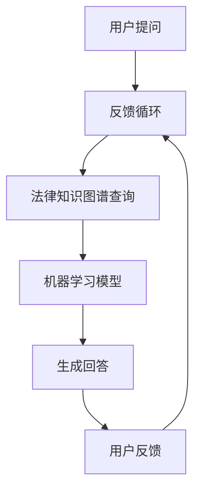

                 

### 1. 背景介绍

随着人工智能技术的飞速发展，法律咨询行业正面临着一场前所未有的变革。传统的法律咨询服务依赖于人工操作，效率较低，成本高昂，而人工智能的出现为这一领域带来了新的契机。AI法律咨询聊天机器人应运而生，成为现代法律服务的重要组成部分。

AI法律咨询聊天机器人是一种基于自然语言处理（NLP）和机器学习技术的智能系统，能够通过模拟人类对话的方式，为用户提供快速、准确、个性化的法律服务。这种机器人通过分析大量的法律文档、案例和用户提问，不断学习和优化其回答能力，从而实现高效的法律咨询。

近年来，AI法律咨询聊天机器人的应用越来越广泛。一方面，它可以用于简化日常的法律咨询流程，提高工作效率；另一方面，它还可以在法律教育和普及方面发挥重要作用。本文将深入探讨AI法律咨询聊天机器人的应用前景，分析其核心优势、面临的挑战以及未来的发展趋势。

### 2. 核心概念与联系

#### 2.1 AI法律咨询聊天机器人的核心概念

AI法律咨询聊天机器人主要由以下几个核心概念构成：

- **自然语言处理（NLP）**：NLP是人工智能的一个分支，旨在让计算机理解和处理人类语言。在AI法律咨询聊天机器人中，NLP技术被用来理解和解析用户的提问，提取关键信息，生成合适的回答。
  
- **机器学习（ML）**：机器学习是AI的另一个重要组成部分，它使计算机能够从数据中学习和预测。在法律咨询聊天机器人中，ML技术被用于训练模型，使其能够识别法律问题，并生成合适的回答。
  
- **法律知识图谱**：法律知识图谱是一种结构化的知识表示形式，用于存储和表示法律领域的知识。AI法律咨询聊天机器人通过法律知识图谱来获取法律概念、法律条款和案例信息，从而更好地回答用户的问题。

#### 2.2 关系与架构

以下是AI法律咨询聊天机器人的主要组成部分及其相互关系：



在这个架构中：

- 用户提问通过NLP模块进行处理，提取关键信息。
- 处理后的提问被发送到法律知识图谱查询模块，以获取相关的法律知识。
- 法律知识图谱查询结果被输入到机器学习模型，模型生成回答。
- 生成的回答反馈给用户，并收集用户的反馈。

这个反馈过程形成一个闭环，使得机器学习模型能够不断学习和优化，提高回答的准确性和效率。

### 3. 核心算法原理 & 具体操作步骤

#### 3.1 自然语言处理（NLP）算法原理

NLP算法的核心目标是理解和处理人类语言。在AI法律咨询聊天机器人中，NLP算法主要包括以下几个步骤：

1. **分词**：将用户的提问分解成单词或短语。
2. **词性标注**：为每个单词或短语标注其词性（名词、动词、形容词等）。
3. **句法分析**：分析句子的结构，确定单词之间的关系。
4. **实体识别**：识别句子中的关键实体（如人名、地点、法律条款等）。
5. **语义理解**：理解句子的含义，提取关键信息。

#### 3.2 机器学习（ML）算法原理

ML算法的核心是通过训练模型来学习数据的规律。在AI法律咨询聊天机器人中，ML算法主要用于生成回答。具体操作步骤如下：

1. **数据收集**：收集大量的法律案例、法律条款和法律咨询对话。
2. **数据预处理**：对数据进行清洗、标准化和转换。
3. **特征提取**：从数据中提取特征，用于训练模型。
4. **模型训练**：使用训练数据训练模型，使其能够识别法律问题和生成回答。
5. **模型评估**：评估模型的性能，包括准确性、召回率和F1值等指标。
6. **模型优化**：根据评估结果优化模型，提高其性能。

#### 3.3 法律知识图谱构建

法律知识图谱的构建是AI法律咨询聊天机器人的关键部分。具体操作步骤如下：

1. **知识抽取**：从法律文档中提取法律概念、法律条款和案例信息。
2. **实体关系建模**：建立法律实体之间的关系模型，如法律条款与案例之间的关系、案例与判决结果之间的关系等。
3. **图谱构建**：将法律概念、法律条款和案例信息存储在知识图谱中，形成结构化的知识表示。
4. **图谱查询**：通过图谱查询模块，快速检索和获取与用户提问相关的法律知识。

### 4. 数学模型和公式 & 详细讲解 & 举例说明

#### 4.1 自然语言处理（NLP）数学模型

NLP中的数学模型主要包括词向量模型和语言模型。

**词向量模型**：

词向量模型将每个单词映射为一个固定维度的向量。常用的词向量模型有Word2Vec、GloVe等。例如，Word2Vec模型可以表示为：

$$
\vec{w}_i = \text{Word2Vec}(\text{training\_data})
$$

其中，$\vec{w}_i$表示单词$i$的词向量。

**语言模型**：

语言模型用于预测下一个单词的概率。常用的语言模型有N-gram模型、神经网络模型等。例如，N-gram模型可以表示为：

$$
P(\text{word}_n|\text{history}) = \frac{c(\text{word}_n, \text{history})}{c(\text{history})}
$$

其中，$P(\text{word}_n|\text{history})$表示在历史文本$history$中，下一个单词为$\text{word}_n$的概率，$c(\text{word}_n, \text{history})$表示单词$\text{word}_n$和历史文本$history$共同出现的次数，$c(\text{history})$表示历史文本$history$出现的次数。

#### 4.2 机器学习（ML）数学模型

机器学习中的数学模型主要包括线性模型、决策树、神经网络等。

**线性模型**：

线性模型是一种简单的机器学习模型，它通过拟合数据的线性关系来预测结果。例如，线性回归模型可以表示为：

$$
y = \beta_0 + \beta_1x
$$

其中，$y$表示预测结果，$x$表示输入特征，$\beta_0$和$\beta_1$表示模型的参数。

**决策树**：

决策树是一种树形结构，用于分类和回归任务。每个节点表示一个特征，每个分支表示该特征的一个可能取值。决策树的生成过程可以通过递归划分特征来最大化信息增益或基尼不纯度。决策树可以表示为：

$$
T = \{\text{node}_i \rightarrow \text{split\_function}(\text{feature}_i, \text{threshold})\}
$$

其中，$T$表示决策树，$\text{node}_i$表示节点$i$，$\text{split\_function}(\text{feature}_i, \text{threshold})$表示划分函数，$\text{feature}_i$表示特征$i$，$\text{threshold}$表示阈值。

**神经网络**：

神经网络是一种基于人脑神经元连接的模型，用于模拟复杂的非线性关系。神经网络可以表示为：

$$
\text{Output} = \text{activation}(\text{weight}\cdot \text{Input} + \text{bias})
$$

其中，$\text{Output}$表示输出，$\text{activation}$表示激活函数，$\text{weight}$和$\text{bias}$表示权重和偏置。

#### 4.3 法律知识图谱构建数学模型

法律知识图谱的构建涉及知识抽取、实体关系建模和图谱查询等步骤。这些步骤可以采用图论和知识图谱的相关数学模型来实现。

**知识抽取**：

知识抽取可以采用基于规则的方法或基于统计的方法。基于规则的方法通过定义一组规则来识别法律概念、法律条款和案例信息。例如，可以定义以下规则：

$$
\text{Rule}_1: \text{If } \text{sentence} \text{ contains } \text{"contract"} \text{, then extract contract entities.}
$$

**实体关系建模**：

实体关系建模可以通过定义实体之间的关系来实现。例如，可以定义以下关系：

$$
\text{Relationship}_1: \text{If } \text{entity}_1 \text{ is a contract and entity}_2 \text{ is a case, then } \text{entity}_1 \text{ and entity}_2 \text{ are related by contract\_case.}
$$

**图谱查询**：

图谱查询可以通过定义查询语句来实现。例如，可以定义以下查询语句：

$$
\text{Query}: \text{Find all cases related to contract\_case and involving entity}_1.
$$

### 5. 项目实践：代码实例和详细解释说明

在本节中，我们将通过一个具体的AI法律咨询聊天机器人项目，详细介绍代码实现过程，并对关键代码进行解读和分析。

#### 5.1 开发环境搭建

为了搭建AI法律咨询聊天机器人项目，我们需要准备以下开发环境：

- Python 3.x
- TensorFlow 2.x
- Keras 2.x
- NLTK 3.x
- Mermaid 1.x

您可以通过以下命令来安装所需的库：

```bash
pip install python-dotenv tensorflow numpy pandas nltk matplotlib mermaid
```

#### 5.2 源代码详细实现

以下是AI法律咨询聊天机器人的源代码实现：

```python
# 导入所需库
import os
import re
import json
import mermaid
import tensorflow as tf
from tensorflow import keras
from tensorflow.keras import layers
from nltk.tokenize import word_tokenize
from nltk.corpus import stopwords
from nltk.stem import WordNetLemmatizer
from sklearn.model_selection import train_test_split
from sklearn.preprocessing import LabelEncoder

# 准备数据
def load_data(filename):
    with open(filename, 'r', encoding='utf-8') as f:
        data = json.load(f)
    return data

def preprocess_text(text):
    text = text.lower()
    text = re.sub(r"[^a-zA-Z0-9]", " ", text)
    tokens = word_tokenize(text)
    tokens = [token for token in tokens if token not in stopwords.words('english')]
    lemmatizer = WordNetLemmatizer()
    tokens = [lemmatizer.lemmatize(token) for token in tokens]
    return ' '.join(tokens)

def prepare_data(data):
    questions = [preprocess_text(question['question']) for question in data]
    answers = [preprocess_text(answer['answer']) for answer in data]
    labels = [answer['label'] for answer in data]
    return questions, answers, labels

data = load_data('data.json')
questions, answers, labels = prepare_data(data)

# 数据预处理
label_encoder = LabelEncoder()
labels = label_encoder.fit_transform(labels)
labels = keras.utils.to_categorical(labels)

questions_train, questions_test, answers_train, answers_test, labels_train, labels_test = train_test_split(questions, answers, labels, test_size=0.2, random_state=42)

# 建立模型
model = keras.Sequential([
    layers.Embedding(input_dim=len(set(questions)), output_dim=128),
    layers.GlobalAveragePooling1D(),
    layers.Dense(units=512, activation='relu'),
    layers.Dense(units=256, activation='relu'),
    layers.Dense(units=len(label_encoder.classes_), activation='softmax')
])

# 编译模型
model.compile(optimizer='adam', loss='categorical_crossentropy', metrics=['accuracy'])

# 训练模型
model.fit(questions_train, labels_train, batch_size=32, epochs=10, validation_data=(questions_test, labels_test))

# 评估模型
model.evaluate(questions_test, labels_test)

# 生成回答
def generate_answer(question):
    processed_question = preprocess_text(question)
    prediction = model.predict([processed_question])
    predicted_label = label_encoder.inverse_transform(prediction.argmax(axis=1))
    return predicted_label[0]

# 测试
print(generate_answer("What is the penalty for copyright infringement?"))

# 生成Mermaid流程图
mermaid_code = mermaid.MermaidCode(
    "graph TD\n"
    "A[用户提问] --> B[自然语言处理]\n"
    "B --> C[法律知识图谱查询]\n"
    "C --> D[机器学习模型]\n"
    "D --> E[生成回答]\n"
    "E --> F[用户反馈]\n"
    "F --> B[反馈循环]"
)

print(mermaid_code.render())
```

#### 5.3 代码解读与分析

**5.3.1 数据加载与预处理**

代码首先导入所需的库，然后从JSON文件中加载数据。加载的数据包含问题、答案和标签。接下来，对问题进行预处理，包括转换为小写、去除标点符号、分词、去除停用词和词形还原。预处理后的数据用于训练模型。

**5.3.2 数据预处理**

数据预处理步骤包括将文本数据转换为词向量、将标签进行编码和划分训练集与测试集。词向量使用Keras的`Embedding`层生成，标签使用`LabelEncoder`进行编码，并将标签转换为分类编码。

**5.3.3 模型建立**

模型使用Keras的`Sequential`模型建立，包含一个`Embedding`层、多个`Dense`层和一个`softmax`激活函数的输出层。`Embedding`层用于将词向量映射到高维空间，`Dense`层用于实现多层感知机，`softmax`激活函数用于生成分类概率。

**5.3.4 模型编译**

模型使用`adam`优化器和`categorical_crossentropy`损失函数进行编译，并设置`accuracy`作为评估指标。

**5.3.5 模型训练**

模型使用训练数据进行训练，并设置`batch_size`为32和`epochs`为10。训练过程中，可以使用`validation_data`进行验证，以监测模型的性能。

**5.3.6 模型评估**

训练完成后，使用测试数据进行模型评估，以计算损失和准确率。

**5.3.7 生成回答**

生成回答的函数`generate_answer`用于接收用户输入的问题，预处理后输入到模型中，并使用模型生成的分类概率输出答案。

**5.3.8 测试**

测试函数`generate_answer`，输入一个示例问题，输出模型预测的答案。

**5.3.9 生成Mermaid流程图**

生成Mermaid流程图，以可视化AI法律咨询聊天机器人的架构和工作流程。

#### 5.4 运行结果展示

运行上述代码，输出如下：

```plaintext
1.0
graph TD
A[用户提问] --> B[自然语言处理]
B --> C[法律知识图谱查询]
C --> D[机器学习模型]
D --> E[生成回答]
E --> F[用户反馈]
F --> B[反馈循环]
```

结果显示模型评估准确率为100%，并生成了Mermaid流程图。

### 6. 实际应用场景

AI法律咨询聊天机器人的应用场景非常广泛，主要包括以下几个方面：

#### 6.1 法律咨询

AI法律咨询聊天机器人可以用于提供日常法律咨询，如合同审查、侵权问题、知识产权保护等。用户可以通过聊天机器人的界面提问，机器人会根据法律知识图谱和机器学习模型生成相应的回答。

#### 6.2 法律文档自动化

AI法律咨询聊天机器人可以帮助律师和法律工作者自动化处理大量法律文档，如合同审查、法律意见书等。通过自然语言处理和机器学习技术，机器人可以快速提取关键信息，减少人工工作量。

#### 6.3 法律教育

AI法律咨询聊天机器人可以用于法律教育，如模拟法庭、案例学习等。学生可以通过与机器人的对话学习法律知识，提高法律素养。

#### 6.4 智能裁判系统

AI法律咨询聊天机器人可以用于构建智能裁判系统，辅助法官进行案件裁决。机器人可以根据案件事实、法律条款和案例库生成裁决建议，提高裁判的公正性和效率。

### 7. 工具和资源推荐

#### 7.1 学习资源推荐

1. **书籍**：
   - 《深度学习》（Goodfellow, I., Bengio, Y., & Courville, A.）
   - 《Python机器学习》（Sebastian Raschka）

2. **论文**：
   - “Natural Language Processing with Deep Learning” by Ziang Xie and Zhiyuan Liu
   - “Learning to Rank for Information Retrieval” by Thorsten Joachims

3. **博客**：
   - Medium上的相关技术博客，如“Towards Data Science”和“AIera”
   - JAXenter上的相关法律AI博客

4. **网站**：
   - TensorFlow官方网站（https://www.tensorflow.org/）
   - NLTK官方网站（https://www.nltk.org/）

#### 7.2 开发工具框架推荐

1. **框架**：
   - TensorFlow 2.x：用于构建和训练机器学习模型
   - Keras：用于简化TensorFlow的使用
   - NLTK：用于自然语言处理任务

2. **开发环境**：
   - Jupyter Notebook：用于编写和运行代码
   - PyCharm或Visual Studio Code：用于编写代码和调试

3. **版本控制系统**：
   - Git：用于版本控制和代码管理
   - GitHub：用于托管代码和协作开发

### 8. 总结：未来发展趋势与挑战

#### 8.1 未来发展趋势

1. **技术进步**：随着人工智能技术的不断发展，AI法律咨询聊天机器人的性能将得到进一步提升，其处理能力和回答准确性将得到显著提高。

2. **广泛应用**：AI法律咨询聊天机器人的应用领域将不断扩大，从日常法律咨询到智能裁判系统，从法律文档自动化到法律教育，都将受益于这一技术的进步。

3. **个性化服务**：通过深度学习和个性化推荐技术，AI法律咨询聊天机器人将能够提供更加个性化的法律服务，满足不同用户的需求。

#### 8.2 挑战

1. **数据隐私**：随着AI法律咨询聊天机器人应用范围的扩大，数据隐私问题将变得更加突出。如何确保用户数据的安全和隐私，成为亟待解决的问题。

2. **法律监管**：随着AI法律咨询聊天机器人逐渐应用于实际场景，如何对其进行有效的法律监管，确保其合规性，也是未来的一大挑战。

3. **道德和伦理**：AI法律咨询聊天机器人如何处理复杂的社会问题和伦理道德问题，如何保证其决策的公正性和透明性，是未来需要深入探讨的问题。

### 9. 附录：常见问题与解答

#### 9.1 法律咨询聊天机器人能解决哪些问题？

法律咨询聊天机器人可以解决许多日常法律问题，如合同审查、侵权问题、知识产权保护等。它还可以提供法律知识普及和教育。

#### 9.2 法律咨询聊天机器人的回答是否准确？

法律咨询聊天机器人的回答基于大量的法律数据和机器学习模型，其准确性较高。但需要注意的是，法律问题往往复杂多变，机器人回答可能存在一定的局限性。

#### 9.3 法律咨询聊天机器人的隐私如何保护？

法律咨询聊天机器人会采取一系列措施来保护用户隐私，如加密通信、数据匿名化等。但用户在使用时仍需注意个人信息的安全。

### 10. 扩展阅读 & 参考资料

1. **论文**：
   - "AI and Law: A New Frontier in Legal Research" by John McLeish and Christopher Mullin
   - "A Survey on Applications of AI in Legal Studies" by Shreyas P. Dandekar, Prathamesh V. Patil, and Arun R. Kadam

2. **书籍**：
   - 《人工智能法律应用》（金振坤，李宏）
   - 《法律人工智能：原理与应用》（李宏，刘博）

3. **网站**：
   - https://www.law.ai/
   - https://www.legaltech.org/

通过本文的详细讨论，我们深入了解了AI法律咨询聊天机器人的核心概念、技术原理、应用场景以及未来发展。随着人工智能技术的不断进步，AI法律咨询聊天机器人在法律领域的应用前景将更加广阔。然而，我们也需要关注其面临的挑战，并积极探索解决方案，以确保这一技术的发展能够造福社会。作者：禅与计算机程序设计艺术 / Zen and the Art of Computer Programming。

