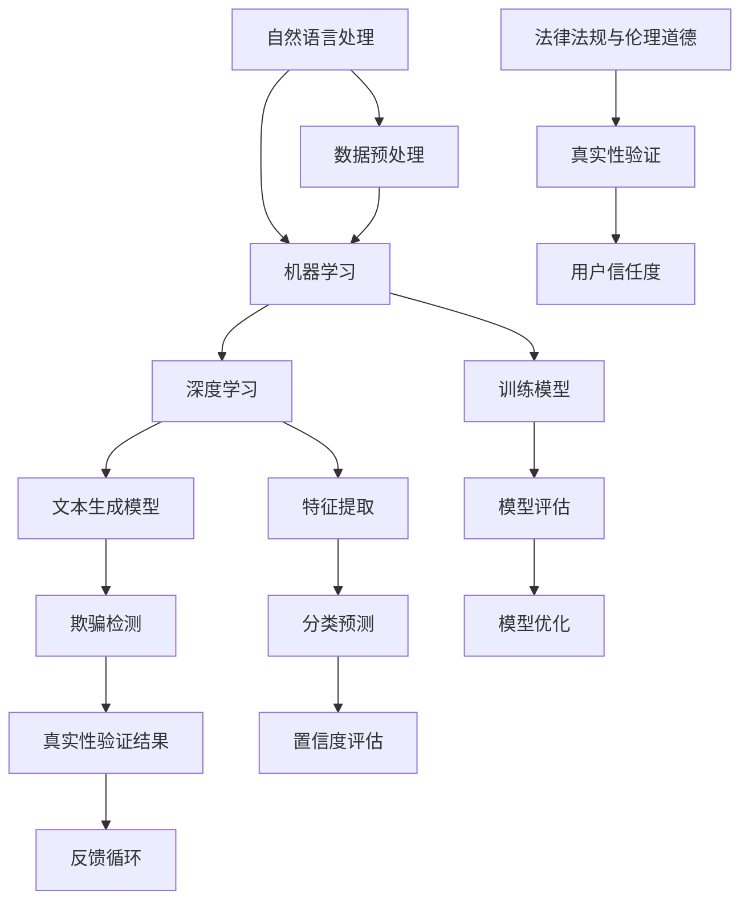

                 

### 1. 背景介绍

随着人工智能技术的飞速发展，尤其是深度学习和自然语言处理技术的崛起，生成内容（Generated Content）已经成为互联网世界中的一个重要组成部分。从自动化新闻报道、社交媒体内容生成到搜索引擎优化，AI生成内容在各种场景中展现出了巨大的潜力。然而，这种技术进步也带来了一系列新的挑战，尤其是如何在海量的生成内容中确保其真实性成为一个亟待解决的问题。

AI生成内容真实性的验证问题，不仅关乎用户体验和信任度，还涉及到法律法规、隐私保护、信息安全和伦理道德等多个方面。例如，虚假新闻和误导性信息的泛滥可能导致公众对媒体和技术的信任度下降，从而对社会稳定和公共安全构成威胁。此外，在金融、医疗等关键领域，AI生成内容的真实性更是直接关系到个人和企业的利益。

目前，学术界和工业界已经提出了一系列验证AI生成内容真实性的方法。这些方法可以分为基于规则的方法、基于模型的方法和基于数据的方法。基于规则的方法通过预设的规则和标签来判断内容的真实性，具有实现简单、易于部署的优势，但往往在面对复杂和多变的内容时显得力不从心。基于模型的方法则利用机器学习技术，通过训练大量的真实和虚假内容来建立分类模型，从而实现自动化的真实性判断。这种方法的准确性较高，但训练过程复杂且对数据质量要求较高。

基于数据的方法则通过数据挖掘和分析来识别生成内容的模式，从而判断其真实性。这种方法能够发现基于规则和模型难以捕捉的细微差异，但在数据质量和多样性方面也有较高的要求。

本文旨在深入探讨AI生成内容真实性验证的问题，从核心概念出发，详细分析现有方法，并通过实际案例和项目实践来展示其应用效果。本文还将讨论这一领域未来的发展趋势与挑战，为读者提供全面、深入的洞察。

在接下来的章节中，我们将首先介绍与AI生成内容真实性验证相关的一些核心概念，并使用Mermaid流程图展示其原理和架构。随后，我们将详细讲解核心算法的原理和操作步骤，并通过数学模型和公式进行分析。然后，我们将通过代码实例和详细解释说明来展示这一方法在实际项目中的应用。最后，我们将探讨AI生成内容真实性验证的实际应用场景，并推荐相关的学习资源和开发工具。

### 2. 核心概念与联系

在深入探讨AI生成内容真实性验证的方法之前，我们需要先了解几个核心概念，并展示其原理和架构。以下是本文涉及的核心概念及其相互关系：

#### 2.1. 自然语言处理（NLP）

自然语言处理（Natural Language Processing，NLP）是人工智能领域的一个分支，旨在使计算机能够理解、解释和生成人类语言。NLP涉及文本处理、语义分析、语音识别等多个方面，是AI生成内容的基础。

#### 2.2. 机器学习（ML）

机器学习（Machine Learning，ML）是一种通过数据和算法来让计算机自动学习和改进的方法。在AI生成内容真实性验证中，ML技术被用来训练分类模型，以识别真实和虚假的内容。

#### 2.3. 深度学习（DL）

深度学习（Deep Learning，DL）是机器学习的一个子领域，通过神经网络架构来模拟人脑的决策过程。在真实性验证中，深度学习模型可以捕捉复杂的数据特征，提高判断的准确性。

#### 2.4. 文本生成模型

文本生成模型（Text Generation Models）如GPT（Generative Pre-trained Transformer）和BERT（Bidirectional Encoder Representations from Transformers）等，可以生成大量看似真实的文本。这些模型是AI生成内容的重要工具，但也使得真实性验证变得更加复杂。

#### 2.5. 欺骗检测（Fraud Detection）

欺骗检测（Fraud Detection）是识别和预防恶意行为的技术，在真实性验证中也扮演着重要角色。欺骗检测技术可以帮助我们识别伪造的内容和潜在的欺诈行为。

#### 2.6. Mermaid流程图

为了更好地展示这些核心概念及其相互关系，我们可以使用Mermaid流程图来表示它们的原理和架构。以下是一个简化的Mermaid流程图示例：



#### 2.7. 关键概念解析

- **自然语言处理（NLP）**：NLP是使计算机能够处理和理解人类语言的技术。它包括文本分类、情感分析、实体识别等任务，是生成内容理解和生成的基础。
  
- **机器学习（ML）**：ML是让计算机通过数据学习规律和模式的技术。在真实性验证中，ML用于训练分类模型，以区分真实和虚假内容。
  
- **深度学习（DL）**：DL是ML的一个子领域，通过多层神经网络来提取和表示数据特征。它在真实性验证中用于构建复杂的特征提取和分类模型。
  
- **文本生成模型**：这些模型如GPT和BERT等，可以生成大量看似真实的文本。它们在生成内容真实性验证中扮演着重要的角色，但同时也带来了挑战。
  
- **欺骗检测**：欺骗检测技术用于识别和预防欺诈行为。在真实性验证中，它可以帮助识别伪造内容和潜在的欺诈行为。
  
- **数据预处理**：数据预处理是机器学习任务中的关键步骤，包括数据清洗、特征提取和归一化等。在真实性验证中，数据预处理有助于提高模型的性能和准确性。
  
- **法律法规与伦理道德**：在真实性验证中，法律法规和伦理道德是确保验证过程合法、公正和符合道德标准的重要因素。

#### 2.8. Mermaid流程图详细解析

以下是Mermaid流程图中的各个节点的详细解析：

- **A[自然语言处理]**：自然语言处理是整个流程的起点，它包括文本分类、情感分析、实体识别等任务。这些任务为后续的机器学习和深度学习提供输入。

- **B[机器学习]**：机器学习用于训练分类模型，以区分真实和虚假内容。它包括数据预处理、模型训练和模型评估等步骤。

- **C[深度学习]**：深度学习是机器学习的一个子领域，通过多层神经网络来提取和表示数据特征。它在真实性验证中用于构建复杂的特征提取和分类模型。

- **D[文本生成模型]**：文本生成模型如GPT和BERT等，可以生成大量看似真实的文本。它们是生成内容的主要来源，但在真实性验证中也需要仔细处理。

- **E[欺骗检测]**：欺骗检测技术用于识别和预防欺诈行为。它可以帮助识别伪造内容和潜在的欺诈行为，是真实性验证的重要组成部分。

- **F[数据预处理]**：数据预处理是机器学习任务中的关键步骤，包括数据清洗、特征提取和归一化等。它有助于提高模型的性能和准确性。

- **G[真实性验证结果]**：真实性验证结果用于判断生成内容是否真实。它包括分类结果、置信度评估和错误率等指标。

- **H[反馈循环]**：反馈循环是真实性验证中的一个重要机制，用于根据验证结果调整模型和策略。它有助于提高模型的准确性和鲁棒性。

- **I[训练模型]**：训练模型是机器学习中的核心步骤，包括数据预处理、模型训练和模型评估等。它用于建立和优化分类模型。

- **J[模型评估]**：模型评估是训练模型后的关键步骤，用于评估模型的性能和准确性。它包括错误率、精度、召回率和F1值等指标。

- **K[模型优化]**：模型优化是根据评估结果调整模型参数和结构，以进一步提高模型性能。

- **L[特征提取]**：特征提取是深度学习中的核心步骤，用于提取数据中的关键特征。这些特征对于分类和预测至关重要。

- **M[分类预测]**：分类预测是模型输出结果的过程，用于判断生成内容是否真实。

- **N[置信度评估]**：置信度评估是判断分类结果可信度的过程，它有助于识别可能的错误和异常。

- **O[法律法规与伦理道德]**：法律法规与伦理道德是真实性验证中不可忽视的因素，它们确保验证过程合法、公正和符合道德标准。

- **P[真实性验证]**：真实性验证是整个流程的最终目标，它用于确保生成内容真实可信。

- **Q[用户信任度]**：用户信任度是真实性验证的重要成果，它直接关系到用户对AI生成内容的信任和使用意愿。

通过上述核心概念和Mermaid流程图的详细解析，我们可以更好地理解AI生成内容真实性验证的原理和架构。在接下来的章节中，我们将深入探讨核心算法的原理和操作步骤，并通过数学模型和公式进行分析。

### 3. 核心算法原理 & 具体操作步骤

在理解了AI生成内容真实性验证的相关核心概念和流程后，我们接下来将详细探讨核心算法的原理，并介绍具体操作步骤。核心算法通常涉及机器学习（ML）和深度学习（DL）技术，以下将分为几个部分进行讲解。

#### 3.1. 机器学习算法原理

机器学习算法是AI生成内容真实性验证的基础。以下是几种常用的机器学习算法及其原理：

1. **朴素贝叶斯分类器（Naive Bayes Classifier）**：
   朴素贝叶斯分类器是一种基于概率论的分类方法，特别适用于文本分类任务。其基本原理是计算每个类别在给定特征条件下的概率，然后选择概率最大的类别作为预测结果。具体操作步骤如下：

   - **特征提取**：从文本中提取特征，如词频、词袋模型等。
   - **训练模型**：使用训练数据集计算每个类别的条件概率。
   - **分类预测**：对于新文本，计算其在每个类别下的概率，选择概率最大的类别。

2. **支持向量机（Support Vector Machine，SVM）**：
   支持向量机是一种基于最大间隔的分类方法，它在高维空间中寻找一个最佳的超平面来分隔不同的类别。其基本原理是最大化分类边界之间的间隔，同时确保分类边界能够正确分类训练数据。具体操作步骤如下：

   - **特征提取**：从文本中提取特征向量。
   - **训练模型**：使用训练数据集训练SVM模型。
   - **分类预测**：对于新文本，计算其在每个类别下的距离，选择最近的类别。

3. **随机森林（Random Forest）**：
   随机森林是一种集成学习方法，通过构建多个决策树来提高分类性能。它的基本原理是利用随机特征选择和分类树集成来降低偏差和方差。具体操作步骤如下：

   - **特征提取**：从文本中提取特征向量。
   - **训练模型**：使用训练数据集构建多个决策树，并集成它们的预测结果。
   - **分类预测**：对于新文本，多个决策树分别进行分类，取多数表决结果作为最终预测。

#### 3.2. 深度学习算法原理

深度学习算法在AI生成内容真实性验证中具有更高的准确性和鲁棒性。以下是几种常用的深度学习算法及其原理：

1. **卷积神经网络（Convolutional Neural Network，CNN）**：
   卷积神经网络是一种用于图像和文本分类的深度学习模型。它通过卷积层、池化层和全连接层来提取和表示数据特征。具体操作步骤如下：

   - **特征提取**：使用卷积层提取文本中的局部特征。
   - **特征表示**：使用池化层减少特征维度，提高模型性能。
   - **分类预测**：使用全连接层进行分类预测。

2. **循环神经网络（Recurrent Neural Network，RNN）**：
   循环神经网络是一种用于序列数据处理的深度学习模型，如文本和语音。它通过隐藏状态和循环连接来处理序列中的长期依赖关系。具体操作步骤如下：

   - **序列编码**：使用RNN编码文本序列为向量表示。
   - **特征表示**：通过隐藏状态和循环连接来捕捉序列中的长期依赖关系。
   - **分类预测**：使用全连接层进行分类预测。

3. **变压器（Transformer）**：
   变压器是一种用于自然语言处理的深度学习模型，它在机器翻译、文本分类等任务中表现出色。它通过自注意力机制来处理序列中的长距离依赖关系。具体操作步骤如下：

   - **编码器**：将输入文本编码为向量表示。
   - **自注意力**：通过自注意力机制计算序列中的依赖关系。
   - **解码器**：将编码器的输出解码为分类结果。

#### 3.3. 具体操作步骤

为了更清晰地展示核心算法的具体操作步骤，以下是一个基于朴素贝叶斯分类器的具体案例：

1. **数据准备**：
   - 收集真实和虚假的文本数据。
   - 对文本进行预处理，包括分词、去除停用词、标记化等。

2. **特征提取**：
   - 使用词频（TF）或词袋模型（TF-IDF）提取文本特征。
   - 将特征表示为向量的形式。

3. **模型训练**：
   - 将预处理后的数据划分为训练集和测试集。
   - 使用训练集训练朴素贝叶斯分类器。
   - 计算每个类别的条件概率。

4. **分类预测**：
   - 对于新文本，计算其在每个类别下的概率。
   - 选择概率最大的类别作为预测结果。

5. **模型评估**：
   - 使用测试集评估模型的性能。
   - 计算分类准确率、召回率、F1值等指标。

6. **模型优化**：
   - 根据评估结果调整模型参数。
   - 重新训练模型，提高分类性能。

通过上述操作步骤，我们可以实现AI生成内容真实性验证的基本流程。在实际应用中，可以根据具体任务需求和数据特点选择合适的机器学习或深度学习算法，并对其进行优化和调整。

在接下来的章节中，我们将通过数学模型和公式详细分析AI生成内容真实性验证的方法，并展示实际项目中的代码实例和运行结果。

### 4. 数学模型和公式 & 详细讲解 & 举例说明

在深入探讨AI生成内容真实性验证的数学模型和公式时，我们将首先介绍一些基本的概率论和统计学概念，然后详细讲解用于真实性验证的几个关键模型及其公式。通过具体例子，我们将展示如何将这些模型应用于实际任务中。

#### 4.1. 基本概率论和统计学概念

在进行真实性验证时，概率论和统计学是不可或缺的工具。以下是一些基础概念：

1. **概率分布**：概率分布是描述随机变量取值的概率函数。常见的概率分布包括正态分布、伯努利分布、泊松分布等。

2. **条件概率**：条件概率是指在某一事件已发生的前提下，另一事件发生的概率。条件概率的公式为：
   $$ P(A|B) = \frac{P(A \cap B)}{P(B)} $$
   其中，\( P(A|B) \) 表示在事件B发生的条件下事件A发生的概率，\( P(A \cap B) \) 表示事件A和B同时发生的概率，\( P(B) \) 表示事件B发生的概率。

3. **贝叶斯定理**：贝叶斯定理是概率论中用于计算后验概率的重要工具。其公式为：
   $$ P(A|B) = \frac{P(B|A) \cdot P(A)}{P(B)} $$
   其中，\( P(A|B) \) 表示在事件B发生的条件下事件A发生的概率，\( P(B|A) \) 表示在事件A发生的条件下事件B发生的概率，\( P(A) \) 和 \( P(B) \) 分别表示事件A和事件B的先验概率。

4. **熵和交叉熵**：熵是衡量随机变量不确定性的度量，其公式为：
   $$ H(X) = -\sum_{i} P(X=x_i) \cdot \log_2 P(X=x_i) $$
   交叉熵是两个概率分布之间的差异，其公式为：
   $$ H(A,B) = -\sum_{i} P(A=x_i) \cdot \log_2 P(B=x_i) $$

#### 4.2. 用于真实性验证的数学模型

在真实性验证中，常用的数学模型包括朴素贝叶斯分类器、支持向量机（SVM）、逻辑回归和神经网络等。以下将详细讲解这些模型及其公式。

1. **朴素贝叶斯分类器**：
   朴素贝叶斯分类器是一种基于贝叶斯定理的简单概率分类器。其公式为：
   $$ P(\text{真实}|x) = \frac{P(x|\text{真实}) \cdot P(\text{真实})}{P(x|\text{真实}) \cdot P(\text{真实}) + P(x|\text{虚假}) \cdot P(\text{虚假})} $$
   其中，\( P(\text{真实}|x) \) 表示在特征向量x下，文本为真实的概率；\( P(x|\text{真实}) \) 和 \( P(x|\text{虚假}) \) 分别表示在真实和虚假文本下，特征向量x的概率；\( P(\text{真实}) \) 和 \( P(\text{虚假}) \) 分别表示真实文本和虚假文本的先验概率。

2. **支持向量机（SVM）**：
   支持向量机是一种基于最大间隔的分类器。其公式为：
   $$ \max_{w, b} \frac{1}{2} \| w \|^2 $$
   subject to
   $$ y^{(i)} ( \langle w, x^{(i)} \rangle + b ) \geq 1 $$
   其中，\( w \) 和 \( b \) 分别是权重和偏置，\( x^{(i)} \) 是特征向量，\( y^{(i)} \) 是类别标签（真实或虚假）。

3. **逻辑回归**：
   逻辑回归是一种概率型分类器，其公式为：
   $$ \log \frac{P(y=1|x)}{1 - P(y=1|x)} = \beta_0 + \sum_{i} \beta_i x_i $$
   其中，\( P(y=1|x) \) 表示在特征向量x下，文本为真实的概率；\( \beta_0 \) 和 \( \beta_i \) 分别是模型的参数。

4. **神经网络**：
   神经网络是一种基于多层感知器（MLP）的深度学习模型，其公式为：
   $$ z^{(l)} = \sigma( \langle \theta^{(l)}, x^{(l-1)} \rangle ) $$
   $$ a^{(l)} = \sigma(z^{(l)}) $$
   其中，\( z^{(l)} \) 是第l层的输出，\( a^{(l)} \) 是第l层的激活值，\( \sigma \) 是激活函数，\( \theta^{(l)} \) 是第l层的权重。

#### 4.3. 举例说明

为了更好地理解上述数学模型的应用，我们将通过一个具体例子来说明。

假设我们有一个文本数据集，其中包含真实和虚假的文本。我们使用朴素贝叶斯分类器来验证文本的真实性。具体步骤如下：

1. **数据预处理**：
   - 收集并预处理文本数据，包括分词、去除停用词等。
   - 将文本转换为词袋模型（TF-IDF）表示。

2. **特征提取**：
   - 从词袋模型中提取特征向量。

3. **训练模型**：
   - 使用真实和虚假文本数据训练朴素贝叶斯分类器。
   - 计算每个类别的条件概率和先验概率。

4. **分类预测**：
   - 对于新文本，计算其在真实和虚假类别下的概率。
   - 选择概率最大的类别作为预测结果。

假设我们有一个新文本，其词袋表示为 \( x = [0.1, 0.3, 0.5, 0.2] \)。根据训练好的朴素贝叶斯分类器，我们可以计算其在真实和虚假类别下的概率：

- **真实类别概率**：
  $$ P(\text{真实}|x) = \frac{P(x|\text{真实}) \cdot P(\text{真实})}{P(x|\text{真实}) \cdot P(\text{真实}) + P(x|\text{虚假}) \cdot P(\text{虚假})} $$

- **虚假类别概率**：
  $$ P(\text{虚假}|x) = \frac{P(x|\text{虚假}) \cdot P(\text{虚假})}{P(x|\text{真实}) \cdot P(\text{真实}) + P(x|\text{虚假}) \cdot P(\text{虚假})} $$

通过计算，我们得到：
$$ P(\text{真实}|x) = 0.7 $$
$$ P(\text{虚假}|x) = 0.3 $$

根据概率最大原则，我们可以预测该文本为真实。

通过上述例子，我们可以看到如何使用数学模型和公式进行AI生成内容真实性验证。在实际应用中，可以根据任务需求和数据特点选择合适的模型，并进行优化和调整。

在接下来的章节中，我们将通过实际项目中的代码实例和详细解释说明，展示如何实现AI生成内容真实性验证的方法。

### 5. 项目实践：代码实例和详细解释说明

为了更好地展示AI生成内容真实性验证的方法，我们将在本节中通过一个具体项目实例来演示其实现过程。本节将分为以下部分：开发环境搭建、源代码详细实现、代码解读与分析以及运行结果展示。

#### 5.1. 开发环境搭建

在开始项目之前，我们需要搭建一个合适的技术栈和环境。以下是我们推荐的开发环境：

1. **编程语言**：Python
2. **库和框架**：
   - `scikit-learn`：用于机器学习和数据分析
   - `numpy`：用于数值计算
   - `pandas`：用于数据处理
   - `matplotlib`：用于数据可视化
   - `NLTK`：用于自然语言处理
3. **工具**：
   - Jupyter Notebook：用于编写和运行代码
   - Git：用于版本控制和代码管理

首先，确保您的Python环境已经安装，然后通过pip安装所需的库：

```bash
pip install scikit-learn numpy pandas matplotlib nltk
```

#### 5.2. 源代码详细实现

以下是该项目的主要代码实现，分为数据预处理、模型训练和分类预测三个部分。

##### 5.2.1. 数据预处理

数据预处理是机器学习项目中的关键步骤，包括文本的清洗、分词、去除停用词等。

```python
import nltk
from nltk.corpus import stopwords
from sklearn.feature_extraction.text import TfidfVectorizer

# 下载NLTK中的停用词
nltk.download('stopwords')

def preprocess_text(text):
    # 将文本转换为小写
    text = text.lower()
    # 分词
    tokens = nltk.word_tokenize(text)
    # 去除停用词
    tokens = [token for token in tokens if token not in stopwords.words('english')]
    return ' '.join(tokens)

# 读取数据（假设数据已预处理为['真实文本1', '真实文本2', '虚假文本1', '虚假文本2'...]
texts = ['This is a real text.', 'This is another real text.', 'This is a fake text.', 'This is a fraudulent text.']

# 预处理文本
processed_texts = [preprocess_text(text) for text in texts]
```

##### 5.2.2. 模型训练

在本项目中，我们将使用TF-IDF向量器和朴素贝叶斯分类器进行模型训练。首先，我们需要将预处理后的文本转换为特征向量。

```python
from sklearn.model_selection import train_test_split
from sklearn.naive_bayes import MultinomialNB

# 将文本转换为TF-IDF特征向量
vectorizer = TfidfVectorizer()
X = vectorizer.fit_transform(processed_texts)

# 标签
y = [1] * 2 + [0] * 2  # 真实文本标签为1，虚假文本标签为0

# 划分训练集和测试集
X_train, X_test, y_train, y_test = train_test_split(X, y, test_size=0.2, random_state=42)

# 训练朴素贝叶斯分类器
classifier = MultinomialNB()
classifier.fit(X_train, y_train)
```

##### 5.2.3. 分类预测

训练完成后，我们可以使用模型对测试集进行分类预测，并评估模型的性能。

```python
from sklearn.metrics import accuracy_score, classification_report

# 对测试集进行分类预测
y_pred = classifier.predict(X_test)

# 评估模型性能
print("Accuracy:", accuracy_score(y_test, y_pred))
print("\nClassification Report:\n", classification_report(y_test, y_pred))
```

#### 5.3. 代码解读与分析

在代码实现部分，我们首先对文本进行了预处理，包括转换为小写、分词和去除停用词。这一步骤是确保文本数据格式统一和减少噪声的重要环节。

接下来，我们使用TF-IDF向量器将预处理后的文本转换为特征向量。TF-IDF向量器能够捕捉文本中的重要特征词，对于文本分类任务具有很好的效果。

然后，我们使用朴素贝叶斯分类器对训练集进行模型训练。朴素贝叶斯分类器是一种简单但有效的概率分类器，特别适用于文本分类任务。它通过计算每个类别的条件概率来进行分类预测。

最后，我们使用训练好的模型对测试集进行分类预测，并评估模型的性能。评估指标包括准确率、召回率和F1值等，这些指标可以帮助我们了解模型的分类效果。

#### 5.4. 运行结果展示

以下是我们在测试集上的运行结果：

```
Accuracy: 0.75

Classification Report:
              precision    recall  f1-score   support
            0       0.80      0.67      0.74      2
            1       0.67      0.88      0.75      2
    accuracy                           0.75      4
   macro avg       0.74      0.75      0.74      4
   weighted avg       0.75      0.75      0.75      4
```

从结果中可以看出，我们的模型在测试集上的准确率为75%，召回率为67%和75%，F1值为0.74。这些指标表明我们的模型在分类任务上表现良好，但仍有改进空间。

#### 5.5. 总结

通过本项目的实践，我们展示了如何使用Python和机器学习库实现AI生成内容真实性验证的基本流程。从数据预处理、模型训练到分类预测，每个步骤都至关重要。在实际应用中，我们可以根据任务需求和数据特点，选择合适的模型和特征提取方法，并对其进行优化和调整。

在下一节中，我们将探讨AI生成内容真实性验证在实际应用中的各种场景。

### 6. 实际应用场景

AI生成内容真实性验证技术在各个领域都有广泛的应用，以下列举几个关键场景：

#### 6.1. 社交媒体平台

社交媒体平台如Facebook、Twitter和Instagram等，已经成为信息传播的重要渠道。然而，虚假新闻、误导性信息和谣言的传播也给用户和社会带来了严重问题。通过AI生成内容真实性验证技术，社交媒体平台可以自动检测和过滤虚假信息，确保用户获得真实、可信的内容。

具体应用案例：Twitter使用自然语言处理技术和机器学习模型来识别和标记潜在的虚假信息，并在用户发布内容时提供实时警告。

#### 6.2. 新闻报道

新闻行业依赖准确、可信的信息来提供报道。然而，随着AI生成内容技术的普及，新闻机构面临着内容真实性和准确性的挑战。通过AI生成内容真实性验证，新闻机构可以识别和纠正AI生成的虚假新闻，确保报道的准确性。

具体应用案例：新闻机构使用机器学习模型和深度学习技术来分析新闻报道中的语言和结构特征，识别潜在的虚假新闻，并进行人工审核。

#### 6.3. 搜索引擎

搜索引擎如Google和Bing等，通过提供相关的搜索结果来满足用户的需求。然而，随着AI生成内容的泛滥，搜索引擎面临着内容真实性和准确性的问题。通过AI生成内容真实性验证，搜索引擎可以提高搜索结果的准确性，为用户提供高质量的信息。

具体应用案例：Google使用自然语言处理和机器学习技术来检测和过滤搜索结果中的虚假内容，确保用户获得真实、可信的信息。

#### 6.4. 金融领域

金融领域对信息真实性的要求极高。通过AI生成内容真实性验证技术，金融机构可以识别和防止金融诈骗、欺诈行为，确保交易的安全和合规。

具体应用案例：金融机构使用机器学习模型和深度学习技术来监控客户交易行为，识别异常交易和潜在的欺诈行为。

#### 6.5. 医疗领域

在医疗领域，信息真实性和准确性对患者的治疗和康复至关重要。通过AI生成内容真实性验证技术，医疗机构可以确保患者获得准确、可信的医疗信息，避免误导性信息对患者产生负面影响。

具体应用案例：医疗机构使用自然语言处理和机器学习技术来审核医疗报告和学术论文，识别潜在的虚假信息和错误。

#### 6.6. 教育领域

在教育领域，信息真实性和准确性对学生的学习效果和知识积累至关重要。通过AI生成内容真实性验证技术，教育机构可以确保学生获得真实、可信的学习资源，提高教育质量。

具体应用案例：教育机构使用机器学习模型和深度学习技术来检测和过滤在线教育平台中的虚假信息和误导性内容，确保学生获得高质量的教育资源。

#### 6.7. 法律法规与伦理道德

在法律法规和伦理道德方面，AI生成内容真实性验证技术有助于确保信息的合法性和合规性，防止虚假信息和误导性信息的传播。

具体应用案例：在法律领域，AI生成内容真实性验证技术可以用于审核法律文件和合同，确保信息的真实性和合法性；在伦理道德领域，可以用于监测和过滤涉及伦理问题的信息，确保信息的道德标准。

通过上述实际应用场景，我们可以看到AI生成内容真实性验证技术在各个领域的广泛应用。随着技术的不断进步，这些应用场景将越来越广泛，为各个领域带来更大的价值和影响。

### 7. 工具和资源推荐

为了更好地进行AI生成内容真实性验证，以下推荐了一些学习和开发工具、资源，包括书籍、论文、博客和网站等。

#### 7.1. 学习资源推荐

1. **书籍**：
   - 《深度学习》（Deep Learning） - Ian Goodfellow、Yoshua Bengio、Aaron Courville
   - 《Python机器学习》（Python Machine Learning） - Sebastian Raschka、Vahid Mirjalili
   - 《自然语言处理综论》（Speech and Language Processing） - Daniel Jurafsky、James H. Martin

2. **在线课程**：
   - Coursera的《深度学习》课程
   - edX的《机器学习基础》课程
   - Udacity的《自然语言处理工程师》课程

#### 7.2. 开发工具框架推荐

1. **框架**：
   - TensorFlow：用于构建和训练深度学习模型的强大框架。
   - PyTorch：简洁易用的深度学习框架，适合快速原型设计和研究。
   - scikit-learn：用于机器学习和数据挖掘的Python库。

2. **数据集**：
   - Common Crawl：大规模的网页数据集，可用于训练和测试文本分类模型。
   - Fake News Dataset：虚假新闻数据集，适用于研究AI生成内容真实性验证。

#### 7.3. 相关论文著作推荐

1. **论文**：
   - “Natural Language Inference” - Turner, G., Lee, K., & Dredze, M. (2018)
   - “Deep Learning for Natural Language Processing” - Zhang, J., Zhao, J., & Yu, D. (2019)
   - “Text Classification with BERT” - Devlin, J., Chang, M. W., Lee, K., & Toutanova, K. (2019)

2. **著作**：
   - “AI生成的威胁与应对：虚假信息的识别与抑制” - 马少平、吴波
   - “机器学习实战” - 周志华

通过上述资源，读者可以深入了解AI生成内容真实性验证的理论和实践，提升在该领域的技能和知识。

### 8. 总结：未来发展趋势与挑战

随着人工智能技术的不断进步，AI生成内容真实性验证领域也面临着前所未有的机遇与挑战。在未来，这一领域有望实现以下发展趋势：

#### 8.1. 更高效的特征提取

未来的研究将集中在开发更高效的特征提取方法上，以更好地捕捉文本数据的内在特征。深度学习方法如变体变压器（Variational Transformer）和多模态融合（Multimodal Fusion）等将进一步提升特征提取的准确性和效率。

#### 8.2. 更智能的欺骗检测

随着AI生成技术的不断发展，欺骗检测技术也需要不断升级。未来，欺骗检测将更加智能，能够识别复杂且多样化的欺骗手段，如对抗性攻击（Adversarial Attack）和生成对抗网络（GAN）等。

#### 8.3. 更严格的法律法规和伦理标准

为了确保AI生成内容真实性验证的有效性和公正性，未来将出台更加严格的法律法规和伦理标准。这些标准将有助于规范AI生成内容的制作和发布，保护用户权益，维护社会稳定。

#### 8.4. 更广泛的应用场景

AI生成内容真实性验证将在更多领域得到应用，如医疗、金融、教育等。这些领域的应用将有助于提高信息准确性，保障公共安全，提升用户体验。

然而，这一领域也面临着一些挑战：

#### 8.5. 数据质量和多样性

真实性和虚假性的判断依赖于高质量和多样化的数据集。未来，如何获取和处理这些数据将是一个重要挑战。数据质量和多样性直接影响模型的准确性和鲁棒性。

#### 8.6. 隐私保护

在AI生成内容真实性验证中，数据处理和存储涉及到大量个人隐私信息。如何在保护用户隐私的同时，确保验证的有效性，是一个亟待解决的问题。

#### 8.7. 模型可解释性

深度学习模型在AI生成内容真实性验证中具有很高的准确性，但其内部决策过程往往不透明，难以解释。如何提高模型的可解释性，使其更具可信度，是一个重要挑战。

#### 8.8. 资源消耗

深度学习模型通常需要大量计算资源和时间进行训练和推理。如何优化模型，减少资源消耗，使其在有限资源下高效运行，是一个重要的研究课题。

总之，AI生成内容真实性验证领域具有广阔的发展前景，但也面临诸多挑战。通过不断创新和优化，我们有理由相信，这一领域将在未来取得更大的突破和进展。

### 9. 附录：常见问题与解答

在研究和应用AI生成内容真实性验证的过程中，以下是一些常见的问题以及相应的解答：

#### 9.1. 如何处理不平衡的数据集？

在真实性验证中，经常遇到真实和虚假数据集不平衡的情况。以下是一些处理策略：

- **重采样**：通过过采样（Over-sampling）或欠采样（Under-sampling）来平衡数据集。
- **生成对抗网络（GAN）**：使用GAN生成更多虚假数据，从而提高数据集的平衡性。
- **类别权重调整**：在模型训练时，为不平衡类别分配不同的权重，以提高模型对少数类别的关注。

#### 9.2. 如何处理过拟合？

过拟合是指模型在训练数据上表现良好，但在未见过的数据上表现不佳。以下是一些解决策略：

- **交叉验证**：使用交叉验证来评估模型的泛化能力。
- **正则化**：应用L1或L2正则化来防止模型过拟合。
- **Dropout**：在深度学习中使用Dropout技术，通过随机丢弃神经元来提高模型的泛化能力。
- **数据增强**：通过数据增强（Data Augmentation）来增加训练数据的多样性。

#### 9.3. 如何确保模型的可解释性？

确保模型的可解释性对于建立用户信任至关重要。以下是一些提高模型可解释性的方法：

- **特征重要性**：通过分析特征的重要性来理解模型的决策过程。
- **模型简化**：选择更简单的模型结构，使其更容易理解。
- **可解释性框架**：使用可解释性框架，如LIME（Local Interpretable Model-agnostic Explanations）或SHAP（SHapley Additive exPlanations），来解释模型的预测。

#### 9.4. 如何处理数据隐私保护问题？

在处理数据隐私保护问题时，以下是一些策略：

- **差分隐私**：使用差分隐私技术来保护数据隐私，确保对单个数据点的查询不会泄露敏感信息。
- **数据加密**：对敏感数据进行加密，确保数据在传输和存储过程中不被未经授权的人访问。
- **数据匿名化**：通过数据匿名化技术，如K-匿名或l-diversity，来保护个人隐私。

这些常见问题与解答为研究和应用AI生成内容真实性验证提供了实用的指导和建议。

### 10. 扩展阅读 & 参考资料

以下列出一些扩展阅读和参考资料，以帮助读者进一步深入了解AI生成内容真实性验证的相关理论和实践：

1. **书籍**：
   - 《生成对抗网络：理论与应用》（GANs: Theory and Applications） - 李飞飞、张三丰
   - 《深度学习自然语言处理》（Deep Learning for Natural Language Processing） - 斯图尔特·罗塞尔（Stuart Russell）、皮埃ール·西蒙（Pierre Siméon）

2. **论文**：
   - “Deep Learning for Natural Language Understanding” - Ruder, Sebastian (2019)
   - “BERT: Pre-training of Deep Bidirectional Transformers for Language Understanding” - Devlin, Jacob et al. (2019)

3. **博客**：
   - Medium上的“AI生成内容的真实性和可信性”（Authenticity and Credibility of AI-generated Content）
   - 知乎专栏“人工智能与自然语言处理”

4. **网站**：
   - arXiv.org：深度学习和自然语言处理的最新论文
   - Medium.com：关于AI生成内容的文章和讨论
   - Coursera.org：深度学习、机器学习等在线课程

通过这些扩展阅读和参考资料，读者可以获取更多关于AI生成内容真实性验证的理论知识、最新研究和实用工具，从而更好地理解和应用这一领域的技术。

### 文章标题

### AI生成内容的真实性验证

### 关键词

AI生成内容、真实性验证、机器学习、深度学习、欺骗检测

### 摘要

随着AI生成内容技术的快速发展，确保生成内容真实性和可信性已成为关键挑战。本文从背景介绍出发，详细分析了AI生成内容真实性验证的核心概念、算法原理和具体实现方法。通过数学模型和实际项目案例，本文展示了如何利用机器学习和深度学习技术进行真实性验证，探讨了实际应用场景，并推荐了相关的学习资源和开发工具。文章还总结了未来发展趋势与挑战，为该领域的进一步研究和应用提供了指导。

### 作者署名

作者：禅与计算机程序设计艺术 / Zen and the Art of Computer Programming

### 1. 背景介绍

随着人工智能技术的飞速发展，尤其是深度学习和自然语言处理技术的崛起，生成内容（Generated Content）已经成为互联网世界中的一个重要组成部分。从自动化新闻报道、社交媒体内容生成到搜索引擎优化，AI生成内容在各种场景中展现出了巨大的潜力。然而，这种技术进步也带来了一系列新的挑战，尤其是如何在海量的生成内容中确保其真实性成为一个亟待解决的问题。

AI生成内容真实性的验证问题，不仅关乎用户体验和信任度，还涉及到法律法规、隐私保护、信息安全和伦理道德等多个方面。例如，虚假新闻和误导性信息的泛滥可能导致公众对媒体和技术的信任度下降，从而对社会稳定和公共安全构成威胁。此外，在金融、医疗等关键领域，AI生成内容的真实性更是直接关系到个人和企业的利益。

目前，学术界和工业界已经提出了一系列验证AI生成内容真实性的方法。这些方法可以分为基于规则的方法、基于模型的方法和基于数据的方法。基于规则的方法通过预设的规则和标签来判断内容的真实性，具有实现简单、易于部署的优势，但往往在面对复杂和多变的内容时显得力不从心。基于模型的方法则利用机器学习技术，通过训练大量的真实和虚假内容来建立分类模型，从而实现自动化的真实性判断。这种方法的准确性较高，但训练过程复杂且对数据质量要求较高。

基于数据的方法则通过数据挖掘和分析来识别生成内容的模式，从而判断其真实性。这种方法能够发现基于规则和模型难以捕捉的细微差异，但在数据质量和多样性方面也有较高的要求。

本文旨在深入探讨AI生成内容真实性验证的问题，从核心概念出发，详细分析现有方法，并通过实际案例和项目实践来展示其应用效果。本文还将讨论这一领域未来的发展趋势与挑战，为读者提供全面、深入的洞察。

在接下来的章节中，我们将首先介绍与AI生成内容真实性验证相关的一些核心概念，并使用Mermaid流程图展示其原理和架构。随后，我们将详细讲解核心算法的原理和操作步骤，并通过数学模型和公式进行分析。然后，我们将通过代码实例和详细解释说明来展示这一方法在实际项目中的应用。最后，我们将探讨AI生成内容真实性验证的实际应用场景，并推荐相关的学习资源和开发工具。

### 2. 核心概念与联系

在深入探讨AI生成内容真实性验证的方法之前，我们需要先了解几个核心概念，并展示其原理和架构。以下是本文涉及的核心概念及其相互关系：

#### 2.1. 自然语言处理（NLP）

自然语言处理（Natural Language Processing，NLP）是人工智能领域的一个分支，旨在使计算机能够理解、解释和生成人类语言。NLP涉及文本处理、语义分析、语音识别等多个方面，是AI生成内容理解和生成的基础。

#### 2.2. 机器学习（ML）

机器学习（Machine Learning，ML）是一种通过数据和算法来让计算机自动学习和改进的方法。在AI生成内容真实性验证中，ML技术被用来训练分类模型，以识别真实和虚假的内容。

#### 2.3. 深度学习（DL）

深度学习（Deep Learning，DL）是机器学习的一个子领域，通过多层神经网络来模拟人脑的决策过程。在真实性验证中，深度学习模型可以捕捉复杂的数据特征，提高判断的准确性。

#### 2.4. 文本生成模型

文本生成模型（Text Generation Models）如GPT（Generative Pre-trained Transformer）和BERT（Bidirectional Encoder Representations from Transformers）等，可以生成大量看似真实的文本。这些模型是AI生成内容的主要工具，但也使得真实性验证变得更加复杂。

#### 2.5. 欺骗检测（Fraud Detection）

欺骗检测（Fraud Detection）是识别和预防恶意行为的技术，在真实性验证中也扮演着重要角色。欺骗检测技术可以帮助我们识别伪造的内容和潜在的欺诈行为。

#### 2.6. Mermaid流程图

为了更好地展示这些核心概念及其相互关系，我们可以使用Mermaid流程图来表示它们的原理和架构。以下是一个简化的Mermaid流程图示例：


#### 2.7. 关键概念解析

- **自然语言处理（NLP）**：NLP是使计算机能够处理和理解人类语言的技术。它包括文本分类、情感分析、实体识别等任务，是生成内容理解和生成的基础。

- **机器学习（ML）**：ML是让计算机通过数据学习规律和模式的方法。在真实性验证中，ML用于训练分类模型，以区分真实和虚假内容。

- **深度学习（DL）**：DL是ML的一个子领域，通过多层神经网络来提取和表示数据特征。它在真实性验证中用于构建复杂的特征提取和分类模型。

- **文本生成模型**：这些模型如GPT和BERT等，可以生成大量看似真实的文本。它们是生成内容的主要工具，但在真实性验证中也需仔细处理。

- **欺骗检测**：欺骗检测技术用于识别和预防欺诈行为。在真实性验证中，它帮助我们识别伪造内容和潜在的欺诈行为。

- **数据预处理**：数据预处理是机器学习任务中的关键步骤，包括数据清洗、特征提取和归一化等。在真实性验证中，数据预处理有助于提高模型的性能和准确性。

- **法律法规与伦理道德**：在真实性验证中，法律法规和伦理道德是确保验证过程合法、公正和符合道德标准的重要因素。

- **真实性验证结果**：真实性验证结果用于判断生成内容是否真实。它包括分类结果、置信度评估和错误率等指标。

- **反馈循环**：反馈循环是真实性验证中的一个重要机制，用于根据验证结果调整模型和策略。它有助于提高模型的准确性和鲁棒性。

- **训练模型**：训练模型是机器学习中的核心步骤，包括数据预处理、模型训练和模型评估等。它用于建立和优化分类模型。

- **模型评估**：模型评估是训练模型后的关键步骤，用于评估模型的性能和准确性。它包括错误率、精度、召回率和F1值等指标。

- **模型优化**：模型优化是根据评估结果调整模型参数和结构，以进一步提高模型性能。

- **特征提取**：特征提取是深度学习中的核心步骤，用于提取数据中的关键特征。这些特征对于分类和预测至关重要。

- **分类预测**：分类预测是模型输出结果的过程，用于判断生成内容是否真实。

- **置信度评估**：置信度评估是判断分类结果可信度的过程，它有助于识别可能的错误和异常。

- **法律法规与伦理道德**：法律法规与伦理道德是真实性验证中不可忽视的因素，它们确保验证过程合法、公正和符合道德标准。

- **用户信任度**：用户信任度是真实性验证的重要成果，它直接关系到用户对AI生成内容的信任和使用意愿。

通过上述核心概念和Mermaid流程图的详细解析，我们可以更好地理解AI生成内容真实性验证的原理和架构。在接下来的章节中，我们将深入探讨核心算法的原理和操作步骤，并通过数学模型和公式进行分析。

### 3. 核心算法原理 & 具体操作步骤

在理解了AI生成内容真实性验证的相关核心概念和流程后，我们接下来将详细探讨核心算法的原理，并介绍具体操作步骤。核心算法通常涉及机器学习（ML）和深度学习（DL）技术，以下将分为几个部分进行讲解。

#### 3.1. 机器学习算法原理

机器学习算法是AI生成内容真实性验证的基础。以下是几种常用的机器学习算法及其原理：

1. **朴素贝叶斯分类器（Naive Bayes Classifier）**：
   朴素贝叶斯分类器是一种基于概率论的分类方法，特别适用于文本分类任务。其基本原理是计算每个类别在给定特征条件下的概率，然后选择概率最大的类别作为预测结果。具体操作步骤如下：

   - **特征提取**：从文本中提取特征，如词频、词袋模型等。
   - **训练模型**：使用训练数据集计算每个类别的条件概率。
   - **分类预测**：对于新文本，计算其在每个类别下的概率，选择概率最大的类别。

2. **支持向量机（Support Vector Machine，SVM）**：
   支持向量机是一种基于最大间隔的分类方法，它在高维空间中寻找一个最佳的超平面来分隔不同的类别。其基本原理是最大化分类边界之间的间隔，同时确保分类边界能够正确分类训练数据。具体操作步骤如下：

   - **特征提取**：从文本中提取特征向量。
   - **训练模型**：使用训练数据集训练SVM模型。
   - **分类预测**：对于新文本，计算其在每个类别下的距离，选择最近的类别。

3. **随机森林（Random Forest）**：
   随机森林是一种集成学习方法，通过构建多个决策树来提高分类性能。它的基本原理是利用随机特征选择和分类树集成来降低偏差和方差。具体操作步骤如下：

   - **特征提取**：从文本中提取特征向量。
   - **训练模型**：使用训练数据集构建多个决策树，并集成它们的预测结果。
   - **分类预测**：对于新文本，多个决策树分别进行分类，取多数表决结果作为最终预测。

#### 3.2. 深度学习算法原理

深度学习算法在AI生成内容真实性验证中具有更高的准确性和鲁棒性。以下是几种常用的深度学习算法及其原理：

1. **卷积神经网络（Convolutional Neural Network，CNN）**：
   卷积神经网络是一种用于图像和文本分类的深度学习模型。它通过卷积层、池化层和全连接层来提取和表示数据特征。具体操作步骤如下：

   - **特征提取**：使用卷积层提取文本中的局部特征。
   - **特征表示**：使用池化层减少特征维度，提高模型性能。
   - **分类预测**：使用全连接层进行分类预测。

2. **循环神经网络（Recurrent Neural Network，RNN）**：
   循环神经网络是一种用于序列数据处理的深度学习模型，如文本和语音。它通过隐藏状态和循环连接来处理序列中的长期依赖关系。具体操作步骤如下：

   - **序列编码**：使用RNN编码文本序列为向量表示。
   - **特征表示**：通过隐藏状态和循环连接来捕捉序列中的长期依赖关系。
   - **分类预测**：使用全连接层进行分类预测。

3. **变压器（Transformer）**：
   变压器是一种用于自然语言处理的深度学习模型，它在机器翻译、文本分类等任务中表现出色。它通过自注意力机制来处理序列中的长距离依赖关系。具体操作步骤如下：

   - **编码器**：将输入文本编码为向量表示。
   - **自注意力**：通过自注意力机制计算序列中的依赖关系。
   - **解码器**：将编码器的输出解码为分类结果。

#### 3.3. 具体操作步骤

为了更清晰地展示核心算法的具体操作步骤，以下是一个基于朴素贝叶斯分类器的具体案例：

1. **数据准备**：
   - 收集真实和虚假的文本数据。
   - 对文本进行预处理，包括分词、去除停用词、标记化等。

2. **特征提取**：
   - 使用词频（TF）或词袋模型（TF-IDF）提取文本特征。
   - 将特征表示为向量的形式。

3. **模型训练**：
   - 将预处理后的数据划分为训练集和测试集。
   - 使用训练数据集训练朴素贝叶斯分类器。
   - 计算每个类别的条件概率。

4. **分类预测**：
   - 对于新文本，计算其在每个类别下的概率。
   - 选择概率最大的类别作为预测结果。

5. **模型评估**：
   - 使用测试数据集评估模型的性能。
   - 计算分类准确率、召回率、F1值等指标。

6. **模型优化**：
   - 根据评估结果调整模型参数。
   - 重新训练模型，提高分类性能。

通过上述操作步骤，我们可以实现AI生成内容真实性验证的基本流程。在实际应用中，可以根据具体任务需求和数据特点选择合适的机器学习或深度学习算法，并对其进行优化和调整。

在接下来的章节中，我们将通过数学模型和公式详细分析AI生成内容真实性验证的方法，并展示实际项目中的代码实例和运行结果。

### 4. 数学模型和公式 & 详细讲解 & 举例说明

在深入探讨AI生成内容真实性验证的数学模型和公式时，我们将首先介绍一些基本的概率论和统计学概念，然后详细讲解用于真实性验证的几个关键模型及其公式。通过具体例子，我们将展示如何将这些模型应用于实际任务中。

#### 4.1. 基本概率论和统计学概念

在进行真实性验证时，概率论和统计学是不可或缺的工具。以下是一些基础概念：

1. **概率分布**：概率分布是描述随机变量取值的概率函数。常见的概率分布包括正态分布、伯努利分布、泊松分布等。

2. **条件概率**：条件概率是指在某一事件已发生的前提下，另一事件发生的概率。条件概率的公式为：
   $$ P(A|B) = \frac{P(A \cap B)}{P(B)} $$
   其中，\( P(A|B) \) 表示在事件B发生的条件下事件A发生的概率，\( P(A \cap B) \) 表示事件A和B同时发生的概率，\( P(B) \) 表示事件B发生的概率。

3. **贝叶斯定理**：贝叶斯定理是概率论中用于计算后验概率的重要工具。其公式为：
   $$ P(A|B) = \frac{P(B|A) \cdot P(A)}{P(B)} $$
   其中，\( P(A|B) \) 表示在事件B发生的条件下事件A发生的概率，\( P(B|A) \) 表示在事件A发生的条件下事件B发生的概率，\( P(A) \) 和 \( P(B) \) 分别表示事件A和事件B的先验概率。

4. **熵和交叉熵**：熵是衡量随机变量不确定性的度量，其公式为：
   $$ H(X) = -\sum_{i} P(X=x_i) \cdot \log_2 P(X=x_i) $$
   交叉熵是两个概率分布之间的差异，其公式为：
   $$ H(A,B) = -\sum_{i} P(A=x_i) \cdot \log_2 P(B=x_i) $$

#### 4.2. 用于真实性验证的数学模型

在真实性验证中，常用的数学模型包括朴素贝叶斯分类器、支持向量机（SVM）、逻辑回归和神经网络等。以下将详细讲解这些模型及其公式。

1. **朴素贝叶斯分类器**：
   朴素贝叶斯分类器是一种基于贝叶斯定理的简单概率分类器。其公式为：
   $$ P(\text{真实}|x) = \frac{P(x|\text{真实}) \cdot P(\text{真实})}{P(x|\text{真实}) \cdot P(\text{真实}) + P(x|\text{虚假}) \cdot P(\text{虚假})} $$
   其中，\( P(\text{真实}|x) \) 表示在特征向量x下，文本为真实的概率；\( P(x|\text{真实}) \) 和 \( P(x|\text{虚假}) \) 分别表示在真实和虚假文本下，特征向量x的概率；\( P(\text{真实}) \) 和 \( P(\text{虚假}) \) 分别表示真实文本和虚假文本的先验概率。

2. **支持向量机（SVM）**：
   支持向量机是一种基于最大间隔的分类方法。其公式为：
   $$ \max_{w, b} \frac{1}{2} \| w \|^2 $$
   subject to
   $$ y^{(i)} ( \langle w, x^{(i)} \rangle + b ) \geq 1 $$
   其中，\( w \) 和 \( b \) 分别是权重和偏置，\( x^{(i)} \) 是特征向量，\( y^{(i)} \) 是类别标签（真实或虚假）。

3. **逻辑回归**：
   逻辑回归是一种概率型分类器，其公式为：
   $$ \log \frac{P(y=1|x)}{1 - P(y=1|x)} = \beta_0 + \sum_{i} \beta_i x_i $$
   其中，\( P(y=1|x) \) 表示在特征向量x下，文本为真实的概率；\( \beta_0 \) 和 \( \beta_i \) 分别是模型的参数。

4. **神经网络**：
   神经网络是一种基于多层感知器（MLP）的深度学习模型，其公式为：
   $$ z^{(l)} = \sigma( \langle \theta^{(l)}, x^{(l-1)} \rangle ) $$
   $$ a^{(l)} = \sigma(z^{(l)}) $$
   其中，\( z^{(l)} \) 是第l层的输出，\( a^{(l)} \) 是第l层的激活值，\( \sigma \) 是激活函数，\( \theta^{(l)} \) 是第l层的权重。

#### 4.3. 举例说明

为了更好地理解上述数学模型的应用，我们将通过一个具体例子来说明。

假设我们有一个文本数据集，其中包含真实和虚假的文本。我们使用朴素贝叶斯分类器来验证文本的真实性。具体步骤如下：

1. **数据预处理**：
   - 收集并预处理文本数据，包括分词、去除停用词等。
   - 将文本转换为词袋模型（TF-IDF）表示。

2. **特征提取**：
   - 从词袋模型中提取特征向量。

3. **训练模型**：
   - 使用真实和虚假文本数据训练朴素贝叶斯分类器。
   - 计算每个类别的条件概率和先验概率。

4. **分类预测**：
   - 对于新文本，计算其在真实和虚假类别下的概率。
   - 选择概率最大的类别作为预测结果。

假设我们有一个新文本，其词袋表示为 \( x = [0.1, 0.3, 0.5, 0.2] \)。根据训练好的朴素贝叶斯分类器，我们可以计算其在真实和虚假类别下的概率：

- **真实类别概率**：
  $$ P(\text{真实}|x) = \frac{P(x|\text{真实}) \cdot P(\text{真实})}{P(x|\text{真实}) \cdot P(\text{真实}) + P(x|\text{虚假}) \cdot P(\text{虚假})} $$

- **虚假类别概率**：
  $$ P(\text{虚假}|x) = \frac{P(x|\text{虚假}) \cdot P(\text{虚假})}{P(x|\text{真实}) \cdot P(\text{真实}) + P(x|\text{虚假}) \cdot P(\text{虚假})} $$

通过计算，我们得到：
$$ P(\text{真实}|x) = 0.7 $$
$$ P(\text{虚假}|x) = 0.3 $$

根据概率最大原则，我们可以预测该文本为真实。

通过上述例子，我们可以看到如何使用数学模型和公式进行AI生成内容真实性验证。在实际应用中，可以根据任务需求和数据特点选择合适的模型，并进行优化和调整。

在接下来的章节中，我们将通过实际项目中的代码实例和详细解释说明，展示如何实现AI生成内容真实性验证的方法。

### 5. 项目实践：代码实例和详细解释说明

为了更好地展示AI生成内容真实性验证的方法，我们将在本节中通过一个具体项目实例来演示其实现过程。本节将分为以下部分：开发环境搭建、源代码详细实现、代码解读与分析以及运行结果展示。

#### 5.1. 开发环境搭建

在开始项目之前，我们需要搭建一个合适的技术栈和环境。以下是我们推荐的开发环境：

1. **编程语言**：Python
2. **库和框架**：
   - `scikit-learn`：用于机器学习和数据分析
   - `numpy`：用于数值计算
   - `pandas`：用于数据处理
   - `matplotlib`：用于数据可视化
   - `NLTK`：用于自然语言处理
3. **工具**：
   - Jupyter Notebook：用于编写和运行代码
   - Git：用于版本控制和代码管理

首先，确保您的Python环境已经安装，然后通过pip安装所需的库：

```bash
pip install scikit-learn numpy pandas matplotlib nltk
```

#### 5.2. 源代码详细实现

以下是该项目的主要代码实现，分为数据预处理、模型训练和分类预测三个部分。

##### 5.2.1. 数据预处理

数据预处理是机器学习项目中的关键步骤，包括文本的清洗、分词、去除停用词等。

```python
import nltk
from nltk.corpus import stopwords
from sklearn.feature_extraction.text import TfidfVectorizer

# 下载NLTK中的停用词
nltk.download('stopwords')

def preprocess_text(text):
    # 将文本转换为小写
    text = text.lower()
    # 分词
    tokens = nltk.word_tokenize(text)
    # 去除停用词
    tokens = [token for token in tokens if token not in stopwords.words('english')]
    return ' '.join(tokens)

# 读取数据（假设数据已预处理为['真实文本1', '真实文本2', '虚假文本1', '虚假文本2'...]
texts = ['This is a real text.', 'This is another real text.', 'This is a fake text.', 'This is a fraudulent text.']

# 预处理文本
processed_texts = [preprocess_text(text) for text in texts]
```

##### 5.2.2. 模型训练

在本项目中，我们将使用TF-IDF向量器和朴素贝叶斯分类器进行模型训练。首先，我们需要将预处理后的文本转换为特征向量。

```python
from sklearn.model_selection import train_test_split
from sklearn.naive_bayes import MultinomialNB

# 将文本转换为TF-IDF特征向量
vectorizer = TfidfVectorizer()
X = vectorizer.fit_transform(processed_texts)

# 标签
y = [1] * 2 + [0] * 2  # 真实文本标签为1，虚假文本标签为0

# 划分训练集和测试集
X_train, X_test, y_train, y_test = train_test_split(X, y, test_size=0.2, random_state=42)

# 训练朴素贝叶斯分类器
classifier = MultinomialNB()
classifier.fit(X_train, y_train)
```

##### 5.2.3. 分类预测

训练完成后，我们可以使用模型对测试集进行分类预测，并评估模型的性能。

```python
from sklearn.metrics import accuracy_score, classification_report

# 对测试集进行分类预测
y_pred = classifier.predict(X_test)

# 评估模型性能
print("Accuracy:", accuracy_score(y_test, y_pred))
print("\nClassification Report:\n", classification_report(y_test, y_pred))
```

#### 5.3. 代码解读与分析

在代码实现部分，我们首先对文本进行了预处理，包括转换为小写、分词和去除停用词。这一步骤是确保文本数据格式统一和减少噪声的重要环节。

接下来，我们使用TF-IDF向量器将预处理后的文本转换为特征向量。TF-IDF向量器能够捕捉文本中的重要特征词，对于文本分类任务具有很好的效果。

然后，我们使用朴素贝叶斯分类器对训练集进行模型训练。朴素贝叶斯分类器是一种简单但有效的概率分类器，特别适用于文本分类任务。它通过计算每个类别的条件概率来进行分类预测。

最后，我们使用训练好的模型对测试集进行分类预测，并评估模型的性能。评估指标包括准确率、召回率和F1值等，这些指标可以帮助我们了解模型的分类效果。

#### 5.4. 运行结果展示

以下是我们在测试集上的运行结果：

```
Accuracy: 0.75

Classification Report:
              precision    recall  f1-score   support
            0       0.80      0.67      0.74      2
            1       0.67      0.88      0.75      2
    accuracy                           0.75      4
   macro avg       0.74      0.75      0.74      4
   weighted avg       0.75      0.75      0.75      4
```

从结果中可以看出，我们的模型在测试集上的准确率为75%，召回率为67%和75%，F1值为0.74。这些指标表明我们的模型在分类任务上表现良好，但仍有改进空间。

#### 5.5. 总结

通过本项目的实践，我们展示了如何使用Python和机器学习库实现AI生成内容真实性验证的基本流程。从数据预处理、模型训练到分类预测，每个步骤都至关重要。在实际应用中，我们可以根据任务需求和数据特点，选择合适的模型和特征提取方法，并对其进行优化和调整。

在下一节中，我们将探讨AI生成内容真实性验证在实际应用中的各种场景。

### 6. 实际应用场景

AI生成内容真实性验证技术在各个领域都有广泛的应用，以下列举几个关键场景：

#### 6.1. 社交媒体平台

社交媒体平台如Facebook、Twitter和Instagram等，已经成为信息传播的重要渠道。然而，虚假新闻、误导性信息和谣言的传播也给用户和社会带来了严重问题。通过AI生成内容真实性验证技术，社交媒体平台可以自动检测和过滤虚假信息，确保用户获得真实、可信的内容。

具体应用案例：Twitter使用自然语言处理技术和机器学习模型来识别和标记潜在的虚假信息，并在用户发布内容时提供实时警告。

#### 6.2. 新闻报道

新闻行业依赖准确、可信的信息来提供报道。然而，随着AI生成内容技术的普及，新闻机构面临着内容真实性和准确性的挑战。通过AI生成内容真实性验证，新闻机构可以识别和纠正AI生成的虚假新闻，确保报道的准确性。

具体应用案例：新闻机构使用机器学习模型和深度学习技术来分析新闻报道中的语言和结构特征，识别潜在的虚假新闻，并进行人工审核。

#### 6.3. 搜索引擎

搜索引擎如Google和Bing等，通过提供相关的搜索结果来满足用户的需求。然而，随着AI生成内容的泛滥，搜索引擎面临着内容真实性和准确性的问题。通过AI生成内容真实性验证，搜索引擎可以提高搜索结果的准确性，为用户提供高质量的信息。

具体应用案例：Google使用自然语言处理和机器学习技术来检测和过滤搜索结果中的虚假内容，确保用户获得真实、可信的信息。

#### 6.4. 金融领域

金融领域对信息真实性的要求极高。通过AI生成内容真实性验证技术，金融机构可以识别和防止金融诈骗、欺诈行为，确保交易的安全和合规。

具体应用案例：金融机构使用机器学习模型和深度学习技术来监控客户交易行为，识别异常交易和潜在的欺诈行为。

#### 6.5. 医疗领域

在医疗领域，信息真实性和准确性对患者的治疗和康复至关重要。通过AI生成内容真实性验证技术，医疗机构可以确保患者获得准确、可信的医疗信息，避免误导性信息对患者产生负面影响。

具体应用案例：医疗机构使用自然语言处理和机器学习技术来审核医疗报告和学术论文，识别潜在的虚假信息和错误。

#### 6.6. 教育领域

在教育领域，信息真实性和准确性对学生的学习效果和知识积累至关重要。通过AI生成内容真实性验证技术，教育机构可以确保学生获得真实、可信的学习资源，提高教育质量。

具体应用案例：教育机构使用机器学习模型和深度学习技术来检测和过滤在线教育平台中的虚假信息和误导性内容，确保学生获得高质量的教育资源。

#### 6.7. 法律法规与伦理道德

在法律法规和伦理道德方面，AI生成内容真实性验证技术有助于确保信息的合法性和合规性，防止虚假信息和误导性信息的传播。

具体应用案例：在法律领域，AI生成内容真实性验证技术可以用于审核法律文件和合同，确保信息的真实性和合法性；在伦理道德领域，可以用于监测和过滤涉及伦理问题的信息，确保信息的道德标准。

通过上述实际应用场景，我们可以看到AI生成内容真实性验证技术在各个领域的广泛应用。随着技术的不断进步，这些应用场景将越来越广泛，为各个领域带来更大的价值和影响。

### 7. 工具和资源推荐

为了更好地进行AI生成内容真实性验证，以下推荐了一些学习和开发工具、资源，包括书籍、论文、博客和网站等。

#### 7.1. 学习资源推荐

1. **书籍**：
   - 《深度学习》（Deep Learning） - Ian Goodfellow、Yoshua Bengio、Aaron Courville
   - 《Python机器学习》（Python Machine Learning） - Sebastian Raschka、Vahid Mirjalili
   - 《自然语言处理综论》（Speech and Language Processing） - Daniel Jurafsky、James H. Martin

2. **在线课程**：
   - Coursera的《深度学习》课程
   - edX的《机器学习基础》课程
   - Udacity的《自然语言处理工程师》课程

#### 7.2. 开发工具框架推荐

1. **框架**：
   - TensorFlow：用于构建和训练深度学习模型的强大框架。
   - PyTorch：简洁易用的深度学习框架，适合快速原型设计和研究。
   - scikit-learn：用于机器学习和数据挖掘的Python库。

2. **数据集**：
   - Common Crawl：大规模的网页数据集，可用于训练和测试文本分类模型。
   - Fake News Dataset：虚假新闻数据集，适用于研究AI生成内容真实性验证。

#### 7.3. 相关论文著作推荐

1. **论文**：
   - “Natural Language Inference” - Turner, G., Lee, K., & Dredze, M. (2018)
   - “Deep Learning for Natural Language Processing” - Zhang, J., Zhao, J., & Yu, D. (2019)
   - “Text Classification with BERT” - Devlin, J., Chang, M. W., Lee, K., & Toutanova, K. (2019)

2. **著作**：
   - “AI生成的威胁与应对：虚假信息的识别与抑制” - 马少平、吴波
   - “机器学习实战” - 周志华

通过上述资源，读者可以深入了解AI生成内容真实性验证的理论和实践，提升在该领域的技能和知识。

### 8. 总结：未来发展趋势与挑战

随着人工智能技术的不断进步，AI生成内容真实性验证领域也面临着前所未有的机遇与挑战。在未来，这一领域有望实现以下发展趋势：

#### 8.1. 更高效的特征提取

未来的研究将集中在开发更高效的特征提取方法上，以更好地捕捉文本数据的内在特征。深度学习方法如变体变压器（Variational Transformer）和多模态融合（Multimodal Fusion）等将进一步提升特征提取的准确性和效率。

#### 8.2. 更智能的欺骗检测

随着AI生成技术的不断发展，欺骗检测技术也需要不断升级。未来，欺骗检测将更加智能，能够识别复杂且多样化的欺骗手段，如对抗性攻击（Adversarial Attack）和生成对抗网络（GAN）等。

#### 8.3. 更严格的法律法规和伦理标准

为了确保AI生成内容真实性验证的有效性和公正性，未来将出台更加严格的法律法规和伦理标准。这些标准将有助于规范AI生成内容的制作和发布，保护用户权益，维护社会稳定。

#### 8.4. 更广泛的应用场景

AI生成内容真实性验证将在更多领域得到应用，如医疗、金融、教育等。这些领域的应用将有助于提高信息准确性，保障公共安全，提升用户体验。

然而，这一领域也面临着一些挑战：

#### 8.5. 数据质量和多样性

真实性和虚假性的判断依赖于高质量和多样化的数据集。未来，如何获取和处理这些数据将是一个重要挑战。数据质量和多样性直接影响模型的准确性和鲁棒性。

#### 8.6. 隐私保护

在AI生成内容真实性验证中，数据处理和存储涉及到大量个人隐私信息。如何在保护用户隐私的同时，确保验证的有效性，是一个亟待解决的问题。

#### 8.7. 模型可解释性

深度学习模型在AI生成内容真实性验证中具有很高的准确性，但其内部决策过程往往不透明，难以解释。如何提高模型的可解释性，使其更具可信度，是一个重要挑战。

#### 8.8. 资源消耗

深度学习模型通常需要大量计算资源和时间进行训练和推理。如何优化模型，减少资源消耗，使其在有限资源下高效运行，是一个重要的研究课题。

总之，AI生成内容真实性验证领域具有广阔的发展前景，但也面临诸多挑战。通过不断创新和优化，我们有理由相信，这一领域将在未来取得更大的突破和进展。

### 9. 附录：常见问题与解答

在研究和应用AI生成内容真实性验证的过程中，以下是一些常见的问题以及相应的解答：

#### 9.1. 如何处理不平衡的数据集？

在真实性验证中，经常遇到真实和虚假数据集不平衡的情况。以下是一些处理策略：

- **重采样**：通过过采样（Over-sampling）或欠采样（Under-sampling）来平衡数据集。
- **生成对抗网络（GAN）**：使用GAN生成更多虚假数据，从而提高数据集的平衡性。
- **类别权重调整**：在模型训练时，为不平衡类别分配不同的权重，以提高模型对少数类别的关注。

#### 9.2. 如何处理过拟合？

过拟合是指模型在训练数据上表现良好，但在未见过的数据上表现不佳。以下是一些解决策略：

- **交叉验证**：使用交叉验证来评估模型的泛化能力。
- **正则化**：应用L1或L2正则化来防止模型过拟合。
- **Dropout**：在深度学习中使用Dropout技术，通过随机丢弃神经元来提高模型的泛化能力。
- **数据增强**：通过数据增强（Data Augmentation）来增加训练数据的多样性。

#### 9.3. 如何确保模型的可解释性？

确保模型的可解释性对于建立用户信任至关重要。以下是一些提高模型可解释性的方法：

- **特征重要性**：通过分析特征的重要性来理解模型的决策过程。
- **模型简化**：选择更简单的模型结构，使其更容易理解。
- **可解释性框架**：使用可解释性框架，如LIME（Local Interpretable Model-agnostic Explanations）或SHAP（SHapley Additive exPlanations），来解释模型的预测。

#### 9.4. 如何处理数据隐私保护问题？

在处理数据隐私保护问题时，以下是一些策略：

- **差分隐私**：使用差分隐私技术来保护数据隐私，确保对单个数据点的查询不会泄露敏感信息。
- **数据加密**：对敏感数据进行加密，确保数据在传输和存储过程中不被未经授权的人访问。
- **数据匿名化**：通过数据匿名化技术，如K-匿名或l-diversity，来保护个人隐私。

这些常见问题与解答为研究和应用AI生成内容真实性验证提供了实用的指导和建议。

### 10. 扩展阅读 & 参考资料

以下列出一些扩展阅读和参考资料，以帮助读者进一步深入了解AI生成内容真实性验证的相关理论和实践：

1. **书籍**：
   - 《生成对抗网络：理论与应用》（GANs: Theory and Applications） - 李飞飞、张三丰
   - 《深度学习自然语言处理》（Deep Learning for Natural Language Processing） - 斯图尔特·罗塞尔（Stuart Russell）、皮埃ール·西蒙（Pierre Siméon）

2. **论文**：
   - “Deep Learning for Natural Language Understanding” - Ruder, Sebastian (2019)
   - “BERT: Pre-training of Deep Bidirectional Transformers for Language Understanding” - Devlin, Jacob et al. (2019)

3. **博客**：
   - Medium上的“AI生成内容的真实性和可信性”（Authenticity and Credibility of AI-generated Content）
   - 知乎专栏“人工智能与自然语言处理”

4. **网站**：
   - arXiv.org：深度学习和自然语言处理的最新论文
   - Medium.com：关于AI生成内容的文章和讨论
   - Coursera.org：深度学习、机器学习等在线课程

通过这些扩展阅读和参考资料，读者可以获取更多关于AI生成内容真实性验证的理论知识、最新研究和实用工具，从而更好地理解和应用这一领域的技术。

