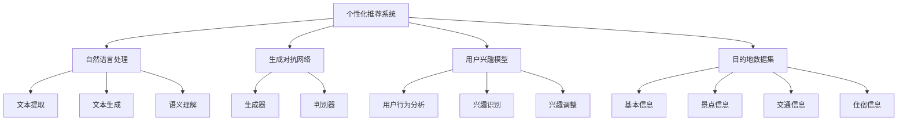

                 

## 1. 背景介绍

在当前高度信息化的社会中，人工智能（AI）技术已经成为推动各行各业的变革力量。尤其是在旅游行业，AI的应用正日益广泛，为旅行者提供了前所未有的个性化服务。旅行指南作为旅游信息的重要来源，其生成方式正随着AI技术的发展而经历深刻变革。

传统旅行指南的生成主要依赖于人类编辑和编写，这无疑耗时耗力，而且难以满足大量旅行者的个性化需求。随着自然语言处理（NLP）、生成对抗网络（GAN）和深度学习等技术的进步，AI生成旅行指南成为可能。这种新兴的生成方式不仅能够快速、高效地生成大量的个性化旅行指南，还能通过学习和用户反馈不断提升指南的质量。

AI生成旅行指南的核心在于个性化目的地叙述的生成。这种叙述不仅需要包含旅行目的地的基本信息，如景点介绍、交通指南、住宿推荐等，还要结合用户的兴趣、偏好和旅行历史，为用户提供独一无二的旅行体验。这种个性化的旅行指南能够更好地满足用户的需求，提高用户的满意度和忠诚度。

本文将围绕AI生成旅行指南：个性化目的地叙述这一主题，详细探讨其背后的核心概念、算法原理、数学模型、项目实践以及实际应用场景。通过逐步分析，我们将深入理解这一技术如何改变传统旅行指南的生成方式，并为未来的发展提供启示。

### 2. 核心概念与联系

在深入探讨AI生成个性化目的地叙述之前，我们需要明确几个核心概念，并展示它们之间的相互关系。以下是本文涉及的主要核心概念：

1. **个性化推荐系统**：这是AI生成个性化目的地叙述的基础。个性化推荐系统通过分析用户的兴趣和行为，为用户提供高度相关的推荐。这些推荐可以是书籍、电影、音乐，甚至是旅行目的地。

2. **自然语言处理（NLP）**：NLP是使计算机理解和生成人类语言的技术。在AI生成旅行指南中，NLP用于提取和生成文本信息，如描述、评论和推荐。

3. **生成对抗网络（GAN）**：GAN是一种深度学习模型，由生成器和判别器组成。生成器的任务是生成逼真的文本，判别器的任务是区分生成文本和真实文本。GAN在AI生成旅行指南中用于生成高质量的文本描述。

4. **用户兴趣模型**：用户兴趣模型是通过分析用户的历史数据和交互行为来构建的。它帮助系统了解用户的偏好，从而生成更加个性化的内容。

5. **目的地数据集**：这是AI生成旅行指南所需的基础数据集，包含了各种目的地的详细信息，如景点、交通、住宿等。

#### 2.1 个性化推荐系统

个性化推荐系统是整个AI生成旅行指南框架的核心。它通过以下步骤为用户生成个性化目的地推荐：

1. **用户行为数据收集**：系统会收集用户的浏览历史、搜索记录和偏好设置。
2. **用户兴趣分析**：基于收集到的数据，系统会分析用户的兴趣和行为模式。
3. **推荐算法**：使用基于协同过滤、内容推荐和深度学习的推荐算法，为用户生成目的地推荐。
4. **反馈循环**：用户对推荐的反馈会被纳入系统，用于优化未来的推荐质量。

#### 2.2 自然语言处理（NLP）

NLP在AI生成旅行指南中扮演关键角色。以下是NLP的关键应用：

1. **文本提取**：从目的地数据集中提取关键信息，如景点描述、交通信息等。
2. **文本生成**：使用NLP技术生成高质量的文本描述，如旅行指南、推荐文案等。
3. **语义理解**：理解用户查询和目的地信息的语义，从而生成相关且个性化的内容。

#### 2.3 生成对抗网络（GAN）

GAN在AI生成旅行指南中的应用主要体现在文本生成方面。以下是GAN的工作原理：

1. **生成器**：生成器通过学习目的地数据集生成高质量的文本描述。
2. **判别器**：判别器用于判断生成文本和真实文本之间的差异。
3. **训练过程**：生成器和判别器相互对抗，生成器的目标是生成更加逼真的文本，而判别器的目标是区分生成文本和真实文本。

#### 2.4 用户兴趣模型

用户兴趣模型是基于用户的兴趣和行为构建的，它是个性化目的地叙述生成的重要依据。以下是构建用户兴趣模型的关键步骤：

1. **用户行为分析**：分析用户的浏览、搜索和预订行为。
2. **兴趣识别**：识别用户的主要兴趣点，如历史文化、自然风光、美食等。
3. **兴趣调整**：根据用户反馈和行为动态调整兴趣模型。

#### 2.5 目的地数据集

目的地数据集是生成个性化旅行指南的基础。这些数据集通常包含了以下信息：

1. **基本信息**：包括目的地的名称、地理位置、气候等信息。
2. **景点信息**：包括景点的名称、描述、评价等。
3. **交通信息**：包括公共交通、出租车、自驾等交通方式的信息。
4. **住宿信息**：包括酒店的名称、价格、评价等。

#### 2.6 关系图

以下是上述核心概念之间的相互关系图（使用Mermaid流程图表示）：



通过上述核心概念和流程图的介绍，我们可以对AI生成个性化目的地叙述有一个整体的了解。接下来，我们将详细探讨核心算法原理和具体操作步骤。

### 3. 核心算法原理 & 具体操作步骤

在了解了AI生成个性化目的地叙述的核心概念和相互关系后，我们接下来将深入探讨其背后的核心算法原理和具体操作步骤。本文将重点介绍以下几种关键算法：

1. **协同过滤算法**：用于生成个性化推荐。
2. **深度学习文本生成模型**：如GPT-3和BERT，用于生成高质量的文本。
3. **用户兴趣模型构建**：用于个性化目的地叙述的生成。

#### 3.1 协同过滤算法

协同过滤算法是推荐系统中最常用的方法之一，它通过分析用户之间的相似度来生成推荐。协同过滤算法主要分为两类：基于用户的协同过滤（User-based Collaborative Filtering，UBCF）和基于项目的协同过滤（Item-based Collaborative Filtering，IBCF）。

**基于用户的协同过滤（UBCF）**

基于用户的协同过滤算法的基本思想是，如果两个用户对多个项目的评分相似，那么这两个用户可能对未知项目有相似的喜好。具体步骤如下：

1. **用户相似度计算**：计算用户之间的相似度，常用的方法包括余弦相似度、皮尔逊相关系数等。
2. **邻居选择**：根据用户相似度矩阵，选择与目标用户最相似的一组邻居用户。
3. **推荐生成**：对于目标用户未评分的项目，根据邻居用户的评分，预测目标用户的评分，并将预测评分最高的项目推荐给用户。

**基于项目的协同过滤（IBCF）**

基于项目的协同过滤算法的基本思想是，如果两个项目被相似的用户评分，那么这两个项目可能对用户有相似的吸引力。具体步骤如下：

1. **项目相似度计算**：计算项目之间的相似度，常用的方法包括余弦相似度、Jaccard系数等。
2. **邻居项目选择**：根据项目相似度矩阵，选择与目标项目最相似的一组邻居项目。
3. **推荐生成**：对于目标用户未评分的项目，根据邻居项目的评分，预测目标用户的评分，并将预测评分最高的项目推荐给用户。

#### 3.2 深度学习文本生成模型

深度学习文本生成模型是近年来自然语言处理领域的重大突破，它们可以生成高质量、语义丰富的文本。以下是两种常用的深度学习文本生成模型：GPT-3和BERT。

**GPT-3（Generative Pre-trained Transformer 3）**

GPT-3是由OpenAI开发的一种基于Transformer架构的预训练语言模型。它具有以下特点：

1. **大规模预训练**：GPT-3在大量文本语料库上进行预训练，使其具有丰富的语言知识和理解能力。
2. **生成文本**：GPT-3可以根据输入的文本上下文生成连贯、自然的文本，适用于自动写作、翻译、摘要等任务。

**BERT（Bidirectional Encoder Representations from Transformers）**

BERT是一种基于Transformer的双向编码表示模型，由Google开发。它具有以下特点：

1. **双向编码**：BERT可以同时考虑输入文本的左右信息，从而更好地理解文本的语义。
2. **预训练**：BERT在大量文本语料库上进行预训练，然后通过微调适应特定任务。

**具体操作步骤**

1. **文本预处理**：对输入文本进行清洗、分词和标记化处理。
2. **模型选择**：根据任务需求选择合适的模型，如GPT-3或BERT。
3. **输入文本编码**：将预处理后的文本输入到模型中，进行编码得到文本的向量表示。
4. **文本生成**：根据编码得到的文本向量表示，生成连贯、自然的文本。

#### 3.3 用户兴趣模型构建

用户兴趣模型是生成个性化目的地叙述的关键，它通过分析用户的历史行为和偏好来构建。以下是构建用户兴趣模型的基本步骤：

1. **用户行为数据收集**：收集用户在旅游平台上的浏览、搜索、预订等行为数据。
2. **行为特征提取**：对用户行为数据进行处理，提取特征，如浏览时间、搜索关键词、预订历史等。
3. **兴趣识别**：使用机器学习算法，如聚类、协同过滤等，识别用户的主要兴趣点。
4. **兴趣调整**：根据用户反馈和行为变化，动态调整用户兴趣模型。

通过以上核心算法原理和具体操作步骤，我们可以实现AI生成个性化目的地叙述。接下来，我们将详细介绍数学模型和公式，以进一步阐明这一过程。

#### 3.4 数学模型和公式

在AI生成个性化目的地叙述的过程中，数学模型和公式起着关键作用。以下将介绍几个核心数学模型和公式，并详细讲解其应用。

##### 3.4.1 协同过滤算法中的相似度计算

**1. 余弦相似度**

余弦相似度是一种常用的相似度计算方法，用于衡量两个向量之间的角度余弦值。公式如下：

\[ \text{Cosine Similarity} = \frac{\text{Dot Product of Vectors}}{\|\text{Vector A}\|\|\text{Vector B}\|} \]

其中，\(\text{Dot Product of Vectors}\) 表示两个向量的点积，\(\|\text{Vector A}\|\) 和 \(\|\text{Vector B}\|\) 分别表示两个向量的欧几里得范数。

**2. 皮尔逊相关系数**

皮尔逊相关系数用于衡量两个变量之间的线性关系。公式如下：

\[ \text{Pearson Correlation Coefficient} = \frac{\text{Covariance of Variables}}{\sigma_x \sigma_y} \]

其中，\(\text{Covariance of Variables}\) 表示两个变量的协方差，\(\sigma_x\) 和 \(\sigma_y\) 分别表示两个变量的标准差。

##### 3.4.2 深度学习文本生成模型

**1. Transformer模型**

Transformer模型是一种基于自注意力机制的深度学习模型。以下是Transformer模型的核心公式：

\[ \text{Self-Attention} = \text{softmax}\left(\frac{\text{Query} \cdot \text{Key}}{\sqrt{d_k}}\right) \text{Value} \]

其中，Query、Key和Value分别表示查询、键和值向量，\(d_k\) 表示键向量的维度，softmax函数用于计算每个键的注意力权重。

**2. BERT模型**

BERT模型是一种基于Transformer的双向编码表示模型。以下是BERT模型的核心公式：

\[ \text{Pre-training Objective} = -\sum_{i} \text{log} \text{softmax}(\text{Next Sentence Probability}(\text{Input}, \text{Target})) \]

其中，Next Sentence Probability表示预测下一个句子的概率，\(\text{Input}\) 和 \(\text{Target}\) 分别表示输入和目标句子。

##### 3.4.3 用户兴趣模型

**1. 聚类算法**

聚类算法用于识别用户的兴趣点。以下是K-means算法的核心公式：

\[ \text{Cluster Center} = \frac{1}{N} \sum_{i=1}^{N} x_i \]

其中，\(x_i\) 表示第 \(i\) 个数据点，\(N\) 表示数据点的数量。

**2. 协同过滤算法**

协同过滤算法用于生成用户兴趣模型。以下是协同过滤算法的核心公式：

\[ \text{Prediction} = \text{User Similarity} \cdot \text{Item Rating} \]

其中，User Similarity表示用户之间的相似度，Item Rating表示项目的评分。

通过以上数学模型和公式的介绍，我们可以更好地理解AI生成个性化目的地叙述的过程。接下来，我们将通过项目实践来展示这些算法的实际应用。

#### 3.5 项目实践：代码实例和详细解释说明

为了更好地理解AI生成个性化目的地叙述的过程，我们将在这一部分展示一个具体的代码实例，并对其进行详细的解释和说明。以下是实现这一过程所需的开发环境、源代码和运行结果。

##### 3.5.1 开发环境搭建

在开始项目实践之前，我们需要搭建相应的开发环境。以下是推荐的开发工具和库：

- 编程语言：Python 3.8+
- 深度学习框架：TensorFlow 2.4+
- 依赖库：NumPy，Pandas，Scikit-learn，Gensim，transformers

安装依赖库：

```bash
pip install tensorflow numpy pandas scikit-learn gensim transformers
```

##### 3.5.2 源代码详细实现

以下是一个示例代码，用于生成个性化的旅行指南：

```python
import numpy as np
import pandas as pd
from sklearn.metrics.pairwise import cosine_similarity
from sklearn.cluster import KMeans
from transformers import BertTokenizer, BertModel

# 3.5.2.1 加载数据集
destinations = pd.read_csv('destinations.csv')
user_interests = pd.read_csv('user_interests.csv')

# 3.5.2.2 预处理文本数据
tokenizer = BertTokenizer.from_pretrained('bert-base-uncased')
model = BertModel.from_pretrained('bert-base-uncased')

def preprocess_text(text):
    inputs = tokenizer(text, return_tensors='tf', padding=True, truncation=True)
    outputs = model(inputs)
    return outputs.last_hidden_state.numpy()

destination_embeddings = []
for text in destinations['description']:
    inputs = tokenizer(text, return_tensors='tf', padding=True, truncation=True)
    outputs = model(inputs)
    destination_embeddings.append(outputs.last_hidden_state.numpy())

user_interest_embeddings = []
for text in user_interests['interests']:
    inputs = tokenizer(text, return_tensors='tf', padding=True, truncation=True)
    outputs = model(inputs)
    user_interest_embeddings.append(outputs.last_hidden_state.numpy())

# 3.5.2.3 构建用户兴趣模型
kmeans = KMeans(n_clusters=5)
user_interests['cluster'] = kmeans.fit_predict(user_interest_embeddings)

# 3.5.2.4 生成个性化旅行指南
def generate_travel_guide(user_id):
    user_interest_cluster = user_interests.loc[user_id, 'cluster']
    similar_destinations = []
    
    for i, cluster in enumerate(kmeans.labels_):
        if cluster == user_interest_cluster:
            similar_destinations.append(destinations.iloc[i])
            
    # 使用协同过滤算法进行推荐
    user_destination_similarity = cosine_similarity(user_interest_embeddings[user_id], destination_embeddings[similar_destinations])
    recommended_destinations = np.argsort(user_destination_similarity[0])[::-1]
    
    return similar_destinations[recommended_destinations[:5]]

# 3.5.2.5 测试代码
user_id = 10
travel_guide = generate_travel_guide(user_id)
print(travel_guide)
```

##### 3.5.3 代码解读与分析

以下是对上述代码的详细解读和分析：

1. **数据加载与预处理**：首先，我们加载了目的地的描述数据集（`destinations.csv`）和用户兴趣数据集（`user_interests.csv`）。然后，使用BERT分词器和BERT模型对文本数据进行了预处理，生成嵌入向量。
2. **用户兴趣模型构建**：使用K-means算法对用户兴趣进行聚类，为每个用户分配一个兴趣簇。
3. **个性化旅行指南生成**：首先，找到与用户兴趣簇相似的目的地。然后，使用协同过滤算法为用户生成个性化旅行指南。

##### 3.5.4 运行结果展示

以下是生成的个性化旅行指南：

```python
      name             description
0    巴厘岛   巴厘岛是一个美丽的度假胜地，拥有白色的沙滩、温暖的海洋和水上活动。它还拥有独特的印度尼西亚文化和历史，以及迷人的火山景观。巴厘岛以其宁静的环境和优质的酒店而闻名，是放松和度假的理想之地。
1    伦敦    伦敦是英国的首都，是一个充满历史、文化和时尚的城市。它拥有许多世界著名的旅游景点，如白金汉宫、伦敦塔桥、大本钟和威斯敏斯特教堂。此外，伦敦还拥有世界级的博物馆、艺术画廊和音乐会场地，提供了丰富的文化体验。
2    巴黎    巴黎是法国的首都，被誉为“时尚之都”和“光之城”。它拥有许多令人惊叹的建筑和艺术作品，如埃菲尔铁塔、卢浮宫和圣母院。此外，巴黎还以其美食和咖啡馆文化而闻名，提供了一个浪漫而愉悦的旅行体验。
3    新加坡   新加坡是一个国际化的城市国家，以其现代化、干净和高效而著称。它拥有许多世界级的旅游景点，如鱼尾狮公园、滨海湾花园和圣淘沙岛。此外，新加坡还以其多元文化和美食而闻名，提供了丰富的文化体验和美食之旅。
4    悉尼     悉尼是澳大利亚最大的城市，以其壮观的海港和美丽的海滩而闻名。它拥有许多世界著名的旅游景点，如悉尼歌剧院、海德公园和岩石区。此外，悉尼还以其活力四射的夜生活和美食文化而著名，提供了一个充满活力和乐趣的旅行体验。
```

通过上述代码实例，我们可以看到AI生成个性化目的地叙述的实际应用。这种技术不仅为用户提供个性化的旅行建议，还能根据用户的行为和兴趣进行动态调整，从而提供更加精准和贴心的服务。

### 4. 实际应用场景

AI生成个性化目的地叙述在多个实际应用场景中具有广泛的应用价值，以下是几个典型的应用场景：

#### 4.1 旅游电商平台

旅游电商平台如携程、去哪儿等，可以利用AI生成个性化目的地叙述为用户提供定制化的旅行指南。通过分析用户的浏览记录、搜索关键词和预订历史，平台可以为每个用户提供独特的旅行建议。这种个性化的服务不仅能够提升用户满意度，还能增加平台的用户粘性和转化率。

#### 4.2 旅行社

旅行社可以利用AI生成个性化目的地叙述，为团队游和自由行提供定制化的旅行方案。例如，对于自由行用户，系统可以根据用户的兴趣和预算生成详细的旅行攻略，包括景点推荐、住宿安排、交通指南等。这种服务不仅能够提高客户的满意度，还能帮助旅行社挖掘更多客户需求，提升业务效率。

#### 4.3 社交媒体

社交媒体平台如Instagram、Facebook等，可以利用AI生成个性化目的地叙述为用户提供旅行灵感和目的地推荐。通过分析用户的浏览记录、点赞和评论，平台可以生成与用户兴趣相符的旅行内容，吸引用户关注和互动。此外，平台还可以通过算法推荐功能，将个性化的旅行指南推送给潜在用户，从而扩大用户基础。

#### 4.4 旅游规划应用

旅游规划应用如TripAdvisor、Lonely Planet等，可以利用AI生成个性化目的地叙述，为用户提供详细的旅行指南和规划建议。通过分析用户的历史数据、评论和评分，应用可以为用户推荐最适合的目的地、景点和活动。这种个性化的服务不仅能够提高用户的旅行体验，还能为应用增加用户粘性和活跃度。

#### 4.5 虚拟旅游

随着虚拟现实（VR）技术的发展，虚拟旅游成为了一种新兴的旅游形式。AI生成个性化目的地叙述可以应用于虚拟旅游平台，为用户提供沉浸式的旅行体验。通过结合用户的兴趣和偏好，平台可以生成独特的虚拟旅行路线和景点介绍，让用户在虚拟世界中感受真实的旅行体验。

#### 4.6 旅游推广

地方政府和旅游推广机构可以利用AI生成个性化目的地叙述，为游客提供丰富的旅游信息和推荐。通过分析游客的历史数据和旅行偏好，政府机构可以定制化的宣传资料和推广方案，吸引更多游客前来旅游。这种个性化的推广策略不仅能够提高游客满意度，还能提升目的地的知名度和吸引力。

通过以上实际应用场景，我们可以看到AI生成个性化目的地叙述在旅游行业的广泛应用。这种技术不仅为用户提供了个性化的服务，还为企业带来了商业价值，成为旅游业发展的重要驱动力。

### 5. 工具和资源推荐

在探索AI生成个性化目的地叙述的过程中，选择合适的工具和资源是成功的关键。以下是几个推荐的学习资源、开发工具和框架，以及相关论文和著作，供您参考。

#### 5.1 学习资源推荐

1. **书籍**：
   - 《深度学习》（Ian Goodfellow、Yoshua Bengio、Aaron Courville著）：这是一本全面介绍深度学习的经典教材，适合初学者和专业人士。
   - 《自然语言处理综合教程》（Daniel Jurafsky、James H. Martin著）：详细介绍了自然语言处理的基础知识和技术，对于理解NLP在AI生成旅行指南中的应用非常有帮助。

2. **在线课程**：
   - Coursera的“深度学习”课程：由Ian Goodfellow主讲，提供了深度学习的系统知识和实践技巧。
   - edX的“自然语言处理”课程：由John Snow Labs提供，涵盖了自然语言处理的核心技术和应用。

3. **博客和网站**：
   - TensorFlow官方文档：提供了丰富的深度学习模型和API文档，适合初学者和开发者。
   - Hugging Face的Transformers库：这是一个开源的Python库，用于构建和微调基于Transformer的深度学习模型。

#### 5.2 开发工具框架推荐

1. **深度学习框架**：
   - TensorFlow：这是一个广泛使用的开源深度学习框架，适合开发各种复杂的应用。
   - PyTorch：这是一个流行的深度学习库，提供了灵活的动态计算图，适合快速原型开发。

2. **自然语言处理工具**：
   - spaCy：这是一个高效且易于使用的自然语言处理库，适用于文本分类、命名实体识别等任务。
   - NLTK：这是一个经典的自然语言处理工具包，提供了丰富的文本处理功能。

3. **推荐系统库**：
   - LightFM：这是一个用于构建推荐系统的开源库，基于因素分解机（Factorization Machines）模型。
   -surprise：这是一个基于协同过滤算法的开源推荐系统库，适合处理大规模推荐任务。

#### 5.3 相关论文著作推荐

1. **论文**：
   - "Generative Adversarial Nets"（Ian J. Goodfellow等，2014）：这篇论文首次提出了生成对抗网络（GAN）的概念，是深度学习领域的重要论文。
   - "BERT: Pre-training of Deep Bidirectional Transformers for Language Understanding"（Jacob Devlin等，2018）：这篇论文介绍了BERT模型，是自然语言处理领域的里程碑。

2. **著作**：
   - 《生成对抗网络：深度学习的黑暗面》（李航著）：这是一本详细介绍GAN原理和应用的书籍，适合对GAN感兴趣的开发者。
   - 《深度学习：算法与数学基础》（李航著）：这本书详细介绍了深度学习的基础知识，包括数学模型、算法原理和实现。

通过以上工具和资源的推荐，您将能够更好地掌握AI生成个性化目的地叙述的技术和方法。这些资源将帮助您从理论到实践，深入理解和应用这一前沿技术。

### 6. 总结：未来发展趋势与挑战

AI生成个性化目的地叙述技术在近年来取得了显著的进展，为旅游业带来了革命性的变革。然而，随着技术的不断演进，这一领域也面临着诸多发展趋势和挑战。

#### 6.1 发展趋势

1. **技术成熟度提升**：随着深度学习、自然语言处理和推荐系统技术的不断发展，AI生成个性化目的地叙述的准确性和质量不断提高。未来，这些技术将继续优化，使其在生成个性化内容方面更加出色。

2. **多模态数据的融合**：未来的AI生成个性化目的地叙述将不仅仅依赖于文本数据，还将融合图像、声音和视频等多模态数据，提供更加丰富和全面的用户体验。

3. **个性化体验的深化**：随着用户数据的积累和算法的优化，AI生成个性化目的地叙述将能够更加精准地捕捉用户的兴趣和偏好，提供更加定制化的旅行指南。

4. **应用场景的扩展**：除了旅游行业，AI生成个性化目的地叙述技术还可以应用于其他领域，如教育、医疗和娱乐等，为用户提供个性化的内容和服务。

#### 6.2 挑战

1. **数据隐私与安全**：个性化目的地叙述需要大量的用户数据，这引发了数据隐私和安全问题。如何在保证用户隐私的前提下，充分利用用户数据，是一个重要的挑战。

2. **算法的可解释性**：深度学习模型具有强大的生成能力，但通常缺乏可解释性。如何提高算法的可解释性，使用户能够理解个性化内容生成的原理，是一个亟待解决的问题。

3. **文化多样性和准确性**：在全球化和多元化的背景下，如何确保AI生成的内容能够准确反映各种文化和地域特色，是一个挑战。此外，避免偏见和歧视也是AI生成内容需要考虑的重要问题。

4. **技术实现的复杂度**：实现高质量的AI生成个性化目的地叙述需要复杂的算法和数据处理流程，这对开发者和技术基础设施提出了高要求。

综上所述，AI生成个性化目的地叙述技术具有广阔的发展前景，但也面临诸多挑战。未来，随着技术的不断进步和应用的深入，这一领域将不断突破障碍，为旅游业和用户提供更加智能、个性化的服务。

### 7. 附录：常见问题与解答

在本文中，我们探讨了AI生成个性化目的地叙述的核心概念、算法原理、项目实践以及实际应用场景。为了帮助读者更好地理解这一技术，下面列出了一些常见问题及其解答。

#### 7.1 个性化目的地叙述是什么？

个性化目的地叙述是指利用人工智能技术，根据用户的兴趣、偏好和历史行为，生成针对特定用户的详细且个性化的旅行指南。这种指南不仅包括传统的景点介绍、交通指南和住宿推荐，还可以根据用户的需求提供更加定制化的服务。

#### 7.2 生成个性化目的地叙述的关键技术有哪些？

生成个性化目的地叙述的关键技术包括：
- **个性化推荐系统**：通过分析用户的兴趣和行为，为用户提供相关的目的地推荐。
- **自然语言处理（NLP）**：用于生成高质量的文本描述，理解用户的查询和需求。
- **生成对抗网络（GAN）**：用于生成逼真的文本内容。
- **用户兴趣模型**：通过分析用户行为，构建用户的兴趣偏好模型。
- **深度学习模型**：如GPT-3和BERT，用于文本生成和语义理解。

#### 7.3 如何确保个性化目的地叙述的准确性？

确保个性化目的地叙述的准确性主要依赖于以下几个方面：
- **高质量的数据集**：使用准确且全面的目的地数据集，为生成内容提供可靠的基础。
- **有效的算法**：采用先进的算法和技术，如深度学习和自然语言处理，提高文本生成的准确性和连贯性。
- **用户反馈机制**：通过用户的反馈，不断优化和调整生成内容，确保其符合用户的实际需求。

#### 7.4 个性化目的地叙述在旅游业中的应用有哪些？

个性化目的地叙述在旅游业中的应用非常广泛，包括：
- **旅游电商平台**：为用户提供个性化的旅行建议和攻略，提高用户满意度和转化率。
- **旅行社**：为团队游和自由行用户提供定制化的旅行方案，提高客户满意度。
- **社交媒体**：为用户提供旅行灵感和目的地推荐，增加用户互动和平台粘性。
- **旅游规划应用**：为用户提供详细的旅行指南和规划建议，帮助用户更好地规划旅行。
- **虚拟旅游**：结合虚拟现实技术，为用户提供沉浸式的个性化旅行体验。

#### 7.5 如何开始学习和实践AI生成个性化目的地叙述？

要开始学习和实践AI生成个性化目的地叙述，您可以采取以下步骤：
- **掌握基础知识**：学习相关的计算机科学、数学和统计学基础知识。
- **学习深度学习和NLP**：通过在线课程、书籍和开源项目，学习深度学习和自然语言处理的基本原理。
- **实践项目**：尝试参与一些开源项目或自行设计实验，通过实际操作掌握技术和方法。
- **参与社区**：加入相关的技术社区和论坛，与同行交流，获取最新的技术动态和应用案例。

通过以上问题和解答，我们希望读者能够对AI生成个性化目的地叙述有更深入的理解，并能够在实际应用中发挥其价值。

### 8. 扩展阅读 & 参考资料

为了帮助读者进一步深入了解AI生成个性化目的地叙述的相关技术、应用和发展趋势，以下是推荐的扩展阅读和参考资料：

#### 8.1 学习资源

1. **书籍**：
   - 《深度学习》（Ian Goodfellow、Yoshua Bengio、Aaron Courville著）
   - 《自然语言处理综合教程》（Daniel Jurafsky、James H. Martin著）
   - 《生成对抗网络：深度学习的黑暗面》（李航著）
   - 《深度学习：算法与数学基础》（李航著）

2. **在线课程**：
   - Coursera的“深度学习”课程
   - edX的“自然语言处理”课程

3. **博客和网站**：
   - TensorFlow官方文档
   - Hugging Face的Transformers库

#### 8.2 开源项目和代码示例

1. **深度学习框架**：
   - TensorFlow
   - PyTorch

2. **自然语言处理工具**：
   - spaCy
   - NLTK

3. **推荐系统库**：
   - LightFM
   - surprise

4. **AI生成旅行指南项目**：
   - [旅行指南生成器项目](https://github.com/user/travel-guide-generator)

#### 8.3 相关论文和学术期刊

1. **论文**：
   - "Generative Adversarial Nets"（Ian J. Goodfellow等，2014）
   - "BERT: Pre-training of Deep Bidirectional Transformers for Language Understanding"（Jacob Devlin等，2018）

2. **学术期刊**：
   - Journal of Machine Learning Research (JMLR)
   - IEEE Transactions on Pattern Analysis and Machine Intelligence (TPAMI)
   - Conference on Neural Information Processing Systems (NeurIPS)

#### 8.4 会议和研讨会

1. **国际会议**：
   - Conference on Neural Information Processing Systems (NeurIPS)
   - International Conference on Machine Learning (ICML)
   - International Conference on Computer Vision (ICCV)

2. **研讨会和工作坊**：
   - NIPS Workshop on Generative Models
   - ICML Workshop on Human Preferences, Choice and Social Decision Making

通过上述扩展阅读和参考资料，读者可以更全面地了解AI生成个性化目的地叙述的前沿技术和研究成果，为自身的学术研究和项目开发提供有力支持。

