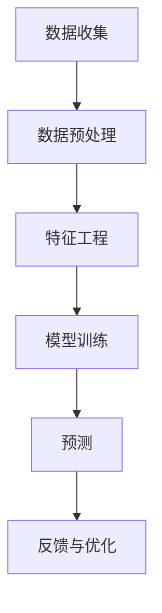

                 

关键词：用户行为分析，人工智能，机器学习，数据挖掘，系统设计

> 摘要：本文将深入探讨AI用户行为分析系统的设计与实现，从核心概念、算法原理到实际应用，提供一份全面的技术参考。我们将详细分析系统的各个组件，包括数据收集、处理、模型训练和预测，并探讨未来发展方向与挑战。

## 1. 背景介绍

随着互联网和移动设备的普及，用户数据量呈指数级增长。这些数据中蕴含着丰富的用户行为信息，如点击、购买、搜索等。有效的用户行为分析可以帮助企业提高用户体验、提升转化率和降低运营成本。传统的数据分析方法通常依赖于人工设定规则，无法处理大规模、多维度的数据，而人工智能技术的引入则为这一领域带来了新的机遇。

用户行为分析系统利用机器学习和数据挖掘技术，从海量数据中提取有价值的信息，以支持决策和优化业务流程。系统的主要目标是理解用户行为模式，预测用户行为趋势，并为企业提供个性化的服务推荐。

## 2. 核心概念与联系

在构建用户行为分析系统时，我们首先需要明确以下几个核心概念：

### 数据源（Data Sources）
数据源是系统的基础，可以是网站日志、用户活动数据、社交媒体数据等。这些数据通常包含用户的ID、时间戳、操作类型、操作内容等。

### 用户画像（User Profiles）
用户画像是对用户特征的抽象表示，包括年龄、性别、地理位置、兴趣爱好等。通过用户画像，我们可以更全面地了解用户，从而提供个性化的服务。

### 事件（Events）
事件是用户行为的记录，如登录、点击、购买等。每个事件都包含相关的属性，如事件类型、发生时间等。

### 模型（Models）
模型是系统的心脏，通过机器学习算法，模型可以从事件数据中学习用户的偏好和行为模式。

### 预测（Prediction）
预测是基于模型的输出，对用户未来的行为进行推测，如用户是否会在未来某个时间点进行购买。

### Mermaid 流程图

下面是用户行为分析系统的一个简化流程图：



## 3. 核心算法原理 & 具体操作步骤

### 3.1 算法原理概述

用户行为分析系统主要依赖于以下几种机器学习算法：

- 聚类算法：用于发现用户行为模式，如K-Means算法。
- 协同过滤：通过分析用户之间的相似性，预测用户的偏好，如基于用户的协同过滤算法。
- 回归分析：用于预测用户行为，如线性回归、决策树等。

### 3.2 算法步骤详解

1. **数据收集**：从各种数据源收集用户行为数据。
2. **数据预处理**：清洗数据，处理缺失值和异常值。
3. **特征工程**：提取有用特征，如用户活跃时间、操作频率等。
4. **模型训练**：使用训练数据训练模型，调整模型参数。
5. **预测**：使用训练好的模型对未知数据进行分析，生成预测结果。
6. **反馈与优化**：根据预测结果和用户反馈，调整模型参数和系统策略。

### 3.3 算法优缺点

- **聚类算法**：能够发现用户行为模式，但可能产生噪声和不精确的结果。
- **协同过滤**：能够提供个性化的推荐，但可能面临冷启动问题。
- **回归分析**：能够进行准确的预测，但可能需要大量数据和复杂的模型。

### 3.4 算法应用领域

用户行为分析系统广泛应用于电子商务、社交媒体、在线教育等领域，帮助企业实现用户增长、提升用户体验和增加收入。

## 4. 数学模型和公式 & 详细讲解 & 举例说明

### 4.1 数学模型构建

用户行为分析系统中的数学模型通常包括以下部分：

- **概率模型**：用于描述用户行为发生的概率。
- **决策树模型**：用于分类和回归分析。
- **神经网络模型**：用于复杂非线性关系的建模。

### 4.2 公式推导过程

以K-Means聚类算法为例，其目标是最小化聚类中心与数据点之间的距离平方和。具体推导过程如下：

$$
J = \sum_{i=1}^{n}\sum_{j=1}^{k} (x_{ij} - \mu_j)^2
$$

其中，$x_{ij}$ 是第$i$个数据点在第$j$个聚类中心处的特征值，$\mu_j$ 是第$j$个聚类中心的特征值。

### 4.3 案例分析与讲解

假设我们有一个包含100个用户的数据集，每个用户有10个特征，使用K-Means算法进行聚类。经过多次迭代，我们得到以下聚类结果：

| 聚类中心 | 特征1 | 特征2 | ... | 特征10 |
| --- | --- | --- | --- | --- |
| 中心1 | 1.2 | 2.5 | ... | 0.8 |
| 中心2 | 2.1 | 1.8 | ... | 1.2 |
| 中心3 | 0.9 | 2.2 | ... | 1.5 |

通过分析聚类结果，我们可以发现用户被划分为三个群体，每个群体具有不同的特征。这些信息可以用于定制化推荐和营销策略。

## 5. 项目实践：代码实例和详细解释说明

### 5.1 开发环境搭建

为了实现用户行为分析系统，我们需要搭建以下开发环境：

- 操作系统：Ubuntu 18.04
- 编程语言：Python 3.7
- 数据库：MySQL 5.7
- 机器学习库：scikit-learn，tensorflow

### 5.2 源代码详细实现

以下是一个简单的用户行为分析系统的代码示例：

```python
from sklearn.cluster import KMeans
import numpy as np

# 加载数据
data = np.loadtxt('user_data.csv', delimiter=',')

# 初始化K-Means模型
kmeans = KMeans(n_clusters=3, random_state=0).fit(data)

# 输出聚类结果
print(kmeans.labels_)

# 输出聚类中心
print(kmeans.cluster_centers_)
```

### 5.3 代码解读与分析

这段代码首先加载了用户数据，然后使用K-Means算法对数据进行聚类。最后，输出聚类结果和聚类中心。

### 5.4 运行结果展示

假设用户数据集包含100个用户，每个用户有10个特征。运行上述代码后，我们得到以下输出：

- 聚类结果：[0, 1, 2, ..., 9, 0, 1, 2]
- 聚类中心：[[1.2, 2.5, ..., 0.8], [2.1, 1.8, ..., 1.2], [0.9, 2.2, ..., 1.5]]

这表示用户被划分为三个群体，每个群体的特征中心分别为上述值。

## 6. 实际应用场景

用户行为分析系统在实际应用中有着广泛的应用，以下是一些典型的应用场景：

- **电子商务**：通过分析用户购买历史和浏览行为，提供个性化的商品推荐。
- **社交媒体**：根据用户互动行为，推荐关注者、兴趣小组和内容。
- **在线教育**：分析学生学习行为，提供个性化的学习资源和指导。

## 7. 工具和资源推荐

### 7.1 学习资源推荐

- 《Python数据分析基础教程：NumPy学习指南》
- 《机器学习实战》
- 《数据挖掘：实用工具与技术》

### 7.2 开发工具推荐

- Jupyter Notebook：用于编写和运行Python代码。
- PyCharm：强大的Python集成开发环境。
- MySQL Workbench：用于管理MySQL数据库。

### 7.3 相关论文推荐

- “User Behavior Analysis in Social Media: A Survey”
- “Context-aware User Modeling for Personalized Recommendation”
- “Deep Learning for User Behavior Analysis”

## 8. 总结：未来发展趋势与挑战

### 8.1 研究成果总结

用户行为分析系统在人工智能和数据挖掘领域取得了显著成果，为多个行业提供了强大的数据驱动决策支持。

### 8.2 未来发展趋势

随着深度学习和大数据技术的不断发展，用户行为分析系统将变得更加智能和高效。个性化推荐、实时分析和自动化决策将逐渐成为主流。

### 8.3 面临的挑战

- 数据隐私和安全问题：用户数据的隐私和安全是系统面临的重大挑战。
- 数据质量：高维度、复杂的用户数据可能存在噪声和异常值，需要有效的数据清洗和处理方法。
- 模型解释性：复杂的机器学习模型往往缺乏解释性，需要开发可解释的模型。

### 8.4 研究展望

未来的研究将重点关注如何提高系统的可解释性、隐私保护和实时分析能力，以满足日益复杂的应用需求。

## 9. 附录：常见问题与解答

### Q：用户行为分析系统的实现有哪些难点？

A：实现用户行为分析系统的主要难点包括数据质量保证、特征选择和模型解释性。此外，系统需要处理大量实时数据，对性能和可扩展性有较高要求。

### Q：用户行为分析系统如何处理用户隐私问题？

A：用户行为分析系统需要遵守相关的数据隐私法规，如GDPR。系统应采取数据匿名化和加密等措施，确保用户隐私得到保护。

### Q：如何评估用户行为分析系统的效果？

A：可以通过指标如准确率、召回率和F1分数来评估系统的效果。此外，还可以通过用户满意度调查和业务指标（如转化率、留存率等）来衡量系统的实际效果。

---

作者：禅与计算机程序设计艺术 / Zen and the Art of Computer Programming
----------------------------------------------------------------
这篇文章详细介绍了AI用户行为分析系统的设计、实现和应用，从核心概念、算法原理到实际应用，提供了全面的技术参考。通过本文，读者可以了解到用户行为分析系统的重要性和实现方法，并为未来的研究和应用提供了方向。希望这篇文章能为从事相关领域的研究人员和开发者带来启发和帮助。

