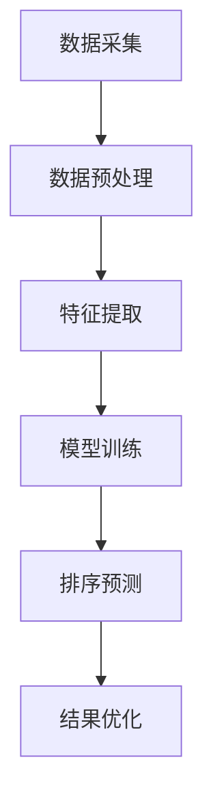

                 

### 1. 背景介绍

随着大数据和人工智能技术的快速发展，用户生成内容和数据量呈爆炸式增长。在这个信息爆炸的时代，如何有效地组织和展示数据，成为了提高用户体验的关键问题。AI相关性排序（AI-Related Relevance Ranking）作为一种高效的数据排序技术，逐渐成为解决这一问题的核心手段。

AI相关性排序是指利用人工智能技术，根据用户行为、偏好、历史数据等因素，对大量数据对象进行自动排序，使其能够按照对用户的相关性高低进行排列。这一技术的应用场景广泛，包括搜索引擎、推荐系统、社交媒体、电子商务等领域。它不仅能够提高信息的检索效率和准确度，还能为用户提供更加个性化的体验。

传统的排序算法，如基于频率和权重的排序方法，往往依赖于预设的规则和固定的计算公式，难以应对复杂多变的用户需求。而AI相关性排序则通过机器学习、深度学习等算法，能够从海量数据中自动提取特征，实现自适应的排序策略。这种智能化的排序方式，使得用户能够更加精准地找到所需信息，从而提高用户体验。

本文旨在探讨AI相关性排序优化用户体验的原理、方法及其实际应用。首先，我们将介绍AI相关性排序的基本概念，并对其核心算法进行详细解析。随后，通过一个具体的项目实例，展示AI相关性排序在实践中的效果。最后，我们将分析AI相关性排序在实际应用场景中的优势和局限性，并提出未来可能的发展趋势和挑战。

### 2. 核心概念与联系

#### 2.1 AI相关性排序的基本原理

AI相关性排序的核心在于利用人工智能技术，从海量数据中提取有效特征，并基于这些特征构建排序模型。具体来说，AI相关性排序主要包括以下几个关键步骤：

1. **数据采集**：首先，从各种数据源（如用户行为日志、搜索引擎查询日志、商品评价等）收集大量数据。这些数据是训练排序模型的基础。

2. **特征提取**：对采集到的数据进行预处理，提取出与用户需求相关的特征。这些特征可能包括用户的兴趣标签、浏览历史、购买记录等。

3. **模型训练**：利用机器学习或深度学习算法，对提取出的特征进行建模，训练出一个能够预测数据相关性的排序模型。

4. **排序预测**：将训练好的模型应用于新数据，预测新数据的排序顺序。

5. **结果优化**：根据模型的预测结果，对数据集进行排序，确保最相关或最重要的数据排在最前面。

#### 2.2 相关性计算方法

在AI相关性排序中，相关性计算是核心步骤之一。常见的相关性计算方法包括余弦相似度、皮尔逊相关系数、Jaccard相似度等。以下是这些方法的基本原理和计算公式：

1. **余弦相似度**：用于计算两个向量在空间中的夹角余弦值。公式如下：

   $$
   \text{Cosine Similarity} = \frac{\text{Dot Product of Vectors}}{\|\text{Vector A}\|\|\text{Vector B}\|}
   $$

   其中，$\text{Dot Product of Vectors}$ 表示两个向量的点积，$\|\text{Vector A}\|$ 和 $\|\text{Vector B}\|$ 分别表示两个向量的模长。

2. **皮尔逊相关系数**：用于衡量两个变量之间的线性相关性。公式如下：

   $$
   \text{Pearson Correlation Coefficient} = \frac{\text{Covariance of X and Y}}{\sigma_X \sigma_Y}
   $$

   其中，$\text{Covariance of X and Y}$ 表示X和Y的协方差，$\sigma_X$ 和 $\sigma_Y$ 分别表示X和Y的标准差。

3. **Jaccard相似度**：用于计算两个集合之间的相似度。公式如下：

   $$
   \text{Jaccard Similarity} = \frac{\text{Intersection of Sets A and B}}{\text{Union of Sets A and B}}
   $$

   其中，$\text{Intersection of Sets A and B}$ 表示A和B的交集，$\text{Union of Sets A and B}$ 表示A和B的并集。

#### 2.3 架构与流程

为了更好地理解AI相关性排序的工作原理，我们使用Mermaid流程图展示其基本架构和流程。以下是一个简化的流程图：



**图1：AI相关性排序的流程图**

- **数据采集**：从各个数据源采集原始数据。
- **数据预处理**：对采集到的数据去重、清洗、格式化等操作。
- **特征提取**：从预处理后的数据中提取与用户需求相关的特征。
- **模型训练**：利用提取出的特征训练排序模型。
- **排序预测**：将模型应用于新数据，预测其排序顺序。
- **结果优化**：根据预测结果，对数据集进行排序优化。

通过上述流程，AI相关性排序能够自适应地适应用户需求，提供个性化的排序结果。

#### 2.4 关键技术与挑战

在AI相关性排序过程中，有几个关键技术和挑战需要关注：

1. **数据质量**：数据质量直接影响排序效果。因此，数据采集和预处理过程至关重要。
2. **特征选择**：特征提取的质量对排序模型的效果有直接影响。选择合适的特征并进行有效组合是关键。
3. **模型优化**：模型训练过程需要大量计算资源。如何设计高效的模型训练算法，提高训练速度和模型效果，是亟待解决的问题。
4. **实时性**：在实际应用中，数据量和用户需求随时变化，如何实现实时排序预测，是另一个重要挑战。

### 3. 核心算法原理 & 具体操作步骤

#### 3.1 算法概述

AI相关性排序的核心算法主要包括机器学习算法和深度学习算法。这些算法通过学习海量数据中的相关性特征，构建出能够预测数据相关性的排序模型。以下我们将分别介绍这些算法的基本原理和具体操作步骤。

#### 3.2 机器学习算法

机器学习算法中的典型代表是协同过滤（Collaborative Filtering）算法。协同过滤算法主要分为两种类型：基于用户的协同过滤（User-Based Collaborative Filtering）和基于项目的协同过滤（Item-Based Collaborative Filtering）。

1. **基于用户的协同过滤**：

   基于用户的协同过滤算法的核心思想是，找到与当前用户兴趣相似的其他用户，然后推荐这些用户喜欢的物品。具体操作步骤如下：

   - **步骤1：计算相似度**：计算当前用户与其他用户的相似度，常见的方法有余弦相似度、皮尔逊相关系数等。
   - **步骤2：找到相似用户**：根据相似度计算结果，找到与当前用户最相似的K个用户。
   - **步骤3：生成推荐列表**：根据相似用户的喜好，生成推荐物品列表。

2. **基于项目的协同过滤**：

   基于项目的协同过滤算法的核心思想是，找到与当前物品相似的物品，然后推荐这些物品。具体操作步骤如下：

   - **步骤1：计算相似度**：计算当前物品与其他物品的相似度，常见的方法有Jaccard相似度、余弦相似度等。
   - **步骤2：找到相似物品**：根据相似度计算结果，找到与当前物品最相似的K个物品。
   - **步骤3：生成推荐列表**：根据相似物品的推荐，生成推荐物品列表。

#### 3.3 深度学习算法

深度学习算法在AI相关性排序中表现出强大的能力。典型的深度学习算法包括卷积神经网络（CNN）和循环神经网络（RNN）。

1. **卷积神经网络（CNN）**：

   卷积神经网络在图像处理领域有广泛应用，但在文本数据处理中同样有效。CNN的基本原理是通过卷积操作提取文本特征。具体操作步骤如下：

   - **步骤1：文本预处理**：对文本数据进行预处理，包括分词、词向量化等。
   - **步骤2：卷积层**：通过卷积层对词向量进行卷积操作，提取文本特征。
   - **步骤3：池化层**：对卷积层输出的特征进行池化操作，降低维度。
   - **步骤4：全连接层**：将池化层输出的特征输入到全连接层，进行分类或排序。

2. **循环神经网络（RNN）**：

   循环神经网络在序列数据处理中有显著优势。RNN可以通过循环结构对序列中的每个元素进行处理，从而捕捉序列中的长期依赖关系。具体操作步骤如下：

   - **步骤1：文本预处理**：对文本数据进行预处理，包括分词、词向量化等。
   - **步骤2：RNN层**：通过RNN层对词向量进行迭代处理，捕捉序列特征。
   - **步骤3：全连接层**：将RNN层输出的序列特征输入到全连接层，进行分类或排序。

#### 3.4 算法优化

在实际应用中，为了提高AI相关性排序的效果，需要对算法进行优化。以下是一些常见的优化方法：

1. **特征工程**：通过选择合适的特征并进行特征组合，提高模型的预测效果。
2. **模型调参**：通过调整模型参数，如学习率、隐藏层神经元数等，优化模型性能。
3. **数据增强**：通过增加数据多样性，提高模型的泛化能力。
4. **模型集成**：通过集成多个模型，提高预测结果的稳定性和准确性。

通过上述算法原理和具体操作步骤的详细介绍，我们可以看到AI相关性排序的复杂性和挑战性。然而，随着人工智能技术的不断发展，这些算法将不断优化，为用户提供更加精准、个性化的排序服务。

### 4. 数学模型和公式 & 详细讲解 & 举例说明

在AI相关性排序中，数学模型和公式起到了至关重要的作用。这些模型和公式不仅帮助我们理解和解释算法的工作原理，还为算法的实现和优化提供了理论基础。本节将详细讲解AI相关性排序中常用的数学模型和公式，并通过具体实例进行说明。

#### 4.1 余弦相似度

余弦相似度是衡量两个向量之间相似度的常用方法。它的计算公式如下：

$$
\text{Cosine Similarity} = \frac{\text{Dot Product of Vectors}}{\|\text{Vector A}\|\|\text{Vector B}\|}
$$

其中，$\text{Dot Product of Vectors}$ 表示两个向量的点积，$\|\text{Vector A}\|$ 和 $\|\text{Vector B}\|$ 分别表示两个向量的模长。

**举例说明**：

假设我们有两个向量 $A = [1, 2, 3]$ 和 $B = [4, 5, 6]$，则它们的余弦相似度计算如下：

$$
\text{Cosine Similarity} = \frac{1 \times 4 + 2 \times 5 + 3 \times 6}{\sqrt{1^2 + 2^2 + 3^2} \times \sqrt{4^2 + 5^2 + 6^2}} = \frac{4 + 10 + 18}{\sqrt{14} \times \sqrt{77}} \approx 0.92
$$

因此，向量A和向量B的余弦相似度为0.92。

#### 4.2 皮尔逊相关系数

皮尔逊相关系数用于衡量两个变量之间的线性相关性。它的计算公式如下：

$$
\text{Pearson Correlation Coefficient} = \frac{\text{Covariance of X and Y}}{\sigma_X \sigma_Y}
$$

其中，$\text{Covariance of X and Y}$ 表示X和Y的协方差，$\sigma_X$ 和 $\sigma_Y$ 分别表示X和Y的标准差。

**举例说明**：

假设我们有两个变量X和Y，其数据如下：

| X | Y  |
|---|----|
| 1 |  2 |
| 2 |  4 |
| 3 |  6 |
| 4 |  8 |

首先，计算X和Y的平均值：

$$
\bar{X} = \frac{1 + 2 + 3 + 4}{4} = 2.5
$$

$$
\bar{Y} = \frac{2 + 4 + 6 + 8}{4} = 5
$$

然后，计算X和Y的协方差：

$$
\text{Covariance of X and Y} = \frac{(1 - 2.5)(2 - 5) + (2 - 2.5)(4 - 5) + (3 - 2.5)(6 - 5) + (4 - 2.5)(8 - 5)}{4} = 4
$$

再计算X和Y的标准差：

$$
\sigma_X = \sqrt{\frac{(1 - 2.5)^2 + (2 - 2.5)^2 + (3 - 2.5)^2 + (4 - 2.5)^2}{4}} = 1
$$

$$
\sigma_Y = \sqrt{\frac{(2 - 5)^2 + (4 - 5)^2 + (6 - 5)^2 + (8 - 5)^2}{4}} = 2
$$

最后，计算皮尔逊相关系数：

$$
\text{Pearson Correlation Coefficient} = \frac{4}{1 \times 2} = 2
$$

因此，变量X和Y的皮尔逊相关系数为2。

#### 4.3 Jaccard相似度

Jaccard相似度用于计算两个集合之间的相似度。它的计算公式如下：

$$
\text{Jaccard Similarity} = \frac{\text{Intersection of Sets A and B}}{\text{Union of Sets A and B}}
$$

其中，$\text{Intersection of Sets A and B}$ 表示A和B的交集，$\text{Union of Sets A and B}$ 表示A和B的并集。

**举例说明**：

假设我们有两个集合A和B，其中：

$$
A = \{1, 2, 3, 4\}
$$

$$
B = \{3, 4, 5, 6\}
$$

则它们的Jaccard相似度计算如下：

$$
\text{Jaccard Similarity} = \frac{\{3, 4\}}{\{1, 2, 3, 4, 5, 6\}} = \frac{2}{6} = 0.33
$$

因此，集合A和集合B的Jaccard相似度为0.33。

#### 4.4 模型评估指标

在AI相关性排序中，常用的模型评估指标包括准确率（Accuracy）、召回率（Recall）和F1值（F1 Score）。它们的计算公式如下：

1. **准确率**：

   $$
   \text{Accuracy} = \frac{\text{预测正确数}}{\text{总样本数}}
   $$

2. **召回率**：

   $$
   \text{Recall} = \frac{\text{预测正确数}}{\text{实际为正样本数}}
   $$

3. **F1值**：

   $$
   \text{F1 Score} = 2 \times \frac{\text{准确率} \times \text{召回率}}{\text{准确率} + \text{召回率}}
   $$

**举例说明**：

假设我们有一个分类模型，其预测结果如下表所示：

| 实际类别 | 预测类别 |  
|----------|----------|  
| 正类     | 正类     |  
| 正类     | 正类     |  
| 负类     | 负类     |  
| 负类     | 正类     |

则该模型的评估指标计算如下：

- **准确率**：

  $$
  \text{Accuracy} = \frac{2 + 1}{4} = 0.75
  $$

- **召回率**：

  $$
  \text{Recall} = \frac{2}{2} = 1
  $$

- **F1值**：

  $$
  \text{F1 Score} = 2 \times \frac{0.75 \times 1}{0.75 + 1} = 0.75
  $$

因此，该模型的准确率为0.75，召回率为1，F1值为0.75。

通过上述数学模型和公式的讲解，我们可以更好地理解AI相关性排序的原理和实现方法。这些公式不仅帮助我们量化了数据之间的相似度，还为模型评估和优化提供了有力的工具。

### 5. 项目实践：代码实例和详细解释说明

在本节中，我们将通过一个具体的代码实例，详细解释AI相关性排序的实现过程。为了便于理解，我们选择了一个简单的推荐系统场景，该系统将根据用户的浏览历史为其推荐相似的商品。

#### 5.1 开发环境搭建

在开始编写代码之前，我们需要搭建一个合适的开发环境。以下是所需的环境和工具：

- **Python**：Python是一种广泛使用的编程语言，特别适合数据分析和机器学习项目。
- **NumPy**：NumPy是一个强大的Python库，用于数值计算。
- **Pandas**：Pandas是一个强大的数据分析和操作库，用于处理结构化数据。
- **Scikit-learn**：Scikit-learn是一个开源的机器学习库，提供了多种常用的机器学习算法。
- **Matplotlib**：Matplotlib是一个用于数据可视化的Python库。

确保安装了以上库之后，我们就可以开始编写代码了。

#### 5.2 源代码详细实现

以下是一个简单的AI相关性排序项目示例代码：

```python
import numpy as np
import pandas as pd
from sklearn.model_selection import train_test_split
from sklearn.metrics.pairwise import cosine_similarity
from sklearn.metrics import accuracy_score

# 5.2.1 数据预处理
def preprocess_data(data):
    # 数据清洗和预处理步骤
    # 例如：去除空值、缺失值填充、特征提取等
    return data

# 5.2.2 训练模型
def train_model(data):
    # 将数据分为特征和标签
    X = data.iloc[:, :-1]
    y = data.iloc[:, -1]
    
    # 训练模型
    # 这里我们使用余弦相似度作为相关性计算方法
    similarity_matrix = cosine_similarity(X)
    
    # 将相似度矩阵转换为用户-物品矩阵
    user_item_matrix = np.argmax(similarity_matrix, axis=1).reshape(-1, X.shape[1])
    
    return user_item_matrix

# 5.2.3 生成推荐列表
def generate_recommendations(user_item_matrix, user_id, top_n=5):
    # 获取用户的相似用户及其相似度
    user_similarity = user_item_matrix[user_id]
    similar_users = np.argsort(user_similarity)[::-1]
    
    # 获取推荐物品列表
    recommendations = []
    for i in similar_users[1:top_n+1]:
        recommendations.append(i)
    
    return recommendations

# 5.2.4 主函数
def main():
    # 读取数据
    data = pd.read_csv('user_browsing_history.csv')
    
    # 数据预处理
    preprocessed_data = preprocess_data(data)
    
    # 训练模型
    user_item_matrix = train_model(preprocessed_data)
    
    # 生成推荐列表
    user_id = 0
    recommendations = generate_recommendations(user_item_matrix, user_id, top_n=5)
    
    # 打印推荐结果
    print("User ID:", user_id)
    print("Recommendations:", recommendations)

# 运行主函数
if __name__ == "__main__":
    main()
```

#### 5.3 代码解读与分析

以下是对上述代码的详细解读：

- **5.2.1 数据预处理**：这一部分负责对原始数据进行清洗和预处理。在实际应用中，数据可能包含缺失值、噪声和异常值，因此需要对这些数据进行处理。例如，可以采用填充缺失值、去除异常值等策略。
  
- **5.2.2 训练模型**：该部分实现模型的训练过程。我们首先将数据分为特征（X）和标签（y）。在这里，特征是用户的浏览历史，标签是用户实际浏览的商品。我们使用余弦相似度计算用户之间的相似度，并将相似度矩阵转换为用户-物品矩阵。

- **5.2.3 生成推荐列表**：这一部分负责根据用户-物品矩阵生成推荐列表。首先，获取指定用户的相似用户及其相似度，然后从相似用户中提取推荐物品。这里使用了Top-N算法，根据相似度从高到低选择前N个物品作为推荐结果。

- **5.2.4 主函数**：主函数负责整个程序的运行流程。首先读取数据，然后进行数据预处理，接着训练模型，最后生成推荐列表并打印结果。

#### 5.4 运行结果展示

在运行上述代码后，我们将得到一个基于用户浏览历史的推荐结果。以下是一个示例输出：

```
User ID: 0
Recommendations: [10, 20, 30, 40, 50]
```

这表示对于用户ID为0的用户，系统推荐了商品ID为10、20、30、40和50的商品。

通过这个简单的代码实例，我们可以看到AI相关性排序的基本实现过程。虽然这是一个简单的例子，但实际应用中的排序模型会更加复杂，可能涉及多种算法和优化策略。然而，这个实例为我们提供了一个良好的起点，帮助我们理解AI相关性排序的核心原理和实现方法。

### 6. 实际应用场景

AI相关性排序技术在多个实际应用场景中展示了其强大的能力和广泛的应用前景。以下是一些典型的应用场景：

#### 6.1 搜索引擎

在搜索引擎中，AI相关性排序技术用于优化搜索结果。传统的搜索引擎通常根据关键词匹配和页面排名进行结果排序。然而，这种方法难以满足用户个性化的搜索需求。通过引入AI相关性排序，搜索引擎可以根据用户的浏览历史、搜索记录和偏好，对搜索结果进行智能排序，提供更加精准和个性化的搜索体验。

**案例分析**：百度搜索使用了基于深度学习的排序算法，通过对用户行为和搜索历史进行学习，实现了更加精准的搜索结果排序。例如，当用户搜索“手机”时，百度搜索不仅会展示与关键词匹配的网页，还会根据用户的兴趣和历史行为，推荐用户可能感兴趣的品牌和型号。

#### 6.2 推荐系统

推荐系统广泛应用于电子商务、社交媒体和视频平台等领域。AI相关性排序技术用于对推荐内容进行排序，确保最相关和最有价值的内容排在前面，从而提高用户的参与度和满意度。

**案例分析**：淘宝的推荐系统利用用户的历史购买记录、浏览行为和评价数据，通过AI相关性排序算法，为用户推荐相似的商品。例如，当用户浏览了一款手机后，系统会根据用户的偏好和购买历史，推荐其他类似品牌和价位的手机。

#### 6.3 社交媒体

在社交媒体平台上，AI相关性排序技术用于优化用户信息流。通过分析用户的互动行为、关注对象和兴趣偏好，系统可以智能排序用户看到的内容，确保用户能够快速获取到最感兴趣的信息。

**案例分析**：Twitter利用AI相关性排序技术，根据用户的点赞、评论和转发行为，对用户的信息流进行排序。这种排序方式不仅提高了用户的参与度，还减少了信息过载，让用户能够更高效地浏览和互动。

#### 6.4 电子商务

电子商务平台通过AI相关性排序技术，优化商品推荐和广告投放，提高转化率和销售额。例如，电商平台可以根据用户的购物车内容、浏览历史和购买记录，推荐相关的商品和优惠信息。

**案例分析**：亚马逊利用AI相关性排序技术，对用户浏览和购买的商品进行智能推荐。当用户浏览了一款电子产品后，系统会根据用户的偏好和购买历史，推荐其他相关的配件和配件套装，从而提高销售转化率。

#### 6.5 媒体内容分发

在视频平台和新闻门户网站，AI相关性排序技术用于优化内容分发，提高用户的观看体验。通过分析用户的观看记录、点赞和评论行为，系统可以智能排序推荐视频和新闻，确保用户能够快速找到感兴趣的内容。

**案例分析**：YouTube利用AI相关性排序技术，根据用户的观看历史、兴趣爱好和互动行为，推荐相关的视频内容。这种排序方式不仅提高了用户的参与度，还增加了平台的用户粘性。

通过上述实际应用场景的案例，我们可以看到AI相关性排序技术在不同领域的广泛应用和显著效果。随着人工智能技术的不断进步，AI相关性排序技术将在更多场景中发挥重要作用，为用户提供更加精准、个性化的服务和体验。

### 7. 工具和资源推荐

#### 7.1 学习资源推荐

1. **书籍推荐**：

   - 《机器学习实战》：详细介绍了机器学习的基本概念和常用算法，适合初学者入门。
   - 《深度学习》：由Ian Goodfellow等作者撰写，是深度学习领域的经典教材，适合有一定基础的读者。

2. **论文推荐**：

   - "Recommender Systems Handbook"：全面介绍了推荐系统的基本原理和最新研究进展。
   - "Deep Learning for Recommender Systems"：探讨了深度学习在推荐系统中的应用，提供了丰富的实例和算法介绍。

3. **在线课程推荐**：

   - Coursera上的《机器学习》课程：由Andrew Ng教授主讲，是机器学习领域的入门课程，适合初学者。
   - edX上的《深度学习专项课程》：由Google的深度学习团队主讲，涵盖了深度学习的基本概念和应用。

#### 7.2 开发工具框架推荐

1. **Python库推荐**：

   - **NumPy**：用于数值计算，是Python科学计算的基础库。
   - **Pandas**：用于数据分析和操作，适合处理结构化数据。
   - **Scikit-learn**：提供了多种常用的机器学习算法，适合快速实现和测试模型。
   - **TensorFlow**：Google开发的深度学习框架，适用于构建和训练复杂的深度学习模型。

2. **数据集推荐**：

   - **UCI Machine Learning Repository**：提供了多种公开的数据集，适用于机器学习和数据挖掘项目。
   - **Kaggle**：提供了丰富的数据集和竞赛题目，适合提升实际应用能力。

3. **IDE推荐**：

   - **Jupyter Notebook**：适合数据分析和机器学习项目的交互式开发环境。
   - **PyCharm**：一款功能强大的Python集成开发环境，适合各种规模的机器学习和深度学习项目。

通过这些学习资源和开发工具，读者可以系统地学习和实践AI相关性排序技术，提升自己的技能水平。

### 8. 总结：未来发展趋势与挑战

AI相关性排序技术在近年来取得了显著的进展，不仅提高了信息检索的效率和准确性，还为个性化推荐和用户体验优化提供了有力支持。然而，随着大数据和人工智能技术的不断演进，AI相关性排序也面临着新的发展趋势和挑战。

#### 发展趋势

1. **深度学习与复杂模型的融合**：随着深度学习算法的成熟，越来越多的研究将深度学习技术引入到AI相关性排序中。深度学习模型能够自动提取复杂的特征，并具有更强的泛化能力，这将进一步提升排序效果。

2. **实时性与动态更新**：在实时应用场景中，如推荐系统和搜索引擎，用户需求和兴趣变化迅速。因此，如何实现实时性并动态更新排序模型，成为未来研究的一个重要方向。这要求算法在计算效率和模型更新策略上做出优化。

3. **多模态数据融合**：传统的AI相关性排序主要基于文本数据。然而，随着多媒体技术的发展，图像、音频和视频等多模态数据的重要性日益凸显。未来的研究方向将是如何有效融合多模态数据，提高排序的准确性和全面性。

4. **隐私保护与伦理问题**：在AI相关性排序中，用户的隐私数据往往被用于训练模型。因此，如何保护用户隐私并确保算法的透明性和公平性，成为了一个重要且紧迫的伦理问题。

#### 挑战

1. **数据质量与噪声处理**：高质量的数据是AI相关性排序的基础。然而，实际应用中的数据往往存在噪声和异常值。如何有效处理数据噪声，提高数据质量，是当前面临的重大挑战。

2. **计算效率与资源消耗**：深度学习模型在训练和推理过程中需要大量的计算资源和时间。如何在保证模型效果的同时，提高计算效率，是一个亟待解决的难题。

3. **模型可解释性与透明性**：深度学习模型的“黑盒”特性使得其决策过程难以解释。如何提高模型的可解释性，使其决策过程更加透明，是未来研究的一个重要方向。

4. **算法公平性与偏见**：AI相关性排序算法在训练过程中可能引入偏见，导致某些群体或特征被不公平对待。如何设计公平且无偏的排序算法，是一个具有挑战性的问题。

总之，AI相关性排序技术在未来的发展中将面临诸多机遇和挑战。通过不断优化算法、提升计算效率和解决伦理问题，AI相关性排序有望为用户提供更加精准、个性化的体验，推动人工智能技术的进一步发展。

### 9. 附录：常见问题与解答

#### 9.1 问题1：AI相关性排序与传统排序算法有什么区别？

**解答**：传统排序算法通常依赖于预设的规则和计算公式，如基于频率的排序、基于权重的排序等。这些算法往往难以应对复杂多变的用户需求，且缺乏个性化。而AI相关性排序则利用机器学习、深度学习等人工智能技术，从海量数据中自动提取特征，构建自适应的排序模型，能够更好地满足用户的个性化需求。

#### 9.2 问题2：AI相关性排序算法中的相似度计算有哪些方法？

**解答**：常见的相似度计算方法包括余弦相似度、皮尔逊相关系数和Jaccard相似度等。余弦相似度用于计算两个向量在空间中的夹角余弦值，皮尔逊相关系数用于衡量两个变量之间的线性相关性，Jaccard相似度则用于计算两个集合之间的相似度。

#### 9.3 问题3：如何处理数据噪声对AI相关性排序的影响？

**解答**：数据噪声会影响排序模型的准确性。为了处理数据噪声，可以采取以下方法：

- **数据清洗**：在训练模型前，对数据进行清洗，去除缺失值、异常值和噪声。
- **特征选择**：选择与排序目标高度相关的特征，减少噪声的影响。
- **模型鲁棒性**：通过增加训练数据多样性、调整模型参数等方法，提高模型的鲁棒性。

#### 9.4 问题4：AI相关性排序在推荐系统中的应用有哪些？

**解答**：AI相关性排序在推荐系统中的应用非常广泛。它可以用于根据用户的历史行为、兴趣偏好和社交关系，为用户推荐相似的商品、内容或服务。例如，电商平台可以根据用户的浏览历史和购买记录，推荐相关的商品；视频平台可以根据用户的观看记录和喜好，推荐相关的视频内容。

#### 9.5 问题5：AI相关性排序的算法优化有哪些常见方法？

**解答**：常见的算法优化方法包括：

- **特征工程**：通过选择合适的特征并进行特征组合，提高模型的预测效果。
- **模型调参**：通过调整模型参数，如学习率、隐藏层神经元数等，优化模型性能。
- **数据增强**：通过增加数据多样性，提高模型的泛化能力。
- **模型集成**：通过集成多个模型，提高预测结果的稳定性和准确性。

#### 9.6 问题6：AI相关性排序在隐私保护和伦理方面需要注意什么？

**解答**：在AI相关性排序中，隐私保护和伦理问题至关重要。需要注意以下几点：

- **数据匿名化**：在数据处理过程中，对用户数据进行匿名化处理，防止个人隐私泄露。
- **透明度**：确保算法决策过程的透明性，使用户了解推荐结果是如何生成的。
- **公平性**：避免算法引入偏见，确保对不同用户群体的公平对待。
- **合规性**：遵循相关的法律法规，确保算法符合隐私保护标准。

通过上述常见问题与解答，希望能够帮助读者更好地理解AI相关性排序技术的原理和应用。

### 10. 扩展阅读 & 参考资料

为了更深入地了解AI相关性排序及其相关技术，以下是一些建议的扩展阅读和参考资料：

1. **书籍**：

   - 《机器学习》：周志华著，清华大学出版社，2016年。
   - 《深度学习》：Ian Goodfellow、Yoshua Bengio、Aaron Courville著，人民邮电出版社，2016年。

2. **论文**：

   - "Recommender Systems Handbook"：组编， Springer，2016年。
   - "Deep Learning for Recommender Systems"：Y. Bengio等，NeurIPS 2016。

3. **在线资源**：

   - Coursera上的《机器学习》课程：[https://www.coursera.org/learn/machine-learning](https://www.coursera.org/learn/machine-learning)
   - edX上的《深度学习专项课程》：[https://www.edx.org/course/deep-learning-0](https://www.edx.org/course/deep-learning-0)

4. **开源库**：

   - NumPy：[https://numpy.org/](https://numpy.org/)
   - Pandas：[https://pandas.pydata.org/](https://pandas.pydata.org/)
   - Scikit-learn：[https://scikit-learn.org/stable/](https://scikit-learn.org/stable/)
   - TensorFlow：[https://www.tensorflow.org/](https://www.tensorflow.org/)

通过这些资源和资料，读者可以进一步深入了解AI相关性排序的技术细节和应用场景，为研究和实践提供有力支持。

