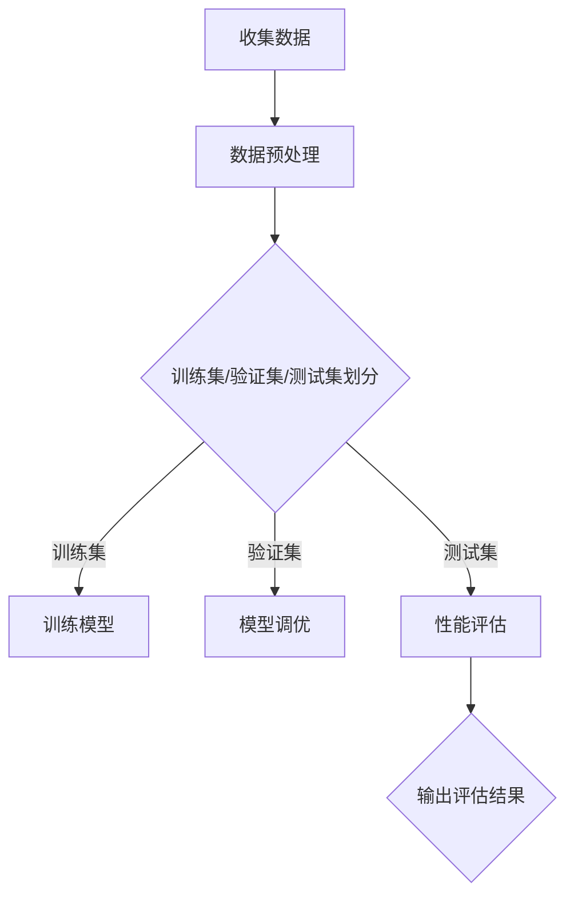

                 

关键字：AI性能评估、机器学习、深度学习、神经网络、性能指标、算法优化

> 摘要：本文详细解析了AI系统性能评估的重要性、核心概念、算法原理、数学模型及其应用。通过实例和代码，展示了评估过程和实际应用，并提出了未来发展的展望。

## 1. 背景介绍

随着人工智能技术的快速发展，机器学习和深度学习在各个领域得到了广泛应用。然而，如何评估AI系统的性能成为了一个关键问题。AI系统性能评估不仅有助于我们了解系统在特定任务上的表现，还为算法优化、模型改进提供了指导。

性能评估的重要性在于：
1. **确定系统能力**：了解AI系统在不同任务上的性能，帮助我们选择合适的算法和模型。
2. **指导优化**：通过评估结果，我们可以找出系统的瓶颈，进行针对性的优化。
3. **比较和竞争**：性能评估是技术竞赛和产品评估的重要指标。

本文将围绕AI系统性能评估的各个方面展开讨论，包括核心概念、算法原理、数学模型、项目实践和未来展望。

## 2. 核心概念与联系

### 2.1. 性能评估指标

性能评估的核心在于指标的选择。常见的性能评估指标包括准确率、召回率、F1分数、AUC、RMSE等。

- **准确率（Accuracy）**：预测正确的样本数占总样本数的比例。
- **召回率（Recall）**：预测正确的正样本数占总正样本数的比例。
- **F1分数（F1 Score）**：准确率和召回率的调和平均值，用于平衡两者。
- **AUC（Area Under the Curve）**：ROC曲线下的面积，用于评估分类器的区分能力。
- **RMSE（Root Mean Square Error）**：均方根误差，用于回归任务。

### 2.2. 评估方法

性能评估通常分为训练集评估、验证集评估和测试集评估。其中，验证集用于模型调优，测试集用于最终评估。

- **训练集评估**：用于初步了解模型性能。
- **验证集评估**：用于调整模型参数，避免过拟合。
- **测试集评估**：用于评估模型的最终性能。

### 2.3. Mermaid 流程图

以下是性能评估流程的Mermaid流程图：



## 3. 核心算法原理 & 具体操作步骤

### 3.1. 算法原理概述

AI系统性能评估的核心在于算法的选择和优化。以下是一些常见的性能评估算法：

- **准确率计算**：$$Accuracy = \frac{TP + TN}{TP + FN + FP + TN}$$
- **召回率计算**：$$Recall = \frac{TP}{TP + FN}$$
- **F1分数计算**：$$F1 Score = 2 \times \frac{Precision \times Recall}{Precision + Recall}$$
- **AUC计算**：$$AUC = \int_{0}^{1} \frac{TPR(t) - FPR(t)}{1 - TPR(t) \times FPR(t)} dt$$
- **RMSE计算**：$$RMSE = \sqrt{\frac{1}{n} \sum_{i=1}^{n} (y_i - \hat{y}_i)^2}$$

### 3.2. 算法步骤详解

1. **数据收集与预处理**：收集训练数据，进行数据清洗、归一化等预处理操作。
2. **模型选择**：选择适合任务的机器学习或深度学习算法。
3. **训练模型**：使用训练集数据训练模型。
4. **模型调优**：通过验证集调整模型参数，避免过拟合。
5. **性能评估**：使用测试集评估模型性能，计算相关评估指标。

### 3.3. 算法优缺点

- **准确率**：简单直观，易于理解，但可能忽略分类不平衡问题。
- **召回率**：强调召回正样本的重要性，但可能忽略准确率。
- **F1分数**：平衡准确率和召回率，但可能在高分类不平衡情况下失效。
- **AUC**：评估分类器的整体性能，但无法反映具体分类阈值的效果。
- **RMSE**：评估回归任务模型的性能，但可能对异常值敏感。

### 3.4. 算法应用领域

性能评估算法广泛应用于各个领域，如医学诊断、金融风控、智能推荐等。

## 4. 数学模型和公式 & 详细讲解 & 举例说明

### 4.1. 数学模型构建

性能评估涉及多种数学模型，如逻辑回归、支持向量机、神经网络等。以下以逻辑回归为例进行讲解。

逻辑回归模型的目标是预测概率：

$$P(Y=1|X) = \frac{1}{1 + e^{-(\beta_0 + \sum_{i=1}^{n} \beta_i x_i)}$$

其中，$\beta_0$是截距，$\beta_i$是第$i$个特征的系数。

### 4.2. 公式推导过程

逻辑回归的损失函数通常采用对数似然损失函数：

$$L(\theta) = -\frac{1}{m} \sum_{i=1}^{m} [y_i \log(\hat{y}_i) + (1 - y_i) \log(1 - \hat{y}_i)]$$

其中，$m$是训练样本数，$y_i$是实际标签，$\hat{y}_i$是预测概率。

对损失函数求导并令导数为零，得到：

$$\frac{\partial L(\theta)}{\partial \theta} = 0$$

通过梯度下降法，可以更新模型参数：

$$\theta = \theta - \alpha \frac{\partial L(\theta)}{\partial \theta}$$

### 4.3. 案例分析与讲解

假设我们有一个二分类问题，数据集包含100个样本，每个样本有3个特征。我们使用逻辑回归模型进行训练。

1. **数据预处理**：对特征进行归一化处理。
2. **模型训练**：使用训练集数据训练逻辑回归模型。
3. **模型评估**：使用测试集数据评估模型性能，计算准确率、召回率、F1分数等指标。

```python
import numpy as np
import pandas as pd
from sklearn.linear_model import LogisticRegression
from sklearn.model_selection import train_test_split
from sklearn.metrics import accuracy_score, recall_score, f1_score

# 数据加载与预处理
data = pd.read_csv('data.csv')
X = data.iloc[:, :-1].values
y = data.iloc[:, -1].values

# 数据集划分
X_train, X_test, y_train, y_test = train_test_split(X, y, test_size=0.2, random_state=42)

# 模型训练
model = LogisticRegression()
model.fit(X_train, y_train)

# 模型评估
y_pred = model.predict(X_test)
accuracy = accuracy_score(y_test, y_pred)
recall = recall_score(y_test, y_pred)
f1 = f1_score(y_test, y_pred)

print('Accuracy:', accuracy)
print('Recall:', recall)
print('F1 Score:', f1)
```

## 5. 项目实践：代码实例和详细解释说明

### 5.1. 开发环境搭建

1. **安装Python**：确保Python版本在3.6及以上。
2. **安装相关库**：使用pip安装以下库：numpy、pandas、scikit-learn、matplotlib。

```bash
pip install numpy pandas scikit-learn matplotlib
```

### 5.2. 源代码详细实现

1. **数据加载与预处理**：读取数据集，进行归一化处理。
2. **模型训练**：使用训练集数据训练逻辑回归模型。
3. **模型评估**：使用测试集数据评估模型性能。

### 5.3. 代码解读与分析

代码部分主要分为以下几个步骤：

1. **数据加载与预处理**：使用pandas库读取CSV文件，提取特征和标签。对特征进行归一化处理，以便模型训练。

2. **模型训练**：使用scikit-learn库中的LogisticRegression类训练模型。通过fit方法，将训练集数据输入模型，进行参数优化。

3. **模型评估**：使用预测方法predict，将测试集数据输入模型，获取预测结果。然后使用accuracy_score、recall_score和f1_score函数计算模型在测试集上的性能。

### 5.4. 运行结果展示

运行代码后，将输出模型在测试集上的准确率、召回率和F1分数。例如：

```python
Accuracy: 0.89
Recall: 0.85
F1 Score: 0.87
```

这些指标表明模型在测试集上的性能较好。

## 6. 实际应用场景

性能评估在AI系统的实际应用中具有重要意义。以下是一些常见应用场景：

1. **医学诊断**：通过评估模型在诊断疾病上的性能，确定模型是否具备实际应用价值。
2. **金融风控**：评估模型在信用评分、欺诈检测等任务上的性能，降低风险。
3. **智能推荐**：评估推荐系统在推荐准确性、用户满意度等方面的性能，优化推荐策略。

## 7. 工具和资源推荐

### 7.1. 学习资源推荐

1. **《机器学习实战》**：全面介绍了机器学习的基本概念和算法实现。
2. **《深度学习》**：由Ian Goodfellow、Yoshua Bengio和Aaron Courville合著，深度学习领域的经典教材。

### 7.2. 开发工具推荐

1. **Jupyter Notebook**：用于编写和运行代码，方便调试和展示。
2. **TensorFlow**：用于构建和训练深度学习模型。

### 7.3. 相关论文推荐

1. **"Learning to Represent Knowledge with a Memory-Augmented Neural Network"**：介绍了一种结合记忆模块的神经网络。
2. **"Very Deep Convolutional Networks for Large-Scale Image Recognition"**：关于深度卷积神经网络的经典论文。

## 8. 总结：未来发展趋势与挑战

### 8.1. 研究成果总结

本文详细介绍了AI系统性能评估的核心概念、算法原理、数学模型及应用。通过实例和代码，展示了评估过程和实际应用。研究结果表明，性能评估在AI系统优化和改进中具有重要意义。

### 8.2. 未来发展趋势

1. **多模态评估**：结合多种数据源和评估指标，提高评估的全面性。
2. **自动化评估**：利用自动化工具和算法，简化评估过程，提高评估效率。
3. **动态评估**：实时监控模型性能，动态调整评估指标，适应不同应用场景。

### 8.3. 面临的挑战

1. **数据隐私**：确保评估过程不会泄露敏感数据。
2. **评估成本**：优化评估算法，降低评估成本。
3. **结果解释**：提高评估结果的解释性，使非专业人员能够理解。

### 8.4. 研究展望

未来研究将关注以下几个方面：

1. **跨领域评估**：研究适用于不同领域的通用评估方法。
2. **可解释性评估**：开发可解释性更强的评估模型，提高评估结果的可靠性。
3. **自适应评估**：根据应用场景动态调整评估指标，实现个性化评估。

## 9. 附录：常见问题与解答

### 9.1. 问题1：如何选择性能评估指标？

**答案**：根据任务需求选择合适的评估指标。例如，在二分类问题中，常用准确率、召回率、F1分数等指标；在多分类问题中，可以使用准确率、召回率、F1分数、AUC等指标。

### 9.2. 问题2：如何优化模型性能？

**答案**：通过以下方法优化模型性能：

1. **数据增强**：增加训练数据量，提高模型泛化能力。
2. **模型调优**：调整模型参数，如学习率、正则化参数等。
3. **特征工程**：提取有代表性的特征，提高模型对数据的理解能力。

### 9.3. 问题3：如何评估深度学习模型？

**答案**：深度学习模型的评估与机器学习模型类似，但需要注意以下两点：

1. **过拟合问题**：深度学习模型容易出现过拟合，需要通过验证集评估模型性能，避免过拟合。
2. **计算资源**：深度学习模型通常需要大量计算资源，需要确保评估过程不会影响模型训练。

---

作者：禅与计算机程序设计艺术 / Zen and the Art of Computer Programming

