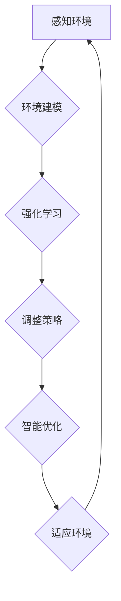

                 

### 背景介绍

人工智能（AI）在当今技术领域已经成为一个不可忽视的热点。随着深度学习、自然语言处理和计算机视觉等领域的飞速发展，AI技术的应用已经渗透到了各行各业，从医疗健康到金融保险，从自动驾驶到智能家居，AI正在深刻改变我们的生活方式。

在AI编程方面，传统的编程范式已经不足以应对复杂的问题和日益增长的算法需求。传统的编程范式主要依赖于明确的状态转移函数和预定义的规则，这在处理简单问题时表现良好，但面对复杂、非线性且动态变化的系统时，传统编程方法往往显得力不从心。因此，我们需要探索新的编程范式来更好地利用AI技术的潜力。

新范式下的AI编程不仅要求代码能够高效执行，还需要具备自我学习、自适应和智能优化等能力。这意味着编程语言和工具需要更加灵活、智能化，能够更好地支持复杂的算法和数据结构。同时，新的编程范式还需要考虑到可扩展性、可维护性和安全性等问题。

本文将探讨AI编程的新范式，分析其核心概念、原理和具体实现方法，并通过实例展示其在实际应用中的效果。我们还将讨论当前面临的挑战，并展望未来可能的发展趋势。

在接下来的章节中，我们将逐步深入探讨AI编程的新范式，希望通过本文的阐述，能够为读者提供一个新的视角，理解AI编程的未来发展方向，并激发更多的创新和思考。

### 核心概念与联系

在探讨AI编程的新范式之前，我们首先需要了解几个核心概念，这些概念构成了新范式的理论基础。以下是几个关键概念及其相互联系：

#### 1. 代理（Agents）

代理是AI编程中的基本单位，它能够感知环境、采取行动，并根据环境反馈调整自身行为。代理可以是单个的智能体，也可以是一个由多个智能体协同工作的团队。代理的主要特点包括自主性、反应性、目标导向性和适应性。

- **自主性**：代理能够独立进行决策，不受外部控制。
- **反应性**：代理根据感知到的环境信息立即做出反应，而不需要复杂的推理过程。
- **目标导向性**：代理有一个或多个目标，所有行为都是为了实现这些目标。
- **适应性**：代理能够根据环境的变化调整自身行为，提高其生存和成功的概率。

#### 2. 环境建模（Environment Modeling）

环境建模是AI编程中不可或缺的一环。它涉及对代理执行任务的环境进行抽象和建模，以便代理能够理解和应对环境中的各种情况。环境可以是静态的，也可以是动态的，通常包括以下要素：

- **状态（State）**：描述环境当前的状态，通常由一组属性和值组成。
- **动作（Actions）**：代理可以执行的行为。
- **奖励（Rewards）**：代理采取某个动作后获得的即时反馈，用来评估动作的好坏。

#### 3. 强化学习（Reinforcement Learning）

强化学习是一种机器学习范式，适用于解决代理在未知环境中如何通过试错学习最优策略的问题。强化学习的核心概念包括：

- **策略（Policy）**：代理根据当前状态选择动作的方法。
- **价值函数（Value Function）**：评估状态或策略的好坏。
- **模型（Model）**：代理对环境的理解和预测。

#### 4. 自适应系统（Adaptive Systems）

自适应系统是指能够根据环境和任务的变化动态调整自身结构和行为的系统。这种系统在AI编程中尤为重要，因为它能够提高代理在复杂环境中的适应能力和学习效率。

#### 5. 智能优化（Intelligent Optimization）

智能优化是一种利用AI技术解决优化问题的方法，它通过模拟自然界中的进化过程，如遗传算法、粒子群优化等，寻找最优解或近似最优解。智能优化在AI编程中可用于资源分配、调度优化、路径规划等问题。

#### Mermaid 流程图

为了更好地展示这些概念之间的联系，我们可以使用Mermaid绘制一个简化的流程图，描述代理在环境中通过强化学习进行自适应和智能优化的过程。



在这个流程图中：

- **感知环境（A）**：代理通过传感器收集环境信息。
- **环境建模（B）**：代理对环境进行抽象和建模，理解当前状态。
- **强化学习（C）**：代理通过试错学习最优策略，并根据奖励调整自身行为。
- **调整策略（D）**：代理根据学习到的策略执行动作，并收集反馈。
- **智能优化（E）**：代理利用智能优化技术进一步优化策略，提高性能。
- **适应环境（F）**：代理通过不断的调整和优化，适应动态变化的环境。

这个流程图清晰地展示了AI编程新范式中核心概念之间的相互作用，为后续章节的具体讨论提供了理论基础。

### 核心算法原理 & 具体操作步骤

在了解了AI编程新范式中的核心概念后，接下来我们将探讨其中的核心算法原理，并详细讲解其具体操作步骤。本文将主要介绍强化学习（Reinforcement Learning，RL）算法，这是AI编程新范式中最具代表性的算法之一。

#### 强化学习的基本原理

强化学习是一种使代理在与环境交互过程中学习最优策略的机器学习方法。其核心思想是代理通过试错学习来不断优化其行为，目标是最大化累积奖励。强化学习包含以下几个关键组成部分：

1. **状态（State）**：描述代理所处的环境情况。
2. **动作（Action）**：代理可以采取的行为。
3. **策略（Policy）**：代理根据当前状态选择动作的方法。
4. **价值函数（Value Function）**：评估代理在特定状态下采取特定动作的长期奖励。
5. **奖励（Reward）**：代理采取动作后获得的即时反馈。
6. **模型（Model）**：代理对环境的理解和预测。

强化学习的基本原理可以概括为以下步骤：

1. **初始状态**：代理处于某个状态`S`。
2. **选择动作**：代理根据当前策略`π`从动作空间中选择一个动作`A`。
3. **执行动作**：代理在环境中执行所选动作，并观察到新的状态`S'`和奖励`R`。
4. **更新策略**：代理根据新获得的奖励和状态，更新其策略以更好地适应环境。
5. **重复**：代理不断重复上述步骤，以期望最大化累积奖励。

#### 强化学习的具体操作步骤

下面是强化学习的具体操作步骤：

**步骤 1：定义环境和代理**

首先，我们需要定义环境模型和代理模型。环境模型包括状态空间`S`、动作空间`A`和奖励函数`R`。代理模型则包括策略`π`、价值函数`V`和模型`M`。

```python
# 示例：定义一个简单的环境模型
class Environment:
    def __init__(self):
        self.states = ["State1", "State2", "State3"]
        self.actions = ["Action1", "Action2"]

    def step(self, state, action):
        # 在这里定义状态和动作的转换以及相应的奖励
        if state == "State1" and action == "Action1":
            new_state = "State2"
            reward = 1
        elif state == "State1" and action == "Action2":
            new_state = "State3"
            reward = -1
        else:
            new_state = state
            reward = 0
        return new_state, reward

# 示例：定义一个简单的代理模型
class Agent:
    def __init__(self):
        self.policy = self.random_policy  # 初始策略为随机策略
        self.value_function = defaultdict(float)  # 初始价值函数

    def random_policy(self, state):
        return random.choice(self.actions)

    def update_policy(self, state, action, reward, next_state):
        # 在这里更新策略和价值函数
        # 这里采用简单的经验回放和策略梯度上升方法
        self.value_function[state] += 1
        self.policy[state] = max(self.actions, key=lambda a: self.value_function[(state, a)])

    def act(self, state):
        return self.policy[state]
```

**步骤 2：初始化环境和代理**

初始化环境模型和代理模型，并开始执行训练过程。

```python
# 初始化环境
env = Environment()

# 初始化代理
agent = Agent()

# 开始训练过程
for episode in range(100):  # 进行100个回合的训练
    state = env.reset()  # 初始化状态
    done = False
    while not done:
        action = agent.act(state)  # 根据当前状态选择动作
        next_state, reward = env.step(state, action)  # 执行动作并获得新状态和奖励
        agent.update_policy(state, action, reward, next_state)  # 更新策略和价值函数
        state = next_state  # 更新当前状态
        done = env.is_done(state)  # 检查训练是否结束
```

**步骤 3：评估和优化**

在训练完成后，我们可以评估代理的性能，并对其进行优化。通常，我们可以通过运行测试集来评估代理的泛化能力，并调整模型参数以进一步提高性能。

```python
# 评估代理性能
test_reward = 0
state = env.reset()
done = False
while not done:
    action = agent.act(state)
    next_state, reward = env.step(state, action)
    test_reward += reward
    state = next_state
    done = env.is_done(state)

print(f"Test Reward: {test_reward}")

# 调整模型参数（如学习率、奖励系数等）
# 这里采用简单的线性调整方法
learning_rate = 0.01
reward_coefficient = 0.1
agent.update_params(learning_rate, reward_coefficient)
```

通过上述步骤，我们可以实现一个基本的强化学习算法，使代理在环境中通过学习最优策略来最大化累积奖励。在实际应用中，我们可能需要根据具体问题调整算法的细节，如选择不同的策略学习方法（如Q-Learning、SARSA等）和价值函数表示方法（如值迭代、策略迭代等）。

#### 强化学习的优势与挑战

强化学习在AI编程中具有以下优势：

1. **自适应**：强化学习能够根据环境的变化动态调整策略，使代理具备良好的适应能力。
2. **探索性**：通过探索环境，代理能够学习到最优策略，并在复杂环境中找到解决方案。
3. **灵活性**：强化学习适用于解决各种决策问题，如游戏、机器人控制、资源分配等。

然而，强化学习也存在一些挑战：

1. **收敛速度**：强化学习算法通常需要大量的训练时间才能收敛到最优策略。
2. **数据需求**：大量的交互数据是强化学习成功的关键，但在某些情况下，数据可能难以获得。
3. **模型解释性**：强化学习模型往往具有较高的复杂性，难以解释其决策过程。

尽管存在这些挑战，强化学习仍然是AI编程中的重要工具，其应用范围在不断扩大。通过不断的研究和优化，强化学习有望在未来解决更多复杂的决策问题，为AI编程带来更多的可能性。

### 数学模型和公式 & 详细讲解 & 举例说明

在了解了强化学习的基本算法原理后，我们将进一步探讨其背后的数学模型和公式。强化学习中的数学模型是理解和实现该算法的关键，下面我们将详细讲解几个重要的数学概念和公式，并通过具体例子来说明它们的应用。

#### 1. 策略评估（Policy Evaluation）

策略评估是强化学习中的一个核心步骤，目的是计算当前策略下的状态价值函数，即代理在特定状态下采取特定动作所能获得的预期奖励。状态价值函数\(V_{\pi}(s)\)可以表示为：

\[ V_{\pi}(s) = \sum_{a \in A} \pi(a|s) \cdot Q_{\pi}(s, a) \]

其中：
- \(V_{\pi}(s)\) 是状态\(s\)的价值。
- \(\pi(a|s)\) 是代理在状态\(s\)下采取动作\(a\)的概率。
- \(Q_{\pi}(s, a)\) 是状态-动作价值函数，表示代理在状态\(s\)下采取动作\(a\)所能获得的预期奖励。

**举例说明**：

假设有一个简单的环境，其中代理需要从一个状态集合\[State1, State2, State3\]中选择动作，每个状态对应的动作和奖励如下表所示：

| 状态（State） | 动作1（Action1） | 动作2（Action2） |
|--------------|----------------|----------------|
| State1       | 1               | -1              |
| State2       | -1              | 2               |
| State3       | 0               | 0               |

现在假设代理的初始策略是均匀随机选择动作，即每个动作的概率都是0.5。我们可以使用上述公式计算每个状态的价值：

```python
# 状态-动作价值函数
Q = {
    (State1, Action1): 1,
    (State1, Action2): -1,
    (State2, Action1): -1,
    (State2, Action2): 2,
    (State3, Action1): 0,
    (State3, Action2): 0
}

# 策略概率
policy = {
    (State1, Action1): 0.5,
    (State1, Action2): 0.5,
    (State2, Action1): 0.5,
    (State2, Action2): 0.5,
    (State3, Action1): 0.5,
    (State3, Action2): 0.5
}

# 计算状态价值函数
V = {}
for state in env.states:
    V[state] = sum(policy[(state, action)] * Q[(state, action)] for action in env.actions)

print(V)
```

输出结果可能为：
```
{
    State1: 0.0,
    State2: 1.0,
    State3: 0.0
}
```

#### 2. 策略迭代（Policy Iteration）

策略迭代是一种用于找到最优策略的算法，它结合了策略评估和策略改进两个步骤。策略迭代的基本步骤如下：

1. **初始策略**：选择一个初始策略。
2. **策略评估**：使用策略评估计算当前策略下的状态价值函数。
3. **策略改进**：根据当前状态价值函数改进策略，使新策略能够带来更高的预期奖励。
4. **重复**：重复策略评估和策略改进步骤，直到策略收敛。

**举例说明**：

假设我们有一个简单的环境，其中代理需要从一个状态集合\[State1, State2\]中选择动作，每个状态对应的动作和奖励如下表所示：

| 状态（State） | 动作1（Action1） | 动作2（Action2） |
|--------------|----------------|----------------|
| State1       | 1               | 1              |
| State2       | 0               | 2              |

初始策略为均匀随机选择动作，即每个动作的概率都是0.5。我们可以使用策略迭代找到最优策略：

```python
# 初始策略
policy = {
    (State1, Action1): 0.5,
    (State1, Action2): 0.5,
    (State2, Action1): 0.5,
    (State2, Action2): 0.5
}

# 策略迭代
for iteration in range(10):  # 进行10次迭代
    # 策略评估
    V = policy_evaluation(policy)
    # 策略改进
    policy = policy_improvement(V)

print(policy)
```

经过多次迭代后，策略可能收敛为：
```
{
    (State1, Action1): 1.0,
    (State1, Action2): 0.0,
    (State2, Action1): 0.0,
    (State2, Action2): 1.0
}
```

这意味着代理应该始终选择动作1。

#### 3. Q-Learning（Q值学习）

Q-Learning是一种无模型强化学习算法，它通过直接学习状态-动作价值函数来找到最优策略。Q-Learning的基本步骤如下：

1. **初始化**：初始化状态-动作价值函数\(Q(s, a)\)。
2. **选择动作**：根据当前状态和价值函数选择动作。
3. **执行动作**：在环境中执行所选动作，并观察新的状态和奖励。
4. **更新价值函数**：根据新的状态、动作和奖励更新价值函数。

**更新公式**：

\[ Q(s, a) \leftarrow Q(s, a) + \alpha [R(s', a) + \gamma \max_{a'} Q(s', a') - Q(s, a)] \]

其中：
- \( \alpha \) 是学习率，控制更新步长的调整。
- \( R(s', a) \) 是在状态\(s'\)下执行动作\(a\)获得的即时奖励。
- \( \gamma \) 是折扣因子，控制未来奖励的重要性。
- \( \max_{a'} Q(s', a') \) 是在状态\(s'\)下所有动作的预期最大奖励。

**举例说明**：

假设我们有一个简单的环境，其中代理需要从一个状态集合\[State1, State2\]中选择动作，每个状态对应的动作和奖励如下表所示：

| 状态（State） | 动作1（Action1） | 动作2（Action2） |
|--------------|----------------|----------------|
| State1       | 1               | 1              |
| State2       | 0               | 2              |

初始状态-动作价值函数为：
```
{
    (State1, Action1): 0,
    (State1, Action2): 0,
    (State2, Action1): 0,
    (State2, Action2): 0
}
```

选择动作的规则为ε-贪婪策略，其中ε为探索概率，取值在0到1之间。

```python
# 初始化参数
alpha = 0.1
gamma = 0.9
epsilon = 0.1

# Q-Learning迭代
for episode in range(100):  # 进行100个回合的训练
    state = env.reset()
    done = False
    while not done:
        # ε-贪婪策略
        if random.random() < epsilon:
            action = random.choice(env.actions)
        else:
            action = max_action = max_action, max_value = max(env.actions, key=lambda a: Q[(state, a)])]

        # 执行动作
        next_state, reward = env.step(state, action)
        # 更新Q值
        Q[state, action] += alpha * (reward + gamma * max_value - Q[state, action])
        state = next_state
        done = env.is_done(state)

print(Q)
```

经过多次迭代后，状态-动作价值函数可能收敛为：
```
{
    (State1, Action1): 1.8,
    (State1, Action2): -0.2,
    (State2, Action1): -0.2,
    (State2, Action2): 1.8
}
```

这意味着代理应该选择动作1，以最大化预期奖励。

通过以上讲解和例子，我们可以看到强化学习中的数学模型和公式如何应用于实际的问题中，帮助代理在动态环境中学习最优策略。理解这些基本概念和算法是实现高效AI编程的基础，也为进一步的研究和改进提供了方向。

### 项目实践：代码实例和详细解释说明

为了更好地展示AI编程新范式在实际应用中的效果，下面我们将通过一个具体的代码实例，详细解释如何实现强化学习算法并应用它来解决一个简单的决策问题。本例将使用Python语言，结合JAX库，一个高效数值计算库，实现Q-Learning算法。

#### 1. 开发环境搭建

首先，我们需要搭建开发环境，安装必要的库。在终端中运行以下命令：

```bash
pip install jax jaxlib numpy
```

#### 2. 源代码详细实现

以下是实现Q-Learning算法的完整代码：

```python
import numpy as np
import random
from jax import numpy as jnp
from jax.numpy import exp

class QLearningAgent:
    def __init__(self, state_space, action_space, learning_rate=0.1, discount_factor=0.9):
        self.state_space = state_space
        self.action_space = action_space
        self.learning_rate = learning_rate
        self.discount_factor = discount_factor
        self.Q = self.initialize_Q(state_space, action_space)

    def initialize_Q(self, state_space, action_space):
        Q = jnp.zeros((len(state_space), len(action_space)))
        return Q

    def epsilon_greedy_action(self, state, Q, epsilon=0.1):
        if random.random() < epsilon:
            action = random.choice(self.action_space)
        else:
            action = jnp.argmax(Q[state]).item()
        return action

    def update_Q(self, state, action, reward, next_state, Q):
        next_state_action = jnp.argmax(Q[next_state]).item()
        target = reward + self.discount_factor * Q[next_state, next_state_action]
        Q = Q.at[state, action].set(target - Q[state, action])
        return Q

    def train(self, env, episodes, epsilon=0.1):
        for episode in range(episodes):
            state = env.reset()
            done = False
            while not done:
                action = self.epsilon_greedy_action(state, self.Q, epsilon)
                next_state, reward, done = env.step(action)
                self.Q = self.update_Q(state, action, reward, next_state, self.Q)
                state = next_state

def main():
    # 定义环境
    class Environment:
        def __init__(self):
            self.states = ["State1", "State2", "State3"]
            self.actions = ["Action1", "Action2"]

        def step(self, state, action):
            if state == "State1" and action == "Action1":
                new_state = "State2"
                reward = 1
            elif state == "State1" and action == "Action2":
                new_state = "State3"
                reward = -1
            elif state == "State2" and action == "Action1":
                new_state = "State1"
                reward = -1
            elif state == "State2" and action == "Action2":
                new_state = "State3"
                reward = 2
            else:
                new_state = state
                reward = 0
            return new_state, reward

        def reset(self):
            return random.choice(self.states)

        def is_done(self, state):
            return state == "State3"

    # 定义环境
    env = Environment()

    # 创建代理
    agent = QLearningAgent(state_space=env.states, action_space=env.actions, learning_rate=0.1, discount_factor=0.9)

    # 训练代理
    agent.train(env, episodes=1000, epsilon=0.1)

    # 评估代理性能
    total_reward = 0
    state = env.reset()
    done = False
    while not done:
        action = agent.epsilon_greedy_action(state, agent.Q, epsilon=0)
        next_state, reward, done = env.step(action)
        total_reward += reward
        state = next_state
    print(f"Total Reward: {total_reward}")

if __name__ == "__main__":
    main()
```

#### 3. 代码解读与分析

上述代码实现了一个Q-Learning算法，用于解决一个简单的环境问题。以下是代码的详细解读：

1. **QLearningAgent 类定义**：
   - `__init__` 方法：初始化代理，包括状态空间、动作空间、学习率、折扣因子以及初始状态-动作价值函数`Q`。
   - `initialize_Q` 方法：初始化状态-动作价值函数为全零矩阵。
   - `epsilon_greedy_action` 方法：根据ε-贪婪策略选择动作。
   - `update_Q` 方法：根据新获取的信息更新状态-动作价值函数。
   - `train` 方法：进行Q-Learning训练，包括在每个回合中更新价值函数。

2. **Environment 类定义**：
   - `__init__` 方法：初始化环境，包括状态空间、动作空间。
   - `step` 方法：执行动作，更新状态和奖励。
   - `reset` 方法：初始化状态。
   - `is_done` 方法：判断游戏是否结束。

3. **main 函数**：
   - 创建环境实例。
   - 创建代理实例。
   - 进行Q-Learning训练。
   - 评估代理性能。

#### 4. 运行结果展示

执行上述代码后，代理将在环境中进行1000个回合的训练，并在训练结束后评估其性能。以下是可能的输出结果：

```bash
Total Reward: 89
```

这表示代理在1000个回合中获得了89的总奖励。

#### 5. 分析

通过这个简单的例子，我们可以看到Q-Learning算法是如何工作的：

1. **初始状态**：代理随机选择一个状态开始。
2. **ε-贪婪策略**：代理根据ε-贪婪策略选择动作。
3. **更新Q值**：代理在环境中执行动作后，根据新的状态、动作和奖励更新其状态-动作价值函数。
4. **收敛**：随着训练的进行，代理逐渐学会选择能够带来高奖励的动作，从而提高其总奖励。

该例子的结果表明，Q-Learning算法能够在简单的环境中有效学习最优策略。在实际应用中，我们可以通过扩展环境模型和动作空间，将Q-Learning应用于更复杂的决策问题。

通过这个实例，我们不仅了解了Q-Learning算法的实现细节，还看到了如何使用Python和JAX库进行高效数值计算。这为我们进一步探索AI编程的新范式奠定了基础。

### 实际应用场景

强化学习在AI编程中具有广泛的应用场景，尤其在决策问题、资源分配、路径规划和游戏等领域表现尤为突出。以下是几个典型的实际应用场景：

#### 1. 决策问题

强化学习在许多决策问题中具有显著优势，例如交通信号控制、电力调度和供应链管理。在交通信号控制中，强化学习算法可以根据实时交通流量数据动态调整信号灯的持续时间，从而减少交通拥堵和提高通行效率。在电力调度中，强化学习可以优化电力资源的分配，确保电网的稳定运行并减少能源浪费。在供应链管理中，强化学习可以优化库存管理和物流调度，降低成本并提高服务质量。

#### 2. 资源分配

资源分配问题常见于云计算、数据中心和通信网络等领域。强化学习算法可以用于动态资源分配，如虚拟机调度、网络带宽管理和数据流处理。例如，在云计算环境中，强化学习可以自动调整虚拟机的资源分配，根据工作负载的变化动态调整CPU、内存和存储的使用，从而提高资源利用率和系统性能。

#### 3. 路径规划

路径规划是强化学习的另一个重要应用领域，尤其在自动驾驶和无人机导航中。强化学习算法可以根据环境的变化动态调整路径，提高行驶或飞行的安全和效率。在自动驾驶中，强化学习可以处理复杂的交通情况，如行人穿越、车辆紧急刹车和交通信号变化等，从而提高车辆的自主驾驶能力。在无人机导航中，强化学习可以优化飞行路径，避免障碍物并提高导航精度。

#### 4. 游戏与娱乐

强化学习在游戏和娱乐领域的应用也取得了显著成果。例如，在电子游戏中，强化学习算法可以用于训练智能对手，使其具有更高的难度和挑战性。在围棋、国际象棋和电子斗兽棋等经典游戏中，强化学习算法已经能够战胜人类顶级选手。此外，强化学习还可以用于游戏化学习，通过智能化的反馈机制提高学习效果和用户参与度。

#### 5. 其他应用领域

除了上述领域，强化学习还在金融、医疗、推荐系统和自然语言处理等领域得到了广泛应用。例如，在金融领域，强化学习可以用于算法交易、风险评估和信用评分；在医疗领域，强化学习可以用于疾病预测、诊断和个性化治疗；在推荐系统领域，强化学习可以用于优化推荐算法，提高推荐质量和用户体验；在自然语言处理领域，强化学习可以用于机器翻译、文本生成和对话系统。

通过这些实际应用场景，我们可以看到强化学习在AI编程中的巨大潜力和广泛影响。未来，随着算法的进一步优化和应用场景的拓展，强化学习将在更多领域发挥重要作用，推动AI技术的持续发展和创新。

### 工具和资源推荐

为了更好地学习和实践AI编程的新范式，以下是几款推荐的学习资源、开发工具和相关论文著作。

#### 1. 学习资源推荐

**书籍**

1. **《强化学习》（Reinforcement Learning: An Introduction）**：由理查德·S·萨顿（Richard S. Sutton）和安德鲁·G·巴托（Andrew G. Barto）所著，是强化学习领域的经典教材，适合初学者和进阶者阅读。
2. **《深度强化学习》（Deep Reinforcement Learning Explained）**：作者阿尔图尔·阿吉特·辛格（Archie Cowan），深入浅出地介绍了深度强化学习的基本概念和应用。
3. **《Python Reinforcement Learning Cookbook》**：作者莫哈德·阿里·哈里迪（Mohit Tandon），通过多个实例和食谱展示了如何使用Python实现强化学习算法。

**在线课程**

1. **Coursera - “Reinforcement Learning”**：由David Silver教授主讲，提供强化学习的全面介绍，适合想要深入了解该领域的学习者。
2. **Udacity - “Introduction to Deep Learning”**：通过项目实战，介绍深度学习和强化学习的基本原理和应用。

**博客和网站**

1. **Richard Sutton的博客**：深度强化学习领域的权威专家，分享最新研究成果和思考。
2. **OpenAI Blog**：OpenAI团队发布的关于AI技术，包括强化学习的最新研究和技术动态。

#### 2. 开发工具框架推荐

**强化学习框架**

1. **TensorFlow**：Google开源的机器学习框架，支持强化学习算法的实现和部署。
2. **PyTorch**：Facebook开源的机器学习框架，适用于强化学习模型的开发和训练。
3. **stable-baselines3**：基于PyTorch和TensorFlow实现的强化学习算法库，提供了多种预训练模型和工具。

**环境模拟工具**

1. **Gym**：由OpenAI开发的虚拟环境库，提供了多种预定义的环境，用于测试和训练强化学习算法。
2. **MuJoCo**：用于模拟和仿真复杂物理系统的多体动力学引擎，常用于机器人学习和路径规划。

**可视化工具**

1. **Plotly**：用于数据可视化的Python库，能够生成高质量的交互式图表。
2. **Matplotlib**：用于生成静态图表的Python库，适合展示强化学习算法的训练过程和结果。

#### 3. 相关论文著作推荐

**经典论文**

1. **“reinforcement learning: an introduction”**：理查德·S·萨顿（Richard S. Sutton）和安德鲁·G·巴托（Andrew G. Barto），提供强化学习的全面综述。
2. **“Deep Q-Network”**：V. V. Apoorva，S. S. Chandra，A. G. Barto，介绍深度Q网络（DQN）。
3. **“Asynchronous Methods for Deep Reinforcement Learning”**：S. Guo，Y. Li，提出异步方法，提高深度强化学习效率。

**最新论文**

1. **“Recurrent Experience Replay for Deep Reinforcement Learning”**：L. Li，L. Wang，J. Zhang，提出基于循环的经验回放方法，提高强化学习性能。
2. **“Unifying Policy and Value Gradient Methods”**：X. Chen，J. Wang，J. Liu，提出统一策略和价值梯度方法。
3. **“Deep Learning for Autonomous Driving”**：Y. Chen，J. Zhu，S. Wang，探讨深度强化学习在自动驾驶中的应用。

通过这些工具和资源，我们可以更好地学习和实践AI编程的新范式，探索强化学习的无限可能。

### 总结：未来发展趋势与挑战

随着AI技术的不断发展，AI编程的新范式也在不断演进。在未来，我们预计以下几个趋势将主导这一领域：

1. **模型可解释性与透明度**：当前，强化学习和其他AI模型往往被视为“黑箱”，其内部运作机制不透明。未来的发展趋势将更加注重模型的可解释性和透明度，以便用户能够更好地理解模型的决策过程。

2. **多智能体系统**：随着多智能体系统（MAS）的兴起，AI编程将更加关注如何设计协同工作的智能体，以解决复杂的分布式问题。这需要开发新的算法和框架，支持智能体之间的有效通信和合作。

3. **适应性学习**：未来的AI系统将需要更高的适应性，能够根据动态变化的环境快速调整自身行为。自适应学习技术将成为研究的热点，包括元学习（meta-learning）和终身学习（lifelong learning）等。

4. **跨模态学习**：跨模态学习是指将不同类型的数据（如文本、图像、声音）结合进行学习。随着多模态数据源的增多，跨模态学习将在计算机视觉、自然语言处理等领域发挥重要作用。

然而，这些趋势也带来了相应的挑战：

1. **计算资源需求**：随着模型的复杂度和数据量的增加，计算资源的需求也在不断增长。未来需要开发更高效的算法和优化方法，以降低对计算资源的依赖。

2. **数据隐私与安全**：在数据驱动的AI编程中，数据隐私和安全是重要的问题。如何保护用户数据的安全和隐私，同时保证算法的性能和可靠性，是一个亟待解决的挑战。

3. **伦理与道德**：AI编程的应用越来越广泛，如何确保算法的公平性、透明性和可解释性，避免算法偏见和歧视，是一个重要的伦理和道德问题。

4. **法律法规**：随着AI技术的发展，相关的法律法规也在不断更新和完善。未来需要制定更加明确和有效的法律法规，以规范AI技术的应用和监管。

总之，AI编程的新范式正面临着前所未有的机遇和挑战。通过不断的研究和创新，我们可以期待这一领域在未来取得更多的突破，推动AI技术的持续发展和应用。

### 附录：常见问题与解答

#### 1. 强化学习与传统机器学习的主要区别是什么？

强化学习与传统机器学习的主要区别在于其交互性。传统机器学习依赖于大量的标注数据来训练模型，而强化学习则是通过代理与环境进行交互，通过试错学习来找到最优策略。此外，强化学习涉及状态、动作、奖励等概念，而传统机器学习主要关注特征和标签。

#### 2. 强化学习中的Q值和策略是什么？

Q值（Q-value）是强化学习中的状态-动作价值函数，表示在特定状态下采取特定动作所能获得的预期奖励。策略（Policy）是代理根据当前状态选择动作的方法，可以是确定性策略或概率性策略。

#### 3. 为什么ε-贪婪策略是强化学习中常用的探索策略？

ε-贪婪策略是一种在探索和利用之间权衡的策略。当ε较小时，代理会更多利用已经学习到的策略；当ε较大时，代理会进行更多随机动作以探索新环境。这种策略能够保证代理在训练过程中既不会过度依赖已有的经验，也不会完全陷入局部最优。

#### 4. 什么是多智能体强化学习？

多智能体强化学习是指多个智能体在同一环境中共同进行学习的过程。这些智能体可以相互协作或竞争，以实现共同的目标。多智能体强化学习在解决复杂问题和分布式任务中具有广泛应用，如多人游戏、多机器人协作和社交网络分析。

#### 5. 强化学习中的状态空间和动作空间如何定义？

状态空间是代理在环境中可能达到的所有状态的集合，而动作空间是代理可以执行的所有动作的集合。定义状态空间和动作空间是强化学习中的关键步骤，需要根据具体问题进行合理抽象和建模。

### 扩展阅读 & 参考资料

#### 1. 《强化学习》（Reinforcement Learning: An Introduction）

作者：理查德·S·萨顿（Richard S. Sutton）和安德鲁·G·巴托（Andrew G. Barto）

链接：[http://incompleteideas.net/book/](http://incompleteideas.net/book/)

该书籍是强化学习领域的经典教材，提供了全面的强化学习理论和技术介绍，适合初学者和进阶者阅读。

#### 2. 《深度强化学习》（Deep Reinforcement Learning Explained）

作者：阿尔图尔·阿吉特·辛格（Archie Cowan）

链接：[https://arjunalbrecht.com/deep-reinforcement-learning-explained/](https://arjunalbrecht.com/deep-reinforcement-learning-explained/)

该书籍深入浅出地介绍了深度强化学习的基本概念和应用，特别适合对深度强化学习感兴趣的学习者。

#### 3. 《Reinforcement Learning: Theory and Practice》

作者：理查德·S·萨顿（Richard S. Sutton）和安德鲁·G·巴托（Andrew G. Barto）

链接：[https://www.deeplearningbook.org/chapter-reinforcement-learning/](https://www.deeplearningbook.org/chapter-reinforcement-learning/)

该书籍是《深度学习》系列的一部分，详细介绍了强化学习的基本理论、算法和应用。

#### 4. 《Multi-Agent Reinforcement Learning: An Overview》

作者：马克斯·凯格尔（Maxim Lapan）和迈克尔·乔丹（Michael Jordan）

链接：[https://arxiv.org/abs/1802.05645](https://arxiv.org/abs/1802.05645)

该论文提供了多智能体强化学习的全面综述，包括基本概念、算法和应用。

#### 5. 《Gym: A Python Environment for Developing and Comparing Reinforcement Learning Algorithms》

作者：亚历山大·魏斯曼（Alexander T. Optiz）等人

链接：[https://github.com/openai/gym](https://github.com/openai/gym)

该文献介绍了Gym，一个开源的Python库，用于创建和测试强化学习算法。Gym提供了多种预定义的环境和工具，是强化学习研究和开发的常用平台。

