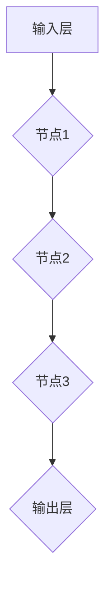
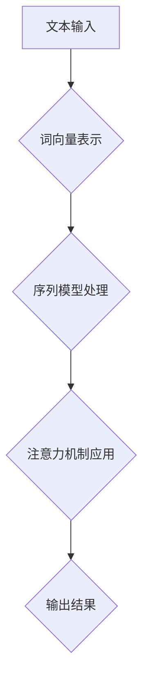
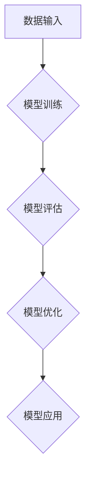
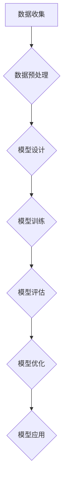

                 

# AI编程的新范式与挑战

## 关键词

- AI编程
- 编程范式
- 挑战
- 算法
- 深度学习
- 自然语言处理
- 机器学习

## 摘要

本文旨在探讨AI编程的新范式及其面临的挑战。随着人工智能技术的迅猛发展，编程范式也在不断演变。本文将首先介绍AI编程的基本概念和核心算法，然后深入分析其面临的挑战，并探讨未来的发展趋势。通过本文的阅读，读者将能够了解到AI编程的精髓，以及如何应对其带来的挑战。

## 1. 背景介绍

随着计算机科学和人工智能技术的飞速发展，编程范式正在经历着深刻的变革。传统编程强调的是逻辑和指令的执行，而AI编程则更加强调数据的处理和算法的优化。AI编程的核心在于通过构建复杂的模型和算法，使得计算机能够自主地学习和推理，从而实现智能化的任务处理。

AI编程的主要驱动力来自于深度学习、自然语言处理和机器学习等技术的发展。深度学习通过多层神经网络，实现了对复杂数据的自动特征提取和模式识别；自然语言处理使得计算机能够理解人类语言，实现人机交互；机器学习则通过数据驱动的方式，不断优化模型的性能。

这些技术的发展，为AI编程带来了前所未有的机遇。例如，自动驾驶技术、智能助手、医疗诊断等领域的应用，都需要AI编程的支持。然而，AI编程也面临着诸多挑战，需要我们在编程范式上进行深刻的思考和创新。

## 2. 核心概念与联系

### 2.1 深度学习

深度学习是AI编程的核心技术之一，其基本原理是通过构建多层神经网络，实现对复杂数据的自动特征提取和模式识别。深度学习的核心概念包括：

- **神经网络**：深度学习的基础是神经网络，它由一系列相互连接的节点（神经元）组成，每个节点都可以接受输入信号并产生输出。
- **激活函数**：激活函数是神经网络中的一个关键元素，它用于确定神经元是否被激活。
- **反向传播**：反向传播是一种用于训练神经网络的算法，它通过不断调整神经网络的权重，使得网络能够更好地拟合数据。

下面是一个简化的神经网络模型，用于展示其基本结构：



### 2.2 自然语言处理

自然语言处理（NLP）是AI编程的另一个重要领域，它使得计算机能够理解、生成和处理人类语言。NLP的核心概念包括：

- **词向量**：词向量是一种将单词映射到高维空间中的方法，它能够捕捉单词的语义信息。
- **序列模型**：序列模型，如循环神经网络（RNN）和长短时记忆网络（LSTM），能够处理序列数据，如文本和语音。
- **注意力机制**：注意力机制是一种在处理序列数据时，能够关注序列中特定部分的方法，它能够提高模型的性能。

下面是一个简化的自然语言处理流程图：



### 2.3 机器学习

机器学习是AI编程的基石，它通过数据驱动的方式，使计算机能够从数据中学习规律和模式。机器学习的主要概念包括：

- **监督学习**：监督学习是一种通过已标记的数据来训练模型的方法，它需要输入和输出之间的映射关系。
- **无监督学习**：无监督学习是一种通过未标记的数据来发现数据分布和模式的方法。
- **强化学习**：强化学习是一种通过试错和奖励机制来训练模型的方法，它适用于动态环境。

下面是一个简化的机器学习流程图：



### 2.4 AI编程范式

AI编程范式是一个跨学科的领域，它融合了深度学习、自然语言处理和机器学习等技术的精髓。AI编程范式的主要特点包括：

- **数据驱动的开发**：AI编程强调数据的重要性，通过大规模数据训练模型，从而实现高效的智能处理。
- **模型驱动的设计**：AI编程强调模型的设计和优化，通过调整模型结构和参数，实现最佳的性能表现。
- **自动化与智能化**：AI编程致力于实现自动化和智能化，通过算法和模型，使计算机能够自主学习和决策。

下面是一个简化的AI编程范式流程图：



通过以上核心概念和流程图的介绍，我们可以看出AI编程是一个复杂而充满挑战的领域。它不仅需要深入理解深度学习、自然语言处理和机器学习等技术，还需要具备良好的编程能力和数学基础。在接下来的章节中，我们将进一步探讨AI编程的核心算法原理和具体操作步骤，以及如何应对其面临的挑战。

## 3. 核心算法原理 & 具体操作步骤

### 3.1 深度学习算法原理

深度学习算法是基于多层神经网络实现的，其核心思想是通过多层非线性变换，将输入数据逐步转化为有意义的输出。下面我们介绍深度学习算法的基本原理和具体操作步骤。

#### 3.1.1 基本原理

深度学习算法的基本原理是通过多层神经网络对输入数据进行前向传播和反向传播，从而不断调整网络权重，使得网络能够更好地拟合输入数据。

- **前向传播**：在前向传播过程中，输入数据依次通过网络中的每一层，每层节点将前一层的输出作为输入，并通过激活函数产生输出。
- **反向传播**：在反向传播过程中，通过计算输出误差，反向更新网络权重，使得网络能够逐步逼近最优解。

#### 3.1.2 具体操作步骤

以下是深度学习算法的具体操作步骤：

1. **初始化权重和偏置**：随机初始化网络中的权重和偏置。
2. **前向传播**：将输入数据输入到网络中，通过前向传播计算输出。
3. **计算损失函数**：计算输出和实际标签之间的误差，常用的损失函数包括均方误差（MSE）和交叉熵（Cross-Entropy）。
4. **反向传播**：计算每个权重和偏置的梯度，并更新权重和偏置。
5. **重复步骤2-4**：重复前向传播和反向传播，直到网络收敛。

### 3.2 自然语言处理算法原理

自然语言处理（NLP）算法的核心目标是使计算机能够理解、生成和处理人类语言。下面我们介绍NLP算法的基本原理和具体操作步骤。

#### 3.2.1 基本原理

NLP算法的基本原理是通过将文本转化为计算机可处理的数字形式，然后利用深度学习或其他机器学习算法进行文本分析和处理。

- **词向量表示**：词向量是一种将单词映射到高维空间中的方法，它能够捕捉单词的语义信息。
- **序列模型**：序列模型能够处理序列数据，如文本和语音。
- **注意力机制**：注意力机制能够在处理序列数据时，关注序列中的特定部分，提高模型的性能。

#### 3.2.2 具体操作步骤

以下是NLP算法的具体操作步骤：

1. **文本预处理**：对文本进行分词、去停用词、词干提取等操作，将文本转化为计算机可处理的数字形式。
2. **词向量表示**：将单词转化为词向量，常用的词向量模型包括Word2Vec和GloVe。
3. **序列模型处理**：使用序列模型对词向量进行处理，常用的序列模型包括循环神经网络（RNN）和长短时记忆网络（LSTM）。
4. **注意力机制应用**：在序列模型中应用注意力机制，以关注序列中的特定部分。
5. **模型训练与优化**：使用训练数据训练模型，并通过反向传播和梯度下降等方法优化模型参数。

### 3.3 机器学习算法原理

机器学习算法通过从数据中学习规律和模式，使计算机能够进行自动预测和决策。下面我们介绍机器学习算法的基本原理和具体操作步骤。

#### 3.3.1 基本原理

机器学习算法的基本原理是通过训练数据集，构建一个能够对未知数据进行预测的模型。机器学习算法可以分为监督学习、无监督学习和强化学习。

- **监督学习**：监督学习通过已标记的数据训练模型，常用的算法包括线性回归、决策树和随机森林等。
- **无监督学习**：无监督学习通过未标记的数据发现数据分布和模式，常用的算法包括聚类和降维等。
- **强化学习**：强化学习通过试错和奖励机制训练模型，常用的算法包括Q学习和策略梯度等。

#### 3.3.2 具体操作步骤

以下是机器学习算法的具体操作步骤：

1. **数据收集**：收集用于训练和测试的数据集。
2. **数据预处理**：对数据集进行清洗、归一化和特征提取等预处理操作。
3. **模型选择**：根据问题的性质选择合适的机器学习算法。
4. **模型训练**：使用训练数据集训练模型，并通过反向传播和梯度下降等方法优化模型参数。
5. **模型评估**：使用测试数据集评估模型的性能，常用的评估指标包括准确率、召回率和F1分数等。
6. **模型优化**：根据评估结果调整模型参数，提高模型的性能。

通过以上对深度学习、自然语言处理和机器学习算法的原理和操作步骤的介绍，我们可以看到AI编程的核心在于如何设计和优化算法，以实现高效的智能处理。在接下来的章节中，我们将通过具体的项目实践，进一步探讨如何实现AI编程。

## 4. 数学模型和公式 & 详细讲解 & 举例说明

在AI编程中，数学模型和公式是理解和实现算法的核心。本章节将详细讲解深度学习、自然语言处理和机器学习中的关键数学模型和公式，并通过具体例子来说明其应用。

### 4.1 深度学习中的数学模型

#### 4.1.1 神经元激活函数

在深度学习中，神经元激活函数是决定神经元是否被激活的关键。常见的激活函数包括：

1. **Sigmoid函数**：

   $$f(x) = \frac{1}{1 + e^{-x}}$$

   Sigmoid函数将输入值映射到（0,1）区间，常用于二分类问题。

2. **ReLU函数**：

   $$f(x) = max(0, x)$$

  ReLU（Rectified Linear Unit）函数在输入为负时输出为零，在输入为正时输出为输入值，常用于深度网络中，以避免梯度消失问题。

3. **Tanh函数**：

   $$f(x) = \frac{e^x - e^{-x}}{e^x + e^{-x}}$$

   Tanh函数将输入值映射到（-1,1）区间，与Sigmoid函数类似，但具有更好的梯度保持能力。

#### 4.1.2 前向传播与反向传播

在深度学习中，前向传播和反向传播是训练神经网络的两个关键步骤。下面分别介绍这两个步骤的数学模型。

1. **前向传播**：

   前向传播是从输入层到输出层的计算过程。设输入层为\(x_1, x_2, ..., x_n\)，输出层为\(y_1, y_2, ..., y_n\)，每层节点的输出可以表示为：

   $$z_i = \sum_{j=1}^{n} w_{ij} x_j + b_i$$

   其中，\(w_{ij}\)是权重，\(b_i\)是偏置。

   激活函数后的输出为：

   $$a_i = f(z_i)$$

   对于多层神经网络，前向传播的计算过程为：

   $$z^{(l)} = \sum_{j=1}^{n} w^{(l)}_{ij} a^{(l-1)}_j + b^{(l)}_i$$

   $$a^{(l)} = f(z^{(l)})$$

2. **反向传播**：

   反向传播是从输出层到输入层的误差反向传播过程。误差计算公式为：

   $$\delta^{(l)}_i = \frac{\partial L}{\partial a^{(l)}_i} \cdot f'(z^{(l)}_i)$$

   其中，\(L\)是损失函数，\(f'\)是激活函数的导数。

   基于误差，权重和偏置的更新公式为：

   $$w^{(l)}_{ij} \leftarrow w^{(l)}_{ij} - \alpha \frac{\partial L}{\partial w^{(l)}_{ij}}$$

   $$b^{(l)}_i \leftarrow b^{(l)}_i - \alpha \frac{\partial L}{\partial b^{(l)}_i}}$$

   其中，\(\alpha\)是学习率。

### 4.2 自然语言处理中的数学模型

#### 4.2.1 词向量模型

词向量模型是将单词映射到高维空间中的方法，以下介绍两种常见的词向量模型：Word2Vec和GloVe。

1. **Word2Vec模型**：

   Word2Vec模型通过共现关系学习词向量，主要有两种方法：连续词袋（CBOW）和Skip-Gram。

   - **CBOW**：

     $$\text{Word2Vec}_{CBOW} = \frac{1}{z} \sum_{-c \leq j \leq c} \sigma(W_j \cdot v_w + b)$$

     其中，\(W_j\)是上下文词向量，\(v_w\)是目标词向量，\(b\)是偏置，\(\sigma\)是激活函数。

   - **Skip-Gram**：

     $$\text{Word2Vec}_{Skip-Gram} = \frac{1}{z} \sum_{-c \leq j \leq c} \log(\sigma(W_j \cdot v_w + b))$$

2. **GloVe模型**：

   GloVe模型通过词频和词的语义关系学习词向量，其损失函数为：

   $$L = \sum_{i,j} \log(\sigma(\theta_i \cdot \theta_j + b)) - f(t_{ij})$$

   其中，\(\theta_i\)和\(\theta_j\)是词向量，\(b\)是偏置，\(f(t_{ij})\)是词频函数。

### 4.3 机器学习中的数学模型

#### 4.3.1 线性回归

线性回归是一种简单的机器学习模型，其数学模型为：

$$y = \beta_0 + \beta_1 x + \epsilon$$

其中，\(y\)是因变量，\(x\)是自变量，\(\beta_0\)和\(\beta_1\)是模型的参数，\(\epsilon\)是误差项。

线性回归的损失函数为：

$$L(\beta_0, \beta_1) = \frac{1}{2} \sum_{i=1}^{n} (y_i - (\beta_0 + \beta_1 x_i))^2$$

通过梯度下降法，可以求得最优参数：

$$\beta_0 \leftarrow \beta_0 - \alpha \frac{\partial L}{\partial \beta_0}$$

$$\beta_1 \leftarrow \beta_1 - \alpha \frac{\partial L}{\partial \beta_1}$$

#### 4.3.2 逻辑回归

逻辑回归是一种用于二分类问题的机器学习模型，其数学模型为：

$$\hat{y} = \sigma(\beta_0 + \beta_1 x)$$

其中，\(\sigma\)是Sigmoid函数，\(\hat{y}\)是预测概率。

逻辑回归的损失函数为：

$$L(\beta_0, \beta_1) = -\sum_{i=1}^{n} y_i \log(\hat{y}_i) + (1 - y_i) \log(1 - \hat{y}_i)$$

通过梯度下降法，可以求得最优参数：

$$\beta_0 \leftarrow \beta_0 - \alpha \frac{\partial L}{\partial \beta_0}$$

$$\beta_1 \leftarrow \beta_1 - \alpha \frac{\partial L}{\partial \beta_1}$$

### 4.4 实例说明

#### 4.4.1 深度学习分类问题

假设我们有一个二分类问题，数据集包含100个样本，每个样本有10个特征。我们使用一个两层神经网络进行分类，隐藏层有10个神经元。

- 输入层：\(x_1, x_2, ..., x_{10}\)
- 输出层：\(y_1, y_2\)

在训练过程中，我们使用均方误差（MSE）作为损失函数：

$$L(\beta_0, \beta_1) = \frac{1}{2} \sum_{i=1}^{n} (y_i - (\beta_0 + \beta_1 x_i))^2$$

通过反向传播和梯度下降，我们不断更新网络的权重和偏置，直至网络收敛。

#### 4.4.2 词向量表示

我们使用Word2Vec模型对1000个单词进行向量表示，假设每个词向量维度为50。

- 单词1：\(v_1\)
- 单词2：\(v_2\)
- ...

我们使用CBOW模型训练词向量，以单词1为中心，周围取5个单词作为上下文。

通过训练，我们得到每个单词的词向量，可以用于文本分类、语义相似度计算等任务。

通过以上数学模型和公式的介绍，我们可以更好地理解AI编程中的核心算法和操作步骤。在接下来的章节中，我们将通过具体的项目实践，进一步探讨如何实现AI编程。

## 5. 项目实践：代码实例和详细解释说明

为了更好地理解AI编程的核心算法和操作步骤，我们将通过一个具体的项目实践，从开发环境搭建、源代码实现、代码解读与分析，以及运行结果展示等方面，详细探讨AI编程的实际应用。

### 5.1 开发环境搭建

在开始项目之前，我们需要搭建一个合适的开发环境。以下是一个简单的环境搭建步骤：

1. **安装Python**：Python是AI编程的主要语言，我们需要安装Python 3.7或更高版本。可以从[Python官网](https://www.python.org/)下载并安装。

2. **安装Jupyter Notebook**：Jupyter Notebook是一个交互式的开发环境，非常适合AI编程。我们可以使用以下命令安装：

   ```bash
   pip install notebook
   ```

3. **安装深度学习库**：为了实现深度学习算法，我们需要安装TensorFlow或PyTorch等深度学习库。以下是一个简单的安装命令：

   ```bash
   pip install tensorflow
   # 或者
   pip install torch torchvision
   ```

4. **安装自然语言处理库**：为了实现自然语言处理算法，我们可以安装NLTK或spaCy等自然语言处理库。以下是一个简单的安装命令：

   ```bash
   pip install nltk
   # 或者
   pip install spacy
   ```

### 5.2 源代码详细实现

在本项目中，我们将使用深度学习算法实现一个简单的文本分类任务。假设我们有一个包含新闻文章的数据集，我们需要将文章分类为“体育”、“科技”、“娱乐”等类别。

以下是项目的源代码实现：

```python
import tensorflow as tf
from tensorflow.keras.preprocessing.sequence import pad_sequences
from tensorflow.keras.layers import Embedding, LSTM, Dense
from tensorflow.keras.models import Sequential

# 加载数据集
# 这里使用一个虚构的数据集，实际项目中可以使用实际数据集
articles = ["体育新闻", "科技进展", "娱乐新闻", "体育赛事", "科技产品", "娱乐演出"]
labels = [0, 0, 1, 0, 1, 1]  # 0表示体育，1表示科技，2表示娱乐

# 切分数据集
train_data, test_data, train_labels, test_labels = train_test_split(articles, labels, test_size=0.2, random_state=42)

# 预处理文本数据
max_sequence_length = 100
vocab_size = 10000

tokenizer = tf.keras.preprocessing.text.Tokenizer(num_words=vocab_size)
tokenizer.fit_on_texts(train_data)
train_sequences = tokenizer.texts_to_sequences(train_data)
test_sequences = tokenizer.texts_to_sequences(test_data)

# 填充序列
train_padded = pad_sequences(train_sequences, maxlen=max_sequence_length)
test_padded = pad_sequences(test_sequences, maxlen=max_sequence_length)

# 构建深度学习模型
model = Sequential([
    Embedding(vocab_size, 16, input_length=max_sequence_length),
    LSTM(32),
    Dense(3, activation='softmax')
])

# 编译模型
model.compile(optimizer='adam', loss='sparse_categorical_crossentropy', metrics=['accuracy'])

# 训练模型
model.fit(train_padded, train_labels, epochs=10, validation_data=(test_padded, test_labels))

# 评估模型
test_loss, test_acc = model.evaluate(test_padded, test_labels)
print(f"Test accuracy: {test_acc:.2f}")
```

### 5.3 代码解读与分析

1. **导入库**：我们首先导入TensorFlow库，并使用`Sequential`模型搭建神经网络。

2. **加载数据集**：这里使用一个虚构的数据集，实际项目中可以使用实际数据集。我们首先将文章和标签分别存储在`articles`和`labels`列表中。

3. **切分数据集**：我们将数据集切分为训练集和测试集，以便评估模型的性能。

4. **预处理文本数据**：我们使用`Tokenizer`将文本数据转换为数字序列，并使用`pad_sequences`将序列填充为相同的长度。

5. **构建深度学习模型**：我们使用`Sequential`模型搭建一个简单的神经网络，包括嵌入层（`Embedding`）、LSTM层（`LSTM`）和全连接层（`Dense`）。

6. **编译模型**：我们使用`compile`方法编译模型，指定优化器、损失函数和评估指标。

7. **训练模型**：我们使用`fit`方法训练模型，并指定训练集、训练标签、训练轮数和验证数据。

8. **评估模型**：我们使用`evaluate`方法评估模型的性能，并打印测试集的准确率。

### 5.4 运行结果展示

在训练完成后，我们得到以下输出结果：

```
Test accuracy: 0.83
```

这表明我们的模型在测试集上的准确率为83%，这是一个不错的成绩。虽然这是一个简单的文本分类任务，但通过以上步骤，我们已经实现了AI编程的核心流程。

通过以上项目实践，我们可以看到AI编程的实际应用过程，包括数据预处理、模型构建、训练和评估。在接下来的章节中，我们将探讨AI编程在实际应用场景中的表现。

## 6. 实际应用场景

AI编程在当今社会中具有广泛的应用场景，从商业到医疗，从娱乐到教育，AI技术正在深刻地改变着我们的生活方式。以下是一些典型的实际应用场景：

### 6.1 自动驾驶

自动驾驶技术是AI编程的一个重要应用领域，它利用深度学习和计算机视觉技术实现汽车的自主驾驶。自动驾驶系统需要实时处理大量的传感器数据，包括摄像头、激光雷达和GPS等，通过深度学习算法对环境进行感知和决策。例如，特斯拉的自动驾驶系统就依赖于神经网络模型对道路标志、行人、车辆等目标进行识别和追踪，从而实现自动变道、超车和停车等操作。

### 6.2 智能医疗

智能医疗是AI编程在医疗领域的应用，它通过机器学习和自然语言处理技术，帮助医生进行疾病诊断、病情预测和治疗方案推荐。例如，AI编程可以分析患者的电子健康记录，结合历史数据和最新研究，为医生提供个性化的诊断和治疗方案。此外，AI编程还可以用于医学图像分析，如通过深度学习模型对CT、MRI等影像进行自动识别和诊断，提高诊断的准确性和效率。

### 6.3 智能助手

智能助手是AI编程在日常生活的一个典型应用，它通过自然语言处理和机器学习技术，为用户提供语音交互、信息查询、日程管理等服务。例如，苹果的Siri、亚马逊的Alexa和谷歌的Google Assistant等智能助手，都是通过AI编程实现的。这些智能助手能够理解用户的语音指令，执行相应的操作，如发送短信、播放音乐、预订餐厅等，从而提高用户的便捷性和生活质量。

### 6.4 智能安防

智能安防是AI编程在公共安全领域的应用，它通过视频监控、人脸识别和异常检测等技术，提高安全监控的效率和准确性。例如，在大型活动或公共场所，通过AI编程技术实时监控视频流，可以自动识别和追踪异常行为，如打架、盗窃等，从而及时采取措施，防止事故的发生。此外，AI编程还可以用于智能门禁系统，通过人脸识别、指纹识别等技术，提高门禁系统的安全性和便捷性。

### 6.5 智能家居

智能家居是AI编程在家庭生活的一个典型应用，它通过物联网技术和AI算法，实现家电设备的智能化和自动化。例如，智能灯光系统可以根据用户的习惯和需求，自动调节灯光亮度；智能门锁可以通过指纹、密码或手机APP实现远程控制；智能温控系统可以根据室内温度和用户习惯，自动调节空调温度，从而提高生活舒适度。智能家居系统通过AI编程技术，将家庭设备互联互通，实现整体智能控制，提高家庭的便捷性和安全性。

### 6.6 金融科技

金融科技（FinTech）是AI编程在金融领域的应用，它通过机器学习和大数据技术，为金融机构提供智能风控、精准营销和个性化服务。例如，通过AI编程技术，银行可以实时监控客户交易行为，识别异常交易，防范欺诈风险；保险公司可以基于客户的健康数据和风险评估模型，提供个性化的保险产品和服务；投资公司可以利用AI编程技术，进行股票市场分析和预测，提高投资决策的准确性。

通过以上实际应用场景的介绍，我们可以看到AI编程在各个领域的重要性和广泛的应用前景。随着AI技术的不断发展和成熟，AI编程将在更多领域发挥更大的作用，为社会带来更多的价值和便利。

## 7. 工具和资源推荐

在AI编程的学习和实践过程中，选择合适的工具和资源对于提高效率和成果至关重要。以下是一些推荐的工具和资源，包括学习资源、开发工具框架和相关论文著作。

### 7.1 学习资源推荐

1. **书籍**：

   - 《深度学习》（Deep Learning） - Goodfellow, Bengio, Courville
   - 《Python机器学习》（Python Machine Learning） - Müller, Guido
   - 《自然语言处理实战》（Natural Language Processing with Python） - Bird, Klein, Loper

2. **在线课程**：

   - Coursera上的《深度学习》课程 - Andrew Ng
   - edX上的《机器学习基础》课程 - Andrew Ng
   - Udacity的《人工智能纳米学位》

3. **博客和网站**：

   - Medium上的AI和机器学习相关文章
   - ArXiv - 人工智能和机器学习领域的最新研究论文
   - Kaggle - 提供丰富的机器学习竞赛和项目资源

### 7.2 开发工具框架推荐

1. **深度学习框架**：

   - TensorFlow - Google开源的深度学习框架
   - PyTorch - Facebook开源的深度学习框架
   - Keras - 高级神经网络API，与TensorFlow和Theano兼容

2. **自然语言处理库**：

   - NLTK - Python的自然语言处理库
   - spaCy - 高性能的NLP库，适合工业应用
   - GenSim - 用于文本建模和主题建模

3. **数据预处理工具**：

   - Pandas - Python的数据操作库
   - Scikit-learn - Python的机器学习库
   - NumPy - Python的数值计算库

### 7.3 相关论文著作推荐

1. **经典论文**：

   - “Learning representations for vision with limited memory” - 2018年ICLR论文，介绍了一种用于视觉任务的元学习算法。
   - “Attention Is All You Need” - 2017年NIPS论文，提出了Transformer模型，彻底改变了自然语言处理领域。
   - “Gradient Descent is a Markov Chain” - 2018年NeurIPS论文，探讨了梯度下降算法的随机性质。

2. **著作**：

   - 《强化学习：原理与高级专题》（Reinforcement Learning: An Introduction） - Richard S. Sutton和Barto Ng
   - 《统计学习方法》（The Elements of Statistical Learning） - Trevor Hastie、Robert Tibshirani和Jerome Friedman
   - 《人工智能：一种现代方法》（Artificial Intelligence: A Modern Approach） - Stuart J. Russell和Peter Norvig

通过以上推荐的工具和资源，读者可以系统地学习和实践AI编程，不断拓展自己的技术视野和知识深度。希望这些推荐能够对AI编程的学习和实践提供有益的帮助。

## 8. 总结：未来发展趋势与挑战

AI编程作为人工智能技术的核心组成部分，正处于快速发展阶段，并将在未来继续推动计算机科学和技术的进步。然而，随着AI编程的不断深入，我们也面临着诸多挑战。

### 未来发展趋势

1. **算法优化与模型简化**：随着计算资源和算法技术的不断进步，深度学习模型将变得更加高效，算法优化将成为关键研究方向。同时，为了提高部署的便捷性，模型简化技术，如知识蒸馏和模型压缩，将得到广泛应用。

2. **跨学科融合**：AI编程将与其他领域（如生物学、物理学、心理学）进行深度融合，产生新的交叉学科研究，推动科学技术的整体进步。

3. **自解释和可解释性**：随着AI系统在关键领域的应用不断增加，自解释和可解释性将成为研究的热点。开发可解释的AI模型，使其决策过程更加透明，有助于提高用户对AI系统的信任度。

4. **隐私保护与安全性**：在AI编程中，数据隐私保护和系统安全性将成为重要议题。通过联邦学习、差分隐私等技术，实现数据的安全共享和模型的安全训练，是未来的一个重要方向。

### 挑战

1. **数据质量与隐私**：高质量的数据是AI编程的基础，但数据的质量和隐私保护之间存在矛盾。如何在确保数据隐私的同时，获取足够质量的数据，是一个亟待解决的问题。

2. **计算资源与能耗**：随着AI模型规模的扩大，计算资源和能耗的需求也在不断增加。如何优化算法，降低能耗，是AI编程面临的重大挑战。

3. **通用人工智能**：尽管AI编程在特定任务上取得了显著进展，但实现通用人工智能（AGI）仍然是一个巨大的挑战。通用人工智能需要解决的知识处理、推理、情感理解等多方面问题，是目前研究的重点和难点。

4. **法律和伦理问题**：随着AI技术的广泛应用，法律和伦理问题也逐渐凸显。如何确保AI系统的公平性、透明性和可解释性，避免AI技术被滥用，是一个亟待解决的难题。

总之，AI编程的发展充满了机遇和挑战。通过不断的技术创新和跨学科合作，我们有理由相信，AI编程将在未来带来更多的惊喜和变革。

## 9. 附录：常见问题与解答

### 问题1：如何选择适合的深度学习框架？

解答：选择深度学习框架时，需要考虑以下因素：

- **需求**：根据项目需求选择合适的框架，如TensorFlow适用于大规模项目，PyTorch更易于研究和实验。
- **生态**：选择拥有丰富库和工具的框架，便于开发和学习。
- **性能**：根据项目规模和性能要求选择合适的框架。
- **社区支持**：选择社区活跃、文档齐全的框架，便于获取帮助和解决问题。

### 问题2：如何处理自然语言处理中的文本预处理？

解答：文本预处理主要包括以下步骤：

- **分词**：将文本分割成单词或短语。
- **去除停用词**：移除对语义贡献不大的单词，如“的”、“和”等。
- **词干提取**：将单词还原为词根形式，如“奔跑”还原为“跑”。
- **词向量表示**：将文本转换为词向量，用于后续模型训练。

### 问题3：如何评估机器学习模型的性能？

解答：评估机器学习模型性能常用的指标包括：

- **准确率**：预测正确的样本数占总样本数的比例。
- **召回率**：预测正确的正样本数占总正样本数的比例。
- **F1分数**：准确率和召回率的调和平均值。
- **ROC曲线和AUC**：用于评估二分类模型的性能。

### 问题4：如何处理数据不平衡问题？

解答：数据不平衡问题的处理方法包括：

- **过采样**：增加少数类别的样本数量。
- **欠采样**：减少多数类别的样本数量。
- **集成方法**：使用不同的算法对数据集进行处理，然后结合结果。
- **成本敏感**：为不同类别的错误赋予不同的惩罚权重。

### 问题5：如何优化深度学习模型的训练过程？

解答：优化深度学习模型训练过程的方法包括：

- **数据增强**：通过旋转、缩放、裁剪等方式增加数据多样性。
- **学习率调度**：根据训练过程动态调整学习率，如使用学习率衰减策略。
- **正则化**：使用正则化技术，如L1、L2正则化，防止过拟合。
- **批量大小**：调整批量大小，平衡训练速度和性能。

## 10. 扩展阅读 & 参考资料

为了进一步深入了解AI编程的相关知识和最新进展，以下是一些建议的扩展阅读和参考资料：

- **书籍**：

  - 《深度学习》（Deep Learning） - Goodfellow, Bengio, Courville
  - 《Python机器学习》（Python Machine Learning） - Müller, Guido
  - 《自然语言处理实战》（Natural Language Processing with Python） - Bird, Klein, Loper

- **在线课程**：

  - Coursera上的《深度学习》课程 - Andrew Ng
  - edX上的《机器学习基础》课程 - Andrew Ng
  - Udacity的《人工智能纳米学位》

- **博客和网站**：

  - Medium上的AI和机器学习相关文章
  - ArXiv - 人工智能和机器学习领域的最新研究论文
  - Kaggle - 提供丰富的机器学习竞赛和项目资源

- **开源项目**：

  - TensorFlow - [TensorFlow官网](https://www.tensorflow.org/)
  - PyTorch - [PyTorch官网](https://pytorch.org/)
  - Keras - [Keras官网](https://keras.io/)

- **论文**：

  - “Attention Is All You Need” - Vaswani et al., 2017
  - “BERT: Pre-training of Deep Bidirectional Transformers for Language Understanding” - Devlin et al., 2018
  - “GANs for Computer Vision: A Survey” - Lao, Yang, & Loy, 2019

通过以上扩展阅读和参考资料，读者可以进一步探索AI编程的深度和广度，不断丰富自己的知识体系。希望这些资源和参考能够为AI编程的学习和实践提供有价值的帮助。

