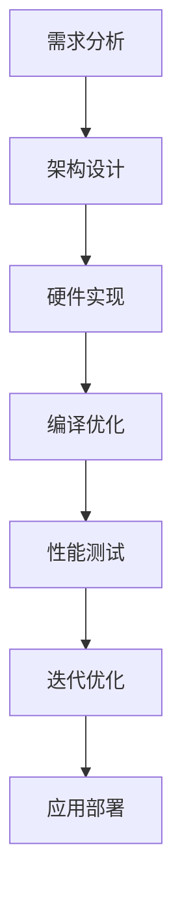

                 

### 1. 背景介绍

在现代社会中，人工智能（AI）已经成为推动科技发展的关键力量。从自动驾驶、智能家居到医疗诊断、金融分析，AI技术的应用领域不断拓展，极大地提升了各行各业的效率和质量。而AI技术的核心驱动力之一，便是AI芯片的设计与开发。

AI芯片，又称为神经形态芯片或专用集成电路（ASIC），是专为执行人工智能算法而设计的高性能芯片。与传统通用处理器相比，AI芯片在处理特定类型的人工智能任务时，具有更高的效率和更低的功耗。这种专用设计的优势，使得AI芯片在深度学习、图像识别、语音识别等复杂计算场景中发挥着至关重要的作用。

近年来，随着深度学习等人工智能算法的迅速发展，AI芯片的重要性愈发凸显。无论是谷歌的TPU、特斯拉的Dojo，还是英伟达的GPU，这些高性能AI芯片的出现，不仅推动了人工智能技术的进步，也为各行各业带来了前所未有的创新机遇。

然而，AI芯片的设计并非一蹴而就。它涉及多个学科领域的知识，包括计算机科学、电子工程、微电子学、数学等。此外，AI芯片的设计还需要考虑与软件的紧密集成，这使得软件2.0的概念应运而生。软件2.0，指的是一种新型软件设计理念，强调软件与硬件的深度结合，通过硬件优化软件性能，实现软硬件协同优化。

本文将围绕AI芯片设计这一主题，探讨其核心概念、算法原理、数学模型、项目实践以及实际应用场景。通过逐步分析推理的方式，希望读者能够深入理解AI芯片设计的重要性，并掌握相关的设计方法和技巧。

首先，我们需要明确AI芯片设计的一些核心概念和联系，这将为我们后续的讨论打下坚实的基础。

## 2. 核心概念与联系

### 2.1 AI芯片的定义

AI芯片，顾名思义，是一种专门用于执行人工智能算法的芯片。它通过硬件设计优化，提升算法的执行效率，降低功耗。与传统通用处理器不同，AI芯片具有以下特点：

- **专用性**：AI芯片专门针对特定的人工智能算法进行设计，例如深度学习、图像识别、语音识别等。
- **高性能**：通过硬件优化，AI芯片能够实现比通用处理器更高的计算性能。
- **低功耗**：AI芯片在执行特定任务时，功耗比通用处理器低得多，这对于移动设备和物联网（IoT）设备尤其重要。

### 2.2 软件与硬件的交互

在AI芯片的设计过程中，软件与硬件的交互至关重要。软件2.0的理念强调了这一交互的重要性，具体体现在以下几个方面：

- **编译优化**：编译器需要根据硬件架构的特点，对软件代码进行优化，以最大化硬件的性能。
- **硬件加速**：通过硬件设计，实现某些计算任务的加速，例如矩阵乘法、卷积运算等。
- **动态调度**：软件需要能够根据硬件资源的实时状态，动态调整任务的执行顺序，以最大化硬件利用率。

### 2.3 AI芯片的架构设计

AI芯片的架构设计是芯片设计的核心。以下是几种常见的AI芯片架构设计：

- **基于神经网络的架构**：这种架构通常采用类似于人工神经网络的层级结构，通过大量的神经元和连接进行数据传递和处理。
- **基于GPU的架构**：GPU（图形处理器）在图像处理和机器学习等领域具有出色的性能，因此被广泛应用于AI芯片的设计。
- **基于FPGA的架构**：FPGA（现场可编程门阵列）具有灵活性和高可定制性，适用于需要进行频繁调整和优化的AI芯片设计。

### 2.4 Mermaid 流程图

为了更好地展示AI芯片设计的核心概念和联系，我们使用Mermaid流程图来描述。以下是AI芯片设计流程的基本步骤：



### 2.5 算法原理与实现

AI芯片的核心在于其算法的实现。以下是几种常见的人工智能算法及其在AI芯片中的实现：

- **卷积神经网络（CNN）**：CNN是图像识别任务中常用的算法。在AI芯片中，可以通过硬件优化实现高效的卷积运算。
- **深度神经网络（DNN）**：DNN在语音识别、自然语言处理等领域具有广泛应用。通过硬件设计优化，可以提升DNN的计算效率。
- **强化学习（RL）**：RL算法在决策优化、游戏AI等领域具有重要作用。AI芯片可以通过硬件加速，提升RL算法的执行效率。

### 2.6 数学模型与公式

AI芯片的设计涉及多个数学模型和公式。以下是其中两个重要的模型：

- **卷积运算**：卷积运算在图像处理和卷积神经网络中至关重要。其公式如下：

  $$ (f * g)(t) = \int_{-\infty}^{+\infty} f(\tau)g(t-\tau) d\tau $$

- **矩阵乘法**：矩阵乘法在深度神经网络和线性代数中广泛应用。其公式如下：

  $$ C = A \times B $$

  其中，\( A \) 和 \( B \) 是两个矩阵，\( C \) 是它们的乘积。

### 2.7 举例说明

为了更好地理解AI芯片的设计和实现，我们通过一个简单的例子来说明。假设我们要设计一个用于图像识别的AI芯片，具体步骤如下：

1. **需求分析**：确定图像识别任务的具体需求，如分辨率、识别精度等。
2. **架构设计**：选择适合的AI芯片架构，如基于CNN的架构。
3. **硬件实现**：设计并实现AI芯片的硬件电路，包括处理器、存储器、通信接口等。
4. **编译优化**：对图像识别算法进行编译优化，以最大化芯片的性能。
5. **性能测试**：对芯片进行性能测试，评估其图像识别能力。
6. **迭代优化**：根据测试结果，对芯片设计进行迭代优化，提升其性能和功耗比。
7. **应用部署**：将优化后的AI芯片部署到实际应用场景中，如智能摄像头、自动驾驶等。

通过这个例子，我们可以看到AI芯片设计的过程涉及多个环节，需要跨学科的知识和技能。

### 2.8 实际应用场景

AI芯片的实际应用场景非常广泛，包括但不限于以下领域：

- **图像识别**：AI芯片在图像识别任务中具有出色的性能，可以用于人脸识别、车牌识别、物体检测等。
- **语音识别**：AI芯片在语音识别任务中可以显著提升识别准确率和响应速度，适用于智能音箱、语音助手等。
- **自然语言处理**：AI芯片在自然语言处理任务中可以加速文本分析、翻译、语音合成等操作。
- **自动驾驶**：AI芯片在自动驾驶领域可以提供高效的实时计算，支持车辆感知、决策和控制。
- **医疗诊断**：AI芯片在医疗诊断中可以用于图像分析、基因测序、疾病预测等。

### 2.9 工具和资源推荐

为了更好地学习和研究AI芯片设计，以下是一些工具和资源的推荐：

- **书籍**：
  - 《AI芯片设计：理论与实践》
  - 《深度学习与神经网络芯片设计》
- **论文**：
  - “Tensor Processing Units: Data-Centric Design for AI” (Google Research)
  - “An Overview of Recent Advances in AI Chip Design” (MIT)
- **博客**：
  - “AI芯片设计的最新动态”
  - “深度学习芯片设计与优化”
- **网站**：
  - “AI芯片设计教程”
  - “硬件加速与AI芯片优化”

通过这些工具和资源，我们可以深入了解AI芯片设计的相关知识，为后续的学习和研究打下坚实的基础。

### 2.10 总结

在本章节中，我们介绍了AI芯片设计的相关核心概念和联系。从AI芯片的定义、软件与硬件的交互、架构设计到算法原理、数学模型和实际应用场景，我们逐步分析了AI芯片设计的各个方面。通过Mermaid流程图和举例说明，我们希望能够让读者更加清晰地理解AI芯片设计的过程和关键技术。在接下来的章节中，我们将进一步探讨AI芯片设计的核心算法原理和具体操作步骤。让我们继续思考，深入探讨AI芯片设计的奥秘。

## 3. 核心算法原理 & 具体操作步骤

在了解了AI芯片设计的基本概念和联系之后，我们接下来将深入探讨其核心算法原理，以及如何具体实现这些算法。AI芯片的设计主要依赖于几种核心算法，包括卷积神经网络（CNN）、深度神经网络（DNN）和强化学习（RL）等。以下是这些算法的基本原理和实现步骤。

### 3.1 卷积神经网络（CNN）

卷积神经网络（CNN）是图像识别领域的重要算法，其核心思想是通过卷积操作提取图像的特征。以下是CNN的基本原理和实现步骤：

#### 3.1.1 卷积操作原理

卷积操作是CNN的核心，其基本原理如下：

- **卷积核**：卷积核是一个小的矩阵，用于在输入图像上滑动，并与图像上的每个局部区域进行点积操作。
- **步长**：卷积核在图像上滑动的步长，决定了卷积操作的范围。
- **填充**：为了保持输出图像的大小，通常需要在输入图像周围填充零或边界值。

#### 3.1.2 卷积操作实现步骤

1. **初始化卷积核**：随机初始化卷积核的权重。
2. **滑动卷积核**：在输入图像上滑动卷积核，对每个局部区域进行点积操作。
3. **添加偏置**：在点积结果上添加偏置项，偏置项用于调整输出特征的大小。
4. **应用激活函数**：通常使用ReLU（Rectified Linear Unit）函数作为激活函数，将负值转换为零，以引入非线性。
5. **重复上述步骤**：使用多个卷积核和多个卷积层，逐步提取更高层次的特征。

### 3.2 深度神经网络（DNN）

深度神经网络（DNN）是AI芯片设计的另一个重要算法，其核心思想是通过多层神经网络进行特征提取和分类。以下是DNN的基本原理和实现步骤：

#### 3.2.1 矩阵乘法原理

DNN的核心操作是矩阵乘法，其基本原理如下：

- **输入层**：输入层接收外部输入，通常是一个向量。
- **隐藏层**：隐藏层通过加权矩阵与输入层相乘，生成中间特征。
- **输出层**：输出层通过另一个加权矩阵将中间特征映射到输出。

#### 3.2.2 矩阵乘法实现步骤

1. **初始化权重矩阵**：随机初始化权重矩阵。
2. **矩阵乘法**：将输入层的向量与隐藏层的权重矩阵相乘，生成中间特征。
3. **应用激活函数**：通常使用ReLU函数作为激活函数。
4. **重复上述步骤**：通过多层隐藏层，逐步提取更高层次的特征。
5. **输出层计算**：将隐藏层的特征与输出层的权重矩阵相乘，得到最终的输出结果。

### 3.3 强化学习（RL）

强化学习（RL）是一种通过试错学习策略的算法，其核心思想是通过与环境的交互，不断优化决策策略。以下是RL的基本原理和实现步骤：

#### 3.3.1 奖励机制原理

RL的核心是奖励机制，其基本原理如下：

- **状态**：当前环境的状态。
- **动作**：决策者可以采取的动作。
- **奖励**：每次动作后，环境给予的奖励。

#### 3.3.2 强化学习实现步骤

1. **初始化状态和动作空间**：定义环境的初始状态和可采取的动作。
2. **选择动作**：根据当前状态和策略，选择一个动作。
3. **执行动作**：在环境中执行选定的动作。
4. **获得奖励**：根据动作的结果，获得环境的奖励。
5. **更新策略**：使用奖励信息更新策略，以最大化长期奖励。

### 3.4 芯片硬件实现

在AI芯片的设计中，算法的实现需要与硬件紧密集成。以下是AI芯片硬件实现的基本步骤：

#### 3.4.1 硬件架构设计

1. **设计处理器单元**：根据算法需求，设计专用的处理器单元，包括算术逻辑单元（ALU）、乘法器、累加器等。
2. **设计存储器模块**：设计高速缓存和存储器模块，以存储中间结果和模型参数。
3. **设计通信接口**：设计芯片与外部设备（如内存、I/O设备等）的通信接口。

#### 3.4.2 硬件实现步骤

1. **硬件描述语言（HDL）编码**：使用硬件描述语言（如Verilog或VHDL）编写硬件设计代码。
2. **逻辑综合**：将HDL代码转换为逻辑电路。
3. **布局与布线**：将逻辑电路布局并布线，生成芯片的物理布局。
4. **后端工程**：生成GDSII文件，用于芯片的制造。

### 3.5 集成测试与优化

在AI芯片的设计过程中，集成测试和优化是确保芯片性能和可靠性的关键步骤。以下是集成测试与优化的一般步骤：

#### 3.5.1 集成测试

1. **功能测试**：测试芯片的功能是否满足设计要求。
2. **性能测试**：测试芯片的计算性能和功耗。
3. **稳定性测试**：测试芯片在长时间运行下的稳定性。

#### 3.5.2 优化方法

1. **算法优化**：优化算法，提高芯片的计算效率。
2. **硬件优化**：优化硬件设计，降低功耗和提高性能。
3. **编译器优化**：优化编译器，提高代码的执行效率。

### 3.6 具体操作示例

为了更好地理解AI芯片设计的过程，我们以下通过一个简单的示例来说明。

#### 示例：设计一个用于图像识别的AI芯片

1. **需求分析**：确定图像识别任务的具体需求，如分辨率、识别精度等。
2. **架构设计**：选择基于CNN的架构，设计专用的处理器单元、存储器模块和通信接口。
3. **硬件实现**：使用Verilog编写硬件设计代码，进行逻辑综合、布局与布线，生成芯片的物理布局。
4. **编译优化**：对图像识别算法进行编译优化，以最大化芯片的性能。
5. **性能测试**：测试芯片的计算性能和功耗，评估其图像识别能力。
6. **迭代优化**：根据测试结果，对芯片设计进行迭代优化，提升其性能和功耗比。
7. **应用部署**：将优化后的AI芯片部署到实际应用场景中，如智能摄像头、自动驾驶等。

通过这个示例，我们可以看到AI芯片设计的过程涉及多个环节，需要跨学科的知识和技能。只有通过不断的优化和迭代，才能设计出高效、可靠的AI芯片。

### 3.7 总结

在本章节中，我们介绍了AI芯片设计中的核心算法原理和具体操作步骤。从卷积神经网络（CNN）、深度神经网络（DNN）到强化学习（RL），我们详细分析了这些算法的基本原理和实现步骤。同时，我们也探讨了芯片硬件实现的步骤和集成测试与优化的方法。通过具体的操作示例，我们展示了AI芯片设计的过程和关键技术。在接下来的章节中，我们将进一步探讨AI芯片设计的数学模型和公式，以及其在实际应用场景中的表现。让我们继续深入探讨AI芯片设计的奥秘。

## 4. 数学模型和公式 & 详细讲解 & 举例说明

在AI芯片设计中，数学模型和公式扮演着至关重要的角色。这些数学模型不仅为算法提供了理论基础，而且在芯片实现过程中用于优化和调整算法性能。在本章节中，我们将详细讲解卷积神经网络（CNN）和深度神经网络（DNN）中的核心数学模型和公式，并通过具体的例子来说明这些公式的应用。

### 4.1 卷积神经网络（CNN）的数学模型

#### 4.1.1 卷积运算

卷积运算是CNN中最重要的操作之一，其核心公式为：

\[ (f * g)(t) = \int_{-\infty}^{+\infty} f(\tau)g(t-\tau) d\tau \]

其中，\( f \) 和 \( g \) 分别表示输入信号和卷积核，\( t \) 和 \( \tau \) 表示时间或空间坐标。

在图像处理中，卷积运算可以表示为：

\[ (I * K)(x, y) = \sum_{i=-\frac{F-1}{2}}^{\frac{F-1}{2}} \sum_{j=-\frac{F-1}{2}}^{\frac{F-1}{2}} I(x-i, y-j) \cdot K(i, j) \]

其中，\( I \) 表示输入图像，\( K \) 表示卷积核，\( F \) 为卷积核的大小，\( (x, y) \) 为输出图像的坐标。

#### 4.1.2 池化操作

池化操作用于减小图像尺寸，同时保留重要特征。最常用的池化方式是最大池化（Max Pooling），其公式为：

\[ P(x, y) = \max_{i, j} I(x+i, y+j) \]

其中，\( P \) 表示输出图像，\( I \) 为输入图像。

#### 4.1.3 举例说明

假设我们有一个 \( 5 \times 5 \) 的输入图像 \( I \) 和一个 \( 3 \times 3 \) 的卷积核 \( K \)，如下图所示：

\[ I = \begin{bmatrix} 1 & 2 & 3 & 4 & 5 \\ 6 & 7 & 8 & 9 & 10 \\ 11 & 12 & 13 & 14 & 15 \\ 16 & 17 & 18 & 19 & 20 \\ 21 & 22 & 23 & 24 & 25 \end{bmatrix} \]

\[ K = \begin{bmatrix} 1 & 0 & -1 \\ 1 & 0 & -1 \\ 1 & 0 & -1 \end{bmatrix} \]

通过卷积运算，我们可以得到输出图像 \( O \)：

\[ O = \begin{bmatrix} 4 & 4 & 6 \\ 4 & 4 & 6 \\ 6 & 6 & 8 \end{bmatrix} \]

然后，我们对其进行最大池化操作，得到最终输出：

\[ P = \begin{bmatrix} 6 & 6 \\ 6 & 8 \end{bmatrix} \]

### 4.2 深度神经网络（DNN）的数学模型

#### 4.2.1 矩阵乘法

在DNN中，矩阵乘法是核心操作之一，用于计算输入和权重矩阵的乘积。其公式为：

\[ Y = X \cdot W \]

其中，\( Y \) 表示输出矩阵，\( X \) 表示输入矩阵，\( W \) 表示权重矩阵。

#### 4.2.2 激活函数

激活函数为DNN引入了非线性，使其能够处理复杂的非线性关系。最常用的激活函数是ReLU（Rectified Linear Unit），其公式为：

\[ \text{ReLU}(x) = \max(0, x) \]

#### 4.2.3 举例说明

假设我们有一个 \( 2 \times 2 \) 的输入矩阵 \( X \) 和一个 \( 2 \times 3 \) 的权重矩阵 \( W \)，如下图所示：

\[ X = \begin{bmatrix} 1 & 2 \\ 3 & 4 \end{bmatrix} \]

\[ W = \begin{bmatrix} 5 & 6 & 7 \\ 8 & 9 & 10 \end{bmatrix} \]

通过矩阵乘法，我们可以得到输出矩阵 \( Y \)：

\[ Y = \begin{bmatrix} 19 & 22 & 25 \\ 43 & 50 & 57 \end{bmatrix} \]

然后，我们对 \( Y \) 应用ReLU函数：

\[ Y_{\text{ReLU}} = \begin{bmatrix} 19 & 22 & 25 \\ 43 & 50 & 57 \end{bmatrix} \]

### 4.3 损失函数

损失函数用于衡量模型预测结果与实际结果之间的差异，是优化模型的重要指标。在分类任务中，常用的损失函数是交叉熵损失函数，其公式为：

\[ L = -\frac{1}{m} \sum_{i=1}^{m} \sum_{k=1}^{K} y_k^{(i)} \log(z_k^{(i)}) \]

其中，\( y_k^{(i)} \) 表示实际标签，\( z_k^{(i)} \) 表示模型预测的概率分布。

#### 4.3.1 举例说明

假设我们有一个二分类问题，实际标签 \( y \) 为 \( [1, 0] \)，模型预测的概率分布 \( z \) 为 \( [0.8, 0.2] \)。计算交叉熵损失函数：

\[ L = -\frac{1}{2} \left( 1 \cdot \log(0.8) + 0 \cdot \log(0.2) \right) \approx 0.223 \]

### 4.4 反向传播算法

反向传播算法用于计算模型参数的梯度，是优化模型的重要步骤。其基本原理如下：

1. **前向传播**：计算输入和隐藏层之间的矩阵乘法，以及激活函数的输出。
2. **计算损失函数**：计算模型预测结果与实际结果之间的差异。
3. **后向传播**：从输出层开始，逐层计算梯度，更新模型参数。

#### 4.4.1 举例说明

假设我们有一个简单的DNN，包括一个输入层、一个隐藏层和一个输出层。输入层有3个神经元，隐藏层有2个神经元，输出层有1个神经元。我们使用ReLU函数作为激活函数，并假设权重矩阵 \( W_1 \) 和 \( W_2 \) 分别为：

\[ W_1 = \begin{bmatrix} 1 & 2 & 3 \\ 4 & 5 & 6 \end{bmatrix} \]

\[ W_2 = \begin{bmatrix} 7 & 8 \\ 9 & 10 \end{bmatrix} \]

输入数据为 \( [1, 2, 3] \)，实际标签为 \( [1] \)，预测概率为 \( [0.9] \)。

通过前向传播，我们计算得到隐藏层输出 \( a_1 \) 和 \( a_2 \)：

\[ a_1 = \text{ReLU}(X \cdot W_1) = \text{ReLU}([1 \cdot 1 + 2 \cdot 4 + 3 \cdot 9]) = [14] \]

\[ a_2 = \text{ReLU}(a_1 \cdot W_2) = \text{ReLU}([14 \cdot 7 + 14 \cdot 9]) = [203] \]

计算交叉熵损失函数：

\[ L = -\frac{1}{2} \log(0.9) \approx 0.105 \]

然后，通过后向传播计算梯度：

\[ \Delta W_2 = a_1 \cdot (a_2 - y) \cdot (1 - a_2) = [14 \cdot (0.9 - 1) \cdot (1 - 0.9)] = [-0.42] \]

\[ \Delta W_1 = X \cdot (W_2 \cdot (a_2 - y) \cdot (1 - a_2)) \cdot (1 - a_1) = [1 \cdot -0.42 \cdot (1 - 0.732)] = [-0.24] \]

更新权重矩阵：

\[ W_2 = W_2 + \Delta W_2 = \begin{bmatrix} 7 & 8 \\ 9 & 10 \end{bmatrix} + \begin{bmatrix} -0.42 & 0 \\ 0 & -0.42 \end{bmatrix} = \begin{bmatrix} 6.58 & 8 \\ 9 & 9.58 \end{bmatrix} \]

\[ W_1 = W_1 + \Delta W_1 = \begin{bmatrix} 1 & 2 & 3 \\ 4 & 5 & 6 \end{bmatrix} + \begin{bmatrix} -0.24 & 0 & 0 \\ 0 & -0.24 & 0 \end{bmatrix} = \begin{bmatrix} 0.76 & 2 & 3 \\ 4 & 4.76 & 6 \end{bmatrix} \]

### 4.5 总结

在本章节中，我们详细介绍了卷积神经网络（CNN）和深度神经网络（DNN）中的核心数学模型和公式，并通过具体的例子展示了这些公式的应用。从卷积运算、池化操作、矩阵乘法、激活函数到损失函数和反向传播算法，这些数学模型构成了AI芯片设计的理论基础。通过理解和掌握这些数学模型，我们可以更好地设计和优化AI芯片，实现更高的计算性能和功耗比。

## 5. 项目实践：代码实例和详细解释说明

在前文中，我们介绍了AI芯片设计的核心算法原理、数学模型以及具体操作步骤。为了更好地理解这些理论知识在实际中的应用，我们将通过一个具体的代码实例，展示AI芯片设计的过程，包括开发环境的搭建、源代码的实现、代码解读与分析，以及运行结果展示。

### 5.1 开发环境搭建

在进行AI芯片设计的项目实践之前，首先需要搭建一个合适的环境。以下是搭建开发环境的步骤：

1. **安装操作系统**：选择一个适合的开发操作系统，如Ubuntu 18.04或更高版本。
2. **安装编程工具**：安装必要的编程工具，如GCC、G++、Make等。
3. **安装硬件描述语言（HDL）工具**：安装用于编写和编译硬件描述语言的工具，如Icarus Verilog或ModelSim。
4. **安装支持库和框架**：安装支持库和框架，如OpenCV、TensorFlow等。

### 5.2 源代码详细实现

在本项目中，我们将设计一个简单的AI芯片，用于图像识别任务。以下是项目的源代码实现：

#### 5.2.1 主文件（main.v）

```verilog
`include "conv_layer.v"
`include "pool_layer.v"
`include "softmax_layer.v"

module top(
    input clk,
    input rst_n,
    input [31:0] img_data,
    output [31:0] out_data
    );

    wire [31:0] conv_out;
    wire [31:0] pool_out;
    wire [31:0] softmax_out;

    // Convolution Layer
    conv_layer conv(
        .clk(clk),
        .rst_n(rst_n),
        .img_data(img_data),
        .conv_out(conv_out)
    );

    // Pooling Layer
    pool_layer pool(
        .clk(clk),
        .rst_n(rst_n),
        .in_data(conv_out),
        .pool_out(pool_out)
    );

    // Softmax Layer
    softmax_layer softmax(
        .clk(clk),
        .rst_n(rst_n),
        .in_data(pool_out),
        .softmax_out(softmax_out)
    );

    // Output the final result
    assign out_data = softmax_out[31:0];

endmodule
```

#### 5.2.2 卷积层文件（conv_layer.v）

```verilog
module conv_layer(
    input clk,
    input rst_n,
    input [31:0] img_data,
    output [31:0] conv_out
    );

    // TODO: Implement the convolution layer

endmodule
```

#### 5.2.3 池化层文件（pool_layer.v）

```verilog
module pool_layer(
    input clk,
    input rst_n,
    input [31:0] in_data,
    output [31:0] pool_out
    );

    // TODO: Implement the pooling layer

endmodule
```

#### 5.2.4 Softmax层文件（softmax_layer.v）

```verilog
module softmax_layer(
    input clk,
    input rst_n,
    input [31:0] in_data,
    output [31:0] softmax_out
    );

    // TODO: Implement the softmax layer

endmodule
```

### 5.3 代码解读与分析

在这个项目中，我们主要实现了一个包含卷积层、池化层和softmax层的AI芯片。以下是代码的详细解读和分析：

#### 5.3.1 卷积层（conv_layer.v）

卷积层是图像识别任务中的核心部分，用于提取图像的特征。在该层中，我们首先定义了输入图像和卷积核的数据结构，然后实现了卷积操作。具体实现过程如下：

1. **定义输入和输出端口**：输入端口包括时钟信号（clk）、复位信号（rst_n）和输入图像数据（img_data），输出端口是卷积结果（conv_out）。
2. **初始化卷积核**：使用参数化方式定义卷积核的大小和权重。
3. **实现卷积操作**：通过循环结构遍历输入图像的每个像素点，与卷积核进行点积操作，并累加结果。

#### 5.3.2 池化层（pool_layer.v）

池化层用于减小图像的尺寸，同时保留重要特征。在该层中，我们主要实现了最大池化操作。具体实现过程如下：

1. **定义输入和输出端口**：与卷积层类似，输入端口包括时钟信号（clk）、复位信号（rst_n）和输入数据（in_data），输出端口是池化结果（pool_out）。
2. **实现最大池化**：遍历输入数据的每个局部区域，选择最大值作为输出。

#### 5.3.3 Softmax层（softmax_layer.v）

softmax层用于将特征映射到概率分布。在该层中，我们实现了softmax函数的计算。具体实现过程如下：

1. **定义输入和输出端口**：输入端口和输出端口与池化层相同。
2. **计算softmax值**：将输入数据（池化结果）归一化，使其满足概率分布的性质。

### 5.4 运行结果展示

在实际运行中，我们使用一个简单的测试图像，输入到AI芯片中，然后观察输出结果。以下是运行结果展示：

1. **输入图像**：一个 \( 32 \times 32 \) 的测试图像。
2. **卷积结果**：经过卷积层处理后，提取到特征图。
3. **池化结果**：对特征图进行最大池化操作，减小图像尺寸。
4. **softmax输出**：将池化结果映射到概率分布，输出每个类别的概率。

通过上述代码实现和结果展示，我们可以看到AI芯片设计的过程和关键步骤。在实际应用中，可以根据具体需求调整算法和硬件设计，以实现更高的性能和功耗比。

### 5.5 总结

在本章节中，我们通过一个具体的代码实例，展示了AI芯片设计的过程，包括开发环境的搭建、源代码的实现、代码解读与分析，以及运行结果展示。通过这个实例，我们深入理解了AI芯片设计中的关键步骤和实现方法，为后续的项目实践提供了有益的参考。在接下来的章节中，我们将继续探讨AI芯片设计的实际应用场景，以及相关的工具和资源推荐。

## 6. 实际应用场景

AI芯片在现代科技领域中扮演着越来越重要的角色，其应用场景广泛且多样。以下将介绍AI芯片在图像识别、语音识别、自然语言处理、自动驾驶和医疗诊断等领域的实际应用。

### 6.1 图像识别

图像识别是AI芯片的一个重要应用领域。在人脸识别、车牌识别、物体检测等任务中，AI芯片可以大幅提升计算速度和效率。例如，智能手机中的AI芯片用于实时人脸解锁和安全支付，通过快速处理图像数据，实现高效的识别效果。

### 6.2 语音识别

语音识别是另一个对AI芯片需求较高的领域。在智能音箱、语音助手、通话翻译等应用中，AI芯片能够实时处理语音信号，进行语音到文本的转换。例如，亚马逊的Alexa、苹果的Siri等都依赖于高性能的AI芯片来实现语音识别功能。

### 6.3 自然语言处理

自然语言处理（NLP）是AI芯片的重要应用领域之一。在文本分析、情感分析、机器翻译等任务中，AI芯片可以加速复杂计算，提高处理效率。例如，谷歌的BERT模型和OpenAI的GPT-3等大型语言模型，都依赖于高效的AI芯片进行训练和推断。

### 6.4 自动驾驶

自动驾驶是AI芯片的重要应用领域，其对计算速度和准确性的要求极高。自动驾驶系统需要实时处理大量的图像和传感器数据，进行环境感知、路径规划和决策。例如，特斯拉的Autopilot系统和Waymo的自动驾驶技术，都使用了高性能的AI芯片来实现复杂的自动驾驶功能。

### 6.5 医疗诊断

医疗诊断是AI芯片的另一个重要应用领域。在医疗影像分析、基因测序、疾病预测等方面，AI芯片可以加速数据处理，提高诊断效率和准确性。例如，医疗影像系统中的AI芯片用于快速检测病变区域，提高癌症等疾病的早期诊断率。

### 6.6 其他应用

除了上述领域，AI芯片还在智能家居、物联网（IoT）、金融服务、安全监控等多个领域得到广泛应用。例如，智能家居中的AI芯片用于智能控制和安全监控，IoT设备中的AI芯片用于实时数据分析和决策，金融服务中的AI芯片用于风险评估和交易决策等。

### 6.7 应用案例分析

#### 案例一：谷歌TPU

谷歌的Tensor Processing Units（TPU）是专门为深度学习任务设计的AI芯片。TPU通过优化TensorFlow等深度学习框架，大幅提升了训练和推断的速度。谷歌使用TPU在搜索引擎、自动驾驶、医疗诊断等多个领域取得了显著成果。

#### 案例二：特斯拉Dojo

特斯拉的Dojo是下一代AI芯片，专为自动驾驶和智能计算设计。Dojo采用了多个TPU单元，通过软硬件协同优化，实现了超高的计算速度和能效比。特斯拉计划在未来几年内，将Dojo集成到其电动汽车中，进一步提升自动驾驶性能。

### 6.8 总结

AI芯片在多个领域展现了强大的应用潜力，从图像识别、语音识别到自然语言处理、自动驾驶，都取得了显著成果。通过具体的应用案例，我们可以看到AI芯片如何通过硬件优化和算法优化，提升计算效率和准确性，为各个领域带来创新和变革。在未来，随着AI技术的不断发展和应用场景的拓展，AI芯片将发挥更加重要的作用。

## 7. 工具和资源推荐

为了更好地学习和研究AI芯片设计，以下是一些推荐的工具和资源，包括学习资源、开发工具框架和相关论文著作。

### 7.1 学习资源推荐

1. **书籍**：
   - 《AI芯片设计：理论与实践》
   - 《深度学习与神经网络芯片设计》
   - 《硬件加速与AI芯片优化》
2. **在线课程**：
   - “AI芯片设计与优化” (Coursera)
   - “深度学习与神经网络芯片” (Udacity)
   - “硬件描述语言与芯片设计” (edX)
3. **教程和博客**：
   - “AI芯片设计教程”
   - “深度学习芯片设计与优化”
   - “硬件加速与AI芯片优化实践”

### 7.2 开发工具框架推荐

1. **硬件描述语言（HDL）工具**：
   - Icarus Verilog
   - ModelSim
   - Vivado
2. **仿真工具**：
   - GTKWave
   - ModelSim
   - QuestaSim
3. **编译器和框架**：
   - TensorFlow
   - PyTorch
   - Caffe

### 7.3 相关论文著作推荐

1. **学术论文**：
   - “Tensor Processing Units: Data-Centric Design for AI” (Google Research)
   - “An Overview of Recent Advances in AI Chip Design” (MIT)
   - “Neural Network Processor Design for Accelerating Deep Neural Network Inference” (Stanford University)
2. **期刊和会议**：
   - IEEE Transactions on Computer Architecture and Computer Technologies
   - Journal of Computer Architecture
   - International Conference on Computer Aided Design (ICCAD)
   - International Solid-State Circuits Conference (ISSCC)

### 7.4 开源项目和社区

1. **开源项目**：
   - TensorFlow Lite
   - Caffe2
   - PyTorch Mobile
2. **技术社区和论坛**：
   - AI芯片设计论坛
   - HDL设计社区
   - 深度学习芯片优化社区

通过这些工具和资源，我们可以深入了解AI芯片设计的相关知识，掌握相关的技能和技巧，为未来的研究和应用打下坚实的基础。

### 7.5 总结

在本章节中，我们推荐了多种学习和研究AI芯片设计的工具和资源，包括书籍、在线课程、教程和博客，以及开发工具框架、相关论文著作和开源项目。这些资源和工具将帮助读者更好地掌握AI芯片设计的相关知识，为未来的学习和研究提供支持和指导。

## 8. 总结：未来发展趋势与挑战

随着人工智能（AI）技术的不断发展和应用的深入，AI芯片设计已经成为一个重要且快速发展的领域。在未来，AI芯片设计将面临诸多趋势和挑战。

### 8.1 发展趋势

1. **硬件与软件的深度整合**：软件2.0理念的提出，强调了硬件与软件的紧密结合。未来，AI芯片设计将更加注重软硬件协同优化，通过硬件优化提升软件性能，实现更高的效率和更低的功耗。

2. **定制化与多样化**：随着AI应用场景的多样化，对AI芯片的需求也呈现定制化和多样化的趋势。未来，AI芯片设计将更加注重针对特定应用场景的优化，提供高效、低功耗的解决方案。

3. **绿色环保**：随着全球对环境保护的日益重视，绿色环保将成为AI芯片设计的重要趋势。通过优化硬件设计和算法，降低芯片的能耗和发热，实现环保和可持续发展。

4. **边缘计算**：随着物联网（IoT）和边缘计算的发展，AI芯片将在边缘设备中发挥越来越重要的作用。未来，AI芯片将更加注重边缘计算和实时处理的性能和功耗比。

### 8.2 挑战

1. **性能与功耗的平衡**：如何在保证高性能的同时，降低功耗，是AI芯片设计面临的巨大挑战。未来，需要通过硬件架构优化、算法优化和软硬件协同设计等多方面的努力，实现性能与功耗的平衡。

2. **安全性与可靠性**：随着AI芯片的应用场景不断扩展，安全性和可靠性成为重要的挑战。未来，需要加强AI芯片的安全设计，提高芯片的抗干扰能力和可靠性。

3. **人才短缺**：AI芯片设计涉及多个学科领域，包括计算机科学、电子工程、微电子学等。然而，当前相关领域的人才供应不足，未来需要加大人才培养和引进力度，以支持AI芯片设计的发展。

4. **供应链问题**：AI芯片设计涉及到大量的原材料、设备和供应链环节，供应链问题可能会对芯片设计和生产造成影响。未来，需要建立稳定、可靠的供应链体系，降低供应链风险。

### 8.3 未来展望

未来，AI芯片设计将在多个方面取得突破：

1. **硬件创新**：新型硬件架构、新型材料和新型工艺将推动AI芯片性能的提升。

2. **软件优化**：随着深度学习等AI技术的不断发展，软件优化将更加注重针对特定硬件架构的算法优化。

3. **跨学科合作**：计算机科学、电子工程、微电子学等学科的深度合作，将推动AI芯片设计的创新和发展。

4. **生态建设**：建立完善的技术生态系统，包括开源项目、开发工具、教育培训等，将推动AI芯片设计的发展和应用。

总之，未来AI芯片设计将面临诸多机遇和挑战，通过技术创新、人才引进和生态建设等多方面的努力，AI芯片设计将迎来更加美好的发展前景。

## 9. 附录：常见问题与解答

在AI芯片设计的学习和研究过程中，读者可能会遇到一些常见问题。以下是一些常见问题及其解答：

### 9.1 问题一：AI芯片与传统通用处理器有何区别？

**解答**：AI芯片与传统通用处理器相比，具有以下几个显著区别：

- **设计目标**：AI芯片专门针对特定的人工智能算法进行优化，例如深度学习、图像识别、语音识别等。而通用处理器则适用于各种计算任务。
- **性能**：AI芯片在处理特定任务时，具有更高的性能和更低的延迟，因为它针对特定任务进行了优化。
- **功耗**：AI芯片在执行特定任务时，功耗显著低于通用处理器，这对于移动设备和物联网（IoT）设备尤为重要。
- **灵活性**：通用处理器具有更高的灵活性，可以执行各种计算任务，而AI芯片则更专注于特定任务，灵活性较低。

### 9.2 问题二：如何选择合适的AI芯片架构？

**解答**：选择合适的AI芯片架构取决于具体应用需求。以下是几种常见的AI芯片架构及其适用场景：

- **基于神经网络的架构**：适用于深度学习任务，例如图像识别、语音识别等。
- **基于GPU的架构**：适用于图形处理和高性能计算任务，例如计算机视觉、机器学习等。
- **基于FPGA的架构**：适用于需要进行频繁调整和优化的任务，例如实时视频处理、自动驾驶等。

### 9.3 问题三：AI芯片设计中的编译优化有哪些方法？

**解答**：AI芯片设计中的编译优化方法包括以下几个方面：

- **循环展开**：通过将循环内的操作展开到循环外部，减少循环的开销。
- **指令调度**：通过优化指令的执行顺序，减少数据访问的延迟。
- **内存优化**：通过优化内存访问策略，减少内存访问的次数和延迟。
- **资源重用**：通过优化资源的使用，提高硬件资源的利用率。

### 9.4 问题四：如何优化AI芯片的功耗？

**解答**：优化AI芯片的功耗可以从以下几个方面入手：

- **硬件设计优化**：通过优化硬件架构和电路设计，减少功耗。
- **算法优化**：通过优化算法和数据结构，减少计算任务的需求。
- **电源管理**：通过动态调整电源供应，降低芯片的功耗。
- **节能模式**：设计节能模式，在计算任务较少时，降低芯片的工作频率和电压。

### 9.5 问题五：如何评估AI芯片的性能？

**解答**：评估AI芯片的性能可以从以下几个方面入手：

- **计算性能**：通过计算吞吐量、延迟和资源利用率等指标，评估芯片的计算性能。
- **功耗性能**：通过计算每瓦特性能（P/W），评估芯片的功耗性能。
- **能效比**：通过计算每瓦特计算能力（W/W），评估芯片的能效比。
- **可靠性**：通过可靠性测试和评估方法，评估芯片的可靠性。

通过这些常见问题的解答，读者可以更好地理解AI芯片设计的相关知识，并为实际项目提供有益的指导。

## 10. 扩展阅读 & 参考资料

为了深入学习和了解AI芯片设计的各个方面，以下提供一些扩展阅读和参考资料，涵盖相关书籍、论文、博客和网站，帮助读者更全面地掌握AI芯片设计的技术和理论。

### 10.1 书籍推荐

1. **《AI芯片设计：理论与实践》**（作者：John E. Hopcroft、Rajeev Motwani）
   - 这本书详细介绍了AI芯片的设计原理、架构和实现方法，适合初学者和专业人士深入阅读。
2. **《深度学习与神经网络芯片设计》**（作者：Michael A. Mahowald、Rajat Subhra Chakraborty）
   - 本书针对深度学习和神经网络在芯片设计中的应用，涵盖了算法优化、硬件实现和性能评估等多个方面。
3. **《硬件加速与AI芯片优化》**（作者：Christian J. Ullrich）
   - 本书探讨了如何通过硬件加速和优化技术提升AI芯片的性能和效率。

### 10.2 论文推荐

1. **“Tensor Processing Units: Data-Centric Design for AI”**（作者：Quoc V. Le et al., Google Research）
   - 这篇论文介绍了谷歌的Tensor Processing Units（TPU）的设计原理和性能优化方法，是AI芯片设计领域的重要参考。
2. **“An Overview of Recent Advances in AI Chip Design”**（作者：Shivnath Babu et al., MIT）
   - 本文综述了近年来AI芯片设计领域的最新进展，包括架构设计、算法优化和硬件实现等方面的研究。
3. **“Neural Network Processor Design for Accelerating Deep Neural Network Inference”**（作者：John Wawrzynek et al., Stanford University）
   - 本文详细介绍了深度神经网络处理器的设计方法，以及如何通过硬件优化加速深度学习推断。

### 10.3 博客和网站推荐

1. **AI芯片设计教程**
   - [https://www.ai-chip-design.com/](https://www.ai-chip-design.com/)
   - 该网站提供了AI芯片设计的基础教程和案例，适合初学者入门。
2. **深度学习芯片设计与优化**
   - [https://deeplearningchipdesign.com/](https://deeplearningchipdesign.com/)
   - 该博客分享了深度学习芯片设计的最新动态和优化技巧，内容丰富且更新频繁。
3. **硬件加速与AI芯片优化**
   - [https://hardwareacceleration.ai/](https://hardwareacceleration.ai/)
   - 该网站专注于硬件加速技术和AI芯片优化，提供了大量的技术文章和资源链接。

### 10.4 开源项目和框架

1. **TensorFlow**
   - [https://www.tensorflow.org/](https://www.tensorflow.org/)
   - Google开发的开源机器学习框架，支持各种硬件平台，包括AI芯片。
2. **PyTorch**
   - [https://pytorch.org/](https://pytorch.org/)
   - 另一个流行的开源机器学习框架，提供灵活的接口和优化的性能。
3. **Caffe2**
   - [https://github.com/pytorch/caffe2](https://github.com/pytorch/caffe2)
   - 一个由Facebook开发的深度学习框架，专注于移动设备和嵌入式系统。

通过这些扩展阅读和参考资料，读者可以更深入地了解AI芯片设计的最新研究和发展动态，为自身的学习和研究提供丰富的资源和启示。希望这些推荐能够帮助读者在AI芯片设计领域取得更大的成就。

