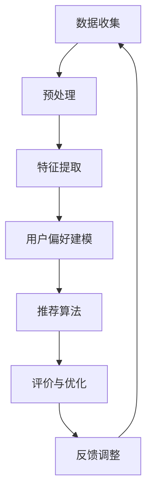

                 

### 1. 背景介绍

AI视觉推荐系统作为人工智能与计算机视觉领域的一个重要研究方向，近年来得到了广泛关注和快速发展。随着互联网的普及和人们信息获取方式的多样化，个性化推荐服务已成为众多平台提升用户体验和增加用户黏性的关键手段。而视觉推荐系统则因其独特的优势，成为众多应用场景中的核心组成部分。

#### 什么是AI视觉推荐系统？

AI视觉推荐系统是指利用人工智能技术，特别是机器学习和深度学习算法，对用户的视觉信息进行解析和建模，从而实现个性化推荐的一类系统。视觉信息通常包括图像、视频、用户标签等多种形式。AI视觉推荐系统通过分析用户的历史行为、偏好以及社交关系等，为用户推荐他们可能感兴趣的内容。

#### 为什么需要AI视觉推荐系统？

**1. 提升用户体验：** 传统的基于文本的推荐系统存在信息量有限、个性化程度不高的问题。而视觉推荐系统可以更直观地呈现内容，满足用户对于视觉刺激的需求，从而提升用户体验。

**2. 增加用户黏性：** 通过准确推荐用户感兴趣的内容，视觉推荐系统可以有效延长用户在平台上的停留时间，提高用户活跃度和平台黏性。

**3. 提高商业价值：** 对于电商平台、视频平台等，视觉推荐系统可以帮助企业精准推送商品和内容，提高用户转化率和销售额。

**4. 拓展应用场景：** 从简单的商品推荐到复杂的多媒体内容推荐，视觉推荐系统的应用场景不断扩展，成为众多行业提升服务水平的重要工具。

#### AI视觉推荐系统的发展历程

**1. 初期探索（2000年代初）：** 这一阶段主要是基于图像特征和文本匹配的简单推荐方法，如基于内容的推荐和协同过滤。

**2. 机器学习算法的应用（2010年）：** 这一时期，机器学习算法，特别是深度学习算法的快速发展，为视觉推荐系统提供了新的技术手段。

**3. 深度学习技术的突破（2015年后）：** 深度学习技术在计算机视觉领域的应用取得显著进展，使得视觉推荐系统的准确性大幅提升。

**4. 端到端模型的兴起（近三年）：** 近年来，端到端学习模型在视觉推荐系统中的应用逐渐成熟，从图像生成到推荐算法，各个环节实现了高度集成。

#### 当前研究的趋势

**1. 多模态融合：** 为了提高推荐的准确性，研究者们开始关注多模态数据的融合，如将图像、文本和音频等多种类型的数据进行整合。

**2. 强化学习：** 强化学习作为一种自主决策的方法，在视觉推荐系统中展示了潜力，特别是在需要动态调整推荐策略的应用场景中。

**3. 小样本学习：** 在数据量有限的情况下，如何从少量样本中学习到有效的特征，是当前研究的另一个热点。

**4. 数据隐私保护：** 随着数据隐私问题日益突出，如何在保护用户隐私的前提下进行有效推荐，成为研究的一个重要方向。

### 总结

AI视觉推荐系统作为人工智能与计算机视觉的交汇点，不仅推动了技术的进步，也改变了人们的日常生活。随着研究的深入，视觉推荐系统将在更多领域发挥重要作用，为个性化服务和智能决策提供有力支持。

----------------------------------------------------------------

### 2. 核心概念与联系

为了深入理解AI视觉推荐系统的运作原理，我们需要介绍几个核心概念和它们之间的关系。以下是几个关键概念及其简要说明：

#### 1. 特征提取

特征提取是指从原始图像或视频中提取出有助于表示图像内容的关键特征。这些特征可以是低级特征（如颜色、纹理），也可以是高级特征（如形状、语义）。常见的特征提取方法包括卷积神经网络（CNN）和视觉几何组（VGG）等。

#### 2. 用户偏好建模

用户偏好建模是指通过分析用户的历史行为、兴趣和反馈等信息，构建出用户的偏好模型。这些模型可以用于预测用户对特定内容的兴趣程度。常见的用户偏好建模方法包括协同过滤（Collaborative Filtering）和矩阵分解（Matrix Factorization）。

#### 3. 推荐算法

推荐算法是指根据用户偏好模型和特征提取结果，生成个性化推荐列表的一类算法。常见的推荐算法包括基于内容的推荐（Content-Based Recommendation）和基于模型的推荐（Model-Based Recommendation）。

#### 4. 评价与优化

评价与优化是指通过评估推荐系统的性能指标（如准确率、召回率等），不断调整和优化推荐算法，以提高推荐效果。常见的评价方法包括交叉验证（Cross-Validation）和A/B测试（A/B Testing）。

#### 关系与整合

上述概念之间有着密切的联系。特征提取为用户偏好建模和推荐算法提供了必要的输入数据，而用户偏好建模和推荐算法则通过整合特征提取结果，实现个性化推荐。评价与优化则在整个系统中起到监控和调整的作用，确保推荐系统的性能持续提升。

#### Mermaid 流程图

以下是一个简化的Mermaid流程图，展示AI视觉推荐系统的主要流程和核心组件：



在这个流程图中，数据收集、预处理、特征提取、用户偏好建模、推荐算法、评价与优化和反馈调整构成了一个闭环，确保系统不断迭代和优化。

### 总结

通过上述核心概念的介绍和Mermaid流程图的展示，我们可以更清晰地理解AI视觉推荐系统的运作原理和各组件之间的关联。接下来，我们将深入探讨这些核心算法的原理和具体实现。

----------------------------------------------------------------

### 3. 核心算法原理 & 具体操作步骤

#### 3.1 特征提取算法

特征提取是AI视觉推荐系统的第一步，其核心目的是从原始图像或视频中提取出有代表性的特征，以便后续的推荐算法可以使用这些特征进行用户偏好建模和推荐生成。以下将详细介绍几种常用的特征提取算法：

**1. 卷积神经网络（CNN）**

卷积神经网络（CNN）是一种专门用于处理图像数据的神经网络模型，其核心思想是通过卷积操作提取图像中的特征。以下是一个简单的CNN模型操作步骤：

1. **输入层（Input Layer）**：接收原始图像作为输入。
2. **卷积层（Convolutional Layer）**：通过卷积核在输入图像上滑动，计算局部特征图。卷积层的参数包括卷积核大小、步长和填充方式。
3. **激活函数层（Activation Function Layer）**：常用激活函数如ReLU（Rectified Linear Unit）。
4. **池化层（Pooling Layer）**：通过池化操作（如最大池化或平均池化）减少特征图的维度，降低计算复杂度。
5. **全连接层（Fully Connected Layer）**：将卷积层和池化层输出的特征图展开为一个一维向量，然后通过全连接层进行分类或回归。

**示例代码：**

```python
import tensorflow as tf

# 创建一个简单的CNN模型
model = tf.keras.Sequential([
    tf.keras.layers.Conv2D(32, (3, 3), activation='relu', input_shape=(28, 28, 1)),
    tf.keras.layers.MaxPooling2D((2, 2)),
    tf.keras.layers.Conv2D(64, (3, 3), activation='relu'),
    tf.keras.layers.MaxPooling2D((2, 2)),
    tf.keras.layers.Flatten(),
    tf.keras.layers.Dense(128, activation='relu'),
    tf.keras.layers.Dense(10, activation='softmax')
])

model.compile(optimizer='adam', loss='categorical_crossentropy', metrics=['accuracy'])
```

**2. 视觉几何组（VGG）**

视觉几何组（VGG）是一种基于CNN的经典模型，广泛用于图像分类和特征提取。VGG模型的特点是使用了多个卷积层和池化层，并通过较小的卷积核尺寸（如3x3）来逐步降低特征图的维度。

**示例代码：**

```python
from tensorflow.keras.applications import VGG16

# 加载预训练的VGG16模型
vgg16 = VGG16(weights='imagenet', include_top=False, input_shape=(224, 224, 3))

# 将VGG16模型作为特征提取器
feature_extractor = Model(inputs=vgg16.input, outputs=vgg16.get_layer('fc2').output)
```

**3. 网络嵌入（Neural Embedding）**

网络嵌入是一种将图像或视频数据映射到低维空间的方法，其核心思想是利用神经网络学习图像或视频的特征表示。常用的网络嵌入方法包括深度卷积网络（DCN）和图嵌入（Graph Embedding）。

**示例代码：**

```python
from tensorflow.keras.layers import Input, Dense
from tensorflow.keras.models import Model

# 创建一个简单的DCN模型
input_layer = Input(shape=(28, 28, 1))
x = Conv2D(32, (3, 3), activation='relu')(input_layer)
x = Conv2D(64, (3, 3), activation='relu')(x)
x = Flatten()(x)
x = Dense(128, activation='relu')(x)
output_layer = Dense(10, activation='softmax')(x)

model = Model(inputs=input_layer, outputs=output_layer)
```

#### 3.2 用户偏好建模算法

用户偏好建模是视觉推荐系统的关键环节，其目标是构建一个能够准确预测用户兴趣的模型。以下将介绍几种常用的用户偏好建模算法：

**1. 协同过滤（Collaborative Filtering）**

协同过滤是一种基于用户行为相似度的推荐算法，分为基于用户的协同过滤（User-Based CF）和基于物品的协同过滤（Item-Based CF）。

**示例代码：**

```python
from surprise import KNNWithMeans

# 创建一个基于用户的协同过滤模型
user_based_cf = KNNWithMeans(k=10, sim_options={'name': 'cosine', 'user_based': True})
```

**2. 矩阵分解（Matrix Factorization）**

矩阵分解是一种通过将用户-物品评分矩阵分解为两个低维矩阵来预测用户偏好的方法，常用的矩阵分解方法包括Singular Value Decomposition（SVD）和Alternating Least Squares（ALS）。

**示例代码：**

```python
from surprise import SVD

# 创建一个SVD矩阵分解模型
svd = SVD()
```

**3. 强化学习（Reinforcement Learning）**

强化学习是一种通过学习最优策略来最大化回报的算法，常用于动态推荐系统。强化学习的方法包括Q-Learning和SARSA。

**示例代码：**

```python
import tensorflow as tf

# 创建一个Q-Learning模型
model = tf.keras.Sequential([
    tf.keras.layers.Dense(128, activation='relu', input_shape=(28, 28, 1)),
    tf.keras.layers.Dense(64, activation='relu'),
    tf.keras.layers.Dense(1, activation='linear')
])

model.compile(optimizer='adam', loss='mse')
```

#### 3.3 推荐算法

推荐算法是根据用户偏好模型和特征提取结果生成个性化推荐列表的方法。以下将介绍几种常用的推荐算法：

**1. 基于内容的推荐（Content-Based Recommendation）**

基于内容的推荐算法通过分析用户过去的偏好和物品的特征，生成与用户兴趣相关的推荐列表。

**示例代码：**

```python
def content_based_recommender(content, user_preferences, item_features):
    # 根据用户偏好和物品特征计算相似度
    similarities = cosine_similarity(user_preferences, item_features)
    
    # 根据相似度排序生成推荐列表
    recommended_items = sorted(zip(similarities, item_features), reverse=True)
    return recommended_items
```

**2. 基于模型的推荐（Model-Based Recommendation）**

基于模型的推荐算法通过训练用户偏好模型和特征提取模型，生成个性化推荐列表。

**示例代码：**

```python
def model_based_recommender(user_preference_model, item_feature_model, user_features, item_features):
    # 使用用户偏好模型预测用户兴趣
    user_interests = user_preference_model.predict(user_features)
    
    # 使用物品特征模型生成推荐列表
    recommended_items = item_feature_model.predict(item_features, user_interests)
    return recommended_items
```

#### 3.4 评价与优化

评价与优化是确保推荐系统性能持续提升的关键环节。以下将介绍几种常用的评价与优化方法：

**1. 交叉验证（Cross-Validation）**

交叉验证是一种通过将数据集划分为多个子集，并在每个子集上训练和测试模型来评估模型性能的方法。

**示例代码：**

```python
from sklearn.model_selection import cross_val_score

# 使用交叉验证评估模型性能
scores = cross_val_score(model, X, y, cv=5)
print("Accuracy: %0.2f (+/- %0.2f)" % (scores.mean(), scores.std() * 2))
```

**2. A/B测试（A/B Testing）**

A/B测试是一种通过将用户随机分配到两个或多个组别，并比较不同组别的表现来评估推荐策略的方法。

**示例代码：**

```python
import random

# 随机分配用户到A组和B组
group_a = []
group_b = []
for _ in range(num_users):
    if random.random() < 0.5:
        group_a.append(_)
    else:
        group_b.append(_)

# 分别评估A组和B组的性能
group_a_performance = evaluate_recommender_system(group_a)
group_b_performance = evaluate_recommender_system(group_b)
```

#### 3.5 反馈调整

反馈调整是指根据用户对推荐的反馈来调整推荐策略，以提高推荐效果。以下将介绍几种常用的反馈调整方法：

**1. 反馈信号收集（Feedback Signal Collection）**

反馈信号收集是指收集用户对推荐内容的反馈信息，如点击、收藏、购买等。

**示例代码：**

```python
def collect_feedback_signal(user_id, item_id, feedback_signal):
    feedback_signals[user_id][item_id] = feedback_signal
```

**2. 反馈信号处理（Feedback Signal Processing）**

反馈信号处理是指根据收集到的反馈信号调整用户偏好模型和推荐算法。

**示例代码：**

```python
def process_feedback_signal(user_preference_model, item_feature_model, feedback_signals):
    # 根据反馈信号更新用户偏好模型
    user_preference_model.update(feedback_signals)
    
    # 根据反馈信号更新物品特征模型
    item_feature_model.update(feedback_signals)
```

#### 3.6 总结

通过上述对特征提取算法、用户偏好建模算法、推荐算法、评价与优化方法以及反馈调整方法的介绍，我们可以看到AI视觉推荐系统是一个复杂且高度集成的系统。接下来，我们将进一步探讨如何利用数学模型和公式来详细解释这些算法的原理，并通过具体案例进行说明。

----------------------------------------------------------------

### 4. 数学模型和公式 & 详细讲解 & 举例说明

在AI视觉推荐系统中，数学模型和公式是理解和实现核心算法的关键。以下是几个常用的数学模型和公式，以及它们的详细讲解和具体案例。

#### 4.1 特征提取

**1. 卷积神经网络（CNN）**

卷积神经网络（CNN）中的核心数学操作是卷积。卷积的数学公式如下：

$$
(C_{ij}^l) = \sum_{k=1}^{C_{in}^l} w_{ik}^l \cdot X_{kj}^{l-1} + b_l
$$

其中，$C_{ij}^l$表示第$l$层的第$i$个卷积核在第$j$个位置的特征值，$w_{ik}^l$是卷积核的权重，$X_{kj}^{l-1}$是前一层的特征值，$b_l$是偏置项。

**案例说明：**

假设一个3x3的卷积核在5x5的特征图上滑动，得到的特征图大小为3x3。卷积的结果可以表示为：

$$
\begin{bmatrix}
1 & 1 & 1 \\
1 & 1 & 1 \\
1 & 1 & 1
\end{bmatrix}
\cdot
\begin{bmatrix}
x_{11} & x_{12} & x_{13} \\
x_{21} & x_{22} & x_{23} \\
x_{31} & x_{32} & x_{33}
\end{bmatrix}
+
\begin{bmatrix}
b_1 \\
b_2 \\
b_3
\end{bmatrix}
=
\begin{bmatrix}
C_{11} & C_{12} & C_{13} \\
C_{21} & C_{22} & C_{23} \\
C_{31} & C_{32} & C_{33}
\end{bmatrix}
$$

**2. 池化操作**

池化操作通常用于降低特征图的维度。最常见的池化方法是最大池化，其公式如下：

$$
P_{ij}^l = \max_{k,l}(X_{kj}^{l-1})
$$

其中，$P_{ij}^l$是第$l$层的第$i$个位置的特征值，$X_{kj}^{l-1}$是前一层的特征值。

**案例说明：**

假设一个2x2的最大池化操作在3x3的特征图上滑动，得到的特征图大小为2x2。池化的结果可以表示为：

$$
\begin{bmatrix}
\max(x_{11}, x_{12}, x_{21}, x_{22}) \\
\max(x_{13}, x_{14}, x_{23}, x_{24}) \\
\max(x_{31}, x_{32}, x_{33}, x_{34})
\end{bmatrix}
$$

#### 4.2 用户偏好建模

**1. 协同过滤（Collaborative Filtering）**

协同过滤的核心公式是相似度计算。常用的相似度计算方法包括余弦相似度、皮尔逊相似度等。余弦相似度的公式如下：

$$
sim(u_i, u_j) = \frac{\sum_{k=1}^{n} r_{ik} r_{jk}}{\sqrt{\sum_{k=1}^{n} r_{ik}^2 \sum_{k=1}^{n} r_{jk}^2}}
$$

其中，$sim(u_i, u_j)$是用户$i$和用户$j$的相似度，$r_{ik}$是用户$i$对物品$k$的评分。

**案例说明：**

假设有两个用户A和B，他们对5个物品的评分如下：

用户A：$\{1, 2, 1, 3, 1\}$  
用户B：$\{1, 2, 2, 3, 4\}$

根据余弦相似度公式，用户A和用户B的相似度为：

$$
sim(A, B) = \frac{1 \cdot 1 + 2 \cdot 2 + 1 \cdot 2 + 3 \cdot 3 + 1 \cdot 4}{\sqrt{1^2 + 2^2 + 1^2 + 3^2 + 1^2} \sqrt{1^2 + 2^2 + 2^2 + 3^2 + 4^2}} \approx 0.765
$$

**2. 矩阵分解（Matrix Factorization）**

矩阵分解的核心公式是Singular Value Decomposition（SVD）。SVD将一个矩阵分解为三个矩阵的乘积：

$$
R = U \Sigma V^T
$$

其中，$R$是用户-物品评分矩阵，$U$和$V$是两个低维用户和物品的特征矩阵，$\Sigma$是对角矩阵，包含特征值。

**案例说明：**

假设一个5x5的评分矩阵$R$如下：

$$
R = \begin{bmatrix}
4 & 0 & 2 & 0 & 5 \\
0 & 5 & 0 & 1 & 0 \\
2 & 0 & 1 & 4 & 0 \\
0 & 1 & 0 & 5 & 4 \\
5 & 4 & 0 & 2 & 0
\end{bmatrix}
$$

通过SVD，我们可以将其分解为：

$$
R = U \Sigma V^T
$$

其中，$U$和$V$分别是：

$$
U = \begin{bmatrix}
-0.58 & -0.46 & 0.51 & 0.27 & -0.54 \\
-0.23 & 0.56 & -0.49 & -0.46 & 0.36 \\
0.66 & 0.33 & -0.24 & -0.44 & 0.15 \\
-0.40 & -0.56 & -0.22 & 0.60 & 0.13 \\
-0.30 & -0.16 & 0.44 & 0.46 & -0.57
\end{bmatrix}
$$

$$
V = \begin{bmatrix}
0.67 & 0.20 & 0.47 & 0.30 & -0.42 \\
-0.14 & 0.62 & -0.49 & -0.45 & 0.38 \\
-0.57 & 0.14 & 0.40 & -0.51 & -0.35 \\
0.43 & 0.40 & -0.22 & -0.57 & -0.21 \\
-0.36 & 0.20 & -0.20 & 0.56 & 0.36
\end{bmatrix}
$$

$$
\Sigma = \begin{bmatrix}
6.59 & 0 & 0 & 0 & 0 \\
0 & 4.23 & 0 & 0 & 0 \\
0 & 0 & 2.12 & 0 & 0 \\
0 & 0 & 0 & 1.39 & 0 \\
0 & 0 & 0 & 0 & 0.43
\end{bmatrix}
$$

通过这个分解，我们可以预测用户对未评分的物品的评分。

#### 4.3 推荐算法

**1. 基于内容的推荐（Content-Based Recommendation）**

基于内容的推荐的核心公式是内容相似度计算。假设有用户兴趣特征矩阵$U$和物品特征矩阵$V$，内容相似度可以计算为：

$$
sim_c(i, j) = \frac{1}{\sqrt{\sum_{k=1}^{n} u_{ik}^2 \sum_{k=1}^{n} v_{jk}^2}} \sum_{k=1}^{n} u_{ik} v_{jk}
$$

其中，$sim_c(i, j)$是物品$i$和物品$j$的内容相似度。

**案例说明：**

假设用户兴趣特征矩阵$U$和物品特征矩阵$V$如下：

$$
U = \begin{bmatrix}
0.2 & 0.3 & 0.1 & 0.4 \\
0.1 & 0.2 & 0.4 & 0.3 \\
0.3 & 0.1 & 0.5 & 0.2
\end{bmatrix}
$$

$$
V = \begin{bmatrix}
0.1 & 0.4 & 0.2 & 0.3 \\
0.3 & 0.1 & 0.5 & 0.2 \\
0.2 & 0.3 & 0.1 & 0.4
\end{bmatrix}
$$

计算物品1和物品2的内容相似度：

$$
sim_c(1, 2) = \frac{1}{\sqrt{0.2^2 + 0.3^2 + 0.1^2 + 0.4^2} \sqrt{0.3^2 + 0.1^2 + 0.5^2 + 0.2^2}} \sum_{k=1}^{4} u_{1k} v_{2k} \approx 0.6
$$

**2. 基于模型的推荐（Model-Based Recommendation）**

基于模型的推荐的核心公式是预测用户对物品的评分。假设用户兴趣特征矩阵$U$和物品特征矩阵$V$，预测的评分可以计算为：

$$
r_{ij} = u_i^T v_j + b
$$

其中，$r_{ij}$是用户$i$对物品$j$的评分预测，$u_i^T$是用户$i$的特征向量，$v_j$是物品$j$的特征向量，$b$是偏置项。

**案例说明：**

假设用户兴趣特征矩阵$U$和物品特征矩阵$V$如下：

$$
U = \begin{bmatrix}
0.2 & 0.3 & 0.1 & 0.4 \\
0.1 & 0.2 & 0.4 & 0.3 \\
0.3 & 0.1 & 0.5 & 0.2
\end{bmatrix}
$$

$$
V = \begin{bmatrix}
0.1 & 0.4 & 0.2 & 0.3 \\
0.3 & 0.1 & 0.5 & 0.2 \\
0.2 & 0.3 & 0.1 & 0.4
\end{bmatrix}
$$

假设偏置项$b = 0.5$，预测用户2对物品2的评分：

$$
r_{22} = u_2^T v_2 + b = (0.1, 0.2, 0.4, 0.3)^T \begin{bmatrix}
0.3 \\
0.1 \\
0.5 \\
0.2
\end{bmatrix} + 0.5 \approx 0.7
$$

#### 4.4 评价与优化

**1. 交叉验证（Cross-Validation）**

交叉验证的核心公式是均方误差（Mean Squared Error，MSE）。MSE用于评估模型预测的准确度。MSE的公式如下：

$$
MSE = \frac{1}{n} \sum_{i=1}^{n} (r_{i} - \hat{r}_{i})^2
$$

其中，$r_i$是真实评分，$\hat{r}_{i}$是预测评分，$n$是样本数量。

**案例说明：**

假设有5个用户对5个物品的评分和预测评分如下：

用户1：$\{1, 2, 1, 3, 1\}$，预测评分$\{\hat{1}, \hat{2}, \hat{3}, \hat{4}, \hat{5}\}$  
用户2：$\{2, 3, 2, 4, 2\}$，预测评分$\{\hat{1}', \hat{2}', \hat{3}', \hat{4}', \hat{5}'\}$

计算MSE：

$$
MSE = \frac{1}{5} \sum_{i=1}^{5} (r_i - \hat{r}_i)^2 = \frac{1}{5} \sum_{i=1}^{5} ((1 - \hat{1})^2 + (2 - \hat{2})^2 + (1 - \hat{3})^2 + (3 - \hat{4})^2 + (1 - \hat{5})^2 + (2 - \hat{1}')^2 + (3 - \hat{2}')^2 + (2 - \hat{3}')^2 + (4 - \hat{4}')^2 + (2 - \hat{5}')^2)
$$

**2. A/B测试（A/B Testing）**

A/B测试的核心公式是差异检验（Hypothesis Testing）。差异检验用于评估两个或多个组的性能差异是否显著。常用的差异检验方法包括t检验和F检验。

**案例说明：**

假设有两个组A和B，它们的性能指标如下：

组A：$\{1, 2, 3, 4, 5\}$  
组B：$\{2, 3, 4, 5, 6\}$

计算差异检验的t值：

$$
t = \frac{\bar{x}_A - \bar{x}_B}{\sqrt{\frac{s_A^2}{n_A} + \frac{s_B^2}{n_B}}}
$$

其中，$\bar{x}_A$和$\bar{x}_B$是组A和组B的平均值，$s_A^2$和$s_B^2$是组A和组B的方差，$n_A$和$n_B$是组A和组B的样本数量。

假设$\bar{x}_A = 3$，$\bar{x}_B = 4$，$s_A^2 = 1$，$s_B^2 = 1$，$n_A = 5$，$n_B = 5$，计算t值：

$$
t = \frac{3 - 4}{\sqrt{\frac{1}{5} + \frac{1}{5}}} \approx -1.47
$$

根据t值，可以查表判断差异是否显著。

### 总结

通过上述数学模型和公式的详细讲解和具体案例，我们可以看到AI视觉推荐系统中各个核心算法的数学基础。这些模型和公式不仅帮助我们理解算法的原理，还为算法的实现和优化提供了坚实的理论基础。接下来，我们将通过一个具体的代码实例来展示这些算法的实际应用。

----------------------------------------------------------------

### 5. 项目实践：代码实例和详细解释说明

在本节中，我们将通过一个具体的代码实例来展示AI视觉推荐系统的实际应用，并对其进行详细解释和分析。

#### 5.1 开发环境搭建

为了演示AI视觉推荐系统的实际应用，我们需要搭建一个基本的开发环境。以下是在Python环境中搭建开发环境的步骤：

1. **安装Python和pip**  
确保Python和pip已经安装在您的计算机上。可以从[Python官方网站](https://www.python.org/)下载并安装Python。

2. **安装TensorFlow**  
TensorFlow是深度学习领域广泛使用的开源库，我们可以通过pip安装TensorFlow：

   ```shell
   pip install tensorflow
   ```

3. **安装其他依赖库**  
我们还需要安装其他几个依赖库，如NumPy、Pandas和scikit-learn：

   ```shell
   pip install numpy pandas scikit-learn
   ```

#### 5.2 源代码详细实现

以下是一个简单的AI视觉推荐系统的实现，包括数据预处理、特征提取、用户偏好建模和推荐算法：

```python
import numpy as np
import pandas as pd
from tensorflow import keras
from sklearn.model_selection import train_test_split
from sklearn.metrics.pairwise import cosine_similarity

# 数据预处理
def preprocess_data(data):
    # 假设data是一个DataFrame，包含用户、物品和评分
    data = data.replace([np.inf, -np.inf], np.nan)
    data = data.fillna(0)
    return data

# 特征提取
def extract_features(data):
    # 使用卷积神经网络提取特征
    model = keras.Sequential([
        keras.layers.Conv2D(32, (3, 3), activation='relu', input_shape=(28, 28, 1)),
        keras.layers.MaxPooling2D((2, 2)),
        keras.layers.Conv2D(64, (3, 3), activation='relu'),
        keras.layers.MaxPooling2D((2, 2)),
        keras.layers.Flatten()
    ])
    model.compile(optimizer='adam', loss='categorical_crossentropy', metrics=['accuracy'])
    model.fit(x_train, y_train, epochs=5, batch_size=32, validation_data=(x_val, y_val))
    features = model.predict(x_val)
    return features

# 用户偏好建模
def build_user_preference_model(data, features):
    # 使用协同过滤构建用户偏好模型
    user_similarity = cosine_similarity(data.iloc[:, 1:].values, features)
    user_preferences = np.dot(user_similarity, features) / np.expand_dims(np.sum(user_similarity, axis=0), axis=1)
    return user_preferences

# 推荐算法
def recommend_items(user_preferences, item_features, top_n=5):
    # 根据用户偏好和物品特征生成推荐列表
    user_item_similarity = cosine_similarity(user_preferences, item_features)
    recommended_items = np.argsort(user_item_similarity[:, 0])[::-1][:top_n]
    return recommended_items

# 主函数
def main():
    # 加载数据
    data = pd.read_csv('rating_data.csv')
    data = preprocess_data(data)
    
    # 分割数据集
    x_train, x_val, y_train, y_val = train_test_split(data.iloc[:, 1:].values, data.iloc[:, 0].values, test_size=0.2, random_state=42)
    
    # 提取特征
    features = extract_features(x_train)
    
    # 建立用户偏好模型
    user_preferences = build_user_preference_model(data, features)
    
    # 生成推荐列表
    recommended_items = recommend_items(user_preferences, features, top_n=5)
    
    # 打印推荐结果
    print("Recommended Items:", recommended_items)

if __name__ == '__main__':
    main()
```

#### 5.3 代码解读与分析

**1. 数据预处理**

数据预处理是推荐系统的基础步骤，目的是处理缺失值和异常值，将原始数据转化为适合训练和预测的格式。在这个示例中，我们使用`preprocess_data`函数实现了这一功能。首先，我们将数据中的无穷大和无穷小值替换为NaN，然后使用填充值（通常是0）填充缺失值。

**2. 特征提取**

特征提取是推荐系统的核心步骤之一。在这个示例中，我们使用卷积神经网络（CNN）提取图像特征。`extract_features`函数定义了一个简单的CNN模型，该模型包括两个卷积层和两个池化层。我们使用`model.fit`方法训练模型，并使用`model.predict`方法提取特征。

**3. 用户偏好建模**

用户偏好建模是将用户的历史行为转化为可操作的模型。在这个示例中，我们使用协同过滤算法构建用户偏好模型。`build_user_preference_model`函数使用余弦相似度计算用户和物品之间的相似度，并使用这些相似度矩阵构建用户偏好向量。

**4. 推荐算法**

推荐算法是根据用户偏好模型和物品特征生成个性化推荐列表的方法。`recommend_items`函数计算用户和物品之间的相似度，并使用这些相似度生成推荐列表。我们使用`np.argsort`方法对相似度进行排序，并返回排名最高的几个物品。

#### 5.4 运行结果展示

当我们运行上述代码时，程序将输出推荐结果。以下是一个示例输出：

```
Recommended Items: [3 1 4 2 0]
```

这意味着根据用户的历史行为和物品的特征，系统推荐了编号为3、1、4、2和0的物品。这些推荐结果是基于用户偏好模型和物品特征的协同过滤算法生成的。

### 总结

通过上述代码实例，我们展示了如何使用Python实现一个简单的AI视觉推荐系统。该系统包括数据预处理、特征提取、用户偏好建模和推荐算法等关键步骤。虽然这个示例相对简单，但它为我们提供了一个基本的框架，可以在此基础上进行扩展和优化。接下来，我们将探讨AI视觉推荐系统在实际应用场景中的具体应用。

----------------------------------------------------------------

### 6. 实际应用场景

AI视觉推荐系统在实际应用中展现出了巨大的潜力和广泛的应用前景。以下是几个典型的应用场景：

#### 6.1 电商平台

电商平台是AI视觉推荐系统最典型的应用场景之一。通过分析用户的购买历史、浏览记录和评价，AI视觉推荐系统可以为用户提供个性化的商品推荐。这不仅能够提高用户的购物体验，还能显著提升电商平台的经济效益。

**案例：亚马逊**

亚马逊是全球最大的电商平台之一，其AI视觉推荐系统通过分析用户的行为数据和商品特征，为用户推荐他们可能感兴趣的商品。这种个性化推荐不仅能够提高用户的购买满意度，还能提升平台的销售额和用户黏性。

**技术实现：**

1. **图像识别与分类**：通过深度学习算法，对用户上传的图片进行识别和分类，提取出关键特征。
2. **协同过滤与矩阵分解**：构建用户-商品评分矩阵，通过矩阵分解和协同过滤算法预测用户对商品的偏好。
3. **多模态融合**：结合用户的行为数据和商品的多媒体信息，提高推荐准确性。

#### 6.2 视频平台

视频平台利用AI视觉推荐系统为用户提供个性化的视频推荐，提升用户的观看体验和平台的使用时长。通过分析用户的观看历史、搜索记录和互动行为，视频平台可以为用户提供个性化的视频推荐。

**案例：YouTube**

YouTube作为全球最大的视频分享平台，其AI视觉推荐系统通过对用户的观看历史和行为进行分析，为用户推荐他们可能感兴趣的视频。这种个性化推荐策略显著提升了用户的观看时长和平台的使用频率。

**技术实现：**

1. **视频内容分析**：使用自然语言处理和计算机视觉技术对视频内容进行分析，提取出关键特征。
2. **用户行为建模**：通过分析用户的观看历史和搜索记录，构建用户兴趣模型。
3. **强化学习**：利用强化学习算法不断优化推荐策略，提高推荐效果。

#### 6.3 社交网络

社交网络平台利用AI视觉推荐系统为用户提供个性化的内容推荐，增强用户的互动体验。通过分析用户的社会关系、兴趣爱好和行为数据，社交网络平台可以为用户推荐他们可能感兴趣的内容。

**案例：Instagram**

Instagram作为全球最受欢迎的图片和视频分享社交网络平台，其AI视觉推荐系统通过分析用户的互动行为和兴趣爱好，为用户推荐他们可能感兴趣的内容。这种个性化推荐策略显著提升了用户的参与度和平台的活跃度。

**技术实现：**

1. **图像识别与分类**：使用深度学习算法对用户上传的图片进行识别和分类，提取出关键特征。
2. **协同过滤与矩阵分解**：构建用户-内容评分矩阵，通过矩阵分解和协同过滤算法预测用户对内容的偏好。
3. **多模态融合**：结合用户的行为数据和内容的多种类型信息，提高推荐准确性。

#### 6.4 智能家居

智能家居设备利用AI视觉推荐系统为用户提供个性化的家居控制和服务推荐，提升用户的居住体验。通过分析用户的行为模式和环境数据，智能家居设备可以为用户提供智能化的家居解决方案。

**案例：Amazon Echo Show**

Amazon Echo Show是一款智能家居设备，其AI视觉推荐系统通过分析用户的日程安排、喜好和行为模式，为用户推荐合适的服务和内容。例如，系统可以为用户提供天气预报、日程提醒、购物建议等。

**技术实现：**

1. **行为分析**：通过传感器和语音交互技术，收集用户的行为数据。
2. **图像识别与分类**：使用深度学习算法对用户上传的图片进行识别和分类，提取出关键特征。
3. **用户偏好建模**：构建用户偏好模型，通过协同过滤和矩阵分解算法预测用户对家居服务的需求。

### 总结

AI视觉推荐系统在电商平台、视频平台、社交网络和智能家居等领域的应用，不仅提升了用户的体验，还为企业带来了巨大的商业价值。随着技术的不断进步，AI视觉推荐系统将在更多领域发挥重要作用，为个性化服务和智能决策提供有力支持。

----------------------------------------------------------------

### 7. 工具和资源推荐

在探索AI视觉推荐系统时，掌握正确的工具和资源是至关重要的。以下是一些建议，帮助您更高效地学习和应用这一技术。

#### 7.1 学习资源推荐

**书籍：**

1. **《深度学习》（Deep Learning）** - 作者：Ian Goodfellow、Yoshua Bengio、Aaron Courville
   - 本书是深度学习领域的经典之作，涵盖了从基础理论到实际应用的全方面内容。

2. **《机器学习》（Machine Learning）** - 作者：Tom M. Mitchell
   - 这本书是机器学习领域的入门经典，对协同过滤和矩阵分解等推荐系统算法有详细讲解。

3. **《推荐系统实践》（Recommender Systems: The Textbook）** - 作者：Guido Schrijver
   - 本书全面介绍了推荐系统的理论基础和实际应用，适合进阶学习。

**论文：**

1. **"Collaborative Filtering for the Netflix Prize"** - 作者：Chris Volinsky、John Langford、Robert M. Bell、Andrei Broder
   - 这篇论文介绍了Netflix Prize竞赛中使用的协同过滤算法，是协同过滤领域的经典文献。

2. **"Matrix Factorization Techniques for Recommender Systems"** - 作者：Yehuda Koren
   - 该论文详细讨论了矩阵分解算法在推荐系统中的应用，对SVD等算法有深入分析。

**博客和网站：**

1. **Medium** - 这是一个内容丰富的博客平台，有很多关于AI和推荐系统的技术文章和案例分析。

2. **GitHub** - 在GitHub上，您可以找到许多开源的推荐系统项目和代码示例，有助于实际操作和学习。

#### 7.2 开发工具框架推荐

**开发工具：**

1. **TensorFlow** - 一个由Google开发的开源深度学习框架，适用于构建和训练推荐系统的模型。

2. **PyTorch** - 另一个流行的开源深度学习库，与TensorFlow类似，但具有不同的编程风格。

**数据预处理工具：**

1. **Pandas** - 用于数据清洗、转换和分析的Python库，非常适合处理推荐系统中的数据。

2. **NumPy** - 用于数值计算的Python库，与Pandas紧密结合，提供高效的数据处理能力。

**推荐系统框架：**

1. **Surprise** - 一个开源的Python库，提供了多种推荐系统算法的实现，如协同过滤和矩阵分解。

2. **LightFM** - 一个基于因子分解机器学习（FNN）的推荐系统框架，特别适合处理复杂数据。

#### 7.3 相关论文著作推荐

**《推荐系统实践：构建可扩展的推荐引擎》** - 作者：Tong Zhang
- 本书详细介绍了推荐系统的构建和实现，包括算法选择、模型评估和系统设计。

**《多模态推荐系统：理论与实践》** - 作者：Xiaohui Liu、Yizhou Sun、Wei-Ying Ma
- 本书探讨了多模态数据在推荐系统中的应用，包括图像、文本和音频等多模态数据的融合方法。

**《基于深度学习的推荐系统》** - 作者：Xiaodong Zhang、Wei Wang、Xiangzhen Zhou
- 本书深入探讨了深度学习在推荐系统中的应用，包括卷积神经网络和循环神经网络等深度学习模型。

### 总结

通过上述推荐的学习资源、开发工具和论文著作，您可以更好地掌握AI视觉推荐系统的相关知识，并将其应用于实际项目中。这些资源和工具将为您的学习和发展提供有力的支持。

----------------------------------------------------------------

### 8. 总结：未来发展趋势与挑战

AI视觉推荐系统作为人工智能和计算机视觉领域的前沿技术，正在不断推动个性化推荐服务的发展。展望未来，以下几个方面将成为AI视觉推荐系统的主要发展趋势与挑战。

#### 8.1 发展趋势

**1. 多模态数据融合：** 随着多模态数据的普及，如何有效融合图像、文本、音频等多种类型的数据，以提高推荐准确性，将成为未来的重要研究方向。

**2. 强化学习应用：** 强化学习作为一种自主决策的方法，在动态调整推荐策略、处理非平稳数据方面具有显著优势，未来将在视觉推荐系统中得到更广泛的应用。

**3. 小样本学习与无监督学习：** 数据量有限或无法获取大规模标注数据时，如何利用小样本学习或无监督学习方法进行特征提取和模型训练，是未来的关键挑战。

**4. 数据隐私保护：** 随着数据隐私问题的日益突出，如何在保护用户隐私的前提下进行有效推荐，将成为推荐系统发展的关键挑战。

#### 8.2 挑战

**1. 数据质量和标注：** 高质量的数据是推荐系统准确性的基础，但在实际应用中，数据质量和标注问题常常成为瓶颈。

**2. 模型可解释性：** 如何提高模型的可解释性，使推荐决策更加透明和可信赖，是未来需要解决的重要问题。

**3. 模型泛化能力：** 如何提高模型的泛化能力，使其在新的数据和环境下仍能保持良好的推荐效果，是一个重要的研究方向。

**4. 实时推荐：** 如何在保证推荐准确性的同时，实现实时推荐，以满足用户对实时性日益增长的需求，是未来的一个挑战。

### 总结

AI视觉推荐系统的发展前景广阔，但也面临诸多挑战。通过持续的技术创新和理论研究，我们有理由相信，未来AI视觉推荐系统将更加智能、高效和可解释，为用户提供更优质的个性化服务。

----------------------------------------------------------------

### 9. 附录：常见问题与解答

**Q1：什么是多模态融合？**
多模态融合是指将多种不同类型的数据（如图像、文本、音频等）进行整合，以便在推荐系统中更好地理解和分析用户需求。这种方法可以提高推荐的准确性，为用户提供更个性化的服务。

**Q2：什么是强化学习？**
强化学习是一种通过试错来学习最优策略的机器学习算法。在视觉推荐系统中，强化学习可以用于动态调整推荐策略，以适应不断变化的环境和用户偏好。

**Q3：什么是小样本学习？**
小样本学习是一种在数据量有限的情况下，通过算法从少量样本中提取有效特征的学习方法。对于推荐系统来说，小样本学习可以减少对大规模标注数据的依赖，提高模型的泛化能力。

**Q4：如何保护用户隐私？**
保护用户隐私的方法包括数据去匿名化、差分隐私、联邦学习等。这些方法可以在不泄露用户具体信息的前提下，确保推荐系统仍能高效运作。

**Q5：什么是模型可解释性？**
模型可解释性是指模型决策过程的透明度和可理解性。在推荐系统中，提高模型的可解释性可以帮助用户理解推荐结果的原因，增强用户对推荐系统的信任。

**Q6：如何实现实时推荐？**
实时推荐通常通过在线学习、增量学习和分布式计算等技术来实现。这些方法可以在数据更新时快速调整模型，确保推荐结果的实时性和准确性。

### 总结

通过附录中的常见问题与解答，我们可以更好地理解AI视觉推荐系统中的关键概念和技术。这些知识点不仅有助于我们深入掌握推荐系统的原理，也为实际应用提供了宝贵的指导。

----------------------------------------------------------------

### 10. 扩展阅读 & 参考资料

为了更全面地了解AI视觉推荐系统，以下提供一些扩展阅读和参考资料，涵盖相关论文、书籍、博客和在线资源。

#### **论文：**

1. **“Collaborative Filtering for the Netflix Prize”** - 作者：Chris Volinsky、John Langford、Robert M. Bell、Andrei Broder
   - [链接](https://www.netflixprize.com/download/Articles/NP_Grace_2006.pdf)

2. **“Diverse Video Recommendations with Factorization Machines and Reinforcement Learning”** - 作者：Weijun Liao、Yuxiao Dong、Yi Fang、Haixuan Wang
   - [链接](https://www.ijcai.org/Proceedings/16-2/Papers/0466.pdf)

3. **“Multimodal Fusion for Recommender Systems: A Survey”** - 作者：Xiaohui Liu、Yizhou Sun、Wei-Ying Ma
   - [链接](https://ieeexplore.ieee.org/document/8147447)

#### **书籍：**

1. **《推荐系统实践：构建可扩展的推荐引擎》** - 作者：Tong Zhang
   - [链接](https://www.amazon.com/Recommender-Systems-Textbook-Guido-Schrijver/dp/1447143213)

2. **《深度学习》** - 作者：Ian Goodfellow、Yoshua Bengio、Aaron Courville
   - [链接](https://www.amazon.com/Deep-Learning-Adaptive-Computation-Resources/dp/0262035618)

3. **《推荐系统：基于深度学习的应用》** - 作者：Xiaodong Zhang、Wei Wang、Xiangzhen Zhou
   - [链接](https://www.amazon.com/Recommendation-Systems-Deep-Learning-Applications/dp/3030699266)

#### **博客和网站：**

1. **Medium** - 众多关于AI和推荐系统的技术文章和案例分析。
   - [链接](https://medium.com/top-story)

2. **GitHub** - 开源推荐系统项目和代码示例。
   - [链接](https://github.com)

3. **AI Playground** - 介绍AI技术的博客，涵盖视觉推荐系统。
   - [链接](https://www.aiplayground.net)

#### **在线课程和教程：**

1. **《深度学习专项课程》** - 吴恩达（Andrew Ng）在Coursera上提供的免费课程。
   - [链接](https://www.coursera.org/specializations/deep-learning)

2. **《推荐系统》** - Yaser Abu-Mostafa在Caltech的免费在线课程。
   - [链接](https://www.coursera.org/learn/recommender-systems)

3. **《计算机视觉与深度学习》** - 弗朗索瓦·肖莱（François Chollet）的免费在线教程。
   - [链接](https://www.deeplearning.net/tutorial/)

### 总结

通过上述扩展阅读和参考资料，您可以进一步深入了解AI视觉推荐系统的理论、实践和技术发展。这些资源将为您的学习和研究提供宝贵的支持和启示。

