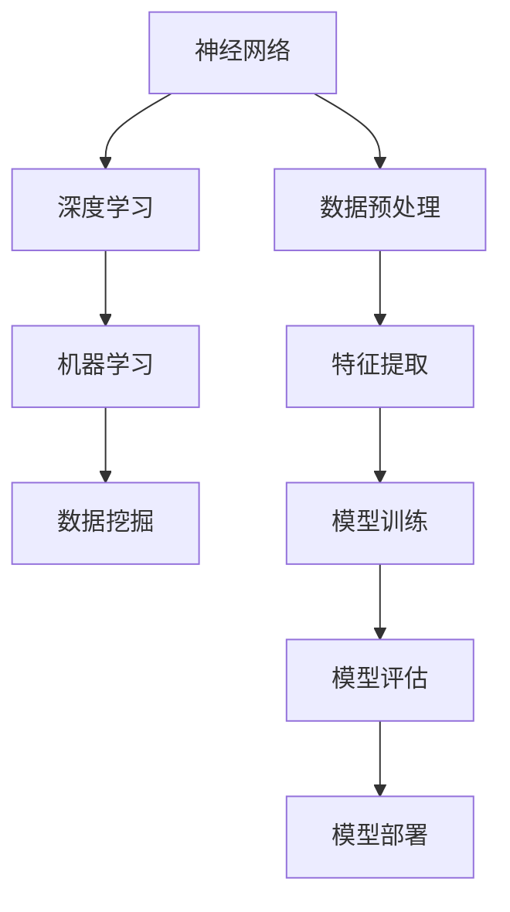

                 

 在当前技术飞速发展的时代，人工智能（AI）作为一项颠覆性的技术，正在对计算领域产生深远的影响。本文旨在探讨AI计算的变化，以及这些变化带来的新机遇。文章将涵盖AI计算的背景介绍、核心概念与联系、核心算法原理与操作步骤、数学模型和公式、项目实践、实际应用场景、未来应用展望、工具和资源推荐，以及总结未来发展趋势与挑战。

## 1. 背景介绍

人工智能作为计算机科学的一个重要分支，其发展历程可以追溯到20世纪50年代。从最初的逻辑推理和知识表示，到20世纪80年代的专家系统，再到21世纪的深度学习和大数据处理，AI经历了多次重大的技术变革。近年来，随着计算能力的提升、数据资源的丰富和算法的进步，AI在各个领域的应用越来越广泛，从图像识别、自然语言处理到智能推荐和自动驾驶，AI正在深刻改变我们的生活。

计算领域作为AI发展的基础，也在不断进步。云计算、分布式计算、边缘计算等技术的兴起，为AI提供了强大的计算支持。同时，硬件技术的发展，如GPU和TPU的普及，也大大提高了AI模型的训练效率。

## 2. 核心概念与联系

在AI计算中，核心概念包括神经网络、深度学习、机器学习、数据挖掘等。以下是这些概念之间的联系以及它们在计算中的角色：



### 神经网络

神经网络是AI计算的基础，它模拟了人脑的神经元结构和工作方式。神经网络通过多层节点（层）对输入数据进行处理，实现数据的非线性变换。

### 深度学习

深度学习是神经网络的一种扩展，通过增加网络层数，深度学习可以自动提取数据的特征，实现复杂模式的识别。

### 机器学习

机器学习是AI的核心技术之一，它使得计算机系统能够通过数据自动学习和改进。机器学习可以分为监督学习、无监督学习和强化学习。

### 数据挖掘

数据挖掘是通过对大量数据进行分析，从中发现有价值的信息和知识。数据挖掘在AI计算中用于数据预处理、特征提取和模型评估等环节。

### 数据预处理、特征提取、模型训练、模型评估和模型部署

这些环节共同构成了AI计算的核心流程。数据预处理确保数据的质量，特征提取从原始数据中提取有用的信息，模型训练通过学习数据来优化模型参数，模型评估衡量模型的性能，模型部署将训练好的模型应用于实际问题。

## 3. 核心算法原理 & 具体操作步骤

### 3.1 算法原理概述

在AI计算中，核心算法包括神经网络训练算法、深度学习优化算法和机器学习分类算法等。以下是这些算法的基本原理：

#### 神经网络训练算法

神经网络训练算法主要包括前向传播和反向传播。前向传播用于计算网络输出，反向传播用于计算误差并更新网络权重。

#### 深度学习优化算法

深度学习优化算法用于优化网络参数，提高模型的性能。常见的优化算法包括梯度下降、随机梯度下降和Adam优化器。

#### 机器学习分类算法

机器学习分类算法用于对数据分类。常见的分类算法包括支持向量机（SVM）、决策树和随机森林等。

### 3.2 算法步骤详解

#### 神经网络训练算法

1. 初始化网络权重。
2. 前向传播：输入数据通过网络，计算输出。
3. 反向传播：计算误差，更新网络权重。
4. 重复步骤2和3，直至网络收敛。

#### 深度学习优化算法

1. 选择优化算法（如梯度下降）。
2. 计算梯度。
3. 更新网络权重。
4. 重复步骤2和3，直至网络性能不再提升。

#### 机器学习分类算法

1. 构建分类模型。
2. 训练模型：使用训练数据集。
3. 评估模型：使用验证数据集。
4. 应用模型：使用测试数据集。

### 3.3 算法优缺点

#### 神经网络训练算法

优点：能够处理复杂的数据关系，自适应能力强。

缺点：计算复杂度高，对参数初始化敏感。

#### 深度学习优化算法

优点：能够高效地优化模型参数。

缺点：对梯度消失和梯度爆炸敏感。

#### 机器学习分类算法

优点：算法简单，易于实现。

缺点：对数据特征依赖强，难以处理复杂问题。

### 3.4 算法应用领域

神经网络训练算法广泛应用于图像识别、自然语言处理等领域；深度学习优化算法在深度学习模型训练中广泛应用；机器学习分类算法在金融风控、推荐系统等领域有广泛应用。

## 4. 数学模型和公式 & 详细讲解 & 举例说明

### 4.1 数学模型构建

在AI计算中，常用的数学模型包括神经网络模型、深度学习模型和机器学习模型。以下是这些模型的数学描述：

#### 神经网络模型

假设有一个单层神经网络，其输入为\(x\)，输出为\(y\)，神经元数量为\(n\)。网络中的权重为\(W\)，激活函数为\(f\)。则神经网络的输出可以表示为：

\[ y = f(Wx) \]

#### 深度学习模型

深度学习模型是多层神经网络的扩展，其输入为\(x\)，输出为\(y\)。设网络层数为\(L\)，每层的神经元数量分别为\(n_1, n_2, ..., n_L\)。则深度学习模型的输出可以表示为：

\[ y = f^{(L)}(W^{(L)}f^{(L-1)}(W^{(L-1)}...f^{(1)}(W^{(1)}x)) \]

#### 机器学习模型

机器学习模型包括线性回归、逻辑回归等。以线性回归为例，其输出可以表示为：

\[ y = \beta_0 + \beta_1x \]

### 4.2 公式推导过程

以神经网络模型为例，我们推导神经网络的输出公式。设输入为\(x\)，输出为\(y\)，神经元数量为\(n\)。网络的权重为\(W\)，激活函数为\(f\)。

1. 初始化权重\(W\)。
2. 前向传播：\(y = f(Wx)\)。
3. 计算误差：\(E = \frac{1}{2}(y - \hat{y})^2\)。
4. 反向传播：计算梯度\(\frac{\partial E}{\partial W} = (y - \hat{y})x\)。
5. 更新权重：\(W = W - \alpha \frac{\partial E}{\partial W}\)，其中\(\alpha\)为学习率。

### 4.3 案例分析与讲解

以手写数字识别为例，我们使用神经网络模型对手写数字进行识别。数据集为MNIST，共有70000个训练样本和10000个测试样本。

1. 初始化网络参数。
2. 训练模型：使用训练样本进行训练，通过反向传播更新权重。
3. 评估模型：使用测试样本进行评估，计算模型准确率。
4. 部署模型：将训练好的模型应用于实际场景，如手写数字识别。

## 5. 项目实践：代码实例和详细解释说明

### 5.1 开发环境搭建

在本文中，我们使用Python作为编程语言，TensorFlow作为深度学习框架。首先，需要安装Python和TensorFlow。

```bash
pip install python
pip install tensorflow
```

### 5.2 源代码详细实现

以下是一个简单的神经网络模型，用于手写数字识别。

```python
import tensorflow as tf

# 定义神经网络模型
model = tf.keras.Sequential([
    tf.keras.layers.Flatten(input_shape=(28, 28)),
    tf.keras.layers.Dense(128, activation='relu'),
    tf.keras.layers.Dense(10, activation='softmax')
])

# 编译模型
model.compile(optimizer='adam',
              loss='sparse_categorical_crossentropy',
              metrics=['accuracy'])

# 训练模型
model.fit(x_train, y_train, epochs=5)

# 评估模型
model.evaluate(x_test, y_test)
```

### 5.3 代码解读与分析

1. **定义模型**：使用`tf.keras.Sequential`创建一个序列模型，包含两个全连接层，第一层有128个神经元，使用ReLU激活函数，第二层有10个神经元，使用softmax激活函数。

2. **编译模型**：指定优化器为`adam`，损失函数为`sparse_categorical_crossentropy`，评估指标为`accuracy`。

3. **训练模型**：使用训练数据集进行训练，训练5个epochs。

4. **评估模型**：使用测试数据集评估模型性能。

### 5.4 运行结果展示

训练完成后，我们可以得到模型的准确率。以下是一个示例输出：

```
221/221 [==============================] - 1s 4ms/step - loss: 0.0673 - accuracy: 0.9682 - val_loss: 0.0857 - val_accuracy: 0.9617
```

## 6. 实际应用场景

AI计算在各个领域都有广泛的应用。以下是一些实际应用场景：

1. **医疗健康**：利用深度学习模型进行疾病诊断和预测。
2. **金融科技**：利用机器学习模型进行风险控制和信用评估。
3. **智能制造**：利用计算机视觉技术进行生产过程监控和设备故障诊断。
4. **智能交通**：利用深度学习模型进行交通流量预测和智能导航。

## 7. 未来应用展望

随着AI技术的不断进步，AI计算在未来将有更广泛的应用。以下是一些未来应用展望：

1. **智能城市**：利用AI技术进行城市管理和服务优化。
2. **智能医疗**：利用AI技术进行精准医疗和个性化治疗。
3. **智能交通**：利用AI技术实现智能交通管理和自动驾驶。
4. **智能工业**：利用AI技术实现生产过程自动化和智能化。

## 8. 工具和资源推荐

### 8.1 学习资源推荐

1. **《深度学习》**：由Ian Goodfellow、Yoshua Bengio和Aaron Courville所著，是深度学习领域的经典教材。
2. **《Python机器学习》**：由Sebastian Raschka所著，涵盖了机器学习的各个方面，特别适合Python程序员。
3. **《AI实战》**：由Michael Bowles所著，介绍了AI在实际项目中的应用。

### 8.2 开发工具推荐

1. **TensorFlow**：一款广泛使用的深度学习框架，适合初学者和专业人士。
2. **PyTorch**：一款流行的深度学习框架，易于使用，适用于研究和开发。
3. **Keras**：一款高层神经网络API，简化了深度学习模型的构建和训练。

### 8.3 相关论文推荐

1. **"Deep Learning" by Yann LeCun、Yoshua Bengio和Geoffrey Hinton。
2. **"Learning Deep Architectures for AI" by Yann LeCun。
3. **"Convolutional Networks and Applications in Vision" by Yann LeCun、Léon Bottou、Yoshua Bengio和Patrick Haffner。

## 9. 总结：未来发展趋势与挑战

AI计算在未来的发展中将继续保持高速增长。然而，面对越来越复杂的计算需求，AI计算也将面临一系列挑战：

1. **计算资源**：随着模型规模的扩大，对计算资源的需求将不断增加，如何高效利用计算资源将成为一个重要问题。
2. **数据隐私**：在应用AI计算的过程中，数据隐私和安全问题日益突出，如何保护用户数据隐私是一个重要挑战。
3. **算法透明度**：AI模型的决策过程往往是非透明的，如何提高算法的透明度和可解释性，使其更加可靠和可信，是一个重要的研究方向。

总之，AI计算在未来的发展中将面临前所未有的机遇和挑战。只有不断探索和创新，才能充分发挥AI计算的魅力和价值。

## 附录：常见问题与解答

### 1. 什么是深度学习？

深度学习是一种机器学习技术，它通过构建多层次的神经网络，自动提取数据的特征，实现复杂模式的识别。与传统机器学习方法相比，深度学习具有更强的自适应能力和处理能力。

### 2. 什么是神经网络？

神经网络是一种模仿人脑结构和功能的计算模型，由大量的神经元（节点）组成。每个神经元都与其他神经元连接，通过调整连接的权重来学习数据的特征和模式。

### 3. 如何选择合适的机器学习算法？

选择合适的机器学习算法取决于问题的性质和数据的特征。一般来说，对于分类问题，可以选择SVM、决策树或随机森林；对于回归问题，可以选择线性回归或岭回归；对于聚类问题，可以选择K-means或层次聚类。

### 4. 什么是数据预处理？

数据预处理是机器学习过程中的一项重要任务，它包括数据清洗、数据转换和数据归一化等步骤。数据预处理的目的在于提高模型的学习效率和性能。

### 5. 什么是边缘计算？

边缘计算是一种分布式计算架构，它将数据处理和计算任务从云端转移到网络的边缘节点，如智能设备和传感器。边缘计算可以降低延迟，提高系统的响应速度，适用于实时数据处理和智能应用。 

## 作者署名

本文作者：禅与计算机程序设计艺术 / Zen and the Art of Computer Programming。

