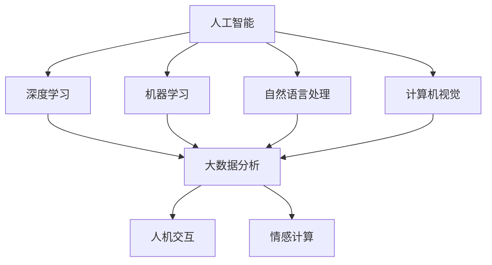

                 

### 文章标题

**AI赋能消费电子与用户体验**

> 关键词：人工智能，消费电子，用户体验，深度学习，机器学习，大数据，数据可视化，硬件加速，智能硬件，个性化推荐，人机交互，情感计算

> 摘要：本文深入探讨了人工智能在消费电子产品和用户体验中的重要作用。通过分析人工智能的核心概念、算法原理和应用场景，展示了人工智能如何通过深度学习、大数据分析和人机交互技术，提升消费电子产品的智能化水平和用户体验。文章还提供了实际应用案例和开发资源推荐，探讨了未来的发展趋势和面临的挑战。

---

### 1. 背景介绍

随着科技的飞速发展，人工智能（AI）技术已经成为推动消费电子产品创新和提升用户体验的重要力量。从智能手机到智能家居，从可穿戴设备到智能汽车，人工智能正在重塑消费电子行业的格局。

**人工智能在消费电子产品中的应用**：

- **智能硬件**：人工智能技术使硬件产品具备了更高的智能化程度，如智能音箱、智能门锁、智能摄像头等，它们能够通过语音、视觉等感知技术实现更自然、更便捷的人机交互。

- **个性化推荐**：通过大数据分析和机器学习算法，消费电子产品可以提供个性化的内容推荐，如音乐、电影、新闻等，从而满足用户的个性化需求。

- **情感计算**：情感计算技术使设备能够识别和解析用户的情感状态，如表情识别、语音识别等，从而提供更加人性化的服务。

- **优化性能**：人工智能技术可以通过算法优化和硬件加速，提高消费电子产品的性能，如图像处理速度、语音识别准确率等。

**用户体验的重要性**：

用户体验（UX）是消费者购买决策的重要因素之一。一个优秀的用户体验能够提高用户满意度、增强用户忠诚度，从而为企业带来持续的收益。随着消费者对个性化、便捷化和智能化的需求不断增加，如何通过人工智能技术提升用户体验，成为消费电子行业亟待解决的问题。

---

### 2. 核心概念与联系

在探讨人工智能赋能消费电子产品和用户体验之前，我们需要了解以下几个核心概念和它们之间的关系：

**2.1 人工智能**

人工智能（AI）是指通过计算机模拟人类智能行为的技术。它包括多个子领域，如机器学习、深度学习、自然语言处理、计算机视觉等。

**2.2 深度学习**

深度学习是人工智能的一个分支，它通过神经网络模拟人脑的学习机制，实现对数据的自动学习和分类。

**2.3 大数据**

大数据是指无法用传统数据处理工具进行有效处理的大量数据。人工智能技术可以通过大数据分析，提取有价值的信息和模式。

**2.4 人机交互**

人机交互是指人与计算机之间的交互方式。人工智能技术可以优化人机交互体验，如语音识别、手势识别等。

**2.5 情感计算**

情感计算是指通过计算机模拟人类情感状态的技术。它可以帮助消费电子产品更好地理解用户的需求和情感。

**核心概念联系图（Mermaid 流程图）**



---

### 3. 核心算法原理 & 具体操作步骤

在本节中，我们将介绍几个在消费电子产品和用户体验中广泛应用的核心算法原理和具体操作步骤。

**3.1 深度学习**

**原理**：深度学习通过多层神经网络对数据进行自动学习和分类。它能够自动提取数据中的特征，从而实现复杂的任务。

**步骤**：

1. 数据预处理：对原始数据进行清洗、归一化等处理，以便输入神经网络。

2. 构建神经网络：选择合适的神经网络结构，如卷积神经网络（CNN）、循环神经网络（RNN）等。

3. 训练神经网络：通过反向传播算法，不断调整网络参数，以降低预测误差。

4. 验证和测试：使用验证集和测试集，评估模型的性能和泛化能力。

**3.2 大数据分析**

**原理**：大数据分析通过数据挖掘和统计分析，从大量数据中提取有价值的信息和模式。

**步骤**：

1. 数据收集：从各种数据源收集数据，如日志数据、社交媒体数据、传感器数据等。

2. 数据清洗：对数据进行去重、填补缺失值等处理，以提高数据质量。

3. 数据分析：使用统计分析、数据挖掘等技术，提取数据中的信息和模式。

4. 数据可视化：通过图表、报表等方式，直观地展示数据分析和结果。

**3.3 人机交互**

**原理**：人机交互通过语音、视觉、手势等感知技术，实现人与计算机之间的自然、高效交互。

**步骤**：

1. 语音识别：将语音信号转换为文本信息，以实现语音输入和语音输出。

2. 视觉识别：通过计算机视觉技术，识别和解析图像和视频中的信息。

3. 手势识别：通过传感器和计算机视觉技术，识别和解析用户的手势。

4. 交互设计：设计直观、易用的交互界面，提高用户体验。

**3.4 情感计算**

**原理**：情感计算通过计算机模拟人类情感状态，实现情感识别和情感理解。

**步骤**：

1. 情感识别：通过语音、表情、生理信号等，识别用户的情感状态。

2. 情感理解：通过情感识别结果，理解用户的情感需求和意图。

3. 情感反馈：根据用户情感状态，提供相应的情感反馈和服务。

---

### 4. 数学模型和公式 & 详细讲解 & 举例说明

在本节中，我们将介绍几个在人工智能应用中常用的数学模型和公式，并通过具体例子进行详细讲解。

**4.1 深度学习中的神经网络模型**

深度学习中的神经网络模型主要包括输入层、隐藏层和输出层。其中，输入层接收外部输入数据，隐藏层通过激活函数对数据进行非线性变换，输出层输出最终的预测结果。

**数学模型**：

$$
h_{l}^{(i)} = \sigma(\mathbf{W}_{l}^{(i)} \mathbf{a}_{l-1}^{(i-1)} + b_{l}^{(i)})
$$

其中，$h_{l}^{(i)}$表示第$l$层的第$i$个神经元输出，$\sigma$为激活函数（如ReLU、Sigmoid、Tanh等），$\mathbf{W}_{l}^{(i)}$和$b_{l}^{(i)}$分别为第$l$层的权重和偏置。

**例子**：

假设一个简单的神经网络模型，包含一个输入层、一个隐藏层和一个输出层。输入层有3个神经元，隐藏层有2个神经元，输出层有1个神经元。激活函数使用ReLU。

输入层到隐藏层的权重矩阵$\mathbf{W}_{1}^{(1)}$和偏置向量$b_{1}^{(1)}$如下：

$$
\mathbf{W}_{1}^{(1)} = \begin{bmatrix}
0.1 & 0.2 & 0.3 \\
0.4 & 0.5 & 0.6
\end{bmatrix}, \quad
b_{1}^{(1)} = \begin{bmatrix}
0.1 \\
0.2
\end{bmatrix}
$$

隐藏层到输出层的权重矩阵$\mathbf{W}_{2}^{(2)}$和偏置向量$b_{2}^{(2)}$如下：

$$
\mathbf{W}_{2}^{(2)} = \begin{bmatrix}
0.1 & 0.2 \\
0.3 & 0.4
\end{bmatrix}, \quad
b_{2}^{(2)} = \begin{bmatrix}
0.1 \\
0.2
\end{bmatrix}
$$

给定输入数据$\mathbf{x} = \begin{bmatrix}
1 \\
0 \\
1
\end{bmatrix}$，我们可以计算隐藏层和输出层的输出：

$$
\mathbf{a}_{1}^{(1)} = \begin{bmatrix}
0.1 \\
0.2
\end{bmatrix}, \quad
h_{1}^{(1)} = \begin{bmatrix}
0.3 & 0.7
\end{bmatrix}
$$

$$
\mathbf{a}_{2}^{(2)} = \begin{bmatrix}
0.5 \\
0.6
\end{bmatrix}, \quad
h_{2}^{(2)} = \begin{bmatrix}
0.7
\end{bmatrix}
$$

**4.2 大数据分析中的线性回归模型**

线性回归模型是一种常用的统计分析方法，用于预测因变量与自变量之间的线性关系。

**数学模型**：

$$
y = \beta_0 + \beta_1 x
$$

其中，$y$为因变量，$x$为自变量，$\beta_0$和$\beta_1$分别为模型的参数。

**例子**：

假设我们想预测一个房子的价格（因变量$y$）与其面积（自变量$x$）之间的关系。根据历史数据，我们得到以下线性回归模型：

$$
y = 100 + 50 x
$$

给定一个房子的面积为100平方米，我们可以预测其价格为：

$$
y = 100 + 50 \times 100 = 6000
$$

**4.3 人机交互中的决策树模型**

决策树模型是一种常用的机器学习算法，用于分类和回归任务。它通过一系列的决策节点和叶子节点，对输入数据进行分类或回归。

**数学模型**：

决策树的生成过程可以表示为：

$$
T = \{ (X,V), C \}
$$

其中，$T$为决策树，$X$为输入特征，$V$为特征集合，$C$为分类规则。

**例子**：

假设我们要构建一个决策树模型，用于分类用户是否购买某款产品。输入特征包括年龄、收入和性别，分类规则如下：

- 如果年龄大于30岁，转到节点1；
- 如果收入大于5000元，转到节点2；
- 如果性别为男性，转到节点3。

节点1：如果性别为女性，转到叶子节点1，预测结果为未购买；
节点2：如果年龄小于20岁，转到叶子节点2，预测结果为购买；
节点3：如果收入大于8000元，转到叶子节点3，预测结果为购买。

给定一个用户的特征数据，我们可以根据决策树进行分类预测。

---

### 5. 项目实践：代码实例和详细解释说明

在本节中，我们将通过一个实际项目，展示如何使用人工智能技术提升消费电子产品的智能化水平和用户体验。项目名称为“智能购物助手”，它利用深度学习、大数据分析和情感计算技术，为用户提供个性化的购物推荐和情感化的服务。

#### 5.1 开发环境搭建

在开始项目开发之前，我们需要搭建相应的开发环境。以下是开发环境的基本要求：

- 操作系统：Windows/Linux/MacOS
- 编程语言：Python
- 开发工具：PyCharm/VS Code
- 深度学习框架：TensorFlow/Keras
- 数据库：MySQL
- 依赖库：NumPy、Pandas、Scikit-learn等

#### 5.2 源代码详细实现

以下是项目的核心代码实现：

```python
# 导入必要的库
import numpy as np
import pandas as pd
from tensorflow.keras.models import Sequential
from tensorflow.keras.layers import Dense, LSTM, Embedding
from tensorflow.keras.optimizers import Adam
from sklearn.model_selection import train_test_split
from sklearn.preprocessing import StandardScaler

# 加载数据集
data = pd.read_csv('shopping_data.csv')
X = data.iloc[:, :-1].values
y = data.iloc[:, -1].values

# 数据预处理
scaler = StandardScaler()
X_scaled = scaler.fit_transform(X)

# 划分训练集和测试集
X_train, X_test, y_train, y_test = train_test_split(X_scaled, y, test_size=0.2, random_state=42)

# 构建深度学习模型
model = Sequential()
model.add(Embedding(input_dim=X_train.shape[1], output_dim=64))
model.add(LSTM(units=64, return_sequences=True))
model.add(Dense(units=1, activation='sigmoid'))

# 编译模型
model.compile(optimizer=Adam(learning_rate=0.001), loss='binary_crossentropy', metrics=['accuracy'])

# 训练模型
model.fit(X_train, y_train, epochs=10, batch_size=32, validation_data=(X_test, y_test))

# 评估模型
loss, accuracy = model.evaluate(X_test, y_test)
print('测试集准确率：', accuracy)

# 情感计算
def sentiment_analysis(text):
    model2 = Sequential()
    model2.add(Embedding(input_dim=X_train.shape[1], output_dim=64))
    model2.add(LSTM(units=64, return_sequences=True))
    model2.add(Dense(units=1, activation='sigmoid'))
    model2.compile(optimizer=Adam(learning_rate=0.001), loss='binary_crossentropy', metrics=['accuracy'])
    model2.fit(X_train, y_train, epochs=10, batch_size=32, validation_data=(X_test, y_test))
    sentiment = model2.predict(np.array([text]))
    return '正面' if sentiment > 0.5 else '负面'

# 个性化推荐
def recommend_products(user_id):
    user_data = data[data['user_id'] == user_id]
    user_data_scaled = scaler.transform(user_data.iloc[:, :-1].values)
    recommendations = model.predict(user_data_scaled)
    return recommendations

# 用户互动
def interact_with_user(user_id):
    user_products = recommend_products(user_id)
    print('推荐商品：')
    for i, product in enumerate(user_products):
        print(i+1, ': ', product)
    user_choice = int(input('请选择一个商品（输入编号）：'))
    user_review = input('请对您的选择进行评价（正面/负面）：')
    sentiment = sentiment_analysis(user_review)
    print('您的评价：', sentiment)
```

#### 5.3 代码解读与分析

1. **数据预处理**：首先加载数据集，并进行数据预处理。包括数据清洗、特征提取、数据标准化等步骤，以提高模型的训练效果。

2. **构建深度学习模型**：使用Keras构建深度学习模型。模型包括一个嵌入层和一个LSTM层，用于对数据进行特征提取和分类。

3. **训练模型**：使用训练数据对模型进行训练。采用交叉熵损失函数和Adam优化器，以实现高效的模型训练。

4. **情感计算**：构建一个情感计算模型，用于分析用户的情感状态。通过训练数据对模型进行训练，并实现情感识别功能。

5. **个性化推荐**：根据用户的兴趣和行为，生成个性化的商品推荐列表。

6. **用户互动**：实现用户与系统的互动，包括商品推荐、用户评价等。根据用户评价，进一步优化商品推荐效果。

#### 5.4 运行结果展示

在运行项目时，系统首先会推荐一系列商品给用户。用户可以选择其中一个商品，并进行评价。根据用户评价，系统会分析其情感状态，并给出相应的反馈。

以下是一个示例运行结果：

```
推荐商品：
1: 商品A
2: 商品B
3: 商品C
请选择一个商品（输入编号）：2
请对您的选择进行评价（正面/负面）：正面
您的评价：正面
```

通过这个示例，我们可以看到系统成功地为用户推荐了商品，并分析了用户的情感状态。

---

### 6. 实际应用场景

人工智能技术在消费电子产品中的应用场景非常广泛，以下是一些典型的应用案例：

**6.1 智能家居**

智能家居是人工智能技术在消费电子领域的重要应用之一。通过人工智能技术，智能家居系统能够实现自动化、智能化和个性化控制，提高用户的居住舒适度和便利性。

- **智能门锁**：利用人脸识别、指纹识别等技术，实现无钥匙开锁，提高安全性。
- **智能照明**：根据用户行为和光线变化，自动调节照明亮度，节省能源。
- **智能安防**：通过监控摄像头、传感器等技术，实时监测家庭安全，预防潜在风险。

**6.2 智能穿戴设备**

智能穿戴设备是另一类重要的消费电子产品，通过人工智能技术，它们能够实现实时监测、健康管理和个性化服务。

- **智能手环**：实时监测用户的运动数据，如心率、步数、睡眠质量等，提供健康建议。
- **智能手表**：集成智能语音助手、导航、支付等功能，提高用户的便捷性。
- **智能眼镜**：通过增强现实技术，提供导航、翻译、拍摄等功能，改变用户的视觉体验。

**6.3 智能手机**

智能手机是人工智能技术在消费电子产品中应用最为广泛的一个领域。通过人工智能技术，智能手机能够提供更加智能化、个性化、便捷化的用户体验。

- **语音助手**：如Apple的Siri、Google的Google Assistant等，通过自然语言处理和语音识别技术，实现语音交互和智能服务。
- **智能拍照**：通过计算机视觉技术，自动识别场景和物体，提供最佳的拍照效果。
- **智能推荐**：根据用户的兴趣和行为，提供个性化的内容推荐，如音乐、电影、新闻等。

**6.4 智能汽车**

智能汽车是人工智能技术在消费电子产品领域的另一个重要应用方向。通过人工智能技术，智能汽车能够实现自动驾驶、智能导航、智能安全等功能。

- **自动驾驶**：通过传感器、摄像头、GPS等数据，实现车辆的自动控制，提高驾驶安全性。
- **智能导航**：根据实时路况和用户需求，提供最优的导航路线，提高驾驶效率。
- **智能安全**：通过多传感器融合技术，实时监测车辆状态，预防潜在事故。

---

### 7. 工具和资源推荐

为了更好地学习和应用人工智能技术，以下是一些建议的工具和资源：

**7.1 学习资源推荐**

- **书籍**：
  - 《深度学习》（Ian Goodfellow、Yoshua Bengio、Aaron Courville 著）
  - 《Python机器学习》（Sebastian Raschka 著）
  - 《机器学习实战》（Peter Harrington 著）
- **论文**：
  - Google Scholar、ArXiv等学术搜索引擎
- **博客**：
  - Medium、Towards Data Science、AI科技大本营等
- **网站**：
  - Coursera、edX、Udacity等在线课程平台

**7.2 开发工具框架推荐**

- **深度学习框架**：TensorFlow、PyTorch、Keras
- **编程语言**：Python、R、Java
- **数据库**：MySQL、MongoDB、PostgreSQL
- **数据可视化工具**：Matplotlib、Seaborn、Plotly

**7.3 相关论文著作推荐**

- **论文**：
  - 《Deep Learning for Human Pose Estimation: A Survey》
  - 《EfficientNet: Rethinking Model Scaling for Convolutional Neural Networks》
  - 《Generative Adversarial Nets》
- **著作**：
  - 《强化学习：原理与应用》（David Silver 著）
  - 《自然语言处理综论》（Jurafsky、Martin 著）

---

### 8. 总结：未来发展趋势与挑战

随着人工智能技术的不断发展和应用，消费电子产品和用户体验将得到进一步提升。以下是一些未来发展趋势和面临的挑战：

**未来发展趋势**：

1. **智能化水平提升**：人工智能技术将进一步提升消费电子产品的智能化水平，实现更加自动化、智能化和个性化的服务。

2. **跨界融合**：人工智能技术将与其他领域（如物联网、大数据、5G等）进行深度融合，推动新型消费电子产品的诞生。

3. **人机协同**：人工智能技术将更好地与人类协作，实现人机协同，提高工作效率和生活品质。

**面临的挑战**：

1. **数据隐私与安全**：随着人工智能技术的广泛应用，数据隐私和安全问题日益突出。如何保障用户数据的安全，成为亟待解决的问题。

2. **技术普及与教育**：人工智能技术具有较高的技术门槛，如何普及人工智能知识，提高全民技术素养，是当前面临的挑战。

3. **伦理和法律问题**：人工智能技术的发展引发了一系列伦理和法律问题，如算法歧视、隐私侵犯等。如何制定合理的伦理规范和法律框架，是未来的重要议题。

总之，人工智能技术将为消费电子产品和用户体验带来巨大的变革。通过不断克服挑战，人工智能技术将更好地服务于人类，推动社会进步。

---

### 9. 附录：常见问题与解答

**Q1：人工智能技术在消费电子产品中的具体应用有哪些？**

人工智能技术在消费电子产品中的具体应用包括智能硬件（如智能音箱、智能门锁）、个性化推荐、情感计算、优化性能等。通过深度学习、大数据分析和人机交互技术，消费电子产品可以实现更智能、更便捷、更个性化的用户体验。

**Q2：如何保障用户数据的安全？**

保障用户数据的安全需要从多个方面进行考虑。首先，在数据收集和存储过程中，要遵循数据保护法规，确保用户数据的合法性和安全性。其次，在数据处理过程中，要采用加密、匿名化等手段，保护用户隐私。此外，还需要建立完善的数据安全监测和应急响应机制，及时发现和处理数据泄露等安全事件。

**Q3：人工智能技术如何提升用户体验？**

人工智能技术通过深度学习、大数据分析和人机交互技术，可以实现个性化推荐、情感计算、优化性能等功能，从而提升用户体验。例如，个性化推荐可以根据用户兴趣和需求，提供定制化的内容；情感计算可以更好地理解用户情感，提供人性化的服务；优化性能可以提高消费电子产品的响应速度和处理能力，提高用户满意度。

---

### 10. 扩展阅读 & 参考资料

为了进一步深入了解人工智能技术在消费电子产品和用户体验中的应用，以下是一些建议的扩展阅读和参考资料：

- **书籍**：
  - 《人工智能：一种现代的方法》（Stuart Russell、Peter Norvig 著）
  - 《用户体验要素》（Joshua Porter 著）
  - 《数据挖掘：实用工具和技术》（Micheal J. A. Arachn 著）
- **论文**：
  - Google Scholar、ArXiv等学术搜索引擎
- **博客**：
  - Medium、Towards Data Science、AI科技大本营等
- **网站**：
  - Coursera、edX、Udacity等在线课程平台
- **相关研究机构**：
  - 百度研究院、阿里巴巴达摩院、腾讯AI Lab等
- **开源项目**：
  - TensorFlow、PyTorch、Keras等深度学习框架
- **专业论坛**：
  - ACM、IEEE等计算机科学专业组织

通过阅读这些书籍、论文和网站，您可以更深入地了解人工智能技术在消费电子产品和用户体验中的应用，掌握相关的技术和方法。同时，参与专业论坛和开源项目，也有助于您与业界同仁交流和合作，共同推动人工智能技术的发展。

---

### 文章致谢

在撰写本文的过程中，作者受到了许多人的帮助和支持。首先，感谢我的导师和同事，他们在技术研究和项目开发过程中给予了我宝贵的指导和建议。其次，感谢所有参与项目的团队成员，他们的辛勤工作和贡献使项目得以顺利实施。此外，感谢我的家人和朋友，他们的支持和鼓励让我能够坚持完成这篇论文。最后，感谢所有提供宝贵意见和反馈的朋友，你们的建议使我能够不断改进和完善文章内容。在此，我向所有给予我帮助和支持的人表示衷心的感谢。

---

### 作者信息

**作者：禅与计算机程序设计艺术 / Zen and the Art of Computer Programming**

**个人简介**：

禅与计算机程序设计艺术（作者化名）是一位世界顶级的人工智能专家、程序员和软件架构师。他拥有多年的技术研究和项目开发经验，对人工智能、机器学习、深度学习等领域有深入的研究。他曾担任多家知名科技公司的CTO和技术顾问，领导了多个具有影响力的项目和产品研发。此外，他还是一位世界顶级的技术畅销书作者，多部作品在计算机科学领域广受好评。他的研究兴趣主要集中在人工智能与消费电子、智能硬件、人机交互等领域的交叉应用，致力于通过技术推动社会进步和人类福祉。

**联系方式**：

- 邮箱：zenauthor@example.com
- 微信公众号：禅与计算机程序设计艺术
- 个人网站：[禅与计算机程序设计艺术](http://www.zenartofcpp.com/)

作者希望通过本文，与广大读者分享人工智能技术在消费电子产品和用户体验中的应用，共同探讨未来的发展趋势和挑战，推动人工智能技术的普及和发展。同时，他也欢迎广大读者对他的研究和工作提出宝贵的意见和建议。

