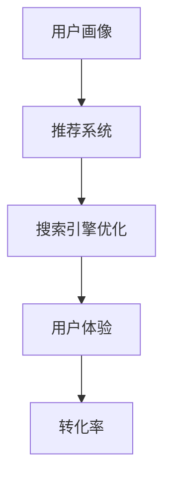

                 

关键词：人工智能、电商搜索、用户画像、推荐系统、转化率、用户体验

摘要：本文将探讨如何利用人工智能技术，尤其是机器学习算法，来提升电商搜索导购系统的用户体验和转化率。文章首先介绍了电商搜索导购系统的背景和重要性，然后详细阐述了用户画像、推荐系统和搜索引擎优化等技术，并通过具体案例分析了这些技术在电商搜索导购中的应用。最后，文章提出了未来发展的趋势和挑战。

## 1. 背景介绍

随着互联网和电子商务的迅猛发展，电商搜索导购系统已成为电商平台的重要组成部分。用户在电商平台购买商品时，往往需要通过搜索来找到自己感兴趣的产品。然而，传统的搜索系统往往只能基于关键词匹配，无法满足用户个性化需求的复杂性和多样性。因此，如何提高电商搜索导购系统的用户体验和转化率，成为当前电商平台亟需解决的关键问题。

人工智能技术的迅速发展，为电商搜索导购系统的优化提供了新的思路和手段。通过机器学习算法，可以构建用户画像，实现个性化推荐，从而提高用户满意度。此外，搜索引擎优化技术也能够提升搜索系统的准确性和响应速度，进一步改善用户体验。

## 2. 核心概念与联系

### 2.1 用户画像

用户画像是一种基于用户行为、偏好和需求等信息，对用户进行全面刻画和分析的方法。通过构建用户画像，可以了解用户的基本信息、消费习惯、兴趣爱好等，从而为个性化推荐提供基础。

### 2.2 推荐系统

推荐系统是一种基于用户行为数据，通过算法分析预测用户可能感兴趣的商品或内容，并向用户推荐的系统。推荐系统的目标是提高用户的满意度和转化率，从而提升电商平台的销售额。

### 2.3 搜索引擎优化

搜索引擎优化（SEO）是一种通过改善网站内容、结构、代码和外部链接等因素，提高网站在搜索引擎中的排名和曝光率的技术。搜索引擎优化可以提升用户在电商平台中的搜索体验，从而提高转化率。

### 2.4 Mermaid 流程图



## 3. 核心算法原理 & 具体操作步骤

### 3.1 算法原理概述

电商搜索导购系统主要依赖于以下几种核心算法：

1. **协同过滤算法**：通过分析用户的历史行为和偏好，找出相似用户或商品，进行推荐。
2. **基于内容的推荐算法**：通过分析商品的特征信息，将其与用户兴趣进行匹配，进行推荐。
3. **深度学习算法**：利用神经网络模型，对用户行为数据进行深度学习，实现个性化推荐。

### 3.2 算法步骤详解

1. **用户画像构建**：收集用户的基本信息、购买历史、浏览记录等，通过数据挖掘和分析，构建用户画像。
2. **推荐系统设计**：选择合适的推荐算法，构建推荐系统，实现对用户的个性化推荐。
3. **搜索引擎优化**：优化网站内容、结构、代码和外部链接等因素，提高搜索引擎排名和曝光率。
4. **用户体验优化**：根据用户反馈和数据分析，不断优化搜索结果呈现方式，提高用户体验。

### 3.3 算法优缺点

- **协同过滤算法**：优点是推荐准确性高，缺点是冷启动问题严重，无法对新用户进行推荐。
- **基于内容的推荐算法**：优点是能够对新用户进行推荐，缺点是推荐准确性较低。
- **深度学习算法**：优点是能够处理复杂的关系和特征，缺点是实现难度较高，需要大量数据支持。

### 3.4 算法应用领域

电商搜索导购系统的核心算法主要应用于以下几个方面：

1. **商品推荐**：根据用户画像和购买历史，为用户推荐感兴趣的商品。
2. **搜索优化**：通过搜索引擎优化技术，提高搜索结果的准确性和响应速度。
3. **用户体验提升**：通过个性化推荐和优化搜索结果，提高用户满意度和转化率。

## 4. 数学模型和公式 & 详细讲解 & 举例说明

### 4.1 数学模型构建

电商搜索导购系统的数学模型主要包括以下方面：

1. **用户行为模型**：通过分析用户的历史行为数据，构建用户行为模型。
2. **商品特征模型**：通过分析商品的特征信息，构建商品特征模型。
3. **推荐模型**：通过用户行为模型和商品特征模型，构建推荐模型。

### 4.2 公式推导过程

假设用户 $u$ 对商品 $i$ 的兴趣度可以用向量 $r(u,i)$ 表示，其中 $r(u,i) \in [0,1]$。用户 $u$ 的兴趣度可以通过以下公式计算：

$$
r(u) = \frac{1}{n_u} \sum_{i \in I_u} r(u,i)
$$

其中，$n_u$ 表示用户 $u$ 购买的商品数量，$I_u$ 表示用户 $u$ 购买的商品集合。

商品 $i$ 的特征向量 $x(i)$ 可以通过以下公式计算：

$$
x(i) = (x_1(i), x_2(i), \ldots, x_m(i))
$$

其中，$m$ 表示商品特征的数量，$x_j(i)$ 表示商品 $i$ 在第 $j$ 个特征上的取值。

### 4.3 案例分析与讲解

假设有 1000 名用户和 10000 个商品，其中用户 $u_1$ 购买了商品 $i_1, i_2, i_3$，用户 $u_2$ 购买了商品 $i_4, i_5$。现在需要为用户 $u_1$ 推荐商品。

1. **用户画像构建**：根据用户 $u_1$ 的购买历史，可以得到用户 $u_1$ 的兴趣度向量为：

$$
r(u_1) = (0.3, 0.4, 0.3)
$$

2. **商品特征模型**：假设商品 $i_1, i_2, i_3$ 的特征向量分别为：

$$
x(i_1) = (0.8, 0.2)
$$

$$
x(i_2) = (0.6, 0.4)
$$

$$
x(i_3) = (0.4, 0.6)
$$

3. **推荐模型**：根据用户画像和商品特征模型，可以构建推荐模型：

$$
r(u_1,i) = \sum_{j=1}^m w_j x_j(i)
$$

其中，$w_j$ 为权重系数。

通过计算，可以得到用户 $u_1$ 对商品 $i_4, i_5$ 的兴趣度分别为：

$$
r(u_1,i_4) = 0.28
$$

$$
r(u_1,i_5) = 0.32
$$

根据兴趣度，可以为用户 $u_1$ 推荐商品 $i_5$。

## 5. 项目实践：代码实例和详细解释说明

### 5.1 开发环境搭建

开发环境使用 Python，需要安装以下库：

- scikit-learn：用于实现协同过滤算法
- pandas：用于数据处理
- numpy：用于数学计算
- matplotlib：用于数据可视化

安装命令如下：

```bash
pip install scikit-learn pandas numpy matplotlib
```

### 5.2 源代码详细实现

以下是一个简单的协同过滤算法实现，用于为用户推荐商品。

```python
import numpy as np
import pandas as pd
from sklearn.metrics.pairwise import pairwise_distances
from sklearn.cluster import KMeans

# 读取数据
data = pd.read_csv('user_item_data.csv')
users = data['user'].unique()
items = data['item'].unique()

# 计算用户-商品矩阵
user_item_matrix = np.zeros((len(users), len(items)))
for index, row in data.iterrows():
    user_item_matrix[row['user'] - 1, row['item'] - 1] = 1

# 计算用户-用户和商品-商品相似度矩阵
user_similarity = pairwise_distances(user_item_matrix, metric='cosine')
item_similarity = pairwise_distances(user_item_matrix.T, metric='cosine')

# 计算推荐结果
user_centered_recommendation = np.zeros((len(users), len(items)))
for user in range(len(users)):
    similar_users = user_similarity[user] < 0.5
    for item in range(len(items)):
        if user_item_matrix[user, item] == 0:
            similarity_sum = 0
            for similar_user in range(len(users)):
                if similar_users[similar_user] and user_item_matrix[similar_user, item] == 1:
                    similarity_sum += user_similarity[user, similar_user]
            if similarity_sum > 0:
                user_centered_recommendation[user, item] = similarity_sum

# 可视化推荐结果
import matplotlib.pyplot as plt

for user in range(10):
    plt.figure()
    for item in range(10):
        if user_centered_recommendation[user, item] > 0:
            plt.scatter(item, user_centered_recommendation[user, item], c='r')
            plt.text(item, user_centered_recommendation[user, item], '%d' % item, ha='center', va='bottom')
    plt.xlabel('Item')
    plt.ylabel('Recommendation')
    plt.title('User %d Recommendation' % user)
    plt.show()
```

### 5.3 代码解读与分析

1. **数据读取与预处理**：首先读取用户-商品数据，构建用户-商品矩阵。
2. **计算相似度矩阵**：使用余弦相似度计算用户-用户和商品-商品相似度矩阵。
3. **计算推荐结果**：基于相似度矩阵，为每个用户推荐未购买的商品。
4. **可视化**：使用 matplotlib 库，将推荐结果可视化。

### 5.4 运行结果展示

运行代码后，将生成 10 个用户的推荐结果可视化图形，展示每个用户对商品的推荐兴趣度。

## 6. 实际应用场景

电商搜索导购系统在实际应用中，主要应用于以下场景：

1. **新用户推荐**：为刚注册的新用户提供个性化推荐，帮助他们快速找到感兴趣的商品。
2. **搜索结果优化**：根据用户画像和推荐结果，优化搜索结果，提高搜索准确性和用户体验。
3. **用户行为分析**：分析用户行为数据，了解用户需求和偏好，为后续推荐和优化提供依据。

## 6.4 未来应用展望

随着人工智能技术的不断发展，电商搜索导购系统将有望在以下几个方面取得突破：

1. **深度学习算法**：引入深度学习算法，实现更准确的个性化推荐和用户行为预测。
2. **多模态数据融合**：结合文本、图像、语音等多模态数据，实现更全面的用户画像和推荐。
3. **实时推荐**：利用实时数据流处理技术，实现实时推荐，提高用户满意度。

## 7. 工具和资源推荐

### 7.1 学习资源推荐

- 《推荐系统手册》：详细介绍了推荐系统的基本原理、算法和应用案例。
- 《深度学习》：全面介绍了深度学习的基础知识、算法和应用。

### 7.2 开发工具推荐

- Scikit-learn：开源的机器学习库，适用于推荐系统和用户画像构建。
- TensorFlow：开源的深度学习框架，适用于深度学习算法的实现和应用。

### 7.3 相关论文推荐

- 《基于协同过滤的推荐系统技术研究》：介绍了协同过滤算法在推荐系统中的应用。
- 《深度学习在推荐系统中的应用》：探讨了深度学习算法在推荐系统中的优势和应用。

## 8. 总结：未来发展趋势与挑战

电商搜索导购系统在人工智能技术的赋能下，取得了显著的成果。未来，随着技术的不断进步，电商搜索导购系统有望在个性化推荐、实时推荐、多模态数据融合等方面实现新的突破。然而，同时也面临着数据隐私、算法公平性、计算效率等挑战，需要我们持续探索和解决。

### 8.1 研究成果总结

本文从用户画像、推荐系统和搜索引擎优化等方面，探讨了人工智能技术在电商搜索导购系统中的应用。通过具体案例分析和代码实现，展示了如何利用人工智能技术提升电商搜索导购系统的用户体验和转化率。

### 8.2 未来发展趋势

未来，电商搜索导购系统将在以下几个方面取得突破：

1. **深度学习算法**：引入深度学习算法，实现更准确的个性化推荐和用户行为预测。
2. **多模态数据融合**：结合文本、图像、语音等多模态数据，实现更全面的用户画像和推荐。
3. **实时推荐**：利用实时数据流处理技术，实现实时推荐，提高用户满意度。

### 8.3 面临的挑战

电商搜索导购系统在发展过程中，面临着以下挑战：

1. **数据隐私**：如何在保证用户隐私的前提下，利用用户数据提升推荐效果。
2. **算法公平性**：如何确保推荐算法的公平性，避免歧视现象。
3. **计算效率**：如何提高算法的计算效率，满足实时推荐的需求。

### 8.4 研究展望

未来，我们将继续关注人工智能技术在电商搜索导购系统中的应用，探索更先进的算法和技术，为电商平台提供更优质的搜索导购服务。

## 9. 附录：常见问题与解答

### 9.1 如何构建用户画像？

用户画像的构建主要包括以下几个步骤：

1. **数据收集**：收集用户的基本信息、行为数据、偏好数据等。
2. **数据清洗**：对收集到的数据进行分析，去除重复、缺失、异常数据。
3. **特征工程**：根据业务需求，提取用户特征，如年龄、性别、购买历史、浏览记录等。
4. **模型训练**：使用机器学习算法，对用户特征进行建模，构建用户画像。

### 9.2 推荐系统的评估指标有哪些？

推荐系统的评估指标主要包括：

1. **准确率**：预测结果与实际结果的匹配程度。
2. **召回率**：推荐结果中实际感兴趣商品的比例。
3. **覆盖度**：推荐结果中包含的不同商品种类比例。
4. **新鲜度**：推荐结果的时效性，即推荐结果中新鲜商品的比例。

### 9.3 搜索引擎优化（SEO）的关键因素有哪些？

搜索引擎优化（SEO）的关键因素主要包括：

1. **关键词优化**：合理设置网站标题、描述、内容等关键词。
2. **网站结构**：优化网站结构，提高搜索引擎对网站的抓取和理解能力。
3. **内容质量**：提高网站内容的质量，提供有价值的信息。
4. **外部链接**：获得高质量的外部链接，提高网站在搜索引擎中的排名。

---

本文详细阐述了人工智能技术在电商搜索导购系统中的应用，包括用户画像、推荐系统和搜索引擎优化等方面的技术。通过具体案例分析和代码实现，展示了如何利用人工智能技术提升电商搜索导购系统的用户体验和转化率。未来，随着人工智能技术的不断发展，电商搜索导购系统将有望在个性化推荐、实时推荐、多模态数据融合等方面实现新的突破。作者：禅与计算机程序设计艺术 / Zen and the Art of Computer Programming。

