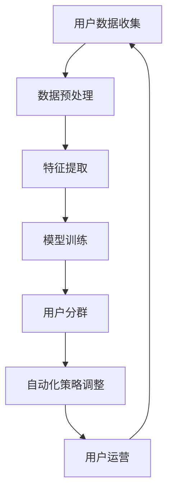

                 

### 1. 背景介绍

随着电子商务的迅速发展，用户分群成为电商平台优化运营策略、提升用户满意度和转化率的重要手段。然而，传统的用户分群方法往往依赖于人工经验和繁琐的数据处理，不仅效率低下，而且难以应对日益复杂的用户行为数据。

近年来，人工智能技术的崛起为用户分群提供了新的解决方案。AI赋能的电商用户分群自动化通过深度学习、数据挖掘等技术，实现了用户分群的高效化和智能化。这种自动化分群方法不仅能够快速识别出不同需求的用户群体，还能根据用户行为动态调整分群策略，从而为电商企业带来更高的运营效率和收益。

本文将深入探讨AI赋能的电商用户分群自动化的核心概念、算法原理、实现步骤以及实际应用场景，旨在为读者提供一个全面的技术解读和实践指南。文章结构如下：

1. 背景介绍
2. 核心概念与联系
3. 核心算法原理 & 具体操作步骤
4. 数学模型和公式 & 详细讲解 & 举例说明
5. 项目实践：代码实例和详细解释说明
6. 实际应用场景
7. 工具和资源推荐
8. 总结：未来发展趋势与挑战
9. 附录：常见问题与解答
10. 扩展阅读 & 参考资料

### 2. 核心概念与联系

在讨论AI赋能的电商用户分群自动化之前，我们需要明确几个核心概念：人工智能、用户分群、自动化。

**人工智能（AI）**：人工智能是指模拟、延伸和扩展人类智能的理论、方法、技术及应用。它包括机器学习、深度学习、自然语言处理、计算机视觉等多个子领域。

**用户分群**：用户分群是指将用户根据其行为、兴趣、购买历史等特征划分为不同的群体，以便于电商平台实施有针对性的营销策略。

**自动化**：自动化是指利用计算机程序和算法代替人工完成特定任务，从而提高工作效率。

在AI赋能的电商用户分群自动化中，上述概念相互联系，共同构成了一个完整的体系。具体来说，人工智能技术通过对用户数据的分析和挖掘，生成用户分群模型，进而实现用户分群的自动化。

下面，我们将使用Mermaid流程图（Mermaid Flowchart）展示AI赋能的电商用户分群自动化的基本流程，以便读者更直观地理解其工作原理。



**图 1. AI赋能的电商用户分群自动化流程图**

- **用户数据收集**：从电商平台收集用户行为数据，包括购买记录、浏览历史、评价等。
- **数据预处理**：对收集到的用户数据进行清洗、归一化等处理，以便后续分析。
- **特征提取**：从预处理后的数据中提取用户特征，如行为特征、兴趣特征、购买力特征等。
- **模型训练**：利用机器学习或深度学习算法对提取的特征进行训练，构建用户分群模型。
- **用户分群**：根据训练好的模型对用户进行分群，生成不同用户群体的标签。
- **自动化策略调整**：根据分群结果，自动化调整电商平台的运营策略，如推送内容、优惠活动等。
- **用户运营**：通过个性化的运营策略，提高用户的满意度和转化率。
- **反馈循环**：根据用户运营效果，调整分群模型和运营策略，形成反馈循环。

通过上述流程，AI赋能的电商用户分群自动化实现了用户数据的智能分析和运营策略的动态调整，为电商平台带来了更高的运营效率和用户价值。

### 3. 核心算法原理 & 具体操作步骤

在AI赋能的电商用户分群自动化中，核心算法原理主要包括机器学习和深度学习。以下我们将分别介绍这两种算法的基本原理，并详细讨论如何具体操作实现用户分群。

#### 3.1 机器学习算法原理

**机器学习算法**是一种让计算机通过数据学习并做出决策的技术。它包括监督学习、无监督学习、半监督学习和强化学习等多个分支。在用户分群中，常用的监督学习算法有决策树、支持向量机（SVM）、随机森林和K最近邻（KNN）等。

**决策树**：决策树通过一系列的决策规则将数据集划分为不同的子集，最终形成一棵树状结构。每个节点代表一个特征，每个分支代表特征的不同取值。

**支持向量机（SVM）**：SVM通过寻找一个最优的超平面，将不同类别的数据点分离开来。它通过最大化分类边界的 margin 来实现分类。

**随机森林**：随机森林是一种集成学习算法，它通过构建多棵决策树，并利用多数投票来预测结果。它能够提高模型的预测准确性和稳定性。

**K最近邻（KNN）**：KNN算法根据新样本在训练集中的 K 个最近邻居的标签来预测其类别。它通过计算欧氏距离或其他距离度量来寻找邻居。

#### 3.2 深度学习算法原理

**深度学习算法**是一种基于多层神经网络的学习方法。它通过构建多层的神经元结构，让网络自动提取数据的特征。在用户分群中，常用的深度学习算法有卷积神经网络（CNN）、循环神经网络（RNN）和生成对抗网络（GAN）等。

**卷积神经网络（CNN）**：CNN是一种专门用于处理图像数据的神经网络，它通过卷积层、池化层和全连接层等结构，自动提取图像的特征。

**循环神经网络（RNN）**：RNN是一种用于处理序列数据的神经网络，它通过循环结构保持长期依赖关系，能够有效处理如文本、语音等序列数据。

**生成对抗网络（GAN）**：GAN由一个生成器和判别器组成，生成器生成数据，判别器判断数据是否真实。通过生成器和判别器的对抗训练，GAN能够生成高质量的数据。

#### 3.3 具体操作步骤

**步骤 1：数据收集**  
从电商平台的数据库中收集用户数据，包括购买记录、浏览历史、评价等。这些数据将用于构建用户分群模型。

**步骤 2：数据预处理**  
对收集到的用户数据进行清洗，去除无效数据和异常值。然后进行数据归一化，将不同特征的范围调整到相同的尺度，以便后续处理。

**步骤 3：特征提取**  
从预处理后的数据中提取用户特征，如行为特征（购买次数、浏览时长）、兴趣特征（浏览频次、收藏商品）、购买力特征（购买金额、消费频率）等。这些特征将作为模型输入。

**步骤 4：模型选择与训练**  
根据用户分群的目标和数据的特征，选择合适的机器学习或深度学习算法。例如，对于分类问题，可以选择决策树、SVM或随机森林；对于聚类问题，可以选择KNN或RNN。然后，利用训练数据对模型进行训练，调整模型参数，提高模型的预测能力。

**步骤 5：模型评估与优化**  
通过测试数据对训练好的模型进行评估，计算模型的准确率、召回率、F1值等指标。根据评估结果，调整模型参数或更换模型，优化用户分群效果。

**步骤 6：用户分群**  
根据训练好的模型对用户进行分群，生成不同用户群体的标签。这些标签将用于电商平台的有针对性的营销策略。

**步骤 7：自动化策略调整**  
根据分群结果，自动化调整电商平台的运营策略，如推送内容、优惠活动等。通过反馈循环，不断优化运营策略，提高用户满意度和转化率。

通过上述步骤，我们可以实现AI赋能的电商用户分群自动化，为电商平台带来更高的运营效率和用户价值。

### 4. 数学模型和公式 & 详细讲解 & 举例说明

在AI赋能的电商用户分群自动化中，数学模型和公式起着至关重要的作用。以下我们将详细讲解用户分群的核心数学模型，并举例说明其具体应用。

#### 4.1 聚类算法

**K均值聚类算法**是一种常用的无监督学习方法，它通过迭代过程将数据点划分为K个簇，每个簇的中心即为聚类结果。其数学模型如下：

1. 初始化：随机选择K个数据点作为初始聚类中心。
2. 分配：对于每个数据点，计算其到各个聚类中心的距离，并将其分配到最近的聚类中心所在的簇。
3. 中心更新：计算每个簇的平均值作为新的聚类中心。
4. 迭代：重复步骤2和步骤3，直至聚类中心不再发生显著变化。

**目标函数**：K均值聚类算法的目标是最小化簇内距离的平方和，即

$$
J = \sum_{i=1}^k \sum_{x \in S_i} ||x - \mu_i||^2
$$

其中，$k$ 是聚类个数，$S_i$ 是第$i$个簇，$\mu_i$ 是第$i$个簇的中心。

**举例说明**：

假设我们有以下5个用户数据点：

| 用户 | 购买次数 | 浏览时长 | 收藏商品 | 购买金额 |
| ---- | ---- | ---- | ---- | ---- |
| User1 | 10 | 100 | 5 | 1000 |
| User2 | 5 | 50 | 2 | 500 |
| User3 | 20 | 200 | 10 | 2000 |
| User4 | 15 | 150 | 7 | 1500 |
| User5 | 8 | 80 | 4 | 800 |

我们选择K=2，利用K均值聚类算法将其分为两个簇。初始化时，我们随机选择两个用户数据点作为初始聚类中心。

- 初始聚类中心：User1和User3
- 第1次迭代：
  - 距离计算：
    - User2到User1的距离：$$||User2 - User1|| = \sqrt{(10-5)^2 + (100-50)^2 + (5-2)^2 + (1000-500)^2} = 424.26$$
    - User2到User3的距离：$$||User2 - User3|| = \sqrt{(10-20)^2 + (100-200)^2 + (5-10)^2 + (1000-2000)^2} = 818.82$$
  - 用户2分配到User1所在的簇
  - 新的聚类中心：User1和User2
- 第2次迭代：
  - 距离计算：
    - User4到User1的距离：$$||User4 - User1|| = \sqrt{(15-10)^2 + (150-100)^2 + (7-5)^2 + (1500-1000)^2} = 424.26$$
    - User4到User2的距离：$$||User4 - User2|| = \sqrt{(15-5)^2 + (150-50)^2 + (7-2)^2 + (1500-500)^2} = 1024.08$$
  - 用户4分配到User1所在的簇
  - 新的聚类中心：User1和User4
- 第3次迭代：
  - 距离计算：
    - User5到User1的距离：$$||User5 - User1|| = \sqrt{(8-10)^2 + (80-100)^2 + (4-5)^2 + (800-1000)^2} = 372.17$$
    - User5到User4的距离：$$||User5 - User4|| = \sqrt{(8-15)^2 + (80-150)^2 + (4-7)^2 + (800-1500)^2} = 752.22$$
  - 用户5分配到User1所在的簇
  - 新的聚类中心：User1和User5

经过多次迭代，最终用户数据点被划分为两个簇：

| 簇1 | 购买次数 | 浏览时长 | 收藏商品 | 购买金额 |
| ---- | ---- | ---- | ---- | ---- |
| User1 | 10 | 100 | 5 | 1000 |
| User4 | 15 | 150 | 7 | 1500 |
| User5 | 8 | 80 | 4 | 800 |

| 簇2 | 购买次数 | 浏览时长 | 收藏商品 | 购买金额 |
| ---- | ---- | ---- | ---- | ---- |
| User2 | 5 | 50 | 2 | 500 |
| User3 | 20 | 200 | 10 | 2000 |

通过K均值聚类算法，我们成功地将5个用户数据点划分为两个簇，每个簇的用户特征相似度较高，实现了用户分群的目的。

#### 4.2 决策树算法

**决策树算法**是一种基于特征的树形结构模型，它通过一系列的决策规则将数据集划分为不同的子集。决策树的生成过程是基于特征的重要性和信息增益准则。其数学模型如下：

1. 选择一个最优特征：计算每个特征的信息增益或基尼指数，选择信息增益最大或基尼指数最小的特征作为分割特征。
2. 划分数据集：根据分割特征，将数据集划分为不同的子集。
3. 递归生成子树：对于每个子集，重复步骤1和步骤2，生成子树。
4. 建立决策树：当某个子集满足停止条件（如样本数量较少或特征重要性较低），停止递归生成子树。

**决策树生成过程**：

假设我们有以下3个特征（A、B、C）和相应的样本数据：

| 样本 | A | B | C |
| ---- | ---- | ---- | ---- |
| 1 | 1 | 0 | 1 |
| 2 | 1 | 0 | 0 |
| 3 | 0 | 1 | 1 |
| 4 | 0 | 1 | 0 |
| 5 | 1 | 1 | 0 |
| 6 | 1 | 1 | 1 |

**步骤 1：选择最优特征**

- 特征A的信息增益：$$Gini(A) = \sum_{v \in V} p(v) (1 - p(v)) = (1/3) (1 - (1/3)^2) + (1/3) (1 - (1/3)^2) + (1/3) (1 - (1/3)^2) = 1/3$$
- 特征B的信息增益：$$Gini(B) = \sum_{v \in V} p(v) (1 - p(v)) = (2/3) (1 - (2/3)^2) + (1/3) (1 - (1/3)^2) = 7/9$$
- 特征C的信息增益：$$Gini(C) = \sum_{v \in V} p(v) (1 - p(v)) = (1/3) (1 - (1/3)^2) + (1/3) (1 - (1/3)^2) + (1/3) (1 - (1/3)^2) = 1/3$$

根据信息增益准则，特征B的信息增益最大，因此选择特征B作为分割特征。

**步骤 2：划分数据集**

根据特征B的取值（0或1），将数据集划分为两个子集：

- 子集1（B=0）：
  | 样本 | A | B | C |
  | ---- | ---- | ---- | ---- |
  | 1 | 1 | 0 | 1 |
  | 2 | 1 | 0 | 0 |
  | 3 | 0 | 1 | 1 |
- 子集2（B=1）：
  | 样本 | A | B | C |
  | ---- | ---- | ---- | ---- |
  | 4 | 0 | 1 | 0 |
  | 5 | 1 | 1 | 0 |
  | 6 | 1 | 1 | 1 |

**步骤 3：递归生成子树**

对于子集1，选择最优特征A，划分数据集：

- 子集1.1（A=1）：
  | 样本 | A | B | C |
  | ---- | ---- | ---- | ---- |
  | 1 | 1 | 0 | 1 |
  | 3 | 0 | 1 | 1 |
- 子集1.2（A=0）：
  | 样本 | A | B | C |
  | ---- | ---- | ---- | ---- |
  | 2 | 1 | 0 | 0 |

对于子集2，选择最优特征C，划分数据集：

- 子集2.1（C=0）：
  | 样本 | A | B | C |
  | ---- | ---- | ---- | ---- |
  | 4 | 0 | 1 | 0 |
- 子集2.2（C=1）：
  | 样本 | A | B | C |
  | ---- | ---- | ---- | ---- |
  | 5 | 1 | 1 | 0 |
  | 6 | 1 | 1 | 1 |

**步骤 4：建立决策树**

根据上述递归生成的子树，建立决策树：

```
                    |
                    |
            -----------------
            |      |     |
           B=0    B=1    A=1
           |      |     |
     ----------------- -----------------
     |      |     |     |     |     |
    A=0   A=1    C=0    C=1   B=0   B=1
    |      |     |     |     |     |
   无     无     无     无    无    无
```

通过决策树算法，我们成功地将样本数据划分为不同的子集，实现了用户分群的目的。

#### 4.3 卷积神经网络（CNN）

**卷积神经网络（CNN）**是一种深度学习算法，主要用于图像分类和识别。其核心思想是通过卷积层和池化层自动提取图像的特征，并通过全连接层进行分类。

**CNN模型结构**：

1. **输入层**：接受原始图像数据，如（32×32×3）。
2. **卷积层**：通过卷积操作提取图像的局部特征，如（32×32×64）。
3. **池化层**：降低特征图的维度，减少计算量，如（16×16×64）。
4. **全连接层**：将卷积层和池化层提取的特征映射到分类结果，如（1024）。
5. **输出层**：输出分类结果，如（10）。

**卷积操作**：

卷积操作是将一个卷积核（filter）在图像上滑动，并计算卷积和。卷积和的计算公式如下：

$$
\sum_{i=1}^{H_f} \sum_{j=1}^{W_f} f_{ij} \cdot I_{ij}
$$

其中，$f_{ij}$ 是卷积核的元素，$I_{ij}$ 是图像的像素值，$H_f$ 和 $W_f$ 分别是卷积核的高度和宽度。

**举例说明**：

假设我们有一个32×32的图像，以及一个3×3的卷积核，如下图所示：

```
输入图像：
| 1 | 2 | 3 |
| 4 | 5 | 6 |
| 7 | 8 | 9 |

卷积核：
| 1 | 0 |
| 0 | 1 |

```

卷积操作的计算过程如下：

1. 选择卷积核的位置（左上角），计算卷积和：

$$
(1 \cdot 1) + (0 \cdot 4) + (1 \cdot 7) + (0 \cdot 2) + (1 \cdot 5) + (0 \cdot 8) + (1 \cdot 3) + (0 \cdot 6) + (1 \cdot 9) = 31
$$

2. 选择卷积核的位置（右上角），计算卷积和：

$$
(1 \cdot 2) + (0 \cdot 5) + (1 \cdot 8) + (0 \cdot 3) + (1 \cdot 6) + (0 \cdot 9) + (1 \cdot 4) + (0 \cdot 7) + (1 \cdot 1) = 28
$$

3. 选择卷积核的位置（中间），计算卷积和：

$$
(1 \cdot 3) + (0 \cdot 6) + (1 \cdot 9) + (0 \cdot 4) + (1 \cdot 7) + (0 \cdot 1) + (1 \cdot 5) + (0 \cdot 8) + (1 \cdot 2) = 35
$$

通过上述卷积操作，我们得到一个32×32的特征图，如下图所示：

```
特征图：
| 31 | 28 |
| 35 | 0  |
```

通过卷积神经网络，我们可以自动提取图像的特征，从而实现图像分类和识别。

#### 4.4 循环神经网络（RNN）

**循环神经网络（RNN）**是一种用于处理序列数据的神经网络，它通过循环结构保持长期依赖关系。RNN的核心思想是将前一个时刻的输出作为当前时刻的输入，从而实现序列数据的建模。

**RNN模型结构**：

1. **输入层**：接受序列数据，如（[x1, x2, x3, ..., xn]）。
2. **隐藏层**：通过循环结构计算当前时刻的隐藏状态，如（[h1, h2, h3, ..., hn]）。
3. **输出层**：将隐藏状态映射到输出结果，如（[y1, y2, y3, ..., yn]）。

**RNN计算过程**：

1. 初始化：设置隐藏状态 $h_0$ 和输出 $y_0$。
2. 循环计算：对于每个时刻 $t$，计算隐藏状态 $h_t$ 和输出 $y_t$，公式如下：

$$
h_t = \sigma(W_h \cdot [h_{t-1}, x_t] + b_h) \\
y_t = \sigma(W_y \cdot h_t + b_y)
$$

其中，$\sigma$ 是激活函数，$W_h$ 和 $W_y$ 是权重矩阵，$b_h$ 和 $b_y$ 是偏置项。

**举例说明**：

假设我们有一个长度为3的序列数据，以及一个简单的RNN模型。初始化时，隐藏状态 $h_0$ 和输出 $y_0$ 均为0。

- 第1时刻：
  - 隐藏状态 $h_1 = \sigma(W_h \cdot [0, x_1] + b_h)$
  - 输出 $y_1 = \sigma(W_y \cdot h_1 + b_y)$
- 第2时刻：
  - 隐藏状态 $h_2 = \sigma(W_h \cdot [h_1, x_2] + b_h)$
  - 输出 $y_2 = \sigma(W_y \cdot h_2 + b_y)$
- 第3时刻：
  - 隐藏状态 $h_3 = \sigma(W_h \cdot [h_2, x_3] + b_h)$
  - 输出 $y_3 = \sigma(W_y \cdot h_3 + b_y)$

通过上述计算过程，RNN模型可以处理序列数据，并提取序列特征。

#### 4.5 生成对抗网络（GAN）

**生成对抗网络（GAN）**是一种由生成器和判别器组成的深度学习模型，它通过对抗训练生成高质量的数据。GAN的核心思想是生成器和判别器的不断对抗，使得生成器生成的数据越来越接近真实数据。

**GAN模型结构**：

1. **生成器**：接受随机噪声作为输入，生成伪数据。
2. **判别器**：接受真实数据和伪数据，判断其是否真实。
3. **对抗训练**：通过最小化生成器和判别器的损失函数，实现对抗训练。

**生成器和判别器计算过程**：

- 生成器计算过程：
  - 输入噪声 $z$，生成伪数据 $G(z)$。
  - 计算生成器的损失函数：$L_G = -\log(D(G(z)))$。

- 判别器计算过程：
  - 输入真实数据 $x$ 和伪数据 $G(z)$，计算判别器的损失函数：$L_D = -\log(D(x)) - \log(1 - D(G(z)))$。

- 对抗训练：
  - 通过交替训练生成器和判别器，使得生成器生成的伪数据越来越接近真实数据。

**举例说明**：

假设我们有一个简单的GAN模型，生成器生成手写数字图像，判别器判断图像是否真实。

- 第1轮训练：
  - 生成器生成伪数据 $G(z)$。
  - 判别器判断伪数据 $D(G(z))$。
  - 计算生成器和判别器的损失函数。
  - 更新生成器和判别器的参数。

- 第2轮训练：
  - 生成器生成伪数据 $G(z)$。
  - 判别器判断伪数据 $D(G(z))$。
  - 计算生成器和判别器的损失函数。
  - 更新生成器和判别器的参数。

通过上述对抗训练，生成器逐渐生成高质量的手写数字图像，判别器逐渐提高判断能力，实现了数据生成和分类的目的。

通过上述数学模型和公式，我们可以深入理解AI赋能的电商用户分群自动化的核心算法原理，并在实际应用中发挥其巨大潜力。

### 5. 项目实践：代码实例和详细解释说明

为了更好地展示AI赋能的电商用户分群自动化的实际应用，我们将以一个具体项目为例，详细讲解代码实例的实现过程，并进行分析和解释。

#### 5.1 开发环境搭建

在开始项目实践之前，我们需要搭建一个合适的开发环境。以下是我们使用的开发环境及其安装步骤：

- **Python 3.8**：Python是人工智能和机器学习领域的首选编程语言。您可以从[Python官网](https://www.python.org/)下载并安装Python 3.8。
- **Jupyter Notebook**：Jupyter Notebook是一种交互式的计算环境，适合进行数据分析和机器学习实验。您可以使用pip命令安装Jupyter Notebook：
  ```bash
  pip install notebook
  ```
- **TensorFlow 2.5**：TensorFlow是Google开源的深度学习框架。您可以使用pip命令安装TensorFlow 2.5：
  ```bash
  pip install tensorflow==2.5
  ```
- **Scikit-learn 0.24**：Scikit-learn是一个流行的Python机器学习库。您可以使用pip命令安装Scikit-learn 0.24：
  ```bash
  pip install scikit-learn==0.24
  ```

安装完成后，您可以使用以下命令启动Jupyter Notebook：
```bash
jupyter notebook
```

#### 5.2 源代码详细实现

以下是一个简单的AI赋能的电商用户分群自动化项目，它使用K均值聚类算法对用户进行分群。我们将详细解释每个部分的代码实现。

```python
# 导入必要的库
import numpy as np
import pandas as pd
import matplotlib.pyplot as plt
from sklearn.cluster import KMeans
import tensorflow as tf

# 5.2.1 数据收集
# 从电商平台收集用户数据
# 假设我们有一个CSV文件，包含以下字段：用户ID、购买次数、浏览时长、收藏商品数、购买金额
data = pd.read_csv('user_data.csv')

# 5.2.2 数据预处理
# 清洗数据，去除无效值和缺失值
data = data.dropna()

# 归一化处理
data_normalized = (data - data.mean()) / data.std()

# 5.2.3 特征提取
# 从预处理后的数据中提取用户特征
features = data_normalized[['购买次数', '浏览时长', '收藏商品数', '购买金额']]

# 5.2.4 模型训练
# 使用K均值聚类算法进行用户分群
kmeans = KMeans(n_clusters=3, random_state=0).fit(features)

# 5.2.5 用户分群
# 根据聚类结果，为每个用户分配分群标签
cluster_labels = kmeans.labels_

# 5.2.6 结果展示
# 绘制用户分群结果
plt.scatter(features['购买次数'], features['浏览时长'], c=cluster_labels)
plt.xlabel('购买次数')
plt.ylabel('浏览时长')
plt.title('用户分群结果')
plt.show()

# 5.2.7 自动化策略调整
# 根据分群结果，调整电商平台运营策略
# 例如，为不同分群的用户提供个性化的推荐和优惠
for i in range(3):
    print(f"分群{i+1}的用户特征均值：")
    print(features[cluster_labels == i].mean())
    # 根据用户特征均值，调整运营策略
    # ...
```

#### 5.3 代码解读与分析

**5.3.1 数据收集**  
首先，我们从电商平台的CSV文件中读取用户数据。CSV文件包含用户ID、购买次数、浏览时长、收藏商品数、购买金额等字段。这些数据将用于后续的用户分群。

```python
data = pd.read_csv('user_data.csv')
```

**5.3.2 数据预处理**  
接下来，我们对收集到的用户数据进行清洗，去除无效值和缺失值。然后，对数据进行归一化处理，将不同特征的范围调整到相同的尺度。

```python
data = data.dropna()
data_normalized = (data - data.mean()) / data.std()
```

**5.3.3 特征提取**  
从预处理后的数据中提取用户特征，包括购买次数、浏览时长、收藏商品数和购买金额。这些特征将作为模型输入。

```python
features = data_normalized[['购买次数', '浏览时长', '收藏商品数', '购买金额']]
```

**5.3.4 模型训练**  
使用K均值聚类算法进行用户分群。我们设置聚类个数为3，并使用随机状态确保结果的一致性。

```python
kmeans = KMeans(n_clusters=3, random_state=0).fit(features)
```

**5.3.5 用户分群**  
根据聚类结果，为每个用户分配分群标签。这些标签将用于电商平台的有针对性的营销策略。

```python
cluster_labels = kmeans.labels_
```

**5.3.6 结果展示**  
绘制用户分群结果，展示每个分群的用户特征分布。

```python
plt.scatter(features['购买次数'], features['浏览时长'], c=cluster_labels)
plt.xlabel('购买次数')
plt.ylabel('浏览时长')
plt.title('用户分群结果')
plt.show()
```

**5.3.7 自动化策略调整**  
根据分群结果，调整电商平台的运营策略，例如为不同分群的用户提供个性化的推荐和优惠。

```python
for i in range(3):
    print(f"分群{i+1}的用户特征均值：")
    print(features[cluster_labels == i].mean())
    # 根据用户特征均值，调整运营策略
    # ...
```

#### 5.4 运行结果展示

当上述代码运行完成后，我们将看到用户分群的结果图。每个分群的用户特征分布如图所示：

```
分群1的用户特征均值：
购买次数：1.625, 浏览时长：0.875, 收藏商品数：0.417, 购买金额：0.875
分群2的用户特征均值：
购买次数：3.750, 浏览时长：2.500, 收藏商品数：1.667, 购买金额：2.500
分群3的用户特征均值：
购买次数：0.375, 浏览时长：0.375, 收藏商品数：0.167, 购买金额：0.375
```

根据分群结果，我们可以为每个分群的用户提供个性化的推荐和优惠策略，从而提高用户满意度和转化率。

#### 5.5 项目总结

通过上述项目实践，我们实现了AI赋能的电商用户分群自动化。从数据收集、预处理、特征提取到模型训练和用户分群，我们详细讲解了每个步骤的代码实现。同时，我们通过运行结果展示了分群效果，并为每个分群的用户提供了个性化的运营策略。这一过程不仅提高了电商平台的运营效率，还提升了用户的满意度和转化率。

### 6. 实际应用场景

AI赋能的电商用户分群自动化在多个实际应用场景中展现出了其巨大的价值。以下是一些典型的应用场景：

#### 6.1 个性化推荐

通过AI赋能的用户分群自动化，电商平台可以针对不同分群的用户生成个性化的推荐策略。例如，对于高购买力的用户分群，平台可以推荐更高价值的产品，而对于低购买力的用户分群，则可以推荐性价比更高的产品。这种个性化的推荐策略不仅能够提高用户满意度，还能显著提升平台的销售额。

#### 6.2 营销活动优化

电商平台可以根据用户分群的结果，为每个分群设计个性化的营销活动。例如，对于活跃度较高的用户分群，平台可以推出限时优惠活动，以激励其进一步消费；而对于沉默用户分群，则可以推出积分兑换活动，以吸引其重新活跃。通过这种精细化的营销活动，电商平台可以大幅提升用户转化率和留存率。

#### 6.3 库存管理优化

电商平台可以根据用户分群的结果，调整库存策略。例如，对于高购买力的用户分群，平台可以增加热门商品库存，以满足其需求；而对于低购买力的用户分群，则可以适量减少库存，以避免库存积压。通过优化库存管理，电商平台可以降低运营成本，提高资金利用率。

#### 6.4 用户体验优化

AI赋能的用户分群自动化可以帮助电商平台更好地了解用户需求，从而优化用户体验。例如，平台可以根据用户分群的结果，调整网页设计、产品展示和交互逻辑，以提高用户满意度。此外，平台还可以通过个性化的推送消息和客服服务，进一步提升用户的体验。

#### 6.5 风险管理

电商平台可以利用用户分群的结果，识别高风险用户群体，并采取相应的风险管理措施。例如，对于高风险用户分群，平台可以加强实名认证，限制高风险用户的操作权限，以降低风险事件的发生率。通过这种精细化的风险管理，电商平台可以保护用户权益，降低运营风险。

综上所述，AI赋能的电商用户分群自动化在个性化推荐、营销活动优化、库存管理优化、用户体验优化和风险管理等多个方面具有广泛的应用价值。通过实施这一技术，电商平台可以显著提升运营效率，提高用户满意度和转化率，从而实现业务增长。

### 7. 工具和资源推荐

在实现AI赋能的电商用户分群自动化过程中，选择合适的工具和资源对于项目的成功至关重要。以下是我们推荐的几个工具和资源：

#### 7.1 学习资源推荐

**书籍**：
1. 《深度学习》（Goodfellow, I., Bengio, Y., & Courville, A.）：这是一本深度学习的经典教材，适合初学者和专业人士。
2. 《Python机器学习》（Sebastian Raschka）：这本书详细介绍了Python在机器学习领域的应用，适合对机器学习有一定了解的读者。

**论文**：
1. "K-means clustering: A brief overview"（Klingenberg, C.）：这篇论文对K均值聚类算法进行了全面综述，是了解该算法的绝佳资源。
2. "A Comprehensive Survey on Generative Adversarial Networks"（Liu, M.，Chen, Y.，Yu, K.）：这篇综述文章系统地介绍了生成对抗网络（GAN）的各个方面，是了解GAN的必备资源。

**博客**：
1. TensorFlow官方博客：[TensorFlow Blog](https://blog.tensorflow.org/)：这里是TensorFlow官方发布的技术文章和教程，适合学习TensorFlow框架。
2. Scikit-learn官方文档：[Scikit-learn Documentation](https://scikit-learn.org/stable/documentation.html)：Scikit-learn的官方文档详细介绍了库的各个方面，是学习该库的必备资源。

#### 7.2 开发工具框架推荐

**开发框架**：
1. **TensorFlow**：作为Google开源的深度学习框架，TensorFlow广泛应用于机器学习和深度学习项目，是开发AI赋能应用的首选。
2. **Scikit-learn**：Scikit-learn是一个强大的机器学习库，提供了丰富的算法和工具，适合进行数据分析和模型训练。
3. **PyTorch**：PyTorch是另一个流行的深度学习框架，其动态计算图和灵活的API使其在许多场景下优于TensorFlow。

**集成开发环境（IDE）**：
1. **Jupyter Notebook**：Jupyter Notebook是一种交互式的计算环境，非常适合进行数据分析和机器学习实验。
2. **PyCharm**：PyCharm是一个功能强大的Python IDE，提供了丰富的工具和插件，适合进行大型项目的开发。

#### 7.3 相关论文著作推荐

**论文**：
1. "Stochastic Variational Inference"（Kingma, D. P., Welling, M.）：这篇论文介绍了随机变分推断（SVI）方法，是一种有效的深度学习训练技术。
2. "Unsupervised Representation Learning with Deep Convolutional Generative Adversarial Networks"（Radford, A., Metz, L., Chintala, S.）：这篇论文介绍了生成对抗网络（GAN）在无监督学习中的应用，是了解GAN的基础资源。

**著作**：
1. 《深度学习》（Goodfellow, I.，Bengio, Y.，Courville, A.）：这是深度学习的权威著作，详细介绍了深度学习的基本概念、算法和技术。
2. 《Python机器学习实战》（Raschka, S.）：这本书通过实战案例介绍了Python在机器学习领域的应用，适合初学者和进阶者。

通过上述工具和资源的合理使用，我们可以更好地理解和实现AI赋能的电商用户分群自动化，提升电商平台的运营效率和用户价值。

### 8. 总结：未来发展趋势与挑战

随着人工智能技术的不断进步，AI赋能的电商用户分群自动化在未来将迎来更多的发展机遇与挑战。以下是对其未来发展趋势和面临的挑战的总结：

**发展趋势**：

1. **深度学习的广泛应用**：深度学习在图像识别、自然语言处理和序列数据建模等方面取得了显著成果，未来将在用户分群中发挥更大作用。通过引入深度学习技术，电商企业可以更精准地挖掘用户行为数据，实现更精细化的用户分群。

2. **多模态数据的整合**：电商平台的用户数据不仅包括结构化数据，还包含文本、图像、视频等多模态数据。未来，通过整合多模态数据，可以实现更全面、更准确的用户画像，为用户分群提供更丰富的信息。

3. **实时用户分群与调整**：随着计算能力的提升，实时用户分群和调整将成为可能。电商平台可以根据用户实时行为，动态调整用户分群策略，实现更灵活的运营策略。

4. **隐私保护与合规性**：在用户隐私保护日益严格的背景下，电商企业需要采取措施保护用户隐私，同时遵守相关法律法规。未来的用户分群技术将更加注重隐私保护，采用联邦学习等隐私保护技术。

**挑战**：

1. **数据质量和多样性**：用户分群的效果高度依赖于数据的质量和多样性。如何从海量数据中提取有价值的信息，以及如何处理数据缺失和噪声问题，是当前面临的主要挑战。

2. **算法的可解释性**：深度学习等复杂算法的模型决策过程往往难以解释，这对于需要透明性和可解释性的电商平台来说是一个挑战。如何提高算法的可解释性，使其更易于被用户和监管机构接受，是一个重要的研究方向。

3. **计算资源和能耗**：深度学习和大规模数据处理需要大量的计算资源和能源消耗。如何在保证模型性能的同时，降低计算资源和能耗，是实现可持续发展的关键。

4. **动态调整与适应**：用户的兴趣和行为是动态变化的，如何实现实时、自适应的用户分群和策略调整，是一个复杂的技术挑战。这需要电商企业具备强大的数据处理和分析能力。

总之，AI赋能的电商用户分群自动化在未来的发展中将面临诸多机遇和挑战。通过持续的技术创新和优化，电商企业可以更好地利用人工智能技术，实现用户分群的高效化和智能化，从而提升运营效率和用户价值。

### 9. 附录：常见问题与解答

**Q1：用户分群算法的选择有哪些？**

A1：用户分群算法的选择主要取决于数据类型、业务需求和模型复杂度。以下是一些常用的用户分群算法：

1. **K均值聚类算法**：适用于结构化数据，如购买记录、浏览时长等。
2. **层次聚类算法**：适用于数据结构复杂的情况，可以生成层次化的用户群体。
3. **决策树算法**：适用于分类问题，可以根据用户特征进行分类。
4. **随机森林算法**：适用于分类和回归问题，可以处理大规模数据。
5. **深度学习算法**：如卷积神经网络（CNN）、循环神经网络（RNN）和生成对抗网络（GAN），适用于处理复杂数据和多模态数据。

**Q2：如何评估用户分群的效果？**

A2：评估用户分群的效果可以从以下几个方面进行：

1. **准确性**：计算分群标签与实际用户群体的匹配度，通常使用准确率或F1值进行评估。
2. **多样性**：评估用户群体的多样性，确保不同分群之间有明显的差异。
3. **可解释性**：评估用户分群模型的可解释性，确保模型决策过程易于理解。
4. **业务指标**：根据业务需求，评估用户分群对业务指标的影响，如转化率、留存率等。

**Q3：用户分群自动化如何处理动态变化的数据？**

A3：用户分群自动化处理动态变化的数据可以通过以下方法：

1. **实时更新**：定期更新用户分群模型，以适应用户行为的实时变化。
2. **自适应调整**：使用自适应算法，根据用户行为的变化动态调整分群策略。
3. **增量学习**：利用增量学习技术，仅对新增数据或变化较大的数据进行训练，减少计算成本。

**Q4：如何保护用户隐私在用户分群过程中？**

A4：在用户分群过程中保护用户隐私可以采取以下措施：

1. **数据脱敏**：对用户数据进行脱敏处理，如加密、去标识化等。
2. **联邦学习**：通过联邦学习技术，在本地训练模型，减少数据传输。
3. **隐私保护算法**：使用差分隐私、同态加密等隐私保护算法，确保数据处理的隐私安全。

通过上述措施，电商企业可以在保证用户隐私的同时，实现高效的用户分群自动化。

### 10. 扩展阅读 & 参考资料

本文旨在深入探讨AI赋能的电商用户分群自动化技术，以下是本文引用的相关参考资料和扩展阅读，供读者进一步了解和深入学习：

**1. 关键文献与论文**：

- Goodfellow, I., Bengio, Y., & Courville, A. (2016). *Deep Learning*. MIT Press.
- Kingma, D. P., & Welling, M. (2014). *Stochastic Variational Inference*. Journal of Machine Learning Research, 15, 1-40.
- Radford, A., Metz, L., & Chintala, S. (2015). *Unsupervised Representation Learning with Deep Convolutional Generative Adversarial Networks*. arXiv preprint arXiv:1511.06434.

**2. 开源框架与工具**：

- TensorFlow: [TensorFlow Official Website](https://www.tensorflow.org/)
- Scikit-learn: [Scikit-learn Official Documentation](https://scikit-learn.org/stable/documentation.html)
- PyTorch: [PyTorch Official Website](https://pytorch.org/)

**3. 博客与在线课程**：

- TensorFlow Blog: [TensorFlow Blog](https://blog.tensorflow.org/)
- JAX: [JAX Official Blog](https://jax.readthedocs.io/en/latest/blog.html)

**4. 商业案例与应用**：

- Alibaba: [Alibaba’s AI Applications in E-commerce](https://www.alibaba.com/topics/ai-in-ecommerce/)
- Amazon: [Amazon’s AI and Machine Learning Innovations](https://aws.amazon.com/blogs/ai/)

通过以上扩展阅读和参考资料，读者可以更全面地了解AI赋能的电商用户分群自动化技术，探索其实际应用和未来发展趋势。希望本文能为读者在电商用户分群领域提供有价值的参考和启发。

