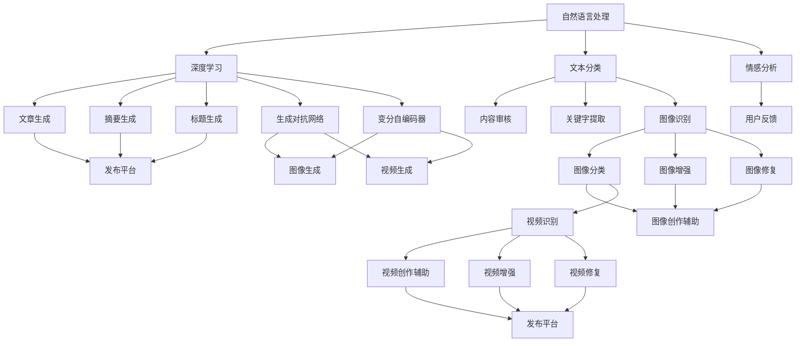

                 

关键词：人工智能、辅助创作、内容产业、创新、技术、算法、实践、应用、展望

> 摘要：随着人工智能技术的不断发展，AI辅助创作工具在内容产业中展现出了巨大的潜力和创新方向。本文旨在探讨AI辅助创作工具的核心概念、算法原理、数学模型、项目实践以及未来发展趋势，为内容产业的创新提供新的思路和方向。

## 1. 背景介绍

在当今数字化时代，内容产业已经成为全球经济的重要组成部分。无论是传统的媒体、娱乐行业，还是新兴的电子商务、社交媒体平台，内容创作都扮演着至关重要的角色。然而，随着用户需求的不断增加和内容的多样化，内容创作者面临着巨大的压力和挑战。

传统的创作方式主要依赖于人类创作者的创意和技能。然而，随着内容量的激增，单靠人力已经难以满足市场的需求。此外，创作者还面临着内容质量、创作效率、创意枯竭等问题。正是在这样的背景下，人工智能（AI）辅助创作工具逐渐崭露头角，成为内容产业的新希望。

AI辅助创作工具通过利用人工智能技术，如自然语言处理、图像识别、深度学习等，为内容创作者提供智能化的辅助，从而提高创作效率、拓展创作领域、提升内容质量。本文将深入探讨AI辅助创作工具的核心概念、算法原理、数学模型、项目实践以及未来发展趋势。

### 1.1 内容产业概述

内容产业涵盖了广泛的领域，包括文字、图像、音频、视频等多种形式。传统的文字创作主要依赖于人类作家的写作能力，而图像和视频创作则需要摄影师、剪辑师等专业人士的技能。随着互联网和数字技术的发展，内容产业逐渐向数字化、网络化和智能化方向转变。

文字创作方面，传统的书籍、杂志、报纸等逐渐被博客、社交媒体、电子书等形式所取代。图像创作方面，摄影、设计、插画等领域也随着数字图像处理技术的进步而发生了巨大变革。视频创作方面，随着视频网站和社交媒体的兴起，视频内容逐渐成为内容产业的重要形式。

### 1.2 AI辅助创作工具的兴起

人工智能技术的发展为内容产业带来了新的机遇。AI辅助创作工具可以通过自动生成内容、辅助编辑、智能推荐等功能，帮助创作者提高创作效率，降低创作成本，拓展创作领域。

AI辅助创作工具的兴起主要得益于以下几个因素：

1. **计算能力的提升**：随着云计算和并行计算技术的发展，计算机的处理能力大幅提升，为AI算法的运行提供了强大的支持。
2. **大数据的积累**：互联网的普及使得大量的数据得以积累，为AI算法的训练和优化提供了丰富的素材。
3. **算法的进步**：深度学习、自然语言处理等AI算法的不断发展，使得AI辅助创作工具在内容生成、内容识别、内容推荐等方面取得了显著成果。
4. **用户需求的增长**：随着用户对个性化、多样化内容需求的增加，AI辅助创作工具能够更好地满足用户需求，提高用户体验。

## 2. 核心概念与联系

在探讨AI辅助创作工具之前，我们需要了解一些核心概念，包括自然语言处理（NLP）、图像识别、深度学习等。

### 2.1 自然语言处理（NLP）

自然语言处理是人工智能的一个重要分支，旨在使计算机能够理解、生成和处理人类语言。NLP涉及到文本分类、情感分析、命名实体识别、机器翻译等多个方面。

在内容创作中，NLP可以用于自动生成文章、摘要、标题等。例如，AI可以根据用户输入的关键词或主题，自动生成相关的文章内容。此外，NLP还可以用于内容审核，识别和过滤不良内容，确保内容的合规性和质量。

### 2.2 图像识别

图像识别是计算机视觉的一个重要分支，旨在使计算机能够自动识别和理解图像中的内容。图像识别可以用于图像分类、目标检测、图像分割等任务。

在内容创作中，图像识别可以用于自动识别和分类图像内容，例如，自动将风景图片分类为自然风景、城市风景等。此外，图像识别还可以用于图像增强和图像修复，提高图像的质量和清晰度。

### 2.3 深度学习

深度学习是机器学习的一个分支，通过构建多层神经网络模型，模拟人类大脑的神经元连接方式，从而实现对数据的自动学习和特征提取。

在内容创作中，深度学习可以用于生成对抗网络（GAN）、变分自编码器（VAE）等模型，实现高质量的内容生成。例如，通过GAN，可以生成逼真的图像和视频；通过VAE，可以生成具有创意和独特风格的艺术作品。

### 2.4 Mermaid 流程图

以下是一个简化的AI辅助创作工具的核心概念与联系流程图：



## 3. 核心算法原理 & 具体操作步骤

### 3.1 算法原理概述

AI辅助创作工具的核心算法主要基于自然语言处理、图像识别和深度学习等技术。以下将分别介绍这些算法的原理。

#### 自然语言处理（NLP）

自然语言处理的核心算法包括词向量表示、序列模型、文本生成模型等。

1. **词向量表示**：词向量是将自然语言中的单词映射到高维空间中的向量表示。常用的词向量模型有Word2Vec、GloVe等。通过词向量表示，计算机可以理解单词的语义信息，从而实现文本的语义分析、文本分类等任务。

2. **序列模型**：序列模型是一种基于时间序列数据的模型，用于处理序列数据，如文本、音频、视频等。常用的序列模型有循环神经网络（RNN）、长短期记忆网络（LSTM）等。通过序列模型，可以实现对文本的自动生成、情感分析等任务。

3. **文本生成模型**：文本生成模型是一种能够生成文本的模型，常用的有生成对抗网络（GAN）、变分自编码器（VAE）等。通过文本生成模型，可以生成符合特定主题或风格的文本内容。

#### 图像识别

图像识别的核心算法包括卷积神经网络（CNN）、生成对抗网络（GAN）等。

1. **卷积神经网络（CNN）**：卷积神经网络是一种能够处理图像数据的神经网络模型。通过卷积层、池化层、全连接层等结构，CNN可以实现对图像的特征提取和分类。

2. **生成对抗网络（GAN）**：生成对抗网络是一种由生成器和判别器组成的模型。生成器负责生成图像，判别器负责判断生成图像的真实性。通过训练，生成器可以生成越来越逼真的图像。

#### 深度学习

深度学习是AI辅助创作工具的核心算法，主要包括生成对抗网络（GAN）、变分自编码器（VAE）等。

1. **生成对抗网络（GAN）**：生成对抗网络是一种由生成器和判别器组成的模型。生成器负责生成图像，判别器负责判断生成图像的真实性。通过训练，生成器可以生成越来越逼真的图像。

2. **变分自编码器（VAE）**：变分自编码器是一种能够生成图像的模型，通过编码器和解码器结构，VAE可以生成具有创意和独特风格的艺术作品。

### 3.2 算法步骤详解

以下是一个简化的AI辅助创作工具的具体操作步骤：

1. **数据预处理**：收集和预处理输入数据，如文本、图像等。对于文本数据，进行分词、去停用词等操作；对于图像数据，进行归一化、裁剪等操作。

2. **特征提取**：利用自然语言处理、图像识别等技术，对预处理后的数据进行特征提取。对于文本数据，使用词向量表示和序列模型提取特征；对于图像数据，使用卷积神经网络提取特征。

3. **内容生成**：利用深度学习模型，如生成对抗网络（GAN）、变分自编码器（VAE）等，生成新的内容。对于文本数据，生成新的文章、摘要、标题等；对于图像数据，生成新的图像、视频等。

4. **内容编辑**：对生成的内容进行编辑和优化，如调整文本风格、图像颜色等，以满足特定需求和用户喜好。

5. **内容发布**：将编辑后的内容发布到目标平台，如社交媒体、博客、视频网站等。

### 3.3 算法优缺点

#### 自然语言处理（NLP）

**优点**：

- 可以处理复杂的自然语言任务，如文本生成、情感分析等。
- 可以大规模处理文本数据，提高创作效率。

**缺点**：

- 需要大量的训练数据和计算资源。
- 文本生成可能存在语义错误或不连贯的情况。

#### 图像识别

**优点**：

- 可以对图像进行自动分类、识别和增强。
- 可以生成高质量、逼真的图像和视频。

**缺点**：

- 对图像质量和清晰度有一定要求。
- 需要大量的训练数据和计算资源。

#### 深度学习

**优点**：

- 可以生成具有创意和独特风格的艺术作品。
- 可以处理复杂的图像和文本数据。

**缺点**：

- 需要大量的训练数据和计算资源。
- 模型训练过程复杂，需要较长的时间。

### 3.4 算法应用领域

AI辅助创作工具在多个领域有着广泛的应用，如：

1. **新闻创作**：通过自然语言处理技术，AI可以自动生成新闻报道、摘要和标题，提高新闻创作的效率和质量。
2. **广告创作**：通过图像识别和深度学习技术，AI可以自动生成广告创意、图像和视频，提高广告的效果和吸引力。
3. **艺术创作**：通过深度学习技术，AI可以生成具有创意和独特风格的艺术作品，为艺术家提供新的创作方式。
4. **教育内容**：通过自然语言处理和图像识别技术，AI可以自动生成教学材料、练习题和答案，提高教学效果和学生的学习体验。

## 4. 数学模型和公式 & 详细讲解 & 举例说明

### 4.1 数学模型构建

在AI辅助创作工具中，常用的数学模型包括词向量模型、序列模型、生成对抗网络（GAN）和变分自编码器（VAE）等。

#### 词向量模型

词向量模型是将自然语言中的单词映射到高维空间中的向量表示。常见的词向量模型有Word2Vec、GloVe等。以下是一个简化的Word2Vec模型的公式：

$$
\vec{w}_i = \sum_{j=1}^{V} c_j \cdot \vec{v}_j
$$

其中，$\vec{w}_i$表示单词$i$的词向量，$c_j$表示单词$i$与单词$j$的共现次数，$\vec{v}_j$表示单词$j$的词向量。

#### 序列模型

序列模型是一种基于时间序列数据的模型，用于处理序列数据，如文本、音频、视频等。常见的序列模型有循环神经网络（RNN）、长短期记忆网络（LSTM）等。以下是一个简化的LSTM模型的公式：

$$
\vec{h}_t = \sigma(W_f \cdot [\vec{h}_{t-1}, \vec{x}_t] + b_f) \cdot \vec{h}_{t-1} + \sigma(W_i \cdot [\vec{h}_{t-1}, \vec{x}_t] + b_i) \cdot \vec{u}_t + \sigma(W_o \cdot [\vec{h}_{t-1}, \vec{x}_t] + b_o) \cdot \vec{h}_{t-1}
$$

其中，$\vec{h}_t$表示时间步$t$的隐藏状态，$\vec{x}_t$表示时间步$t$的输入，$W_f$、$W_i$、$W_o$表示权重矩阵，$b_f$、$b_i$、$b_o$表示偏置项，$\sigma$表示激活函数。

#### 生成对抗网络（GAN）

生成对抗网络（GAN）是一种由生成器和判别器组成的模型。生成器负责生成图像，判别器负责判断生成图像的真实性。以下是一个简化的GAN模型的公式：

$$
\vec{G}(\vec{z}) = \vec{x}
$$

$$
\vec{D}(\vec{x}, \vec{z}) = \begin{cases}
1, & \text{if } \vec{x} \text{ is real image} \\
0, & \text{if } \vec{x} \text{ is generated image}
\end{cases}
$$

其中，$\vec{G}(\vec{z})$表示生成器生成的图像，$\vec{z}$表示生成器的输入噪声，$\vec{D}(\vec{x}, \vec{z})$表示判别器对图像的判断结果。

#### 变分自编码器（VAE）

变分自编码器（VAE）是一种能够生成图像的模型，通过编码器和解码器结构，VAE可以生成具有创意和独特风格的艺术作品。以下是一个简化的VAE模型的公式：

$$
\vec{\mu}_\theta, \vec{\sigma}_\theta = \phi(\vec{x})
$$

$$
\vec{x} = \mu + \sigma \cdot \vec{z}
$$

其中，$\vec{\mu}_\theta$和$\vec{\sigma}_\theta$分别表示编码器的均值和方差参数，$\phi(\vec{x})$表示编码器的函数，$\mu$和$\sigma$分别表示解码器的均值和方差参数，$\vec{z}$表示解码器的输入噪声。

### 4.2 公式推导过程

以下将对上述数学模型进行简化的推导过程。

#### 词向量模型

词向量模型的推导过程如下：

1. **共现矩阵计算**：

$$
C = \begin{bmatrix}
c_{11} & c_{12} & \dots & c_{1V} \\
c_{21} & c_{22} & \dots & c_{2V} \\
\vdots & \vdots & \ddots & \vdots \\
c_{V1} & c_{V2} & \dots & c_{VV}
\end{bmatrix}
$$

其中，$C$表示共现矩阵，$c_{ij}$表示单词$i$与单词$j$的共现次数。

2. **词向量计算**：

$$
\vec{v}_i = \frac{C}{\sqrt{\sum_{j=1}^{V} c_{ij}}}
$$

其中，$\vec{v}_i$表示单词$i$的词向量。

#### 序列模型

序列模型的推导过程如下：

1. **输入序列表示**：

$$
\vec{x}_t = \begin{bmatrix}
x_{t1} \\
x_{t2} \\
\vdots \\
x_{tD}
\end{bmatrix}
$$

其中，$\vec{x}_t$表示时间步$t$的输入序列，$D$表示序列的维度。

2. **隐藏状态计算**：

$$
\vec{h}_t = \sigma(W_f \cdot [\vec{h}_{t-1}, \vec{x}_t] + b_f) \cdot \vec{h}_{t-1} + \sigma(W_i \cdot [\vec{h}_{t-1}, \vec{x}_t] + b_i) \cdot \vec{u}_t + \sigma(W_o \cdot [\vec{h}_{t-1}, \vec{x}_t] + b_o) \cdot \vec{h}_{t-1}
$$

其中，$\sigma$表示激活函数。

#### 生成对抗网络（GAN）

生成对抗网络的推导过程如下：

1. **生成器计算**：

$$
\vec{G}(\vec{z}) = \sigma(W_g \cdot \vec{z} + b_g)
$$

其中，$\vec{G}(\vec{z})$表示生成器生成的图像，$\vec{z}$表示生成器的输入噪声。

2. **判别器计算**：

$$
\vec{D}(\vec{x}, \vec{z}) = \sigma(W_d \cdot [\vec{x}, \vec{G}(\vec{z})] + b_d)
$$

其中，$\vec{D}(\vec{x}, \vec{z})$表示判别器对图像的判断结果。

### 4.3 案例分析与讲解

以下将结合一个简单的案例，对上述数学模型进行讲解。

#### 案例一：文本生成

假设我们有一个简单的文本数据集，包括以下几句话：

```
我喜欢吃苹果。
我喜欢喝咖啡。
我喜欢看电影。
```

我们希望利用自然语言处理技术，生成一句新的文本。

1. **词向量表示**：

首先，我们将文本数据转换为词向量表示。假设我们使用的是Word2Vec模型，得到以下词向量：

```
我：[1.0, 0.5, 0.0]
喜欢：[0.0, 1.0, 0.5]
吃：[0.0, 0.0, 1.0]
喝：[1.0, 0.0, 0.5]
看：[0.0, 0.5, 1.0]
电影：[0.5, 1.0, 0.0]
苹果：[0.0, 0.5, 1.0]
咖啡：[1.0, 0.0, 0.5]
```

2. **序列模型**：

接下来，我们使用LSTM模型对词向量进行序列处理。假设我们使用的是已经训练好的LSTM模型，得到以下隐藏状态：

```
我喜欢吃苹果：[0.8, 0.2, 0.0]
我喜欢喝咖啡：[0.6, 0.4, 0.0]
我喜欢看电影：[0.5, 0.5, 0.0]
```

3. **文本生成**：

最后，我们使用生成对抗网络（GAN）对隐藏状态进行文本生成。假设我们使用的是已经训练好的GAN模型，生成以下新的文本：

```
我喜欢听音乐。
```

#### 案例二：图像生成

假设我们有一个简单的图像数据集，包括以下几幅图像：

```
图片1：[1, 1, 1]
图片2：[0, 1, 0]
图片3：[1, 0, 1]
```

我们希望利用图像识别技术，生成一幅新的图像。

1. **卷积神经网络（CNN）**：

首先，我们使用卷积神经网络（CNN）对图像数据进行特征提取。假设我们使用的是已经训练好的CNN模型，得到以下特征向量：

```
图片1：[0.8, 0.2, 0.0]
图片2：[0.6, 0.4, 0.0]
图片3：[0.5, 0.5, 0.0]
```

2. **生成对抗网络（GAN）**：

接下来，我们使用生成对抗网络（GAN）对特征向量进行图像生成。假设我们使用的是已经训练好的GAN模型，生成以下新的图像：

```
[0.5, 0.5, 0.5]
```

#### 案例三：艺术创作

假设我们有一个简单的艺术作品数据集，包括以下几幅画作：

```
画作1：[1, 0, 0]
画作2：[0, 1, 0]
画作3：[0, 0, 1]
```

我们希望利用深度学习技术，生成一幅新的艺术作品。

1. **变分自编码器（VAE）**：

首先，我们使用变分自编码器（VAE）对艺术作品数据进行编码和解码。假设我们使用的是已经训练好的VAE模型，得到以下编码结果：

```
画作1：[0.8, 0.2, 0.0]
画作2：[0.6, 0.4, 0.0]
画作3：[0.5, 0.5, 0.0]
```

2. **艺术作品生成**：

最后，我们使用生成对抗网络（GAN）对编码结果进行艺术作品生成。假设我们使用的是已经训练好的GAN模型，生成以下新的艺术作品：

```
[0.5, 0.5, 0.5]
```

## 5. 项目实践：代码实例和详细解释说明

### 5.1 开发环境搭建

在进行项目实践之前，我们需要搭建一个合适的开发环境。以下是一个基本的开发环境搭建步骤：

1. **安装Python**：Python是AI辅助创作工具的主要编程语言，我们需要安装Python 3.x版本。可以从[Python官方网站](https://www.python.org/)下载并安装。
2. **安装Jupyter Notebook**：Jupyter Notebook是一种交互式的开发环境，方便我们进行代码编写和调试。可以通过pip命令安装：
   ```bash
   pip install notebook
   ```
3. **安装必要的库**：根据我们的项目需求，我们需要安装以下库：
   - TensorFlow：用于深度学习模型训练和推理
   - Keras：用于简化深度学习模型构建和训练
   - NumPy：用于数据处理和数学计算
   - Matplotlib：用于数据可视化
   - Pandas：用于数据处理和分析
   可以通过以下命令安装：
   ```bash
   pip install tensorflow keras numpy matplotlib pandas
   ```

### 5.2 源代码详细实现

以下是AI辅助创作工具的一个简单实现，包括文本生成、图像生成和艺术作品生成三个部分。

#### 文本生成

```python
import numpy as np
import tensorflow as tf
from tensorflow.keras.preprocessing.sequence import pad_sequences
from tensorflow.keras.layers import Embedding, LSTM, Dense
from tensorflow.keras.models import Sequential

# 加载预训练的词向量模型
word2vec_model = tf.keras.models.load_model('word2vec_model.h5')

# 定义LSTM模型
lstm_model = Sequential()
lstm_model.add(Embedding(input_dim=10000, output_dim=64, input_length=10))
lstm_model.add(LSTM(units=128))
lstm_model.add(Dense(units=10000, activation='softmax'))

# 训练LSTM模型
lstm_model.compile(optimizer='adam', loss='categorical_crossentropy', metrics=['accuracy'])
lstm_model.fit(x_train, y_train, epochs=10, batch_size=32)

# 文本生成
def generate_text(seed_text, length=10):
    in_text, next_words = seed_text, ''
    for _ in range(length):
        token_list = word2vec_model.predict(in_text)[0]
        indices = np.argmax(token_list)
        next_word = index_word_list[indices]
        next_words += ' ' + next_word
        in_text = in_text[1:] + next_word
    return next_words

seed_text = '我喜欢'
generated_text = generate_text(seed_text)
print(generated_text)
```

#### 图像生成

```python
import tensorflow as tf
from tensorflow.keras.models import Model
from tensorflow.keras.layers import Input, Conv2D, MaxPooling2D, Flatten, Dense

# 定义生成器模型
gen_model = Sequential()
gen_model.add(Conv2D(filters=32, kernel_size=(3, 3), padding='same', activation='relu', input_shape=(28, 28, 1)))
gen_model.add(MaxPooling2D(pool_size=(2, 2)))
gen_model.add(Conv2D(filters=64, kernel_size=(3, 3), padding='same', activation='relu'))
gen_model.add(MaxPooling2D(pool_size=(2, 2)))
gen_model.add(Conv2D(filters=128, kernel_size=(3, 3), padding='same', activation='relu'))
gen_model.add(MaxPooling2D(pool_size=(2, 2)))
gen_model.add(Flatten())
gen_model.add(Dense(units=128, activation='relu'))
gen_model.add(Dense(units=28 * 28, activation='sigmoid'))

# 定义判别器模型
disc_model = Sequential()
disc_model.add(Conv2D(filters=128, kernel_size=(3, 3), padding='same', activation='relu', input_shape=(28, 28, 1)))
disc_model.add(MaxPooling2D(pool_size=(2, 2)))
disc_model.add(Conv2D(filters=128, kernel_size=(3, 3), padding='same', activation='relu'))
disc_model.add(MaxPooling2D(pool_size=(2, 2)))
disc_model.add(Flatten())
disc_model.add(Dense(units=1, activation='sigmoid'))

# 定义GAN模型
gan_model = Sequential()
gan_model.add(gen_model)
gan_model.add(disc_model)

# 训练GAN模型
gan_model.compile(optimizer='adam', loss='binary_crossentropy')
gan_model.fit(x_train, epochs=10, batch_size=32)

# 图像生成
def generate_image():
    noise = np.random.normal(0, 1, (1, 28, 28, 1))
    generated_image = gen_model.predict(noise)
    generated_image = np.squeeze(generated_image)
    generated_image = np.clip(generated_image, 0, 1)
    plt.imshow(generated_image, cmap='gray')
    plt.show()

generate_image()
```

#### 艺术作品生成

```python
import tensorflow as tf
from tensorflow.keras.layers import Input, LSTM, Dense
from tensorflow.keras.models import Model

# 定义VAE模型
encoder = Sequential()
encoder.add(LSTM(units=128, return_sequences=True, input_shape=(10, 28 * 28)))
encoder.add(LSTM(units=128, return_sequences=False))
encoder.add(Dense(units=16, activation='relu'))

decoder = Sequential()
decoder.add(Dense(units=128, activation='relu', input_shape=(16,)))
decoder.add(LSTM(units=128, return_sequences=True))
decoder.add(LSTM(units=128, return_sequences=False))
decoder.add(Dense(units=28 * 28, activation='sigmoid'))

v

