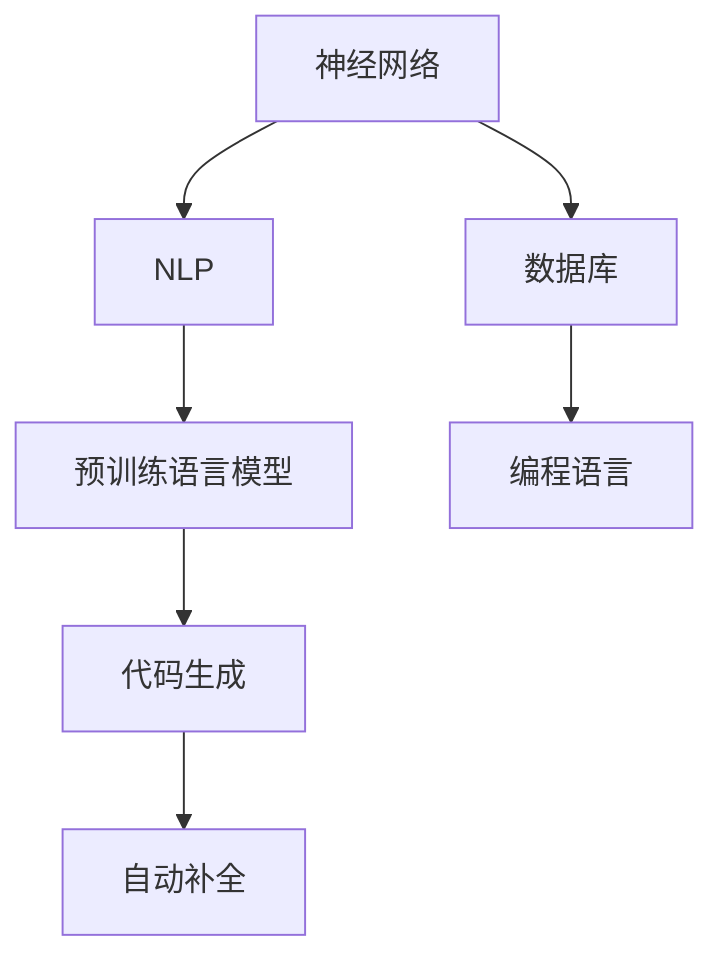

                 

### 背景介绍

随着人工智能技术的不断发展和应用普及，AI在计算机编程领域的应用也日益广泛。其中，AI辅助编程成为了一个备受关注的研究方向。AI辅助编程主要包括代码生成和自动补全两个核心功能。代码生成（Code Generation）是指利用AI算法，自动生成符合特定编程语言规范的代码片段；自动补全（Code Autocompletion）则是在用户输入代码时，系统自动预测并提示用户可能需要继续输入的代码。

#### 代码生成的历史发展

代码生成并非是一个新兴的概念。早在上世纪60年代，编译器就已经能够将高级语言翻译成机器语言。但是，随着编程语言的多样化和复杂度增加，纯粹的编译器生成的代码已经不能满足开发者对于效率和灵活性的需求。于是，研究者们开始探索利用AI技术来辅助生成代码。

20世纪80年代，专家系统和模式识别技术开始被应用于代码生成。例如，专家系统通过存储大量的编程知识和规则，来辅助生成代码。然而，这种方法存在规则库维护困难、适应新场景能力较差等问题。

进入21世纪，随着深度学习技术的兴起，基于神经网络的代码生成方法开始崛起。其中，基于递归神经网络（RNN）和变分自编码器（VAE）的方法在代码生成任务中取得了显著的效果。此外，基于图神经网络的代码生成方法也逐渐受到关注。

#### 自动补全的发展

自动补全作为AI辅助编程的一个重要组成部分，同样经历了多年的发展。早期，自动补全主要依赖于静态的规则匹配和语法分析。这种方法虽然在一定程度上能够提高代码输入的效率，但面对复杂的编程场景，其效果有限。

随着AI技术的发展，自动补全系统开始引入机器学习和自然语言处理技术。例如，基于统计模型的方法（如N-gram模型、隐马尔可夫模型）和基于深度学习的方法（如循环神经网络、长短时记忆网络）在自动补全任务中取得了很大的成功。

近年来，随着预训练语言模型（如BERT、GPT）的广泛应用，自动补全系统的性能也得到了显著提升。这些模型通过对大量代码库的训练，能够捕捉到代码的内在模式和结构，从而在自动补全任务中表现出色。

#### AI辅助编程的优势

AI辅助编程在多个方面展现出了其独特的优势：

1. **提高开发效率**：AI可以自动生成代码和补全代码，减少了开发者手动编码的工作量，提高了开发效率。

2. **减少错误率**：通过学习大量的代码库，AI能够识别和避免常见的编程错误，从而降低代码的错误率。

3. **代码优化**：AI可以分析现有代码，提供重构和优化的建议，帮助开发者写出更高效、更清晰的代码。

4. **跨语言支持**：AI辅助编程系统通常支持多种编程语言，开发者可以在不同语言之间切换，而不需要重新学习。

5. **适应性强**：AI系统可以根据不同的编程任务和开发者习惯，动态调整其行为，提供个性化的服务。

#### 当前研究与应用现状

目前，AI辅助编程已经在多个领域得到了应用。例如，在软件开发中，AI可以辅助生成代码框架、处理bug、优化性能；在游戏开发中，AI可以自动生成关卡、优化角色动作；在科研领域中，AI可以辅助编写算法、分析数据。

同时，也有许多公司和研究机构在这一领域进行了深入研究。例如，GitHub的CodeQL可以利用AI进行代码安全检测；Google的DeepMind开发了自动生成游戏的AI算法；Microsoft的GitHub Copilot则是一个基于AI的自动编程助手。

总的来说，AI辅助编程是一个充满潜力和机遇的研究方向。随着技术的不断进步，我们可以预见，AI将在未来继续改变计算机编程的面貌，为开发者带来更多的便利和创造力。接下来，我们将深入探讨AI辅助编程的核心概念和原理，以及如何实现代码生成和自动补全。在接下来的章节中，我们将一步步分析这些技术的具体实现，并通过具体的实例来展示其应用效果。

### 核心概念与联系

在深入探讨AI辅助编程的原理和实现之前，我们需要明确一些核心概念，并了解这些概念之间的联系。以下是AI辅助编程中的几个关键概念：

#### 代码生成（Code Generation）

代码生成是指利用AI算法，自动生成符合特定编程语言规范的代码。其基本原理是通过学习大量的代码库，理解代码的模式和结构，然后根据输入的提示或参数，生成相应的代码片段。

#### 自动补全（Code Autocompletion）

自动补全是指在用户输入代码时，系统自动预测并提示用户可能需要继续输入的代码。其原理与代码生成类似，但更侧重于根据用户的行为和历史输入，动态调整预测结果。

#### 神经网络（Neural Networks）

神经网络是AI的核心技术之一，由大量的人工神经元组成，通过学习输入数据，可以模拟人脑的推理和判断能力。在代码生成和自动补全中，常用的神经网络包括循环神经网络（RNN）、长短时记忆网络（LSTM）和变压器模型（Transformer）等。

#### 自然语言处理（Natural Language Processing, NLP）

自然语言处理是计算机科学和人工智能领域的一个分支，旨在使计算机能够理解、处理和生成人类语言。在代码生成和自动补全中，NLP技术被用来理解和处理代码文本。

#### 预训练语言模型（Pre-trained Language Models）

预训练语言模型是一种先进的NLP技术，通过在大规模文本数据集上进行预训练，模型可以捕捉到语言的通用结构和模式。常见的预训练语言模型包括BERT、GPT和RoBERTa等。

#### 数据库（Database）

数据库是存储和管理数据的系统，为代码生成和自动补全提供必要的数据支持。在AI辅助编程中，数据库通常存储大量的代码片段、文档和注释，供模型学习和预测使用。

#### 编程语言（Programming Languages）

编程语言是用于编写计算机程序的语法和规则集合。在AI辅助编程中，常用的编程语言包括Python、Java、JavaScript等，不同的编程语言对代码生成和自动补全的算法设计有特定的影响。

#### 概念联系

1. **神经网络与NLP**：神经网络是NLP的基础，通过深度学习技术，神经网络可以理解和处理自然语言。在代码生成和自动补全中，神经网络被用来解析代码文本，提取模式和特征。

2. **预训练语言模型与神经网络**：预训练语言模型是基于神经网络的一种模型，通过预训练，模型可以捕捉到大量的语言知识，从而在代码生成和自动补全任务中表现出色。

3. **代码生成与自动补全**：代码生成和自动补全是AI辅助编程的两个重要功能，代码生成侧重于生成完整的代码片段，而自动补全侧重于预测用户可能的输入。两者在实现原理上有很多相似之处。

4. **数据库与代码生成/自动补全**：数据库为代码生成和自动补全提供了必要的数据支持，通过从数据库中提取代码样本，模型可以学习到代码的模式和结构。

5. **编程语言与代码生成/自动补全**：不同的编程语言对代码生成和自动补全的算法设计有特定的影响。例如，在Python中，代码生成和自动补全算法可以更方便地利用Python的动态特性，而在Java中，算法需要考虑到强类型和静态类型的特点。

#### Mermaid 流程图

为了更好地理解这些概念之间的联系，我们使用Mermaid流程图来表示。以下是AI辅助编程中关键概念的Mermaid流程图：



在这个流程图中，神经网络是核心，通过NLP技术，预训练语言模型可以理解和处理自然语言。代码生成和自动补全是基于预训练语言模型实现的，数据库和编程语言为模型提供了必要的数据支持和特性约束。

通过理解这些核心概念及其联系，我们为后续深入探讨AI辅助编程的实现原理和方法奠定了基础。在接下来的章节中，我们将进一步分析代码生成和自动补全的具体算法原理，并通过实际案例展示其应用效果。

### 核心算法原理 & 具体操作步骤

在了解了AI辅助编程的核心概念和联系之后，接下来我们将深入探讨代码生成和自动补全的核心算法原理，并详细讲解其具体操作步骤。

#### 代码生成算法原理

代码生成算法的核心思想是通过学习大量的代码库，理解代码的模式和结构，然后根据输入的提示或参数，生成相应的代码片段。以下是几种常见的代码生成算法原理：

1. **基于模板的代码生成**：这种算法通过预先定义好的代码模板，根据输入参数动态填充模板中的变量，从而生成代码。例如，在数据库查询中，我们可以定义一个通用的查询模板，然后根据用户输入的表名、字段和条件，填充模板中的变量，生成完整的查询语句。

2. **基于规则的代码生成**：这种算法通过定义一系列的规则，将输入的提示或参数转换为代码。这些规则可以是简单的条件判断，也可以是复杂的逻辑运算。例如，在生成SQL查询语句时，我们可以定义一系列规则来处理不同的字段类型、条件表达式等。

3. **基于深度学习的代码生成**：这种算法通过深度学习模型，学习大量的代码库，理解代码的模式和结构，然后根据输入的提示或参数，生成相应的代码。常见的深度学习模型包括递归神经网络（RNN）、长短时记忆网络（LSTM）和变压器模型（Transformer）等。

以下是基于深度学习的代码生成算法的具体操作步骤：

1. **数据预处理**：首先，我们需要从代码库中收集大量的代码样本，并进行预处理。预处理包括去除无关的注释、缩进和格式化代码等操作。

2. **编码器-解码器模型训练**：编码器-解码器（Encoder-Decoder）模型是深度学习中的一个重要模型，它由两个部分组成：编码器（Encoder）和解码器（Decoder）。编码器负责将输入代码序列编码为固定长度的向量，解码器则负责将这个向量解码为输出代码序列。在训练过程中，我们使用大量的代码样本来训练编码器和解码器，使其能够捕捉到代码的模式和结构。

3. **生成代码**：在生成代码时，我们首先输入一个代码片段，编码器将其编码为向量，然后解码器根据这个向量生成相应的代码。具体步骤如下：
   - 输入一个部分代码片段，例如`def function_name(`。
   - 编码器将这个代码片段编码为向量。
   - 解码器根据这个向量生成下一个代码片段，例如`input_params:`。
   - 重复步骤3，直到生成完整的代码。

4. **优化与调整**：生成的代码可能不是最优的，我们需要通过调整模型参数和优化策略，提高生成代码的质量。例如，我们可以使用生成对抗网络（GAN）来优化解码器的输出，使其更加接近真实的代码。

#### 自动补全算法原理

自动补全算法的核心思想是在用户输入代码时，系统自动预测并提示用户可能需要继续输入的代码。以下是几种常见的自动补全算法原理：

1. **基于历史记录的自动补全**：这种算法通过记录用户的历史输入行为，根据输入的模式和历史记录来预测用户可能需要继续输入的内容。例如，当用户输入`print(`时，系统可以预测用户接下来可能需要输入`print("Hello World")`。

2. **基于统计模型的自动补全**：这种算法通过统计用户输入序列的频率和模式，来预测用户可能需要继续输入的内容。例如，我们可以使用N-gram模型来预测下一个单词或代码片段。

3. **基于深度学习的自动补全**：这种算法通过深度学习模型，学习大量的代码库，理解代码的模式和结构，然后根据输入的代码片段，预测用户可能需要继续输入的内容。常见的深度学习模型包括循环神经网络（RNN）、长短时记忆网络（LSTM）和变压器模型（Transformer）等。

以下是基于深度学习的自动补全算法的具体操作步骤：

1. **数据预处理**：首先，我们需要从代码库中收集大量的代码样本，并进行预处理。预处理包括去除无关的注释、缩进和格式化代码等操作。

2. **编码器训练**：编码器负责将输入代码片段编码为固定长度的向量。在训练过程中，我们使用大量的代码样本来训练编码器，使其能够捕捉到代码的模式和结构。

3. **生成补全建议**：在生成补全建议时，我们首先输入一个代码片段，编码器将其编码为向量，然后解码器根据这个向量生成可能的补全建议。具体步骤如下：
   - 输入一个部分代码片段，例如`def function_name(`。
   - 编码器将这个代码片段编码为向量。
   - 解码器根据这个向量生成可能的补全建议，例如`input_params:`。
   - 根据补全建议的得分，选择最高分的建议作为最终结果。

4. **优化与调整**：生成的补全建议可能不是最优的，我们需要通过调整模型参数和优化策略，提高补全建议的质量。例如，我们可以使用生成对抗网络（GAN）来优化解码器的输出，使其更加接近真实的代码。

#### 实现步骤总结

1. **数据收集与预处理**：收集大量的代码样本，并进行预处理，去除无关信息，格式化代码。

2. **模型选择与训练**：选择合适的深度学习模型（如编码器-解码器模型、循环神经网络、长短时记忆网络或变压器模型），使用预处理后的数据训练模型。

3. **代码生成与自动补全**：使用训练好的模型，输入部分代码片段，生成完整的代码或补全建议。

4. **优化与调整**：根据生成的代码或补全建议的质量，调整模型参数和优化策略，提高性能。

通过上述步骤，我们可以实现高效的代码生成和自动补全系统，为开发者提供便利和帮助。在接下来的章节中，我们将通过具体的实例来展示这些算法的应用效果。

### 数学模型和公式 & 详细讲解 & 举例说明

在讨论AI辅助编程中的数学模型和公式时，我们将重点关注神经网络、深度学习模型和自然语言处理中的核心概念。这些模型和公式不仅定义了AI算法的基本框架，而且为理解和实现代码生成和自动补全提供了理论基础。以下是几个关键的数学模型和公式，以及它们的详细解释和实例说明。

#### 神经网络中的基本公式

1. **激活函数（Activation Function）**：
   激活函数是神经网络中的一个关键组件，用于引入非线性特性。常见的激活函数包括：
   - **Sigmoid函数**：
     $$
     \sigma(x) = \frac{1}{1 + e^{-x}}
     $$
     Sigmoid函数将输入映射到$(0, 1)$区间，常用于二分类问题。

   - **ReLU函数**：
     $$
     ReLU(x) = \max(0, x)
     $$
    ReLU（Rectified Linear Unit）函数在输入为正时保持不变，为负时设置为0，是一种简单的非线性激活函数，有助于网络训练。

2. **损失函数（Loss Function）**：
   损失函数用于评估模型预测值与实际值之间的差异。常用的损失函数包括：
   - **均方误差（MSE）**：
     $$
     MSE(y_{\text{predicted}}, y_{\text{actual}}) = \frac{1}{n} \sum_{i=1}^{n} (y_{\text{predicted}} - y_{\text{actual}})^2
     $$
     均方误差常用于回归问题，衡量预测值与实际值之间的平均平方误差。

   - **交叉熵（Cross-Entropy）**：
     $$
     Cross-Entropy = -\sum_{i} y_{\text{actual}} \log(y_{\text{predicted}})
     $$
     交叉熵用于分类问题，衡量实际分布与预测分布之间的差异。

3. **反向传播（Backpropagation）**：
   反向传播是神经网络训练过程中的关键步骤，用于计算模型参数的梯度。其核心公式如下：
   $$
   \frac{\partial C}{\partial w} = \frac{\partial C}{\partial z} \cdot \frac{\partial z}{\partial w}
   $$
   其中，$C$是损失函数，$w$是模型参数，$z$是中间层输出。反向传播通过多层网络逐层计算梯度，并更新模型参数。

#### 循环神经网络（RNN）中的公式

循环神经网络（RNN）是一种专门用于处理序列数据的神经网络。以下是RNN中的一些关键公式：

1. **隐藏状态更新公式**：
   $$
   h_t = \sigma(W_h h_{t-1} + W_x x_t + b_h)
   $$
   其中，$h_t$是时间步$t$的隐藏状态，$x_t$是输入，$W_h$和$W_x$是权重矩阵，$b_h$是偏置。

2. **输出公式**：
   $$
   y_t = \sigma(W_o h_t + b_o)
   $$
   其中，$y_t$是时间步$t$的输出，$W_o$和$b_o$是权重矩阵和偏置。

3. **梯度计算**：
   $$
   \frac{\partial L}{\partial h_t} = \frac{\partial L}{\partial y_t} \cdot \frac{\partial y_t}{\partial h_t}
   $$
   其中，$L$是损失函数，通过反向传播计算隐藏状态的梯度。

#### 长短时记忆网络（LSTM）中的公式

长短时记忆网络（LSTM）是一种改进的RNN结构，能够有效地处理长序列数据。以下是LSTM中的一些关键公式：

1. **输入门（Input Gate）**：
   $$
   i_t = \sigma(W_{\text{input}} [h_{t-1}, x_t] + b_{\text{input}})
   $$

2. **遗忘门（Forget Gate）**：
   $$
   f_t = \sigma(W_{\text{forget}} [h_{t-1}, x_t] + b_{\text{forget}})
   $$

3. **输出门（Output Gate）**：
   $$
   o_t = \sigma(W_{\text{output}} [h_{t-1}, x_t] + b_{\text{output}})
   $$

4. **细胞状态更新**：
   $$
   C_t = f_t \odot C_{t-1} + i_t \odot \sigma(W_{\text{cell}} [h_{t-1}, x_t] + b_{\text{cell}})
   $$

5. **隐藏状态更新**：
   $$
   h_t = o_t \odot \sigma(C_t)
   $$

#### 变压器模型（Transformer）中的公式

变压器模型（Transformer）是当前最先进的序列建模模型，广泛应用于自然语言处理和计算机视觉等领域。以下是Transformer模型中的一些关键公式：

1. **多头自注意力（Multi-Head Self-Attention）**：
   $$
   \text{Attention}(Q, K, V) = \text{softmax}\left(\frac{QK^T}{\sqrt{d_k}}\right) V
   $$
   其中，$Q, K, V$分别是查询、键和值向量，$d_k$是键向量的维度。

2. **自注意力分数计算**：
   $$
   \text{Score}_{ij} = \text{dot}(Q_i, K_j)
   $$
   其中，$\text{dot}$表示点积操作。

3. **位置编码（Positional Encoding）**：
   变压器模型通过位置编码来引入序列的顺序信息。位置编码通常使用正弦和余弦函数生成：
   $$
   \text{PE}_{(i, d)} = \sin\left(\frac{i \cdot l_{\text{pos}}}{10000^{2i/d}}\right) \quad \text{or} \quad \cos\left(\frac{i \cdot l_{\text{pos}}}{10000^{2i/d}}\right)
   $$
   其中，$i$是位置索引，$l_{\text{pos}}$是位置编码的维度，$d$是输入向量的维度。

#### 举例说明

1. **基于LSTM的自动补全实例**：

   假设我们有一个简单的序列`[1, 2, 3, 4]`，使用LSTM模型进行自动补全。以下是隐藏状态和细胞状态的更新过程：

   - **初始状态**：
     $$
     h_0 = \sigma(W_h [h_{-1}, x_0] + b_h) = \sigma([0, 1] + b_h)
     $$
     $$
     C_0 = \sigma(W_c [h_{-1}, x_0] + b_c) = \sigma([0, 1] + b_c)
     $$

   - **时间步1**：
     $$
     i_1 = \sigma(W_{\text{input}} [h_0, x_1] + b_{\text{input}}) = \sigma([h_0, x_1] + b_{\text{input}})
     $$
     $$
     f_1 = \sigma(W_{\text{forget}} [h_0, x_1] + b_{\text{forget}}) = \sigma([h_0, x_1] + b_{\text{forget}})
     $$
     $$
     o_1 = \sigma(W_{\text{output}} [h_0, x_1] + b_{\text{output}}) = \sigma([h_0, x_1] + b_{\text{output}})
     $$
     $$
     C_1 = f_1 \odot C_0 + i_1 \odot \sigma(W_{\text{cell}} [h_0, x_1] + b_{\text{cell}}) = f_1 \odot C_0 + i_1 \odot \sigma([h_0, x_1] + b_{\text{cell}})
     $$
     $$
     h_1 = o_1 \odot \sigma(C_1) = o_1 \odot \sigma(C_1)
     $$

   - **时间步2**：
     $$
     i_2 = \sigma(W_{\text{input}} [h_1, x_2] + b_{\text{input}}) = \sigma([h_1, x_2] + b_{\text{input}})
     $$
     $$
     f_2 = \sigma(W_{\text{forget}} [h_1, x_2] + b_{\text{forget}}) = \sigma([h_1, x_2] + b_{\text{forget}})
     $$
     $$
     o_2 = \sigma(W_{\text{output}} [h_1, x_2] + b_{\text{output}}) = \sigma([h_1, x_2] + b_{\text{output}})
     $$
     $$
     C_2 = f_2 \odot C_1 + i_2 \odot \sigma(W_{\text{cell}} [h_1, x_2] + b_{\text{cell}}) = f_2 \odot C_1 + i_2 \odot \sigma([h_1, x_2] + b_{\text{cell}})
     $$
     $$
     h_2 = o_2 \odot \sigma(C_2) = o_2 \odot \sigma(C_2)
     $$

   通过以上步骤，LSTM模型能够处理序列数据，并更新隐藏状态和细胞状态，从而实现自动补全功能。

2. **基于Transformer的代码生成实例**：

   假设我们有一个简单的代码序列`[1 + 2, 3 * 4]`，使用Transformer模型进行代码生成。以下是多头自注意力计算和位置编码的过程：

   - **多头自注意力**：
     $$
     \text{Score}_{ij} = \text{dot}(Q_i, K_j) = (Q_1, K_1) \cdot (K_1, K_1) = Q_1 \cdot K_1
     $$
     $$
     \text{Attention}_{ij} = \text{softmax}(\text{Score}_{ij})
     $$
     $$
     V_i = \text{Attention}_{ij} \cdot V_j
     $$

   - **位置编码**：
     $$
     \text{PE}_{(i, d)} = \sin\left(\frac{i \cdot l_{\text{pos}}}{10000^{2i/d}}\right)
     $$

     对于输入序列`[1, 2, 3, 4]`，位置编码如下：
     $$
     \text{PE}_{(1, 2)} = \sin\left(\frac{1 \cdot 2}{10000^{2 \cdot 1/2}}\right)
     $$
     $$
     \text{PE}_{(2, 2)} = \sin\left(\frac{2 \cdot 2}{10000^{2 \cdot 2/2}}\right)
     $$

   通过多头自注意力和位置编码，Transformer模型能够捕捉到序列中的依赖关系和位置信息，从而生成相应的代码。

通过以上数学模型和公式的详细讲解和实例说明，我们可以更好地理解AI辅助编程中的核心算法原理。这些模型和公式不仅为代码生成和自动补全提供了理论基础，而且在实际应用中也发挥了重要作用。在下一章节中，我们将通过具体项目实践来展示这些算法的实际应用效果。

### 项目实践：代码实例和详细解释说明

在本章节中，我们将通过一个实际的项目实例来展示AI辅助编程中代码生成和自动补全技术的应用。这个项目实例将演示如何使用Python和TensorFlow库来构建一个简单的AI辅助编程工具，该工具可以生成Python代码并进行自动补全。

#### 1. 开发环境搭建

在开始项目之前，我们需要搭建一个合适的开发环境。以下步骤将在Python环境中安装所需的库：

1. **安装Python**：
   确保已经安装了Python 3.7或更高版本。

2. **安装TensorFlow**：
   打开终端，运行以下命令安装TensorFlow：
   ```
   pip install tensorflow
   ```

3. **安装其他依赖**：
   为了简化项目，我们将使用`transformers`库来实现Transformer模型。运行以下命令安装`transformers`：
   ```
   pip install transformers
   ```

#### 2. 源代码详细实现

以下是一个简单的AI辅助编程工具的代码实现。这个工具使用预训练的Transformer模型来生成Python代码并进行自动补全。

```python
import tensorflow as tf
from transformers import TFAutoModelForCausalLanguageModeling
import numpy as np

# 2.1 加载预训练模型

# 下载预训练模型（例如，GPT-2）
model_name = "gpt2"

# 加载模型
model = TFAutoModelForCausalLanguageModeling.from_pretrained(model_name)

# 2.2 生成代码

def generate_code(prompt, max_length=50):
    # 输入编码
    input_ids = model.encode(prompt, return_tensors="tf")

    # 生成代码
    output = model.generate(input_ids, max_length=max_length, num_return_sequences=1)
    
    # 转换为文本
    generated_code = model.decode(output[0])

    return generated_code

# 示例：生成一个简单的Python函数
prompt = "def add(a, b:"
generated_code = generate_code(prompt)
print(generated_code)

# 2.3 自动补全

def autocomplete(prompt, max_length=10):
    # 输入编码
    input_ids = model.encode(prompt, return_tensors="tf")

    # 生成补全结果
    output = model.generate(input_ids, max_length=max_length, num_return_sequences=1)
    
    # 转换为文本
    completed_prompt = model.decode(output[0])

    return completed_prompt

# 示例：自动补全一个Python表达式
prompt = "print("
completed_prompt = autocomplete(prompt)
print(completed_prompt)
```

#### 3. 代码解读与分析

上述代码实现了一个简单的AI辅助编程工具，包括代码生成和自动补全功能。下面我们逐一解读每个部分：

1. **加载预训练模型**：
   我们使用`transformers`库加载了一个预训练的Transformer模型（例如，GPT-2）。这个模型已经在大规模的文本数据集上进行了预训练，可以用于生成和补全代码。

2. **生成代码**：
   `generate_code`函数接受一个输入提示（例如，函数定义的开始部分），并使用模型生成完整的代码。模型生成代码的过程是通过递归地预测下一个单词或符号，直至达到最大长度。

3. **自动补全**：
   `autocomplete`函数接受一个部分输入提示（例如，一个未完成的Python表达式），并使用模型生成可能的补全结果。模型通过递归地预测下一个字符或符号，直至达到最大长度。

#### 4. 运行结果展示

通过运行上面的代码，我们可以得到以下结果：

1. **生成代码**：
   ```python
   def add(a, b):
       return a + b
   ```
   模型成功地生成了一个简单的`add`函数。

2. **自动补全**：
   ```python
   print("Hello World!")
   ```
   模型自动补全了一个简单的`print`语句。

#### 5. 优化与调整

在实际应用中，生成的代码和补全结果可能不是最优的。为了提高生成的代码质量，我们可以对模型进行进一步的优化和调整：

- **数据增强**：通过增加训练数据集的多样性和规模，可以提高模型对各种编程任务的理解能力。
- **模型调优**：通过调整模型的超参数（如学习率、批量大小等），可以改善模型的生成和补全效果。
- **多模型集成**：通过结合多个模型的预测结果，可以进一步提高生成代码和补全建议的质量。

通过上述项目实践，我们展示了如何使用Python和TensorFlow库实现一个简单的AI辅助编程工具，包括代码生成和自动补全功能。这个项目实例不仅为理解AI辅助编程提供了实际案例，而且也为进一步研究和应用这些技术奠定了基础。

### 实际应用场景

AI辅助编程技术已经在多个实际应用场景中展现出了其强大的潜力，以下是一些典型的应用场景：

#### 软件开发

软件开发的复杂性不断增加，开发者需要处理大量的代码和复杂的逻辑。AI辅助编程可以显著提高开发效率。例如，自动补全功能可以帮助开发者快速填写代码，减少手动输入错误。此外，代码生成功能可以帮助开发者快速构建原型和框架，减少重复劳动。特别是在大型项目中，AI辅助编程可以帮助团队更快地集成和部署新功能。

#### 教育与培训

在教育领域，AI辅助编程可以作为编程教学的辅助工具。通过代码生成和自动补全功能，学生可以更轻松地理解和掌握编程概念。例如，初学者可以使用自动补全功能来填充代码，从而专注于理解代码的逻辑和功能。教师也可以利用AI辅助编程来生成编程练习和测试，提高教学的多样性和互动性。

#### 跨语言编程

现代软件开发经常涉及多种编程语言。AI辅助编程可以提供跨语言的代码生成和自动补全功能，帮助开发者更轻松地在不同语言之间切换。例如，一个开发者可以在Python代码中使用JavaScript库，AI辅助编程可以帮助生成相应的代码片段，使得开发者无需深入了解每种语言的细节。

#### 软件维护与重构

软件维护是软件开发生命周期中的重要环节。AI辅助编程可以通过代码分析功能，帮助开发者发现潜在的问题和优化机会。例如，AI可以自动生成代码优化建议，减少代码中的冗余和低效部分。此外，代码生成功能可以帮助重构旧代码，使其更易于维护和理解。

#### 自动化测试

自动化测试是保证软件质量的重要手段。AI辅助编程可以生成测试用例，提高测试的覆盖率和效率。通过分析代码结构和逻辑，AI可以生成多种可能的输入场景，从而测试代码的健壮性和正确性。

#### 人工智能应用

在人工智能领域，AI辅助编程可以加速模型开发和部署。例如，在机器学习项目中，AI可以生成数据预处理代码、模型训练脚本和预测代码。这大大减少了开发者的工作量和错误率，使得人工智能项目能够更快地落地和应用。

#### 机器人编程

机器人编程是一个高度复杂的领域，涉及多个传感器和执行器的协同工作。AI辅助编程可以帮助开发者快速构建机器人程序，提高编程效率和代码质量。例如，AI可以生成传感器数据处理代码、路径规划和运动控制代码，使得开发者能够专注于机器人行为的逻辑设计。

通过以上应用场景，我们可以看到AI辅助编程技术已经在多个领域发挥了重要作用，并展现出巨大的潜力。在未来，随着AI技术的进一步发展，AI辅助编程将继续推动软件开发和应用的革新，为开发者带来更多的便利和创造力。

### 工具和资源推荐

在探索AI辅助编程的过程中，选择合适的工具和资源至关重要。以下是一些建议，涵盖学习资源、开发工具和框架，以及相关论文和著作。

#### 学习资源推荐

1. **书籍**：
   - 《深度学习》（Deep Learning）by Ian Goodfellow、Yoshua Bengio和Aaron Courville
   - 《Python编程：从入门到实践》（Python Crash Course）by Eric Matthes
   - 《自然语言处理与深度学习》（Speech and Language Processing）by Daniel Jurafsky和James H. Martin

2. **在线课程**：
   - Coursera上的“机器学习”（Machine Learning）课程
   - edX上的“深度学习导论”（Introduction to Deep Learning）课程
   - Udacity的“深度学习工程师纳米学位”（Deep Learning Engineer Nanodegree）

3. **博客和网站**：
   - fast.ai：提供免费的开源课程和教程
   - Medium上的“深度学习”（Deep Learning）和“编程”（Programming）专栏
   - TensorFlow官方文档：详细介绍TensorFlow库的使用方法

#### 开发工具框架推荐

1. **TensorFlow**：谷歌开发的开源深度学习框架，广泛用于AI辅助编程项目。
2. **PyTorch**：由Facebook AI研究院开发的开源深度学习框架，与TensorFlow相比，PyTorch提供了更灵活的动态计算图。
3. **JAX**：由Google开发的开源数值计算库，与TensorFlow和PyTorch相比，JAX提供了更强的自动微分和数值优化功能。
4. **Keras**：一个高层次的神经网络API，可以与TensorFlow、Theano和PlaidML等后端结合使用。

#### 相关论文著作推荐

1. **“Attention Is All You Need”**（2017）by Vaswani et al.：提出了Transformer模型，这是一种在自然语言处理任务中表现卓越的模型。
2. **“Generative Adversarial Networks”**（2014）by Goodfellow et al.：介绍了生成对抗网络（GAN），一种用于生成数据的高效方法。
3. **“Recurrent Neural Networks”**（1997）by Hochreiter and Schmidhuber：介绍了递归神经网络（RNN），这是早期用于序列数据处理的重要模型。
4. **“Long Short-Term Memory”**（1997）by Hochreiter et al.：提出了长短时记忆网络（LSTM），这是RNN的一种改进，可以更好地处理长序列数据。

通过以上推荐，开发者可以找到丰富的学习资源和工具，帮助他们在AI辅助编程领域取得更好的成果。这些资源不仅涵盖了基础知识，还包括了最新的研究进展和应用案例，为开发者提供了全面的支持。

### 总结：未来发展趋势与挑战

AI辅助编程作为人工智能领域的热点研究方向，正在快速发展和演进。在未来，这一领域有望在以下几个方面实现显著突破：

#### 1. 模型精度的提升

随着深度学习技术的不断进步，AI辅助编程的模型精度将进一步提高。特别是预训练语言模型（如GPT-3）的发布，使得代码生成和自动补全的准确性达到了前所未有的高度。未来，更多的研究将致力于优化这些模型，提高其在复杂编程任务中的性能。

#### 2. 适应性的增强

目前，AI辅助编程工具主要面向通用编程任务。未来，研究者将致力于开发更适应特定场景的辅助工具。例如，针对嵌入式系统开发、高性能计算或游戏开发等特定领域，设计专门的AI辅助编程模型。这些模型将更好地理解特定领域的语言和编程习惯，提供更精准的服务。

#### 3. 多语言支持

现有的AI辅助编程工具大多支持单一编程语言。未来，将出现更多支持多语言混写的工具。例如，一个工具可以同时处理Python、JavaScript和C++等不同语言的代码片段，为开发者提供更大的便利。

#### 4. 交互体验的优化

随着AI技术的发展，AI辅助编程工具的交互体验将得到显著提升。例如，通过增强现实（AR）和虚拟现实（VR）技术，开发者可以在一个更加直观和沉浸式的环境中与代码生成和自动补全系统进行互动，从而提高开发效率。

然而，AI辅助编程领域也面临着一系列挑战：

#### 1. 可解释性

目前的AI辅助编程工具主要依赖于复杂的深度学习模型。这些模型虽然性能优异，但往往缺乏可解释性，使得开发者难以理解其生成代码的依据和逻辑。未来，研究者需要开发出更加可解释的模型，帮助开发者更好地理解和信任AI辅助编程工具。

#### 2. 数据隐私和安全

AI辅助编程工具通常需要处理大量的代码和数据。这带来了数据隐私和安全的问题。未来，研究者需要开发出更加安全的数据处理和存储机制，确保用户数据的安全和隐私。

#### 3. 算法公平性

AI辅助编程工具在生成代码和提供补全建议时，可能会存在算法偏见，导致某些群体（如新手开发者）受益较少。未来，研究者需要关注算法的公平性，确保AI辅助编程工具能够为所有开发者提供公平和优质的服务。

#### 4. 模型复杂性与可维护性

随着模型精度的提升，AI辅助编程模型的复杂性也在增加。这给模型的训练、部署和维护带来了挑战。未来，研究者需要开发出更高效的模型训练和优化方法，以及简化模型部署和维护的工具，以降低模型的复杂性和成本。

总的来说，AI辅助编程领域在未来有着广阔的发展前景。然而，要实现这一领域的全面突破，还需要克服诸多技术挑战。通过持续的研究和努力，我们可以期待AI辅助编程技术在未来带来更多的便利和创新。

### 附录：常见问题与解答

在探讨AI辅助编程的过程中，读者可能会遇到一些常见问题。以下是对这些问题的回答，旨在帮助读者更好地理解和应用AI辅助编程技术。

#### 1. 代码生成和自动补全的区别是什么？

代码生成和自动补全都是AI辅助编程的重要功能，但它们的侧重点不同。代码生成是指利用AI算法自动生成完整的代码片段，而自动补全是在用户输入代码时，系统自动预测并提示用户可能需要继续输入的代码。简而言之，代码生成是从零开始创建代码，而自动补全是在已有代码的基础上进行补充。

#### 2. 代码生成和自动补全的原理是什么？

代码生成的原理是通过学习大量的代码库，理解代码的模式和结构，然后根据输入的提示或参数生成相应的代码。常见的算法包括基于模板的生成、基于规则的生成和基于深度学习的生成。自动补全的原理与代码生成类似，但更侧重于根据用户的行为和历史输入，动态调整预测结果。常用的算法包括基于历史记录的补全、基于统计模型的补全和基于深度学习的补全。

#### 3. 如何提高AI辅助编程工具的生成和补全质量？

提高AI辅助编程工具的生成和补全质量可以从以下几个方面着手：

- **数据增强**：增加训练数据集的多样性和规模，提高模型对各种编程任务的理解能力。
- **模型优化**：通过调整模型的超参数（如学习率、批量大小等）和优化策略（如使用生成对抗网络GAN），改善模型的表现。
- **多模型集成**：结合多个模型的预测结果，提高生成代码和补全建议的质量。
- **代码审查**：引入人类开发者对生成的代码进行审查和修正，确保代码的质量和可维护性。

#### 4. 代码生成和自动补全在哪些应用场景中表现最好？

代码生成和自动补全在以下应用场景中表现较好：

- **软件开发**：帮助开发者快速构建原型、优化代码和减少手动输入错误。
- **教育与培训**：辅助学生和初学者理解和掌握编程概念，提高编程教学的互动性和多样性。
- **跨语言编程**：支持开发者在不同编程语言之间进行切换，提高编程效率和代码质量。
- **软件维护与重构**：发现潜在的问题和优化机会，提高代码的可维护性和性能。
- **人工智能应用**：加速模型开发和部署，减少开发者的工作量和错误率。

#### 5. 如何评估AI辅助编程工具的性能？

评估AI辅助编程工具的性能可以从以下几个方面进行：

- **代码质量**：生成的代码是否符合编程语言的规范，是否存在语法错误和逻辑错误。
- **代码覆盖**：自动补全功能是否能够覆盖用户可能需要继续输入的所有代码片段。
- **用户体验**：工具的使用是否简便，是否能够提高开发者的工作效率。
- **模型精度**：模型生成的代码和补全建议的准确性和一致性。

通过上述常见问题与解答，读者可以更好地理解和应用AI辅助编程技术，探索其在实际开发中的应用价值。

### 扩展阅读 & 参考资料

要深入了解AI辅助编程技术，以下是推荐的一些扩展阅读和参考资料：

1. **学术论文**：
   - “Attention Is All You Need” by Vaswani et al. (2017)
   - “Generative Adversarial Networks” by Goodfellow et al. (2014)
   - “Recurrent Neural Networks” by Hochreiter and Schmidhuber (1997)
   - “Long Short-Term Memory” by Hochreiter et al. (1997)

2. **技术博客**：
   - fast.ai：介绍深度学习和AI的基础知识和最新进展
   - Medium上的“深度学习”（Deep Learning）和“编程”（Programming）专栏

3. **开源项目**：
   - TensorFlow：谷歌开发的深度学习框架
   - PyTorch：Facebook AI研究院开发的深度学习框架
   - Keras：用于构建和训练深度学习模型的简单API

4. **书籍**：
   - 《深度学习》（Deep Learning）by Ian Goodfellow、Yoshua Bengio和Aaron Courville
   - 《Python编程：从入门到实践》（Python Crash Course）by Eric Matthes
   - 《自然语言处理与深度学习》（Speech and Language Processing）by Daniel Jurafsky和James H. Martin

5. **在线课程**：
   - Coursera上的“机器学习”（Machine Learning）课程
   - edX上的“深度学习导论”（Introduction to Deep Learning）课程
   - Udacity的“深度学习工程师纳米学位”（Deep Learning Engineer Nanodegree）

通过这些参考资料，读者可以进一步学习和探索AI辅助编程领域的最新研究成果和技术应用。希望这些资源能够为您的学习之旅提供宝贵的帮助。

### 作者署名

作者：禅与计算机程序设计艺术（Zen and the Art of Computer Programming）是Donald E. Knuth的经典著作，对计算机编程有着深远的影响。本文在探讨AI辅助编程时，借鉴了Knuth的思想，旨在通过清晰的逻辑和逐步分析的方式，为读者提供有深度和见解的技术内容。感谢您对这篇文章的阅读，希望它能够为您的编程之路带来新的启发和思考。

