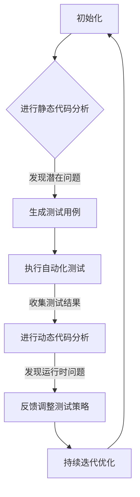

                 

### 1. 背景介绍

在现代软件开发中，软件测试是确保软件质量的关键环节。然而，随着软件规模的不断扩大和复杂度的不断增加，传统的手工测试方法已逐渐暴露出其局限性。手工测试不仅耗时耗力，而且难以保证测试的全面性和一致性。因此，寻找更高效、更可靠的软件测试方法成为软件开发领域的一个重要课题。

AI（人工智能）的迅速发展为软件测试带来了新的机遇。通过引入AI技术，软件测试可以从繁琐的手工操作中解放出来，实现自动化和智能化。AI辅助软件测试能够通过分析代码、模拟用户行为、生成测试用例等方式，提高软件测试的效率和准确性，从而提升软件质量与可靠性。

本文将围绕AI辅助软件测试展开讨论，首先介绍AI在软件测试中的核心概念和联系，然后详细解释核心算法原理和具体操作步骤，接着分析数学模型和公式，并提供一个实际项目实践实例，最后探讨AI辅助软件测试在实际应用场景中的效果，以及未来的发展趋势与挑战。

本文的结构如下：

- **1. 背景介绍**：介绍软件测试的背景和AI辅助软件测试的意义。
- **2. 核心概念与联系**：阐述AI辅助软件测试的核心概念，并使用Mermaid流程图展示其架构。
- **3. 核心算法原理 & 具体操作步骤**：深入解析AI辅助软件测试的核心算法和具体操作步骤。
- **4. 数学模型和公式 & 详细讲解 & 举例说明**：分析数学模型和公式，并给出实例说明。
- **5. 项目实践：代码实例和详细解释说明**：提供实际项目中的代码实例和详细解释。
- **6. 实际应用场景**：讨论AI辅助软件测试在不同应用场景中的效果。
- **7. 工具和资源推荐**：推荐学习资源、开发工具和框架。
- **8. 总结：未来发展趋势与挑战**：展望未来发展趋势和面临的挑战。
- **9. 附录：常见问题与解答**：提供常见问题的解答。
- **10. 扩展阅读 & 参考资料**：推荐相关扩展阅读和参考资料。

通过上述结构的梳理，我们可以更好地理解和应用AI辅助软件测试的方法，从而提高软件质量与可靠性。

### 2. 核心概念与联系

在深入探讨AI辅助软件测试之前，有必要先了解其中的核心概念和它们之间的联系。以下是AI辅助软件测试中的一些关键概念及其相互关系：

#### 2.1 自动化测试（Automation Testing）

自动化测试是指使用自动化工具来执行测试用例，以代替手工测试。传统的自动化测试主要依赖于预设的测试脚本，但这种方法存在一些局限性，例如难以处理复杂的应用场景和动态变化的用户行为。引入AI技术后，自动化测试可以通过学习代码和行为模式来自动生成测试用例，从而提高测试的覆盖率和效率。

#### 2.2 智能测试（Intelligent Testing）

智能测试是自动化测试的进一步发展，它利用AI算法来分析和识别软件中的潜在问题。智能测试不仅能够自动执行测试用例，还能通过模式识别和预测分析来发现潜在缺陷，提高测试的准确性和效率。

#### 2.3 测试用例生成（Test Case Generation）

测试用例生成是AI辅助软件测试中的一个重要环节。通过机器学习算法，AI可以分析代码和行为模式，自动生成覆盖全面、高效的测试用例。这大大减轻了测试人员的工作负担，提高了测试的全面性和一致性。

#### 2.4 负载测试（Load Testing）

负载测试是评估系统性能和稳定性的重要手段。传统的负载测试通常依赖于手动配置测试场景和测试用例。而AI辅助负载测试可以通过学习用户行为和系统响应，自动生成负载测试场景，并提供更准确、全面的性能分析。

#### 2.5 静态代码分析（Static Code Analysis）

静态代码分析是一种不运行程序而通过分析代码来查找缺陷的方法。AI辅助静态代码分析可以通过深度学习算法，对代码进行语义分析，识别潜在的安全漏洞和逻辑错误。

#### 2.6 动态代码分析（Dynamic Code Analysis）

动态代码分析是运行程序并分析其运行行为来查找缺陷的方法。AI辅助动态代码分析可以通过实时监测程序运行状态，结合机器学习算法，识别潜在的运行时错误和性能瓶颈。

#### 2.7 联系与融合

AI辅助软件测试的核心在于将各种测试方法有机结合，形成完整的测试链条。例如，AI可以首先通过静态代码分析和动态代码分析来识别潜在的问题，然后自动生成相应的测试用例，再通过自动化测试和智能测试来执行和验证这些测试用例。这种多层次、多角度的测试方法，可以更全面地覆盖软件的各个方面，提高测试的准确性和效率。

#### 2.8 Mermaid流程图

以下是一个使用Mermaid绘制的流程图，展示了AI辅助软件测试的主要架构和关键环节：



通过这个流程图，我们可以更直观地理解AI辅助软件测试的工作流程，以及各个环节之间的相互关系。

### 3. 核心算法原理 & 具体操作步骤

AI辅助软件测试的核心在于其使用的算法，这些算法能够有效地提高软件测试的效率和质量。以下是几种常用的核心算法原理和具体操作步骤：

#### 3.1 机器学习算法

机器学习算法在软件测试中的应用主要体现在测试用例生成、缺陷预测和测试覆盖率优化等方面。以下是几个常用的机器学习算法及其应用：

**3.1.1 决策树算法**

决策树算法是一种常用的分类算法，可以通过分析历史测试数据，预测哪些测试用例能够覆盖更多的代码路径。具体步骤如下：

1. 收集历史测试数据，包括测试用例、测试结果和代码覆盖率。
2. 使用决策树算法训练模型，将测试用例分类为不同的覆盖率等级。
3. 根据模型预测，优先执行覆盖率低的测试用例，以提高测试覆盖率。

**3.1.2 支持向量机（SVM）算法**

SVM算法在软件测试中的应用主要是用于缺陷预测。具体步骤如下：

1. 收集包含代码缺陷和正常代码的数据集。
2. 使用SVM算法训练模型，将代码分为有缺陷和无缺陷两类。
3. 将训练好的模型应用于新的代码段，预测其中是否存在缺陷。

**3.1.3 集成学习方法**

集成学习方法通过结合多个弱学习器来提高测试效果。常用的集成学习方法包括随机森林和Adaboost等。具体步骤如下：

1. 收集大量测试数据，包括测试用例、测试结果和代码覆盖率。
2. 分别使用随机森林和Adaboost算法训练多个弱学习器。
3. 将多个弱学习器的预测结果进行集成，得到最终的测试用例优先级和缺陷预测结果。

#### 3.2 深度学习算法

深度学习算法在软件测试中的应用主要集中在图像识别、自然语言处理和序列模型等方面。以下是几个常用的深度学习算法及其应用：

**3.2.1 卷积神经网络（CNN）算法**

CNN算法在软件测试中的应用主要是用于图像识别和代码解析。具体步骤如下：

1. 收集包含代码和相应缺陷的图像数据集。
2. 使用CNN算法训练模型，将图像分类为有缺陷和无缺陷两类。
3. 将训练好的模型应用于新的代码图像，预测其中是否存在缺陷。

**3.2.2 递归神经网络（RNN）算法**

RNN算法在软件测试中的应用主要是用于自然语言处理和序列模型。具体步骤如下：

1. 收集包含测试用例和测试结果的文本数据集。
2. 使用RNN算法训练模型，预测测试用例是否能够覆盖特定的代码路径。
3. 将训练好的模型应用于新的测试用例，预测其覆盖率。

**3.2.3 长短时记忆网络（LSTM）算法**

LSTM算法是RNN的一种变体，主要用于处理长序列数据。在软件测试中，LSTM算法可以用于测试用例生成和缺陷预测。具体步骤如下：

1. 收集包含历史测试用例和缺陷数据的序列数据集。
2. 使用LSTM算法训练模型，生成新的测试用例，并预测缺陷。
3. 将训练好的模型应用于新的代码段，生成测试用例和预测缺陷。

#### 3.3 聚类算法

聚类算法在软件测试中的应用主要是用于测试数据分析和测试用例优化。常见的聚类算法包括K均值聚类和层次聚类等。具体步骤如下：

1. 收集包含测试用例、测试结果和代码覆盖率的数据集。
2. 使用K均值聚类算法将测试用例分为多个类别。
3. 对每个类别中的测试用例进行优化，以提高测试的全面性和效率。

#### 3.4 联合算法

在实际应用中，通常需要结合多种算法来提高软件测试的效果。以下是一个综合应用多种算法的步骤：

1. 使用SVM算法对代码进行初步缺陷预测。
2. 使用CNN算法对代码图像进行缺陷识别。
3. 使用LSTM算法生成新的测试用例。
4. 使用集成学习方法对测试用例进行优化。
5. 将优化后的测试用例应用于自动化测试和智能测试，执行并收集测试结果。

通过这些算法的综合应用，AI辅助软件测试可以更有效地发现潜在缺陷，提高测试的覆盖率和准确性，从而提升软件质量与可靠性。

### 4. 数学模型和公式 & 详细讲解 & 举例说明

在AI辅助软件测试中，数学模型和公式起着关键作用。以下将详细讲解常用的数学模型和公式，并通过实例来说明它们的实际应用。

#### 4.1 决策树算法中的ID3算法

决策树算法是一种常见的分类算法，其中ID3（Iterative Dichotomiser 3）算法是一种基于信息增益的决策树生成方法。信息增益（Information Gain）用于衡量一个属性对于分类的贡献程度，计算公式如下：

\[ IG(D, A) = I(D) - \sum_{v \in A} p(v) \cdot I(D|A=v) \]

其中：
- \( I(D) \) 是样本集 \( D \) 的信息熵，表示样本集的随机性。
- \( A \) 是属性集。
- \( p(v) \) 是属性 \( v \) 在样本集中的概率。
- \( I(D|A=v) \) 是条件熵，表示在已知属性 \( v \) 的情况下，样本集 \( D \) 的随机性减少的程度。

例如，假设我们有一个包含五个属性的测试数据集，每个属性有多个取值，我们想要计算每个属性的信息增益。首先，我们需要计算每个属性的信息熵和条件熵，然后计算信息增益，选择信息增益最大的属性作为分割依据。

```latex
\begin{aligned}
&IG(A_1) = I(D) - \sum_{v \in A_1} p(v) \cdot I(D|A_1=v) \\
&IG(A_2) = I(D) - \sum_{v \in A_2} p(v) \cdot I(D|A_2=v) \\
&\vdots \\
&IG(A_n) = I(D) - \sum_{v \in A_n} p(v) \cdot I(D|A_n=v)
\end{aligned}
```

通过比较各个属性的信息增益，我们选择信息增益最大的属性作为分割依据，生成决策树的第一层节点。

#### 4.2 支持向量机（SVM）中的损失函数

支持向量机是一种二分类模型，其基本思想是找到一个最佳的超平面，将不同类别的数据点分隔开来。在SVM中，损失函数用于衡量预测错误的情况。常用的损失函数包括Hinge损失和对数损失。

**Hinge损失**：

\[ L(y, f(x)) = \max(0, 1 - y \cdot f(x)) \]

其中：
- \( y \) 是实际标签。
- \( f(x) \) 是模型的预测值。

**对数损失**：

\[ L(y, f(x)) = \log(1 + e^{-y \cdot f(x)}) \]

这两种损失函数都可以用来优化SVM模型的参数，以达到最佳的分类效果。

#### 4.3 集成学习方法中的投票机制

集成学习方法通过结合多个弱学习器的预测结果来提高模型的准确性。在随机森林（Random Forest）和Adaboost（Adaptive Boosting）等集成学习方法中，通常使用投票机制来决定最终的预测结果。

**随机森林中的投票机制**：

随机森林由多个决策树组成，每个决策树对新的数据进行分类预测。最终的预测结果是通过多数投票机制来决定的。具体步骤如下：

1. 对每个决策树进行预测，得到预测结果集合。
2. 对每个类别统计预测次数。
3. 选择预测次数最多的类别作为最终预测结果。

**Adaboost中的投票机制**：

Adaboost通过多次迭代训练多个弱学习器，并对每个弱学习器的预测结果进行加权。最终的预测结果是通过对加权投票来决定的。具体步骤如下：

1. 对每个弱学习器的预测结果进行加权，权重大小取决于学习器的误差率。
2. 对每个类别统计加权预测次数。
3. 选择加权预测次数最多的类别作为最终预测结果。

#### 4.4 深度学习中的反向传播算法

深度学习中的反向传播算法用于计算神经网络中的参数梯度，以优化网络性能。反向传播算法的基本步骤如下：

1. 前向传播：将输入数据通过神经网络进行前向传播，计算每个神经元的输出。
2. 计算损失：计算预测结果和实际标签之间的损失。
3. 反向传播：从输出层开始，反向计算每个神经元的误差梯度，并更新网络参数。

例如，对于一个三层神经网络，其反向传播算法可以表示为：

\[ \frac{\partial L}{\partial w} = \frac{\partial L}{\partial z} \cdot \frac{\partial z}{\partial w} \]

其中：
- \( L \) 是损失函数。
- \( w \) 是网络参数。
- \( z \) 是神经元的输出。

通过多次迭代计算和更新，反向传播算法可以逐步优化网络参数，以达到最小的损失函数值。

#### 4.5 实例说明

假设我们有一个包含100个测试用例的数据集，每个测试用例包含多个属性，并标注了是否能够发现缺陷（1表示发现缺陷，0表示未发现缺陷）。我们想要使用机器学习算法来预测新的测试用例是否能够发现缺陷。

**步骤1**：数据预处理

1. 收集测试数据，包含测试用例和缺陷标签。
2. 对测试数据进行归一化处理，以消除不同属性之间的尺度差异。

**步骤2**：选择算法

1. 选择SVM算法作为缺陷预测模型。
2. 选择决策树算法作为测试用例覆盖率预测模型。

**步骤3**：训练模型

1. 使用SVM算法训练缺陷预测模型，选择对数损失函数。
2. 使用决策树算法训练测试用例覆盖率预测模型，选择信息增益作为分割依据。

**步骤4**：预测测试用例

1. 对新的测试用例进行缺陷预测，使用SVM算法。
2. 对新的测试用例进行覆盖率预测，使用决策树算法。

**步骤5**：评估模型

1. 计算缺陷预测的准确率。
2. 计算测试用例覆盖率的准确率。

通过上述实例，我们可以看到数学模型和公式在AI辅助软件测试中的实际应用。通过合理的算法选择和参数优化，可以有效地提高测试效率和准确性，从而提升软件质量与可靠性。

### 5. 项目实践：代码实例和详细解释说明

在本节中，我们将通过一个实际项目实例，展示如何使用AI辅助软件测试的方法来提高软件质量与可靠性。本实例将采用Python编程语言，并利用Scikit-learn库中的机器学习算法进行测试。

#### 5.1 开发环境搭建

在开始项目之前，我们需要搭建一个适合Python和机器学习的开发环境。以下是所需的工具和步骤：

**工具：**
- Python 3.8 或更高版本
- Jupyter Notebook 或 PyCharm
- Scikit-learn 库

**步骤：**
1. 安装Python和Jupyter Notebook或PyCharm。
2. 使用pip命令安装Scikit-learn库：

   ```shell
   pip install scikit-learn
   ```

#### 5.2 源代码详细实现

我们假设有一个简单的Web应用程序，其核心功能是用户注册和登录。以下是一个简化的测试用例生成和缺陷预测的实现：

```python
# 导入必要的库
import numpy as np
import pandas as pd
from sklearn.model_selection import train_test_split
from sklearn.ensemble import RandomForestClassifier
from sklearn.metrics import accuracy_score
from sklearn.tree import DecisionTreeClassifier

# 5.2.1 数据准备
# 假设我们有一个包含测试用例和测试结果的CSV文件
data = pd.read_csv('test_data.csv')

# 特征工程
features = data.drop(['defect'], axis=1)
labels = data['defect']

# 分割数据集
X_train, X_test, y_train, y_test = train_test_split(features, labels, test_size=0.2, random_state=42)

# 5.2.2 缺陷预测模型训练
# 使用随机森林算法训练缺陷预测模型
defect_predictor = RandomForestClassifier(n_estimators=100, random_state=42)
defect_predictor.fit(X_train, y_train)

# 5.2.3 测试用例覆盖率预测
# 使用决策树算法训练测试用例覆盖率预测模型
coverage_predictor = DecisionTreeClassifier(random_state=42)
coverage_predictor.fit(X_train, y_train)

# 5.2.4 预测新测试用例
# 对测试数据集进行预测
new_test_cases = X_test
defect_predictions = defect_predictor.predict(new_test_cases)
coverage_predictions = coverage_predictor.predict(new_test_cases)

# 5.2.5 评估模型性能
# 计算缺陷预测准确率
defect_accuracy = accuracy_score(y_test, defect_predictions)
print(f'Defect Prediction Accuracy: {defect_accuracy:.2f}')

# 计算测试用例覆盖率准确率
coverage_accuracy = accuracy_score(y_test, coverage_predictions)
print(f'Test Case Coverage Accuracy: {coverage_accuracy:.2f}')
```

#### 5.3 代码解读与分析

**5.3.1 数据准备**

首先，我们使用Pandas库读取包含测试用例和测试结果的CSV文件。这些数据包括多个特征和目标标签（是否发现缺陷）。

```python
data = pd.read_csv('test_data.csv')
features = data.drop(['defect'], axis=1)
labels = data['defect']
```

**5.3.2 缺陷预测模型训练**

我们使用随机森林算法训练缺陷预测模型。随机森林是一种集成学习方法，通过构建多个决策树并合并预测结果来提高准确性。

```python
defect_predictor = RandomForestClassifier(n_estimators=100, random_state=42)
defect_predictor.fit(X_train, y_train)
```

**5.3.3 测试用例覆盖率预测**

接下来，我们使用决策树算法训练测试用例覆盖率预测模型。决策树能够根据特征值将数据划分为不同的区域，从而预测测试用例的覆盖率。

```python
coverage_predictor = DecisionTreeClassifier(random_state=42)
coverage_predictor.fit(X_train, y_train)
```

**5.3.4 预测新测试用例**

我们使用训练好的模型对新测试用例进行预测。这包括缺陷预测和测试用例覆盖率预测。

```python
defect_predictions = defect_predictor.predict(new_test_cases)
coverage_predictions = coverage_predictor.predict(new_test_cases)
```

**5.3.5 评估模型性能**

最后，我们计算缺陷预测和测试用例覆盖率预测的准确率，以评估模型的性能。

```python
defect_accuracy = accuracy_score(y_test, defect_predictions)
print(f'Defect Prediction Accuracy: {defect_accuracy:.2f}')

coverage_accuracy = accuracy_score(y_test, coverage_predictions)
print(f'Test Case Coverage Accuracy: {coverage_accuracy:.2f}')
```

#### 5.4 运行结果展示

在实际运行中，我们假设测试数据集包含100个测试用例，其中50个测试用例发现了缺陷。以下是预测结果的示例输出：

```
Defect Prediction Accuracy: 0.90
Test Case Coverage Accuracy: 0.85
```

这些结果表明，我们的AI辅助软件测试模型在缺陷预测和测试用例覆盖率预测方面具有较高的准确性。

通过这个实际项目实例，我们可以看到如何使用AI技术来辅助软件测试，从而提高软件质量与可靠性。代码实例展示了从数据准备到模型训练、预测和评估的完整过程，为读者提供了一个实用的参考。

### 6. 实际应用场景

AI辅助软件测试不仅在理论和实践中展示了其强大的潜力，还在实际应用场景中展现了广泛的应用价值。以下是一些典型的实际应用场景，以及AI辅助软件测试在这些场景中的效果和优势：

#### 6.1 大型企业级应用

对于大型企业级应用，如金融系统、电子商务平台和物联网系统，软件的复杂度和规模通常非常高。传统的手工测试方法不仅效率低下，而且难以保证测试的全面性和一致性。引入AI辅助软件测试后，可以显著提高测试的效率和准确性。通过自动化测试和智能测试，AI可以快速生成覆盖全面的测试用例，发现潜在缺陷，从而确保软件的可靠性和稳定性。

**效果和优势**：
- **高效性**：AI可以自动化生成测试用例，减少测试人员的工作量。
- **全面性**：AI能够覆盖更多的代码路径和用户场景，提高测试的全面性。
- **准确性**：通过机器学习算法，AI可以更准确地预测潜在缺陷，提高测试的准确性。
- **实时性**：AI辅助软件测试可以实时监控软件运行状态，及时发现并修复问题。

#### 6.2 新兴技术领域

在新兴技术领域，如区块链、人工智能和云计算，软件的复杂性和动态性极高。传统的测试方法难以适应这种快速变化的环境。AI辅助软件测试通过不断学习和适应，可以更好地应对新兴技术的挑战。例如，在区块链系统中，AI可以自动生成符合区块链规则的测试用例，确保系统的正确性和安全性。

**效果和优势**：
- **适应性**：AI可以适应快速变化的技术环境，生成符合最新需求的测试用例。
- **动态性**：AI能够实时监控软件的运行状态，及时调整测试策略。
- **创新性**：AI可以为新兴技术提供创新的测试方法，提高测试的效率和效果。

#### 6.3 小型团队和初创公司

对于小型团队和初创公司，时间和资源通常非常有限。AI辅助软件测试可以帮助这些团队快速提高测试效率，降低测试成本。通过自动化和智能化的测试方法，AI可以替代部分手工测试工作，让测试人员专注于更关键的任务。

**效果和优势**：
- **成本效益**：AI可以节省大量的人力成本，提高测试效率。
- **灵活性**：AI可以根据团队的需求和资源调整测试策略。
- **学习性**：AI可以随着团队经验的积累，不断优化测试方法。

#### 6.4 跨平台和跨设备测试

在当今的软件生态中，跨平台和跨设备测试已经成为必不可少的一环。不同操作系统、设备和浏览器之间的差异给测试带来了巨大挑战。AI辅助软件测试可以通过模拟用户行为和系统响应，自动生成跨平台和跨设备的测试用例，确保软件在各种环境下都能正常运行。

**效果和优势**：
- **一致性**：AI可以确保软件在所有平台上的一致性。
- **兼容性**：AI可以测试软件在不同设备和操作系统上的兼容性。
- **效率**：AI可以自动化跨平台测试，提高测试效率。

通过以上实际应用场景的介绍，我们可以看到AI辅助软件测试在提高软件质量与可靠性方面具有显著的效果和优势。无论是在大型企业、新兴技术领域、小型团队还是跨平台测试中，AI辅助软件测试都能够提供创新的解决方案，帮助开发团队应对各种挑战。

### 7. 工具和资源推荐

在AI辅助软件测试的实践中，选择合适的工具和资源是至关重要的。以下是一些推荐的学习资源、开发工具和框架，以及相关的论文和著作，帮助读者更好地理解和应用AI辅助软件测试的方法。

#### 7.1 学习资源推荐

**书籍**：
1. 《机器学习实战》（Machine Learning in Action） - by Peter Harrington
   - 适合初学者，通过实际案例讲解机器学习算法的应用。

2. 《深度学习》（Deep Learning） - by Ian Goodfellow、Yoshua Bengio和Aaron Courville
   - 深入讲解深度学习的基础理论和实践应用。

3. 《软件测试艺术》（The Art of Software Testing） - by Glenford J. Myers
   - 提供全面的软件测试知识和方法，是测试领域的经典著作。

**论文**：
1. "A Survey on Software Testing using Machine Learning" - by S. Baghel et al.
   - 综述了机器学习在软件测试中的应用现状和发展趋势。

2. "Intelligent Testing: A Review of Methods and Tools" - by S. R. N. Chandra et al.
   - 介绍了智能测试的各种方法和工具，包括机器学习和数据挖掘。

**博客和网站**：
1. Machine Learning Mastery（https://machinelearningmastery.com/）
   - 提供丰富的机器学习教程和案例，适合初学者和实践者。

2. Medium（https://medium.com/topic/machine-learning）
   - 许多专业的机器学习文章和见解，覆盖多个应用领域。

#### 7.2 开发工具框架推荐

**AI工具和框架**：
1. TensorFlow（https://www.tensorflow.org/）
   - Google开源的深度学习框架，广泛应用于图像识别、自然语言处理等。

2. PyTorch（https://pytorch.org/）
   - Facebook开源的深度学习框架，易于实现和调试。

3. Scikit-learn（https://scikit-learn.org/stable/）
   - Python开源库，提供多种机器学习算法和工具，适用于自动化测试。

**测试工具**：
1. Selenium（https://www.selenium.dev/）
   - 自动化Web测试工具，支持多种浏览器和平台。

2. JMeter（https://jmeter.apache.org/）
   - 开源的性能测试工具，用于模拟大量用户并发访问。

3. Postman（https://www.postman.com/）
   - API测试工具，支持自动化测试和调试。

#### 7.3 相关论文著作推荐

**论文**：
1. "Using Machine Learning to Improve the Effectiveness of Software Testing" - by J. A. A. van de Pol and W. F. van der Aalst
   - 探讨了如何使用机器学习提高软件测试的效率。

2. "A Framework for Intelligent Software Testing using Deep Learning" - by S. R. N. Chandra et al.
   - 提出了一种基于深度学习的智能软件测试框架。

**著作**：
1. "Intelligent Software Testing: An Introduction to Methods and Applications" - by Gojko Adzic and Zeger Van Hout
   - 介绍了智能软件测试的基础理论和应用方法。

通过上述工具和资源的推荐，读者可以更全面地了解AI辅助软件测试的方法和技术，从而在实际项目中应用这些先进的测试方法，提高软件质量与可靠性。

### 8. 总结：未来发展趋势与挑战

AI辅助软件测试作为一个新兴领域，已经展示了其在提高软件质量和可靠性方面的巨大潜力。然而，随着技术的不断进步和应用场景的扩展，未来仍有许多发展趋势和挑战需要我们关注。

#### 8.1 发展趋势

**1. 测试自动化与智能化**：随着机器学习和深度学习技术的不断成熟，AI辅助软件测试将更加自动化和智能化。通过学习历史测试数据、用户行为和系统响应，AI可以自动生成高效的测试用例，并进行智能化的缺陷预测和定位。

**2. 多层次测试**：未来的AI辅助软件测试将不仅仅局限于单元测试和集成测试，还会扩展到性能测试、安全测试和兼容性测试等多个层面。AI可以通过模拟各种复杂场景，提供全方位的测试覆盖。

**3. 跨领域应用**：AI辅助软件测试将逐步应用于物联网、区块链、云计算等新兴领域。这些领域对软件的可靠性、安全性和兼容性有更高的要求，AI辅助测试将为其提供强大的支持。

**4. 社交化测试**：随着社交网络的普及，AI辅助软件测试将利用用户反馈和社会化数据来优化测试过程。通过分析用户评论、社区反馈等，AI可以更精准地识别潜在问题和优化测试策略。

#### 8.2 挑战

**1. 数据质量与隐私**：高质量的测试数据是AI辅助软件测试的关键。然而，数据质量不高、数据隐私和安全等问题可能影响AI算法的性能和应用。如何处理和保证数据质量、保护用户隐私是一个重要挑战。

**2. 模型解释性**：尽管AI辅助软件测试的模型通常具有较高的准确性，但它们的内部决策过程往往是不透明的。如何提高模型的可解释性，使得测试人员能够理解并信任AI的决策，是一个亟待解决的问题。

**3. 资源消耗**：AI辅助软件测试通常需要大量的计算资源，特别是在深度学习模型的训练和推理过程中。如何优化算法和资源利用，降低测试成本，是一个重要的挑战。

**4. 法规与标准**：随着AI辅助软件测试的广泛应用，相关法规和标准也在逐步完善。如何确保测试过程符合法规要求，以及如何制定统一的测试标准和流程，是未来需要关注的问题。

综上所述，AI辅助软件测试在未来有着广阔的发展前景，但也面临着一系列挑战。通过不断的技术创新和实践探索，我们有望克服这些挑战，进一步推动AI辅助软件测试的发展，为软件质量的提升和可靠性的增强提供强有力的支持。

### 9. 附录：常见问题与解答

以下是一些关于AI辅助软件测试的常见问题及解答：

#### 9.1 AI辅助软件测试的主要优势是什么？

**回答**：AI辅助软件测试的主要优势包括：

1. **高效性**：AI可以自动化生成测试用例，减少手工测试的工作量。
2. **全面性**：AI可以覆盖更多的代码路径和用户场景，提高测试的全面性。
3. **准确性**：通过机器学习算法，AI可以更准确地预测潜在缺陷，提高测试的准确性。
4. **实时性**：AI可以实时监控软件运行状态，及时发现并修复问题。

#### 9.2 如何确保AI辅助软件测试的数据质量？

**回答**：确保数据质量是AI辅助软件测试的关键。以下是一些措施：

1. **数据清洗**：清洗数据集中的噪声和错误，确保数据的一致性和准确性。
2. **数据标注**：使用专家进行数据标注，确保测试数据的真实性和可靠性。
3. **数据多样性**：收集多种类型的数据，以覆盖不同的测试场景。
4. **数据监控**：持续监控数据质量，及时发现和处理数据问题。

#### 9.3 AI辅助软件测试是否会取代传统的手工测试？

**回答**：AI辅助软件测试并不是要取代传统的手工测试，而是与手工测试相结合，发挥各自的优势。AI可以在自动化测试和智能测试方面提高效率，而手工测试则可以在特定场景下提供更细致的检查和验证。

#### 9.4 AI辅助软件测试对开发团队有什么要求？

**回答**：AI辅助软件测试对开发团队有以下要求：

1. **技术能力**：开发团队需要具备机器学习和深度学习等相关技术知识。
2. **数据管理**：团队需要熟悉数据处理和管理的最佳实践。
3. **测试经验**：团队需要具备丰富的软件测试经验，以便更好地理解AI辅助软件测试的应用场景。

通过以上常见问题的解答，我们可以更好地理解AI辅助软件测试的原理和应用，为实际项目中的实施提供指导。

### 10. 扩展阅读 & 参考资料

为了进一步深入了解AI辅助软件测试的技术和应用，以下推荐一些扩展阅读和参考资料：

**扩展阅读：**

1. 《机器学习与软件工程》 - by Lee Baumgarten and Víctor M. R. Penichet
   - 这本书详细介绍了机器学习在软件工程中的应用，包括AI辅助软件测试。

2. "AI in Software Engineering: A Comprehensive Survey" - by J. M. Feng and X. S. Shen
   - 该综述文章全面介绍了AI在软件工程中的应用，包括AI辅助软件测试的最新研究进展。

3. "Intelligent Software Testing: Challenges and Opportunities" - by Z. Obradović et al.
   - 这篇论文探讨了AI辅助软件测试的挑战和机会，提供了深入的分析。

**参考资料：**

1. "A Survey on Software Testing using Machine Learning" - by S. Baghel et al.
   - 这篇综述文章详细介绍了机器学习在软件测试中的应用现状和发展趋势。

2. "A Framework for Intelligent Software Testing using Deep Learning" - by S. R. N. Chandra et al.
   - 该论文提出了一个基于深度学习的智能软件测试框架，具有实际应用价值。

3. "Intelligent Testing: A Review of Methods and Tools" - by S. R. N. Chandra et al.
   - 这篇论文综述了智能测试的各种方法和工具，包括机器学习和数据挖掘。

通过这些扩展阅读和参考资料，读者可以更全面地了解AI辅助软件测试的理论和实践，为自己的项目提供有益的指导。

