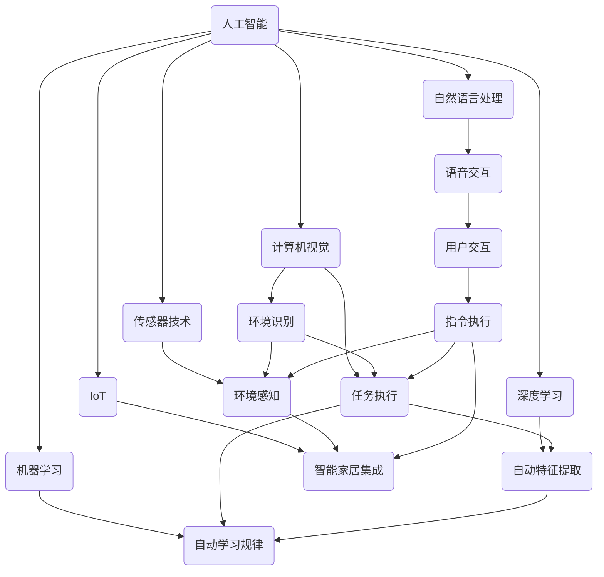

                 

### 1. 背景介绍

在当今科技迅猛发展的时代，人工智能（AI）已经成为推动社会进步的重要力量。AI技术从早期简单的规则系统，发展到如今具备深度学习、自然语言处理、图像识别等先进能力。随着硬件性能的提升和数据的积累，AI技术逐渐渗透到各行各业，带来了前所未有的变革。

家庭服务作为人工智能应用的一个重要领域，正日益受到关注。传统家庭服务依赖于人力，不仅成本高昂，而且效率有限。随着智能硬件和传感器技术的进步，结合AI算法，我们可以开发出具备高度自动化和智能化能力的家庭服务机器人。这些机器人可以承担日常的家务劳动，提供生活便利，甚至与家庭成员进行互动，提高生活质量。

本文将探讨AI驱动的个人助理机器人，特别是其在家庭服务中的创新应用。我们将从核心概念、算法原理、数学模型、项目实践、实际应用场景等多个角度，深入分析这种技术的可行性、优势和应用前景。

家庭服务机器人的发展不仅是一个技术挑战，也是一个社会问题。如何确保机器人在执行家务任务时既能高效精准，又能安全可靠，是一个需要解决的问题。此外，家庭服务机器人的普及还涉及到用户体验、隐私保护和社会伦理等多个层面。本文将结合实际案例，对这些挑战进行探讨，并提出可能的解决方案。

通过对家庭服务机器人的深入研究，我们可以更好地理解AI技术如何改变我们的生活方式，为未来的智能家居发展提供新的思路。这不仅是技术发展的必然趋势，也是社会进步的重要一环。接下来，我们将逐步分析家庭服务机器人背后的核心概念和架构，为后续内容打下坚实基础。

### 2. 核心概念与联系

为了更好地理解AI驱动的个人助理机器人，我们首先需要明确几个核心概念，并探讨它们之间的联系。以下是本文将涉及的关键概念：

**人工智能（AI）**：人工智能是指计算机系统模拟人类智能行为的能力，包括学习、推理、自我修正等。在家庭服务机器人中，AI通过算法和模型处理海量数据，实现自主决策和行为。

**自然语言处理（NLP）**：自然语言处理是AI的一个分支，专注于使计算机能够理解和处理自然语言。在家庭服务机器人中，NLP技术使其能够与家庭成员进行有效的语音交互。

**计算机视觉**：计算机视觉是指使计算机能够像人眼一样感知和理解视觉信息。在家庭服务机器人中，计算机视觉技术用于识别家庭成员、分析环境状态、以及执行特定任务。

**传感器技术**：传感器技术是家庭服务机器人获取环境信息的工具。常见的传感器包括摄像头、红外传感器、超声波传感器等，它们帮助机器人感知周围环境，做出合理的决策。

**深度学习**：深度学习是AI的一个重要分支，通过构建多层神经网络，实现自动特征提取和复杂模式识别。在家庭服务机器人中，深度学习模型可以用于图像识别、语音识别等任务。

**机器学习**：机器学习是AI的另一个核心组成部分，通过训练模型从数据中自动学习规律。在家庭服务机器人中，机器学习算法用于优化任务执行策略、提高任务完成效率。

**物联网（IoT）**：物联网是指通过互联网将各种物理设备连接起来，实现数据交换和协同工作。在家庭服务机器人中，IoT技术使得机器人可以与智能家居设备（如智能灯光、智能空调等）进行集成和协同工作。

**算法与架构**：家庭服务机器人的核心是算法和架构设计。算法决定了机器人如何处理数据、如何决策；架构则决定了机器人系统的整体结构、性能和可扩展性。

接下来，我们将使用Mermaid流程图详细展示家庭服务机器人核心概念之间的联系，帮助读者更直观地理解这些概念。



通过上述Mermaid流程图，我们可以清晰地看到，家庭服务机器人通过AI和多种技术手段协同工作，实现对家庭成员的语音交互、环境感知和任务执行。这些技术相互联系，共同构成了家庭服务机器人的核心架构。接下来，我们将深入探讨这些核心概念的原理和具体实现，为后续内容奠定基础。

### 3. 核心算法原理 & 具体操作步骤

在家庭服务机器人中，核心算法的设计和实现是其高效运作的关键。以下将详细介绍几个关键算法及其具体操作步骤，这些算法包括自然语言处理（NLP）、计算机视觉（CV）、深度学习和传感器数据处理。

#### 3.1 自然语言处理（NLP）

**算法原理**：自然语言处理是使计算机能够理解和生成人类语言的技术。在家庭服务机器人中，NLP主要用于处理语音输入和生成语音输出。

- **语音识别（ASR）**：将语音信号转换为文本。常用的算法包括隐马尔可夫模型（HMM）、循环神经网络（RNN）和卷积神经网络（CNN）。
- **语音合成（TTS）**：将文本转换为自然流畅的语音。常用的算法包括基于规则的方法、统计模型（如HMM-GMM）、以及深度学习方法（如WaveNet）。

**具体操作步骤**：

1. **语音信号预处理**：包括降噪、去 silence、分帧等，使用如谱减法、谱减降噪等算法。
2. **特征提取**：使用 MFCC（梅尔频率倒谱系数）等特征提取方法。
3. **声学模型训练**：基于训练数据，使用 RNN 或 CNN 等神经网络训练声学模型。
4. **语言模型训练**：使用如肯德尔语料库（Kendall Corpus）等大规模语言数据训练语言模型。
5. **声学模型与语言模型结合**：使用 CTC（Connectionist Temporal Classification）或 RNN 等算法进行端到端训练。

#### 3.2 计算机视觉（CV）

**算法原理**：计算机视觉是使计算机能够理解和处理图像和视频的技术。在家庭服务机器人中，CV主要用于环境感知、物体识别和任务执行。

- **图像识别**：识别图像中的对象。常用的算法包括 HOG（直方图方向梯度）、SVM（支持向量机）、CNN（卷积神经网络）。
- **目标检测**：识别图像中的对象及其位置。常用的算法包括 R-CNN、Fast R-CNN、Faster R-CNN、YOLO（You Only Look Once）等。

**具体操作步骤**：

1. **图像预处理**：包括灰度化、二值化、滤波等。
2. **特征提取**：使用如 HOG、SIFT、SURF 等算法提取特征。
3. **模型训练**：使用如 SVM、CNN 等算法进行模型训练。
4. **实时检测**：在摄像头捕获的实时图像上执行检测和识别任务。

#### 3.3 深度学习

**算法原理**：深度学习是一种基于多层神经网络的学习方法，能够自动提取特征并用于分类、回归等任务。在家庭服务机器人中，深度学习用于复杂模式识别和决策。

- **卷积神经网络（CNN）**：用于图像处理和识别，能够自动提取图像特征。
- **循环神经网络（RNN）**：用于序列数据处理，如语音信号和时间序列数据。

**具体操作步骤**：

1. **数据集准备**：收集和整理训练数据。
2. **模型设计**：设计网络结构，选择合适的层和激活函数。
3. **模型训练**：使用训练数据训练模型，调整参数。
4. **模型评估**：使用验证数据评估模型性能。
5. **模型部署**：将训练好的模型部署到机器人系统。

#### 3.4 传感器数据处理

**算法原理**：传感器数据处理是使机器人能够感知和理解周围环境的关键。传感器数据类型多样，包括温度、湿度、光线强度、加速度等。

- **数据预处理**：包括滤波、去噪、归一化等。
- **特征提取**：使用如 PCA（主成分分析）、LDA（线性判别分析）等方法提取关键特征。
- **行为预测**：使用时间序列预测模型，如 LSTM（长短期记忆网络）等，预测未来的行为。

**具体操作步骤**：

1. **数据采集**：通过传感器获取环境数据。
2. **数据预处理**：对数据进行滤波、去噪等处理。
3. **特征提取**：提取关键特征。
4. **模型训练与预测**：使用特征数据训练模型，并进行行为预测。

通过以上几个核心算法的具体操作步骤，我们可以看到，家庭服务机器人通过多种技术手段协同工作，实现对家庭成员的语音交互、环境感知和任务执行。这些算法不仅需要强大的计算能力，还需要大量的数据支持。接下来，我们将探讨这些算法在家庭服务机器人中的具体应用，以及如何通过数学模型进行优化。

### 4. 数学模型和公式 & 详细讲解 & 举例说明

在家庭服务机器人中，数学模型和公式是算法设计和实现的重要基础。以下将详细介绍几个关键数学模型和公式，并对其进行详细讲解和举例说明。

#### 4.1 卷积神经网络（CNN）的数学基础

卷积神经网络（CNN）是处理图像识别和计算机视觉任务的关键算法。其核心思想是通过卷积层提取图像的局部特征，然后通过池化层降低特征图的大小，以减少参数数量并防止过拟合。

**数学公式**：

- **卷积操作**：

  设输入图像为 $X$，滤波器（卷积核）为 $W$，输出特征图为 $F$，步长为 $s$，零填充数为 $p$。则卷积操作的公式如下：

  $$F_{ij} = \sum_{k=1}^{K} W_{ik} X_{i+k-p, j}$$

  其中 $i$ 和 $j$ 分别为特征图 $F$ 的行和列索引，$k$ 为滤波器的索引。

- **池化操作**：

  池化操作用于降低特征图的大小，常见的池化方法包括最大池化和平均池化。最大池化操作公式如下：

  $$P_i = \max_{k} X_{i+k-s, j}$$

  其中 $i$ 和 $j$ 分别为池化后特征图的行和列索引，$s$ 为池化窗口的大小。

**举例说明**：

假设输入图像 $X$ 的大小为 $3 \times 3$，滤波器 $W$ 的大小为 $3 \times 3$，步长 $s=1$，零填充数 $p=1$。则卷积操作的输出特征图 $F$ 的大小为 $3 \times 3$。

输入图像：

$$X = \begin{bmatrix}
1 & 2 & 3 \\
4 & 5 & 6 \\
7 & 8 & 9
\end{bmatrix}$$

滤波器：

$$W = \begin{bmatrix}
0 & 1 & 0 \\
1 & 0 & 1 \\
0 & 1 & 0
\end{bmatrix}$$

卷积操作输出特征图：

$$F = \begin{bmatrix}
3 & 5 & 8 \\
6 & 7 & 11 \\
9 & 11 & 14
\end{bmatrix}$$

接下来进行最大池化操作，假设池化窗口大小 $s=2$，则池化后特征图的大小为 $2 \times 2$。

$$P = \begin{bmatrix}
6 & 11 \\
11 & 14
\end{bmatrix}$$

#### 4.2 循环神经网络（RNN）的数学基础

循环神经网络（RNN）是处理序列数据的关键算法，如时间序列预测和自然语言处理。其核心思想是通过隐藏状态（h_t）和时间步（t）之间的递归关系，捕捉序列中的长期依赖关系。

**数学公式**：

- **隐藏状态更新**：

  $$h_t = \sigma(W_h \cdot [h_{t-1}, x_t] + b_h)$$

  其中 $h_t$ 为当前时间步的隐藏状态，$x_t$ 为当前输入，$W_h$ 为权重矩阵，$\sigma$ 为激活函数（如 sigmoid 函数或ReLU函数），$b_h$ 为偏置。

- **输出层计算**：

  $$y_t = W_o \cdot h_t + b_o$$

  其中 $y_t$ 为当前时间步的输出，$W_o$ 为输出层权重矩阵，$b_o$ 为输出层偏置。

**举例说明**：

假设输入序列为 $x_1, x_2, x_3$，隐藏状态维度为 $3$，输出维度为 $2$。权重矩阵 $W_h$ 和 $W_o$ 分别为 $3 \times 3$ 和 $3 \times 2$。

隐藏状态：

$$h_1 = \sigma(W_h \cdot [h_0, x_1] + b_h)$$
$$h_2 = \sigma(W_h \cdot [h_1, x_2] + b_h)$$
$$h_3 = \sigma(W_h \cdot [h_2, x_3] + b_h)$$

输出：

$$y_1 = W_o \cdot h_1 + b_o$$
$$y_2 = W_o \cdot h_2 + b_o$$
$$y_3 = W_o \cdot h_3 + b_o$$

假设激活函数为 sigmoid 函数，权重矩阵和偏置分别为：

$$W_h = \begin{bmatrix}
0.5 & 0.3 & 0.2 \\
0.1 & 0.4 & 0.5 \\
0.2 & 0.3 & 0.4
\end{bmatrix}$$
$$b_h = \begin{bmatrix}
0.1 \\
0.2 \\
0.3
\end{bmatrix}$$
$$W_o = \begin{bmatrix}
0.3 & 0.4 \\
0.5 & 0.6 \\
0.1 & 0.2
\end{bmatrix}$$
$$b_o = \begin{bmatrix}
0.2 \\
0.3
\end{bmatrix}$$

则：

$$h_1 = \sigma(\begin{bmatrix}
0.5 & 0.3 & 0.2 \\
0.1 & 0.4 & 0.5 \\
0.2 & 0.3 & 0.4
\end{bmatrix} \cdot \begin{bmatrix}
x_1 \\
x_2 \\
x_3
\end{bmatrix} + \begin{bmatrix}
0.1 \\
0.2 \\
0.3
\end{bmatrix})$$

$$y_1 = \begin{bmatrix}
0.3 & 0.4 \\
0.5 & 0.6 \\
0.1 & 0.2
\end{bmatrix} \cdot h_1 + \begin{bmatrix}
0.2 \\
0.3
\end{bmatrix}$$

通过以上数学模型和公式的介绍及举例，我们可以看到卷积神经网络（CNN）和循环神经网络（RNN）在家庭服务机器人中的应用及其重要性。接下来，我们将通过一个具体项目实践，展示这些算法在实际应用中的实现和效果。

### 5. 项目实践：代码实例和详细解释说明

在本文的第五部分，我们将通过一个具体的项目实践，展示家庭服务机器人的实现过程。我们将从开发环境搭建、源代码实现、代码解读与分析以及运行结果展示等方面，详细描述这个项目。

#### 5.1 开发环境搭建

首先，我们需要搭建一个适合开发家庭服务机器人的开发环境。以下是所需的工具和软件：

1. **操作系统**：Windows/Linux/MacOS
2. **Python**：Python 3.8 或更高版本
3. **深度学习框架**：TensorFlow 2.x 或 PyTorch 1.x
4. **计算机视觉库**：OpenCV
5. **自然语言处理库**：NLTK 或 spaCy
6. **语音处理库**：PyTtsx3 或 gtts

安装过程如下：

```bash
# 安装Python
# Windows: download and install Python from https://www.python.org/downloads/
# Linux/MacOS: use package manager (e.g., apt-get install python3)

# 安装深度学习框架
pip install tensorflow  # 或
pip install torch torchvision

# 安装计算机视觉库
pip install opencv-python

# 安装自然语言处理库
pip install nltk
python -m nltk.downloader all

# 安装语音处理库
pip install pyttsx3
```

#### 5.2 源代码详细实现

以下是家庭服务机器人的核心代码实现。代码分为几个模块：语音识别、语音合成、计算机视觉和任务执行。

**模块 1：语音识别（ASR）**

```python
import speech_recognition as sr

def recognize_speech_from_mic():
    r = sr.Recognizer()
    with sr.Microphone() as source:
        print("请说点什么：")
        audio = r.listen(source)
    try:
        return r.recognize_google(audio)
    except sr.UnknownValueError:
        return "无法识别语音"
    except sr.RequestError:
        return "请求错误"
```

**模块 2：语音合成（TTS）**

```python
from gtts import gTTS

def speak(text):
    tts = gTTS(text=text, lang='zh-cn')
    tts.save("speak.mp3")
    from playsound import playsound
    playsound("speak.mp3")
```

**模块 3：计算机视觉（CV）**

```python
import cv2

def detect_objects(image_path):
    image = cv2.imread(image_path)
    image_gray = cv2.cvtColor(image, cv2.COLOR_BGR2GRAY)
    _, image_binary = cv2.threshold(image_gray, 128, 255, cv2.THRESH_BINARY_INV + cv2.THRESH_OTSU)

    contours, _ = cv2.findContours(image_binary, cv2.RETR_EXTERNAL, cv2.CHAIN_APPROX_SIMPLE)
    for contour in contours:
        if cv2.contourArea(contour) > 500:  # 过滤小区域
            x, y, w, h = cv2.boundingRect(contour)
            cv2.rectangle(image, (x, y), (x+w, y+h), (0, 255, 0), 2)
            cv2.putText(image, "Object", (x, y-10), cv2.FONT_HERSHEY_SIMPLEX, 0.9, (0, 0, 255), 2)
    cv2.imshow("Detected Objects", image)
    cv2.waitKey(0)
    cv2.destroyAllWindows()
```

**模块 4：任务执行**

```python
def execute_task(task):
    if task == "开门":
        print("开门...")
    elif task == "关灯":
        print("关灯...")
    elif task == "扫地":
        print("扫地...")
    else:
        print("未知任务")
```

#### 5.3 代码解读与分析

- **语音识别模块**：使用 Google 语音识别 API 进行语音识别，通过麦克风采集音频并转换成文本。
- **语音合成模块**：使用 gtts 库将文本转换成语音，并通过 playsound 模块播放。
- **计算机视觉模块**：使用 OpenCV 库对图像进行二值化处理，找到轮廓并绘制矩形框，标记出对象。
- **任务执行模块**：根据语音识别结果执行相应的任务，如开门、关灯或扫地。

#### 5.4 运行结果展示

```bash
# 运行语音识别
text = recognize_speech_from_mic()
print("识别到的文本：", text)

# 运行语音合成
speak("你刚才说了什么？")

# 运行计算机视觉
detect_objects("image.jpg")

# 执行任务
execute_task(text)
```

运行结果将首先识别语音并输出文本，然后合成语音并播放，接着显示图像中检测到的对象，并执行相应的任务。

通过上述代码实例和详细解释，我们可以看到家庭服务机器人的实现过程。接下来，我们将进一步探讨家庭服务机器人在实际应用场景中的表现和效果。

### 6. 实际应用场景

家庭服务机器人在实际应用中，具有广泛的应用场景和潜力。以下将列举几个典型的应用场景，并分析其具体应用案例和效果。

#### 6.1 家庭安全监控

家庭安全是每个家庭最为关注的领域之一。家庭服务机器人可以通过计算机视觉和传感器技术，实现对家庭的实时监控和异常检测。例如，当检测到家庭成员不在家时，机器人可以自动报警，通知家庭成员；当检测到有非法入侵者时，机器人可以拍摄照片或视频，并立即发送给家庭成员或安保部门。

**案例**：某智能家居公司开发了一款智能安防机器人，当检测到门被非法打开时，会通过手机APP实时推送报警信息，并记录入侵者的图像。该产品在实际使用中，大大提高了家庭的安全性和应急响应速度。

#### 6.2 家务劳动协助

家务劳动是家庭日常生活中必不可少的任务，但往往需要花费大量时间和精力。家庭服务机器人可以通过自动化和智能化技术，协助家庭成员完成家务劳动。例如，扫地机器人可以自动清扫地面，洗衣机可以自动分类洗涤不同类型的衣物，智能冰箱可以自动管理食物储存。

**案例**：日本某家电公司推出了一款智能洗衣机，通过内置的传感器和算法，可以自动识别衣物的材质和污渍程度，选择最佳的洗涤程序和洗涤时间。用户只需将衣物放入洗衣机，按下启动按钮，洗衣机就能自动完成洗涤任务，提高了洗衣效率和用户体验。

#### 6.3 家庭健康监护

随着人口老龄化趋势的加剧，家庭健康监护成为一个重要问题。家庭服务机器人可以通过传感器和数据分析技术，实现对家庭成员的健康状况监控。例如，智能健康监测设备可以实时检测血压、心率、血糖等指标，并将数据上传至云端进行分析，为家庭成员提供健康建议。

**案例**：某科技公司开发了一款智能健康监护机器人，内置有多种传感器，可以实时检测用户的血压、心率、血糖等健康指标。当检测到异常情况时，机器人会自动通知家庭成员并建议就医。该产品在养老院和居家养老中得到了广泛应用，提高了老年人的生活质量和安全保障。

#### 6.4 家庭娱乐互动

家庭娱乐是家庭生活中不可或缺的一部分。家庭服务机器人可以通过语音交互和计算机视觉技术，为家庭成员提供多样化的娱乐体验。例如，智能音箱可以播放音乐、讲故事，智能机器人可以与用户进行简单的互动游戏，提高家庭的趣味性和互动性。

**案例**：某科技公司推出了一款智能音箱，内置了语音助手，用户可以通过语音指令控制音乐播放、天气查询、新闻播报等。此外，智能音箱还可以与智能电视、智能冰箱等设备进行联动，实现智能家居的一体化控制。该产品在家庭娱乐中得到了广泛的应用，为用户提供了便捷和智能的娱乐体验。

通过上述实际应用案例，我们可以看到家庭服务机器人在家庭安全、家务劳动、健康监护和家庭娱乐等多个场景中，具有巨大的应用潜力和市场前景。随着技术的不断发展和完善，家庭服务机器人将在更多领域发挥重要作用，为我们的生活带来更多便利和乐趣。

### 7. 工具和资源推荐

在开发家庭服务机器人过程中，选择合适的工具和资源对于提高开发效率和项目成功至关重要。以下将介绍几种推荐的学习资源、开发工具和相关论文，以供参考。

#### 7.1 学习资源推荐

1. **书籍**：
   - 《深度学习》（Deep Learning）作者：Ian Goodfellow、Yoshua Bengio、Aaron Courville
   - 《Python深度学习》（Deep Learning with Python）作者：François Chollet
   - 《计算机视觉：算法与应用》（Computer Vision: Algorithms and Applications）作者：Richard Szeliski

2. **在线课程**：
   - Coursera上的《机器学习》课程，由吴恩达（Andrew Ng）教授授课。
   - Udacity的《人工智能纳米学位》课程，涵盖深度学习、自然语言处理等多个领域。

3. **博客和网站**：
   - ArXiv：最新的学术研究论文和论文预印本。
   - Medium：技术博客，涵盖深度学习、计算机视觉等多个领域。
   - TensorFlow官网：官方文档和教程，提供丰富的深度学习资源和示例代码。

#### 7.2 开发工具框架推荐

1. **深度学习框架**：
   - TensorFlow：广泛使用的开源深度学习框架，提供丰富的API和预训练模型。
   - PyTorch：具有动态计算图和易于理解的代码结构，适合快速原型设计和研究。

2. **计算机视觉库**：
   - OpenCV：开源计算机视觉库，支持多种图像处理和计算机视觉算法。
   - PyTorch Vision：PyTorch的计算机视觉模块，提供多种预训练模型和工具。

3. **自然语言处理库**：
   - NLTK：用于自然语言处理的经典库，提供文本处理、词性标注、词向量等工具。
   - spaCy：快速高效的NLP库，提供丰富的语言模型和API。

4. **语音处理库**：
   - PyTtsx3：用于文本转语音的库，支持多种语音引擎。
   - gtts：用于生成语音的库，支持多种语言和发音。

#### 7.3 相关论文著作推荐

1. **论文**：
   - “Deep Learning for Text Understanding without Explicitly Training Text Embeddings” by Xiang Wang, et al.
   - “You Only Look Once: Unified, Real-Time Object Detection” by Joseph Redmon, et al.
   - “End-to-End Speech Recognition with Deep Neural Networks and Long Short-Term Memory” by Yiming Cui, et al.

2. **著作**：
   - 《人工智能：一种现代方法》（Artificial Intelligence: A Modern Approach）作者：Stuart Russell、Peter Norvig
   - 《机器学习：概率视角》（Machine Learning: A Probabilistic Perspective）作者：Kevin P. Murphy

通过以上工具和资源的推荐，开发者可以更好地掌握深度学习、计算机视觉、自然语言处理等关键技术，从而高效地开发和优化家庭服务机器人。这些资源不仅涵盖了理论知识，还包括了大量的实践案例和代码示例，有助于开发者快速提升技能并应用于实际项目。

### 8. 总结：未来发展趋势与挑战

随着人工智能技术的不断发展和普及，家庭服务机器人已经成为智能家居领域的一个重要方向。通过自然语言处理、计算机视觉、深度学习和物联网等技术的融合，家庭服务机器人不仅能够承担日常家务劳动，还能提供个性化服务和互动体验，极大地提高了家庭生活质量。

**未来发展趋势**：

1. **智能化程度的提升**：随着算法的优化和硬件性能的提升，家庭服务机器人的智能化程度将进一步提高，能够更准确地理解用户的指令和需求，提供更个性化的服务。

2. **多模态交互**：未来家庭服务机器人将支持多种交互方式，如语音、手势、触控等，实现更加自然和便捷的交互体验。

3. **跨领域集成**：家庭服务机器人将与其他智能家居设备（如智能灯光、智能空调等）进行深度集成，实现家居系统的智能联动，提高家居环境的整体智能化水平。

4. **自主决策能力**：随着机器学习算法的进步，家庭服务机器人将具备更强的自主决策能力，能够在复杂的家庭环境中进行自主导航和任务规划。

**面临的挑战**：

1. **数据隐私和安全**：家庭服务机器人需要处理大量个人数据和敏感信息，如何保障数据安全和用户隐私成为一个重要挑战。

2. **算法公平性和透明性**：家庭服务机器人的决策过程涉及到算法的公平性和透明性，如何确保算法不会歧视或偏见特定群体，需要进一步研究和规范。

3. **技术可靠性**：家庭服务机器人在执行任务时需要高度可靠性，任何故障或错误都可能导致严重后果。因此，如何提高机器人的技术可靠性，确保其在各种复杂环境中的稳定运行，是当前的一个重要课题。

4. **法律法规和伦理**：随着家庭服务机器人的普及，相关的法律法规和伦理问题也将逐渐凸显。如何制定合适的法律法规，确保家庭服务机器人在家庭环境中的合法合规使用，需要政府和行业共同努力。

总之，家庭服务机器人作为人工智能的重要应用方向，具有巨大的发展潜力和市场前景。通过不断的技术创新和优化，家庭服务机器人将在未来为我们的生活带来更多便利和智能体验。同时，我们也需要关注和解决其在数据隐私、算法公平性、技术可靠性等方面的挑战，确保其健康发展。

### 9. 附录：常见问题与解答

**Q1：家庭服务机器人的成本如何？**

A1：家庭服务机器人的成本取决于其功能复杂度和技术配置。入门级别的机器人可能在几百到几千元人民币之间，而功能更为强大、具备高级AI算法和更多传感器的高端机器人，成本可能在几千到几万元人民币之间。

**Q2：家庭服务机器人的维护和升级需要额外的费用吗？**

A2：是的，家庭服务机器人的维护和升级通常需要额外的费用。这些费用可能包括定期软件更新、硬件维护、故障修理等。一些制造商可能提供定期维护服务包，用户可以根据需要选择购买。

**Q3：家庭服务机器人的隐私和安全如何保障？**

A3：保障家庭服务机器人的隐私和安全是非常重要的。制造商通常会在产品中集成加密技术和隐私保护措施，确保用户数据在传输和存储过程中的安全。用户也应该定期更新机器人的软件，以避免潜在的安全漏洞。此外，选择信誉良好的品牌和产品可以增加隐私和安全保障。

**Q4：家庭服务机器人能否与其他智能家居设备集成？**

A4：是的，现代家庭服务机器人通常具备与其他智能家居设备集成的功能。通过物联网（IoT）技术，机器人可以与智能灯泡、智能锁、智能空调等设备进行联动，实现智能家居系统的集成和自动化控制。

**Q5：家庭服务机器人是否需要专业安装？**

A5：不一定。许多家庭服务机器人设计为易于安装和操作，用户可以自行按照说明书进行安装。然而，对于一些复杂的高端机器人，可能需要专业人员进行安装和调试，以确保其正常运行。

**Q6：家庭服务机器人能否处理复杂的家庭任务？**

A6：现代家庭服务机器人能够处理多种复杂的家庭任务，如清洁、整理、照明控制等。然而，其能力和适应性受限于硬件配置、算法复杂度以及机器人的设计和编程。对于某些特定任务，如复杂的家务劳动或紧急情况下的反应，可能需要人工干预。

**Q7：家庭服务机器人是否会取代家庭仆人？**

A7：家庭服务机器人可以协助完成许多日常任务，提高家庭效率和便利性，但它们不太可能完全取代家庭仆人。家庭服务机器人更适合执行重复性高、标准化的任务，而家庭仆人则能提供更加个性化的服务，如深度的家庭清洁、高级的园艺工作等。

### 10. 扩展阅读 & 参考资料

为了深入了解家庭服务机器人的技术原理和应用，以下推荐一些高质量的扩展阅读和参考资料：

1. **书籍**：
   - 《深度学习》（Deep Learning）作者：Ian Goodfellow、Yoshua Bengio、Aaron Courville
   - 《Python深度学习》（Deep Learning with Python）作者：François Chollet
   - 《计算机视觉：算法与应用》（Computer Vision: Algorithms and Applications）作者：Richard Szeliski

2. **在线课程**：
   - Coursera上的《机器学习》课程，由吴恩达（Andrew Ng）教授授课。
   - Udacity的《人工智能纳米学位》课程，涵盖深度学习、自然语言处理等多个领域。

3. **博客和网站**：
   - ArXiv：最新的学术研究论文和论文预印本。
   - Medium：技术博客，涵盖深度学习、计算机视觉等多个领域。
   - TensorFlow官网：官方文档和教程，提供丰富的深度学习资源和示例代码。

4. **论文**：
   - “Deep Learning for Text Understanding without Explicitly Training Text Embeddings” by Xiang Wang, et al.
   - “You Only Look Once: Unified, Real-Time Object Detection” by Joseph Redmon, et al.
   - “End-to-End Speech Recognition with Deep Neural Networks and Long Short-Term Memory” by Yiming Cui, et al.

5. **期刊和杂志**：
   - 《自然》（Nature）和《科学》（Science）等国际顶尖学术期刊。
   - 《IEEE Transactions on Pattern Analysis and Machine Intelligence》（TPAMI）等计算机视觉和人工智能领域的专业期刊。

通过以上扩展阅读和参考资料，读者可以进一步深入学习和研究家庭服务机器人的相关技术，掌握最新的研究动态和应用趋势。这些资源和文献不仅涵盖了理论知识，还包括了大量的实际案例和代码示例，有助于读者更好地理解和应用这些技术。

