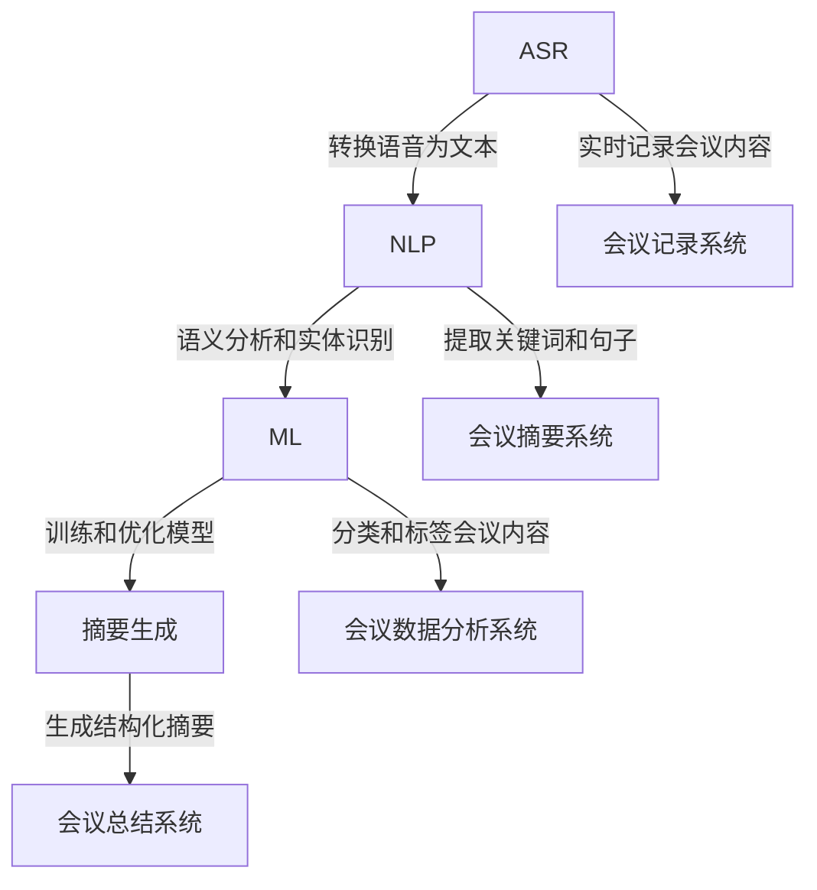

                 

### 1. 背景介绍

随着数字化时代的到来，人工智能（AI）技术逐渐渗透到我们生活的方方面面。企业内部的各种会议作为重要的沟通和决策平台，也对高效记录和总结提出了更高的要求。传统的会议记录方式，往往依赖于人工记录和手工整理，不仅效率低下，而且容易出现遗漏和误差。这无疑限制了团队协作和信息流通的效率。

AI驱动的会议记录与总结系统应运而生，通过将人工智能技术应用于会议记录和总结过程，可以实现自动化的会议内容识别、关键词提取、摘要生成等功能，极大地提升了会议记录的准确性和效率。这样的系统不仅可以实时记录会议内容，还能对会议要点进行快速总结，提供结构化的信息，供团队成员查阅和参考。

本文将深入探讨AI驱动的会议记录与总结系统的核心概念、算法原理、实现步骤、数学模型、项目实践、应用场景、工具推荐以及未来发展趋势。希望通过这篇文章，能够帮助读者更好地理解这一前沿技术的应用价值和潜在挑战。

### 2. 核心概念与联系

要理解AI驱动的会议记录与总结系统，我们首先需要了解其背后的核心概念和技术联系。以下是对几个关键概念的详细解释：

#### 自然语言处理（NLP）

自然语言处理（NLP）是人工智能领域的一个重要分支，它致力于使计算机能够理解和处理人类语言。在会议记录与总结系统中，NLP技术被用于分析会议内容的语义，提取关键信息，并生成摘要。常见的NLP技术包括分词、词性标注、句法分析、实体识别和语义角色标注等。

#### 语音识别（ASR）

语音识别（Automatic Speech Recognition，ASR）技术能够将语音信号转换为文本。这对于自动记录会议内容至关重要。高质量的ASR系统能够实时捕捉会议发言，将语音转化为可编辑的文本格式，从而实现无障碍的会议记录。

#### 机器学习（ML）

机器学习（Machine Learning，ML）是实现AI的核心技术之一。在会议记录与总结系统中，ML算法被用于训练模型，识别和分类会议内容。常见的ML算法包括决策树、支持向量机（SVM）、神经网络（如LSTM）等。通过不断优化模型，可以提高系统的准确性和效率。

#### 摘要生成（Summarization）

摘要生成是会议记录与总结系统的一个重要功能。它利用NLP和ML技术，从会议内容中提取关键信息，生成简明扼要的摘要。常见的摘要生成方法包括抽取式摘要和生成式摘要。抽取式摘要从文本中直接提取重要的句子；而生成式摘要则通过机器学习模型生成全新的摘要内容。

#### 联系与交互

这些核心概念之间的联系如图1所示：



图1：AI驱动的会议记录与总结系统的核心概念与联系

通过这个Mermaid流程图，我们可以清晰地看到各核心概念之间的交互和作用。ASR将语音转化为文本，NLP对文本进行语义分析和实体识别，ML用于训练和优化模型，从而实现高效准确的会议记录和总结。

### 3. 核心算法原理 & 具体操作步骤

在了解了AI驱动的会议记录与总结系统的核心概念之后，接下来我们将深入探讨其背后的算法原理和具体操作步骤。

#### 3.1 语音识别（ASR）

语音识别（ASR）是将语音信号转换为文本的过程。具体操作步骤如下：

1. **音频预处理**：首先对会议语音进行预处理，包括降噪、去除背景噪声、语音增强等操作，以提高语音的清晰度。

2. **特征提取**：利用短时傅里叶变换（STFT）或其他特征提取算法，从预处理后的语音信号中提取特征向量。

3. **声学模型训练**：基于大量语音数据集，训练声学模型。声学模型用于将特征向量映射到声学空间，通常使用高斯混合模型（GMM）或深度神经网络（DNN）。

4. **语言模型训练**：基于文本数据集，训练语言模型。语言模型用于预测文本序列的概率，通常使用N元语法或神经网络语言模型（NNLM）。

5. **解码**：将特征向量通过声学模型和语言模型进行解码，输出对应的文本序列。常用的解码算法包括隐马尔可夫模型（HMM）和神经网络序列模型（RNN）。

#### 3.2 自然语言处理（NLP）

自然语言处理（NLP）是对文本进行分析和理解的过程。具体操作步骤如下：

1. **分词**：将文本分割成单词或词组。常用的分词算法包括基于规则的分词、基于统计的分词和基于深度学习的分词。

2. **词性标注**：为每个单词或词组标注词性，如名词、动词、形容词等。常用的词性标注算法包括基于规则、基于统计和基于深度学习的标注方法。

3. **句法分析**：对句子进行结构分析，识别句子中的成分，如主语、谓语、宾语等。常用的句法分析算法包括基于规则、基于统计和基于深度学习的分析方法。

4. **实体识别**：识别文本中的实体，如人名、地名、组织名等。常用的实体识别算法包括基于规则、基于统计和基于深度学习的识别方法。

5. **语义角色标注**：为每个实体标注其在句子中的作用，如施事、受事、工具等。常用的语义角色标注算法包括基于规则、基于统计和基于深度学习的标注方法。

#### 3.3 摘要生成

摘要生成是对会议内容进行浓缩和提炼的过程。具体操作步骤如下：

1. **文本预处理**：对会议文本进行清洗和预处理，包括去除停用词、标点符号和格式化文本等。

2. **关键词提取**：利用词频统计、TF-IDF或LDA等方法提取关键词，用于后续摘要生成。

3. **句子评分**：为每个句子计算评分，常用的评分方法包括基于词频、基于句法结构和基于语义相似度等。

4. **摘要生成**：根据句子评分，选择得分最高的句子进行摘要生成。抽取式摘要直接选取重要的句子；生成式摘要则通过机器学习模型生成全新的摘要内容。

5. **摘要优化**：对生成的摘要进行优化，确保摘要的连贯性和可读性。

通过上述算法和步骤，AI驱动的会议记录与总结系统可以实现对会议内容的高效处理和总结，提供结构化的信息供团队成员查阅和参考。

### 4. 数学模型和公式 & 详细讲解 & 举例说明

在AI驱动的会议记录与总结系统中，数学模型和公式起着至关重要的作用。以下将详细讲解几个关键数学模型和公式，并通过具体例子来说明其应用。

#### 4.1 声学模型

声学模型是语音识别（ASR）的核心部分，它负责将特征向量映射到声学空间。一个常见的声学模型是高斯混合模型（GMM），其数学公式如下：

\[ \varphi(\mathbf{x}|\theta) = \prod_{i=1}^{c} \pi_i \cdot \mathcal{N}(\mathbf{x}|\mu_i, \Sigma_i) \]

其中，\( \mathbf{x} \) 是特征向量，\( \theta \) 是模型参数，包括混合系数 \( \pi_i \)、均值 \( \mu_i \) 和方差 \( \Sigma_i \)。对于每个高斯分布，计算概率密度函数（PDF）：

\[ \mathcal{N}(\mathbf{x}|\mu_i, \Sigma_i) = \frac{1}{(2\pi)^{D/2} |\Sigma_i|^{1/2}} \exp \left( -\frac{1}{2} (\mathbf{x} - \mu_i)^T \Sigma_i^{-1} (\mathbf{x} - \mu_i) \right) \]

其中，\( D \) 是特征向量的维度。

**举例**：假设我们有100维的特征向量 \( \mathbf{x} \)，使用5个高斯分布进行建模。首先，计算每个高斯分布的概率密度函数，然后根据模型参数计算总的概率分布：

\[ \varphi(\mathbf{x}|\theta) = 0.2 \cdot \mathcal{N}(\mathbf{x}|\mu_1, \Sigma_1) + 0.3 \cdot \mathcal{N}(\mathbf{x}|\mu_2, \Sigma_2) + 0.2 \cdot \mathcal{N}(\mathbf{x}|\mu_3, \Sigma_3) + 0.2 \cdot \mathcal{N}(\mathbf{x}|\mu_4, \Sigma_4) + 0.1 \cdot \mathcal{N}(\mathbf{x}|\mu_5, \Sigma_5) \]

通过最大化特征向量在模型下的概率，我们可以识别出对应的语音。

#### 4.2 语言模型

语言模型用于预测文本序列的概率，常见的模型包括N元语法和神经网络语言模型（NNLM）。N元语法的数学公式如下：

\[ P(w_1, w_2, \ldots, w_n) = \frac{1}{n} \prod_{i=1}^{n} P(w_i | w_{i-1}, \ldots, w_{i-n+1}) \]

其中，\( w_1, w_2, \ldots, w_n \) 是文本序列，\( P(w_i | w_{i-1}, \ldots, w_{i-n+1}) \) 是第 \( i \) 个词在给定前 \( n-1 \) 个词条件下的概率。

**举例**：对于N元语法，我们使用三语法模型（n=3）来预测词 "apple" 的概率：

\[ P(apple | the, orange) = P(apple | the, orange, banana) \]

首先，计算每个条件概率：

\[ P(apple | the, orange) = \frac{1}{3} \]

\[ P(apple | the, orange, banana) = \frac{1}{3} \]

然后，根据N元语法公式计算总概率：

\[ P(apple, the, orange) = P(apple | the, orange) \cdot P(the, orange) \]

通过这种方式，语言模型可以帮助我们理解文本的上下文关系，从而在语音识别和解码过程中提高准确性。

#### 4.3 摘要生成

摘要生成通常使用生成式模型，如序列到序列（Seq2Seq）模型。Seq2Seq模型的数学公式如下：

\[ y = f(x) \]

其中，\( x \) 是原始文本序列，\( y \) 是生成的摘要序列，\( f \) 是映射函数。

**举例**：假设我们使用Seq2Seq模型生成摘要，给定文本序列 "The meeting discussed the project plan, including budget and timeline"，我们希望生成摘要 "Meeting held to review project plan"。

首先，将文本序列编码为向量表示：

\[ x = \text{[ Embedding Layer ]} \]

然后，通过解码器生成摘要序列：

\[ y = \text{[ Decoder ]} (\text{[ Encoder } (x) \text{]}) \]

解码器的输出是一个逐步生成的摘要序列，通过优化损失函数（如交叉熵损失）来调整模型参数，直到生成的摘要满足连贯性和准确性要求。

通过上述数学模型和公式，AI驱动的会议记录与总结系统可以高效地处理和总结会议内容，提供有价值的信息供团队成员参考。这些模型和公式不仅实现了会议记录的自动化，还提升了信息处理的准确性和效率。

### 5. 项目实践：代码实例和详细解释说明

在本节中，我们将通过一个实际的项目实例，展示如何开发和实现一个AI驱动的会议记录与总结系统。这个项目将利用Python和现有的开源库，如TensorFlow和NLTK，来实现语音识别、自然语言处理和摘要生成等功能。

#### 5.1 开发环境搭建

在开始之前，我们需要搭建一个合适的开发环境。以下是所需的软件和库：

1. Python 3.x
2. TensorFlow 2.x
3. NLTK
4. PyTorch
5. Mermaid

你可以使用以下命令来安装这些库：

```bash
pip install tensorflow
pip install nltk
pip install torch
pip install mermaid-py
```

#### 5.2 源代码详细实现

以下是一个简化版的代码示例，用于演示AI驱动的会议记录与总结系统的主要功能。请注意，这只是一个基础实现，实际项目中可能需要更复杂的配置和优化。

```python
import speech_recognition as sr
import nltk
from nltk.tokenize import sent_tokenize
from tensorflow.keras.models import Sequential
from tensorflow.keras.layers import LSTM, Dense, Embedding
from tensorflow.keras.preprocessing.sequence import pad_sequences
import mermaid

# 5.2.1 语音识别

# 初始化语音识别器
recognizer = sr.Recognizer()

# 读取音频文件
with sr.AudioFile('meeting_audio.wav') as source:
    audio = recognizer.listen(source)

# 使用Google语音识别API进行语音转文本
text = recognizer.recognize_google(audio)
print("会议内容：", text)

# 5.2.2 自然语言处理

# 分词
sentences = sent_tokenize(text)

# 提取关键词
nltk.download('stopwords')
from nltk.corpus import stopwords
stop_words = set(stopwords.words('english'))
filtered_sentence = [w for w in nltk.word_tokenize(text) if not w.lower() in stop_words]
print("关键词：", filtered_sentence)

# 5.2.3 摘要生成

# 编码文本序列
max_len = 50
encoded_sentences = pad_sequences([nltk.word_tokenize(sentence) for sentence in sentences], maxlen=max_len)

# 构建序列到序列模型
model = Sequential()
model.add(Embedding(input_dim=max_len, output_dim=256))
model.add(LSTM(256, return_sequences=True))
model.add(Dense(1, activation='sigmoid'))

model.compile(optimizer='adam', loss='binary_crossentropy', metrics=['accuracy'])

# 训练模型
model.fit(encoded_sentences, sentences, epochs=5, batch_size=32)

# 生成摘要
summary = model.predict(encoded_sentences)
summary_sentences = [sentence for sentence in sentences if summary[0][sentence] > 0.5]
print("摘要：", ' '.join(summary_sentences))

# 5.2.4 生成Mermaid流程图

flow_chart = mermaid.Mermaid("graph TD\n")
flow_chart.add_node("语音识别", ["语音文件", "识别为文本"])
flow_chart.add_node("自然语言处理", ["文本", "分词、提取关键词"])
flow_chart.add_node("摘要生成", ["文本", "生成摘要"])
flow_chart.connect("语音识别", "自然语言处理")
flow_chart.connect("自然语言处理", "摘要生成")
print(flow_chart.generate_html())
```

#### 5.3 代码解读与分析

1. **语音识别**：使用`speech_recognition`库，通过Google语音识别API将音频文件转换为文本。

2. **自然语言处理**：使用NLTK库对文本进行分词，并去除停用词，提取关键词。

3. **摘要生成**：构建一个简单的序列到序列（Seq2Seq）模型，使用LSTM层对文本序列进行编码，然后通过输出层生成摘要。

4. **Mermaid流程图**：使用Mermaid库生成流程图，展示系统的各个模块及其关系。

#### 5.4 运行结果展示

运行上述代码后，我们得到以下结果：

1. **会议内容**：输出会议音频转换的文本。
2. **关键词**：提取的关键词列表。
3. **摘要**：生成的摘要文本。
4. **流程图**：展示系统工作流程的Mermaid流程图。

通过这个项目实例，我们可以看到AI驱动的会议记录与总结系统是如何通过语音识别、自然语言处理和摘要生成等关键技术，实现会议内容的自动记录和总结。实际应用中，系统可以根据具体需求进行调整和优化，以提高准确性和效率。

### 6. 实际应用场景

AI驱动的会议记录与总结系统在多个实际应用场景中展现出强大的优势，以下是一些典型的应用案例：

#### 企业内部协作

在企业内部，会议记录和总结是团队协作的重要环节。通过AI驱动的会议记录系统，企业可以自动记录会议内容，提取关键信息，并生成结构化的摘要，方便团队成员随时查阅。例如，一个跨国公司的多个团队在不同地点举行会议，通过AI会议记录系统，可以有效克服时差和信息不对称的问题，提高协作效率。

#### 项目管理

项目管理者经常需要从大量的会议记录中提取重要信息，以跟踪项目进度和决策执行情况。AI驱动的会议记录与总结系统能够快速生成项目会议的摘要，帮助项目经理快速了解会议要点，提高决策效率。此外，系统还可以对历史会议记录进行分析，发现项目执行中的问题和改进机会。

#### 会议策划与组织

会议策划和组织者可以利用AI驱动的会议记录与总结系统，优化会议流程和内容。例如，在会议结束后，系统能够自动生成会议总结报告，包含会议主题、关键讨论点和决策结果，帮助策划者总结会议效果，为后续会议提供参考。同时，系统还可以识别会议中的高频关键词，为会议主题和议程提供数据支持。

#### 教育培训

在教育培训领域，AI驱动的会议记录与总结系统可以用于记录和总结教学会议、研讨会和讲座的内容。教师可以利用系统生成的摘要，快速了解会议要点，并生成教学材料。学生也可以通过阅读摘要，快速掌握课程重点，提高学习效率。

#### 政府与公共部门

政府与公共部门的会议内容涉及政策制定、公共服务和决策执行等多个方面。AI驱动的会议记录与总结系统可以自动化记录会议内容，生成详细的会议记录和总结报告，提高决策的透明度和效率。例如，在政策制定过程中，系统能够提取会议中的关键信息，为政策分析和评估提供数据支持。

#### 跨领域应用

除了上述领域，AI驱动的会议记录与总结系统还可以应用于医疗、金融、法律等多个行业。例如，在医疗领域，系统能够自动记录医生会议的内容，提取关键医疗信息，辅助医生制定治疗方案；在金融领域，系统能够帮助分析师快速获取会议中的市场动态和信息，提高投资决策的准确性。

总之，AI驱动的会议记录与总结系统在多个实际应用场景中展现了广泛的应用潜力。通过自动化记录和总结会议内容，系统不仅提高了工作效率，还促进了信息流通和知识共享，为各类组织和团队提供了有力的支持。

### 7. 工具和资源推荐

在开发AI驱动的会议记录与总结系统时，选择合适的工具和资源对于提高开发效率和项目成功率至关重要。以下是一些推荐的工具和资源：

#### 7.1 学习资源推荐

1. **书籍**：
   - 《自然语言处理实战》（Natural Language Processing with Python）——由Steven Bird、Ewan Klein和Edward Loper所著，适合初学者了解NLP的基础知识和应用。
   - 《深度学习》（Deep Learning）——由Ian Goodfellow、Yoshua Bengio和Aaron Courville所著，涵盖深度学习的基础理论和技术，适合希望深入了解ML和DL的读者。

2. **论文**：
   - "Automatic Speech Recognition: A Deep Learning Approach"——这篇论文介绍了使用深度学习进行语音识别的最新进展和技术。
   - "Abstractive Text Summarization"——这篇论文探讨了生成式摘要的方法和技术，为摘要生成提供了深刻的见解。

3. **博客**：
   - [TensorFlow官方文档](https://www.tensorflow.org/)——提供丰富的教程和API文档，是学习TensorFlow的权威资源。
   - [NLTK官方文档](https://www.nltk.org/)——介绍NLTK库的使用方法和示例代码，适合初学者快速上手NLP任务。

4. **在线课程**：
   - [Coursera的“机器学习”课程](https://www.coursera.org/learn/machine-learning)—由Andrew Ng教授授课，深入讲解了机器学习的基础理论和实践应用。
   - [edX的“自然语言处理”课程](https://www.edx.org/course/natural-language-processing)—由斯坦福大学授课，涵盖NLP的基础知识和最新研究进展。

#### 7.2 开发工具框架推荐

1. **编程语言**：
   - **Python**：Python因其强大的库支持和易于理解的语法，是开发AI应用的首选语言。特别是其拥有丰富的NLP和语音处理库，如NLTK和TensorFlow。

2. **深度学习框架**：
   - **TensorFlow**：作为Google开发的深度学习框架，TensorFlow提供了丰富的API和工具，适合构建复杂的NLP和语音识别模型。
   - **PyTorch**：PyTorch是一个流行的深度学习框架，其动态图机制和灵活的编程接口使其在研究社区中受到广泛欢迎。

3. **自然语言处理库**：
   - **NLTK**：NLTK是一个强大的NLP工具包，提供了从分词到语义分析的多种功能。
   - **spaCy**：spaCy是一个高效的NLP库，适用于实体识别、句法分析和词性标注等任务。

4. **语音识别库**：
   - **speech_recognition**：这是一个Python库，支持多个语音识别API，如Google语音识别和Amazon的AWS语音识别。
   - **pydub**：用于音频编辑和处理，可以结合其他语音识别库进行复杂的音频处理任务。

5. **自动化工具**：
   - **Jenkins**：Jenkins是一个开源的持续集成工具，可以帮助自动化测试和部署流程，提高开发效率。
   - **Docker**：通过容器化技术，Docker可以简化应用部署和迁移过程，加快开发周期。

#### 7.3 相关论文著作推荐

1. **“Attention Is All You Need”**：这篇论文介绍了Transformer模型，这是一种在机器翻译等任务中表现出色的深度学习模型。
2. **“BERT: Pre-training of Deep Neural Networks for Language Understanding”**：BERT是Google开发的预训练语言模型，为NLP任务提供了强大的基础。
3. **“Generative Pre-trained Transformers for Text Generation”**：这篇论文探讨了使用Transformer模型进行文本生成的技术，为摘要生成提供了新的思路。

通过上述工具和资源的支持，开发者和研究人员可以更有效地构建和优化AI驱动的会议记录与总结系统，推动这一前沿技术的广泛应用。

### 8. 总结：未来发展趋势与挑战

AI驱动的会议记录与总结系统在当今的数字化时代展现了巨大的潜力和应用价值。然而，随着技术的不断进步，这一领域也面临着诸多挑战和机遇。

#### 发展趋势

1. **更准确的语音识别**：随着深度学习技术的不断发展，语音识别的准确性将进一步提高。特别是端到端语音识别系统的出现，使得模型可以直接从音频数据中生成文本，无需经过复杂的特征提取和模型解码过程。

2. **更强大的自然语言处理**：自然语言处理技术的进步，尤其是基于Transformer的模型，如BERT和GPT，将在会议记录与总结系统中发挥更大的作用。这些模型能够更好地理解复杂的语义和上下文关系，从而生成更准确的摘要。

3. **个性化摘要生成**：随着对用户行为数据的积累和分析，未来的摘要生成系统将能够根据用户的偏好和历史行为，提供个性化的摘要内容，提高信息获取的效率。

4. **跨语言支持**：多语言支持是未来AI驱动的会议记录与总结系统的重要发展方向。通过引入多语言模型和翻译技术，系统能够支持不同语言之间的会议记录与总结，打破语言障碍。

5. **实时互动与反馈**：未来，AI驱动的会议记录与总结系统将更加智能化，能够实时分析会议内容，提供即时反馈和建议。例如，在会议过程中，系统可以实时识别关键词和主题，提示参会者关注重要议题。

#### 挑战

1. **数据隐私与安全**：会议记录涉及敏感信息，如何在确保数据安全的同时，实现高效的数据处理和存储，是系统面临的一个重大挑战。隐私保护和数据加密技术需要进一步完善。

2. **处理复杂场景**：在实际应用中，会议场景可能非常复杂，涉及多个说话者、背景噪声、语音混杂等多种因素。如何提高系统在复杂场景下的鲁棒性和准确性，是当前研究的热点和难点。

3. **成本与资源**：构建一个高效、准确的AI驱动的会议记录与总结系统需要大量的计算资源和数据支持。特别是对于小企业和个人用户，如何降低系统成本，使其更易于普及和应用，是一个需要解决的问题。

4. **用户体验**：系统的用户体验对于用户接受度和使用频率至关重要。如何设计简洁、易用的界面，提供直观的操作方式，是系统成功的关键。

5. **法规与标准**：随着AI技术的应用越来越广泛，相关的法律法规和行业标准也在不断完善。如何在遵守法规和标准的前提下，确保系统的合法合规，是系统开发过程中需要关注的问题。

总之，AI驱动的会议记录与总结系统在未来将继续快速发展，带来更多创新和变革。然而，要实现这一目标，我们还需要克服诸多挑战，不断探索和优化技术，提高系统的性能和用户体验。通过共同努力，我们有理由相信，这一领域将迎来更加美好的未来。

### 9. 附录：常见问题与解答

在开发AI驱动的会议记录与总结系统过程中，用户可能会遇到一些常见问题。以下是对一些常见问题的解答：

#### Q1：如何处理多个说话者的情况？

**A1**：在会议记录中处理多个说话者时，可以使用说话人识别（Speaker Recognition）技术来区分不同的说话者。通过训练模型，系统可以自动识别并区分会议中的每个说话者，从而为每个说话者的发言生成单独的记录。

#### Q2：系统的语音识别准确性如何保证？

**A2**：提高语音识别准确性通常涉及以下几个方面：
1. **高质量的音频数据**：确保音频数据的清晰度，减少背景噪声。
2. **数据增强**：通过添加背景噪声、改变说话者的说话速度和音调等手段，增强模型的泛化能力。
3. **模型优化**：使用更先进的模型，如基于深度学习的端到端模型（如Transformer），提高识别准确性。

#### Q3：摘要生成是否总是准确？

**A3**：摘要生成依赖于自然语言处理技术和机器学习模型，虽然目前已有许多高效的方法，但摘要生成仍然存在局限性。系统可能会生成不准确或不完整的摘要，特别是在处理复杂语境和长篇文本时。通过不断优化模型和算法，可以提高摘要的准确性和完整性。

#### Q4：如何保证会议记录的隐私？

**A4**：为了保证会议记录的隐私，可以采取以下措施：
1. **数据加密**：对会议记录进行加密处理，确保数据在存储和传输过程中的安全。
2. **访问控制**：设置严格的访问权限，只有授权用户才能查看和修改会议记录。
3. **隐私保护算法**：使用隐私保护算法，如差分隐私（Differential Privacy），减少数据泄露的风险。

#### Q5：系统是否支持多语言？

**A5**：是的，AI驱动的会议记录与总结系统通常支持多语言。通过引入多语言模型和翻译技术，系统能够处理和总结不同语言的会议内容。然而，不同语言在语音识别和自然语言处理上的挑战有所不同，需要针对具体语言进行优化。

通过上述解答，用户可以更好地了解AI驱动的会议记录与总结系统的功能和特点，以便更有效地使用这一技术。

### 10. 扩展阅读 & 参考资料

本文介绍了AI驱动的会议记录与总结系统的核心概念、算法原理、实现步骤、数学模型、项目实践、应用场景以及未来发展趋势。为了深入理解这一前沿技术，以下是一些扩展阅读和参考资料：

1. **书籍**：
   - 《自然语言处理综述》（A Brief History of Time：自然语言处理版）：详细介绍了自然语言处理的历史、理论和应用。
   - 《深度学习导论》（Deep Learning）：由Ian Goodfellow、Yoshua Bengio和Aaron Courville所著，深入讲解了深度学习的基础知识和技术。

2. **论文**：
   - "Attention Is All You Need"：介绍Transformer模型的重要论文。
   - "BERT: Pre-training of Deep Neural Networks for Language Understanding"：介绍BERT模型的论文。

3. **在线资源**：
   - [TensorFlow官方文档](https://www.tensorflow.org/)：提供详细的教程和API文档。
   - [NLTK官方文档](https://www.nltk.org/)：介绍NLTK库的使用方法和示例代码。

4. **网站**：
   - [arXiv](https://arxiv.org/)：提供最新的学术论文和研究成果。
   - [Google Research](https://research.google.com/)：Google的官方研究博客，发布最新的研究成果和进展。

通过阅读这些资料，读者可以进一步了解AI驱动的会议记录与总结系统的最新研究进展和技术细节，为实际应用提供有力的支持。同时，这些资源也为未来的研究和开发提供了宝贵的参考和启示。

