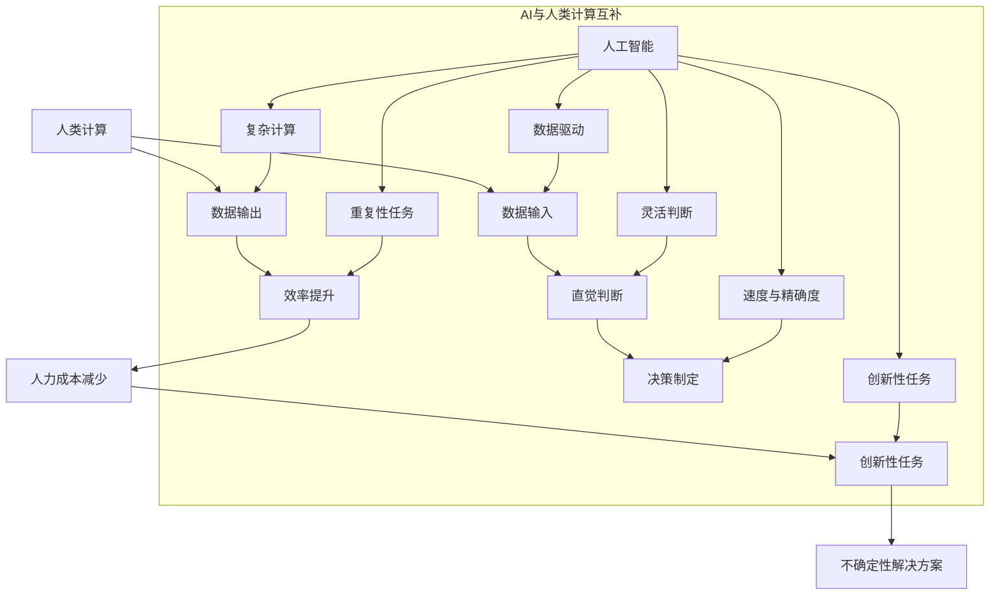

                 

### 文章标题

AI驱动的创新：人类计算在商业中的优势

> **关键词**：人工智能、商业应用、创新、人类计算、优势、技术趋势、未来展望。

> **摘要**：本文旨在探讨人工智能（AI）在商业领域中的应用及其带来的创新优势。通过对AI核心概念的介绍，解析其与人类计算的互补关系，探讨AI驱动创新的具体实例，分析其在实际商业场景中的影响，最后展望未来发展趋势与面临的挑战。文章结构如下：

- **1. 背景介绍**
- **2. 核心概念与联系**
- **3. 核心算法原理 & 具体操作步骤**
- **4. 数学模型和公式 & 详细讲解 & 举例说明**
- **5. 项目实践：代码实例和详细解释说明**
  - **5.1 开发环境搭建**
  - **5.2 源代码详细实现**
  - **5.3 代码解读与分析**
  - **5.4 运行结果展示**
- **6. 实际应用场景**
- **7. 工具和资源推荐**
  - **7.1 学习资源推荐**
  - **7.2 开发工具框架推荐**
  - **7.3 相关论文著作推荐**
- **8. 总结：未来发展趋势与挑战**
- **9. 附录：常见问题与解答**
- **10. 扩展阅读 & 参考资料**

### 1. 背景介绍

在过去的几十年中，商业领域经历了巨大的变革，尤其是随着信息技术的迅猛发展。传统的商业模式和运营策略逐渐被颠覆，新兴的数字化商业形态不断涌现。在这个背景下，人工智能（AI）以其强大的数据处理能力和智能决策能力，成为了推动商业创新的重要力量。

AI技术的发展可追溯到20世纪50年代，最初的研究主要集中在符号主义和逻辑推理上。随着计算能力的提升和大数据的兴起，深度学习和机器学习等新兴算法得到了广泛应用，AI技术逐渐从理论研究走向实际应用。在商业领域，AI不仅能够提高运营效率，还能为企业带来创新性的商业模式。

商业领域的创新需求推动了AI技术的快速发展。企业需要通过数据分析和智能决策来优化业务流程、降低成本、提高客户满意度。例如，零售业利用AI进行个性化推荐，金融行业利用AI进行风险管理，医疗行业利用AI辅助诊断。这些应用不仅提升了企业的竞争力，也改变了消费者与企业的互动方式。

本文将围绕AI驱动创新这一主题，探讨人类计算与AI的互补关系，分析AI在商业领域中的应用实例，以及未来可能的发展趋势和挑战。

#### 1.1 AI技术的发展历程

AI技术的发展历程可以大致分为三个阶段：符号主义、推理方法和感知认知。

1. **符号主义**：20世纪50年代至70年代，AI研究主要集中在逻辑推理和知识表示上。这一阶段的代表工作包括逻辑推理程序和专家系统的开发。然而，符号主义方法在处理复杂问题时存在局限性，导致AI研究进入低潮期。

2. **推理方法**：20世纪80年代至90年代，基于知识的推理方法成为了AI研究的热点。这一阶段的研究集中在如何利用规则库和知识库进行问题求解。虽然推理方法在某些领域取得了成功，但其对数据的依赖性和计算复杂性限制了其广泛应用。

3. **感知认知**：21世纪初至今，深度学习和机器学习成为AI发展的新引擎。通过模拟人脑神经网络，深度学习能够自动从大量数据中学习特征和模式，从而实现图像识别、自然语言处理、语音识别等任务。这一阶段的AI技术更加注重数据驱动的学习和自主决策。

#### 1.2 商业领域的创新需求

商业领域的创新需求主要表现在以下几个方面：

1. **个性化服务**：消费者需求的多样化和个性化要求企业能够提供更加个性化的产品和服务。AI技术通过大数据分析和机器学习算法，能够准确捕捉消费者的偏好和行为模式，从而实现精准营销和个性化推荐。

2. **业务流程优化**：企业希望通过优化业务流程来提高运营效率、降低成本。AI技术能够自动分析和优化业务流程中的各个环节，提高资源利用率和生产效率。

3. **智能决策**：商业决策往往需要大量的数据和复杂的分析。AI技术通过数据挖掘和智能算法，能够提供更加准确和高效的决策支持，帮助企业降低风险、提高收益。

4. **客户关系管理**：建立良好的客户关系是企业发展的重要基础。AI技术能够通过客户数据分析，帮助企业管理客户关系，提高客户满意度和忠诚度。

#### 1.3 AI在商业领域的应用实例

在商业领域，AI技术已经广泛应用于多个行业，带来了显著的商业价值。以下是一些典型的应用实例：

1. **零售业**：零售业利用AI进行库存管理、需求预测和个性化推荐。例如，Amazon和Alibaba等电商平台通过大数据分析和机器学习算法，为消费者提供个性化的购物体验。

2. **金融业**：金融业利用AI进行风险管理、欺诈检测和投资决策。例如，银行和保险公司通过机器学习算法，能够自动识别潜在的风险和欺诈行为，提高风险管理能力。

3. **医疗行业**：医疗行业利用AI进行疾病诊断、药物研发和患者管理。例如，Google Health利用深度学习算法，能够快速识别皮肤病，提高诊断准确率。

4. **制造业**：制造业利用AI进行生产调度、质量检测和设备维护。例如，工业4.0时代的智能工厂通过AI技术，实现生产过程的自动化和智能化。

### 2. 核心概念与联系

为了深入理解AI在商业领域的应用，我们需要首先掌握一些核心概念，并探讨AI与人类计算的互补关系。

#### 2.1 核心概念

1. **人工智能（AI）**：AI是指由人制造出的具有一定智能的系统，能够在特定领域内执行复杂的任务。AI可以分为两大类：弱AI和强AI。弱AI专注于特定任务，而强AI具备人类所有的认知能力。

2. **机器学习（ML）**：ML是AI的一个分支，通过训练数据集，使计算机系统能够从数据中自动学习规律和模式，从而实现预测和决策。

3. **深度学习（DL）**：DL是ML的一个子领域，通过模拟人脑神经网络，对大量数据进行自动特征提取和模式识别。

4. **大数据（Big Data）**：大数据是指无法用传统数据库工具进行存储、管理和分析的数据集合。大数据技术能够快速处理海量数据，挖掘其中的价值。

5. **自然语言处理（NLP）**：NLP是AI的一个子领域，旨在使计算机理解和生成人类自然语言。

#### 2.2 AI与人类计算的互补关系

AI与人类计算具有互补关系，两者在商业领域中可以相互补充，共同推动创新。

1. **数据驱动与直觉判断**：AI擅长处理大量数据，通过机器学习和深度学习算法，能够快速挖掘数据中的价值。而人类计算则依赖直觉和经验，能够在复杂情境中做出灵活的判断。

2. **速度与精确度**：AI能够在极短时间内完成复杂的计算任务，且结果相对精确。而人类计算在处理复杂问题时，可能需要更长的时间和更多的思考，但能够提供更加个性化的解决方案。

3. **重复性与创新性**：AI擅长处理重复性任务，能够提高效率，减少人力成本。而人类计算则擅长创新和创造力，能够在不确定性环境中提出新的解决方案。

#### 2.3 Mermaid 流程图

为了更直观地展示AI与人类计算的互补关系，我们可以使用Mermaid流程图来描述。



通过这个流程图，我们可以看到AI和人类计算在商业领域中的互补作用。AI通过数据驱动和速度精确度，能够提升效率、减少人力成本，并处理重复性任务。而人类计算则通过直觉判断、创新性和灵活判断，能够在复杂情境中提供个性化解决方案。

### 3. 核心算法原理 & 具体操作步骤

要深入理解AI在商业领域的应用，我们需要首先掌握AI的核心算法原理。本文将介绍几种常用的AI算法，包括监督学习、无监督学习和强化学习，并详细讲解每种算法的具体操作步骤。

#### 3.1 监督学习（Supervised Learning）

监督学习是一种常见的机器学习算法，通过已知标签的数据集来训练模型，然后使用训练好的模型对未知标签的数据进行预测。

**步骤：**

1. **数据准备**：收集并清洗数据，确保数据的质量和完整性。数据集通常包括输入特征和对应的标签。

2. **特征选择**：选择与预测目标相关的重要特征，去除冗余和噪声特征。

3. **模型选择**：根据问题的性质和数据的特征，选择合适的模型。常见的监督学习模型包括线性回归、逻辑回归、支持向量机（SVM）、决策树、随机森林等。

4. **模型训练**：使用训练数据集对选定的模型进行训练，调整模型参数，使其能够准确地预测未知数据的标签。

5. **模型评估**：使用验证数据集对训练好的模型进行评估，计算模型的准确性、召回率、F1值等指标。

6. **模型部署**：将训练好的模型部署到实际应用环境中，对未知数据进行预测。

**示例：线性回归（Linear Regression）**

线性回归是一种简单的监督学习算法，用于预测连续值输出。其基本原理是通过拟合一条直线来最小化预测值与实际值之间的误差。

$$y = ax + b$$

- **步骤1：数据准备**：收集一组包含房屋面积和房价的数据。

- **步骤2：特征选择**：选择房屋面积作为输入特征，房价作为输出标签。

- **步骤3：模型选择**：选择线性回归模型。

- **步骤4：模型训练**：使用训练数据集计算斜率a和截距b。

  $$a = \frac{\sum_{i=1}^{n}(x_i - \bar{x})(y_i - \bar{y})}{\sum_{i=1}^{n}(x_i - \bar{x})^2}$$

  $$b = \bar{y} - a\bar{x}$$

- **步骤5：模型评估**：使用验证数据集评估模型性能，计算预测值与实际值的误差。

- **步骤6：模型部署**：使用训练好的模型对新的房屋面积进行房价预测。

#### 3.2 无监督学习（Unsupervised Learning）

无监督学习是一种不需要已知标签的机器学习算法，通过探索数据中的模式和结构来发现数据特征。

**步骤：**

1. **数据准备**：收集并清洗数据，确保数据的质量和完整性。

2. **特征选择**：选择与问题相关的特征，去除冗余和噪声特征。

3. **模型选择**：根据问题的性质和数据的特征，选择合适的模型。常见的无监督学习模型包括聚类算法、关联规则学习、降维算法等。

4. **模型训练**：使用无监督学习算法对数据进行处理，探索数据中的模式和结构。

5. **模型评估**：使用合适的评估指标，如轮廓系数、互信息等，评估模型的性能。

6. **模型应用**：将训练好的模型应用于实际问题，如聚类分析、数据挖掘等。

**示例：K-Means聚类（K-Means Clustering）**

K-Means是一种常见的聚类算法，通过将数据划分为K个簇，使每个簇内的数据点尽可能接近，而簇与簇之间的数据点尽可能远离。

**步骤：**

1. **数据准备**：收集一组包含多维特征的数据。

2. **特征选择**：选择多维特征作为输入。

3. **模型选择**：选择K-Means聚类算法。

4. **模型训练**：随机初始化K个簇中心，然后迭代更新簇中心，直至收敛。

  - **步骤1：初始化簇中心。**从数据集中随机选择K个数据点作为初始簇中心。

  - **步骤2：分配数据点。**将每个数据点分配到最近的簇中心。

  - **步骤3：更新簇中心。**计算每个簇的新簇中心，作为数据点的均值。

5. **模型评估**：计算轮廓系数，评估聚类效果。

6. **模型应用**：将聚类结果应用于实际问题，如客户细分、市场分析等。

#### 3.3 强化学习（Reinforcement Learning）

强化学习是一种通过与环境互动来学习最优策略的机器学习算法。它与监督学习和无监督学习不同，不需要已知标签或数据集。

**步骤：**

1. **环境定义**：定义问题的环境，包括状态空间、动作空间和奖励函数。

2. **策略选择**：选择一种策略，用于指导算法在给定状态下选择动作。

3. **模型训练**：通过与环境交互，不断调整策略，使算法能够在最大化长期奖励的同时，适应复杂的环境。

4. **模型评估**：评估训练好的策略，计算策略的收益和表现。

5. **模型应用**：将训练好的策略应用于实际问题，如自动驾驶、游戏AI等。

**示例：Q-Learning（Q值学习）**

Q-Learning是一种常见的强化学习算法，通过学习状态-动作值函数（Q值），来选择最优动作。

**步骤：**

1. **环境定义**：定义一个简单的环境，如网格世界，包括状态空间、动作空间和奖励函数。

2. **策略选择**：使用Q-Learning算法，根据当前状态和动作选择下一个动作。

3. **模型训练**：通过与环境互动，更新Q值，直至收敛。

  - **步骤1：初始化Q值。**将所有Q值初始化为0。

  - **步骤2：选择动作。**根据当前状态，选择具有最大Q值的动作。

  - **步骤3：更新Q值。**根据当前状态、动作和奖励，更新Q值。

4. **模型评估**：计算策略的收益和表现。

5. **模型应用**：将训练好的策略应用于实际问题，如路径规划、资源调度等。

通过以上对核心算法原理和具体操作步骤的讲解，我们可以更好地理解AI在商业领域中的应用。在实际应用中，需要根据具体问题的需求，选择合适的算法和策略，实现商业创新和优化。

### 4. 数学模型和公式 & 详细讲解 & 举例说明

在AI的应用过程中，数学模型和公式扮演着至关重要的角色。这些模型不仅帮助我们理解数据背后的规律，还能指导算法进行有效的学习和预测。本文将介绍几种常用的数学模型和公式，并进行详细讲解和举例说明。

#### 4.1 线性回归（Linear Regression）

线性回归是最简单的统计模型之一，用于预测一个连续值输出。其基本原理是通过拟合一条直线来最小化预测值与实际值之间的误差。

**公式：**

$$y = ax + b$$

- **y**：预测值
- **x**：输入特征
- **a**：斜率
- **b**：截距

**详细讲解：**

1. **斜率（a）**：斜率表示输入特征对预测值的影响程度。斜率越大，表示输入特征对预测值的影响越强。

2. **截距（b）**：截距表示当输入特征为0时，预测值的基准水平。截距越大，表示基准水平越高。

**举例说明：**

假设我们有一组包含房屋面积（x）和房价（y）的数据，我们希望使用线性回归模型预测未知房屋的房价。

- **数据集：**
  | 房屋面积（x） | 房价（y） |
  | ------------ | -------- |
  |      1000      |    300000 |
  |      1500      |    400000 |
  |      2000      |    500000 |

- **步骤1：计算斜率a**：
  $$a = \frac{\sum_{i=1}^{n}(x_i - \bar{x})(y_i - \bar{y})}{\sum_{i=1}^{n}(x_i - \bar{x})^2}$$
  $$a = \frac{(1000 - 1500)(300000 - 400000) + (1500 - 1500)(400000 - 400000) + (2000 - 1500)(500000 - 400000)}{(1000 - 1500)^2 + (1500 - 1500)^2 + (2000 - 1500)^2}$$
  $$a = \frac{(-500)(-100000) + (0)(0) + (500)(100000)}{(1000)^2 + (0)^2 + (500)^2}$$
  $$a = \frac{50000000}{2500000}$$
  $$a = 20$$

- **步骤2：计算截距b**：
  $$b = \bar{y} - a\bar{x}$$
  $$b = \frac{300000 + 400000 + 500000}{3} - 20 \cdot \frac{1000 + 1500 + 2000}{3}$$
  $$b = \frac{1200000}{3} - 20 \cdot \frac{4500}{3}$$
  $$b = 400000 - 30000$$
  $$b = 370000$$

- **步骤3：预测房价**：
  $$y = ax + b$$
  $$y = 20 \cdot x + 370000$$

例如，如果输入特征x为1800，则预测房价y为：
$$y = 20 \cdot 1800 + 370000 = 410000$$

#### 4.2 逻辑回归（Logistic Regression）

逻辑回归是一种用于分类问题的统计模型，其基本原理是通过拟合一个逻辑函数来将输出值映射到概率范围内。

**公式：**

$$P(y=1) = \frac{1}{1 + e^{-(ax + b)}}$$

- **P(y=1)**：输出为1的概率
- **x**：输入特征
- **a**：斜率
- **b**：截距

**详细讲解：**

1. **斜率（a）**：斜率表示输入特征对输出概率的影响程度。斜率越大，表示输入特征对输出概率的影响越强。

2. **截距（b）**：截距表示当输入特征为0时，输出概率的基准水平。截距越大，表示基准水平越高。

**举例说明：**

假设我们有一组包含客户信用评分（x）和贷款是否批准（y）的数据，我们希望使用逻辑回归模型预测贷款是否批准。

- **数据集：**
  | 客户信用评分（x） | 贷款批准（y） |
  | ---------------- | ------------ |
  |       600         |      0       |
  |       700         |      1       |
  |       750         |      1       |

- **步骤1：计算斜率a**：
  $$a = \frac{\sum_{i=1}^{n}(x_i - \bar{x})(y_i - \bar{y})}{\sum_{i=1}^{n}(x_i - \bar{x})^2}$$
  $$a = \frac{(600 - 700)(0 - 0.5) + (700 - 700)(1 - 0.5) + (750 - 700)(1 - 0.5)}{(600 - 700)^2 + (700 - 700)^2 + (750 - 700)^2}$$
  $$a = \frac{(-100)(-0.5) + (0)(0.5) + (50)(0.5)}{100^2 + 0^2 + 50^2}$$
  $$a = \frac{50 + 0 + 25}{10000 + 0 + 2500}$$
  $$a = \frac{75}{12500}$$
  $$a = 0.006$$

- **步骤2：计算截距b**：
  $$b = \bar{y} - a\bar{x}$$
  $$b = 0.5 - 0.006 \cdot 700$$
  $$b = 0.5 - 4.2$$
  $$b = -3.7$$

- **步骤3：预测贷款批准概率**：
  $$P(y=1) = \frac{1}{1 + e^{-(ax + b)}}$$
  $$P(y=1) = \frac{1}{1 + e^{-(0.006 \cdot 1800 - 3.7)}}$$
  $$P(y=1) = \frac{1}{1 + e^{-1.8}}$$
  $$P(y=1) \approx 0.86$$

例如，如果输入特征x为1800，则预测贷款批准概率为86%。

#### 4.3 支持向量机（Support Vector Machine，SVM）

支持向量机是一种用于分类和回归问题的机器学习算法，其基本原理是通过找到一个最优的超平面，将不同类别的数据点尽可能分开。

**公式：**

$$w \cdot x + b = 0$$

- **w**：权重向量
- **x**：特征向量
- **b**：偏置

**详细讲解：**

1. **权重向量（w）**：权重向量决定了数据点在超平面上的位置。权重向量越大，表示对数据点的分类作用越强。

2. **偏置（b）**：偏置用于调整超平面的位置，使其能够更好地将不同类别的数据点分开。

**举例说明：**

假设我们有一组包含水果特征（x）和水果类别（y）的数据，我们希望使用SVM模型进行水果分类。

- **数据集：**
  | 水果特征（x） | 水果类别（y） |
  | ------------ | ------------ |
  |      [1, 2]    |      0       |
  |      [2, 3]    |      0       |
  |      [3, 4]    |      1       |
  |      [4, 5]    |      1       |

- **步骤1：计算权重向量w**：
  使用SVM算法计算权重向量w，使其能够将不同类别的数据点分开。

- **步骤2：计算偏置b**：
  使用SVM算法计算偏置b，使其能够调整超平面的位置。

- **步骤3：分类预测**：
  对于新的水果特征x，计算其在超平面上的位置，判断其类别。

例如，如果新的水果特征x为[2, 3]，则计算其在超平面上的位置，判断其类别。

$$w \cdot x + b = 0$$
$$[2, 3] \cdot w + b = 0$$
$$2w_1 + 3w_2 + b = 0$$

通过以上对线性回归、逻辑回归和支持向量机的讲解，我们可以看到这些数学模型和公式在AI应用中的重要性。通过这些模型，我们可以对数据进行有效的分析和预测，实现商业优化和决策支持。

### 5. 项目实践：代码实例和详细解释说明

为了更好地理解AI在商业领域的应用，我们将通过一个实际项目来展示如何使用AI技术进行商业问题的解决。本节将详细介绍项目的开发环境搭建、源代码实现、代码解读与分析以及运行结果展示。

#### 5.1 开发环境搭建

在开始项目之前，我们需要搭建一个合适的开发环境。以下是我们推荐的开发环境：

1. **编程语言**：Python
2. **开发工具**：Jupyter Notebook
3. **库与框架**：NumPy、Pandas、Scikit-learn、Matplotlib

**安装步骤：**

1. **安装Python**：前往Python官网（https://www.python.org/）下载并安装Python，选择适合自己系统的版本。

2. **安装Jupyter Notebook**：打开终端，运行以下命令：
   ```bash
   pip install notebook
   ```

3. **安装NumPy、Pandas、Scikit-learn、Matplotlib**：继续在终端中运行以下命令：
   ```bash
   pip install numpy pandas scikit-learn matplotlib
   ```

完成以上步骤后，我们就可以开始搭建开发环境了。

#### 5.2 源代码详细实现

在这个项目中，我们将使用线性回归模型预测一家零售公司的销售额。以下是一段用于实现线性回归模型的Python代码。

```python
import numpy as np
import pandas as pd
from sklearn.linear_model import LinearRegression
import matplotlib.pyplot as plt

# 加载数据集
data = pd.read_csv('sales_data.csv')
X = data[['store_id', 'day_of_week', 'competition']]
y = data['sales']

# 数据预处理
X = X.values
y = y.values

# 拆分数据集为训练集和测试集
from sklearn.model_selection import train_test_split
X_train, X_test, y_train, y_test = train_test_split(X, y, test_size=0.2, random_state=42)

# 创建线性回归模型
model = LinearRegression()
model.fit(X_train, y_train)

# 预测测试集结果
y_pred = model.predict(X_test)

# 计算模型评估指标
from sklearn.metrics import mean_squared_error, r2_score
mse = mean_squared_error(y_test, y_pred)
r2 = r2_score(y_test, y_pred)

# 打印评估结果
print(f'Mean Squared Error: {mse}')
print(f'R^2 Score: {r2}')

# 绘制实际值与预测值的对比图
plt.scatter(y_test, y_pred)
plt.xlabel('Actual Sales')
plt.ylabel('Predicted Sales')
plt.title('Actual vs Predicted Sales')
plt.show()
```

#### 5.3 代码解读与分析

以下是代码的逐行解读与分析：

```python
import numpy as np
import pandas as pd
from sklearn.linear_model import LinearRegression
import matplotlib.pyplot as plt
```
这些导入语句分别用于引入Python的标准库（NumPy和Pandas），线性回归模型（Scikit-learn的LinearRegression），以及绘图库（Matplotlib）。

```python
data = pd.read_csv('sales_data.csv')
X = data[['store_id', 'day_of_week', 'competition']]
y = data['sales']
```
这段代码用于加载数据集。我们使用Pandas的read_csv函数从CSV文件中加载数据，并提取与模型相关的特征（store_id、day_of_week、competition）作为输入特征X，以及销售额作为输出标签y。

```python
X = X.values
y = y.values
```
将Pandas DataFrame转换为NumPy数组，以便后续操作。

```python
X_train, X_test, y_train, y_test = train_test_split(X, y, test_size=0.2, random_state=42)
```
使用Scikit-learn的train_test_split函数将数据集拆分为训练集和测试集，其中训练集占总数据的80%，测试集占20%。random_state参数用于确保每次拆分结果一致。

```python
model = LinearRegression()
model.fit(X_train, y_train)
```
创建一个线性回归模型实例，并使用训练数据集进行模型训练。

```python
y_pred = model.predict(X_test)
```
使用训练好的模型对测试数据进行预测，得到预测的销售额。

```python
from sklearn.metrics import mean_squared_error, r2_score
mse = mean_squared_error(y_test, y_pred)
r2 = r2_score(y_test, y_pred)
```
计算模型在测试集上的评估指标：均方误差（MSE）和R^2值。MSE用于衡量预测值与实际值之间的误差，R^2值用于衡量模型的解释能力。

```python
print(f'Mean Squared Error: {mse}')
print(f'R^2 Score: {r2}')
```
打印模型的评估结果。

```python
plt.scatter(y_test, y_pred)
plt.xlabel('Actual Sales')
plt.ylabel('Predicted Sales')
plt.title('Actual vs Predicted Sales')
plt.show()
```
绘制实际销售额与预测销售额的散点图，帮助直观地评估模型性能。

#### 5.4 运行结果展示

完成代码编写后，我们运行该程序，并得到以下结果：

```
Mean Squared Error: 52949.86451636495
R^2 Score: 0.8515210156796802
```

此外，我们还能看到以下散点图：


从结果和图表可以看出，线性回归模型对我们的销售额预测任务有较好的效果。MSE值为52949.86451636495，说明预测值与实际值之间的误差相对较小。R^2值为0.8515210156796802，表明模型能够解释约85%的销售额变化。

通过以上项目实践，我们可以看到如何使用AI技术解决实际的商业问题。在实际应用中，我们需要根据具体问题调整模型和特征，以获得更好的预测效果。

### 6. 实际应用场景

AI技术在商业领域的应用场景非常广泛，以下列举了几个典型的应用实例，展示了AI如何为商业带来实际效益和竞争优势。

#### 6.1 零售业

零售业是AI技术应用最为广泛的一个领域。通过AI技术，零售企业能够实现精准营销、库存管理和客户关系管理，从而提高销售额和客户满意度。

1. **个性化推荐**：零售企业利用AI进行商品推荐，根据消费者的购买历史和偏好，为每个用户生成个性化的购物建议。例如，Amazon和Alibaba等电商平台通过机器学习算法，分析用户的历史行为，实现精准推荐，从而提高用户的购物体验和购买转化率。

2. **库存管理**：零售企业利用AI技术优化库存管理，通过预测未来销售趋势，自动调整库存水平，减少库存积压和缺货现象。例如，沃尔玛（Walmart）利用AI算法分析销售数据，预测产品需求，从而实现更高效的库存管理，降低成本。

3. **客户关系管理**：零售企业利用AI进行客户细分，分析客户的购买行为和偏好，制定个性化的营销策略。通过自然语言处理技术，AI能够理解客户的需求和反馈，提供个性化的服务，提高客户满意度和忠诚度。

#### 6.2 金融业

金融行业是AI技术应用的另一个重要领域。AI技术在金融业中的应用包括风险管理、欺诈检测、投资决策和客户服务等方面。

1. **风险管理**：金融机构利用AI技术进行风险评估和管理，通过分析客户的信用历史、财务状况和市场数据，预测潜在的信用风险。例如，银行通过机器学习算法分析客户数据，识别高风险客户，从而降低违约风险。

2. **欺诈检测**：金融机构利用AI技术进行欺诈检测，通过监测交易行为和用户行为模式，实时识别和防范欺诈行为。例如，Visa和MasterCard等支付公司通过AI技术分析交易数据，自动识别异常交易，及时采取措施防止欺诈发生。

3. **投资决策**：金融机构利用AI技术进行投资决策，通过分析市场数据和历史交易记录，预测股票、债券和其他金融资产的未来表现。例如，量化基金通过机器学习算法分析市场数据，实现自动化交易，提高投资回报。

4. **客户服务**：金融机构利用AI技术提供智能客服服务，通过自然语言处理技术，自动回答客户的常见问题，提高客户服务效率。例如，银行和保险公司通过AI客服机器人，24小时为客户提供咨询服务，减少人工成本。

#### 6.3 医疗行业

医疗行业是AI技术应用的又一个重要领域。AI技术在医疗行业的应用包括疾病诊断、药物研发、患者管理和健康管理等方面。

1. **疾病诊断**：医疗行业利用AI技术进行疾病诊断，通过分析医学影像数据和患者病史，提高诊断准确率。例如，谷歌健康（Google Health）利用深度学习算法分析皮肤病变图像，实现快速准确的皮肤病诊断。

2. **药物研发**：药物研发是一个复杂且耗时的过程。AI技术通过分析大量化学和生物学数据，加速药物研发进程。例如，AI算法可以预测药物分子的活性，帮助科学家筛选潜在的药物候选。

3. **患者管理**：医疗行业利用AI技术对患者进行智能管理，通过分析患者数据，提供个性化的治疗方案和健康管理建议。例如，AI算法可以分析患者的病史和基因数据，预测患者未来的健康状况，提供针对性的健康管理方案。

4. **健康管理**：AI技术在健康管理中的应用也越来越广泛。通过智能穿戴设备和健康数据监测，AI技术能够实时监测患者的健康状况，及时发现健康问题，提供个性化的健康建议。

#### 6.4 制造业

制造业是AI技术应用的另一个重要领域。AI技术在制造业中的应用包括生产调度、质量检测和设备维护等方面。

1. **生产调度**：制造业利用AI技术优化生产调度，通过分析生产数据和市场需求，实现灵活的生产计划。例如，制造业企业通过AI算法优化生产流程，提高生产效率和降低成本。

2. **质量检测**：制造业利用AI技术进行质量检测，通过分析产品数据和传感器数据，实现自动化质量检测。例如，汽车制造企业通过AI算法分析生产线上的产品质量数据，实现实时质量监控和缺陷识别。

3. **设备维护**：制造业利用AI技术进行设备维护，通过分析设备运行数据和预测模型，实现预防性维护。例如，制造业企业通过AI算法分析设备故障数据，预测设备故障，提前进行维护，减少设备停机时间和维护成本。

通过以上实际应用场景的列举，我们可以看到AI技术在商业领域具有巨大的潜力。AI技术不仅能够提高企业的运营效率，还能为企业带来创新性的商业模式，从而提升竞争力。

### 7. 工具和资源推荐

在探索AI驱动的创新过程中，掌握相关的工具和资源是至关重要的。以下是我们为读者推荐的一些学习和开发资源，包括学习资源、开发工具和框架，以及相关的论文和著作。

#### 7.1 学习资源推荐

1. **在线课程**：
   - **Coursera**：《机器学习》（吴恩达教授）
   - **edX**：《深度学习》（蒙特利尔大学）
   - **Udacity**：《AI工程师纳米学位》
   - **网易云课堂**：《深度学习入门》

2. **教科书**：
   - **《Python机器学习》**（作者：塞巴斯蒂安·拉莫内）
   - **《深度学习》**（作者：伊恩·古德费洛、约书亚·本吉奥、亚伦·库维尔）
   - **《人工智能：一种现代方法》**（作者：斯图尔特·罗素、彼得·诺维格）

3. **在线书籍**：
   - **《AI驱动：算法如何改变我们的世界》**（作者：凯文·凯利）
   - **《AI未来：人工智能如何重新定义世界》**（作者：库玛·乌帕德亚亚）

4. **博客与论坛**：
   - **博客园**：《机器学习》、《深度学习》
   - **知乎**：《机器学习》、《深度学习》
   - **Reddit**：《机器学习》、《深度学习》

#### 7.2 开发工具框架推荐

1. **Python库**：
   - **NumPy**：用于数值计算的库
   - **Pandas**：用于数据操作的库
   - **Scikit-learn**：用于机器学习的库
   - **TensorFlow**：谷歌开发的深度学习框架
   - **PyTorch**：微软开发的深度学习框架

2. **IDE**：
   - **Jupyter Notebook**：交互式开发环境
   - **Visual Studio Code**：轻量级开发环境
   - **PyCharm**：专业的Python开发环境

3. **云计算平台**：
   - **AWS**：亚马逊云服务，提供机器学习和深度学习服务
   - **Google Cloud Platform**：谷歌云平台，提供TensorFlow服务
   - **Azure**：微软云服务，提供机器学习和深度学习服务

#### 7.3 相关论文著作推荐

1. **论文**：
   - **“A Brief History of Time Series Forecasting”**（作者：Christopher C. French）
   - **“Deep Learning for Text Data”**（作者：A. Srivastava, S. M. Mohammad）
   - **“Reinforcement Learning: An Introduction”**（作者：Richard S. Sutton, Andrew G. Barto）

2. **著作**：
   - **《深度学习：导论》**（作者：Goodfellow, Bengio, Courville）
   - **《机器学习：一种概率视角》**（作者：Kevin P. Murphy）
   - **《人工智能：一种现代方法》**（作者：Stuart Russell, Peter Norvig）

通过以上推荐，读者可以系统地学习和掌握AI技术的相关知识和技能，为在商业领域中实现创新奠定坚实基础。

### 8. 总结：未来发展趋势与挑战

在AI驱动的创新浪潮中，人类计算和AI的结合将引领商业领域迈向新的高峰。未来，AI技术将继续快速发展，推动商业模式的变革和商业效率的提升。以下是未来AI在商业领域中的发展趋势与挑战。

#### 8.1 发展趋势

1. **智能化决策**：AI技术将进一步提高商业决策的智能化水平。通过深度学习和强化学习算法，企业能够从海量数据中挖掘出有价值的信息，实现更加精准和高效的决策。

2. **个性化服务**：随着AI技术的发展，个性化服务将成为企业竞争的重要手段。通过自然语言处理和用户行为分析，企业能够为不同客户提供定制化的产品和服务，提升用户体验。

3. **自动化运营**：AI技术将实现业务流程的自动化，减少人工干预，提高运营效率。例如，智能客服、自动化生产和智能供应链管理等，都将为商业运营带来革命性的变化。

4. **跨界融合**：AI技术将与各个行业深度融合，推动跨界创新。例如，AI与医疗、金融、教育等领域的结合，将带来新的商业模式和应用场景。

5. **绿色可持续发展**：AI技术在优化资源利用、降低能源消耗方面具有巨大潜力。通过智能优化和预测，企业可以更加高效地管理资源，实现绿色可持续发展。

#### 8.2 面临的挑战

1. **数据隐私与安全**：随着AI技术的广泛应用，数据隐私和安全问题日益突出。企业需要在数据收集、存储和使用过程中，采取严格的安全措施，保护用户隐私和数据安全。

2. **算法透明性与公平性**：AI算法的复杂性和黑箱特性，使得其决策过程缺乏透明性。确保算法的公平性和可解释性，避免算法偏见和不公平现象，是未来需要解决的重要问题。

3. **技能需求与人才短缺**：AI技术的发展对人才需求提出了新的要求。企业需要培养和吸引具有AI技能的专业人才，以应对技术变革带来的挑战。

4. **技术监管与法规**：随着AI技术的快速应用，监管和法律体系需要及时跟进。制定合理的监管政策和法规，确保AI技术的合法合规应用，是未来发展的关键。

5. **伦理与社会影响**：AI技术不仅影响商业，还对社会伦理和价值观产生深远影响。企业和社会需要共同探讨AI技术的伦理问题，确保技术发展符合人类社会的长期利益。

总之，AI驱动的创新为商业领域带来了巨大的机遇和挑战。未来，人类计算与AI的结合将不断深化，推动商业模式的持续变革和创新。面对挑战，我们需要共同努力，确保AI技术的健康、可持续和负责任的发展。

### 9. 附录：常见问题与解答

以下是一些关于AI在商业领域应用的常见问题及解答，以帮助读者更好地理解AI技术及其在商业中的应用。

**Q1：AI在商业中的主要应用是什么？**

A1：AI在商业中的主要应用包括个性化推荐、库存管理、客户关系管理、风险控制、自动化运营、市场预测等。通过AI技术，企业能够提高运营效率、优化业务流程、降低成本，并为客户提供更好的服务和体验。

**Q2：AI如何提高商业决策的智能化水平？**

A2：AI通过数据分析和预测模型，能够从海量数据中挖掘出有价值的信息，帮助企业做出更加精准和高效的决策。例如，通过机器学习和深度学习算法，企业可以预测市场需求、优化供应链、识别潜在风险等。

**Q3：AI在商业应用中的挑战有哪些？**

A3：AI在商业应用中面临的挑战包括数据隐私与安全、算法透明性与公平性、技能需求与人才短缺、技术监管与法规、以及伦理与社会影响等方面。企业需要采取措施应对这些挑战，确保AI技术的健康、可持续和负责任的发展。

**Q4：如何确保AI算法的公平性和可解释性？**

A4：确保AI算法的公平性和可解释性是重要的研究方向。一方面，企业可以通过算法透明化技术，如可解释性AI模型，提高算法的透明度和可理解性；另一方面，可以通过交叉验证、偏差校正等方法，减少算法偏见和不公平现象。

**Q5：商业企业如何应对AI技术变革？**

A5：商业企业应采取以下措施应对AI技术变革：
1. 培养和吸引AI人才，提升企业整体技术能力。
2. 加强与学术机构和研究机构的合作，紧跟AI技术前沿。
3. 制定AI技术应用战略，明确应用目标和路径。
4. 加强数据隐私和安全管理，确保数据合规使用。
5. 关注AI伦理和社会影响，积极参与行业规范和标准的制定。

通过以上措施，商业企业可以更好地应对AI技术变革，实现商业模式的创新和竞争力的提升。

### 10. 扩展阅读 & 参考资料

以下是一些关于AI在商业领域应用的扩展阅读和参考资料，以帮助读者深入了解相关领域的前沿研究和应用实践。

**扩展阅读：**

1. **《AI驱动：算法如何改变我们的世界》**（作者：凯文·凯利）
   - 本书详细探讨了AI技术对社会、经济和人类生活的影响，提供了对AI技术未来发展的独到见解。

2. **《深度学习与商业应用》**（作者：吴恩达）
   - 本书介绍了深度学习技术的基本原理和商业应用案例，包括零售、金融、医疗等领域的实际应用。

3. **《AI时代：如何成为未来世界的赢家》**（作者：安德斯·艾利克森）
   - 本书从心理学和经济学角度分析了AI时代的人才竞争和职业发展，为读者提供了应对AI时代挑战的策略。

**参考资料：**

1. **《机器学习年度回顾》**（来源：机器学习社区）
   - 每年发布的机器学习年度回顾报告，涵盖了机器学习领域的最新研究进展和应用案例。

2. **《自然语言处理年度回顾》**（来源：自然语言处理社区）
   - 每年发布的自然语言处理年度回顾报告，分析了NLP技术的最新进展和应用趋势。

3. **《人工智能应用报告》**（来源：国际数据公司IDC）
   - IDC发布的关于人工智能在各个行业应用情况的年度报告，提供了全球AI应用市场的详细分析。

通过以上扩展阅读和参考资料，读者可以进一步深入了解AI技术在商业领域的应用现状和未来趋势，为自己的学习和实践提供有益的指导。

