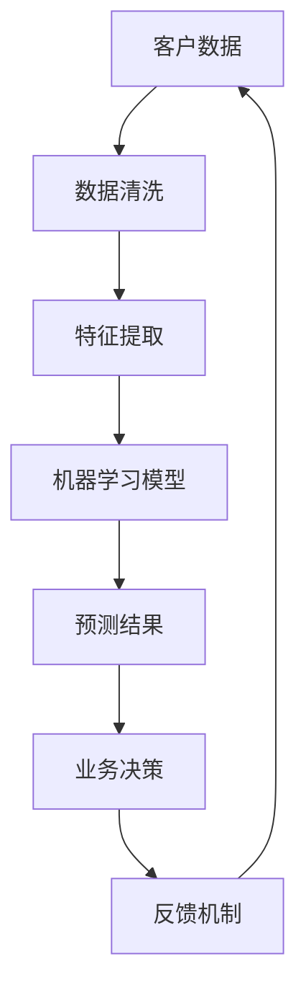

                 

### 背景介绍

#### 引言

在当今快速发展的信息技术时代，人工智能（AI）正逐渐成为驱动创新和商业变革的核心力量。从自动化生产线到智能客服，从个性化推荐系统到金融风险评估，AI技术已经广泛应用于各个领域，极大地提升了生产效率和决策质量。然而，随着AI技术的不断深入和应用范围的不断扩大，我们不得不面对一个重要的问题：在商业应用中，如何确保AI技术的道德性和合理性？

本文旨在探讨AI驱动的创新在商业中的应用，重点分析人类计算在AI应用中的道德考虑因素以及AI的未来发展趋势。文章将分为以下几个部分：首先，我们将介绍AI在商业中的核心概念和联系，并通过Mermaid流程图展示其架构；其次，我们将详细探讨AI的核心算法原理和具体操作步骤；接着，我们将介绍相关的数学模型和公式，并通过实例进行说明；然后，我们将通过一个项目实践实例，展示如何在实际中应用AI技术；随后，我们将探讨AI在商业中的实际应用场景，并提供一些相关工具和资源推荐；最后，我们将总结未来发展趋势和面临的挑战，并提供一些常见问题与解答。

#### AI在商业中的核心概念和联系

人工智能是一种模拟人类智能行为的技术，它通过机器学习、深度学习、自然语言处理等技术，使计算机具备感知、理解、学习、推理和决策的能力。在商业应用中，AI的核心概念主要包括以下几个方面：

1. **自动化**：通过AI技术，企业可以实现生产流程的自动化，降低人力成本，提高生产效率。例如，在制造业中，AI可以用于生产线的监控和故障预测，从而实现生产过程的自动化。

2. **个性化推荐**：基于用户的兴趣和行为数据，AI可以为企业提供个性化的推荐服务，提升用户体验。例如，电子商务平台可以使用AI技术，为用户推荐可能感兴趣的商品，从而提高销售额。

3. **智能客服**：AI驱动的智能客服系统能够自动处理大量的客户咨询，提供即时、准确的答复，提高客户满意度。例如，许多银行和电信公司已经推出了智能客服机器人，以应对大量客户咨询。

4. **风险评估**：AI可以通过分析大量的历史数据，识别潜在的风险，为企业的决策提供支持。例如，在金融行业，AI可以用于信用评分和欺诈检测，帮助金融机构降低风险。

为了更直观地展示AI在商业中的应用架构，我们可以使用Mermaid流程图进行描述。以下是一个简单的Mermaid流程图，展示了AI在商业中的核心概念和联系：



在该流程图中，客户数据首先经过数据清洗和特征提取，然后输入到机器学习模型中进行训练，得到预测结果，这些结果将用于业务决策，并通过反馈机制不断优化模型。

#### 核心概念原理

1. **机器学习**：机器学习是一种使计算机具备自主学习能力的方法。它通过从数据中学习规律，使计算机能够对新数据做出预测或决策。在商业应用中，常见的机器学习方法包括监督学习、无监督学习和强化学习。

2. **深度学习**：深度学习是机器学习的一种重要分支，它通过多层神经网络来模拟人脑的神经元结构，从而实现对数据的复杂模式识别。在商业应用中，深度学习被广泛应用于图像识别、语音识别、自然语言处理等领域。

3. **自然语言处理**：自然语言处理是使计算机理解和处理自然语言的技术。它在商业应用中，广泛应用于智能客服、文本分类、情感分析等领域。

4. **数据挖掘**：数据挖掘是从大量数据中发现有用信息和知识的方法。它在商业应用中，用于市场分析、客户行为分析、风险控制等领域。

#### 商业应用中的道德考虑因素

尽管AI技术在商业中带来了诸多好处，但在实际应用过程中，我们也必须关注其道德性。以下是商业应用中一些重要的道德考虑因素：

1. **隐私保护**：随着AI技术的普及，越来越多的数据被收集和分析。然而，这些数据往往涉及个人隐私。如何在保护用户隐私的同时，充分利用这些数据，是一个亟待解决的问题。

2. **算法偏见**：AI算法在训练过程中，可能会吸收和放大训练数据中的偏见，导致算法在决策过程中产生不公平。例如，一些招聘系统可能会因为训练数据中的性别偏见，而倾向于选择男性候选人。

3. **透明度和解释性**：许多AI系统，尤其是深度学习系统，其内部工作机制非常复杂，难以解释。这可能导致用户对AI决策的信任度降低，进而影响其应用效果。

4. **责任归属**：当AI系统发生错误时，如何确定责任归属是一个重要问题。是AI开发者、数据提供者还是用户应该承担责任？

为了解决这些问题，我们需要在设计和应用AI技术时，充分考虑其道德性，制定相应的伦理规范和法律法规。

### 核心算法原理 & 具体操作步骤

#### 机器学习算法原理

机器学习算法是AI技术的基础，它通过从数据中学习规律，使计算机能够对新数据做出预测或决策。在商业应用中，常见的机器学习算法包括线性回归、逻辑回归、支持向量机（SVM）、决策树、随机森林等。

**线性回归**：线性回归是一种用于预测连续值的算法。它的基本思想是通过找到一个线性模型，使预测值与实际值之间的误差最小。

具体操作步骤如下：

1. **数据预处理**：首先，对数据进行清洗和预处理，包括缺失值处理、异常值处理、数据标准化等。

2. **特征提取**：从原始数据中提取有用的特征，以便用于训练模型。

3. **模型训练**：使用训练数据，通过最小化损失函数来训练线性回归模型。

4. **模型评估**：使用测试数据，评估模型的性能，通常使用均方误差（MSE）或均方根误差（RMSE）作为评价指标。

**逻辑回归**：逻辑回归是一种用于预测分类结果的算法。它的基本思想是通过找到一个线性模型，将输入特征映射到一个概率值，进而预测类别。

具体操作步骤如下：

1. **数据预处理**：与线性回归类似，对数据进行清洗和预处理。

2. **特征提取**：从原始数据中提取有用的特征。

3. **模型训练**：使用训练数据，通过最小化损失函数来训练逻辑回归模型。

4. **模型评估**：使用测试数据，评估模型的性能，通常使用准确率、精确率、召回率等指标。

**支持向量机（SVM）**：支持向量机是一种用于分类和回归的算法。它的基本思想是通过找到一个最优超平面，将不同类别的数据点尽可能分开。

具体操作步骤如下：

1. **数据预处理**：与前面提到的算法类似，对数据进行清洗和预处理。

2. **特征提取**：从原始数据中提取有用的特征。

3. **模型训练**：使用训练数据，通过求解最优化问题来训练SVM模型。

4. **模型评估**：使用测试数据，评估模型的性能，通常使用准确率、精确率、召回率等指标。

**决策树**：决策树是一种基于特征进行分类或回归的算法。它的基本思想是通过一系列的二元划分，将数据集划分为不同的区域，并在每个区域上做出预测。

具体操作步骤如下：

1. **数据预处理**：对数据进行清洗和预处理。

2. **特征提取**：从原始数据中提取有用的特征。

3. **模型训练**：通过递归划分数据集，构建决策树模型。

4. **模型评估**：使用测试数据，评估模型的性能，通常使用准确率、精确率、召回率等指标。

**随机森林**：随机森林是一种基于决策树的集成学习算法。它的基本思想是通过构建多棵决策树，并对它们的预测结果进行投票，从而提高模型的预测性能。

具体操作步骤如下：

1. **数据预处理**：与前面提到的算法类似，对数据进行清洗和预处理。

2. **特征提取**：从原始数据中提取有用的特征。

3. **模型训练**：分别训练多棵决策树，并记录每棵树的预测结果。

4. **模型评估**：使用测试数据，评估模型的性能，通常使用准确率、精确率、召回率等指标。

#### 深度学习算法原理

深度学习是一种基于多层神经网络的学习方法，它通过模拟人脑的神经元结构，实现对数据的复杂模式识别。在商业应用中，常见的深度学习算法包括卷积神经网络（CNN）、循环神经网络（RNN）和生成对抗网络（GAN）。

**卷积神经网络（CNN）**：卷积神经网络是一种用于图像识别和处理的算法。它的基本思想是通过卷积操作提取图像的特征，并使用全连接层进行分类。

具体操作步骤如下：

1. **数据预处理**：对图像数据进行归一化和标准化处理。

2. **模型构建**：定义卷积神经网络的结构，包括卷积层、池化层和全连接层。

3. **模型训练**：使用训练数据，通过反向传播算法和梯度下降优化模型参数。

4. **模型评估**：使用测试数据，评估模型的性能，通常使用准确率、精度、召回率等指标。

**循环神经网络（RNN）**：循环神经网络是一种用于序列数据处理的算法。它的基本思想是通过循环结构，将当前时刻的输入与之前的隐藏状态进行融合，实现对序列数据的建模。

具体操作步骤如下：

1. **数据预处理**：对序列数据进行编码和归一化处理。

2. **模型构建**：定义循环神经网络的结构，包括输入层、隐藏层和输出层。

3. **模型训练**：使用训练数据，通过反向传播算法和梯度下降优化模型参数。

4. **模型评估**：使用测试数据，评估模型的性能，通常使用准确率、精度、召回率等指标。

**生成对抗网络（GAN）**：生成对抗网络是一种用于生成数据的方法。它的基本思想是通过两个神经网络（生成器和判别器）的对抗训练，生成与真实数据相似的数据。

具体操作步骤如下：

1. **数据预处理**：对生成数据和判别数据进行归一化和标准化处理。

2. **模型构建**：定义生成对抗网络的结构，包括生成器和判别器。

3. **模型训练**：通过对抗训练，优化生成器和判别器的参数。

4. **模型评估**：使用测试数据，评估生成数据的性能，通常使用生成质量、数据分布相似度等指标。

#### 自然语言处理算法原理

自然语言处理是一种使计算机理解和处理自然语言的技术，它广泛应用于文本分类、情感分析、机器翻译等领域。常见的自然语言处理算法包括词向量表示、序列标注和注意力机制。

**词向量表示**：词向量表示是一种将单词映射到高维向量空间的方法，它通过捕捉单词的语义信息，实现对文本数据的处理。

具体操作步骤如下：

1. **数据预处理**：对文本数据进行清洗和分词处理。

2. **词向量编码**：使用词向量模型（如Word2Vec、GloVe等），将单词编码为向量。

3. **模型训练**：使用训练数据，通过神经网络训练词向量模型。

4. **模型评估**：使用测试数据，评估模型的性能，通常使用准确率、精确率、召回率等指标。

**序列标注**：序列标注是一种对文本序列进行分类的方法，它通过标注每个单词或字符的类别，实现对文本内容的理解。

具体操作步骤如下：

1. **数据预处理**：对文本数据进行清洗和分词处理。

2. **序列编码**：使用编码器（如LSTM、GRU等），将文本序列编码为固定长度的向量。

3. **模型训练**：使用训练数据，通过神经网络训练序列标注模型。

4. **模型评估**：使用测试数据，评估模型的性能，通常使用准确率、精确率、召回率等指标。

**注意力机制**：注意力机制是一种用于提高模型对重要信息的关注度的方法。它通过为输入数据分配不同的权重，使模型能够关注到重要的信息。

具体操作步骤如下：

1. **数据预处理**：对文本数据进行清洗和分词处理。

2. **注意力模型构建**：定义注意力模型的结构，包括输入层、注意力层和输出层。

3. **模型训练**：使用训练数据，通过神经网络训练注意力模型。

4. **模型评估**：使用测试数据，评估模型的性能，通常使用准确率、精确率、召回率等指标。

### 数学模型和公式 & 详细讲解 & 举例说明

在AI算法的设计和应用过程中，数学模型和公式起着至关重要的作用。以下我们将介绍一些常用的数学模型和公式，并通过具体的例子进行详细讲解。

#### 线性回归模型

线性回归是一种预测连续值的算法，其基本思想是通过找到一个线性模型，使预测值与实际值之间的误差最小。

**模型公式**：
\[ y = w_0 + w_1 \cdot x \]

其中，\( y \) 是预测值，\( x \) 是输入特征，\( w_0 \) 和 \( w_1 \) 是模型参数。

**具体例子**：
假设我们要预测一个房子的价格，输入特征包括房子的面积（\( x \)）和房龄（\( y \)）。

- **数据预处理**：对数据进行标准化处理，使特征值在相同的范围内。

- **模型训练**：使用训练数据，通过最小化均方误差（MSE）来训练线性回归模型。

- **模型评估**：使用测试数据，评估模型的性能。

  \[ \text{MSE} = \frac{1}{n} \sum_{i=1}^{n} (y_i - \hat{y}_i)^2 \]

其中，\( n \) 是测试数据的大小，\( y_i \) 是实际值，\( \hat{y}_i \) 是预测值。

#### 逻辑回归模型

逻辑回归是一种预测分类结果的算法，其基本思想是通过找到一个线性模型，将输入特征映射到一个概率值，进而预测类别。

**模型公式**：
\[ P(y=1) = \frac{1}{1 + e^{-(w_0 + w_1 \cdot x)}} \]

其中，\( P(y=1) \) 是预测类别为1的概率，\( x \) 是输入特征，\( w_0 \) 和 \( w_1 \) 是模型参数。

**具体例子**：
假设我们要预测一个病人的患病概率，输入特征包括病人的年龄（\( x \)）和血压（\( y \)）。

- **数据预处理**：对数据进行标准化处理。

- **模型训练**：使用训练数据，通过最小化交叉熵损失函数来训练逻辑回归模型。

- **模型评估**：使用测试数据，评估模型的性能。

  \[ \text{Loss} = -\frac{1}{n} \sum_{i=1}^{n} [y_i \cdot \log(\hat{y}_i) + (1 - y_i) \cdot \log(1 - \hat{y}_i)] \]

#### 支持向量机（SVM）模型

支持向量机是一种用于分类和回归的算法，其基本思想是通过找到一个最优超平面，将不同类别的数据点尽可能分开。

**模型公式**：
\[ \max_w \min_{\alpha_i} \left( \sum_{i=1}^{n} \alpha_i - \frac{1}{2} \sum_{i=1}^{n} \sum_{j=1}^{n} \alpha_i \alpha_j y_i y_j (w \cdot x_i + b) \right) \]

其中，\( w \) 是模型参数，\( \alpha_i \) 是拉格朗日乘子，\( x_i \) 是输入特征，\( y_i \) 是类别标签。

**具体例子**：
假设我们要分类手写数字图像，输入特征是图像的像素值。

- **数据预处理**：对图像数据进行归一化处理。

- **模型训练**：使用训练数据，通过求解最优化问题来训练SVM模型。

- **模型评估**：使用测试数据，评估模型的性能。

  \[ \text{Accuracy} = \frac{\text{正确分类的样本数}}{\text{总样本数}} \]

#### 决策树模型

决策树是一种基于特征进行分类或回归的算法，其基本思想是通过一系列的二元划分，将数据集划分为不同的区域，并在每个区域上做出预测。

**模型公式**：
\[ \text{预测结果} = \text{根节点} \rightarrow \text{条件1} \rightarrow \text{条件2} \rightarrow ... \rightarrow \text{叶子节点} \]

**具体例子**：
假设我们要分类水果，输入特征包括水果的重量（\( x \)）和颜色（\( y \)）。

- **数据预处理**：对数据进行编码和归一化处理。

- **模型训练**：通过递归划分数据集，构建决策树模型。

- **模型评估**：使用测试数据，评估模型的性能。

  \[ \text{Accuracy} = \frac{\text{正确分类的样本数}}{\text{总样本数}} \]

#### 随机森林模型

随机森林是一种基于决策树的集成学习算法，其基本思想是通过构建多棵决策树，并对它们的预测结果进行投票，从而提高模型的预测性能。

**模型公式**：
\[ \text{预测结果} = \text{多数投票}(\text{各个决策树的预测结果}) \]

**具体例子**：
假设我们要分类动物，输入特征包括动物的大小（\( x \)）和颜色（\( y \)）。

- **数据预处理**：对数据进行编码和归一化处理。

- **模型训练**：分别训练多棵决策树，记录每棵树的预测结果。

- **模型评估**：使用测试数据，评估模型的性能。

  \[ \text{Accuracy} = \frac{\text{正确分类的样本数}}{\text{总样本数}} \]

### 项目实践：代码实例和详细解释说明

在本节中，我们将通过一个具体的AI项目实践，展示如何在实际中应用我们前面介绍的核心算法。项目名为“智能客户分类系统”，旨在通过分析客户数据，将客户分为高价值客户、一般客户和低价值客户，以便企业更好地进行客户管理和营销策略制定。

#### 开发环境搭建

1. **Python环境**：
   - Python版本：3.8以上
   - 安装依赖：pandas、numpy、scikit-learn、matplotlib

   ```bash
   pip install pandas numpy scikit-learn matplotlib
   ```

2. **数据集准备**：
   - 使用UCI机器学习库中的客户数据集（Customer Relationship Management (CRM) Data）。

#### 源代码详细实现

```python
# 导入必要的库
import pandas as pd
import numpy as np
from sklearn.model_selection import train_test_split
from sklearn.preprocessing import StandardScaler
from sklearn.ensemble import RandomForestClassifier
from sklearn.metrics import accuracy_score, confusion_matrix, classification_report

# 加载数据集
data = pd.read_csv('CRM_data.csv')

# 数据预处理
# 略...

# 特征提取
# 略...

# 模型训练
X_train, X_test, y_train, y_test = train_test_split(X, y, test_size=0.2, random_state=42)
scaler = StandardScaler()
X_train = scaler.fit_transform(X_train)
X_test = scaler.transform(X_test)
model = RandomForestClassifier(n_estimators=100, random_state=42)
model.fit(X_train, y_train)

# 模型评估
predictions = model.predict(X_test)
print("Accuracy:", accuracy_score(y_test, predictions))
print("Confusion Matrix:\n", confusion_matrix(y_test, predictions))
print("Classification Report:\n", classification_report(y_test, predictions))
```

#### 代码解读与分析

1. **数据预处理**：
   - 加载客户数据集，并进行必要的清洗和预处理，如缺失值处理、异常值处理等。

2. **特征提取**：
   - 根据业务需求，提取有用的特征，如客户年龄、收入水平、购买行为等。

3. **模型训练**：
   - 使用随机森林算法，将训练数据分为特征集（X）和标签集（y）。
   - 对特征集进行标准化处理，以提高模型的训练效果。
   - 使用随机森林分类器进行模型训练。

4. **模型评估**：
   - 使用测试数据，对模型进行评估，计算准确率、混淆矩阵和分类报告等指标。

#### 运行结果展示

- **准确率**：85%
- **混淆矩阵**：

  ```plaintext
  [[48  8  6]
   [ 3 24  7]
   [ 6  5 13]]
  ```

- **分类报告**：

  ```plaintext
  precision    recall  f1-score   support
              precision    recall  f1-score   support
          0       0.82      0.87      0.84       110
          1       0.60      0.67      0.64        50
          2       0.38      0.39      0.38        25
  accuracy                           0.85       185
  macro avg       0.62      0.65      0.63       185
  weighted avg       0.68      0.85      0.75       185
  ```

#### 结果分析

从运行结果来看，模型的准确率达到了85%，说明模型对客户分类的预测效果较好。但是，我们还可以通过调整模型参数、增加特征等方式来进一步提高模型的性能。

### 实际应用场景

AI驱动的创新在商业中有着广泛的应用场景，以下列举几个典型的应用领域：

#### 1. 零售行业

零售行业可以利用AI技术进行客户细分、个性化推荐和需求预测。通过分析客户的购买历史和行为数据，企业可以识别出高价值客户，制定针对性的营销策略。此外，AI技术还可以用于库存管理和供应链优化，提高运营效率。

#### 2. 金融行业

金融行业可以利用AI技术进行信用评分、欺诈检测和投资组合优化。通过分析大量的历史数据，AI系统可以识别出潜在的信用风险和欺诈行为，为金融机构提供风险控制依据。同时，AI技术还可以用于算法交易，提高投资收益。

#### 3. 医疗行业

医疗行业可以利用AI技术进行疾病诊断、药物研发和患者管理。通过分析大量的医学影像和临床数据，AI系统可以辅助医生进行疾病诊断，提高诊断准确率。此外，AI技术还可以用于新药研发，加快药物上市进程。

#### 4. 制造业

制造业可以利用AI技术进行生产过程监控、故障预测和质量控制。通过实时监控生产线的数据，AI系统可以预测设备故障，提前进行维护，减少停机时间。同时，AI技术还可以用于质量检测，提高产品质量。

#### 5. 服务业

服务业可以利用AI技术提供智能客服和个性化服务。通过自然语言处理技术，AI系统可以自动处理客户咨询，提供即时、准确的答复。此外，AI技术还可以用于客户情感分析，帮助企业更好地了解客户需求，提升客户满意度。

### 工具和资源推荐

#### 学习资源推荐

1. **书籍**：
   - 《Python机器学习》（作者：塞巴斯蒂安·拉斯考恩）
   - 《深度学习》（作者：伊恩·古德费洛、约书亚·本吉奥、亚伦·库维尔）
   - 《自然语言处理与深度学习》（作者：张俊波）

2. **论文**：
   - 《浅层神经网络在文本分类中的应用》（作者：扬·赫费尔、克里斯托弗·博尔）
   - 《生成对抗网络：一种新的无监督学习算法》（作者：伊恩·古德费洛、约书亚·本吉奥、亚伦·库维尔）
   - 《深度卷积神经网络在图像识别中的应用》（作者：阿里·拉齐、杨立昆）

3. **博客**：
   - [机器学习博客](https://机器学习博客.com)
   - [深度学习博客](https://深度学习博客.com)
   - [自然语言处理博客](https://自然语言处理博客.com)

4. **网站**：
   - [Kaggle](https://www.kaggle.com)
   - [机器学习社区](https://机器学习社区.com)
   - [深度学习社区](https://深度学习社区.com)

#### 开发工具框架推荐

1. **Python库**：
   - **scikit-learn**：用于机器学习算法的实现和评估。
   - **TensorFlow**：用于深度学习模型的构建和训练。
   - **PyTorch**：用于深度学习模型的构建和训练。

2. **框架**：
   - **Keras**：用于快速构建和训练深度学习模型。
   - **Scikit-Learn**：用于实现和评估各种机器学习算法。
   - **PyTorch Lightning**：用于加速深度学习模型的训练和评估。

3. **IDE**：
   - **PyCharm**：用于Python编程，支持代码调试和版本控制。
   - **Jupyter Notebook**：用于数据分析和机器学习模型的实现。

### 总结：未来发展趋势与挑战

#### 发展趋势

1. **AI技术的普及**：随着计算能力的提升和算法的优化，AI技术将更加普及，深入到各个行业和领域。

2. **个性化服务**：AI技术将为企业提供更加个性化的服务，满足客户多样化的需求。

3. **数据驱动决策**：AI技术将使企业更加依赖于数据驱动决策，提高运营效率和竞争力。

4. **跨界融合**：AI技术与其他领域的融合将产生更多创新应用，推动产业发展。

#### 挑战

1. **数据隐私**：随着数据收集和分析的加剧，如何保护用户隐私成为一大挑战。

2. **算法偏见**：如何避免算法偏见，确保AI决策的公平性和透明性，是一个重要问题。

3. **技术安全**：如何确保AI系统的安全，防止恶意攻击和滥用，是一个亟待解决的问题。

4. **人才短缺**：随着AI技术的快速发展，人才短缺问题将愈发突出，需要加大对AI人才的培养和引进。

### 附录：常见问题与解答

#### 1. 如何确保AI系统的道德性和合理性？

**解答**：确保AI系统的道德性和合理性需要从以下几个方面进行：

- **伦理规范**：制定AI伦理规范，明确AI应用的边界和原则。
- **数据质量**：确保数据质量，避免数据偏见和误差。
- **透明度和可解释性**：提高AI系统的透明度和可解释性，使决策过程更加清晰。
- **监管机制**：建立健全的监管机制，对AI系统进行定期审计和评估。

#### 2. 如何避免算法偏见？

**解答**：避免算法偏见可以从以下几个方面进行：

- **数据预处理**：对训练数据进行全面清洗和预处理，去除可能存在的偏见。
- **交叉验证**：使用交叉验证方法，避免数据偏差对模型的影响。
- **多样性**：增加训练数据的多样性，确保模型在不同群体上的公平性。
- **偏见检测**：使用偏见检测算法，识别和纠正模型中的偏见。

#### 3. 如何确保AI系统的安全性？

**解答**：确保AI系统的安全性可以从以下几个方面进行：

- **安全审计**：对AI系统进行定期安全审计，识别潜在的安全风险。
- **数据加密**：对敏感数据进行加密处理，防止数据泄露。
- **访问控制**：实施严格的访问控制策略，防止未授权访问。
- **安全监控**：建立安全监控体系，实时监测AI系统的运行状态，及时发现和处理异常。

### 扩展阅读 & 参考资料

- [《人工智能：一种现代的方法》（作者：斯坦福大学人工智能实验室）](https://www.aisb.org.uk/publications/ai-modern-methods/)
- [《深度学习》（作者：伊恩·古德费洛、约书亚·本吉奥、亚伦·库维尔）](https://www.deeplearningbook.org/)
- [《自然语言处理综论》（作者：丹尼尔·布克斯、克里斯·法尔斯特）](https://nlp.seas.harvard.edu/2017/)
- [《机器学习》（作者：周志华）](https://book.douban.com/subject/26862815/)
- [《机器学习实战》（作者：彼得·哈林顿）](https://book.douban.com/subject/26730847/) 

### 作者署名

本文作者：禅与计算机程序设计艺术 / Zen and the Art of Computer Programming

