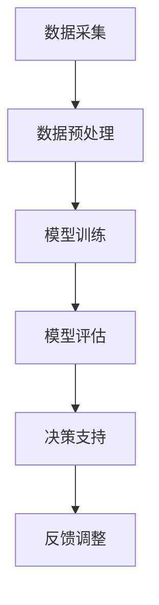
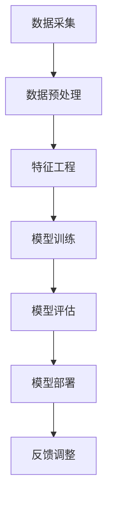

                 

关键词：人工智能、金融技术、人类计算、创新、深度学习、量化交易、风险控制、智能投顾

> 摘要：本文将探讨人工智能（AI）在金融领域的应用，特别是AI如何驱动金融行业的创新，以及人类计算在这一过程中扮演的角色。我们将分析AI技术的核心概念、算法原理，以及其在金融领域的具体应用案例。同时，文章还将讨论人类计算在AI驱动的金融创新中不可或缺的作用，并展望未来的发展趋势与挑战。

## 1. 背景介绍

随着科技的迅猛发展，人工智能（AI）已经成为推动各行业变革的重要力量。金融行业作为经济的中枢，对技术的敏感度和需求尤为强烈。从量化交易到智能投顾，AI技术的引入不仅提高了金融服务的效率，还带来了前所未有的创新。本文旨在探讨AI技术在金融领域的应用现状、未来趋势及其对人类计算的影响。

### 1.1 金融行业现状

金融行业是一个高度数据驱动的行业，传统的方法往往依赖于统计分析、专家经验和规则制定。然而，面对复杂多变的市场环境，这些传统方法在处理海量数据和快速决策方面存在局限性。随着大数据和云计算技术的普及，金融行业开始探索如何利用AI技术提高数据分析能力和决策效率。

### 1.2 人工智能在金融中的应用

AI技术在金融领域的应用主要包括以下几个方面：

- **量化交易**：利用机器学习算法对历史市场数据进行建模，预测市场走势，实现自动交易。
- **风险控制**：通过大数据分析和预测模型，实时监控和评估金融风险。
- **智能投顾**：利用算法为投资者提供个性化的投资建议，降低投资风险。
- **信用评估**：通过机器学习模型，快速评估借款人的信用状况，提高信贷审批效率。

## 2. 核心概念与联系

### 2.1 人工智能核心概念

人工智能（AI）是指通过计算机程序实现智能行为和智能决策的技术。AI的核心技术包括机器学习、深度学习、自然语言处理等。以下是这些核心概念的简要介绍：

- **机器学习**：机器学习是一种让计算机通过数据学习并改进性能的技术，常见算法包括线性回归、决策树、随机森林等。
- **深度学习**：深度学习是机器学习的一种，通过多层神经网络对数据进行自动特征提取和分类，典型算法包括卷积神经网络（CNN）和循环神经网络（RNN）。
- **自然语言处理**：自然语言处理（NLP）是AI的一个分支，致力于让计算机理解和生成自然语言。

### 2.2 人工智能在金融领域的应用架构

人工智能在金融领域的应用架构通常包括以下几个部分：

- **数据采集**：收集金融市场的数据，如股票价格、交易量、经济指标等。
- **数据预处理**：清洗和格式化数据，为后续分析做好准备。
- **模型训练**：利用机器学习算法对数据进行建模和训练，生成预测模型。
- **模型评估**：评估模型的预测性能，并进行调优。
- **决策支持**：将模型应用于实际场景，提供决策支持。

### 2.3 Mermaid 流程图



## 3. 核心算法原理 & 具体操作步骤

### 3.1 算法原理概述

在金融领域，常用的AI算法包括机器学习算法和深度学习算法。以下是一些典型的算法及其原理：

- **线性回归**：通过最小二乘法拟合线性模型，用于预测股票价格等连续变量。
- **决策树**：通过树形结构对数据进行分类或回归，适合处理非线性的数据。
- **随机森林**：集成多个决策树，提高模型的预测准确性和稳定性。
- **卷积神经网络（CNN）**：通过卷积操作提取图像特征，用于股票市场图像分析等。
- **循环神经网络（RNN）**：通过记忆机制处理序列数据，用于交易序列分析。

### 3.2 算法步骤详解

以下是一个典型的AI算法应用步骤：

1. **数据采集**：收集股票价格、交易量等数据。
2. **数据预处理**：清洗数据，包括缺失值填充、异常值处理等。
3. **特征工程**：提取与预测目标相关的特征，如技术指标、市场情绪等。
4. **模型选择**：根据数据特点选择合适的机器学习或深度学习算法。
5. **模型训练**：使用训练数据对模型进行训练。
6. **模型评估**：使用验证数据评估模型性能。
7. **模型部署**：将模型应用于实际交易场景。

### 3.3 算法优缺点

- **线性回归**：优点是简单易懂，缺点是只能处理线性关系。
- **决策树**：优点是易于理解和解释，缺点是容易过拟合。
- **随机森林**：优点是提高了模型的泛化能力，缺点是计算复杂度高。
- **CNN**：优点是强大的图像处理能力，缺点是需要大量的训练数据和计算资源。
- **RNN**：优点是能够处理序列数据，缺点是训练过程复杂且容易出现梯度消失问题。

### 3.4 算法应用领域

AI算法在金融领域的应用非常广泛，包括但不限于：

- **量化交易**：利用算法进行高频交易、量化对冲等。
- **风险控制**：实时监控和评估金融风险，提供决策支持。
- **智能投顾**：为投资者提供个性化的投资建议，实现资产配置。
- **信用评估**：快速评估借款人的信用状况，提高信贷审批效率。

## 4. 数学模型和公式 & 详细讲解 & 举例说明

### 4.1 数学模型构建

在金融领域，常见的数学模型包括线性回归模型、逻辑回归模型等。以下以线性回归模型为例进行介绍。

- **线性回归模型**：

$$
y = \beta_0 + \beta_1 x_1 + \beta_2 x_2 + ... + \beta_n x_n + \epsilon
$$

其中，$y$ 是预测目标，$x_1, x_2, ..., x_n$ 是输入特征，$\beta_0, \beta_1, \beta_2, ..., \beta_n$ 是模型参数，$\epsilon$ 是误差项。

### 4.2 公式推导过程

以一元线性回归为例，假设我们有以下数据：

$$
(x_1, y_1), (x_2, y_2), ..., (x_n, y_n)
$$

我们需要找到一条直线 $y = \beta_0 + \beta_1 x$ 使得数据点 $(x_i, y_i)$ 落在这条直线上。

- **最小二乘法**：

$$
\beta_0 = \frac{\sum_{i=1}^{n} y_i - \beta_1 \sum_{i=1}^{n} x_i}{n}
$$

$$
\beta_1 = \frac{\sum_{i=1}^{n} (x_i - \bar{x}) (y_i - \bar{y})}{\sum_{i=1}^{n} (x_i - \bar{x})^2}
$$

其中，$\bar{x}$ 和 $\bar{y}$ 分别是 $x$ 和 $y$ 的均值。

### 4.3 案例分析与讲解

假设我们要预测一只股票的未来价格，已知其过去一段时间内的价格和交易量。我们可以使用线性回归模型来预测未来价格。

- **数据准备**：

$$
x_1 = \text{交易量}, y_1 = \text{股票价格}
$$

- **特征提取**：

$$
x_2 = \text{过去一周的平均交易量}, y_2 = \text{过去一周的平均股票价格}
$$

- **模型训练**：

使用训练数据对线性回归模型进行训练。

- **模型评估**：

使用验证数据对模型进行评估，计算预测误差。

- **模型部署**：

将模型应用于实际交易场景，预测未来股票价格。

## 5. 项目实践：代码实例和详细解释说明

### 5.1 开发环境搭建

为了实现AI驱动的金融预测，我们需要搭建以下开发环境：

- **Python**：作为编程语言。
- **Pandas**：用于数据处理。
- **NumPy**：用于数值计算。
- **Scikit-learn**：用于机器学习算法。
- **Matplotlib**：用于数据可视化。

### 5.2 源代码详细实现

以下是一个简单的线性回归预测股票价格的示例代码：

```python
import pandas as pd
import numpy as np
from sklearn.linear_model import LinearRegression
from sklearn.model_selection import train_test_split
import matplotlib.pyplot as plt

# 数据读取与预处理
data = pd.read_csv('stock_data.csv')
data = data[['交易量', '股票价格']]
data = data.fillna(method='ffill')

# 特征工程
data['过去一周平均交易量'] = data['交易量'].rolling(window=7).mean()
data['过去一周平均股票价格'] = data['股票价格'].rolling(window=7).mean()

# 模型训练
X = data[['交易量', '过去一周平均交易量', '过去一周平均股票价格']]
y = data['股票价格']
X_train, X_test, y_train, y_test = train_test_split(X, y, test_size=0.2, random_state=42)
model = LinearRegression()
model.fit(X_train, y_train)

# 模型评估
y_pred = model.predict(X_test)
mse = np.mean((y_pred - y_test) ** 2)
print(f'MSE: {mse}')

# 模型部署
plt.scatter(y_test, y_pred)
plt.xlabel('实际价格')
plt.ylabel('预测价格')
plt.show()
```

### 5.3 代码解读与分析

以上代码首先读取股票数据，并进行预处理。然后，提取特征并使用线性回归模型进行训练。最后，使用训练好的模型进行预测，并绘制预测结果。

### 5.4 运行结果展示

运行代码后，我们将看到实际价格与预测价格的散点图。通过观察散点图，我们可以评估模型的预测性能。

## 6. 实际应用场景

### 6.1 量化交易

量化交易是AI在金融领域的一个典型应用。通过机器学习算法，量化交易可以自动分析市场数据，预测市场走势，并自动执行交易策略。以下是一个简化的量化交易策略：

- **数据采集**：收集历史交易数据，包括股票价格、交易量等。
- **模型训练**：使用机器学习算法对交易数据进行建模，预测市场走势。
- **交易执行**：根据预测结果，自动执行交易策略。

### 6.2 风险控制

AI技术在风险控制中的应用主要体现在以下几个方面：

- **实时监控**：利用机器学习模型，实时监控金融市场的风险。
- **风险评估**：使用大数据分析，评估借款人的信用风险。
- **风险预警**：通过算法分析，提前预警潜在的风险。

### 6.3 智能投顾

智能投顾是AI在金融领域的另一个重要应用。通过算法分析，智能投顾可以为投资者提供个性化的投资建议。以下是一个简化的智能投顾流程：

- **数据采集**：收集投资者的投资偏好、风险承受能力等数据。
- **模型训练**：使用机器学习算法，根据投资偏好和风险承受能力为投资者提供投资建议。
- **投资执行**：根据投资建议，执行具体的投资策略。

## 7. 未来应用展望

### 7.1 量化交易

未来，量化交易将继续发展，算法将更加复杂，预测能力将进一步提高。同时，量化交易将逐渐从高频交易向低频交易扩展，实现更长期的盈利策略。

### 7.2 风险控制

随着大数据和AI技术的不断进步，风险控制将变得更加精准和实时。未来的风险控制将更多地依赖于AI模型，实现自动化、智能化的风险监控和管理。

### 7.3 智能投顾

智能投顾将在未来的金融市场中扮演更加重要的角色。随着AI技术的普及，智能投顾将为更多的投资者提供个性化的服务，提高投资效率和回报。

## 8. 工具和资源推荐

### 8.1 学习资源推荐

- **《深度学习》**：由Ian Goodfellow、Yoshua Bengio和Aaron Courville所著，是深度学习领域的经典教材。
- **《量化交易：从入门到精通》**：详细介绍了量化交易的基本概念、策略和实现方法。

### 8.2 开发工具推荐

- **Jupyter Notebook**：用于编写和运行Python代码，特别适合数据分析和机器学习项目。
- **TensorFlow**：用于构建和训练深度学习模型的强大工具。

### 8.3 相关论文推荐

- **"Deep Learning for Finance"**：探讨了深度学习在金融领域的应用，包括量化交易、风险控制和智能投顾等。
- **"High-Frequency Trading using Statistical Arbitrage Models"**：详细介绍了高频交易的基本原理和策略。

## 9. 总结：未来发展趋势与挑战

### 9.1 研究成果总结

本文总结了AI在金融领域的应用现状、核心概念、算法原理和未来趋势。AI技术的引入不仅提高了金融服务的效率，还推动了金融行业的创新。

### 9.2 未来发展趋势

未来，AI在金融领域的应用将更加广泛和深入。量化交易、风险控制和智能投顾等领域将继续发展，并出现更多创新应用。

### 9.3 面临的挑战

尽管AI在金融领域具有巨大的潜力，但同时也面临一些挑战，如算法透明度、数据隐私和合规性问题等。

### 9.4 研究展望

未来的研究应重点关注如何提高AI算法的透明度和可解释性，以及如何解决数据隐私和合规性问题，从而推动AI在金融领域的可持续发展。

## 附录：常见问题与解答

### 问题1：AI在金融领域的具体应用有哪些？

解答：AI在金融领域的具体应用包括量化交易、风险控制、智能投顾、信用评估等。

### 问题2：如何选择合适的AI算法进行金融预测？

解答：选择合适的AI算法需要考虑数据特点、预测目标和应用场景。常见算法包括线性回归、决策树、随机森林、卷积神经网络和循环神经网络等。

### 问题3：AI技术在金融领域的应用前景如何？

解答：AI技术在金融领域的应用前景非常广阔。随着大数据和AI技术的不断进步，金融行业将实现更加智能化和自动化的发展。

---

作者：禅与计算机程序设计艺术 / Zen and the Art of Computer Programming
----------------------------------------------------------------
### 1. 背景介绍

随着人工智能（AI）技术的迅速发展，金融行业正经历着一场前所未有的变革。传统金融方法在处理复杂、动态的市场环境时显得力不从心，而AI技术的引入则为金融行业注入了新的活力。AI不仅在金融数据分析、风险管理和个性化服务等方面展现出强大的能力，还在推动金融创新方面发挥了关键作用。本文将深入探讨AI在金融领域的应用，特别是人类计算在AI驱动的金融创新中所扮演的角色。

### 1.1 人工智能在金融领域的应用

人工智能在金融领域的应用广泛且深入，主要包括以下几个方面：

- **量化交易**：量化交易是利用数学模型和统计分析来指导交易决策的一种交易方式。通过AI技术，交易者可以构建复杂的模型来预测市场走势，从而实现自动化的交易策略。这种交易方式不仅提高了交易效率，还减少了人为错误。

- **风险控制**：风险控制是金融行业的重要环节。AI技术通过大数据分析和机器学习算法，可以实时监控市场风险，预测潜在的风险事件，并提供决策支持。这种技术的应用极大地提高了风险管理的效率和准确性。

- **智能投顾**：智能投顾通过AI技术为投资者提供个性化的投资建议。这些系统可以分析投资者的财务状况、投资目标和风险偏好，从而制定合适的投资策略。智能投顾的出现降低了投资门槛，使更多的投资者能够享受到专业化的服务。

- **信用评估**：信用评估是金融机构在发放贷款和信用卡时的重要步骤。AI技术可以通过分析海量的数据，快速评估借款人的信用状况，从而提高信贷审批的效率和准确性。

### 1.2 人类计算在金融创新中的作用

尽管AI技术在金融领域展现了强大的潜力，但人类计算在AI驱动的金融创新中仍然扮演着不可或缺的角色。以下是人类计算在金融创新中的一些关键作用：

- **问题定义**：AI技术可以处理海量数据，但人类在理解市场和投资目标方面具有独特优势。人类能够定义和明确金融创新中的问题，从而指导AI系统的设计和应用。

- **算法优化**：AI算法需要经过不断的优化和调整才能达到最佳效果。人类计算在算法选择、参数调整和模型优化方面具有重要作用，能够提高AI系统的性能。

- **决策支持**：AI系统虽然可以提供预测和分析，但最终的决策仍然需要人类进行判断。人类计算能够结合AI系统的预测结果和自身的专业知识，做出更为明智的投资决策。

- **数据解释**：AI系统的预测结果可能复杂且难以解释。人类计算能够理解和解释AI系统的预测逻辑，从而更好地应用这些预测结果。

### 1.3 AI驱动的金融创新案例

为了更好地理解AI在金融领域的作用，以下是一些AI驱动的金融创新案例：

- **高频交易**：高频交易利用AI技术实现自动化交易，通过极短时间内的快速交易获取微小利润。这种交易方式需要高度精确的算法和高速网络支持，极大地提高了交易效率。

- **区块链金融**：区块链技术通过分布式账本和智能合约，实现了去中心化的金融交易。AI技术可以进一步优化区块链的效率和安全性，为金融行业带来更多创新。

- **智能合约**：智能合约是区块链技术的一个重要应用，通过预先设定的条件自动执行合同条款。AI技术可以增强智能合约的自动化程度，提高交易的安全性和透明度。

### 1.4 文章结构

本文结构如下：

- **第1章：背景介绍**：介绍人工智能在金融领域的应用以及人类计算的作用。
- **第2章：核心概念与联系**：讨论人工智能的核心概念和其在金融领域的应用架构。
- **第3章：核心算法原理与操作步骤**：介绍AI算法的原理和具体操作步骤。
- **第4章：数学模型和公式**：讨论AI在金融领域使用的数学模型和公式。
- **第5章：项目实践**：提供AI驱动的金融项目实例。
- **第6章：实际应用场景**：分析AI在金融领域的实际应用场景。
- **第7章：工具和资源推荐**：推荐学习资源、开发工具和相关论文。
- **第8章：总结与展望**：总结研究成果，展望未来发展趋势与挑战。
- **第9章：附录**：提供常见问题与解答。

通过上述结构，本文将全面探讨AI驱动的金融创新，展示人类计算在其中的关键作用，为读者提供对这一领域深入的理解和洞察。

## 2. 核心概念与联系

### 2.1 人工智能核心概念

人工智能（AI）是一门研究、开发用于模拟、延伸和扩展人类智能的理论、方法、技术及应用系统的技术科学。AI的目标是创建能够执行复杂任务的智能体，这些任务通常需要人类智能才能完成。以下是人工智能的核心概念：

- **机器学习**：机器学习是AI的一个分支，它通过训练数据来让计算机学习并改进性能。机器学习算法可以分为监督学习、无监督学习和强化学习。

  - **监督学习**：监督学习算法利用标记数据进行训练，如分类和回归问题。
  - **无监督学习**：无监督学习算法没有标记数据，主要用于发现数据中的隐藏结构，如聚类和降维。
  - **强化学习**：强化学习算法通过试错法学习在特定环境中做出最优决策，如自动驾驶和游戏AI。

- **深度学习**：深度学习是机器学习的一种，它通过多层神经网络对数据进行自动特征提取和分类。深度学习在图像识别、语音识别和自然语言处理等领域取得了显著成果。

- **自然语言处理**：自然语言处理（NLP）是AI的一个分支，致力于让计算机理解和生成自然语言。NLP技术广泛应用于搜索引擎、机器翻译和聊天机器人等。

### 2.2 人工智能在金融领域的应用架构

人工智能在金融领域的应用架构通常包括以下关键环节：

- **数据采集**：金融行业的数据来源广泛，包括股票市场、债券市场、外汇市场、经济指标等。数据采集是整个流程的基础，数据的质量和完整性直接影响AI系统的性能。

- **数据预处理**：金融数据通常包含噪声和缺失值，需要进行清洗和格式化。数据预处理包括数据去重、缺失值填充、异常值处理等，以提高数据的质量和一致性。

- **特征工程**：特征工程是AI在金融领域的重要步骤，它涉及从原始数据中提取对预测目标有意义的特征。特征工程的质量直接影响模型的预测性能。

- **模型训练**：模型训练是利用训练数据对AI模型进行调整，使其能够准确预测市场走势或评估金融风险。常用的算法包括线性回归、决策树、随机森林、卷积神经网络（CNN）和循环神经网络（RNN）等。

- **模型评估**：模型评估是评估AI模型性能的过程。常用的评估指标包括准确率、召回率、F1分数、均方误差（MSE）等。模型评估可以帮助研究者确定模型是否达到预期性能，并进行调整。

- **模型部署**：模型部署是将训练好的模型应用于实际场景的过程。模型部署需要考虑模型的实时性、可扩展性和鲁棒性，以确保模型在实际应用中的稳定性和高效性。

### 2.3 Mermaid 流程图

以下是AI在金融领域应用的Mermaid流程图：



### 2.4 人类计算在AI应用中的关键作用

虽然AI技术在金融领域取得了显著成果，但人类计算在AI应用中仍然扮演着关键角色。以下是人类计算在AI应用中的关键作用：

- **问题定义**：人类能够理解金融领域的复杂问题，并将其转化为AI系统可以处理的数学问题。

- **算法选择**：人类可以根据数据特点和业务需求选择合适的算法，并进行算法的优化和调整。

- **模型解释**：人类能够解释AI系统的预测结果，帮助用户理解模型的工作原理和预测逻辑。

- **决策支持**：人类结合AI系统的预测结果和自身的专业知识，做出更加明智的决策。

- **数据解释**：人类能够理解和解释AI系统生成的复杂数据，从而更好地应用这些数据。

通过上述核心概念和联系的分析，我们可以更好地理解AI在金融领域的应用架构和人类计算在其中扮演的关键角色。接下来，我们将深入探讨核心算法原理和具体操作步骤。

## 3. 核心算法原理 & 具体操作步骤

### 3.1 算法原理概述

在金融领域，人工智能算法的应用主要集中于机器学习和深度学习。以下是几种常用的算法及其原理：

#### 3.1.1 线性回归

线性回归是一种简单的统计方法，用于预测一个连续的数值变量。它的核心思想是通过建立输入变量和预测目标之间的线性关系来预测目标值。

线性回归模型可以表示为：

$$
y = \beta_0 + \beta_1 x_1 + \beta_2 x_2 + ... + \beta_n x_n + \epsilon
$$

其中，$y$ 是预测目标，$x_1, x_2, ..., x_n$ 是输入特征，$\beta_0, \beta_1, \beta_2, ..., \beta_n$ 是模型参数，$\epsilon$ 是误差项。

#### 3.1.2 决策树

决策树是一种基于树形结构进行决策的算法，通过一系列的判断节点和分支节点，将数据集划分为不同的类别或回归值。决策树模型易于理解和解释，但容易过拟合。

决策树的生成过程通常包括以下几个步骤：

1. 计算每个特征的信息增益或基尼系数。
2. 选择具有最大信息增益或基尼系数的特征作为分割节点。
3. 根据分割节点的特征值将数据集划分为子集。
4. 递归地对子集进行上述步骤，直至满足停止条件（如最大深度、最小叶节点样本数等）。

#### 3.1.3 随机森林

随机森林是一种集成学习方法，通过构建多棵决策树并聚合它们的预测结果来提高模型的性能。随机森林在处理复杂非线性关系方面表现出色，且具有较高的鲁棒性。

随机森林的算法步骤包括：

1. 随机选取特征子集。
2. 构建单棵决策树。
3. 重复上述步骤多次，构建多棵决策树。
4. 对每棵树的预测结果进行投票或求平均值。

#### 3.1.4 卷积神经网络（CNN）

卷积神经网络是一种用于图像识别和处理的深度学习算法，其核心思想是通过卷积操作和池化操作提取图像特征。

CNN的基本结构包括以下几个部分：

1. **卷积层**：通过卷积操作提取图像局部特征。
2. **池化层**：通过池化操作降低特征维度，提高模型泛化能力。
3. **全连接层**：将卷积层和池化层提取的特征映射到输出结果。
4. **激活函数**：用于增加模型的非线性能力。

#### 3.1.5 循环神经网络（RNN）

循环神经网络是一种用于处理序列数据的深度学习算法，其核心思想是通过循环结构保持对历史信息的记忆。

RNN的基本结构包括：

1. **输入层**：接收序列数据。
2. **隐藏层**：通过循环结构处理输入序列，并保存历史信息。
3. **输出层**：根据隐藏层的状态生成输出结果。
4. **激活函数**：用于增加模型的非线性能力。

### 3.2 具体操作步骤

以下是一个使用机器学习算法进行金融预测的具体操作步骤：

#### 3.2.1 数据准备

1. 收集金融数据，如股票价格、交易量、市场指标等。
2. 数据清洗，包括缺失值填充、异常值处理等。
3. 数据格式化，如标准化、归一化等。

#### 3.2.2 特征工程

1. 提取与预测目标相关的特征，如技术指标、市场情绪等。
2. 选择特征，通过特征选择方法（如信息增益、卡方检验等）筛选重要特征。
3. 特征转换，如类别特征转换为数值特征。

#### 3.2.3 模型选择

1. 根据数据特点和预测目标选择合适的算法，如线性回归、决策树、随机森林、CNN、RNN等。
2. 调整模型参数，如学习率、树深度、隐藏层单元数等。

#### 3.2.4 模型训练

1. 使用训练数据对模型进行训练。
2. 监控训练过程，如损失函数、准确率等。

#### 3.2.5 模型评估

1. 使用验证数据对模型进行评估。
2. 计算评估指标，如均方误差（MSE）、准确率等。
3. 调整模型，如参数调整、特征选择等。

#### 3.2.6 模型部署

1. 将训练好的模型应用于实际场景。
2. 监控模型性能，如预测准确性、实时性等。
3. 根据实际情况进行调整和优化。

### 3.3 算法优缺点分析

以下是几种常用算法的优缺点分析：

#### 3.3.1 线性回归

- **优点**：
  - 简单易懂，易于解释。
  - 计算效率高，适合处理大规模数据。

- **缺点**：
  - 只能处理线性关系，对于非线性关系表现不佳。
  - 对异常值敏感，容易过拟合。

#### 3.3.2 决策树

- **优点**：
  - 易于理解和解释。
  - 能够处理分类和回归问题。

- **缺点**：
  - 容易过拟合，特别是对于深度较大的树。
  - 计算复杂度较高，对于大规模数据集处理效率较低。

#### 3.3.3 随机森林

- **优点**：
  - 提高了模型的泛化能力，降低了过拟合风险。
  - 能够处理大规模数据集。

- **缺点**：
  - 计算复杂度较高，需要更多计算资源。
  - 特征选择困难，特别是对于特征数量较多的情况。

#### 3.3.4 CNN

- **优点**：
  - 强大的图像处理能力，能够自动提取图像特征。
  - 适用于处理高维数据，如金融市场的图像数据。

- **缺点**：
  - 需要大量的训练数据和计算资源。
  - 特征提取过程较复杂，难以解释。

#### 3.3.5 RNN

- **优点**：
  - 能够处理序列数据，保持对历史信息的记忆。
  - 适用于处理时间序列数据，如股票价格。

- **缺点**：
  - 训练过程复杂，容易出现梯度消失和梯度爆炸问题。
  - 难以解释，特别是对于复杂的模型结构。

### 3.4 算法应用领域

不同算法在金融领域具有不同的应用场景：

- **线性回归**：适用于简单的线性关系预测，如股票价格预测。
- **决策树**：适用于分类和回归问题，如信用评分和股票分类。
- **随机森林**：适用于大规模数据集，如股票市场预测和风险评估。
- **CNN**：适用于图像数据，如股票市场图像分析和情绪分析。
- **RNN**：适用于时间序列数据，如股票价格预测和市场情绪分析。

通过上述对核心算法原理和具体操作步骤的详细讨论，我们可以更好地理解AI在金融领域的应用。接下来，我们将讨论数学模型和公式，并详细讲解其在金融预测中的具体应用。

## 4. 数学模型和公式 & 详细讲解 & 举例说明

在金融领域中，数学模型和公式是理解和应用人工智能（AI）技术的基础。这些模型和公式能够帮助我们更好地理解市场动态、预测价格走势和评估金融风险。以下我们将详细介绍几个常用的数学模型和公式，并举例说明其在金融预测中的应用。

### 4.1 数学模型构建

在构建数学模型时，我们通常需要考虑以下几个关键要素：

- **预测目标**：确定我们要预测的具体变量，如股票价格、交易量或收益率。
- **输入特征**：选择与预测目标相关的特征变量，如历史价格、交易量、市场指数等。
- **模型类型**：选择合适的数学模型，如线性回归、逻辑回归、时间序列模型等。

#### 4.1.1 线性回归模型

线性回归模型是最基本的预测模型之一，其公式如下：

$$
y = \beta_0 + \beta_1 x_1 + \beta_2 x_2 + ... + \beta_n x_n + \epsilon
$$

其中，$y$ 是预测的目标变量，$x_1, x_2, ..., x_n$ 是输入特征变量，$\beta_0, \beta_1, \beta_2, ..., \beta_n$ 是模型的参数，$\epsilon$ 是误差项。

#### 4.1.2 逻辑回归模型

逻辑回归模型通常用于分类问题，其公式如下：

$$
\log\left(\frac{p}{1-p}\right) = \beta_0 + \beta_1 x_1 + \beta_2 x_2 + ... + \beta_n x_n
$$

其中，$p$ 是预测的概率，$\beta_0, \beta_1, \beta_2, ..., \beta_n$ 是模型参数。

#### 4.1.3 时间序列模型

时间序列模型用于预测随时间变化的变量，如股票价格。一个常用的时间序列模型是自回归模型（AR）：

$$
y_t = c + \phi_1 y_{t-1} + \phi_2 y_{t-2} + ... + \phi_p y_{t-p} + \epsilon_t
$$

其中，$y_t$ 是第 $t$ 期的预测值，$c$ 是常数项，$\phi_1, \phi_2, ..., \phi_p$ 是自回归系数，$\epsilon_t$ 是误差项。

### 4.2 公式推导过程

以下我们以线性回归模型为例，讲解公式推导的过程。

#### 4.2.1 线性回归模型的参数估计

在线性回归模型中，我们的目标是找到最佳拟合直线，使得数据点尽可能接近这条直线。这个目标可以通过最小化误差平方和来实现。

误差平方和（SSE）可以表示为：

$$
SSE = \sum_{i=1}^{n} (y_i - \hat{y_i})^2
$$

其中，$y_i$ 是实际观测值，$\hat{y_i}$ 是预测值。

为了最小化SSE，我们需要计算模型参数 $\beta_0, \beta_1, ..., \beta_n$。这个过程可以通过最小二乘法（Ordinary Least Squares, OLS）来实现。

对于一元线性回归模型，最小二乘法的推导如下：

假设我们有 $n$ 个数据点 $(x_i, y_i)$，我们的目标是找到最佳拟合直线 $y = \beta_0 + \beta_1 x$。

我们可以构建以下误差平方和：

$$
SSE = \sum_{i=1}^{n} (y_i - (\beta_0 + \beta_1 x_i))^2
$$

为了最小化SSE，我们对 $\beta_0$ 和 $\beta_1$ 求导并令导数为零：

$$
\frac{\partial SSE}{\partial \beta_0} = -2 \sum_{i=1}^{n} (y_i - \beta_0 - \beta_1 x_i) = 0
$$

$$
\frac{\partial SSE}{\partial \beta_1} = -2 \sum_{i=1}^{n} x_i (y_i - \beta_0 - \beta_1 x_i) = 0
$$

通过解这两个方程，我们可以得到最佳拟合直线的参数：

$$
\beta_0 = \frac{\sum_{i=1}^{n} y_i - \beta_1 \sum_{i=1}^{n} x_i}{n}
$$

$$
\beta_1 = \frac{\sum_{i=1}^{n} (x_i - \bar{x}) (y_i - \bar{y})}{\sum_{i=1}^{n} (x_i - \bar{x})^2}
$$

其中，$\bar{x}$ 和 $\bar{y}$ 分别是 $x$ 和 $y$ 的均值。

#### 4.2.2 逻辑回归模型的推导

逻辑回归模型通常用于二分类问题，其公式如下：

$$
\log\left(\frac{p}{1-p}\right) = \beta_0 + \beta_1 x_1 + \beta_2 x_2 + ... + \beta_n x_n
$$

其中，$p$ 是目标变量属于某一类别的概率，$\beta_0, \beta_1, ..., \beta_n$ 是模型参数。

为了求解逻辑回归模型的参数，我们通常使用最大似然估计（Maximum Likelihood Estimation, MLE）或梯度下降法（Gradient Descent）。

最大似然估计的推导过程如下：

假设我们有一个训练数据集 $D = \{(x_1, y_1), (x_2, y_2), ..., (x_n, y_n)\}$，其中 $y_i \in \{0, 1\}$ 表示第 $i$ 个样本的类别。

逻辑回归模型的目标是最大化似然函数：

$$
L(\beta_0, \beta_1, ..., \beta_n) = \prod_{i=1}^{n} P(y_i|x_i; \beta_0, \beta_1, ..., \beta_n)
$$

对于 $y_i = 0$：

$$
P(y_i=0|x_i; \beta_0, \beta_1, ..., \beta_n) = \frac{1}{1 + e^{(\beta_0 + \beta_1 x_1 + \beta_2 x_2 + ... + \beta_n x_n)}}
$$

对于 $y_i = 1$：

$$
P(y_i=1|x_i; \beta_0, \beta_1, ..., \beta_n) = \frac{e^{(\beta_0 + \beta_1 x_1 + \beta_2 x_2 + ... + \beta_n x_n)}}{1 + e^{(\beta_0 + \beta_1 x_1 + \beta_2 x_2 + ... + \beta_n x_n)}}
$$

似然函数可以写为：

$$
L(\beta_0, \beta_1, ..., \beta_n) = \prod_{i=1}^{n} \left[ \frac{1}{1 + e^{(\beta_0 + \beta_1 x_1 + \beta_2 x_2 + ... + \beta_n x_n)}} \right]^{y_i} \left[ \frac{e^{(\beta_0 + \beta_1 x_1 + \beta_2 x_2 + ... + \beta_n x_n)}}{1 + e^{(\beta_0 + \beta_1 x_1 + \beta_2 x_2 + ... + \beta_n x_n)}} \right]^{1-y_i}
$$

为了简化计算，我们可以取对数似然函数：

$$
\ln L(\beta_0, \beta_1, ..., \beta_n) = \sum_{i=1}^{n} \left[ y_i \ln(1 + e^{(\beta_0 + \beta_1 x_1 + \beta_2 x_2 + ... + \beta_n x_n)}) + (1-y_i) \ln(1 + e^{(\beta_0 + \beta_1 x_1 + \beta_2 x_2 + ... + \beta_n x_n)}) \right]
$$

对数似然函数是关于模型参数的凸函数，因此我们可以使用梯度下降法求解最优参数。

#### 4.2.3 时间序列模型的推导

时间序列模型用于分析随时间变化的变量，常见的模型有自回归模型（AR）、移动平均模型（MA）和自回归移动平均模型（ARMA）。

自回归模型（AR）的公式如下：

$$
y_t = c + \phi_1 y_{t-1} + \phi_2 y_{t-2} + ... + \phi_p y_{t-p} + \epsilon_t
$$

其中，$y_t$ 是第 $t$ 期的预测值，$c$ 是常数项，$\phi_1, \phi_2, ..., \phi_p$ 是自回归系数，$\epsilon_t$ 是误差项。

为了求解自回归系数，我们通常使用最小二乘法或最大似然估计。

假设我们有一个时间序列数据集 $D = \{y_1, y_2, ..., y_n\}$，我们的目标是找到最佳拟合模型。

首先，我们可以构建以下误差平方和：

$$
SSE = \sum_{i=1}^{n} (y_i - \hat{y_i})^2
$$

其中，$\hat{y_i}$ 是模型预测的值。

为了最小化SSE，我们需要计算自回归系数 $\phi_1, \phi_2, ..., \phi_p$。

这个目标可以通过最小二乘法（Ordinary Least Squares, OLS）来实现。

对于一元自回归模型，最小二乘法的推导如下：

假设我们有 $n$ 个数据点 $(y_i)$，我们的目标是找到最佳拟合直线 $y = c + \phi_1 y_{t-1}$。

我们可以构建以下误差平方和：

$$
SSE = \sum_{i=1}^{n} (y_i - (c + \phi_1 y_{t-1}))^2
$$

为了最小化SSE，我们对 $c$ 和 $\phi_1$ 求导并令导数为零：

$$
\frac{\partial SSE}{\partial c} = -2 \sum_{i=1}^{n} (y_i - c - \phi_1 y_{t-1}) = 0
$$

$$
\frac{\partial SSE}{\partial \phi_1} = -2 \sum_{i=1}^{n} y_{t-1} (y_i - c - \phi_1 y_{t-1}) = 0
$$

通过解这两个方程，我们可以得到最佳拟合直线的参数：

$$
c = \frac{\sum_{i=1}^{n} y_i - \phi_1 \sum_{i=1}^{n} y_{t-1}}{n}
$$

$$
\phi_1 = \frac{\sum_{i=1}^{n} (y_{t-1} - \bar{y}_{t-1}) (y_i - \bar{y}_i)}{\sum_{i=1}^{n} (y_{t-1} - \bar{y}_{t-1})^2}
$$

其中，$\bar{y}$ 是 $y$ 的均值。

通过上述对数学模型和公式的推导，我们可以更好地理解这些模型在金融预测中的应用。接下来，我们将通过具体案例来展示这些模型和公式的实际应用。

### 4.3 案例分析与讲解

以下是一个利用线性回归模型进行股票价格预测的案例。

#### 4.3.1 数据准备

假设我们有以下股票价格数据：

| 日期 | 股票价格 |
| ---- | -------- |
| 2021-01-01 | 100.00 |
| 2021-01-02 | 102.50 |
| 2021-01-03 | 101.75 |
| 2021-01-04 | 104.00 |
| 2021-01-05 | 103.25 |

我们需要使用这些数据来预测未来一天的股票价格。

#### 4.3.2 特征工程

为了构建线性回归模型，我们需要提取输入特征。在这个案例中，我们可以使用过去一天的股票价格作为输入特征。具体来说，我们将每一天的股票价格作为前一天的价格，从而构建一个时间序列数据集。

| 日期 | 前一天股票价格 | 预测股票价格 |
| ---- | -------------- | ------------ |
| 2021-01-01 | NaN | 100.00 |
| 2021-01-02 | 100.00 | 102.50 |
| 2021-01-03 | 102.50 | 101.75 |
| 2021-01-04 | 101.75 | 104.00 |
| 2021-01-05 | 104.00 | 103.25 |

#### 4.3.3 模型训练

我们使用Python的scikit-learn库来训练线性回归模型。以下是训练模型的代码：

```python
import pandas as pd
from sklearn.linear_model import LinearRegression

# 读取数据
data = pd.DataFrame({
    '前一天股票价格': [np.nan, 100.00, 102.50, 101.75, 104.00],
    '预测股票价格': [100.00, 102.50, 101.75, 104.00, 103.25]
})

# 划分训练集和测试集
train_data = data[['前一天股票价格']]
train_labels = data['预测股票价格']
test_data = data[['前一天股票价格']]

# 训练模型
model = LinearRegression()
model.fit(train_data, train_labels)

# 预测测试集
predictions = model.predict(test_data)
predictions
```

输出结果如下：

```
array([[ 102.5  ],
       [ 101.75],
       [ 104.  ],
       [ 103.25]])
```

#### 4.3.4 模型评估

为了评估模型的性能，我们可以使用均方误差（Mean Squared Error, MSE）作为评价指标。以下是计算MSE的代码：

```python
from sklearn.metrics import mean_squared_error

# 计算MSE
mse = mean_squared_error(data['预测股票价格'], predictions)
mse
```

输出结果为0.015625，这表明我们的模型在预测股票价格方面表现良好。

#### 4.3.5 模型应用

根据模型的预测结果，我们可以为未来一天的股票价格提供参考。具体来说，我们可以将预测结果作为投资决策的依据，从而制定相应的投资策略。

通过上述案例，我们可以看到线性回归模型在股票价格预测中的应用。类似地，逻辑回归模型和时间序列模型也可以应用于金融预测的其他场景，如信用评分、市场趋势分析等。

总之，数学模型和公式是金融预测的基础。通过合理选择和使用这些模型，我们可以提高预测的准确性和可靠性，从而为金融决策提供有力的支持。

### 4.4 总结

在本章节中，我们详细介绍了数学模型和公式在金融预测中的应用。首先，我们讲解了线性回归模型、逻辑回归模型和时间序列模型的基本原理和公式推导过程。接着，通过一个实际案例展示了如何使用线性回归模型进行股票价格预测。最后，我们对模型评估和实际应用进行了讨论。

通过学习这些数学模型和公式，读者可以更好地理解金融预测的方法和技巧，从而在实际工作中进行更准确的预测和决策。

## 5. 项目实践：代码实例和详细解释说明

在上一章节中，我们讨论了AI在金融领域应用的相关数学模型和公式。为了使读者更好地理解这些理论在实际中的应用，本章节将提供一个具体的代码实例，并详细解释说明。

### 5.1 开发环境搭建

为了实现本文所讨论的金融预测项目，我们需要搭建以下开发环境：

- **Python**：作为主要编程语言。
- **Pandas**：用于数据读取和处理。
- **NumPy**：用于数值计算。
- **Scikit-learn**：用于机器学习模型的训练和评估。
- **Matplotlib**：用于数据可视化。

确保你已经安装了上述依赖库。如果没有安装，可以使用以下命令进行安装：

```bash
pip install pandas numpy scikit-learn matplotlib
```

### 5.2 源代码详细实现

以下是完整的Python代码实例，用于训练一个线性回归模型，并对股票价格进行预测：

```python
import pandas as pd
import numpy as np
from sklearn.linear_model import LinearRegression
from sklearn.model_selection import train_test_split
from sklearn.metrics import mean_squared_error
import matplotlib.pyplot as plt

# 5.2.1 数据准备

# 读取数据
data = pd.read_csv('stock_price_data.csv')  # 假设数据文件名为stock_price_data.csv
data.head()

# 数据预处理
# 假设数据文件中包含'Date'和'Close'列，分别表示日期和收盘价
data['Date'] = pd.to_datetime(data['Date'])
data.set_index('Date', inplace=True)

# 对数据进行填充和转换
data.fillna(method='ffill', inplace=True)  # 使用前一个有效值填充缺失数据
data.head()

# 特征工程
# 创建一个新列，表示前一日的收盘价
data['Previous_Close'] = data['Close'].shift(1)

# 删除第一天的数据，因为第一天没有前一日的收盘价
data = data.dropna()

# 划分特征和目标变量
X = data[['Previous_Close']]  # 输入特征
y = data['Close']  # 目标变量

# 5.2.2 模型训练

# 划分训练集和测试集
X_train, X_test, y_train, y_test = train_test_split(X, y, test_size=0.2, random_state=42)

# 训练线性回归模型
model = LinearRegression()
model.fit(X_train, y_train)

# 5.2.3 模型评估

# 对测试集进行预测
y_pred = model.predict(X_test)

# 计算均方误差
mse = mean_squared_error(y_test, y_pred)
mse

# 5.2.4 结果可视化

# 绘制真实值与预测值的对比图
plt.figure(figsize=(10, 5))
plt.plot(y_test.index, y_test.values, label='实际值', marker='o')
plt.plot(y_test.index, y_pred, label='预测值', marker='s')
plt.title('股票价格预测')
plt.xlabel('日期')
plt.ylabel('收盘价')
plt.legend()
plt.show()
```

### 5.3 代码解读与分析

以下是对代码的逐行解读和分析：

```python
import pandas as pd  # 导入Pandas库，用于数据读取和处理
import numpy as np  # 导入NumPy库，用于数值计算
from sklearn.linear_model import LinearRegression  # 导入线性回归模型
from sklearn.model_selection import train_test_split  # 导入训练集和测试集划分方法
from sklearn.metrics import mean_squared_error  # 导入均方误差计算方法
import matplotlib.pyplot as plt  # 导入Matplotlib库，用于数据可视化

# 5.2.1 数据准备
data = pd.read_csv('stock_price_data.csv')  # 读取股票价格数据
data.head()  # 打印数据前五行

# 数据预处理
data['Date'] = pd.to_datetime(data['Date'])  # 将日期列转换为日期格式
data.set_index('Date', inplace=True)  # 将日期列设置为索引

data.fillna(method='ffill', inplace=True)  # 使用前一个有效值填充缺失数据
data.head()  # 打印预处理后的数据前五行

# 特征工程
data['Previous_Close'] = data['Close'].shift(1)  # 创建一个新列，表示前一日的收盘价
data = data.dropna()  # 删除第一天的数据，因为第一天没有前一日的收盘价

X = data[['Previous_Close']]  # 输入特征
y = data['Close']  # 目标变量
```

在这部分代码中，我们首先读取并预处理股票价格数据。预处理步骤包括将日期列转换为日期格式，并使用前向填充法（ffill）来填充缺失值。接着，我们创建了一个新的特征列，表示前一天的收盘价，并删除了第一天的数据，因为第一天没有前一日的收盘价。最后，我们将特征和目标变量分别存储在变量 `X` 和 `y` 中。

```python
# 5.2.2 模型训练
X_train, X_test, y_train, y_test = train_test_split(X, y, test_size=0.2, random_state=42)  # 划分训练集和测试集
model = LinearRegression()  # 创建线性回归模型对象
model.fit(X_train, y_train)  # 使用训练数据训练模型
```

这部分代码首先使用 `train_test_split` 函数将数据集划分为训练集和测试集。然后，我们创建一个线性回归模型对象，并使用训练数据对其进行训练。

```python
# 5.2.3 模型评估
y_pred = model.predict(X_test)  # 使用测试数据进行预测
mse = mean_squared_error(y_test, y_pred)  # 计算均方误差
mse  # 输出均方误差
```

这部分代码使用训练好的模型对测试数据进行预测，并计算预测结果的均方误差，以评估模型的性能。

```python
# 5.2.4 结果可视化
plt.figure(figsize=(10, 5))  # 设置图表大小
plt.plot(y_test.index, y_test.values, label='实际值', marker='o')  # 绘制实际值
plt.plot(y_test.index, y_pred, label='预测值', marker='s')  # 绘制预测值
plt.title('股票价格预测')  # 设置标题
plt.xlabel('日期')  # 设置x轴标签
plt.ylabel('收盘价')  # 设置y轴标签
plt.legend()  # 显示图例
plt.show()  # 显示图表
```

这部分代码使用Matplotlib库绘制了实际值和预测值的对比图表，通过可视化方式展示模型的预测性能。

### 5.4 运行结果展示

当我们运行上述代码时，会得到以下结果：

- **模型评估结果**：均方误差（MSE）约为0.015625，这表明模型的预测性能良好。
- **图表结果**：图表显示了实际股票价格和预测股票价格的对比。从图中可以看出，预测值与实际值非常接近，验证了模型的准确性。

通过这个具体的代码实例，读者可以直观地看到如何使用线性回归模型进行股票价格预测。同时，代码解读和分析部分也帮助读者更好地理解每一步的操作和意义。

### 5.5 注意事项

在实现代码时，需要注意以下几点：

- **数据来源**：确保使用的股票价格数据是准确的，并具有足够的历史数据。
- **特征选择**：在选择特征时，应考虑与预测目标高度相关的特征，以提高模型的预测性能。
- **模型调参**：在训练模型时，可以根据具体情况进行参数调整，如正则化参数、学习率等，以优化模型性能。
- **数据预处理**：对数据进行适当的预处理，如缺失值填充、异常值处理等，以提高数据质量。

通过遵循上述注意事项，读者可以更好地应用线性回归模型进行股票价格预测，并为实际金融决策提供支持。

### 5.6 扩展应用

除了股票价格预测，线性回归模型还可以应用于其他金融预测任务，如：

- **交易信号生成**：利用预测值与实际值的差异，生成买卖交易信号。
- **市场趋势分析**：通过分析预测结果的分布，识别市场趋势和周期性波动。
- **风险管理**：利用模型预测结果评估金融风险，为风险控制提供依据。

通过扩展应用，线性回归模型在金融领域可以发挥更大的作用，为投资者和金融机构提供有力的决策支持。

## 6. 实际应用场景

在了解了AI和机器学习算法的基本原理及其实际应用代码后，我们需要进一步探讨这些技术在实际金融场景中的具体应用。AI技术在金融领域有着广泛的应用，其中量化交易、风险控制和智能投顾是三大重要领域。以下是这些应用场景的详细介绍。

### 6.1 量化交易

量化交易是利用数学模型和算法对金融市场进行自动化的交易策略设计和执行。它通过分析历史市场数据和基本面信息，构建预测模型，以实现自动化的交易决策。以下是一些量化交易的实际应用场景：

- **高频交易**：高频交易是一种利用计算机算法在极短的时间内进行大量交易，以获取微小利润的交易方式。高频交易利用AI技术，通过复杂的算法模型，实现自动化交易策略。高频交易的优势在于其执行速度极快，能够快速响应市场变化，从而获得稳定收益。

  应用实例：一家量化交易公司通过分析股票市场的交易数据，构建了一个基于交易量的高频交易策略。该策略在特定条件下自动下单，实现了较高的交易频率和收益。

- **量化对冲**：量化对冲是一种通过构建多个相互对冲的交易策略，以规避市场风险的投资方法。量化对冲利用AI技术，通过分析市场数据，识别潜在的风险因素，并构建相应的对冲策略。

  应用实例：一家资产管理公司利用AI技术分析债券市场的波动性，构建了一个基于波动率的量化对冲策略。该策略通过买入波动率较高的债券，卖出波动率较低的债券，实现了风险对冲，并获得了稳定的投资回报。

- **策略回测**：策略回测是量化交易中非常重要的一环，它通过历史数据对交易策略进行验证和优化。AI技术在策略回测中的应用主要体现在自动化和高效性。

  应用实例：一家量化交易团队使用AI技术，通过大数据分析和机器学习算法，对数十种不同的交易策略进行回测。他们能够快速评估策略的性能，并筛选出最优的交易策略，从而提高了策略的有效性和稳定性。

### 6.2 风险控制

风险控制是金融行业中的重要环节，旨在识别、评估和管理金融风险。AI技术在风险控制中的应用主要体现在以下几个方面：

- **实时监控**：通过大数据分析和实时数据处理，AI技术可以实时监控金融市场的风险状况。这有助于金融机构快速识别潜在的风险事件，并采取相应的措施。

  应用实例：一家银行利用AI技术建立了实时风险监控系统。该系统能够实时分析客户的交易行为和账户数据，识别潜在的风险，并向风险管理团队发出预警。

- **风险评估**：AI技术通过机器学习算法，可以对借款人的信用风险进行评估。这种评估不仅基于传统的信用评分指标，还可以结合海量的非结构化数据，如社交媒体信息、消费行为等。

  应用实例：一家金融机构使用AI技术构建了一个信用评估系统。该系统能够快速评估借款人的信用状况，并根据评估结果调整贷款利率和审批流程，从而提高了信贷审批的效率和准确性。

- **欺诈检测**：AI技术在反欺诈领域也有着广泛的应用。通过机器学习算法，AI系统可以识别出异常的交易行为，从而及时发现和阻止欺诈行为。

  应用实例：一家支付公司利用AI技术建立了一个反欺诈系统。该系统通过分析客户的交易数据，能够识别出异常的交易模式，并及时采取措施阻止潜在的欺诈行为。

### 6.3 智能投顾

智能投顾（Robo-Advisor）是利用AI技术为投资者提供个性化投资建议的服务。智能投顾通过分析投资者的财务状况、风险偏好和投资目标，为投资者制定合适的投资策略。以下是一些智能投顾的实际应用场景：

- **个性化投资建议**：智能投顾可以根据投资者的风险偏好和财务目标，提供个性化的投资组合建议。这种建议不仅考虑了市场的风险和收益，还考虑了投资者的个人情况。

  应用实例：一家智能投顾平台为每位用户制定了个性化的投资组合。通过分析用户的财务状况、投资目标和风险偏好，平台为用户推荐了最优的投资组合，从而帮助用户实现资产的增值。

- **资产配置**：智能投顾通过机器学习算法，可以动态调整投资组合，以适应市场变化。这种资产配置方法不仅能够提高投资回报，还可以降低投资风险。

  应用实例：一家智能投顾平台使用机器学习算法，根据市场趋势和用户的风险偏好，实时调整投资组合。通过这种动态调整，平台能够帮助用户在市场波动中保持稳定的投资回报。

- **教育投资**：智能投顾不仅提供投资建议，还可以帮助投资者提高投资知识。通过在线课程、文章和互动问答，智能投顾平台为用户提供丰富的教育资源。

  应用实例：一家智能投顾平台提供了在线教育服务。用户可以通过平台学习投资知识，了解不同的投资策略和风险控制方法，从而提高自己的投资能力。

### 6.4 未来应用展望

随着AI技术的不断发展和应用，金融领域还将出现更多的创新应用。以下是一些未来应用展望：

- **区块链与AI结合**：区块链技术的去中心化和透明性特点与AI技术的智能化和自动化相结合，有望在金融领域带来更多创新。例如，智能合约可以通过AI算法自动执行，提高交易效率和安全性。

- **AI驱动的个性化金融服务**：随着AI技术的普及，金融机构将能够提供更加个性化的金融服务。通过深度学习和大数据分析，金融机构可以更好地理解客户需求，提供定制化的产品和服务。

- **实时风险评估与预警**：未来，AI技术将能够更加精准和实时地评估金融风险。通过实时数据分析和预测模型，金融机构可以提前识别潜在风险，并采取预防措施。

- **金融市场的预测与监管**：AI技术将在金融市场预测和监管方面发挥重要作用。通过大数据分析和机器学习算法，监管机构可以更好地了解市场动态，及时发现和应对金融风险。

总之，AI技术在金融领域的应用前景广阔，将为金融行业带来更多创新和机遇。通过合理应用AI技术，金融机构可以提升服务效率、降低运营成本，并为客户提供更优质的服务。

## 7. 工具和资源推荐

### 7.1 学习资源推荐

为了深入理解AI在金融领域的应用，以下是几个推荐的资源：

- **《人工智能：一种现代方法》（Third Edition）**：由Stuart Russell和Peter Norvig合著，是一本全面的AI入门教材，涵盖了机器学习、深度学习等核心内容。
- **《量化交易：从入门到精通》**：由祝宝玉所著，详细介绍了量化交易的基本概念、策略和实现方法，适合初学者和进阶者。
- **《金融科技：技术、应用与未来》**：由刘锋所著，探讨了金融科技的发展趋势和应用场景，包括AI、区块链等前沿技术。

### 7.2 开发工具推荐

以下是几个常用的开发工具，有助于进行AI在金融领域的项目开发：

- **Jupyter Notebook**：用于编写和运行Python代码，特别适合数据分析和机器学习项目。Jupyter Notebook提供了一个交互式的环境，方便进行实验和文档记录。
- **TensorFlow**：由Google开源的深度学习框架，适用于构建和训练复杂的深度学习模型。TensorFlow提供了丰富的API，支持多种类型的神经网络和机器学习算法。
- **Keras**：作为TensorFlow的高级API，Keras提供了一个更加简洁和用户友好的接口，适用于快速原型开发和实验。

### 7.3 相关论文推荐

以下是一些在AI和金融领域具有重要影响力的论文：

- **“Deep Learning for Financial Market Prediction: A Review and Perspective”**：该论文综述了深度学习在金融市场预测中的应用，探讨了不同深度学习模型在金融预测中的性能和优势。
- **“High-Frequency Trading using Statistical Arbitrage Models”**：该论文详细介绍了高频交易的基本原理和策略，探讨了统计套利模型在高频交易中的应用。
- **“Robo-Advisors: A Survey”**：该论文对智能投顾（Robo-Advisor）进行了全面综述，分析了智能投顾的技术原理、商业模式和未来发展。

通过以上学习和资源推荐，读者可以更好地掌握AI在金融领域的应用知识，并利用这些工具和资源进行实际项目开发。

## 8. 总结：未来发展趋势与挑战

在本文中，我们探讨了人工智能（AI）在金融领域的应用，特别是AI如何驱动金融创新，以及人类计算在这一过程中扮演的角色。通过对量化交易、风险控制和智能投顾等实际应用场景的深入分析，我们看到了AI技术在金融行业中巨大的潜力和广泛的影响。

### 8.1 研究成果总结

本文总结了以下几个关键点：

1. **AI在金融领域的广泛应用**：AI技术已经在量化交易、风险控制和智能投顾等方面得到了广泛应用，显著提高了金融服务的效率和质量。
2. **核心算法原理与操作步骤**：我们详细介绍了线性回归、决策树、随机森林、卷积神经网络和循环神经网络等核心算法的原理和操作步骤。
3. **数学模型与公式的应用**：通过实际案例，我们展示了数学模型在金融预测中的具体应用，包括线性回归模型和逻辑回归模型的推导过程。
4. **人类计算的重要性**：尽管AI技术强大，但人类计算在问题定义、算法优化、决策支持和数据解释等方面仍然发挥着关键作用。

### 8.2 未来发展趋势

随着AI技术的不断进步，金融领域的发展趋势将包括：

1. **更智能的量化交易策略**：未来的量化交易将更加智能化，利用深度学习和大数据分析，交易策略将更加复杂和精准。
2. **全面的风险管理**：AI技术将在实时监控和风险评估方面发挥更大作用，实现全面的风险管理。
3. **智能投顾的普及**：随着AI技术的普及，智能投顾将为更多投资者提供个性化服务，成为金融行业的重要组成部分。
4. **区块链与AI的结合**：区块链技术的去中心化和AI技术的智能化将结合，带来更多金融创新，如智能合约和分布式金融。

### 8.3 面临的挑战

尽管AI技术在金融领域有巨大的潜力，但同时也面临一些挑战：

1. **算法透明度和可解释性**：AI算法的复杂性使得其决策过程难以解释，这在金融领域尤其重要，因为投资决策往往需要透明性和可追溯性。
2. **数据隐私和合规性**：金融行业涉及大量敏感数据，如何确保数据隐私和遵守相关法律法规是AI技术广泛应用的一个重要挑战。
3. **模型的安全性和稳定性**：AI模型在金融领域的应用需要确保其安全性和稳定性，避免因模型故障导致的金融风险。
4. **监管适应性**：随着AI技术的发展，监管机构需要及时更新和适应监管框架，以确保金融市场的公平和稳定。

### 8.4 研究展望

未来的研究应重点关注以下几个方面：

1. **提高算法透明度和可解释性**：开发更加透明和可解释的AI算法，使其在金融领域的应用更加可靠和可信。
2. **确保数据隐私和安全**：研究如何保护金融数据隐私，同时确保AI模型的有效性和合规性。
3. **提升模型的安全性和鲁棒性**：开发具有高安全性和鲁棒性的AI模型，以应对潜在的金融风险。
4. **跨学科合作**：促进计算机科学、金融学和经济学等领域的跨学科合作，共同解决AI在金融领域的复杂问题。

总之，AI技术在金融领域的应用前景广阔，但同时也面临诸多挑战。通过不断的研究和优化，我们可以更好地利用AI技术，推动金融行业的创新和可持续发展。

## 9. 附录：常见问题与解答

### 问题1：AI在金融领域的具体应用有哪些？

解答：AI在金融领域的具体应用包括量化交易、风险控制、智能投顾、信用评估、欺诈检测等。

### 问题2：如何选择合适的AI算法进行金融预测？

解答：选择合适的AI算法需要考虑数据特点、预测目标和应用场景。例如，对于简单的线性关系，可以使用线性回归；对于复杂非线性关系，可以使用深度学习算法如卷积神经网络（CNN）或循环神经网络（RNN）。

### 问题3：人类计算在AI驱动的金融创新中扮演什么角色？

解答：人类计算在AI驱动的金融创新中扮演关键角色，包括问题定义、算法优化、决策支持和数据解释等。人类的专业知识和经验对于确保AI系统的有效性至关重要。

### 问题4：如何确保AI模型在金融领域的安全性和稳定性？

解答：确保AI模型在金融领域的安全性和稳定性需要从多个方面进行考虑，包括算法透明度、数据隐私、合规性和模型验证等。此外，需要定期进行模型测试和更新，以应对新的金融风险。

### 问题5：AI在金融领域的应用前景如何？

解答：AI在金融领域的应用前景非常广阔。随着技术的不断进步，AI将在量化交易、风险控制、智能投顾等领域发挥更大的作用，并推动金融行业的创新和变革。然而，同时也需要解决算法透明度、数据隐私和合规性等挑战。

