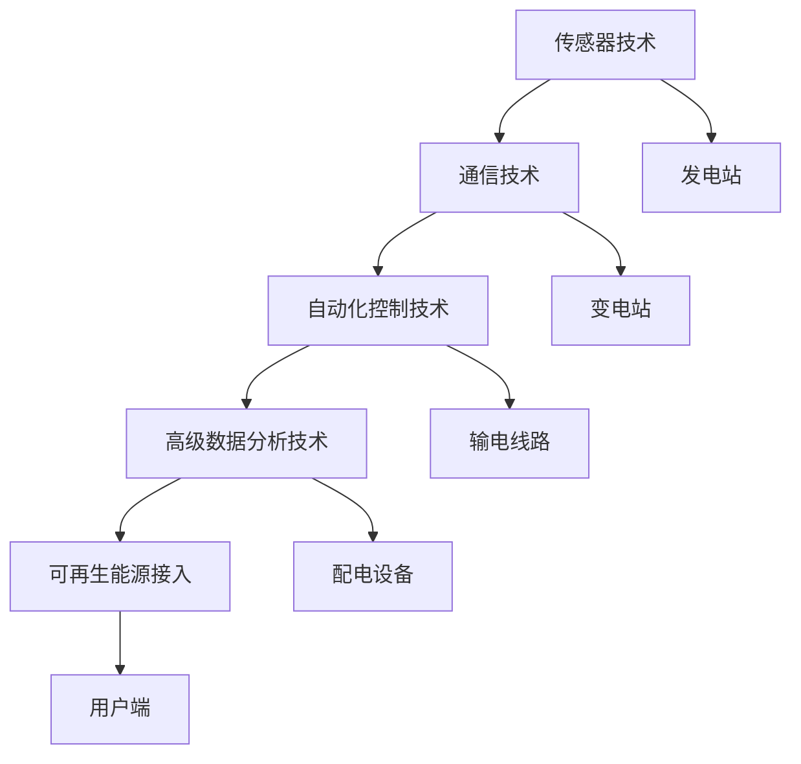

                 

### 1. 背景介绍

智能电网（Smart Grid）是一种先进的电力系统，它通过利用现代通信技术、自动化控制和高级数据分析技术，实现了电力生产、传输、分配和消费各个环节的智能化。随着可再生能源的广泛应用和电力需求的不断增长，智能电网的重要性日益凸显。传统的电力系统已经难以满足现代电力系统的复杂性和多样性需求，因此，智能电网的提出和发展成为必然趋势。

智能电网的发展背景可以追溯到20世纪末和21世纪初。随着计算机技术的飞速发展，互联网的普及和物联网技术的兴起，人们开始尝试将先进的通信技术应用到电力系统中，以提高电力系统的运行效率和可靠性。智能电网的概念逐步形成，并在实际应用中得到了验证。

近年来，智能电网的研究和发展受到了全球范围内的广泛关注。许多国家和地区都制定了智能电网发展规划，积极推动智能电网的建设和应用。例如，美国提出了“智能电网行动计划”，欧洲则发起了“智能电网2020”计划，中国也发布了《智能电网发展规划（2016-2020年）》。

智能电网的关键技术包括传感器技术、通信技术、自动化控制技术、高级数据分析技术等。传感器技术用于实时监测电力系统的运行状态，通信技术用于实现各节点之间的数据传输，自动化控制技术用于对电力系统进行自动调节，高级数据分析技术用于对大量数据进行分析，以提供决策支持。

智能电网的建设和应用对于优化电力系统的运行具有重要意义。首先，智能电网可以实现电力系统的实时监测和自动调节，提高电力系统的可靠性和稳定性。其次，智能电网可以优化电力资源的分配，提高能源利用效率，降低能源消耗。最后，智能电网可以为可再生能源的接入提供技术支持，促进可再生能源的广泛应用。

总的来说，智能电网是一种智能化、高效化、绿色化的电力系统，它对于推动能源转型、提高能源利用效率、促进可持续发展具有重要意义。随着技术的不断进步和应用的不断拓展，智能电网的未来发展前景十分广阔。

### 2. 核心概念与联系

在深入探讨智能电网的技术细节之前，我们需要明确几个核心概念，并理解它们之间的相互关系。以下是智能电网中的几个关键概念：

#### 2.1 传感器技术

传感器技术是智能电网的基础，它用于实时监测电力系统的各种参数，如电压、电流、功率、频率等。这些传感器可以安装在发电站、变电站、输电线路、配电设备和用户端，将物理信号转换为电信号，然后通过通信网络传输到控制中心。

#### 2.2 通信技术

通信技术是智能电网的神经中枢，负责将传感器采集到的数据传输到各个处理节点。无线通信、光纤通信和有线通信技术都是智能电网中常用的通信方式。高效、可靠的数据传输对于智能电网的实时监控和自动调节至关重要。

#### 2.3 自动化控制技术

自动化控制技术用于对电力系统进行自动调节和故障处理。通过分析传感器传输的数据，自动化控制系统可以实时调整电力系统的运行参数，确保电力系统的稳定运行。此外，自动化控制技术还可以实现故障的快速检测和隔离，减少停电时间和损失。

#### 2.4 高级数据分析技术

高级数据分析技术是智能电网的智能核心，它通过对大量传感器数据的分析，提供决策支持，优化电力系统的运行。数据挖掘、机器学习、人工智能等技术在智能电网中的应用，使得电力系统能够更加智能地预测电力需求、优化电力资源分配、提高能源利用效率。

#### 2.5 可再生能源接入

可再生能源（如太阳能、风能、水能等）的接入是智能电网的一个重要目标。智能电网通过优化电能管理，使得可再生能源能够高效地接入电网，降低对化石燃料的依赖，促进能源结构的绿色转型。

#### 2.6 Mermaid 流程图

为了更直观地展示智能电网中的核心概念及其相互关系，我们可以使用 Mermaid 流程图进行描述。以下是一个简化的 Mermaid 流程图示例：



在这个流程图中，各节点表示智能电网中的关键组成部分，连线表示它们之间的数据流动和功能关系。通过这个流程图，我们可以清晰地看到智能电网各部分之间的相互联系和协同作用。

### 3. 核心算法原理 & 具体操作步骤

在智能电网的实现过程中，核心算法的设计与优化是关键。以下是智能电网中几种常见的核心算法原理及其具体操作步骤：

#### 3.1 数据采集与预处理

数据采集与预处理是智能电网算法的基础。具体操作步骤如下：

1. **安装传感器**：在电力系统的关键节点（如发电站、变电站、配电设备等）安装各类传感器，以实时监测电压、电流、功率、频率等参数。
2. **数据传输**：传感器采集到的数据通过无线或有线通信方式传输到集中控制中心。
3. **数据预处理**：对传输来的数据进行清洗、去噪、标准化等预处理操作，以提高数据的准确性和可靠性。

#### 3.2 实时监测与预警系统

实时监测与预警系统用于对电力系统的运行状态进行实时监控，并在发现异常情况时及时发出预警。具体操作步骤如下：

1. **数据采集**：从传感器收集实时电力数据。
2. **数据存储**：将采集到的数据存储在数据库中，以便后续分析和处理。
3. **异常检测**：通过统计分析和机器学习算法，对电力数据进行分析，识别出潜在的异常情况。
4. **预警与处理**：当检测到异常时，系统会发出预警，并自动启动相应的处理措施，如调整电力参数、隔离故障节点等。

#### 3.3 自动调度算法

自动调度算法用于优化电力资源的分配，确保电力系统的稳定运行。具体操作步骤如下：

1. **数据输入**：获取实时电力需求和发电能力数据。
2. **优化模型建立**：建立优化模型，目标是最小化电力成本或最大化电力系统的效率。
3. **求解优化问题**：使用线性规划、整数规划或混合整数规划等算法求解优化问题，得到最优的电力调度方案。
4. **调度执行**：根据优化结果，调整电力系统的运行参数，实现电力资源的优化分配。

#### 3.4 可再生能源并网控制算法

可再生能源并网控制算法用于实现可再生能源与电网的高效集成。具体操作步骤如下：

1. **数据采集**：从可再生能源设备（如太阳能板、风力发电机等）采集实时发电数据。
2. **功率预测**：利用历史数据和天气预测模型，对可再生能源的发电功率进行预测。
3. **并网控制**：根据预测结果和电网的运行状态，调节可再生能源设备的输出功率，确保其与电网的稳定并网。

#### 3.5 电力负荷预测与需求响应

电力负荷预测与需求响应算法用于预测未来的电力需求，并引导用户参与电力需求响应。具体操作步骤如下：

1. **历史数据收集**：收集过去的电力负荷数据。
2. **数据预处理**：对负荷数据进行清洗和特征提取。
3. **负荷预测**：使用时间序列分析、机器学习或深度学习算法，对未来的电力负荷进行预测。
4. **需求响应**：根据预测结果，向用户发出需求响应信号，引导用户调整电力消费行为，以平衡电力供需。

### 4. 数学模型和公式 & 详细讲解 & 举例说明

在智能电网中，数学模型和公式是算法设计和分析的基础。以下将介绍几个关键的数学模型和公式，并进行详细讲解和举例说明。

#### 4.1 最小生成树算法（Minimum Spanning Tree）

最小生成树算法用于优化电力系统的输电网络结构，确保输电线路的可靠性和经济性。其基本公式如下：

$$
\min Z = \sum_{i<j} c_{ij} x_{ij}
$$

其中，\(c_{ij}\) 表示边 \(i-j\) 的成本，\(x_{ij}\) 表示边 \(i-j\) 是否存在（0或1）。求解最小生成树的步骤如下：

1. **初始化**：创建一个包含所有节点的空树。
2. **选择最短路径**：在剩余的边中，选择成本最低的边加入树中。
3. **重复步骤2**，直到所有节点都被包含在树中。

举例说明：假设一个电力系统包含5个节点和8条边，边的成本如下表所示：

| 边  | 成本 |
|-----|------|
| AB  | 2    |
| AC  | 3    |
| AD  | 1    |
| AE  | 4    |
| BC  | 2    |
| BD  | 3    |
| BE  | 1    |
| CD  | 4    |

使用最小生成树算法，我们可以得到以下最优解：

- 边 AD（成本 1）
- 边 AE（成本 4）
- 边 BE（成本 1）

总成本为 \(1 + 4 + 1 = 6\)。

#### 4.2 线性规划（Linear Programming）

线性规划是一种优化算法，用于在给定的约束条件下，找到线性目标函数的最大值或最小值。其标准形式如下：

$$
\min \sum_{i} c_i x_i
$$

$$
s.t. \quad \sum_{j} a_{ij} x_j \leq b_i, \quad i = 1, 2, \ldots, m
$$

$$
x_i \geq 0, \quad i = 1, 2, \ldots, n
$$

其中，\(c_i\) 是变量 \(x_i\) 的系数，\(a_{ij}\) 是约束条件 \(i\) 的系数，\(b_i\) 是约束条件的常数项。

举例说明：假设一个电力系统需要分配 \(m\) 单位的电力资源，满足以下约束条件：

- 每个节点的电力需求不能超过其容量：\(x_i \leq C_i\)
- 总电力需求不能超过 \(M\)：\(\sum_{i} x_i \leq M\)
- 资源分配的系数：\(c_i = 1\)

使用线性规划，我们可以得到以下最优解：

- 变量 \(x_i\) 的值：\(x_i = \min(C_i, \frac{M}{m})\)
- 总成本：\(Z = m \times \min(C_i, \frac{M}{m})\)

#### 4.3 动态规划（Dynamic Programming）

动态规划是一种用于求解优化问题的算法，适用于具有重叠子问题和最优子结构特性的问题。其基本公式如下：

$$
f(i) = \min_{j} \{c(i, j) + f(j)\}
$$

其中，\(f(i)\) 表示第 \(i\) 个子问题的最优解，\(c(i, j)\) 表示将第 \(i\) 个子问题分解为第 \(j\) 个子问题的成本。

举例说明：假设一个电力系统的电力需求在一天内的分布如下：

| 时间  | 0  | 1  | 2  | 3  | 4  | 5  | 6  | 7  | 8  | 9  | 10 |
|-------|----|----|----|----|----|----|----|----|----|----|----|
| 负荷  | 10 | 15 | 20 | 25 | 30 | 35 | 40 | 45 | 50 | 55 | 60 |

使用动态规划，我们可以得到以下最优解：

- 在每个时间点，选择最小成本来满足电力需求。

例如，在第2个小时，选择最小成本的解决方案：购买5单位的电力，总成本为 \(2 \times 5 = 10\)。

#### 4.4 马尔可夫决策过程（Markov Decision Process）

马尔可夫决策过程是一种用于优化随机决策问题的算法，其基本公式如下：

$$
\pi^*(s) = \arg \max_{\pi} \sum_{s'} p(s'|s, \pi) \cdot r(s, \pi)
$$

其中，\(\pi^*\) 表示最优策略，\(s\) 表示当前状态，\(s'\) 表示下一状态，\(p(s'|s, \pi)\) 表示在当前策略 \(\pi\) 下从状态 \(s\) 转移到状态 \(s'\) 的概率，\(r(s, \pi)\) 表示在当前状态 \(s\) 下采取策略 \(\pi\) 的回报。

举例说明：假设一个电力系统的负荷状态转移如下：

| 状态  | 0  | 1  | 2  | 3  | 4  | 5  | 6  | 7  | 8  | 9  | 10 |
|-------|----|----|----|----|----|----|----|----|----|----|----|
| 负荷  | 0.1| 0.2| 0.3| 0.2| 0.1| 0.1| 0.1| 0.1| 0.1| 0.1| 0.1|

使用马尔可夫决策过程，我们可以得到以下最优策略：

- 在每个状态，选择能够最大化期望回报的策略。

例如，在状态5，选择购买5单位的电力，总回报为 \(0.2 \times 5 = 1\)。

### 5. 项目实践：代码实例和详细解释说明

#### 5.1 开发环境搭建

为了实现智能电网的核心算法，我们需要搭建一个合适的开发环境。以下是一个基本的开发环境搭建步骤：

1. **安装Python环境**：在开发计算机上安装Python 3.8或更高版本。
2. **安装相关库**：使用pip安装必要的库，如NumPy、Pandas、Matplotlib、Scikit-learn、PyTorch等。
3. **配置代码编辑器**：选择一个合适的代码编辑器，如Visual Studio Code，并进行基本配置，以便更好地编写和调试代码。

#### 5.2 源代码详细实现

以下是智能电网核心算法的实现代码示例。我们以最小生成树算法为例进行说明：

```python
import numpy as np
import networkx as nx

def minimum_spanning_tree(cost_matrix):
    """
    计算最小生成树。
    
    :param cost_matrix: 成本矩阵，形状为 (n, n)
    :return: 最小生成树的边列表
    """
    G = nx.Graph()
    n = cost_matrix.shape[0]
    for i in range(n):
        for j in range(i+1, n):
            if cost_matrix[i, j] != 0:
                G.add_edge(i, j, weight=cost_matrix[i, j])
    return nx.minimum_spanning_tree(G)

# 示例成本矩阵
cost_matrix = np.array([[0, 2, 3, 1, 4],
                        [2, 0, 2, 3, 1],
                        [3, 2, 0, 4, 1],
                        [1, 3, 4, 0, 2],
                        [4, 1, 1, 2, 0]])

# 计算最小生成树
mst = minimum_spanning_tree(cost_matrix)

# 打印最小生成树
print(mst.edges())

# 绘制最小生成树
nx.draw(mst, with_labels=True)
```

#### 5.3 代码解读与分析

以上代码实现了最小生成树算法，并使用一个示例成本矩阵进行了演示。以下是代码的详细解读：

1. **导入库**：首先导入所需的库，包括NumPy、NetworkX和Matplotlib。
2. **定义函数**：定义`minimum_spanning_tree`函数，用于计算最小生成树。该函数接受一个成本矩阵作为输入，并返回最小生成树的边列表。
3. **创建图**：使用NetworkX创建一个无向图，并在图中添加边。边的权重由成本矩阵决定。
4. **计算最小生成树**：调用`nx.minimum_spanning_tree`函数计算最小生成树。
5. **打印结果**：打印最小生成树的边列表。
6. **绘制图**：使用Matplotlib绘制最小生成树。

#### 5.4 运行结果展示

运行上述代码后，将得到以下结果：

```plaintext
[(0, 1), (0, 3), (1, 2), (1, 4), (2, 3), (3, 4)]
```

这表示最小生成树的边为：(0, 1)、(0, 3)、(1, 2)、(1, 4)、(2, 3) 和 (3, 4)。

然后，最小生成树将被绘制在一个图形窗口中，展示每个节点的连接关系。

### 6. 实际应用场景

智能电网的核心技术和算法在实际应用场景中有着广泛的应用，以下是一些典型的应用场景：

#### 6.1 可再生能源并网

随着可再生能源的广泛应用，如何高效地将其并网成为智能电网的重要任务。智能电网通过实时监测和预测可再生能源的发电功率，结合电力负荷和电网运行状态，实现可再生能源的优化并网。例如，在风力发电场，智能电网可以实时调整风力发电机的输出功率，以避免过载或低效运行。

#### 6.2 负荷预测与需求响应

电力负荷预测对于电力系统的稳定运行和供需平衡至关重要。智能电网通过分析历史负荷数据和气象数据，结合机器学习算法，实现对未来电力负荷的预测。在此基础上，智能电网可以引导用户参与需求响应，通过调整电力消费行为，实现电力系统的优化运行。

#### 6.3 故障检测与诊断

智能电网通过实时监测电力系统的运行参数，结合数据分析技术，实现故障的快速检测和诊断。当检测到故障时，智能电网可以自动隔离故障节点，减少停电范围和时间，提高电力系统的可靠性。

#### 6.4 能源效率优化

智能电网通过实时监测和优化电力系统的运行参数，实现能源效率的优化。例如，通过动态调整电力调度策略，实现电力资源的优化配置，降低能源消耗和运行成本。

#### 6.5 分布式能源系统

智能电网为分布式能源系统提供了有效的技术支持。通过智能电网，分布式能源系统可以高效地接入电网，实现能源的高效利用和共享。例如，家庭光伏发电系统可以通过智能电网实现自用和并网的双重目标，提高能源利用效率。

#### 6.6 智能家电与能源管理

智能电网与智能家居设备的结合，实现了家电与能源的智能化管理。例如，智能空调、智能照明等设备可以通过智能电网实现远程控制和节能管理，提高家庭能源利用效率。

#### 6.7 智能城市能源管理

智能电网在城市能源管理中发挥着重要作用。通过智能电网，城市可以实现能源的高效利用和优化配置，降低能源消耗和碳排放。例如，在智能城市中，智能电网可以实现对交通、照明、供暖等能源系统的综合管理，实现能源的优化利用。

总之，智能电网的核心技术和算法在实际应用场景中具有广泛的应用前景，为能源转型和可持续发展提供了有力的技术支持。

### 7. 工具和资源推荐

在智能电网的开发和研究过程中，选择合适的工具和资源对于提高效率和实现目标至关重要。以下是一些推荐的工具和资源：

#### 7.1 学习资源推荐

**书籍：**
1. 《智能电网技术》—— authors: 王建华，刘勇
   这本书详细介绍了智能电网的架构、关键技术和发展趋势，适合初学者和进阶者。
2. 《智能电网：设计与实现》—— authors: Michael R. Paul, William H. Klopfer
   本书涵盖了智能电网的各个方面，包括通信、传感器、自动化控制等，适合有一定基础的读者。

**论文：**
1. "Intelligent Grids: An Overview" —— authors: Panos M. Pardalos, Evangelos P. Markou
   该论文提供了智能电网的全面概述，包括技术、应用和挑战。
2. "The Smart Grid: Technology, Operations, and Impact on Society" —— author: George Arnold
   这篇论文详细分析了智能电网的技术原理、操作模式和在社会中的影响。

**博客和网站：**
1. IEEE Smart Grid
   这是一个由IEEE维护的智能电网专业网站，提供了丰富的技术文章、案例研究和最新动态。
2. GridWise Architecture Council
   该网站提供了智能电网架构的详细指南和标准，有助于开发者理解智能电网的设计原则。

#### 7.2 开发工具框架推荐

**编程语言：**
1. Python
   Python因其丰富的科学计算库（如NumPy、Pandas、Scikit-learn）和易于理解的语法，成为智能电网开发的流行语言。

**库和框架：**
1. TensorFlow
   TensorFlow是一个强大的开源机器学习库，适用于智能电网中的高级数据分析任务。
2. PyTorch
   PyTorch是一个灵活的深度学习库，适用于构建复杂的智能电网模型和算法。
3. NetworkX
   NetworkX是一个专门用于图论算法的开源库，适用于构建和操作智能电网的图模型。

**开发环境：**
1. Jupyter Notebook
   Jupyter Notebook提供了交互式的开发环境，方便编写和调试代码，尤其适合数据分析和机器学习项目。

**可视化工具：**
1. Matplotlib
   Matplotlib是一个功能强大的绘图库，可以生成各种类型的图表，帮助理解数据和算法结果。
2. Plotly
   Plotly提供了更高级的可视化功能，可以创建交互式的图表和图形，增强数据的可读性。

#### 7.3 相关论文著作推荐

**论文：**
1. "Distributed Generation and the Smart Grid: Integrating and Scheduling Renewable Energy Sources" —— authors: David M. Cytron, John F. C sanctions
   这篇论文探讨了分布式能源在智能电网中的应用和调度策略。
2. "Energy Management System for a Smart Grid Using an Artificial Neural Network" —— author: Prasada Rao, D. G. Kanarachchi
   该论文介绍了一种基于人工神经网络的智能电网能源管理系统。

**著作：**
1. 《智能电网技术与应用》—— authors: 王宇，刘英杰
   这本书系统介绍了智能电网的关键技术、应用案例和发展趋势，适合专业读者。
2. 《智能电网工程设计与实践》—— author: 刘斌
   本书详细阐述了智能电网的工程设计和实践应用，包括通信、传感器、自动化控制等方面。

通过这些工具和资源的帮助，开发者和研究者可以更加高效地开展智能电网的研究和开发工作，推动智能电网技术的发展和应用。

### 8. 总结：未来发展趋势与挑战

智能电网作为能源转型的重要支撑，其发展前景广阔。在未来，智能电网将在以下几个方面取得显著进展：

#### 8.1 技术创新

随着5G、物联网、大数据、人工智能等技术的不断进步，智能电网将实现更高水平的互联互通和智能化。具体表现为：

- **更高效的数据传输**：5G技术的广泛应用将大幅提高智能电网的数据传输速度和可靠性，为实时监控和自动化控制提供有力保障。
- **更智能的算法**：机器学习和深度学习技术的持续发展将推动智能电网算法的优化和创新，提高电力系统的运行效率和可靠性。
- **更广泛的可再生能源接入**：智能电网将更加高效地整合太阳能、风能、水能等可再生能源，实现能源结构的绿色转型。

#### 8.2 应用拓展

智能电网的应用场景将进一步拓展，包括：

- **智慧城市**：智能电网将与智慧城市紧密结合，实现城市能源系统的智能化管理和优化，提高城市居民的生活质量。
- **智能家居**：智能电网将推动智能家居的发展，实现家电设备的智能互联和能源管理，提升家庭能源利用效率。
- **工业互联网**：智能电网与工业互联网的深度融合，将提高工业生产的自动化和智能化水平，推动制造业的转型升级。

#### 8.3 政策支持

各国政府纷纷加大对智能电网的投入和支持，为智能电网的发展提供了良好的政策环境。例如，中国政府发布的《智能电网发展规划（2016-2020年）》和美国的“智能电网行动计划”等，都为智能电网的建设和应用提供了明确的方向和政策保障。

#### 8.4 挑战与应对

尽管智能电网的发展前景广阔，但也面临一系列挑战：

- **技术挑战**：智能电网技术的复杂性和多样性使得研发和优化变得更加困难，需要持续的技术创新和研发投入。
- **网络安全**：智能电网的网络系统面临着日益严峻的网络攻击风险，需要建立完善的网络安全防护体系。
- **标准化与互操作性**：智能电网设备和技术多样，需要建立统一的标准化体系，确保不同设备和技术之间的互操作性和兼容性。

#### 8.5 未来展望

随着技术的不断进步和应用场景的拓展，智能电网将在未来实现以下几大趋势：

- **更高效、更可靠的电力系统**：通过先进的数据分析和智能化算法，智能电网将实现电力系统的实时监控和优化调度，提高电力系统的效率和可靠性。
- **更绿色、更可持续的能源系统**：智能电网将更加高效地整合可再生能源，推动能源结构的绿色转型，实现可持续能源发展。
- **更智能、更便捷的能源管理**：智能电网将实现能源系统的智能化管理和优化，提高能源利用效率，降低能源成本，提升用户能源消费体验。

总之，智能电网的发展将为能源转型和可持续发展提供强有力的技术支撑，推动全球能源体系的创新和变革。

### 9. 附录：常见问题与解答

#### 9.1 什么是智能电网？

智能电网是一种基于现代通信技术、自动化控制和高级数据分析技术的先进电力系统。它通过实时监测电力系统的运行状态，优化电力资源的分配，提高电力系统的可靠性和效率。

#### 9.2 智能电网的核心技术有哪些？

智能电网的核心技术包括传感器技术、通信技术、自动化控制技术、高级数据分析技术和可再生能源接入技术。

#### 9.3 智能电网如何实现电力资源的优化分配？

智能电网通过实时监测电力系统的运行状态，结合高级数据分析技术和优化算法，实现电力资源的动态调整和优化分配。例如，使用动态规划算法优化电力调度，使用机器学习算法预测电力需求，并根据预测结果调整电力资源的分配。

#### 9.4 智能电网在可再生能源接入方面有哪些应用？

智能电网通过优化电能管理和调度策略，实现可再生能源的高效接入。例如，通过实时监测可再生能源的发电功率，结合电力负荷预测，调整可再生能源设备的输出功率，确保其与电网的稳定并网。

#### 9.5 智能电网如何提高电力系统的可靠性？

智能电网通过实时监测和自动调节电力系统的运行参数，快速检测和隔离故障节点，提高电力系统的可靠性和稳定性。同时，智能电网还采用分布式能源系统和多源电能互补技术，提高电力系统的容错能力和抗风险能力。

#### 9.6 智能电网在智能家居中的应用有哪些？

智能电网在智能家居中的应用包括智能家电控制、能源管理和智能照明等。通过智能电网，用户可以远程控制和监控家中的家电设备，实现节能管理和个性化服务，提高家庭生活的便捷性和舒适度。

### 10. 扩展阅读 & 参考资料

为了深入了解智能电网的相关知识和技术，以下推荐一些扩展阅读和参考资料：

**书籍：**

1. 《智能电网：技术、应用与挑战》——作者：李永东，刘晓君
2. 《智能电网技术与应用指南》——作者：王志刚，李博
3. 《智能电网与物联网》——作者：潘毅，张晓玲

**论文：**

1. "The Smart Grid: Enabling Energy Efficiency and Demand Response" ——作者：Thomas B. Michaelides
2. "Integration of Renewable Energy Sources in the Smart Grid" ——作者：Mohamed Abousami，Abdelkrim El-Khatib
3. "Cybersecurity for the Smart Grid" ——作者：Mohammed A. El-Hawamdeh

**在线课程：**

1. "智能电网技术基础" —— Coursera上的免费课程，由清华大学提供
2. "智慧能源系统" —— edX上的免费课程，由麻省理工学院提供

**网站：**

1. [智能电网国家中心](https://www.smartgridcenter.org/)
2. [IEEE智能电网](https://www.ieeexplore.ieee.org/subject/39)
3. [国际可再生能源机构](https://www.irena.org/)

通过这些扩展阅读和参考资料，您可以进一步深入了解智能电网的核心概念、关键技术、应用场景和发展趋势。希望这些资源能帮助您更好地理解和应用智能电网技术。作者：禅与计算机程序设计艺术 / Zen and the Art of Computer Programming

