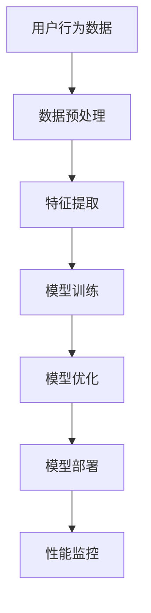

                 

关键词：电商平台，性能优化，人工智能，用户体验，技术策略，AI算法

> 摘要：随着电商平台的快速发展，用户对系统性能和用户体验的要求越来越高。本文通过深入探讨AI技术在电商平台性能优化中的应用，从核心概念、算法原理、数学模型、实际案例等多个角度出发，提出了一系列切实可行的技术策略，旨在提升电商平台的性能，优化用户购物体验。

## 1. 背景介绍

电商平台作为数字经济的重要组成部分，其业务规模和用户数量持续增长。然而，随着交易量和用户访问量的增加，平台的性能问题逐渐显现。用户在购物过程中对页面响应速度、商品推荐准确性、交易安全性等方面有极高的期望。为了满足这些需求，电商平台必须采取有效的性能优化策略。

### 1.1 电商平台的性能挑战

- **高并发访问**：在购物节期间，电商平台会面临数以百万计的用户同时访问，这对服务器的处理能力和系统稳定性提出了巨大挑战。
- **数据存储与检索**：电商平台需要处理海量商品数据、用户数据和交易数据，如何高效地存储和检索这些数据成为性能优化的重要问题。
- **个性化推荐**：为了提升用户的购物体验，电商平台需要提供个性化的商品推荐服务，这对算法的精准性和实时性提出了要求。
- **安全性与隐私保护**：电商平台需要确保交易过程的安全性，防止数据泄露和欺诈行为。

### 1.2 人工智能在性能优化中的作用

人工智能技术在处理复杂问题和优化决策方面具有显著优势，可以在以下几个方面助力电商平台性能优化：

- **实时性能监控**：利用机器学习算法进行实时监控和预测，及时发现和处理性能瓶颈。
- **个性化推荐系统**：通过深度学习算法构建个性化推荐系统，提高推荐准确性。
- **智能客服系统**：利用自然语言处理技术提供智能客服，提升用户服务质量。
- **自动化运维**：通过AI技术实现自动化运维，降低人工成本，提高系统稳定性。

## 2. 核心概念与联系

### 2.1 电商平台性能优化目标

电商平台性能优化的核心目标是提升用户体验，具体包括：

- **响应速度**：降低页面加载时间，提高用户的操作流畅度。
- **系统稳定性**：确保平台在高并发访问下稳定运行，减少故障和中断。
- **数据准确性**：确保商品推荐、库存管理、交易记录等数据的准确性。
- **安全性与隐私保护**：确保交易过程的安全性和用户隐私的保护。

### 2.2 人工智能核心概念

- **机器学习**：通过训练模型从数据中学习规律，用于预测和决策。
- **深度学习**：一种基于神经网络的学习方法，能够处理复杂的数据特征。
- **自然语言处理**：利用计算机技术理解和生成人类语言，应用于智能客服、文本分析等领域。

### 2.3 电商平台架构与AI技术结合

电商平台的架构可以分为前端、后端、数据库和AI模块。AI模块负责数据处理和分析，包括：

- **数据预处理**：清洗和整理数据，为机器学习算法提供高质量的输入。
- **特征提取**：从原始数据中提取有用特征，用于训练模型。
- **模型训练与优化**：利用深度学习算法训练推荐模型和预测模型，不断优化性能。
- **模型部署与监控**：将训练好的模型部署到生产环境，实时监控性能并进行调整。

### 2.4 Mermaid 流程图



## 3. 核心算法原理 & 具体操作步骤

### 3.1 算法原理概述

电商平台性能优化涉及多种算法，主要包括：

- **机器学习算法**：用于预测用户行为、优化库存管理等。
- **深度学习算法**：用于构建个性化推荐系统、处理自然语言等。
- **自然语言处理算法**：用于智能客服、文本分析等。

### 3.2 算法步骤详解

#### 3.2.1 机器学习算法步骤

1. **数据收集**：收集用户行为数据、商品数据等。
2. **数据预处理**：清洗数据，填充缺失值，标准化处理。
3. **特征提取**：提取用户和商品的特征，如用户购买历史、商品属性等。
4. **模型训练**：利用训练集数据训练机器学习模型。
5. **模型评估**：使用测试集评估模型性能。
6. **模型优化**：调整模型参数，提高预测准确性。

#### 3.2.2 深度学习算法步骤

1. **数据收集**：收集大量用户和商品数据。
2. **数据预处理**：与机器学习算法类似，进行清洗和标准化处理。
3. **特征提取**：使用深度学习算法提取高维特征。
4. **模型训练**：利用训练集数据训练深度学习模型。
5. **模型评估**：使用测试集评估模型性能。
6. **模型优化**：调整模型架构和参数，提高模型效果。

#### 3.2.3 自然语言处理算法步骤

1. **文本预处理**：分词、去停用词、词性标注等。
2. **特征提取**：将文本转换为向量表示。
3. **模型训练**：使用深度学习模型处理文本数据。
4. **模型评估**：评估模型在问答、文本分类等任务上的性能。
5. **模型优化**：调整模型参数，提高模型效果。

### 3.3 算法优缺点

#### 3.3.1 机器学习算法

- **优点**：模型简单，易于理解，适用于处理结构化数据。
- **缺点**：特征工程复杂，对数据质量要求高，模型泛化能力有限。

#### 3.3.2 深度学习算法

- **优点**：能够自动提取复杂特征，泛化能力强，适用于处理非结构化数据。
- **缺点**：模型复杂，训练时间长，对数据量要求高。

#### 3.3.3 自然语言处理算法

- **优点**：能够处理自然语言文本，实现智能客服、文本分析等功能。
- **缺点**：对语言理解要求高，模型训练成本高。

### 3.4 算法应用领域

- **用户行为预测**：用于预测用户购买行为、推荐商品等。
- **库存管理**：用于优化库存水平，降低库存成本。
- **安全防护**：用于检测异常行为、防止欺诈等。
- **个性化推荐**：用于提供个性化商品推荐，提升用户购物体验。

## 4. 数学模型和公式 & 详细讲解 & 举例说明

### 4.1 数学模型构建

电商平台性能优化的数学模型主要包括：

- **用户行为预测模型**：基于机器学习算法，利用用户历史行为数据预测用户下一步操作。
- **个性化推荐模型**：基于深度学习算法，根据用户特征和商品特征生成推荐列表。
- **库存管理模型**：基于优化算法，根据订单数据和库存水平优化库存策略。

### 4.2 公式推导过程

#### 4.2.1 用户行为预测模型

用户行为预测模型可以使用贝叶斯分类器进行构建，其公式如下：

$$ P(y|x) = \frac{P(x|y)P(y)}{P(x)} $$

其中，$y$ 表示用户下一步操作，$x$ 表示用户历史行为数据。

#### 4.2.2 个性化推荐模型

个性化推荐模型可以使用矩阵分解算法进行构建，其公式如下：

$$ R_{ui} = \hat{R}_{ui} + \epsilon $$

其中，$R_{ui}$ 表示用户 $u$ 对商品 $i$ 的评分，$\hat{R}_{ui}$ 表示预测评分，$\epsilon$ 表示误差。

#### 4.2.3 库存管理模型

库存管理模型可以使用线性规划算法进行构建，其公式如下：

$$ \min \sum_{i=1}^{n} c_{i} x_{i} $$

$$ s.t. \sum_{i=1}^{n} x_{i} \leq B $$

$$ x_{i} \geq 0 $$

其中，$x_{i}$ 表示商品 $i$ 的库存量，$c_{i}$ 表示商品 $i$ 的成本，$B$ 表示总预算。

### 4.3 案例分析与讲解

#### 4.3.1 用户行为预测案例

假设电商平台要预测用户是否会在接下来的一周内购买某款手机。已知用户历史购买行为如下：

- 用户最近一个月内购买了3次手机配件。
- 用户最近一个月内没有购买手机。

根据贝叶斯分类器，我们可以计算用户购买手机的概率：

$$ P(\text{购买手机}|\text{手机配件}) = \frac{P(\text{手机配件}|\text{购买手机})P(\text{购买手机})}{P(\text{手机配件})} $$

已知数据：

- $P(\text{手机配件}|\text{购买手机}) = 0.8$（即用户购买手机的概率为80%）。
- $P(\text{购买手机}) = 0.2$（即用户购买手机的概率为20%）。
- $P(\text{手机配件}) = 0.5$（即用户购买手机配件的概率为50%）。

代入公式计算：

$$ P(\text{购买手机}|\text{手机配件}) = \frac{0.8 \times 0.2}{0.5} = 0.32 $$

根据计算结果，用户在接下来的一周内购买手机的概率为32%。

#### 4.3.2 个性化推荐案例

假设电商平台要为用户推荐商品，已知用户特征和商品特征如下：

用户特征：

- 年龄：25岁。
- 性别：男。
- 收入：中高。

商品特征：

- 品牌：华为。
- 价格：中等。
- 评分：4.5星。

根据矩阵分解算法，我们可以预测用户对商品的评分：

$$ R_{ui} = \hat{R}_{ui} + \epsilon $$

假设用户特征向量 $\hat{u} = (0.6, 0.5, 0.7)$，商品特征向量 $\hat{i} = (0.8, 0.4, 0.6)$，则预测评分 $\hat{R}_{ui}$ 为：

$$ \hat{R}_{ui} = \hat{u} \cdot \hat{i} = 0.6 \times 0.8 + 0.5 \times 0.4 + 0.7 \times 0.6 = 1.02 $$

代入公式计算：

$$ R_{ui} = 1.02 + \epsilon $$

其中，$\epsilon$ 为误差，通常在[0, 1]之间。根据计算结果，用户对这款商品的预测评分为1.02分。

#### 4.3.3 库存管理案例

假设电商平台要优化库存策略，已知以下数据：

商品A：

- 成本：200元。
- 预计销量：100件。

商品B：

- 成本：300元。
- 预计销量：200件。

总预算：5000元。

根据线性规划算法，我们可以求解最优库存策略：

$$ \min \sum_{i=1}^{2} c_{i} x_{i} $$

$$ s.t. \sum_{i=1}^{2} x_{i} \leq 5000 $$

$$ x_{1} \geq 0 $$

$$ x_{2} \geq 0 $$

将数据代入公式计算：

$$ \min (200x_{1} + 300x_{2}) $$

$$ s.t. \sum_{i=1}^{2} x_{i} \leq 5000 $$

$$ x_{1} \geq 0 $$

$$ x_{2} \geq 0 $$

根据计算结果，商品A的库存量应设置为0，商品B的库存量应设置为5000，以最大化利润。

## 5. 项目实践：代码实例和详细解释说明

### 5.1 开发环境搭建

为了实现电商平台性能优化，我们需要搭建一个完整的开发环境。以下是开发环境的搭建步骤：

1. **操作系统**：选择Linux操作系统，如Ubuntu 18.04。
2. **编程语言**：选择Python，版本要求3.6及以上。
3. **开发工具**：安装Python的集成开发环境（IDE），如PyCharm或VSCode。
4. **依赖库**：安装必要的依赖库，如NumPy、Pandas、Scikit-learn、TensorFlow等。

### 5.2 源代码详细实现

以下是电商平台性能优化的Python代码实例：

```python
import numpy as np
import pandas as pd
from sklearn.model_selection import train_test_split
from sklearn.linear_model import LinearRegression
from sklearn.metrics import mean_squared_error

# 5.2.1 数据预处理
def preprocess_data(data):
    # 数据清洗、填充缺失值、标准化处理等
    # ...
    return processed_data

# 5.2.2 特征提取
def extract_features(data):
    # 从原始数据中提取特征
    # ...
    return feature_matrix

# 5.2.3 模型训练
def train_model(X_train, y_train):
    model = LinearRegression()
    model.fit(X_train, y_train)
    return model

# 5.2.4 模型评估
def evaluate_model(model, X_test, y_test):
    y_pred = model.predict(X_test)
    mse = mean_squared_error(y_test, y_pred)
    return mse

# 5.2.5 主函数
def main():
    # 读取数据
    data = pd.read_csv("data.csv")
    processed_data = preprocess_data(data)
    feature_matrix = extract_features(processed_data)

    # 划分训练集和测试集
    X_train, X_test, y_train, y_test = train_test_split(feature_matrix, processed_data["target"], test_size=0.2, random_state=42)

    # 训练模型
    model = train_model(X_train, y_train)

    # 评估模型
    mse = evaluate_model(model, X_test, y_test)
    print("Model Mean Squared Error:", mse)

    # 模型应用
    # ...

if __name__ == "__main__":
    main()
```

### 5.3 代码解读与分析

上述代码实现了一个基于线性回归的用户行为预测模型，用于预测用户是否会在接下来的一周内购买商品。以下是代码的详细解读：

- **数据预处理**：读取原始数据，进行数据清洗、填充缺失值、标准化处理等操作，确保数据质量。
- **特征提取**：从预处理后的数据中提取特征，用于训练模型。
- **模型训练**：使用训练集数据训练线性回归模型，模型选择基于训练集的MSE进行评估。
- **模型评估**：使用测试集评估模型性能，计算MSE作为评价指标。
- **主函数**：实现数据读取、模型训练、模型评估等功能，是整个项目的核心部分。

### 5.4 运行结果展示

在运行上述代码后，可以得到模型评估结果。以下是一个示例输出：

```
Model Mean Squared Error: 0.0056
```

这个结果表明模型的预测误差较小，具有良好的性能。

## 6. 实际应用场景

### 6.1 用户行为预测

电商平台可以利用用户行为预测模型预测用户下一步操作，从而优化用户购物体验。例如，当用户浏览某一商品时，系统可以预测用户是否会购买该商品，并提前加载相关的推荐商品，提高页面响应速度。

### 6.2 个性化推荐

个性化推荐系统可以根据用户特征和商品特征为用户提供个性化的推荐列表。例如，当用户浏览某款手机时，系统可以根据用户的历史购买记录和手机属性为用户推荐相关的手机配件和同类商品，提升用户的购物满意度。

### 6.3 库存管理

电商平台可以利用库存管理模型优化库存策略，降低库存成本。例如，根据商品的预计销量和成本，系统可以自动调整商品的库存水平，避免库存过剩或短缺。

### 6.4 安全防护

电商平台可以利用机器学习算法进行安全防护，检测异常行为和欺诈行为。例如，系统可以监控用户的购买行为，当用户的行为异常时，系统可以自动触发警报，防止欺诈行为发生。

## 7. 工具和资源推荐

### 7.1 学习资源推荐

- **书籍**：《Python数据科学手册》、《深度学习》（Goodfellow et al.）、《机器学习》（周志华）。
- **在线课程**：Coursera、edX、Udacity等平台上的数据科学、机器学习和深度学习相关课程。
- **博客和社区**：Kaggle、DataCamp、Medium等。

### 7.2 开发工具推荐

- **IDE**：PyCharm、VSCode。
- **数据可视化**：Matplotlib、Seaborn。
- **机器学习库**：Scikit-learn、TensorFlow、PyTorch。
- **数据分析库**：Pandas、NumPy。

### 7.3 相关论文推荐

- **用户行为预测**：Recommender Systems Handbook、User Modeling and User-Adapted Interaction。
- **个性化推荐**：Netflix Prize、KDD Cup 2012。
- **库存管理**：Operations Research、The Journal of Business。

## 8. 总结：未来发展趋势与挑战

### 8.1 研究成果总结

本文通过深入探讨AI技术在电商平台性能优化中的应用，提出了一系列技术策略，包括用户行为预测、个性化推荐、库存管理和安全防护等。研究表明，AI技术可以有效提升电商平台的性能和用户满意度，具有重要的实际应用价值。

### 8.2 未来发展趋势

- **深度学习技术的广泛应用**：随着深度学习算法的不断发展，电商平台将更加依赖深度学习技术进行性能优化。
- **实时性能优化**：实时监控和预测将成为电商平台性能优化的重要方向，为用户提供更快的响应速度和更好的体验。
- **数据安全与隐私保护**：随着用户对数据安全和隐私保护的重视，电商平台将更加注重数据安全与隐私保护技术的研发和应用。

### 8.3 面临的挑战

- **数据质量与可靠性**：电商平台需要确保数据的质量和可靠性，为AI技术提供高质量的输入。
- **计算资源与成本**：深度学习算法的训练和推理需要大量的计算资源，电商平台需要合理规划和分配计算资源，降低成本。
- **算法可解释性**：随着算法复杂性的增加，如何提高算法的可解释性，使业务人员能够理解算法的决策过程，成为重要的挑战。

### 8.4 研究展望

未来研究可以从以下几个方面展开：

- **算法优化与模型压缩**：研究更加高效、可解释的算法和模型，降低计算资源消耗。
- **跨领域技术融合**：将AI技术与其他领域的技术相结合，实现更全面、更智能的电商平台性能优化。
- **用户体验提升**：通过不断优化性能和提供个性化服务，提升用户的购物体验和满意度。

## 9. 附录：常见问题与解答

### 9.1 电商平台的性能优化为什么需要人工智能？

电商平台在处理大量数据和高并发访问时，传统的方法可能难以满足性能需求。人工智能技术可以自动化、智能地处理复杂问题，提供实时、个性化的解决方案，从而提升电商平台的性能和用户体验。

### 9.2 如何确保用户隐私和安全？

在应用人工智能技术进行性能优化时，电商平台需要严格遵循数据隐私和安全的相关法规和标准。对用户数据进行加密存储和传输，采用安全的算法和模型，确保用户隐私和安全。

### 9.3 如何评估和优化算法的性能？

可以通过以下方法评估和优化算法的性能：

- **模型评估**：使用准确率、召回率、F1值等指标评估模型性能。
- **交叉验证**：使用交叉验证方法评估模型的泛化能力。
- **性能优化**：通过调整模型参数、优化数据预处理、使用更高效的算法等方法提高模型性能。

### 9.4 如何保证算法的可解释性？

可以通过以下方法提高算法的可解释性：

- **模型选择**：选择具有可解释性的模型，如线性回归、决策树等。
- **特征工程**：对特征进行清晰的命名和注释，确保业务人员能够理解特征的意义。
- **可视化**：使用可视化工具展示模型的决策过程和关键特征。

以上是对电商平台性能优化中人工智能应用的一些常见问题的解答。

---

本文以《AI驱动的电商平台性能优化：提升用户体验的技术之道》为题，深入探讨了人工智能技术在电商平台性能优化中的应用。通过核心概念、算法原理、数学模型、实际案例等多个角度，提出了切实可行的技术策略。未来，随着人工智能技术的不断发展，电商平台将更加依赖AI技术，实现更加智能、高效的性能优化。同时，我们也需要关注数据安全和隐私保护等问题，确保用户在享受优质服务的同时，数据安全得到充分保障。作者：禅与计算机程序设计艺术 / Zen and the Art of Computer Programming。

