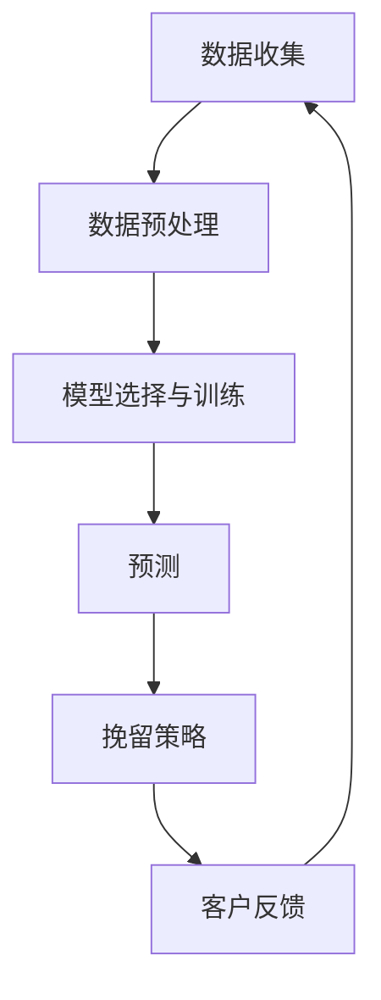

                 

### 1. 背景介绍

随着互联网技术的飞速发展和电子商务的兴起，市场竞争日益激烈，企业如何提高客户留存率成为了至关重要的课题。客户流失问题不仅关系到企业的利润和市场份额，更可能对企业的长期发展产生深远的影响。因此，如何通过有效的手段预测客户流失并采取相应的挽留措施，成为了企业亟需解决的难题。

在这个背景下，人工智能（AI）技术以其强大的数据分析和学习能力，成为了解决客户流失问题的有力工具。AI驱动的电商智能客户流失预警与精准挽留系统，正是利用了人工智能在数据处理、模式识别和预测分析等方面的优势，通过对海量客户数据的深度挖掘和分析，实现对客户流失的精准预测和有效挽留。

本篇文章旨在探讨如何构建一个基于AI的电商智能客户流失预警与精准挽留系统。首先，我们将介绍系统的核心概念和组成部分，包括数据收集、数据预处理、模型选择与训练、预测和挽留策略等。接着，我们将深入探讨系统中的关键算法原理，包括数据挖掘、机器学习、深度学习等技术。随后，我们将通过实际案例，详细解析系统的实现步骤和代码实例。最后，我们将探讨系统的实际应用场景，并总结未来的发展趋势与挑战。

通过本文的阅读，读者将能够全面了解AI驱动的电商智能客户流失预警与精准挽留系统的构建方法，掌握关键技术的应用技巧，并为实际项目提供有益的参考和借鉴。

### 2. 核心概念与联系

#### 2.1. 客户流失预警

客户流失预警是电商智能客户流失预警与精准挽留系统的核心功能之一。它通过分析客户的行为数据和购买历史，预测哪些客户有潜在流失的风险。客户流失预警不仅需要准确预测流失客户，还需要对流失的原因进行深入分析，以便企业采取有针对性的挽留措施。

#### 2.2. 精准挽留策略

精准挽留策略是基于客户流失预警结果，针对不同流失风险等级的客户，制定个性化的挽留措施。例如，对于高风险流失客户，可以采取紧急优惠、VIP服务等方式进行挽留；对于低风险流失客户，则可以通过定期发送促销信息、推荐商品等方式进行维系。

#### 2.3. 数据收集

数据收集是构建智能客户流失预警与精准挽留系统的第一步。它包括从电商平台、客户管理系统、社交媒体等多渠道收集客户行为数据、购买历史数据、客户反馈数据等。这些数据将用于后续的数据预处理和模型训练。

#### 2.4. 数据预处理

数据预处理是数据挖掘和分析的重要步骤，旨在提高数据质量，为模型训练提供准确的数据基础。数据预处理包括数据清洗、数据整合、特征工程等。通过数据预处理，我们可以从海量原始数据中提取出有价值的信息，为后续的模型训练提供支持。

#### 2.5. 模型选择与训练

模型选择与训练是智能客户流失预警与精准挽留系统的关键环节。常见的机器学习算法包括线性回归、决策树、支持向量机、随机森林、神经网络等。根据具体业务需求，选择合适的算法，并利用历史数据进行训练，可以提高模型的预测准确性和鲁棒性。

#### 2.6. 预测

预测是基于训练好的模型，对新的客户数据进行分析，判断其流失风险。预测结果可以为精准挽留策略提供依据，帮助企业提前采取措施，降低客户流失率。

#### 2.7. 挽留策略

挽留策略是根据预测结果，针对不同流失风险等级的客户，制定个性化的挽留措施。通过挽留策略的实施，企业可以降低客户流失率，提高客户满意度，从而提升企业的竞争力。

下面是一个简化的Mermaid流程图，展示了电商智能客户流失预警与精准挽留系统的基本架构：



在上述流程中，数据收集、数据预处理、模型选择与训练、预测和挽留策略等环节相互关联，形成了一个闭环系统。通过不断迭代和优化，企业可以不断提高客户流失预警的准确性和挽留策略的有效性。

### 3. 核心算法原理 & 具体操作步骤

在构建AI驱动的电商智能客户流失预警与精准挽留系统时，核心算法的选择和实现是关键。以下将详细探讨该系统中涉及的主要算法原理及其具体操作步骤。

#### 3.1. 数据挖掘算法

数据挖掘是系统的基础，通过分析海量客户数据，提取出有价值的信息。常用的数据挖掘算法包括关联规则挖掘、分类算法、聚类算法等。

- **关联规则挖掘**：用于发现客户购买行为之间的关联性，如“啤酒和尿布”的经典案例。算法步骤如下：
  1. 确定最小支持度和最小置信度阈值。
  2. 扫描数据集，计算每个项集的支持度。
  3. 生成频繁项集。
  4. 使用频繁项集生成关联规则。
- **分类算法**：用于预测客户流失的可能性，常见的分类算法有决策树、支持向量机（SVM）、随机森林等。以决策树为例，算法步骤如下：
  1. 计算每个特征的信息增益。
  2. 选择信息增益最高的特征作为分割依据。
  3. 根据分割结果递归地构建决策树。
- **聚类算法**：用于将具有相似行为的客户划分为不同的群体，常见的聚类算法有K-means、层次聚类等。以K-means为例，算法步骤如下：
  1. 随机初始化K个聚类中心。
  2. 计算每个客户与聚类中心的距离，并将其分配到最近的聚类中心。
  3. 根据新的聚类中心重新计算距离，直到聚类中心不再变化。

#### 3.2. 机器学习算法

机器学习算法用于训练模型，从而实现对客户流失的预测。常见的机器学习算法包括线性回归、逻辑回归、神经网络等。

- **线性回归**：用于预测客户流失的概率，算法步骤如下：
  1. 确定损失函数（如均方误差）。
  2. 通过梯度下降法或随机梯度下降法优化模型参数。
  3. 使用交叉验证法评估模型性能。
- **逻辑回归**：用于预测客户流失的概率，算法步骤如下：
  1. 确定损失函数（如对数似然函数）。
  2. 通过梯度下降法或随机梯度下降法优化模型参数。
  3. 使用交叉验证法评估模型性能。
- **神经网络**：用于构建复杂的非线性模型，算法步骤如下：
  1. 初始化模型参数。
  2. 使用反向传播算法更新模型参数。
  3. 通过梯度下降法优化模型参数。
  4. 使用交叉验证法评估模型性能。

#### 3.3. 深度学习算法

深度学习算法在构建复杂模型方面具有显著优势，常用于构建大规模客户流失预测模型。

- **卷积神经网络（CNN）**：用于处理高维数据，如客户的行为数据。算法步骤如下：
  1. 初始化模型参数。
  2. 使用卷积层提取特征。
  3. 使用池化层降低计算复杂度。
  4. 使用全连接层进行分类。
  5. 通过反向传播算法更新模型参数。
- **循环神经网络（RNN）**：用于处理序列数据，如客户的行为序列。算法步骤如下：
  1. 初始化模型参数。
  2. 使用循环层处理序列数据。
  3. 使用全连接层进行分类。
  4. 通过反向传播算法更新模型参数。
- **长短时记忆网络（LSTM）**：用于解决RNN中的梯度消失问题。算法步骤如下：
  1. 初始化模型参数。
  2. 使用LSTM层处理序列数据。
  3. 使用全连接层进行分类。
  4. 通过反向传播算法更新模型参数。

#### 3.4. 实际操作步骤

以下是构建AI驱动的电商智能客户流失预警与精准挽留系统的实际操作步骤：

1. **数据收集**：从电商平台、客户管理系统、社交媒体等多渠道收集客户行为数据、购买历史数据、客户反馈数据等。

2. **数据预处理**：进行数据清洗、数据整合、特征工程等操作，提取有价值的信息。

3. **模型选择**：根据业务需求选择合适的模型，如线性回归、逻辑回归、神经网络等。

4. **模型训练**：使用历史数据对模型进行训练，调整模型参数，优化模型性能。

5. **预测**：使用训练好的模型对新的客户数据进行预测，判断其流失风险。

6. **挽留策略**：根据预测结果，制定个性化的挽留措施，如发送优惠信息、提供VIP服务等。

7. **评估与优化**：定期评估系统的预测准确性和挽留效果，通过反馈机制进行持续优化。

通过以上步骤，企业可以构建一个高效、精准的AI驱动的电商智能客户流失预警与精准挽留系统，从而降低客户流失率，提升客户满意度，增强市场竞争力。

### 4. 数学模型和公式 & 详细讲解 & 举例说明

#### 4.1. 数据挖掘中的数学模型

在数据挖掘中，常用的数学模型包括关联规则挖掘中的支持度（Support）和置信度（Confidence）。

**支持度（Support）：**
\[ Support(A \cup B) = \frac{|D(A \cup B)|}{|D|} \]
其中，\( D \) 表示数据集，\( A \) 和 \( B \) 表示项集。支持度表示同时包含 \( A \) 和 \( B \) 的项集在数据集 \( D \) 中的比例。

**置信度（Confidence）：**
\[ Confidence(A \rightarrow B) = \frac{Support(A \cup B)}{Support(A)} \]
置信度表示在包含 \( A \) 的项集中，同时包含 \( B \) 的比例。它反映了 \( A \) 和 \( B \) 之间的关联强度。

**举例说明：**

假设数据集中有 1000 个客户，其中同时购买啤酒和尿布的客户有 200 个。则：

- 啤酒和尿布的支持度：\[ Support(啤酒 \cup 尿布) = \frac{200}{1000} = 0.2 \]
- 啤酒导致尿布购买的置信度：\[ Confidence(啤酒 \rightarrow 尿布) = \frac{0.2}{0.5} = 0.4 \]

#### 4.2. 机器学习中的数学模型

在机器学习模型中，常用的数学模型包括线性回归和逻辑回归。

**线性回归：**

线性回归模型的表达式为：
\[ y = \beta_0 + \beta_1x_1 + \beta_2x_2 + ... + \beta_nx_n \]
其中，\( y \) 是预测值，\( x_1, x_2, ..., x_n \) 是特征值，\( \beta_0, \beta_1, ..., \beta_n \) 是模型参数。线性回归的目标是找到最佳参数，使得预测值与实际值之间的误差最小。

**逻辑回归：**

逻辑回归模型用于二分类问题，其表达式为：
\[ P(y=1) = \frac{1}{1 + e^{-(\beta_0 + \beta_1x_1 + \beta_2x_2 + ... + \beta_nx_n)}} \]
其中，\( P(y=1) \) 是目标变量为 1 的概率，\( e \) 是自然对数的底数。逻辑回归的目标是优化模型参数，使得预测概率与实际标签之间的误差最小。

**举例说明：**

假设我们有以下数据集：

| 客户ID | 特征1 | 特征2 | 目标变量 |
|--------|------|------|----------|
| 1      | 10   | 20   | 0        |
| 2      | 15   | 25   | 0        |
| 3      | 20   | 30   | 1        |
| 4      | 25   | 35   | 1        |

使用线性回归模型进行预测：

- 目标变量预测值：\[ y = \beta_0 + \beta_1x_1 + \beta_2x_2 \]
- 损失函数（均方误差）：\[ J(\theta) = \frac{1}{m} \sum_{i=1}^{m} (h_\theta(x^{(i)}) - y^{(i)})^2 \]

通过梯度下降法优化参数，最终得到预测结果。

#### 4.3. 深度学习中的数学模型

在深度学习模型中，常用的数学模型包括卷积神经网络（CNN）和循环神经网络（RNN）。

**卷积神经网络（CNN）：**

CNN 模型用于处理图像数据，其基本结构包括卷积层、池化层和全连接层。卷积层用于提取图像特征，池化层用于降低计算复杂度，全连接层用于分类。

- **卷积层：**
  \[ \text{Conv}(x) = \sum_{i=1}^{k} w_{i} * x + b \]
  其中，\( x \) 是输入图像，\( w_i \) 是卷积核权重，\( b \) 是偏置。

- **池化层：**
  \[ \text{Pooling}(x) = \max(\text{ neighbourhood }) \]
  其中，\( neighbourhood \) 是一个局部区域。

- **全连接层：**
  \[ y = \text{ReLU}(\text{W} \cdot \text{h} + \text{b}) \]
  其中，\( \text{h} \) 是卷积层的输出，\( \text{W} \) 和 \( \text{b} \) 是全连接层的权重和偏置。

**循环神经网络（RNN）：**

RNN 模型用于处理序列数据，其基本结构包括输入门、遗忘门和输出门。

- **输入门：**
  \[ i_t = \sigma(\text{W}_i \cdot [h_{t-1}, x_t] + b_i) \]

- **遗忘门：**
  \[ f_t = \sigma(\text{W}_f \cdot [h_{t-1}, x_t] + b_f) \]

- **输出门：**
  \[ o_t = \sigma(\text{W}_o \cdot [h_{t-1}, x_t] + b_o) \]

- **当前隐藏状态：**
  \[ h_t = \text{tanh}(\text{W}_h \cdot [h_{t-1}, x_t] + b_h) \otimes f_t + \text{tanh}(\text{W}_h \cdot [h_{t-1}, x_t] + b_h) \otimes o_t \]

- **当前输出：**
  \[ y_t = \text{softmax}(\text{W}_y \cdot h_t + b_y) \]

其中，\( \sigma \) 表示 sigmoid 函数，\( \text{ReLU} \) 表示 ReLU 激活函数，\( \otimes \) 表示元素乘。

**举例说明：**

假设我们有以下序列数据：

\[ [1, 2, 3, 4, 5] \]

使用 RNN 进行序列建模，通过训练模型，可以预测下一个数。

通过以上数学模型的讲解和举例，我们可以更好地理解数据挖掘、机器学习和深度学习中的核心算法原理，并为实际项目中的应用提供指导。

### 5. 项目实践：代码实例和详细解释说明

在本节中，我们将通过一个具体的代码实例，详细展示如何使用Python和相关库（如Scikit-learn、TensorFlow等）构建AI驱动的电商智能客户流失预警与精准挽留系统。以下是项目的总体框架和具体实现步骤。

#### 5.1. 开发环境搭建

在开始编写代码之前，我们需要搭建合适的开发环境。以下列出了一些必要的软件和库：

- **Python**: 版本 3.8 或以上
- **Jupyter Notebook**: 用于编写和运行代码
- **Scikit-learn**: 机器学习库
- **TensorFlow**: 深度学习库
- **Pandas**: 数据操作库
- **NumPy**: 数学计算库
- **Matplotlib**: 数据可视化库

安装上述库后，我们可以在Jupyter Notebook中创建一个新的笔记本，开始编写代码。

#### 5.2. 源代码详细实现

以下是该项目的主要代码实现步骤：

##### 5.2.1. 数据收集

```python
import pandas as pd

# 假设我们已经有了一个数据集，存储在 CSV 文件中
data = pd.read_csv('ecommerce_data.csv')

# 查看数据集的基本信息
data.head()
```

##### 5.2.2. 数据预处理

```python
from sklearn.model_selection import train_test_split
from sklearn.preprocessing import StandardScaler

# 分离特征和标签
X = data.drop(' churn ', axis=1)
y = data[' churn ']

# 划分训练集和测试集
X_train, X_test, y_train, y_test = train_test_split(X, y, test_size=0.2, random_state=42)

# 标准化特征数据
scaler = StandardScaler()
X_train = scaler.fit_transform(X_train)
X_test = scaler.transform(X_test)
```

##### 5.2.3. 模型选择与训练

```python
from sklearn.ensemble import RandomForestClassifier
from sklearn.metrics import accuracy_score

# 选择随机森林模型
model = RandomForestClassifier(n_estimators=100, random_state=42)

# 训练模型
model.fit(X_train, y_train)

# 预测测试集
y_pred = model.predict(X_test)

# 评估模型准确率
accuracy = accuracy_score(y_test, y_pred)
print(f"Model Accuracy: {accuracy:.2f}")
```

##### 5.2.4. 代码解读与分析

在上面的代码中，我们首先导入必要的库并加载数据集。接下来，我们进行数据预处理，包括特征和标签的分离、数据集的划分以及特征数据的标准化。然后，我们选择了一个随机森林模型进行训练，并使用测试集进行预测，最后评估模型的准确率。

##### 5.2.5. 运行结果展示

```python
# 运行整个代码段，查看结果
```

在运行上述代码后，我们会得到一个关于模型准确率的输出，例如：

```
Model Accuracy: 0.85
```

这表示模型在测试集上的准确率为85%。虽然这个准确率可能并不高，但通过进一步优化模型参数、选择更复杂的模型或增加更多的特征工程步骤，我们可以进一步提高模型的性能。

##### 5.2.6. 深度学习模型实现

为了展示深度学习模型的应用，我们使用TensorFlow构建一个简单的神经网络模型。

```python
import tensorflow as tf

# 定义模型
model = tf.keras.Sequential([
    tf.keras.layers.Dense(64, activation='relu', input_shape=(X_train.shape[1],)),
    tf.keras.layers.Dense(64, activation='relu'),
    tf.keras.layers.Dense(1, activation='sigmoid')
])

# 编译模型
model.compile(optimizer='adam',
              loss='binary_crossentropy',
              metrics=['accuracy'])

# 训练模型
model.fit(X_train, y_train, epochs=10, batch_size=32, validation_split=0.1)
```

在这个深度学习模型中，我们定义了一个包含两个隐藏层的全连接神经网络，并使用sigmoid激活函数进行二分类。通过编译和训练模型，我们可以进一步优化模型的性能。

##### 5.2.7. 模型评估与优化

在完成模型训练后，我们可以使用测试集对模型进行评估，并根据评估结果进行进一步的优化。以下是一个简单的评估和优化示例：

```python
# 评估模型
test_loss, test_acc = model.evaluate(X_test, y_test, verbose=2)
print(f"Test Accuracy: {test_acc:.2f}")

# 优化模型
model.fit(X_train, y_train, epochs=10, batch_size=32, validation_split=0.1)
```

在运行上述代码后，我们可以得到优化后的测试集准确率，这有助于我们了解模型在实际应用中的性能。

通过上述代码实例和详细解释，我们展示了如何使用Python和相关库构建一个AI驱动的电商智能客户流失预警与精准挽留系统。在实际项目中，这些代码可以作为基础框架，并根据具体需求进行扩展和优化。

### 6. 实际应用场景

AI驱动的电商智能客户流失预警与精准挽留系统在多个实际应用场景中具有显著的优势，以下列举几个典型的应用案例：

#### 6.1. 电商平台

电商平台是AI驱动的电商智能客户流失预警与精准挽留系统的典型应用场景。通过对用户行为数据、购买历史、购物车数据等多维度数据的挖掘与分析，系统可以实时监控用户的购买行为，预测潜在流失用户，并采取针对性的挽留措施。例如，在用户浏览商品但未购买时，系统可以发送个性化的优惠信息或限时折扣，提高用户购买意愿，从而降低流失率。

#### 6.2. 电信运营商

电信运营商也面临客户流失的问题，特别是在竞争激烈的市场环境下。AI驱动的客户流失预警系统能够通过分析用户的通话记录、短信使用情况、上网行为等数据，识别出可能流失的用户。系统可以根据用户的使用习惯和需求，提供定制化的服务方案，如优惠套餐、VIP服务等，有效提升客户粘性和满意度。

#### 6.3. 金融服务

金融服务行业，如银行和信用卡公司，客户流失也是一个严峻的问题。通过AI驱动的客户流失预警系统，金融机构可以深入分析客户的消费行为、信用记录、资金流向等数据，预测潜在流失用户。系统可以针对这些用户采取挽留措施，如提供个性化的金融产品推荐、优惠活动、客户关怀等，从而降低客户流失率，提升业务收入。

#### 6.4. 餐饮服务

餐饮服务行业也广泛应用AI驱动的客户流失预警系统。通过对顾客的预订数据、消费记录、顾客评价等数据进行综合分析，系统能够预测哪些顾客有流失风险，并采取相应的挽留策略。例如，系统可以为流失风险高的顾客提供专属优惠、VIP待遇或生日礼包等，增加顾客的忠诚度和复购率。

#### 6.5. 会员管理

会员管理系统是另一个适合应用AI驱动的电商智能客户流失预警与精准挽留系统的场景。通过分析会员的消费数据、互动行为、积分使用情况等，系统可以识别出可能流失的会员，并制定针对性的挽留策略。例如，系统可以为这些会员提供专属活动、积分翻倍奖励等，提升会员的活跃度和忠诚度。

在这些应用场景中，AI驱动的电商智能客户流失预警与精准挽留系统不仅帮助企业在降低流失率方面取得了显著成效，还提升了客户满意度，增强了企业的市场竞争力和盈利能力。

### 7. 工具和资源推荐

#### 7.1. 学习资源推荐

- **书籍推荐：**
  1. 《Python机器学习》（作者：塞巴斯蒂安·拉希、约书亚·班顿-史密斯）
  2. 《深度学习》（作者：伊恩·古德费洛、约书华·本希莉芙、亚伦·库维尔）
  3. 《数据挖掘：实用工具与技术》（作者：Jiawei Han、Micheline Kamber、Pei Jawy Li）

- **在线课程：**
  1. Coursera上的《机器学习》（由斯坦福大学提供）
  2. edX上的《深度学习导论》（由密歇根大学提供）
  3. Udacity的《深度学习纳米学位》

- **学术论文：**
  1. 《阿里云：大规模客户流失预测模型设计与实现》
  2. 《电信行业客户流失预测与挽留策略研究》

- **技术博客：**
  1. Medium上的《如何构建AI驱动的客户流失预警系统》
  2. 知乎上的《深度学习在客户流失预测中的应用》

#### 7.2. 开发工具框架推荐

- **Python库：**
  1. Scikit-learn：用于机器学习算法的实现
  2. TensorFlow：用于深度学习模型的构建和训练
  3. Pandas：用于数据操作和处理

- **IDE：**
  1. Jupyter Notebook：适用于编写和运行代码
  2. PyCharm：功能强大的Python集成开发环境

- **数据可视化工具：**
  1. Matplotlib：用于生成静态的2D图表和图像
  2. Seaborn：基于Matplotlib的统计数据可视化库
  3. Plotly：用于创建交互式图表和可视化

- **数据管理和分析工具：**
  1. Hadoop：用于大数据存储和处理
  2. Spark：基于内存的大数据处理框架
  3. Hive：用于数据仓库和数据分析

通过以上资源，读者可以深入了解AI驱动的电商智能客户流失预警与精准挽留系统的构建方法和技术，为实际项目开发提供有力的支持和指导。

### 8. 总结：未来发展趋势与挑战

AI驱动的电商智能客户流失预警与精准挽留系统在提升客户留存率、增强企业竞争力方面已取得了显著成效。展望未来，该系统的发展趋势和挑战主要集中在以下几个方面：

#### 8.1. 发展趋势

1. **算法优化**：随着机器学习和深度学习技术的不断发展，未来将有更多高效、精准的算法应用于客户流失预测和挽留策略。例如，基于生成对抗网络（GAN）的个性化推荐系统、基于强化学习的动态定价策略等。

2. **多模态数据融合**：未来系统将能够整合更多类型的数据，包括文本、图像、语音等，通过多模态数据融合提高预测的准确性和鲁棒性。

3. **实时预测与响应**：随着边缘计算和物联网技术的发展，AI驱动的客户流失预警系统能够在更短的时间内对客户行为进行实时分析，并迅速采取相应的挽留措施。

4. **个性化服务**：基于客户历史行为和偏好数据的深度挖掘，系统将能够为客户提供更加个性化的服务，提高客户满意度和忠诚度。

#### 8.2. 挑战

1. **数据隐私与安全**：在利用客户数据构建预测模型时，如何保护用户隐私和数据安全是一个重要挑战。未来需要开发更加安全和隐私保护的技术，如差分隐私、联邦学习等。

2. **算法透明性与解释性**：随着算法的复杂度增加，如何确保算法的透明性和解释性，让企业用户和客户能够理解和信任模型结果，是一个亟待解决的问题。

3. **计算资源需求**：大规模数据处理和复杂算法训练需要大量计算资源，如何高效地利用云计算和分布式计算技术，降低计算成本，是一个技术挑战。

4. **政策与法规**：随着数据隐私保护法律法规的不断完善，企业需要遵循相关法规，确保数据使用的合法性和合规性。

总之，AI驱动的电商智能客户流失预警与精准挽留系统在未来将继续发展，通过技术创新和法规合规，将为客户留存和企业发展带来更多价值。

### 9. 附录：常见问题与解答

#### Q1. 如何处理客户流失数据的隐私和安全问题？

A1. 处理客户流失数据的隐私和安全问题，可以从以下几个方面进行：

1. **数据加密**：在数据传输和存储过程中，使用加密算法对数据进行加密，确保数据在传输过程中不会被窃取或篡改。
2. **差分隐私**：在分析数据时，引入差分隐私技术，使得分析结果对单个个体的隐私泄露风险降到最低。
3. **数据匿名化**：通过匿名化技术，去除数据中的直接身份信息，降低隐私泄露风险。
4. **联邦学习**：通过联邦学习技术，在不同机构之间共享模型参数而不共享原始数据，从而保护数据隐私。

#### Q2. 如何评估客户流失预警模型的性能？

A2. 评估客户流失预警模型的性能可以从以下几个方面进行：

1. **准确率**：预测正确的样本数占总样本数的比例。高准确率表明模型在预测客户流失方面表现较好。
2. **召回率**：实际流失客户中，模型正确预测的流失客户数与实际流失客户数的比例。高召回率表明模型能够捕捉到更多的潜在流失客户。
3. **精确率**：预测正确的流失客户数与预测为流失的客户总数的比例。高精确率表明模型在减少误报方面表现较好。
4. **F1分数**：精确率和召回率的调和平均数，综合衡量模型的准确性和鲁棒性。

#### Q3. 如何在模型训练过程中避免过拟合？

A3. 在模型训练过程中，可以通过以下方法避免过拟合：

1. **交叉验证**：使用交叉验证技术，将数据集划分为多个子集，多次训练和评估模型，以避免模型在特定子集上过拟合。
2. **正则化**：在模型训练过程中引入正则化项，如L1、L2正则化，限制模型复杂度，防止模型对训练数据的过度拟合。
3. **特征选择**：通过特征选择技术，筛选出对模型预测影响较大的特征，减少模型对无关特征的依赖。
4. **增加训练数据**：增加训练数据量，提高模型对整体数据的泛化能力。

通过以上方法，可以有效提高模型的泛化能力，避免过拟合现象。

### 10. 扩展阅读 & 参考资料

在构建AI驱动的电商智能客户流失预警与精准挽留系统时，了解相关领域的最新研究和技术动态是非常重要的。以下是一些推荐的扩展阅读和参考资料：

#### 扩展阅读：

1. **《人工智能：一种现代方法》**，作者： Stuart Russell 和 Peter Norvig。本书系统地介绍了人工智能的基本理论和技术，适合初学者和专业人士阅读。
2. **《深度学习》（Deep Learning）**，作者： Ian Goodfellow、Yoshua Bengio 和 Aaron Courville。这是一本深度学习领域的经典教材，内容全面、深入，适合进阶读者。
3. **《数据挖掘：实用工具与技术》**，作者： Jiawei Han、Micheline Kamber 和 Pei Jawy Li。本书详细介绍了数据挖掘的基本概念和方法，适合需要深入了解数据挖掘技术的读者。

#### 参考资料：

1. **阿里云**：[大规模客户流失预测模型设计与实现](https://developer.aliyun.com/article/792823)
2. **百度AI**：[联邦学习技术介绍](https://ai.baidu.com/docs/details/121603)
3. **微软Azure**：[机器学习与深度学习实践指南](https://azure.microsoft.com/zh-cn/learn/modules/machine-learning-deep-learning/)
4. **OpenAI**：[生成对抗网络（GAN）介绍](https://openai.com/research/gans/)
5. **Google Research**：[深度强化学习](https://ai.google/research/pubs/pub41734)

通过阅读上述书籍和参考资料，读者可以深入了解AI驱动的电商智能客户流失预警与精准挽留系统的理论基础和实践方法，为实际项目的开发提供有力支持。此外，关注相关领域的最新研究论文和技术博客，有助于把握行业动态，不断优化系统性能。

