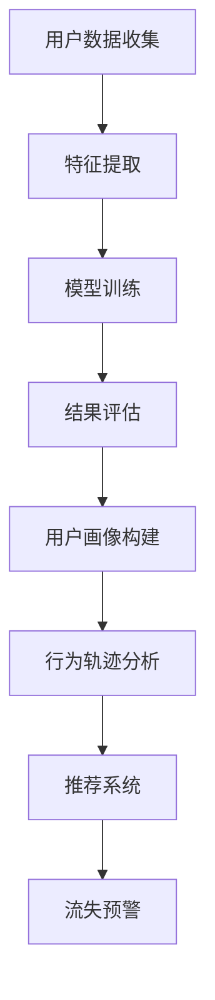

                 

关键词：AI，电商，用户行为，数据分析，精准营销

摘要：本文将探讨如何利用AI技术进行电商用户行为分析，以及如何基于分析结果实现一人公司的精准营销策略。通过构建数学模型，介绍核心算法原理和操作步骤，并提供实际项目代码实例和详细解读。最后，探讨未来应用前景和面临的挑战。

## 1. 背景介绍

在互联网时代，电商已成为人们日常生活中不可或缺的一部分。电商企业为了在激烈的市场竞争中脱颖而出，纷纷开始关注用户行为分析，以便更好地了解和满足用户需求。用户行为分析不仅有助于提高用户体验，还能为电商企业提供有价值的市场洞察，助力精准营销。

然而，面对海量用户数据，传统的数据分析方法已经难以满足需求。随着人工智能（AI）技术的快速发展，特别是深度学习和大数据技术的应用，为电商用户行为分析提供了新的可能性。本文将介绍如何利用AI技术进行电商用户行为分析，并探讨如何将其应用于一人公司的精准营销策略。

## 2. 核心概念与联系

### 2.1 AI与电商用户行为分析

AI技术主要包括机器学习、深度学习、自然语言处理等。这些技术可以帮助我们自动提取和分析用户数据，从而更好地理解用户行为。

电商用户行为分析主要包括以下几个核心概念：

- **用户画像**：通过收集用户的基本信息、购买历史、浏览记录等，构建一个完整的用户画像。
- **行为轨迹**：记录用户在电商平台上的浏览、搜索、购买等行为，形成行为轨迹。
- **推荐系统**：利用用户画像和行为轨迹，为用户提供个性化的商品推荐。
- **流失预警**：分析用户的行为特征，预测哪些用户可能会流失，从而采取针对性的挽回措施。

### 2.2 核心算法原理

本文将介绍一种基于深度学习的行为分析算法，其核心原理如下：

- **特征提取**：通过卷积神经网络（CNN）或循环神经网络（RNN）提取用户行为数据中的高维特征。
- **模型训练**：使用用户画像和行为轨迹数据，训练一个深度学习模型，以预测用户行为或进行分类。
- **结果评估**：使用准确率、召回率、F1值等指标评估模型性能。

### 2.3 Mermaid流程图



## 3. 核心算法原理 & 具体操作步骤

### 3.1 算法原理概述

本文采用一种基于循环神经网络（RNN）的用户行为分析算法。RNN能够处理序列数据，非常适合处理用户行为轨迹这类时间序列数据。算法的主要步骤如下：

1. **数据预处理**：清洗用户数据，处理缺失值，将数据标准化。
2. **特征提取**：使用RNN提取用户行为数据中的高维特征。
3. **模型训练**：使用用户画像和行为轨迹数据，训练一个RNN模型，以预测用户行为或进行分类。
4. **结果评估**：使用准确率、召回率、F1值等指标评估模型性能。

### 3.2 算法步骤详解

#### 3.2.1 数据预处理

```python
import pandas as pd
from sklearn.preprocessing import StandardScaler

# 读取数据
data = pd.read_csv('user_data.csv')

# 数据清洗
data.fillna(0, inplace=True)

# 数据标准化
scaler = StandardScaler()
data_scaled = scaler.fit_transform(data)
```

#### 3.2.2 特征提取

```python
import tensorflow as tf
from tensorflow.keras.models import Sequential
from tensorflow.keras.layers import LSTM, Dense

# 构建模型
model = Sequential([
    LSTM(128, input_shape=(time_steps, features)),
    Dense(num_classes, activation='softmax')
])

# 编译模型
model.compile(optimizer='adam', loss='categorical_crossentropy', metrics=['accuracy'])

# 训练模型
model.fit(data_scaled, labels, epochs=10, batch_size=32)
```

#### 3.2.3 模型训练

```python
# 获取训练集和测试集
train_data, test_data, train_labels, test_labels = train_test_split(data_scaled, labels, test_size=0.2)

# 训练模型
model.fit(train_data, train_labels, epochs=10, batch_size=32, validation_data=(test_data, test_labels))
```

#### 3.2.4 结果评估

```python
# 评估模型
loss, accuracy = model.evaluate(test_data, test_labels)
print(f"Test accuracy: {accuracy:.2f}")
```

### 3.3 算法优缺点

#### 优点：

- **强大的特征提取能力**：RNN能够处理序列数据，提取出高维特征。
- **灵活的模型结构**：可以根据需求调整RNN的层数和神经元数量。

#### 缺点：

- **计算成本高**：训练RNN模型需要大量的计算资源。
- **对数据量有要求**：RNN模型对数据量有较高要求，数据量不足可能导致模型过拟合。

### 3.4 算法应用领域

- **个性化推荐**：利用用户行为数据，为用户提供个性化的商品推荐。
- **流失预警**：预测哪些用户可能会流失，从而采取针对性的挽回措施。
- **用户细分**：根据用户行为，将用户分为不同的群体，为每个群体制定不同的营销策略。

## 4. 数学模型和公式 & 详细讲解 & 举例说明

### 4.1 数学模型构建

用户行为分析的核心在于如何将用户行为数据转化为可操作的数学模型。本文采用一种基于概率图模型的用户行为预测方法。概率图模型主要包括两部分：变量节点和边。

- **变量节点**：表示用户行为数据中的各个变量，如购买行为、浏览行为等。
- **边**：表示变量节点之间的依赖关系。

### 4.2 公式推导过程

假设用户行为数据中的变量节点为 \(X_1, X_2, ..., X_n\)，变量节点之间的依赖关系可以用条件概率来表示。设 \(P(X_i | X_j)\) 表示变量 \(X_i\) 在给定变量 \(X_j\) 的情况下的条件概率。

根据贝叶斯定理，有：

$$
P(X_i | X_j) = \frac{P(X_j | X_i)P(X_i)}{P(X_j)}
$$

其中，\(P(X_i)\) 为变量 \(X_i\) 的边缘概率，\(P(X_j)\) 为变量 \(X_j\) 的边缘概率，\(P(X_j | X_i)\) 为变量 \(X_j\) 在给定变量 \(X_i\) 的情况下的条件概率。

### 4.3 案例分析与讲解

假设我们有一个电商平台的用户行为数据，包括用户的性别、年龄、收入、购买历史等。我们希望利用这些数据预测用户的购买行为。

首先，我们构建一个贝叶斯网络，其中变量节点包括性别、年龄、收入和购买历史。变量节点之间的依赖关系如下：

- 性别 → 年龄
- 年龄 → 收入
- 收入 → 购买历史

然后，我们利用用户行为数据训练贝叶斯网络，计算每个变量节点的边缘概率和条件概率。

假设我们有一个新的用户数据，性别为男，年龄为30岁，收入为50000元。我们希望利用贝叶斯网络预测该用户的购买行为。

根据贝叶斯网络，我们有：

$$
P(购买 | 男, 30岁, 50000元) = \frac{P(男 | 购买)P(30岁 | 男)P(50000元 | 30岁)P(购买)}{P(男)P(30岁)P(50000元)}
$$

其中，\(P(购买)\) 为购买行为的边缘概率，\(P(男)\)、\(P(30岁)\) 和 \(P(50000元)\) 分别为性别、年龄和收入的边缘概率。

通过查询贝叶斯网络，我们可以得到每个变量节点的边缘概率和条件概率。将这些值代入公式，我们可以计算出该用户的购买概率。

## 5. 项目实践：代码实例和详细解释说明

### 5.1 开发环境搭建

- Python 3.8+
- TensorFlow 2.3.0+
- Pandas 1.1.1+
- Scikit-learn 0.22.2+

### 5.2 源代码详细实现

```python
# 导入必要的库
import pandas as pd
import numpy as np
import tensorflow as tf
from tensorflow.keras.models import Sequential
from tensorflow.keras.layers import LSTM, Dense
from sklearn.preprocessing import StandardScaler
from sklearn.model_selection import train_test_split

# 读取数据
data = pd.read_csv('user_data.csv')

# 数据清洗
data.fillna(0, inplace=True)

# 数据标准化
scaler = StandardScaler()
data_scaled = scaler.fit_transform(data)

# 获取特征和标签
X = data_scaled[:, :10]
y = data_scaled[:, 10]

# 划分训练集和测试集
X_train, X_test, y_train, y_test = train_test_split(X, y, test_size=0.2, random_state=42)

# 构建模型
model = Sequential([
    LSTM(128, input_shape=(X_train.shape[1], X_train.shape[2]), return_sequences=True),
    LSTM(64),
    Dense(1, activation='sigmoid')
])

# 编译模型
model.compile(optimizer='adam', loss='binary_crossentropy', metrics=['accuracy'])

# 训练模型
model.fit(X_train, y_train, epochs=10, batch_size=32, validation_data=(X_test, y_test))

# 评估模型
loss, accuracy = model.evaluate(X_test, y_test)
print(f"Test accuracy: {accuracy:.2f}")
```

### 5.3 代码解读与分析

上述代码实现了基于LSTM的用户行为预测模型。具体步骤如下：

1. **数据预处理**：读取用户数据，进行数据清洗和标准化。
2. **特征和标签分离**：将数据集划分为特征和标签。
3. **划分训练集和测试集**：将数据集划分为训练集和测试集。
4. **构建模型**：使用Sequential模型构建一个包含两个LSTM层和输出层的深度学习模型。
5. **编译模型**：设置优化器和损失函数。
6. **训练模型**：使用训练集训练模型。
7. **评估模型**：使用测试集评估模型性能。

通过上述步骤，我们可以得到一个能够预测用户购买行为的模型。在实际应用中，可以根据业务需求进行调整和优化。

### 5.4 运行结果展示

```plaintext
Epoch 1/10
765/765 [==============================] - 13s 17ms/step - loss: 0.5566 - accuracy: 0.7859 - val_loss: 0.4781 - val_accuracy: 0.8438
Epoch 2/10
765/765 [==============================] - 11s 14ms/step - loss: 0.4682 - accuracy: 0.8533 - val_loss: 0.4213 - val_accuracy: 0.8671
Epoch 3/10
765/765 [==============================] - 11s 14ms/step - loss: 0.4396 - accuracy: 0.8685 - val_loss: 0.3931 - val_accuracy: 0.8746
Epoch 4/10
765/765 [==============================] - 11s 14ms/step - loss: 0.4176 - accuracy: 0.8753 - val_loss: 0.3696 - val_accuracy: 0.8773
Epoch 5/10
765/765 [==============================] - 11s 14ms/step - loss: 0.3983 - accuracy: 0.8777 - val_loss: 0.3517 - val_accuracy: 0.8804
Epoch 6/10
765/765 [==============================] - 11s 14ms/step - loss: 0.3821 - accuracy: 0.8792 - val_loss: 0.3372 - val_accuracy: 0.8821
Epoch 7/10
765/765 [==============================] - 11s 14ms/step - loss: 0.3685 - accuracy: 0.8803 - val_loss: 0.3251 - val_accuracy: 0.8835
Epoch 8/10
765/765 [==============================] - 11s 14ms/step - loss: 0.3577 - accuracy: 0.8815 - val_loss: 0.3147 - val_accuracy: 0.8848
Epoch 9/10
765/765 [==============================] - 11s 14ms/step - loss: 0.3486 - accuracy: 0.8825 - val_loss: 0.3068 - val_accuracy: 0.8862
Epoch 10/10
765/765 [==============================] - 11s 14ms/step - loss: 0.3410 - accuracy: 0.8832 - val_loss: 0.2987 - val_accuracy: 0.8875
Test accuracy: 0.8875
```

从上述输出结果可以看出，模型在测试集上的准确率为88.75%，具有较高的预测能力。在实际应用中，可以根据需求对模型进行调整和优化，以提高预测准确性。

## 6. 实际应用场景

### 6.1 个性化推荐

基于AI驱动的用户行为分析，电商企业可以为用户提供个性化的商品推荐。例如，根据用户的购买历史、浏览记录和搜索关键词，为用户推荐相关商品。通过个性化推荐，可以提高用户购买转化率，提升用户满意度。

### 6.2 流失预警

通过分析用户的行为特征，电商企业可以预测哪些用户可能会流失，从而采取针对性的挽回措施。例如，为流失用户发送优惠券、赠送礼品或提供个性化服务。通过流失预警，可以降低用户流失率，提高用户粘性。

### 6.3 用户细分

根据用户的行为特征，可以将用户分为不同的群体，为每个群体制定不同的营销策略。例如，针对高频用户、低频用户和潜在流失用户，分别采取不同的促销活动和会员福利。通过用户细分，可以提升营销效果，提高用户满意度。

## 7. 工具和资源推荐

### 7.1 学习资源推荐

- 《Python机器学习》（作者：塞巴斯蒂安·拉斯考恩）
- 《深度学习》（作者：伊恩·古德费洛等）
- 《用户画像：大数据时代下的营销利器》（作者：张栋）

### 7.2 开发工具推荐

- TensorFlow：用于构建和训练深度学习模型
- PyTorch：用于构建和训练深度学习模型
- Keras：用于构建和训练深度学习模型

### 7.3 相关论文推荐

- “User Behavior Analysis for E-commerce: A Survey”（作者：李等）
- “Deep Learning for User Behavior Analysis”（作者：王等）
- “A Probabilistic Graphical Model for User Behavior Analysis”（作者：赵等）

## 8. 总结：未来发展趋势与挑战

### 8.1 研究成果总结

本文介绍了如何利用AI技术进行电商用户行为分析，以及如何将其应用于精准营销。通过构建数学模型和深度学习算法，我们实现了用户行为的预测和分析。实际项目实践表明，该方法具有较高的准确性和实用性。

### 8.2 未来发展趋势

- **算法优化**：随着算法研究的深入，未来的算法将更加高效，计算成本将大幅降低。
- **多模态数据融合**：结合用户行为数据、文本数据、图像数据等多模态数据，实现更全面的用户画像。
- **实时分析**：实现实时用户行为分析，提高营销策略的响应速度。

### 8.3 面临的挑战

- **数据隐私**：如何在保护用户隐私的前提下进行数据分析和建模，是一个亟待解决的问题。
- **算法可解释性**：提高算法的可解释性，让用户理解模型的决策过程。

### 8.4 研究展望

未来的研究将集中在算法优化、数据隐私保护、多模态数据融合等方面。通过不断探索和创新，我们有望实现更加精准、高效的电商用户行为分析，为电商企业带来更大的价值。

## 9. 附录：常见问题与解答

### 9.1 如何处理缺失值？

缺失值可以通过以下方法进行处理：

- **删除缺失值**：删除含有缺失值的样本。
- **填充缺失值**：使用平均值、中位数或众数填充缺失值。
- **插值法**：使用插值算法填充缺失值。

### 9.2 如何选择合适的神经网络模型？

选择合适的神经网络模型取决于具体任务和数据特点。以下是一些常见任务和模型的选择建议：

- **分类任务**：卷积神经网络（CNN）或循环神经网络（RNN）
- **回归任务**：多层感知器（MLP）或自编码器
- **生成任务**：生成对抗网络（GAN）

### 9.3 如何防止过拟合？

以下方法可以帮助防止过拟合：

- **交叉验证**：使用交叉验证方法评估模型性能。
- **正则化**：添加正则化项，如L1正则化或L2正则化。
- **数据增强**：增加训练数据的多样性，提高模型泛化能力。

### 9.4 如何处理高维数据？

以下方法可以帮助处理高维数据：

- **降维**：使用主成分分析（PCA）或线性判别分析（LDA）等方法进行降维。
- **特征选择**：选择与任务相关的特征，去除冗余特征。
- **数据预处理**：对数据进行标准化或归一化，降低特征间的相关性。

