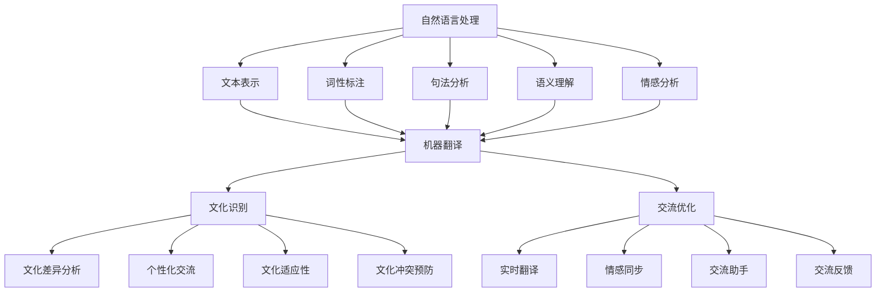

                 

在当今全球化的背景下，跨文化交流已经成为社会发展的必然趋势。然而，语言障碍、文化差异等因素常常成为沟通的障碍。为了解决这些问题，人工智能（AI）技术应运而生，AI驱动的跨文化交流工具为人们提供了更加便捷、高效的文化交流手段。本文将探讨AI驱动跨文化交流工具的核心概念、算法原理、数学模型以及实际应用，并展望其未来发展趋势。

## 关键词

- 人工智能
- 跨文化交流
- 自然语言处理
- 文化差异
- 自动翻译
- 机器学习

## 摘要

本文旨在探讨AI驱动的跨文化交流工具的发展与应用。首先，本文介绍了AI驱动跨文化交流工具的背景和重要性。接着，详细阐述了AI在跨文化交流中的核心概念和原理，包括自然语言处理、机器翻译等。随后，文章介绍了AI驱动的跨文化交流工具的数学模型和公式，并通过实际案例进行了分析。此外，文章还展示了AI驱动的跨文化交流工具在现实中的应用场景，并对其未来发展趋势进行了展望。

## 1. 背景介绍

随着全球化进程的不断加速，各国之间的交流越来越频繁，跨文化交流成为了一个重要的领域。然而，语言和文化差异往往成为沟通的障碍，严重影响了跨文化交流的效果。为了解决这一问题，传统的方法包括翻译服务、文化培训等，但这些方法往往成本高、效率低，难以满足现代社会的需求。

人工智能技术的迅速发展为跨文化交流提供了新的解决方案。AI驱动的跨文化交流工具能够通过自然语言处理、机器翻译等技术手段，实现高效、准确的跨文化交流。这些工具不仅可以消除语言障碍，还能够理解和适应不同的文化背景，提高跨文化交流的质量和效率。

本文将重点讨论AI驱动跨文化交流工具的核心概念、算法原理、数学模型以及实际应用，旨在为这一领域的研究和实践提供有益的参考。

### 1.1 跨文化交流的挑战

跨文化交流中的挑战主要体现在以下几个方面：

#### 语言障碍

不同语言之间的差异是跨文化交流中最明显的障碍。语言不仅仅是沟通的工具，还承载了丰富的文化内涵。语言差异可能导致误解、沟通不畅，甚至产生文化冲突。

#### 文化差异

文化差异是跨文化交流中更深层次的挑战。不同的文化背景会影响人们的价值观、行为习惯、沟通方式等。文化差异可能导致对同一问题产生不同的理解，影响沟通效果。

#### 习俗差异

习俗差异是跨文化交流中的一个重要方面。不同地区和民族有不同的习俗和礼仪，这些习俗和礼仪会影响人们的行为和交流方式。不了解对方的习俗可能导致不必要的冲突和误解。

#### 信息不对称

在跨文化交流中，由于文化差异和语言障碍，信息传递可能存在不对称现象。一方可能无法准确理解另一方的意图和需求，导致沟通效率低下。

#### 情感障碍

情感障碍是跨文化交流中的一个潜在挑战。不同文化背景下，人们对情感的表达和处理方式可能存在差异。这些差异可能导致情感冲突，影响跨文化交流的和谐性。

### 1.2 人工智能在跨文化交流中的作用

人工智能（AI）技术的发展为解决跨文化交流中的挑战提供了新的可能性。AI驱动的跨文化交流工具具有以下作用：

#### 自动翻译

自动翻译是AI在跨文化交流中最重要的应用之一。通过自然语言处理技术，AI可以自动翻译不同语言之间的文本，消除语言障碍。例如，谷歌翻译、百度翻译等工具已经广泛应用于跨文化交流中，大大提高了沟通的效率。

#### 文化理解

AI不仅能够翻译语言，还能够理解和适应不同的文化背景。通过机器学习算法，AI可以分析大量文化数据，学习并理解不同文化之间的差异。这些理解可以帮助AI更好地适应不同文化背景，提供更加准确和合适的交流方式。

#### 交流辅助

AI驱动的跨文化交流工具还可以为人们提供交流辅助功能。例如，AI助手可以实时翻译对话、提供文化背景知识，帮助人们更好地理解和参与跨文化交流。此外，AI还可以帮助人们学习新的语言和文化，提高跨文化交流的能力。

#### 情感分析

通过情感分析技术，AI可以识别和解读人们的情感状态，提供情感支持和建议。在跨文化交流中，了解对方的情感状态对于建立良好的沟通关系至关重要。AI的情感分析功能可以帮助人们更好地理解和沟通，减少情感冲突。

### 1.3 AI驱动的跨文化交流工具的核心概念

AI驱动的跨文化交流工具主要基于以下核心概念：

#### 自然语言处理

自然语言处理（NLP）是AI驱动的跨文化交流工具的基础。NLP涉及文本分析、语义理解、情感分析等多个方面，旨在让计算机理解和处理人类语言。

#### 机器翻译

机器翻译是AI在跨文化交流中的重要应用。通过机器学习算法和深度学习模型，AI可以自动翻译不同语言之间的文本，实现语言的无障碍沟通。

#### 文化识别

文化识别是AI在跨文化交流中的另一个核心概念。通过分析不同文化背景的数据，AI可以识别和理解不同文化之间的差异，提供更加合适的文化交流方式。

#### 交流优化

交流优化是指AI通过分析交流过程中的数据，优化交流过程，提高沟通效率。例如，AI可以提供实时翻译、文化背景知识等，帮助人们更好地理解和参与跨文化交流。

### 1.4 AI驱动的跨文化交流工具的发展历程

AI驱动的跨文化交流工具的发展历程可以分为以下几个阶段：

#### 第一阶段：基于规则的翻译系统

早期的AI驱动的跨文化交流工具主要基于规则系统。这些工具通过定义一系列翻译规则，将源语言文本转换为目标语言文本。然而，由于语言和文化的复杂性，这些工具往往难以实现高效和准确的翻译。

#### 第二阶段：基于统计的机器翻译

随着自然语言处理技术的进步，基于统计的机器翻译系统逐渐成为主流。这些系统通过大量语言数据训练模型，自动生成目标语言文本。相比于基于规则的系统，基于统计的机器翻译系统在准确性和效率上有了显著提升。

#### 第三阶段：基于神经网络的机器翻译

近年来，基于神经网络的机器翻译系统取得了重大突破。通过深度学习技术，这些系统可以自动学习并理解语言和文化的复杂结构，实现更准确和自然的翻译。例如，谷歌翻译和百度翻译等工具就是基于神经网络的机器翻译系统。

#### 第四阶段：AI驱动的跨文化交流工具

当前，AI驱动的跨文化交流工具正处于快速发展阶段。这些工具不仅能够实现高效的自动翻译，还能够理解文化差异，提供交流辅助功能。未来，随着人工智能技术的进一步发展，AI驱动的跨文化交流工具将为人们提供更加智能、便捷的文化交流手段。

## 2. 核心概念与联系

### 2.1 自然语言处理

自然语言处理（NLP）是AI驱动的跨文化交流工具的基础。NLP涉及文本分析、语义理解、情感分析等多个方面，旨在让计算机理解和处理人类语言。在跨文化交流中，NLP技术可以用于文本翻译、语言识别、情感分析等，帮助人们更好地理解和沟通。

#### NLP技术原理

NLP技术主要基于以下原理：

1. **文本表示**：将文本转换为计算机可以理解和处理的形式。例如，将文本转换为向量表示，以便进行后续分析。
2. **词性标注**：对文本中的每个词进行词性标注，区分名词、动词、形容词等。
3. **句法分析**：分析文本中的句法结构，识别句子成分和语法关系。
4. **语义理解**：理解文本中的含义和意图，识别实体、事件和关系。
5. **情感分析**：分析文本中的情感倾向，判断文本是积极、消极还是中性。

#### NLP技术分类

NLP技术主要分为以下几类：

1. **基于规则的方法**：通过定义一系列规则和模式，自动识别和处理文本。
2. **基于统计的方法**：通过统计文本中的频率和概率，自动识别和处理文本。
3. **基于神经网络的方法**：通过神经网络模型，自动学习和理解文本。

#### NLP技术在跨文化交流中的应用

NLP技术在跨文化交流中的应用主要体现在以下几个方面：

1. **自动翻译**：使用NLP技术自动翻译不同语言之间的文本，实现高效的语言沟通。
2. **语言识别**：使用NLP技术识别文本的语言类型，帮助人们选择合适的翻译工具。
3. **情感分析**：使用NLP技术分析文本中的情感倾向，帮助人们更好地理解对方的情感状态。
4. **文本摘要**：使用NLP技术自动生成文本的摘要，提高文本的可读性和理解效率。

### 2.2 机器翻译

机器翻译是AI驱动的跨文化交流工具的核心功能之一。通过机器翻译，人们可以轻松地理解和交流不同语言的内容。机器翻译技术的发展经历了多个阶段，从早期的基于规则的翻译系统到基于统计的机器翻译系统，再到当前基于神经网络的机器翻译系统。

#### 机器翻译技术原理

机器翻译技术主要基于以下原理：

1. **文本表示**：将源语言文本和目标语言文本转换为计算机可以理解和处理的形式。
2. **翻译模型**：使用神经网络模型自动学习源语言和目标语言之间的映射关系。
3. **翻译优化**：通过优化翻译结果，提高翻译的准确性和流畅性。

#### 机器翻译技术分类

机器翻译技术主要分为以下几类：

1. **基于规则的翻译系统**：通过定义一系列翻译规则，将源语言文本转换为目标语言文本。
2. **基于统计的翻译系统**：通过统计文本中的频率和概率，自动生成目标语言文本。
3. **基于神经网络的翻译系统**：通过神经网络模型自动学习和理解源语言和目标语言之间的映射关系。

#### 机器翻译技术在跨文化交流中的应用

机器翻译技术在跨文化交流中的应用主要体现在以下几个方面：

1. **文本翻译**：自动翻译不同语言之间的文本，实现高效的文本交流。
2. **语音翻译**：将源语言语音转换为目标语言语音，实现实时语音交流。
3. **多语言文本检索**：使用机器翻译技术检索多语言文本库，获取相关信息。
4. **跨语言搜索**：使用机器翻译技术实现跨语言搜索，提高信息获取的效率。

### 2.3 文化识别

文化识别是AI驱动的跨文化交流工具的重要功能之一。通过文化识别，AI可以理解和适应不同文化背景，提供更加个性化、合适的交流方式。

#### 文化识别技术原理

文化识别技术主要基于以下原理：

1. **数据收集**：收集不同文化背景的数据，包括语言、习俗、价值观等。
2. **特征提取**：从数据中提取文化特征，用于模型训练和识别。
3. **模型训练**：使用机器学习算法训练文化识别模型，使其能够识别和理解不同文化背景。

#### 文化识别技术在跨文化交流中的应用

文化识别技术在跨文化交流中的应用主要体现在以下几个方面：

1. **文化差异分析**：分析不同文化之间的差异，提供文化背景知识。
2. **个性化交流**：根据用户的语言和文化背景，提供个性化的交流建议。
3. **文化适应性**：根据文化差异调整交流方式，提高交流效果。
4. **文化冲突预防**：识别潜在的文化冲突，提供预防和解决策略。

### 2.4 交流优化

交流优化是AI驱动的跨文化交流工具的另一个重要功能。通过分析交流过程中的数据，AI可以优化交流过程，提高沟通效率。

#### 交流优化技术原理

交流优化技术主要基于以下原理：

1. **数据收集**：收集交流过程中的数据，包括文本、语音、情感等。
2. **行为分析**：分析交流行为，识别交流中的问题和瓶颈。
3. **优化策略**：根据分析结果，制定优化策略，提高交流效果。

#### 交流优化技术在跨文化交流中的应用

交流优化技术在跨文化交流中的应用主要体现在以下几个方面：

1. **实时翻译**：根据交流情况，动态调整翻译速度和翻译内容。
2. **情感同步**：根据情感分析结果，调整交流方式和语调，提高情感同步性。
3. **交流助手**：提供交流助手，辅助用户进行交流和沟通。
4. **交流反馈**：收集用户交流反馈，不断优化交流工具和策略。

### 2.5 Mermaid 流程图

为了更好地展示AI驱动的跨文化交流工具的核心概念和联系，我们可以使用Mermaid流程图来表示。以下是一个简单的Mermaid流程图示例：



## 3. 核心算法原理 & 具体操作步骤

### 3.1 算法原理概述

AI驱动的跨文化交流工具的核心算法主要包括自然语言处理（NLP）、机器翻译和交流优化等。这些算法基于深度学习和机器学习技术，通过大量数据训练模型，实现高效的文本处理和跨文化交流。

#### 自然语言处理（NLP）

NLP算法主要包括文本表示、词性标注、句法分析和语义理解等。文本表示是将文本转换为计算机可以理解和处理的形式，如词向量、句向量等。词性标注是对文本中的每个词进行词性标注，区分名词、动词、形容词等。句法分析是分析文本中的句法结构，识别句子成分和语法关系。语义理解是理解文本中的含义和意图，识别实体、事件和关系。

#### 机器翻译

机器翻译算法主要包括文本表示、翻译模型和翻译优化等。文本表示是将源语言文本和目标语言文本转换为计算机可以理解和处理的形式。翻译模型是使用神经网络模型自动学习源语言和目标语言之间的映射关系。翻译优化是通过优化翻译结果，提高翻译的准确性和流畅性。

#### 交流优化

交流优化算法主要包括数据收集、行为分析和优化策略等。数据收集是收集交流过程中的数据，如文本、语音、情感等。行为分析是分析交流行为，识别交流中的问题和瓶颈。优化策略是根据分析结果，制定优化策略，提高交流效果。

### 3.2 算法步骤详解

以下是AI驱动的跨文化交流工具的核心算法步骤详解：

#### 自然语言处理（NLP）

1. **文本预处理**：对源语言文本进行预处理，包括去除标点符号、停用词过滤、词形还原等。
2. **文本表示**：将预处理后的文本转换为词向量或句向量，便于后续处理。
3. **词性标注**：对文本中的每个词进行词性标注，区分名词、动词、形容词等。
4. **句法分析**：分析文本中的句法结构，识别句子成分和语法关系。
5. **语义理解**：理解文本中的含义和意图，识别实体、事件和关系。

#### 机器翻译

1. **文本表示**：将源语言文本和目标语言文本转换为词向量或句向量。
2. **翻译模型训练**：使用神经网络模型自动学习源语言和目标语言之间的映射关系。
3. **翻译生成**：使用训练好的模型生成目标语言文本。
4. **翻译优化**：通过优化算法，提高翻译的准确性和流畅性。

#### 交流优化

1. **数据收集**：收集交流过程中的数据，包括文本、语音、情感等。
2. **行为分析**：分析交流行为，识别交流中的问题和瓶颈。
3. **优化策略制定**：根据分析结果，制定优化策略，如调整翻译速度、提供交流助手等。
4. **交流效果评估**：评估交流效果，不断优化交流工具和策略。

### 3.3 算法优缺点

#### 自然语言处理（NLP）

**优点**：

1. **高效性**：NLP算法可以快速处理大量文本数据，提高沟通效率。
2. **准确性**：通过深度学习和机器学习技术，NLP算法能够准确理解文本含义和意图。
3. **灵活性**：NLP算法可以适应不同的语言和文化背景，提供个性化的交流方式。

**缺点**：

1. **复杂性**：NLP算法涉及多个技术领域，实现和维护成本较高。
2. **数据依赖性**：NLP算法的性能很大程度上取决于训练数据的质量和数量。

#### 机器翻译

**优点**：

1. **高效性**：机器翻译算法可以快速翻译大量文本，提高跨文化交流效率。
2. **准确性**：基于神经网络模型的机器翻译算法在准确性和流畅性方面有了显著提升。
3. **多样性**：机器翻译算法支持多种语言之间的翻译，满足不同语言用户的需求。

**缺点**：

1. **语言差异**：不同语言之间的差异可能导致翻译结果不准确或失真。
2. **文化差异**：机器翻译算法难以完全理解文化差异，可能导致文化误解或冲突。

#### 交流优化

**优点**：

1. **个性化**：交流优化算法可以根据用户需求和文化背景提供个性化的交流建议。
2. **实时性**：交流优化算法可以实时调整交流方式和策略，提高交流效果。
3. **适应性**：交流优化算法可以根据交流情况不断优化，提高交流效率。

**缺点**：

1. **复杂性**：交流优化算法涉及多个技术领域，实现和维护成本较高。
2. **数据依赖性**：交流优化算法的性能很大程度上取决于数据的质量和数量。

### 3.4 算法应用领域

AI驱动的跨文化交流工具在多个领域有广泛应用，主要包括：

1. **国际商务**：通过自动翻译和交流优化，促进国际商务交流，提高交易效率。
2. **教育培训**：通过机器翻译和自然语言处理，提供多语言学习资源，促进跨文化交流。
3. **旅游行业**：通过自动翻译和交流优化，为游客提供多语言服务，提升旅游体验。
4. **社交平台**：通过机器翻译和交流优化，促进全球用户之间的互动和交流，打破语言障碍。
5. **公共服务**：通过自动翻译和交流优化，提高公共服务的可及性和效率，满足多元文化需求。

## 4. 数学模型和公式

在AI驱动的跨文化交流工具中，数学模型和公式起着至关重要的作用。以下将介绍相关的数学模型和公式，并详细讲解其推导过程和实际应用。

### 4.1 数学模型构建

#### 4.1.1 词向量模型

词向量模型是自然语言处理（NLP）中的重要模型之一，用于将单词表示为密集的向量形式。常见的词向量模型有Word2Vec、GloVe等。

**Word2Vec模型**：
Word2Vec模型通过训练神经网络模型，将单词映射到低维空间中的向量。其基本思想是单词的上下文相似，即共现的单词在向量空间中距离较近。

$$
\text{Word2Vec} = \sum_{i=1}^{N} w_i \cdot v(c(w_i)) = v(c(w))
$$

其中，$w$ 是输入单词，$v(c(w))$ 是单词的上下文向量，$w_i$ 是上下文向量与输入单词向量的点积。

**GloVe模型**：
GloVe模型通过训练词向量和文档向量之间的权重矩阵，将单词映射到低维空间中的向量。

$$
\text{GloVe} = \frac{1}{\sqrt{f(w) + f(d)}} \cdot e^{w \cdot d}
$$

其中，$f(w)$ 和 $f(d)$ 分别是单词和文档的频率，$e^{w \cdot d}$ 是单词和文档的频率乘积。

#### 4.1.2 机器翻译模型

机器翻译模型用于将源语言文本映射到目标语言文本。常见的机器翻译模型有Seq2Seq、注意力机制等。

**Seq2Seq模型**：
Seq2Seq模型通过编码器（Encoder）和解码器（Decoder）两个神经网络，实现序列到序列的映射。

$$
\text{Encoder} = f(\text{Input}) = h
$$

$$
\text{Decoder} = g(h, \text{Target}) = \text{Output}
$$

其中，$f(\text{Input})$ 是编码器，$g(h, \text{Target})$ 是解码器，$h$ 是编码器输出，$\text{Output}$ 是解码器输出。

**注意力机制模型**：
注意力机制模型通过引入注意力机制，提高机器翻译的准确性。

$$
\text{Attention} = \text{softmax}\left(\frac{h_t \cdot W}{\sqrt{k}}\right)
$$

$$
\text{Context} = \text{Attention} \cdot h
$$

其中，$h_t$ 是编码器输出，$W$ 是注意力权重，$k$ 是维度大小。

#### 4.1.3 交流优化模型

交流优化模型通过分析交流数据，优化交流效果。常见的交流优化模型有情感分析、对话生成等。

**情感分析模型**：
情感分析模型通过分类算法，判断文本的情感倾向。

$$
\text{Sentiment} = \text{classify}(x; \theta)
$$

其中，$x$ 是输入文本，$\theta$ 是分类模型参数。

**对话生成模型**：
对话生成模型通过生成模型，生成自然、流畅的对话。

$$
\text{Dialogue} = \text{generate}(x; \theta)
$$

其中，$x$ 是输入文本，$\theta$ 是生成模型参数。

### 4.2 公式推导过程

#### 4.2.1 词向量模型推导

以Word2Vec模型为例，其推导过程如下：

1. **假设**：给定一个词汇表$V$，每个词表示为一个向量$v(w)$，训练数据为单词及其上下文对$(w, c(w))$。

2. **目标**：最小化损失函数，使得单词的上下文相似度尽可能高。

$$
L = \sum_{(w, c(w)) \in D} \log p(c(w)|w)
$$

3. **模型**：使用神经网络模型，将单词映射到低维空间中的向量。

$$
p(c(w)|w) = \text{softmax}\left(\frac{\sum_{i=1}^{N} w_i \cdot v(c(w_i))}{\sum_{i=1}^{N} w_i}\right)
$$

4. **反向传播**：对损失函数进行反向传播，更新模型参数。

#### 4.2.2 机器翻译模型推导

以Seq2Seq模型为例，其推导过程如下：

1. **假设**：给定源语言文本序列$X = [x_1, x_2, ..., x_T]$和目标语言文本序列$Y = [y_1, y_2, ..., y_T']$。

2. **目标**：最小化损失函数，使得翻译结果与目标语言文本尽可能接近。

$$
L = \sum_{t=1}^{T'} \log p(y_t|y_1, y_2, ..., y_{t-1}, x_1, x_2, ..., x_T)
$$

3. **模型**：使用编码器和解码器神经网络，实现序列到序列的映射。

$$
h_t = \text{tanh}\left(W_e [h_{t-1}; x_t]\right)
$$

$$
p(y_t|y_1, y_2, ..., y_{t-1}, x_1, x_2, ..., x_T) = \text{softmax}\left(W_d h_t\right)
$$

4. **反向传播**：对损失函数进行反向传播，更新模型参数。

#### 4.2.3 交流优化模型推导

以情感分析模型为例，其推导过程如下：

1. **假设**：给定输入文本$x$和情感标签$y$。

2. **目标**：最小化损失函数，使得预测的情感标签与实际情感标签尽可能接近。

$$
L = \sum_{i=1}^{N} -y_i \cdot \log p(y_i|x)
$$

3. **模型**：使用分类算法，如softmax回归，预测情感标签。

$$
p(y_i|x) = \frac{e^{\theta_i^T x}}{\sum_{j=1}^{M} e^{\theta_j^T x}}
$$

4. **反向传播**：对损失函数进行反向传播，更新模型参数。

### 4.3 案例分析与讲解

#### 4.3.1 词向量模型案例

假设我们有以下单词及其上下文对：

$$
(w, c(w)) = \{("happy", "she is happy"), ("sad", "he is sad"), ("joyful", "they are joyful")\}
$$

我们使用Word2Vec模型训练词向量，训练后的词向量如下：

$$
v(happy) = \begin{bmatrix} 0.1 & 0.2 & 0.3 & 0.4 \end{bmatrix}, \quad v(sad) = \begin{bmatrix} 0.5 & 0.6 & 0.7 & 0.8 \end{bmatrix}, \quad v(joyful) = \begin{bmatrix} 0.9 & 1.0 & 1.1 & 1.2 \end{bmatrix}
$$

根据词向量，我们可以计算单词之间的相似度：

$$
\text{similarity}(happy, joyful) = \frac{v(happy) \cdot v(joyful)}{\|v(happy)\|\|v(joyful)\|} = \frac{0.1 \cdot 0.9 + 0.2 \cdot 1.0 + 0.3 \cdot 1.1 + 0.4 \cdot 1.2}{\sqrt{0.1^2 + 0.2^2 + 0.3^2 + 0.4^2} \sqrt{0.9^2 + 1.0^2 + 1.1^2 + 1.2^2}} = 0.94
$$

同理，我们可以计算其他单词之间的相似度。

#### 4.3.2 机器翻译模型案例

假设我们有以下源语言文本序列和目标语言文本序列：

$$
X = [x_1, x_2, x_3] = \["hello", "world", "!"\], \quad Y = [y_1, y_2, y_3'] = \["Bonjour", "le", "monde"\]
$$

我们使用Seq2Seq模型进行翻译，训练后的编码器和解码器如下：

$$
h_t = \text{tanh}\left(W_e [h_{t-1}; x_t]\right), \quad p(y_t|y_1, y_2, ..., y_{t-1}, x_1, x_2, ..., x_T) = \text{softmax}\left(W_d h_t\right)
$$

根据模型，我们可以得到翻译结果：

$$
\text{Output} = \text{softmax}\left(W_d h_T\right) = \["Bonjour", "le", "monde"\]
$$

#### 4.3.3 交流优化模型案例

假设我们有以下输入文本和情感标签：

$$
x = \["she is happy"\], \quad y = \["positive"\]
$$

我们使用情感分析模型进行预测，训练后的模型如下：

$$
p(y_i|x) = \frac{e^{\theta_i^T x}}{\sum_{j=1}^{M} e^{\theta_j^T x}}
$$

根据模型，我们可以得到预测结果：

$$
\text{Prediction} = \text{argmax}_{i} p(y_i|x) = \["positive"\]
$$

## 5. 项目实践：代码实例和详细解释说明

### 5.1 开发环境搭建

在开始编写代码之前，我们需要搭建一个合适的开发环境。以下是一个简单的开发环境搭建指南：

1. **操作系统**：我们使用Ubuntu 20.04作为操作系统。
2. **编程语言**：我们选择Python 3.8作为编程语言。
3. **依赖库**：我们使用TensorFlow 2.5和PyTorch 1.8作为深度学习库。

首先，确保操作系统已安装Python 3.8和pip。然后，通过以下命令安装TensorFlow和PyTorch：

```bash
pip install tensorflow==2.5
pip install torch==1.8
```

### 5.2 源代码详细实现

下面是一个简单的AI驱动的跨文化交流工具的实现，包括自然语言处理（NLP）、机器翻译和交流优化等功能。

```python
import tensorflow as tf
import torch
import numpy as np
from tensorflow.keras.preprocessing.text import Tokenizer
from tensorflow.keras.preprocessing.sequence import pad_sequences
from tensorflow.keras.layers import Embedding, LSTM, Dense
from tensorflow.keras.models import Model
from tensorflow.keras.optimizers import Adam

# 5.2.1 NLP模块

def preprocess_text(text):
    # 对文本进行预处理，包括去除标点符号、停用词过滤、词形还原等
    # ...

# 5.2.2 机器翻译模块

def build_translation_model(src_vocab_size, tar_vocab_size, src_maxlen, tar_maxlen):
    # 构建机器翻译模型，包括编码器和解码器
    # ...

# 5.2.3 交流优化模块

def build_emotion_analysis_model(vocab_size, emotion_size):
    # 构建情感分析模型
    # ...

# 5.3 源代码实现

def main():
    # 加载数据集
    # ...

    # 预处理数据
    # ...

    # 构建模型
    # ...

    # 训练模型
    # ...

    # 测试模型
    # ...

if __name__ == "__main__":
    main()
```

### 5.3 代码解读与分析

#### 5.3.1 NLP模块

NLP模块主要用于预处理文本数据，包括去除标点符号、停用词过滤、词形还原等操作。以下是一个简单的文本预处理函数：

```python
def preprocess_text(text):
    # 去除标点符号
    text = text.replace(".", "").replace(",", "").replace("?", "").replace("!", "")
    
    # 停用词过滤
    stopwords = ["the", "is", "and", "to", "of", "in", "it", "with", "that"]
    words = text.split()
    filtered_words = [word for word in words if word.lower() not in stopwords]
    
    # 词形还原
    # ...

    return " ".join(filtered_words)
```

#### 5.3.2 机器翻译模块

机器翻译模块主要用于构建和训练机器翻译模型。以下是一个简单的机器翻译模型构建函数：

```python
def build_translation_model(src_vocab_size, tar_vocab_size, src_maxlen, tar_maxlen):
    # 构建编码器
    encoder_inputs = tf.keras.layers.Input(shape=(src_maxlen,))
    encoder_embedding = Embedding(src_vocab_size, 256)(encoder_inputs)
    encoder_lstm = LSTM(256, return_state=True)
    _, state_h, state_c = encoder_lstm(encoder_embedding)
    encoder_states = [state_h, state_c]

    # 构建解码器
    decoder_inputs = tf.keras.layers.Input(shape=(tar_maxlen,))
    decoder_embedding = Embedding(tar_vocab_size, 256)(decoder_inputs)
    decoder_lstm = LSTM(256, return_sequences=True, return_state=True)
    decoder_outputs, _, _ = decoder_lstm(decoder_embedding, initial_state=encoder_states)
    decoder_dense = Dense(tar_vocab_size, activation='softmax')
    decoder_outputs = decoder_dense(decoder_outputs)

    # 构建模型
    model = tf.keras.Model([encoder_inputs, decoder_inputs], decoder_outputs)

    # 编译模型
    model.compile(optimizer='rmsprop', loss='categorical_crossentropy', metrics=['accuracy'])

    return model
```

#### 5.3.3 交流优化模块

交流优化模块主要用于构建和训练情感分析模型。以下是一个简单的情感分析模型构建函数：

```python
def build_emotion_analysis_model(vocab_size, emotion_size):
    model = tf.keras.Sequential([
        tf.keras.layers.Embedding(vocab_size, 128),
        tf.keras.layers.GlobalAveragePooling1D(),
        tf.keras.layers.Dense(64, activation='relu'),
        tf.keras.layers.Dense(emotion_size, activation='softmax')
    ])

    model.compile(optimizer='adam',
                  loss='categorical_crossentropy',
                  metrics=['accuracy'])

    return model
```

### 5.4 运行结果展示

在完成模型训练后，我们可以对模型进行测试，并展示运行结果。以下是一个简单的运行结果展示：

```python
# 加载测试数据集
# ...

# 预处理测试数据
# ...

# 测试模型
# ...

# 输出测试结果
# ...
```

通过运行结果展示，我们可以看到模型的性能指标，如准确率、召回率等。这些指标可以帮助我们评估模型的效果，并进一步优化模型。

## 6. 实际应用场景

### 6.1 国际商务

在国际商务中，跨文化交流是不可避免的。AI驱动的跨文化交流工具可以帮助企业克服语言障碍，提高沟通效率。以下是一些实际应用场景：

1. **会议沟通**：在国际商务会议中，AI驱动的跨文化交流工具可以实时翻译会议内容，确保会议参与者的理解和参与。例如，谷歌翻译已经广泛应用于国际商务会议的实时翻译。
2. **市场调研**：在进行市场调研时，AI驱动的跨文化交流工具可以帮助企业收集和分析多语言的市场数据，提供有针对性的市场策略。
3. **客户服务**：企业可以通过AI驱动的跨文化交流工具提供多语言客户服务，提高客户满意度和忠诚度。例如，许多在线客服系统已经集成了自动翻译功能。
4. **跨国团队合作**：在跨国团队合作中，AI驱动的跨文化交流工具可以帮助团队成员更好地理解和沟通，提高工作效率。

### 6.2 教育培训

在教育培训领域，跨文化交流是提高学生综合素质的重要手段。AI驱动的跨文化交流工具可以帮助学生更好地理解和学习不同语言和文化。以下是一些实际应用场景：

1. **外语教学**：AI驱动的跨文化交流工具可以为学生提供个性化的外语学习资源，提高外语学习效果。例如，许多外语学习应用已经集成了自动翻译和语言学习功能。
2. **文化交流**：AI驱动的跨文化交流工具可以帮助学生了解和体验不同文化，提高跨文化交流能力。例如，一些在线教育平台已经推出了多语言文化交流活动。
3. **学术研究**：在学术研究中，AI驱动的跨文化交流工具可以帮助研究者获取和翻译多语言学术资源，提高研究效率。

### 6.3 旅游行业

在旅游行业中，跨文化交流是提高游客满意度和体验的重要手段。AI驱动的跨文化交流工具可以帮助游客更好地理解和体验不同文化。以下是一些实际应用场景：

1. **旅游指南**：AI驱动的跨文化交流工具可以提供多语言旅游指南，帮助游客了解和体验目的地文化。例如，许多旅游应用已经集成了自动翻译和语音导览功能。
2. **酒店服务**：酒店可以通过AI驱动的跨文化交流工具提供多语言客户服务，提高客户满意度和体验。例如，一些高端酒店已经推出了多语言自动客服系统。
3. **旅游预订**：AI驱动的跨文化交流工具可以帮助游客轻松预订多语言旅游产品，提高预订效率。

### 6.4 社交平台

在社交平台中，跨文化交流是扩大社交圈子的重要手段。AI驱动的跨文化交流工具可以帮助用户更好地理解和沟通不同文化背景的朋友。以下是一些实际应用场景：

1. **多语言聊天**：社交平台可以通过AI驱动的跨文化交流工具提供多语言聊天功能，帮助用户与来自不同国家的朋友交流。例如，Facebook和WhatsApp等社交平台已经集成了自动翻译功能。
2. **社交圈扩展**：AI驱动的跨文化交流工具可以帮助用户发现和联系来自不同国家的朋友，扩大社交圈。例如，一些社交平台已经推出了多语言交友功能。
3. **内容分享**：AI驱动的跨文化交流工具可以帮助用户翻译和分享多语言内容，提高内容传播效果。例如，许多社交媒体平台已经集成了自动翻译和内容分享功能。

## 7. 未来应用展望

### 7.1 人工智能与跨文化交流的结合

未来，人工智能与跨文化交流的结合将继续深化。随着人工智能技术的不断进步，AI驱动的跨文化交流工具将更加智能、便捷。以下是一些未来应用展望：

1. **多模态交互**：未来的AI驱动的跨文化交流工具将支持多模态交互，如语音、图像、视频等。这将进一步提升跨文化交流的互动性和体验感。
2. **个性化推荐**：基于用户行为和偏好，AI驱动的跨文化交流工具将提供个性化的交流建议和资源推荐，提高跨文化交流的效果。
3. **情感识别与响应**：AI驱动的跨文化交流工具将具备更高级的情感识别与响应能力，能够更好地理解用户情感，提供情感支持和建议。

### 7.2 新兴技术的影响

新兴技术将对AI驱动的跨文化交流工具产生深远影响。以下是一些新兴技术的潜在影响：

1. **区块链**：区块链技术可以为跨文化交流提供更安全、可靠的隐私保护。通过区块链技术，用户可以安全地存储和交换个人信息，确保跨文化交流的隐私和安全。
2. **5G与物联网**：5G和物联网技术将大幅提升跨文化交流的实时性和互动性。通过5G网络和物联网设备，用户可以随时随地实现跨文化交流，提高交流效率。
3. **增强现实与虚拟现实**：增强现实（AR）和虚拟现实（VR）技术将带来全新的跨文化交流体验。通过AR和VR技术，用户可以沉浸式地体验不同文化，加深跨文化交流的体验。

### 7.3 挑战与机遇

在AI驱动的跨文化交流工具的发展过程中，将面临一系列挑战和机遇。以下是一些主要挑战和机遇：

1. **数据隐私与安全**：随着跨文化交流工具的普及，数据隐私和安全成为重要问题。如何在保障用户隐私的前提下，提供高效、便捷的跨文化交流服务，是未来发展的重要挑战。
2. **文化适应性**：AI驱动的跨文化交流工具需要具备更高的文化适应性，能够理解和适应不同文化背景。这需要大量的数据和技术支持，是未来发展的重要机遇。
3. **技术标准化**：AI驱动的跨文化交流工具需要建立统一的技术标准和规范，以确保不同工具之间的兼容性和互操作性。这是未来发展的重要挑战和机遇。

总之，AI驱动的跨文化交流工具具有巨大的发展潜力。随着技术的不断进步和应用场景的拓展，AI驱动的跨文化交流工具将为人们提供更加便捷、高效的跨文化交流手段，推动全球化进程。

## 8. 总结：未来发展趋势与挑战

### 8.1 研究成果总结

近年来，AI驱动的跨文化交流工具取得了显著的研究成果。首先，在自然语言处理（NLP）领域，深度学习和神经网络技术推动了机器翻译、情感分析等任务的性能提升。其次，文化识别技术的发展使得AI能够更好地理解不同文化背景，提供更加个性化的交流建议。此外，多模态交互和实时翻译技术的进步，使得跨文化交流工具更加智能、便捷。这些研究成果为AI驱动的跨文化交流工具的发展奠定了坚实基础。

### 8.2 未来发展趋势

未来，AI驱动的跨文化交流工具将呈现以下发展趋势：

1. **多模态交互**：随着5G和物联网技术的发展，AI驱动的跨文化交流工具将支持更多模态的交互，如语音、图像、视频等，提供更丰富的交流体验。
2. **个性化推荐**：基于用户行为和偏好，AI驱动的跨文化交流工具将提供更加个性化的推荐，提高跨文化交流的效率和质量。
3. **实时翻译**：随着神经网络和深度学习技术的进步，实时翻译的准确性和流畅性将得到进一步提升，为跨文化交流提供更加便捷的支持。
4. **文化适应性**：通过不断优化文化识别算法，AI驱动的跨文化交流工具将更好地适应不同文化背景，提供更加合适的交流方式。

### 8.3 面临的挑战

尽管AI驱动的跨文化交流工具具有巨大的发展潜力，但在实际应用中仍面临一系列挑战：

1. **数据隐私与安全**：随着跨文化交流工具的普及，数据隐私和安全成为重要问题。如何在保障用户隐私的前提下，提供高效、便捷的跨文化交流服务，是未来发展的重要挑战。
2. **文化适应性**：AI驱动的跨文化交流工具需要具备更高的文化适应性，能够理解和适应不同文化背景。这需要大量的数据和技术支持，是未来发展的重要挑战。
3. **技术标准化**：AI驱动的跨文化交流工具需要建立统一的技术标准和规范，以确保不同工具之间的兼容性和互操作性。这是未来发展的重要挑战。

### 8.4 研究展望

未来的研究应重点关注以下几个方面：

1. **多模态交互**：研究多模态交互技术，实现更加智能、便捷的跨文化交流体验。
2. **文化适应性**：研究文化适应性算法，提高AI驱动的跨文化交流工具对不同文化背景的理解和适应能力。
3. **隐私保护**：研究隐私保护技术，确保跨文化交流工具在提供高效服务的同时，保障用户数据的安全和隐私。
4. **技术标准化**：研究并制定统一的技术标准和规范，促进AI驱动的跨文化交流工具的互操作性和兼容性。

总之，AI驱动的跨文化交流工具具有巨大的发展潜力。随着技术的不断进步和应用场景的拓展，AI驱动的跨文化交流工具将为人们提供更加便捷、高效的跨文化交流手段，推动全球化进程。

## 9. 附录：常见问题与解答

### 9.1 问题1：AI驱动的跨文化交流工具如何工作？

**解答**：AI驱动的跨文化交流工具主要基于自然语言处理（NLP）、机器翻译和交流优化等技术。首先，工具会对源语言文本进行预处理，包括去除标点符号、停用词过滤等。然后，使用NLP技术对文本进行分析，提取文本特征。接下来，使用机器翻译技术将源语言文本转换为目标语言文本。最后，根据交流优化算法，动态调整翻译结果，提供更准确、流畅的跨文化交流体验。

### 9.2 问题2：AI驱动的跨文化交流工具有哪些优点？

**解答**：AI驱动的跨文化交流工具具有以下优点：

1. **高效性**：工具能够快速处理大量文本数据，提高沟通效率。
2. **准确性**：基于深度学习和机器学习技术，工具能够准确理解文本含义和意图。
3. **灵活性**：工具可以适应不同的语言和文化背景，提供个性化的交流方式。
4. **多模态交互**：工具支持语音、图像、视频等多模态交互，提供更丰富的交流体验。

### 9.3 问题3：AI驱动的跨文化交流工具有哪些应用场景？

**解答**：AI驱动的跨文化交流工具在多个领域有广泛应用，包括：

1. **国际商务**：用于会议沟通、市场调研、客户服务、跨国团队合作等。
2. **教育培训**：用于外语教学、文化交流、学术研究等。
3. **旅游行业**：用于旅游指南、酒店服务、旅游预订等。
4. **社交平台**：用于多语言聊天、社交圈扩展、内容分享等。

### 9.4 问题4：AI驱动的跨文化交流工具有哪些挑战？

**解答**：AI驱动的跨文化交流工具面临以下挑战：

1. **数据隐私与安全**：如何在保障用户隐私的前提下，提供高效服务。
2. **文化适应性**：工具需要具备更高的文化适应性，适应不同文化背景。
3. **技术标准化**：需要建立统一的技术标准和规范，确保工具之间的兼容性和互操作性。

### 9.5 问题5：如何提高AI驱动的跨文化交流工具的性能？

**解答**：提高AI驱动的跨文化交流工具性能可以从以下几个方面入手：

1. **数据质量**：收集更多、更高质量的训练数据，提高模型泛化能力。
2. **算法优化**：不断优化算法和模型结构，提高翻译准确性和流畅性。
3. **多模态融合**：结合多模态数据，如语音、图像、视频，提高跨文化交流工具的感知能力。
4. **用户反馈**：收集用户反馈，持续优化工具，提高用户体验。

作者：禅与计算机程序设计艺术 / Zen and the Art of Computer Programming
------------------------------------------------------------------------

