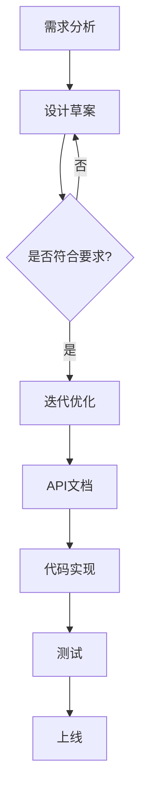
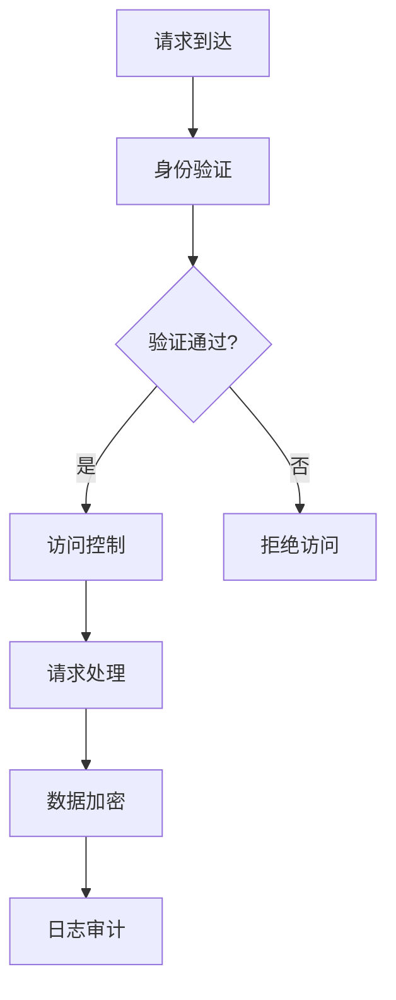
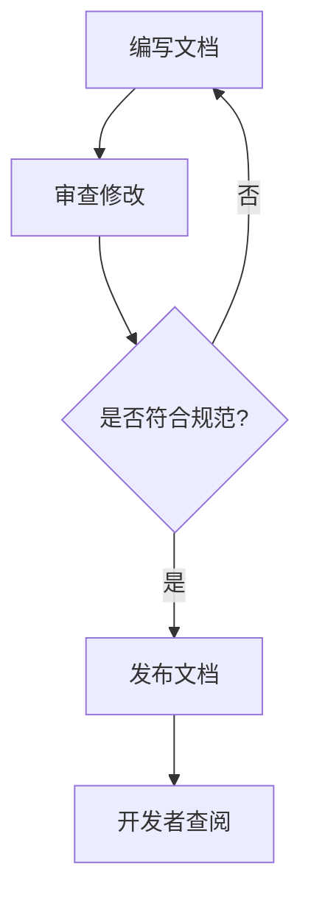
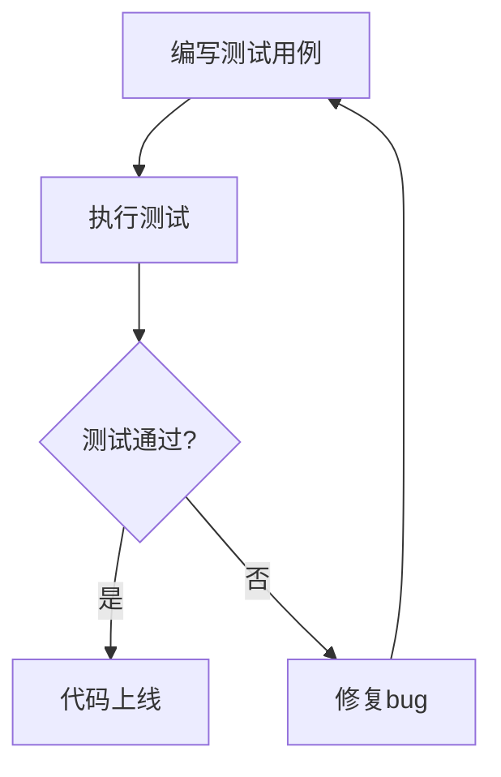

                 

### 文章标题

《API开发与管理：构建开放生态系统》

> 关键词：API开发、API管理、开放生态系统、API设计、API安全、API文档、API测试、微服务架构

> 摘要：本文将深入探讨API开发与管理的核心概念、原理和实践方法。通过分析API在构建开放生态系统中的作用，阐述API设计、安全、文档和测试的最佳实践，以及如何在微服务架构中高效管理API。文章旨在为开发者提供全面的技术指导和实战案例，助力构建稳定、可扩展的API生态系统。

## 1. 背景介绍

### 1.1 API的定义与重要性

应用程序编程接口（Application Programming Interface，简称API）是软件组件之间交互的桥梁，它允许不同的应用程序通过预定义的接口进行通信。API在软件开发的各个领域扮演着至关重要的角色，特别是在构建现代分布式系统和微服务架构中。

API使得开发者能够充分利用现有系统和服务的能力，无需从头开始实现复杂的功能。例如，通过调用社交媒体平台的API，开发者可以在自己的应用程序中集成登录、数据同步等功能，而无需从头开发这些功能。

### 1.2 开放生态系统的概念

开放生态系统是指由多个独立但相互协作的组件组成的系统，这些组件通过API进行通信和数据交换。开放生态系统能够促进创新和效率，因为它允许不同的开发者和组织在各自的领域内专注于特定功能，并通过API将它们集成到一个统一的系统中。

开放生态系统的核心优势在于可扩展性和灵活性。通过标准化的API接口，系统可以轻松扩展新功能，同时保持与现有组件的兼容性。这大大降低了开发成本，提高了系统的可维护性和可扩展性。

### 1.3 API开发与管理的必要性

随着软件系统的复杂性和规模不断扩大，API的开发与管理变得至关重要。有效的API开发与管理不仅能够提高开发效率，还能确保系统的稳定性和安全性。

首先，良好的API设计能够提高系统的可读性和可维护性。一致的接口和清晰的文档有助于开发者快速理解和使用API，降低学习和使用成本。

其次，API安全是保障系统安全的关键。未经授权的访问和数据泄露可能导致严重后果。因此，开发者需要采取一系列安全措施，如身份验证、访问控制和数据加密，来确保API的安全性。

最后，API文档和测试是确保API质量的关键环节。详细的API文档能够帮助开发者了解API的使用方法和限制，而全面的API测试能够发现潜在的问题和漏洞，确保API的稳定性和可靠性。

## 2. 核心概念与联系

### 2.1 API设计

API设计是开发高质量API的第一步。一个良好的API设计应该具备以下特点：

- **简单性**：API应该易于理解和使用，避免复杂的参数和冗余的功能。
- **一致性**：API接口应该保持一致的风格和命名规范，以降低学习成本。
- **可扩展性**：API应该设计为易于扩展，以适应未来的需求变化。

#### Mermaid流程图：



### 2.2 API安全

API安全是确保系统安全的关键。以下是一些关键的API安全措施：

- **身份验证**：使用OAuth、JWT等身份验证机制，确保只有授权用户才能访问API。
- **访问控制**：通过角色权限控制，限制用户对API的访问范围。
- **数据加密**：使用HTTPS、AES等加密技术，保护数据在传输过程中的安全。
- **日志审计**：记录API的访问日志，以便在发生安全事件时进行审计。

#### Mermaid流程图：



### 2.3 API文档

API文档是开发者使用API的指南。一个良好的API文档应该包括以下内容：

- **接口定义**：详细描述API的URL、参数、返回值等。
- **使用示例**：提供使用API的实际示例代码。
- **错误处理**：说明API可能返回的错误代码和原因。

#### Mermaid流程图：



### 2.4 API测试

API测试是确保API质量的关键步骤。以下是一些常见的API测试方法：

- **功能测试**：验证API的功能是否按照预期工作。
- **性能测试**：评估API的响应时间和吞吐量。
- **安全测试**：检测API的安全漏洞和弱点。

#### Mermaid流程图：



## 3. 核心算法原理 & 具体操作步骤

### 3.1 API设计原理

API设计的原则包括：

- **RESTful风格**：使用标准的HTTP方法（GET、POST、PUT、DELETE）来表示操作类型。
- **URL路由**：使用URL来定义API的访问路径。
- **参数传递**：使用查询参数、路径参数或请求体来传递数据。

#### 步骤：

1. 确定API的功能和需求。
2. 设计RESTful风格的接口。
3. 定义URL路由。
4. 确定参数传递方式。

### 3.2 API安全原理

API安全的原理包括：

- **身份验证**：使用OAuth、JWT等机制进行身份验证。
- **访问控制**：使用角色权限控制访问。
- **数据加密**：使用HTTPS、AES等加密技术。
- **安全审计**：记录API的访问日志。

#### 步骤：

1. 选择合适的身份验证机制。
2. 设计角色权限控制策略。
3. 启用HTTPS和数据加密。
4. 定期进行安全审计。

### 3.3 API文档原理

API文档的原理包括：

- **接口定义**：使用Markdown、Swagger等格式描述接口。
- **使用示例**：提供使用API的实际示例代码。
- **错误处理**：说明API可能返回的错误代码和原因。

#### 步骤：

1. 选择文档格式。
2. 编写接口定义。
3. 提供使用示例。
4. 说明错误处理。

### 3.4 API测试原理

API测试的原理包括：

- **功能测试**：验证API的功能是否按照预期工作。
- **性能测试**：评估API的响应时间和吞吐量。
- **安全测试**：检测API的安全漏洞和弱点。

#### 步骤：

1. 编写测试用例。
2. 使用工具（如Postman、JMeter）执行测试。
3. 分析测试结果。
4. 修复发现的问题。

## 4. 数学模型和公式 & 详细讲解 & 举例说明

### 4.1 API性能评估模型

API性能评估可以使用以下数学模型：

\[ P = \frac{TP + TN}{TP + FN + FP + TN} \]

其中：
- \( P \) 是性能得分。
- \( TP \) 是真正的正例。
- \( TN \) 是真正的负例。
- \( FP \) 是错误的正例。
- \( FN \) 是错误的负例。

#### 举例：

假设一个API有100次请求，其中80次是成功的（\( TP + TN = 80 \)），有20次是失败的（\( FP + FN = 20 \)）。那么，性能得分为：

\[ P = \frac{80}{80 + 20} = 0.8 \]

这表示API的性能得分为80%。

### 4.2 API安全模型

API安全可以使用以下模型来评估：

\[ S = \frac{TS + TN}{TS + FS + TN + FF} \]

其中：
- \( S \) 是安全得分。
- \( TS \) 是真正的安全事件。
- \( TN \) 是真正的非安全事件。
- \( FS \) 是假的安全事件。
- \( FF \) 是假的非安全事件。

#### 举例：

假设一个API有100次请求，其中70次是安全的（\( TS + TN = 70 \)），有30次是安全的（\( FS + FF = 30 \)）。那么，安全得分为：

\[ S = \frac{70}{70 + 30} = 0.7 \]

这表示API的安全得分为70%。

### 4.3 API文档质量模型

API文档的质量可以使用以下模型来评估：

\[ Q = \frac{DI + ES}{DI + EI + ES + EI} \]

其中：
- \( Q \) 是文档质量得分。
- \( DI \) 是文档的正确性。
- \( ES \) 是文档的实用性。
- \( EI \) 是文档的易读性。

#### 举例：

假设一个API文档有100个描述，其中90个是正确的（\( DI + ES = 90 \)），有10个是错误的（\( EI + EI = 10 \)）。那么，文档质量得分为：

\[ Q = \frac{90}{90 + 10} = 0.9 \]

这表示API文档的质量得分为90%。

## 5. 项目实践：代码实例和详细解释说明

### 5.1 开发环境搭建

为了演示API开发与管理，我们将使用Python和Flask框架来构建一个简单的RESTful API。

#### 步骤：

1. 安装Python（建议版本3.8及以上）。
2. 安装Flask（使用pip install flask）。

### 5.2 源代码详细实现

以下是一个简单的Flask API示例：

```python
from flask import Flask, jsonify, request

app = Flask(__name__)

@app.route('/api/users', methods=['GET'])
def get_users():
    users = [
        {'id': 1, 'name': 'Alice'},
        {'id': 2, 'name': 'Bob'},
        {'id': 3, 'name': 'Charlie'}
    ]
    return jsonify(users)

@app.route('/api/users/<int:user_id>', methods=['GET'])
def get_user(user_id):
    user = next((u for u in users if u['id'] == user_id), None)
    if user:
        return jsonify(user)
    else:
        return jsonify({'error': 'User not found'}), 404

@app.route('/api/users', methods=['POST'])
def create_user():
    user_data = request.get_json()
    users.append(user_data)
    return jsonify(user_data), 201

if __name__ == '__main__':
    app.run(debug=True)
```

#### 5.2.1 代码解读与分析

- **导入模块**：我们从Flask库中导入了必需的模块，包括Flask本身、用于JSON处理的`jsonify`和用于解析请求体中的JSON数据的`request`。
- **定义Flask应用**：我们创建了一个名为`app`的Flask应用实例。
- **定义路由和视图函数**：
  - `/api/users`：这是一个GET请求的路由，它返回一个包含所有用户的JSON数组。
  - `/api/users/<int:user_id>`：这是一个GET请求的路由，它根据用户ID返回特定用户的详细信息。
  - `/api/users`：这是一个POST请求的路由，它创建一个新的用户并返回其详细信息。

#### 5.2.2 运行结果展示

- **启动应用**：运行`python app.py`启动Flask应用。
- **访问API**：在浏览器中输入`http://localhost:5000/api/users`，将看到如下输出：

```json
[
  {"id": 1, "name": "Alice"},
  {"id": 2, "name": "Bob"},
  {"id": 3, "name": "Charlie"}
]
```

- **访问单个用户**：在浏览器中输入`http://localhost:5000/api/users/1`，将看到如下输出：

```json
{"id": 1, "name": "Alice"}
```

- **创建新用户**：在Postman中，输入以下JSON数据并使用POST方法发送到`http://localhost:5000/api/users`：

```json
{
  "id": 4,
  "name": "Diana"
}
```

将得到如下响应：

```json
{"id": 4, "name": "Diana"}
```

## 6. 实际应用场景

### 6.1 社交媒体平台

社交媒体平台广泛使用API来提供外部访问其服务和数据的能力。例如，开发者可以集成Facebook的API来获取用户数据、发布内容或实现社交互动功能。

### 6.2 金融系统

金融系统中的API允许第三方服务访问账户信息、交易记录和账户余额。这有助于提高金融服务的透明度和便利性，同时也为金融创新提供了可能。

### 6.3 电子商务平台

电子商务平台通过API提供商品目录、购物车、支付和物流等功能。这使开发者能够轻松集成电子商务功能到自己的应用程序中，而无需从头开始实现所有功能。

## 7. 工具和资源推荐

### 7.1 学习资源推荐

- **书籍**：《RESTful Web API设计》、《API设计：原则、实践与范例》
- **论文**：《RESTful Web服务的原则和最佳实践》、《API设计模式：构建高效的API》
- **博客**：Dzone、Stack Overflow、Martin Fowler的博客
- **网站**：Swagger、Postman

### 7.2 开发工具框架推荐

- **API设计工具**：Swagger、OpenAPI
- **API测试工具**：Postman、JMeter
- **身份验证框架**：OAuth 2.0、JSON Web Token (JWT)

### 7.3 相关论文著作推荐

- **论文**：《RESTful API设计：原则和最佳实践》、《API安全性：挑战与解决方案》
- **著作**：《微服务设计》、《领域驱动设计：软件核心复杂性应对策略》

## 8. 总结：未来发展趋势与挑战

### 8.1 发展趋势

- **API网关**：随着API数量的增加，API网关技术将变得更加重要，用于集中管理和路由API请求。
- **标准化**：API标准化将持续发展，以简化API设计和集成过程。
- **自动化**：自动化工具和框架将帮助开发者更高效地设计和维护API。

### 8.2 挑战

- **安全性**：确保API安全性将是一个持续性的挑战，开发者需要不断更新安全策略和措施。
- **性能优化**：随着API数量的增加，性能优化将成为一个重要议题。
- **文档和测试**：保持API文档和测试的更新将是一个挑战，特别是在快速迭代的开发环境中。

## 9. 附录：常见问题与解答

### 9.1 什么是API？

API是应用程序编程接口，允许不同的软件组件通过预定义的接口进行通信和交互。

### 9.2 API设计与性能有何关系？

良好的API设计可以显著提高性能。例如，通过合理组织接口、减少冗余调用、优化数据传输等，可以提高API的响应速度和吞吐量。

### 9.3 如何确保API的安全性？

确保API安全性可以通过使用身份验证机制（如OAuth、JWT）、实施访问控制和数据加密（如HTTPS、AES）以及定期进行安全审计来实现。

### 9.4 API文档的重要性是什么？

API文档是开发者使用API的指南，它提供了接口定义、使用示例和错误处理信息，有助于降低学习和使用成本，提高开发效率。

## 10. 扩展阅读 & 参考资料

- **书籍**：《API设计：原则、实践与范例》、《RESTful API设计：原则、实践与范例》
- **论文**：《RESTful Web服务的原则和最佳实践》、《API设计模式：构建高效的API》
- **在线资源**：Swagger、OpenAPI、Postman
- **博客**：Dzone、Stack Overflow、Martin Fowler的博客
- **论坛**：Reddit、Stack Overflow

---

### 文章结束

---

> 作者：禅与计算机程序设计艺术 / Zen and the Art of Computer Programming

