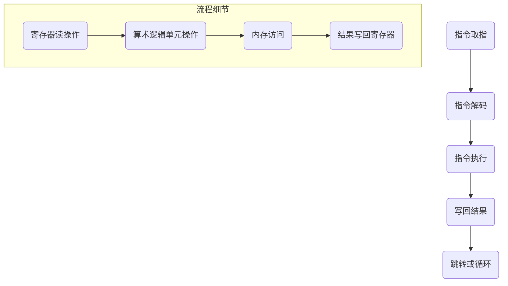
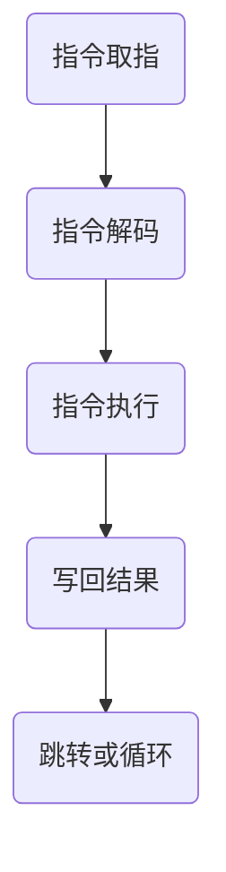

                 

### 1. 背景介绍

ARM（Advanced RISC Machines）架构，作为全球范围内广泛使用的一种处理器架构，已经成为移动和嵌入式设备的核心。ARM处理器以其低功耗、高性能的特点，在智能手机、平板电脑、嵌入式系统等领域占据主导地位。自从1990年代初由ARM公司推出以来，ARM架构经历了多次迭代和改进，逐步成为现代电子设备中的核心技术。

#### ARM架构的发展历程

ARM架构的发展历程可以追溯到20世纪80年代末。当时，英国ARM公司成立，致力于研发高性能、低功耗的微处理器。1985年，ARM公司推出了第一款处理器设计——ARM1，这是一款基于精简指令集计算（RISC）的处理器，标志着ARM架构的诞生。随后的几年里，ARM公司继续推出了一系列处理器，如ARM2、ARM3和ARM6等，这些处理器逐渐在各种嵌入式设备中得到应用。

进入21世纪，ARM架构迎来了快速发展期。2004年，ARM公司发布了ARM9系列处理器，进一步提高了处理器的性能和功耗效率。随后，ARM公司又推出了ARM11系列处理器，该系列处理器在性能和能效方面都取得了显著提升。到了2008年，ARM公司发布了Cortex-A系列处理器，这一系列处理器在移动设备市场中取得了巨大的成功。

#### ARM架构在现代设备中的应用

随着智能手机、平板电脑等移动设备的普及，ARM架构已经成为这些设备的核心。其低功耗、高性能的特点使得ARM处理器能够满足移动设备对性能和续航的需求。例如，苹果公司的iPhone、iPad等设备都采用了ARM架构的处理器，使得这些设备在运行速度和电池续航方面具有显著优势。

此外，ARM架构在嵌入式系统中的应用也非常广泛。嵌入式系统通常需要处理大量的实时任务，如工业控制、汽车电子、医疗设备等。ARM架构的处理器因其强大的处理能力和低功耗特性，成为嵌入式系统设计中的首选。

#### ARM架构的优势

ARM架构之所以能够成为移动和嵌入式设备的核心，主要得益于以下几个方面的优势：

1. **低功耗**：ARM处理器采用了RISC架构，指令集简单且执行速度快，功耗相对较低。这对于移动设备和嵌入式设备来说非常重要，因为低功耗可以延长设备的电池寿命。

2. **高性能**：随着Cortex-A系列处理器的推出，ARM架构在性能方面也取得了显著提升。现代ARM处理器能够快速执行复杂的任务，满足高性能计算的需求。

3. **灵活性**：ARM处理器具有高度的可定制性，可以根据不同应用场景进行优化。这使得ARM处理器能够适应各种嵌入式系统的需求。

4. **广泛的生态系统**：ARM架构拥有庞大的开发者和用户社区，提供丰富的开发工具和资源。这使得ARM架构在应用和推广方面具有很大的优势。

总之，ARM架构作为移动和嵌入式设备的核心，凭借其低功耗、高性能、灵活性和广泛的生态系统，已经成为现代电子设备中的重要组成部分。随着技术的不断发展和创新，ARM架构在未来将继续发挥重要作用。

### 2. 核心概念与联系

要深入理解ARM架构，我们需要首先了解几个核心概念，这些概念不仅定义了ARM处理器的工作原理，还解释了它们在移动和嵌入式设备中的应用。

#### RISC架构

ARM架构属于精简指令集计算（RISC）架构。与复杂指令集计算（CISC）架构相比，RISC架构的特点是指令集简单、执行速度快，并且大多数指令在一个时钟周期内完成。这种设计使得ARM处理器能够高效地执行指令，从而提高处理器的性能和能效。

RISC架构的核心思想是将复杂操作分解为一系列简单指令，通过流水线技术实现指令的并行处理。这使得ARM处理器能够快速执行大量的指令，从而实现高性能计算。

#### 寄存器文件

ARM处理器内部包含一个寄存器文件，用于存储操作数和中间结果。寄存器文件通常包含通用寄存器、状态寄存器和特殊寄存器。通用寄存器用于存储操作数和计算结果，状态寄存器用于保存程序状态，如程序计数器、标志寄存器等。

#### 指令集

ARM处理器使用一种特定的指令集，包括数据传输指令、算术逻辑运算指令、控制流指令等。这些指令定义了处理器可以执行的操作，是ARM处理器工作的基础。

#### 处理器模式

ARM处理器支持多种处理器模式，如用户模式、系统模式、特权模式等。每种模式具有不同的权限和功能，用于实现系统的安全性和稳定性。

#### 异步和同步设计

ARM处理器采用异步和同步设计相结合的方式。异步设计使得处理器可以在不需要时钟信号的情况下进行操作，从而提高能效。同步设计则通过时钟信号确保指令的正确执行顺序。

#### Mermaid流程图

为了更直观地展示ARM架构的核心概念和工作原理，我们使用Mermaid流程图来描述ARM处理器的基本操作流程。



在这个流程图中，A到E表示了ARM处理器的基本操作流程，从指令取指、解码、执行到写回结果。F1到F4则展示了操作过程中涉及的具体操作细节，如寄存器读操作、算术逻辑单元操作、内存访问和结果写回寄存器。

#### 核心概念的联系

上述核心概念共同构成了ARM处理器的工作原理。RISC架构确保了处理器的高效性，寄存器文件提供了快速的存储操作数和中间结果的能力，指令集定义了处理器可以执行的操作，处理器模式确保了系统的安全性和稳定性，异步和同步设计则提高了处理器的能效。

通过这些核心概念的联系，ARM处理器能够高效地执行指令，满足移动和嵌入式设备对性能和功耗的需求。这种设计不仅使得ARM处理器在性能上具备优势，还保证了其在低功耗、高性能和灵活性方面的优势。

### 3. 核心算法原理 & 具体操作步骤

在理解了ARM架构的核心概念之后，我们接下来将探讨其核心算法原理和具体操作步骤。ARM处理器的设计目标是实现高效、低功耗的计算，其核心算法——精简指令集计算（RISC）原理正是实现这一目标的基石。

#### 精简指令集计算（RISC）原理

RISC架构的核心思想是将复杂的操作分解为一系列简单的指令，并通过流水线技术实现并行处理。RISC处理器具有以下几个特点：

1. **指令集简单**：RISC指令集包含一些基本的操作，如数据传输、算术运算和逻辑运算。这些指令简单且易于理解和实现。

2. **单周期执行**：大多数RISC指令在一个时钟周期内完成，这使得处理器的时钟频率可以更高，从而提高处理速度。

3. **硬布线逻辑**：RISC处理器使用硬布线逻辑来实现指令操作，避免了微程序控制带来的开销。

4. **寄存器操作**：RISC处理器强调使用寄存器进行操作，减少了内存访问的次数，提高了数据处理的速度。

5. **流水线技术**：RISC处理器采用流水线技术，将指令的执行分为多个阶段，如取指、解码、执行、写回等。这样可以提高指令的吞吐率。

#### ARM处理器的操作步骤

ARM处理器的操作步骤可以分为以下几个阶段：

1. **指令取指（Instruction Fetch）**：处理器从内存中读取指令。这一过程通常由程序计数器（PC）控制，PC指向下一条要执行的指令地址。

2. **指令解码（Instruction Decode）**：处理器对读取到的指令进行解码，确定指令的类型和操作数。解码后的指令会生成操作控制信号，指示处理器如何执行指令。

3. **指令执行（Instruction Execute）**：处理器根据解码结果执行指令。这一阶段可能包括数据传输、算术逻辑运算或内存访问等操作。

4. **写回结果（Write Back）**：将指令执行的结果写回寄存器文件或内存。这样，处理器可以在后续的指令中使用这些结果。

5. **跳转或循环（Branch or Loop）**：某些指令需要处理器进行跳转或循环，改变程序执行的顺序。跳转指令会更新程序计数器，指向新的指令地址。

#### 流程图

为了更直观地展示ARM处理器的操作步骤，我们使用Mermaid流程图来描述。



在这个流程图中，A到E表示了ARM处理器的基本操作步骤，从指令取指、解码、执行到写回结果，以及可能的跳转或循环操作。

#### 操作步骤的详细解释

1. **指令取指**：在指令取指阶段，处理器从内存中读取下一条指令。程序计数器（PC）指向当前指令的地址，处理器通过内存访问单元从该地址读取指令。

2. **指令解码**：在指令解码阶段，处理器对读取到的指令进行解码，确定指令的类型和操作数。解码后的指令会生成操作控制信号，指示处理器如何执行指令。例如，如果指令是一个加法操作，操作控制信号会指示处理器将两个操作数相加。

3. **指令执行**：在指令执行阶段，处理器根据解码结果执行指令。这一阶段可能包括数据传输、算术逻辑运算或内存访问等操作。例如，如果指令是一个数据传输操作，处理器会将源操作数复制到目标操作数。

4. **写回结果**：在写回结果阶段，处理器将指令执行的结果写回寄存器文件或内存。这样，处理器可以在后续的指令中使用这些结果。例如，如果指令是一个加法操作，处理器会将结果写回到目标寄存器。

5. **跳转或循环**：某些指令需要处理器进行跳转或循环，改变程序执行的顺序。跳转指令会更新程序计数器，指向新的指令地址。例如，如果一个跳转指令的目标地址是内存中的一个位置，处理器会跳转到该位置继续执行指令。

通过上述操作步骤，ARM处理器能够高效地执行指令，满足移动和嵌入式设备对性能和功耗的需求。RISC架构的原理和操作步骤使得ARM处理器在低功耗、高性能和灵活性方面具备显著优势。

### 4. 数学模型和公式 & 详细讲解 & 举例说明

在深入理解ARM处理器的工作原理后，我们接下来将探讨其背后的数学模型和公式，并通过具体例子来说明这些公式如何应用。

#### 数学模型和公式

ARM处理器的设计和操作涉及多种数学模型和公式，以下列出几个核心的模型和公式：

1. **寄存器文件访问时间**：
   $$ T_{\text{register}} = C_{\text{register}} \times N $$
   其中，$T_{\text{register}}$ 是寄存器文件的访问时间（单位：时钟周期），$C_{\text{register}}$ 是寄存器的访问时间（单位：时钟周期），$N$ 是访问次数。

2. **内存访问时间**：
   $$ T_{\text{memory}} = C_{\text{memory}} + T_{\text{latency}} $$
   其中，$T_{\text{memory}}$ 是内存访问时间（单位：时钟周期），$C_{\text{memory}}$ 是内存访问时间（单位：时钟周期），$T_{\text{latency}}$ 是内存延迟（单位：时钟周期）。

3. **流水线吞吐率**：
   $$ T_{\text{pipeline}} = \frac{1}{T_{\text{clock}} \times (1 - p)} $$
   其中，$T_{\text{pipeline}}$ 是流水线的吞吐率（单位：指令/时钟周期），$T_{\text{clock}}$ 是时钟周期（单位：秒），$p$ 是流水线利用率（0 ≤ p ≤ 1）。

4. **处理器性能**：
   $$ P = \frac{T_{\text{instruction}}}{T_{\text{clock}}} $$
   其中，$P$ 是处理器性能（单位：指令/时钟周期），$T_{\text{instruction}}$ 是平均指令执行时间（单位：时钟周期）。

#### 详细讲解

1. **寄存器文件访问时间**：

   寄存器文件是ARM处理器中的一个关键组件，用于存储操作数和中间结果。访问寄存器文件的时间取决于寄存器的访问时间和访问次数。假设每个寄存器的访问时间为1个时钟周期，我们需要访问100次寄存器文件，那么总的访问时间将是100个时钟周期。

   公式中的$C_{\text{register}}$表示单个寄存器的访问时间，$N$表示访问次数。例如，如果$C_{\text{register}} = 1$个时钟周期，$N = 100$，则$T_{\text{register}} = 1 \times 100 = 100$个时钟周期。

2. **内存访问时间**：

   内存访问时间包括内存访问时间和内存延迟。内存访问时间是指处理器访问内存所需的时间，而内存延迟是指数据从内存传输到处理器的时间。

   公式中的$C_{\text{memory}}$表示内存访问时间，$T_{\text{latency}}$表示内存延迟。例如，如果$C_{\text{memory}} = 10$个时钟周期，$T_{\text{latency}} = 5$个时钟周期，则$T_{\text{memory}} = 10 + 5 = 15$个时钟周期。

3. **流水线吞吐率**：

   流水线技术是ARM处理器中的一个关键特性，它通过将指令的执行过程分解为多个阶段，实现指令的并行处理。流水线的吞吐率取决于时钟周期和流水线利用率。

   公式中的$T_{\text{pipeline}}$表示流水线的吞吐率，$T_{\text{clock}}$表示时钟周期，$p$表示流水线利用率。例如，如果时钟周期为10毫秒，流水线利用率为0.8，则$T_{\text{pipeline}} = \frac{1}{10 \times 10^{-3} \times (1 - 0.8)} = 1000$条指令/秒。

4. **处理器性能**：

   处理器性能通常用每秒执行的指令数来衡量。公式中的$P$表示处理器性能，$T_{\text{instruction}}$表示平均指令执行时间。

   公式中的$T_{\text{instruction}}$表示平均指令执行时间，如果处理器每秒执行1000条指令，平均指令执行时间为1个时钟周期，则处理器性能为1000条指令/秒。

#### 举例说明

假设一个ARM处理器每个时钟周期可以执行1条指令，流水线利用率为0.8，需要执行1000条指令。那么：

- 流水线吞吐率：$$ T_{\text{pipeline}} = \frac{1}{T_{\text{clock}} \times (1 - p)} = \frac{1}{10 \times 10^{-3} \times (1 - 0.8)} = 1000 \text{条指令/秒} $$
- 处理器性能：$$ P = \frac{T_{\text{instruction}}}{T_{\text{clock}}} = \frac{1}{1} = 1 \text{条指令/时钟周期} $$

通过这个例子，我们可以看到ARM处理器通过流水线技术实现了高效的指令执行，每秒可以处理1000条指令。

通过上述数学模型和公式的讲解，我们可以更好地理解ARM处理器的工作原理和性能表现。这些模型和公式为处理器设计、优化和评估提供了重要的理论依据。

### 5. 项目实践：代码实例和详细解释说明

#### 5.1 开发环境搭建

为了更好地理解和实践ARM架构，我们需要搭建一个合适的开发环境。以下是一个基本的开发环境搭建步骤：

1. **安装编译工具**：首先，我们需要安装ARM编译工具，例如GNU Arm Embedded Toolchain。可以从官方网站下载最新版本，并按照说明进行安装。

2. **配置集成开发环境（IDE）**：我们可以选择一个适合的IDE，如Eclipse、JetBrains CLion等。在IDE中安装ARM工具链插件，以便能够进行ARM汇编和C语言编程。

3. **创建新项目**：在IDE中创建一个新的ARM项目，选择合适的处理器架构和编译器设置。

4. **配置调试器**：配置GDB（GNU Debugger），以便进行程序的调试和调试。

#### 5.2 源代码详细实现

以下是一个简单的ARM汇编程序示例，用于实现一个简单的计算器功能。这个程序接收用户输入的两个整数，并计算它们的和。

```assembly
    .global main
    .syntax unified
    .text

main:
    push {r4, r5, lr}  ; 保存寄存器和返回地址

    ldr r0, =prompt1  ; 载入第一个提示信息
    bl printf         ; 调用打印函数

    ldr r0, =num1     ; 载入第一个数字
    bl scanf          ; 调用输入函数

    ldr r1, =prompt2  ; 载入第二个提示信息
    bl printf         ; 调用打印函数

    ldr r0, =num2     ; 载入第二个数字
    bl scanf          ; 调用输入函数

    add r2, r0, r1    ; 计算和
    mov r0, r2        ; 将结果保存到r0

    ldr r0, =result   ; 载入结果提示信息
    bl printf         ; 调用打印函数

    pop {r4, r5, pc}  ; 恢复寄存器和返回地址

.data
prompt1: .asciz "Enter the first number: "
prompt2: .asciz "Enter the second number: "
result: .asciz "The sum is: %d\n"

.extern printf, scanf
```

#### 5.3 代码解读与分析

这段代码实现了简单的计算器功能，以下是详细的代码解读与分析：

1. **函数声明**：

   ```assembly
   .global main
   .syntax unified
   .text
   ```

   这三行声明了`main`函数的全局属性，并指定了汇编代码的语法格式和代码段。

2. **函数开始**：

   ```assembly
   main:
       push {r4, r5, lr}  ; 保存寄存器和返回地址
   ```

   在函数开始时，我们使用`push`指令保存了`r4`、`r5`和链接寄存器（`lr`），这是为了在函数执行完毕后能够正确地恢复这些寄存器的值。

3. **打印第一个提示信息**：

   ```assembly
   ldr r0, =prompt1  ; 载入第一个提示信息
   bl printf         ; 调用打印函数
   ```

   `ldr`指令从内存中加载第一个提示信息（存储在`prompt1`标签处），然后将它传递给`r0`寄存器。接着，使用`bl`指令调用`printf`函数来打印提示信息。

4. **读取第一个数字**：

   ```assembly
   ldr r0, =num1     ; 载入第一个数字
   bl scanf          ; 调用输入函数
   ```

   类似地，`ldr`指令加载了第一个数字（存储在`num1`标签处），然后通过`bl`指令调用`scanf`函数来读取用户输入。

5. **打印第二个提示信息**：

   ```assembly
   ldr r1, =prompt2  ; 载入第二个提示信息
   bl printf         ; 调用打印函数
   ```

   `ldr`指令加载了第二个提示信息（存储在`prompt2`标签处），然后通过`bl`指令调用`printf`函数来打印提示信息。

6. **读取第二个数字**：

   ```assembly
   ldr r0, =num2     ; 载入第二个数字
   bl scanf          ; 调用输入函数
   ```

   `ldr`指令加载了第二个数字（存储在`num2`标签处），然后通过`bl`指令调用`scanf`函数来读取用户输入。

7. **计算和**：

   ```assembly
   add r2, r0, r1    ; 计算和
   mov r0, r2        ; 将结果保存到r0
   ```

   `add`指令将第一个数字（在`r0`寄存器中）和第二个数字（在`r1`寄存器中）相加，结果存储在`r2`寄存器中。接着，`mov`指令将结果从`r2`寄存器复制到`r0`寄存器，以便在接下来的打印操作中使用。

8. **打印结果**：

   ```assembly
   ldr r0, =result   ; 载入结果提示信息
   bl printf         ; 调用打印函数
   ```

   `ldr`指令加载了结果提示信息（存储在`result`标签处），然后通过`bl`指令调用`printf`函数来打印结果。

9. **函数结束**：

   ```assembly
   pop {r4, r5, pc}  ; 恢复寄存器和返回地址
   ```

   在函数结束时，使用`pop`指令恢复之前保存的寄存器（`r4`和`r5`）和返回地址（`pc`），以确保程序能够正确返回。

#### 5.4 运行结果展示

假设用户输入了两个数字：10和20，程序将执行以下操作：

1. 打印提示信息：`Enter the first number:`
2. 读取数字10
3. 打印提示信息：`Enter the second number:`
4. 读取数字20
5. 计算和：10 + 20 = 30
6. 打印结果：`The sum is: 30`

通过这个简单的例子，我们可以看到ARM汇编程序是如何实现具体功能的。尽管这个例子相对简单，但它展示了ARM汇编程序的核心结构和操作方式。通过进一步的实践和深入学习，我们可以开发更复杂和功能丰富的ARM应用程序。

### 6. 实际应用场景

ARM架构由于其低功耗、高性能和灵活性，广泛应用于各种实际应用场景，从智能手机到嵌入式系统，再到数据中心，ARM处理器都在其中发挥着关键作用。

#### 智能手机

智能手机是ARM架构最典型的应用场景之一。现代智能手机对处理能力、电池续航和用户体验有极高的要求。ARM处理器通过其优化的RISC架构，能够高效地处理复杂的图形和多媒体任务，同时保持低功耗。例如，苹果的A系列处理器、三星的Exynos处理器以及高通的Snapdragon处理器，都采用了ARM架构，这些处理器在性能和功耗方面取得了卓越的表现，使得智能手机在移动计算领域占据了主导地位。

#### 嵌入式系统

嵌入式系统广泛应用于各种领域，如工业控制、汽车电子、医疗设备、智能家居等。ARM架构的灵活性和可定制性使其成为嵌入式系统设计者的首选。嵌入式系统通常需要处理实时任务，并且对功耗和尺寸有严格要求。ARM处理器通过提供多种处理器模式和优化的指令集，能够满足这些系统的需求。例如，在汽车电子领域，ARM处理器被用于车辆的自动驾驶系统、车载娱乐系统和安全控制系统，这些系统对实时性和可靠性有极高的要求。

#### 数据中心

随着云计算和大数据的发展，数据中心对计算能力和能效的需求不断增加。ARM架构在数据中心的应用正在迅速增长，特别是通过ARM服务器处理器。ARM服务器处理器以其低功耗、高性能的特点，能够提高数据中心的能效，降低运营成本。例如，谷歌和微软等大型云计算公司已经将ARM处理器应用于其数据中心，以优化其基础设施的性能和效率。此外，ARM处理器还在人工智能和机器学习领域发挥着重要作用，通过加速这些领域的计算任务，提高数据处理能力。

#### 物联网

物联网（IoT）是ARM架构的另一个重要应用场景。物联网设备通常具有多样化的功能和苛刻的功耗要求。ARM架构的低功耗特性使其成为物联网设备的理想选择。例如，在智能家居领域，ARM处理器被用于智能门锁、智能照明和智能温控系统，这些设备需要长时间运行，且对电池寿命有严格要求。在工业物联网中，ARM处理器被用于传感器、控制器和网关等设备，以实现实时数据采集和控制。

#### 实际应用案例

1. **苹果iPhone**：苹果的iPhone系列智能手机采用了ARM架构的处理器，如A系列处理器，这些处理器在性能和功耗方面都表现出色，为用户提供了卓越的移动计算体验。

2. **特斯拉自动驾驶系统**：特斯拉的自动驾驶系统采用了ARM处理器，用于处理大量的实时数据，实现车辆的自动驾驶功能。

3. **谷歌数据中心**：谷歌使用ARM服务器处理器构建其数据中心，以优化计算性能和能效，提高云计算服务的效率。

4. **智能家居设备**：智能门锁、智能照明和智能温控系统等智能家居设备广泛采用ARM处理器，以实现低功耗和长时间运行。

ARM架构在智能手机、嵌入式系统、数据中心、物联网等领域的广泛应用，展示了其强大的适应性和技术优势。随着技术的不断进步和市场的需求变化，ARM架构将继续在各个领域发挥重要作用。

### 7. 工具和资源推荐

#### 7.1 学习资源推荐

为了深入理解和掌握ARM架构，以下是一些推荐的学习资源：

1. **书籍**：
   - 《ARM System Developer’s Guide: Designing and Optimizing System Software》
   - 《ARM Architecture Reference Manual》
   - 《The Definitive Guide to ARM® Cortex-M3 and Cortex-M4 Processors》

2. **论文**：
   - "The ARM Architecture Program: Update 2011"
   - "ARMv8-A architecture reference manual"
   - "ARM Cortex-A series processors technical reference manual"

3. **博客和网站**：
   - ARM官方网站：[www.arm.com](http://www.arm.com)
   - ARM Community：[community.arm.com](http://community.arm.com)
   - Linux on ARM：[www.linuxarm.org](http://www.linuxarm.org)

#### 7.2 开发工具框架推荐

1. **编译器和工具链**：
   - GNU Arm Embedded Toolchain：[developer.arm.com/arm-toolchain](https://developer.arm.com/arm-toolchain)
   - Keil MDK-ARM：[www.keil.com/arm/MDK](http://www.keil.com/arm/MDK)

2. **集成开发环境（IDE）**：
   - Eclipse：[www.eclipse.org/eclipse](http://www.eclipse.org/eclipse)
   - JetBrains CLion：[www.jetbrains.com/clion](http://www.jetbrains.com/clion)

3. **调试器**：
   - GDB：[www.gnu.org/software/gdb](http://www.gnu.org/software/gdb)
   - JTAG调试器：如Lauterbach JTAG或IAR JTAG

4. **模拟器和仿真工具**：
   - QEMU：[www.qemu.org](http://www.qemu.org)
   - ARM DS-5：[www.arm.com/arm-ds-5](http://www.arm.com/arm-ds-5)

#### 7.3 相关论文著作推荐

1. **《ARM System Architecture for ARM Cortex-A8 and Cortex-A9 Processors》**：详细介绍了ARM Cortex-A8和Cortex-A9处理器的系统架构和编程接口。

2. **《ARM Architecture Reference Manual: ARMv7-A and ARMv7-R edition》**：全面介绍了ARMv7-A和ARMv7-R架构的详细技术规范。

3. **《ARM Cortex-M3 Data Sheet》**：提供了ARM Cortex-M3处理器的技术规格和详细说明。

这些资源和工具将帮助读者更深入地了解ARM架构，掌握其设计原理和应用实践。

### 8. 总结：未来发展趋势与挑战

ARM架构在移动和嵌入式设备领域的广泛应用证明了其强大的技术优势和广阔的前景。然而，随着技术的不断进步和市场的需求变化，ARM架构也面临着一系列新的发展趋势和挑战。

#### 发展趋势

1. **高性能计算**：随着人工智能和机器学习技术的快速发展，对高性能计算的需求不断增加。ARM架构通过引入高性能处理器架构，如Cortex-A78和Cortex-X系列，不断提升处理器的性能，以满足这些新兴应用的需求。

2. **低功耗设计**：随着物联网和可穿戴设备的普及，对低功耗处理器的需求越来越重要。ARM架构将继续优化其设计，提高能效，以满足这些设备对电池寿命的要求。

3. **多核架构**：多核处理器已成为现代计算系统的主流。ARM架构通过引入多核设计，如Cortex-A77和Cortex-X1，提升处理器的并行处理能力，进一步提高系统的性能。

4. **安全性和可靠性**：随着网络安全和数据隐私问题的日益突出，ARM架构将加强安全性和可靠性设计，推出具有硬件安全功能的处理器，如TrustZone。

5. **云计算和数据中心**：ARM架构在云计算和数据中心领域的应用正在迅速增长。通过优化设计，提高能效，ARM处理器将为数据中心提供更高效、更环保的解决方案。

#### 挑战

1. **竞争压力**：随着Intel、AMD等竞争对手的崛起，ARM架构面临着越来越大的竞争压力。如何在性能、功耗和成本之间找到平衡点，保持竞争优势，是ARM架构需要面对的挑战。

2. **生态系统建设**：ARM架构的广泛采用离不开一个强大的开发者生态系统。然而，建立和维护一个健康、活跃的生态系统需要付出巨大的努力和资源。

3. **软件兼容性**：随着ARM架构的演进，软件兼容性问题成为一个挑战。如何在保持兼容性的同时，引入新的功能和特性，是一个需要解决的关键问题。

4. **硬件安全**：随着网络攻击的日益复杂，硬件安全成为ARM架构需要重点关注的问题。如何设计出既高性能又安全的处理器，是ARM架构面临的重要挑战。

总之，ARM架构在未来将继续在移动和嵌入式设备领域发挥重要作用，同时面临一系列新的发展趋势和挑战。通过不断优化设计、提升性能和安全性，ARM架构有望在更广泛的领域取得成功。

### 9. 附录：常见问题与解答

#### 问题 1：ARM架构和x86架构有什么区别？

ARM架构和x86架构是两种不同的处理器架构。ARM架构是基于精简指令集计算（RISC）的架构，其指令集相对简单，每个指令在一个时钟周期内完成，这使得ARM处理器能够高效地执行指令，同时保持低功耗。相比之下，x86架构是基于复杂指令集计算（CISC）的架构，其指令集复杂，每个指令可能需要多个时钟周期才能完成，但提供了丰富的指令集和高级特性。

#### 问题 2：ARM处理器在移动设备中的优势是什么？

ARM处理器在移动设备中的优势主要体现在以下几个方面：

1. **低功耗**：ARM处理器通过精简指令集和优化设计，实现了低功耗，这有助于延长移动设备的电池续航。
2. **高性能**：随着Cortex-A系列处理器的推出，ARM处理器的性能不断提升，能够高效地执行复杂的计算任务。
3. **灵活性**：ARM处理器具有高度的可定制性，可以根据不同应用场景进行优化，满足多样化的需求。
4. **广泛的生态系统**：ARM架构拥有庞大的开发者社区和丰富的开发资源，支持各种开发工具和框架，为开发者提供了便利。

#### 问题 3：ARM处理器在嵌入式系统中的应用有哪些？

ARM处理器在嵌入式系统中的应用非常广泛，包括以下几个方面：

1. **工业控制**：ARM处理器被用于工业自动化系统，如机器人、PLC（可编程逻辑控制器）等，实现实时控制和数据处理。
2. **汽车电子**：ARM处理器被用于汽车电子系统，如车载娱乐系统、自动驾驶系统等，提供高性能和低功耗的解决方案。
3. **医疗设备**：ARM处理器被用于医疗设备，如医疗图像处理、医疗传感器等，实现高效的数据处理和实时监测。
4. **智能家居**：ARM处理器被用于智能家居设备，如智能门锁、智能照明、智能温控系统等，提供低功耗、长时间运行的解决方案。

#### 问题 4：ARM架构的未来发展趋势是什么？

ARM架构的未来发展趋势主要体现在以下几个方面：

1. **高性能计算**：随着人工智能和机器学习技术的发展，ARM架构将不断提升处理器的性能，满足高性能计算的需求。
2. **低功耗设计**：随着物联网和可穿戴设备的普及，ARM架构将继续优化设计，提高能效，以满足低功耗的需求。
3. **多核架构**：多核处理器将成为主流，ARM架构将通过引入更多核心和优化设计，提高处理器的并行处理能力。
4. **安全性和可靠性**：随着网络安全和数据隐私问题的日益突出，ARM架构将加强安全性和可靠性设计，提供更安全的解决方案。
5. **云计算和数据中心**：ARM架构将在云计算和数据中心领域发挥更大的作用，通过优化设计，提高能效，提供更高效的计算解决方案。

### 10. 扩展阅读 & 参考资料

为了更深入地了解ARM架构和相关技术，以下是推荐的扩展阅读和参考资料：

1. **书籍**：
   - 《ARM System Developer’s Guide: Designing and Optimizing System Software》
   - 《ARM Architecture Reference Manual》
   - 《The Definitive Guide to ARM® Cortex-M3 and Cortex-M4 Processors》

2. **论文**：
   - "The ARM Architecture Program: Update 2011"
   - "ARMv8-A architecture reference manual"
   - "ARM Cortex-A series processors technical reference manual"

3. **在线课程**：
   - Coursera：[ARM Architecture](https://www.coursera.org/courses?query=ARM%20Architecture)
   - Udemy：[ARM Processor Fundamentals](https://www.udemy.com/course/arm-processor-fundamentals/)

4. **官方文档**：
   - ARM官方网站：[www.arm.com](http://www.arm.com)
   - ARM开发者社区：[community.arm.com](http://community.arm.com)

通过这些书籍、论文、在线课程和官方文档，读者可以更全面地了解ARM架构的设计原理、应用实践和发展趋势。

