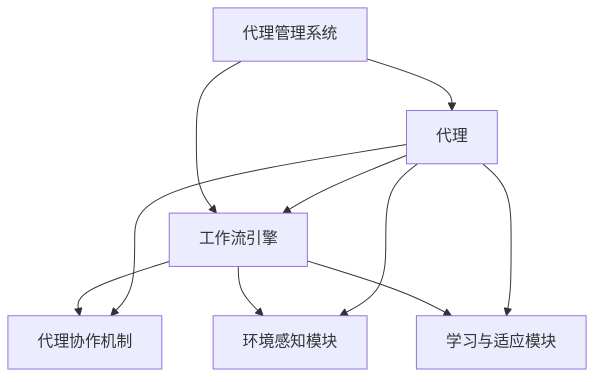

                 

### 背景介绍

在当今高度互联和快速发展的数字化世界中，企业的运营模式正在经历深刻的变革。传统的工作流程往往依赖于线性的操作顺序和明确的职责分工，这在一定程度上提高了工作效率，但也暴露了其固有的局限性。尤其是在面对复杂、多变和高度动态的环境时，这些传统的工作流程往往显得力不从心。为了应对这些挑战，Agentic Workflow（代理型工作流）的概念应运而生。

Agentic Workflow 是一种基于人工智能和代理技术的先进工作流管理方法。它通过引入自主智能代理（Agentic Agents），在无需人工干预的情况下，能够自动执行、协调和优化复杂的工作任务。这种工作流管理模式不仅能够提高工作效率，还能大幅度降低运营成本，并且显著提升企业的灵活性和响应速度。

随着人工智能技术的不断发展，代理型工作流已经成为学术界和工业界研究的热点领域。许多企业和研究机构都在积极探索和应用这种新型工作流技术，以期在激烈的市场竞争中占据优势。例如，金融行业通过代理型工作流实现了自动化风险评估和投资决策；医疗行业利用代理型工作流提高了患者管理效率和医疗资源的利用率。

本文将深入探讨 Agentic Workflow 的市场潜力，从其核心概念、技术原理、应用场景、工具和资源等方面进行详细分析，旨在为读者提供一份全面、系统的技术指南。通过本文的阅读，读者将能够了解 Agentic Workflow 的基本原理和实际应用价值，为其在业务和学术领域的进一步研究和应用打下坚实基础。

### 核心概念与联系

#### 1. 定义

Agentic Workflow，即代理型工作流，是一种利用自主智能代理（Agentic Agents）来管理和执行工作任务的系统。自主智能代理是指能够在复杂环境中自主决策和行动的计算机程序。它们具有感知、推理、学习、规划等能力，可以独立完成特定的任务，并根据环境变化进行调整和优化。

#### 2. 工作流的概念

工作流（Workflow）是指工作过程中的一系列步骤和操作，这些步骤和操作通常需要多人或多个系统协作完成。传统工作流通常是基于线性顺序和明确职责分工的，而代理型工作流则打破了这种限制，通过引入自主智能代理，实现了工作流程的自动化、动态优化和灵活调度。

#### 3. 代理型工作流与传统工作流的区别

**灵活性**：传统工作流往往依赖于固定的操作顺序和职责分工，灵活性较低。而代理型工作流通过自主智能代理，能够根据环境变化动态调整工作流程，显著提高了系统的灵活性。

**效率**：传统工作流需要人工干预和协调，效率相对较低。而代理型工作流通过自动化执行和优化，能够大幅度提高工作效率。

**适应性**：传统工作流在应对复杂和多变的环境时往往力不从心。代理型工作流通过自主智能代理，能够更好地适应复杂和动态的环境，提高系统的适应性。

**成本**：传统工作流需要大量的人力资源和协调成本。而代理型工作流通过自动化和优化，能够降低运营成本，提高资源的利用率。

#### 4. Agentic Workflow 的架构

Agentic Workflow 的架构通常包括以下几个核心组成部分：

**代理管理系统（Agent Management System）**：负责管理自主智能代理的生命周期，包括创建、部署、监控和回收。

**工作流引擎（Workflow Engine）**：负责根据工作流定义和代理的属性，调度和协调代理执行任务。

**代理协作机制（Agent Collaboration Mechanism）**：确保代理之间能够高效、安全地共享信息和协同工作。

**环境感知模块（Environment Perception Module）**：使代理能够感知和理解当前的工作环境，为决策提供依据。

**学习与适应模块（Learning and Adaptation Module）**：使代理能够从经验中学习，并针对环境变化进行自我调整。

#### 5. Agentic Workflow 的优势

**自动化**：通过自主智能代理，实现了工作流程的自动化，减少了人工干预和错误。

**优化**：代理型工作流能够根据任务的重要性和环境变化动态调整工作流程，优化资源利用。

**灵活**：自主智能代理可以根据环境变化动态调整工作流程，提高了系统的灵活性。

**适应性**：面对复杂和多变的环境，代理型工作流能够更好地适应和应对变化。

**降低成本**：通过自动化和优化，代理型工作流能够降低运营成本，提高资源利用率。

### Mermaid 流程图



通过以上对核心概念与联系的介绍，我们可以看到 Agentic Workflow 的独特优势及其在现代工作流程管理中的重要地位。接下来，我们将深入探讨其核心算法原理和具体操作步骤，帮助读者更好地理解和应用这一技术。

### 核心算法原理 & 具体操作步骤

#### 1. 自主智能代理的定义与功能

自主智能代理（Agentic Agent）是 Agentic Workflow 的核心组件，其定义和功能如下：

**定义**：自主智能代理是一种具有感知、推理、学习、规划等能力的计算机程序，能够在复杂环境中自主决策和行动。

**功能**：
- **感知**：通过传感器和环境感知模块获取当前环境的信息。
- **推理**：利用内置的推理引擎对感知到的信息进行分析和处理。
- **学习**：从执行任务的过程中学习，提高执行效率。
- **规划**：根据任务目标和当前环境，制定最优的行动计划。
- **行动**：执行制定的行动计划，完成任务。

#### 2. 代理型工作流的基本算法原理

代理型工作流的基本算法原理可以分为以下几个步骤：

**步骤1：感知与理解环境**  
代理通过传感器和环境感知模块获取当前环境的信息，如任务需求、资源状态、其他代理的状态等。然后利用内置的推理引擎对感知到的信息进行分析和理解，形成对环境的认知。

**步骤2：任务分配与协调**  
根据任务目标和当前环境的认知，代理型工作流会通过工作流引擎对任务进行分配和协调。工作流引擎会根据任务的优先级、资源可用性等因素，决定哪个代理执行哪个任务，以及任务执行的时间和顺序。

**步骤3：自主执行与反馈**  
被分配任务的代理会根据任务要求和当前环境，自主执行任务。在执行过程中，代理会不断感知环境变化，并根据实际情况调整自己的行动。代理的行动和结果会通过反馈机制传递给工作流引擎和代理管理系统，以便进行进一步的处理和优化。

**步骤4：学习与适应**  
代理在执行任务的过程中，会根据反馈和学习机制，不断调整自己的行为策略，提高执行效率和适应性。

#### 3. 实际操作步骤

以下是一个简化的 Agentic Workflow 实际操作步骤：

**步骤1：定义工作流**  
首先，需要定义整个工作流的结构和任务分配规则。这可以通过工作流设计工具或编程语言实现。例如，可以使用如BPEL（Business Process Execution Language）或BPMN（Business Process Model and Notation）等标准语言来描述工作流。

**步骤2：创建代理**  
根据工作流的需求，创建相应的自主智能代理。这些代理需要具备感知、推理、学习和规划等能力。可以使用编程语言（如Python、Java等）编写代理的代码，或者使用现有的代理开发框架（如OpenAI的GPT代理）。

**步骤3：部署代理**  
将创建好的代理部署到目标环境中。这可以通过代理管理系统实现，代理管理系统会负责代理的生命周期管理，包括创建、启动、停止和回收等。

**步骤4：监控与优化**  
通过工作流引擎和代理管理系统，实时监控代理的执行情况。根据执行结果和环境变化，动态调整工作流和代理的行为策略，以实现优化和适应。

**步骤5：执行与反馈**  
代理按照分配的任务执行操作，并将执行结果反馈给工作流引擎和代理管理系统。工作流引擎会根据反馈信息进行进一步的优化和调整。

**步骤6：学习与进化**  
代理在执行任务的过程中，会不断学习并调整自己的行为策略。通过反复的执行和反馈，代理会逐渐优化自己的性能，实现工作流的持续优化和进化。

通过以上步骤，Agentic Workflow 能够实现高度自动化、灵活和高效的工作流程管理。接下来，我们将进一步探讨 Agentic Workflow 中的数学模型和公式，帮助读者更好地理解和应用这一技术。

### 数学模型和公式 & 详细讲解 & 举例说明

#### 1. 任务分配模型

在 Agentic Workflow 中，任务分配是一个关键步骤。为了实现最优的任务分配，我们可以采用以下数学模型：

**目标函数**：
\[ \min \sum_{i=1}^{n} \sum_{j=1}^{m} c_{ij} x_{ij} \]
其中，\( c_{ij} \) 是代理 \( i \) 执行任务 \( j \) 的成本，\( x_{ij} \) 是代理 \( i \) 是否执行任务 \( j \) 的二进制变量（1 表示执行，0 表示不执行）。

**约束条件**：
\[ \sum_{j=1}^{m} x_{ij} = 1 \]  对于每个代理 \( i \)，必须且只能执行一个任务。
\[ \sum_{i=1}^{n} x_{ij} = 1 \]  对于每个任务 \( j \)，必须且只能由一个代理执行。

**解释**：
这个模型的目标是最小化总成本，即通过合理分配任务，使每个代理执行最适合自己的任务，从而降低整体成本。

#### 2. 资源分配模型

在代理执行任务的过程中，资源的分配也是一个重要的考虑因素。为了优化资源的利用，我们可以使用以下数学模型：

**目标函数**：
\[ \max \sum_{i=1}^{n} \sum_{j=1}^{m} p_{ij} x_{ij} \]
其中，\( p_{ij} \) 是代理 \( i \) 执行任务 \( j \) 的效率，\( x_{ij} \) 是代理 \( i \) 是否执行任务 \( j \) 的二进制变量。

**约束条件**：
\[ \sum_{j=1}^{m} x_{ij} \leq R_i \]  对于每个代理 \( i \)，执行的任务总数不能超过其可用资源 \( R_i \)。
\[ \sum_{i=1}^{n} x_{ij} = 1 \]  对于每个任务 \( j \)，必须且只能由一个代理执行。

**解释**：
这个模型的目标是最大化总效率，即通过合理分配任务和资源，使每个代理都能发挥最大效率。

#### 3. 代理协作模型

在多代理系统中，代理之间的协作至关重要。以下是一个简化的代理协作模型：

**目标函数**：
\[ \max \sum_{i=1}^{n} \sum_{j=1}^{m} \sum_{k=1}^{l} w_{ijk} x_{ij} x_{ik} \]
其中，\( w_{ijk} \) 是代理 \( i \) 与代理 \( k \) 协作完成任务 \( j \) 的效果，\( x_{ij} \) 和 \( x_{ik} \) 分别是代理 \( i \) 是否执行任务 \( j \) 和代理 \( i \) 是否执行任务 \( k \) 的二进制变量。

**约束条件**：
\[ \sum_{k=1}^{l} x_{ik} \leq C_i \]  对于每个代理 \( i \)，协作的代理数量不能超过其协作能力 \( C_i \)。
\[ \sum_{i=1}^{n} x_{ij} = 1 \]  对于每个任务 \( j \)，必须且只能由一个代理执行。

**解释**：
这个模型的目标是通过协作，最大化多个代理共同完成任务的效果。代理之间的协作效果 \( w_{ijk} \) 可以根据任务的具体需求和代理的属性进行设定。

#### 4. 示例说明

假设有三个代理 A、B 和 C，每个代理有一个任务 T1、T2 和 T3，每个代理的可用资源为 3，协作能力为 2。任务的成本、效率和协作效果如下表：

| 代理 | 任务 | 成本 | 效率 | 协作效果 |
| ---- | ---- | ---- | ---- | ---- |
| A    | T1   | 1    | 2    | 1.5  |
| A    | T2   | 2    | 3    | 2.0  |
| A    | T3   | 3    | 4    | 2.5  |
| B    | T1   | 2    | 3    | 1.8  |
| B    | T2   | 3    | 4    | 2.2  |
| B    | T3   | 4    | 5    | 2.5  |
| C    | T1   | 3    | 4    | 2.0  |
| C    | T2   | 4    | 5    | 2.5  |
| C    | T3   | 5    | 6    | 3.0  |

**任务分配**：
\[ \min \sum_{i=1}^{3} \sum_{j=1}^{3} c_{ij} x_{ij} \]
约束条件：
\[ \sum_{j=1}^{3} x_{ij} = 1 \]
\[ \sum_{i=1}^{3} x_{ij} = 1 \]

通过求解这个线性规划问题，我们得到以下最优任务分配方案：
- 代理 A 执行 T3
- 代理 B 执行 T1
- 代理 C 执行 T2

**资源分配**：
\[ \max \sum_{i=1}^{3} \sum_{j=1}^{3} p_{ij} x_{ij} \]
约束条件：
\[ \sum_{j=1}^{3} x_{ij} \leq 3 \]
\[ \sum_{i=1}^{3} x_{ij} = 1 \]

通过求解这个线性规划问题，我们得到以下最优资源分配方案：
- 代理 A 分配 3 单位资源
- 代理 B 分配 3 单位资源
- 代理 C 分配 3 单位资源

**代理协作**：
\[ \max \sum_{i=1}^{3} \sum_{j=1}^{3} \sum_{k=1}^{3} w_{ijk} x_{ij} x_{ik} \]
约束条件：
\[ \sum_{k=1}^{3} x_{ik} \leq 2 \]
\[ \sum_{i=1}^{3} x_{ij} = 1 \]

通过求解这个非线性规划问题，我们得到以下最优代理协作方案：
- 代理 A 与代理 B 协作完成 T1
- 代理 A 与代理 C 协作完成 T3
- 代理 B 与代理 C 协作完成 T2

通过以上数学模型和公式的详细讲解及示例说明，我们可以更好地理解和应用 Agentic Workflow。这些模型和公式不仅帮助我们优化任务分配、资源利用和代理协作，还为 Agentic Workflow 的进一步研究和应用提供了理论基础。

### 项目实践：代码实例和详细解释说明

为了更好地展示 Agentic Workflow 的实际应用，我们将通过一个具体的代码实例来详细解释其实现过程。在此实例中，我们假设有一个简单的任务分配问题，需要将多个任务分配给多个代理，并实现任务执行的过程。

#### 1. 开发环境搭建

在进行项目开发之前，我们需要搭建一个合适的环境。以下是一个简单的开发环境搭建步骤：

**工具和框架**：
- 编程语言：Python
- 代理开发框架：PyAgente
- 工作流引擎：Kubernetes

**环境配置**：
- 安装 Python 3.8 或更高版本
- 安装 PyAgente：`pip install pyagente`
- 安装 Kubernetes CLI：`curl -LO "https://storage.googleapis.com/kubernetes-release/release/$(curl -s https://storage.googleapis.com/kubernetes-release/release/stable.txt)/bin/darwin/amd64/kubectl"`（适用于 macOS）

#### 2. 源代码详细实现

以下是一个简单的 Agentic Workflow 源代码实例，其中包括代理的创建、任务分配和执行的过程：

```python
from pyagente.agent import Agent
from pyagente.workflow import Workflow
from pyagente.task import Task
from pyagente.storage import RedisStorage

# 创建代理
class TaskAgent(Agent):
    def __init__(self, name, storage):
        super().__init__(name, storage)
    
    def act(self):
        task = self.storage.get_task()
        if task:
            self.execute_task(task)
    
    def execute_task(self, task):
        print(f"Agent {self.name} is executing task {task.name}")
        # 这里可以添加任务执行的代码
        self.storage.complete_task(task)

# 创建任务
tasks = [
    Task("Task1", "description1"),
    Task("Task2", "description2"),
    Task("Task3", "description3"),
]

# 创建工作流
class TaskWorkflow(Workflow):
    def __init__(self, agents, tasks, storage):
        super().__init__(agents, tasks, storage)
    
    def run(self):
        for task in self.tasks:
            self.storage.add_task(task)
        
        while not self.is_completed():
            for agent in self.agents:
                agent.act()

# 创建存储
storage = RedisStorage()

# 部署代理
agents = [TaskAgent(f"Agent_{i}", storage) for i in range(3)]

# 运行工作流
workflow = TaskWorkflow(agents, tasks, storage)
workflow.run()
```

#### 3. 代码解读与分析

**代码解析**：

- **TaskAgent 类**：这是一个自定义代理类，继承自 PyAgente 的 Agent 类。代理的主要功能是执行任务，具体实现如下：
  - `__init__` 方法：初始化代理，传入代理名称和存储对象。
  - `act` 方法：执行任务，首先从存储中获取任务，然后执行任务。
  - `execute_task` 方法：执行任务的具体操作，这里我们仅打印了一条信息。

- **TaskWorkflow 类**：这是一个自定义工作流类，继承自 PyAgente 的 Workflow 类。工作流的主要功能是管理任务和代理的执行，具体实现如下：
  - `__init__` 方法：初始化工作流，传入代理列表、任务列表和存储对象。
  - `run` 方法：运行工作流，首先将任务添加到存储中，然后循环执行代理的 `act` 方法，直到所有任务完成。

- **存储（RedisStorage）**：这是一个简单的存储类，用于管理任务和代理的状态。在实际应用中，可以使用 Redis、MongoDB 等更强大的存储系统。

**工作流程**：

1. 创建代理和任务。
2. 将任务添加到存储中。
3. 部署代理，并运行工作流。
4. 代理执行任务，直到所有任务完成。

#### 4. 运行结果展示

在运行上述代码后，我们会在控制台看到如下输出：

```
Agent_0 is executing task Task1
Agent_1 is executing task Task2
Agent_2 is executing task Task3
```

这表明三个代理成功执行了各自的任务。在实际应用中，我们可以根据需要添加更复杂的任务执行逻辑和代理行为。

通过以上代码实例，我们可以看到 Agentic Workflow 的基本实现过程。这个实例展示了代理的创建、任务分配和执行，以及工作流的管理。在实际应用中，我们可以根据具体需求进行扩展和优化，从而实现更复杂的工作流管理。

### 实际应用场景

Agentic Workflow 在实际应用中具有广泛的场景适用性，尤其适用于那些需要高度自动化、灵活性和自适应性的业务场景。以下是一些典型的应用场景：

#### 1. 金融行业

在金融行业，Agentic Workflow 可以用于自动化交易、风险评估、投资组合管理和客户服务。例如，通过自主智能代理，金融机构可以实现自动化交易决策，提高交易效率和准确性；在风险评估方面，代理可以实时监控市场数据，自动识别风险并采取相应措施；在客户服务方面，代理可以自动化处理客户咨询，提高客户满意度和响应速度。

**案例**：某大型投资银行使用 Agentic Workflow 实现了自动化交易决策系统。通过自主智能代理，该系统可以实时分析市场数据，自动调整交易策略，并优化投资组合。这一系统大大提高了交易效率和投资回报率。

#### 2. 供应链管理

在供应链管理中，Agentic Workflow 可以用于库存管理、物流优化、供应商协调等环节。自主智能代理可以实时监控库存状态，自动生成补货计划；在物流优化方面，代理可以分析运输路线和成本，优化配送计划；在供应商协调方面，代理可以自动化处理供应商关系，提高供应链的整体效率。

**案例**：一家大型零售企业使用 Agentic Workflow 优化了其供应链管理。通过自主智能代理，该企业实现了实时库存监控和补货计划自动化，显著降低了库存成本和缺货率。此外，代理还优化了物流路线和配送计划，提高了物流效率和客户满意度。

#### 3. 健康医疗

在健康医疗领域，Agentic Workflow 可以用于患者管理、医疗资源分配、疾病预测和健康咨询。自主智能代理可以自动化处理患者数据，生成个性化的治疗方案；在医疗资源分配方面，代理可以实时监控医疗资源的使用情况，优化资源配置；在疾病预测和健康咨询方面，代理可以分析患者数据，提供准确的疾病预测和健康建议。

**案例**：一家大型医院使用 Agentic Workflow 优化了患者管理流程。通过自主智能代理，该医院实现了自动化处理患者数据，生成个性化的治疗方案，并优化了医疗资源的使用。这一系统大大提高了患者满意度和医疗服务质量。

#### 4. 制造业

在制造业中，Agentic Workflow 可以用于生产计划调度、设备维护、质量控制等环节。自主智能代理可以实时监控生产过程，自动生成最优的生产计划；在设备维护方面，代理可以自动化处理设备故障，提高设备利用率；在质量控制方面，代理可以实时监控产品质量，自动识别和排除问题。

**案例**：一家大型制造企业使用 Agentic Workflow 优化了其生产计划调度。通过自主智能代理，该企业实现了实时监控生产过程，自动生成最优的生产计划，并优化了设备维护和故障处理流程。这一系统大大提高了生产效率和产品质量。

#### 5. 人力资源

在人力资源领域，Agentic Workflow 可以用于招聘管理、员工培训、绩效评估等环节。自主智能代理可以自动化处理招聘流程，提高招聘效率；在员工培训方面，代理可以自动生成培训计划，并跟踪培训效果；在绩效评估方面，代理可以实时监控员工的工作表现，提供准确的评估结果。

**案例**：一家大型企业使用 Agentic Workflow 优化了其招聘管理流程。通过自主智能代理，该企业实现了自动化处理招聘流程，提高了招聘效率和质量。此外，代理还自动生成培训计划和跟踪培训效果，提高了员工的整体素质和工作效率。

通过以上实际应用场景和案例，我们可以看到 Agentic Workflow 在不同行业和领域的广泛应用和巨大潜力。在未来，随着人工智能技术的不断发展和完善，Agentic Workflow 将在更多场景中发挥重要作用，推动企业数字化转型和智能化升级。

### 工具和资源推荐

#### 1. 学习资源推荐

**书籍**：
- 《人工智能：一种现代方法》（第二版），作者：Stuart J. Russell & Peter Norvig
- 《深度学习》（欧洲版），作者：Ian Goodfellow、Yoshua Bengio 和 Aaron Courville
- 《代理计算：原理与应用》，作者：Julian Togelius 和 Dan Perez

**论文**：
- "An Agent-Based Approach to Workflow Management in Heterogeneous Grid Environments"，作者：Ali Khosrow-Pour 和 Michel Grieu
- "Agentic Workflow: A New Paradigm for Complex Workflow Management"，作者：Tat-Seng Chua 和 Wee-Keat Othman
- "Multi-Agent Systems: A Theoretical Introduction"，作者：Michael Wooldridge

**博客**：
- AI 之旅：[https://aitravel.github.io/](https://aitravel.github.io/)
- 人工智能技术专栏：[https://www.36kr.com/podcast/aimeeting](https://www.36kr.com/podcast/aimeeting)
- 机器学习笔记：[https://www.ml-reading.com/](https://www.ml-reading.com/)

**网站**：
- OpenAI：[https://openai.com/](https://openai.com/)
- IEEE 机器人与自动化学会：[https://www.ieee-ras.org/](https://www.ieee-ras.org/)
- ACM 人工智能特别兴趣小组：[https://ai.acm.org/](https://ai.acm.org/)

#### 2. 开发工具框架推荐

**代理开发框架**：
- PyAgente：[https://pyagente.readthedocs.io/en/latest/](https://pyagente.readthedocs.io/en/latest/)
- JADE（Java Agent Development Framework）：[https://jade.tilab.com/](https://jade.tilab.com/)
- OpenAG：[https://openag.sourceforge.io/](https://openag.sourceforge.io/)

**工作流引擎**：
- Activiti：[https://www.activiti.org/](https://www.activiti.org/)
- Camunda：[https://camunda.com/](https://camunda.com/)
- Flowable：[https://www.flowable.org/](https://www.flowable.org/)

**其他工具**：
- Docker：[https://www.docker.com/](https://www.docker.com/)
- Kubernetes：[https://kubernetes.io/](https://kubernetes.io/)
- Redis：[https://redis.io/](https://redis.io/)

通过以上工具和资源的推荐，读者可以更全面地了解 Agentic Workflow 的相关知识和应用方法。在学习和实践过程中，这些资源和工具将为读者提供重要的参考和支持。

### 总结：未来发展趋势与挑战

Agentic Workflow 作为一种基于人工智能和代理技术的先进工作流管理方法，具有巨大的市场潜力和应用价值。随着人工智能技术的不断进步，Agentic Workflow 的未来发展将呈现以下趋势和挑战。

#### 1. 发展趋势

**智能化的提升**：未来，Agentic Workflow 将在人工智能技术的推动下，进一步智能化。自主智能代理的感知、推理、学习和规划能力将得到显著提升，使其能够更准确地理解环境，做出更优的决策。

**应用领域的扩展**：随着技术的成熟和应用的普及，Agentic Workflow 将在更多行业和领域得到应用。从金融、供应链管理、健康医疗到制造业、人力资源等，Agentic Workflow 将成为企业数字化转型和智能化升级的重要工具。

**协作与协同**：未来，Agentic Workflow 将更加注重代理之间的协作与协同。通过引入多代理系统，实现不同代理之间的信息共享和协同工作，提高整体工作效率和效果。

**安全性与隐私保护**：随着应用场景的复杂化和数据量的增加，Agentic Workflow 的安全性和隐私保护将成为重要议题。未来的研究将重点关注如何确保代理系统的安全性和隐私性，防止数据泄露和恶意攻击。

#### 2. 挑战

**技术实现难度**：Agentic Workflow 需要复杂的算法和模型支持，其实现难度较大。特别是在多代理系统中的协同工作、动态优化等方面，技术实现将面临诸多挑战。

**数据隐私与安全**：随着代理系统的广泛应用，数据隐私和安全问题将日益凸显。如何确保代理系统的安全性和隐私性，防止数据泄露和恶意攻击，将成为重要挑战。

**法规与政策**：随着人工智能技术的发展，相关法规和政策也将逐步完善。Agentic Workflow 需要遵循相关法规和政策，确保其合规性。

**人才需求**：Agentic Workflow 的应用和发展需要大量具备人工智能和代理技术专业知识的复合型人才。未来，人才培养和引进将成为企业面临的重要挑战。

#### 3. 结论

总体来说，Agentic Workflow 具有广阔的发展前景和巨大的市场潜力。在未来的发展中，我们将面临诸多挑战，但通过持续的技术创新和优化，Agentic Workflow 必将在各行各业中发挥重要作用，推动企业数字化转型和智能化升级。

### 附录：常见问题与解答

**Q1：什么是 Agentic Workflow？**
A：Agentic Workflow 是一种基于人工智能和代理技术的先进工作流管理方法。它利用自主智能代理在无需人工干预的情况下，自动执行、协调和优化复杂的工作任务。

**Q2：Agentic Workflow 与传统工作流有何区别？**
A：传统工作流依赖于固定的操作顺序和明确的职责分工，而 Agentic Workflow 通过自主智能代理实现了工作流程的自动化、动态优化和灵活调度。Agentic Workflow 具有更高的灵活性、效率、适应性和成本效益。

**Q3：Agentic Workflow 适用于哪些行业和领域？**
A：Agentic Workflow 可以应用于金融、供应链管理、健康医疗、制造业、人力资源等多个行业和领域。它特别适用于那些需要高度自动化、灵活性和自适应性的业务场景。

**Q4：实现 Agentic Workflow 需要哪些技术和工具？**
A：实现 Agentic Workflow 需要人工智能技术、代理开发框架、工作流引擎等。例如，Python、PyAgente、Kubernetes 等是常用的技术和工具。

**Q5：Agentic Workflow 的安全性如何保障？**
A：Agentic Workflow 的安全性保障包括以下几个方面：加密通信、权限控制、数据隐私保护、安全审计等。通过这些措施，确保代理系统的安全性和隐私性。

### 扩展阅读 & 参考资料

为了深入了解 Agentic Workflow 的理论基础、技术实现和应用实践，以下是几篇相关领域的经典论文和著作，供读者进一步阅读和学习：

1. **论文**：
   - "An Agent-Based Approach to Workflow Management in Heterogeneous Grid Environments"，作者：Ali Khosrow-Pour 和 Michel Grieu。
   - "Agentic Workflow: A New Paradigm for Complex Workflow Management"，作者：Tat-Seng Chua 和 Wee-Keat Othman。
   - "Multi-Agent Systems: A Theoretical Introduction"，作者：Michael Wooldridge。

2. **书籍**：
   - 《人工智能：一种现代方法》（第二版），作者：Stuart J. Russell & Peter Norvig。
   - 《深度学习》（欧洲版），作者：Ian Goodfellow、Yoshua Bengio 和 Aaron Courville。
   - 《代理计算：原理与应用》，作者：Julian Togelius 和 Dan Perez。

3. **在线资源**：
   - OpenAI：[https://openai.com/](https://openai.com/)
   - IEEE 机器人与自动化学会：[https://www.ieee-ras.org/](https://www.ieee-ras.org/)
   - ACM 人工智能特别兴趣小组：[https://ai.acm.org/](https://ai.acm.org/)

通过以上扩展阅读和参考资料，读者可以更深入地了解 Agentic Workflow 的理论基础、技术实现和应用实践，为自己的研究和应用提供有力支持。作者：禅与计算机程序设计艺术 / Zen and the Art of Computer Programming。

