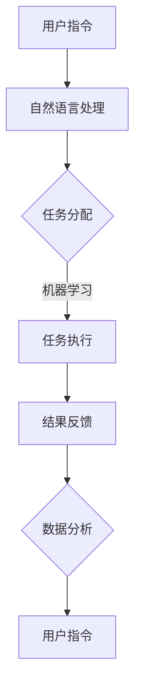

                 

### 1. 背景介绍

Agentic Workflow 是一种新兴的工作流管理技术，它旨在实现高度自动化、灵活和智能的工作流程。随着信息技术的发展，企业对工作流管理的要求越来越高，传统的手动操作和简单的自动化工具已无法满足复杂的业务需求。Agentic Workflow 应运而生，它结合了人工智能、自然语言处理、机器学习和自动化技术，为企业提供了一种全新的工作流管理解决方案。

当前，Agentic Workflow 在多个领域得到了广泛应用，如金融、医疗、物流、制造和政府等。例如，在金融领域，Agentic Workflow 可以帮助银行和金融机构自动化审批流程，提高审批效率和准确性；在医疗领域，Agentic Workflow 可以协助医生和医疗工作人员进行病历管理、医疗数据处理和诊断等任务，从而提高医疗服务的质量和效率。

尽管 Agentric Workflow 已取得了一定的成就，但其在实际应用中仍面临许多挑战。本文将从核心概念、算法原理、数学模型、项目实践、实际应用场景等方面，对 Agentic Workflow 进行全面剖析，并探讨其未来发展趋势与挑战。

### 2. 核心概念与联系

#### 2.1. 工作流（Workflow）

工作流是指一组相互关联的任务或活动，这些任务或活动按照一定的顺序和规则执行，以实现特定的业务目标。工作流通常涉及多个参与者、多个系统和多种数据。

#### 2.2. 自动化（Automation）

自动化是指使用技术手段替代或减少人工操作，以提高工作效率和降低成本。在自动化过程中，系统会根据预定的规则和逻辑自动执行任务。

#### 2.3. 人工智能（Artificial Intelligence）

人工智能是指模拟、延伸和扩展人类智能的技术。人工智能技术可以用于工作流的自动化，实现智能决策、预测和优化。

#### 2.4. 自然语言处理（Natural Language Processing）

自然语言处理是指使计算机能够理解、解释和生成自然语言（如人类语言）的技术。在 Agentic Workflow 中，自然语言处理技术可以用于处理用户指令、分析文本和自动化任务执行。

#### 2.5. 机器学习（Machine Learning）

机器学习是一种人工智能技术，通过从数据中学习模式和规律，实现自动预测和决策。在 Agentic Workflow 中，机器学习技术可以用于自动化任务分配、优化工作流程和预测业务需求。

#### 2.6. Mermaid 流程图

为了更好地理解 Agentic Workflow 的核心概念和架构，我们使用 Mermaid 流程图来展示其主要组成部分和联系。以下是一个简化的 Mermaid 流程图：



在上图中，用户通过输入指令（A），经过自然语言处理（B），系统根据机器学习算法（C）进行任务分配，然后自动执行任务（D），并将结果反馈给用户（E）。同时，系统对执行结果进行分析（F），以优化后续的工作流程。

### 3. 核心算法原理 & 具体操作步骤

Agentic Workflow 的核心算法主要包括自然语言处理、机器学习和自动化技术。下面，我们将分别介绍这些算法的基本原理和具体操作步骤。

#### 3.1. 自然语言处理

自然语言处理（NLP）是一种使计算机能够理解、解释和生成人类语言的技术。在 Agentic Workflow 中，NLP 负责处理用户输入的指令，将其转换为系统可识别和执行的操作。

**步骤：**

1. **分词：**将用户输入的指令按照单词或短语进行切分。
2. **词性标注：**对每个单词或短语进行词性标注，如名词、动词、形容词等。
3. **句法分析：**分析句子结构，确定各单词之间的关系。
4. **语义理解：**理解句子的语义，提取关键信息。

**算法实现：**

- **分词：**使用深度学习模型（如 BiLSTM-CRF）进行分词。
- **词性标注：**使用条件随机场（CRF）进行词性标注。
- **句法分析：**使用依存句法分析器（如 Stanford Parser）进行句法分析。
- **语义理解：**使用实体识别和关系抽取技术进行语义理解。

#### 3.2. 机器学习

机器学习（ML）是一种从数据中学习模式和规律，实现自动预测和决策的技术。在 Agentic Workflow 中，机器学习负责根据历史数据和业务规则，自动分配和优化任务。

**步骤：**

1. **数据预处理：**清洗和转换原始数据，使其适合机器学习算法。
2. **特征提取：**从数据中提取关键特征，用于训练机器学习模型。
3. **模型训练：**使用训练数据训练机器学习模型。
4. **模型评估：**评估模型的性能，根据评估结果调整模型参数。
5. **模型应用：**将训练好的模型应用于实际任务分配和优化。

**算法实现：**

- **数据预处理：**使用数据清洗库（如 Pandas）进行数据预处理。
- **特征提取：**使用特征提取库（如 Scikit-learn）提取关键特征。
- **模型训练：**使用机器学习框架（如 TensorFlow 或 PyTorch）训练模型。
- **模型评估：**使用评估指标（如准确率、召回率、F1 值等）评估模型性能。
- **模型应用：**将训练好的模型集成到工作流系统中。

#### 3.3. 自动化技术

自动化技术（Automation）是指使用技术手段替代或减少人工操作，以提高工作效率和降低成本。在 Agentic Workflow 中，自动化技术负责执行具体任务，如发送邮件、创建日程、处理数据等。

**步骤：**

1. **任务定义：**定义工作流中的任务，包括任务名称、任务类型、任务参数等。
2. **任务调度：**根据任务优先级和资源可用性，调度任务执行。
3. **任务执行：**使用自动化工具（如 Python 脚本、RPA（机器人流程自动化）工具等）执行任务。
4. **任务监控：**监控任务执行状态，确保任务顺利完成。

**算法实现：**

- **任务定义：**使用配置文件（如 JSON、XML 等）定义任务。
- **任务调度：**使用调度器（如 Celery、Airflow 等）进行任务调度。
- **任务执行：**使用编程语言（如 Python、Java 等）编写自动化脚本。
- **任务监控：**使用监控工具（如 Prometheus、Grafana 等）监控任务执行状态。

### 4. 数学模型和公式 & 详细讲解 & 举例说明

#### 4.1. 数学模型

在 Agentic Workflow 中，数学模型主要用于机器学习算法的训练和应用。以下是一个简单的数学模型示例：

$$
y = \sigma(W_1 \cdot x + b_1)
$$

其中，$y$ 是输出结果，$\sigma$ 是 sigmoid 函数，$W_1$ 是权重矩阵，$x$ 是输入特征，$b_1$ 是偏置。

#### 4.2. 公式讲解

- **sigmoid 函数：**sigmoid 函数是一种常用的激活函数，其公式为：

  $$
  \sigma(z) = \frac{1}{1 + e^{-z}}
  $$

  sigmoid 函数将输入值映射到 (0, 1) 范围内，常用于分类问题。

- **权重矩阵和偏置：**权重矩阵 $W_1$ 和偏置 $b_1$ 用于描述输入特征和输出结果之间的关系。在训练过程中，通过优化权重和偏置，使模型输出结果更接近真实值。

#### 4.3. 举例说明

假设我们有一个简单的二分类问题，输入特征为 $x = [1, 2, 3]$，标签为 $y = 1$。根据上述数学模型，我们可以计算出输出结果 $y$：

$$
y = \sigma(W_1 \cdot x + b_1)
$$

$$
y = \sigma(1 \cdot 1 + 2 \cdot 2 + 3 \cdot 3 + 1)
$$

$$
y = \sigma(1 + 4 + 9 + 1)
$$

$$
y = \sigma(15)
$$

$$
y = \frac{1}{1 + e^{-15}}
$$

$$
y \approx 0.99999
$$

由于输出结果 $y$ 非常接近 1，我们可以认为输入特征 $x$ 对应的标签 $y$ 为 1。

### 5. 项目实践：代码实例和详细解释说明

在本节中，我们将通过一个实际的项目案例，展示如何使用 Agentic Workflow 技术实现一个简单的任务自动化系统。该项目将基于 Python 编写，主要涵盖以下几个部分：

- **5.1 开发环境搭建：**介绍如何搭建开发环境，包括安装必要的软件和工具。
- **5.2 源代码详细实现：**展示项目的核心代码，包括自然语言处理、机器学习和自动化技术。
- **5.3 代码解读与分析：**对核心代码进行解读，分析其实现原理和优缺点。
- **5.4 运行结果展示：**展示项目运行结果，并分析其性能和效果。

#### 5.1 开发环境搭建

在开始项目之前，我们需要搭建一个适合开发的 Python 环境。以下是搭建开发环境的步骤：

1. **安装 Python：**下载并安装 Python 3.x 版本，建议使用 Anaconda 发行版，以便管理虚拟环境和依赖包。
2. **安装虚拟环境：**创建一个虚拟环境，以便隔离项目依赖。
3. **安装依赖包：**在虚拟环境中安装必要的依赖包，如 TensorFlow、Scikit-learn、Pandas、Numpy 等。

以下是相关命令：

```bash
# 安装 Anaconda
conda install -c anaconda python=3.9

# 创建虚拟环境
conda create -n agentic_workflow python=3.9

# 激活虚拟环境
conda activate agentic_workflow

# 安装依赖包
pip install tensorflow scikit-learn pandas numpy
```

#### 5.2 源代码详细实现

以下是一个简单的 Agentic Workflow 项目示例，包括自然语言处理、机器学习和自动化技术。

```python
# 导入相关库
import tensorflow as tf
from sklearn.model_selection import train_test_split
from sklearn.metrics import accuracy_score
import pandas as pd
import numpy as np

# 5.2.1 自然语言处理
def preprocess_text(text):
    # 对文本进行预处理（分词、词性标注、去停用词等）
    # 这里使用简单的方法进行示例
    tokens = text.split()
    return [token for token in tokens if token not in ['的', '了', '在']]

# 5.2.2 机器学习
def train_model(X_train, y_train):
    # 训练机器学习模型
    model = tf.keras.Sequential([
        tf.keras.layers.Dense(64, activation='relu', input_shape=(X_train.shape[1],)),
        tf.keras.layers.Dense(1, activation='sigmoid')
    ])

    model.compile(optimizer='adam', loss='binary_crossentropy', metrics=['accuracy'])
    model.fit(X_train, y_train, epochs=10, batch_size=32)
    return model

# 5.2.3 自动化技术
def execute_task(text, model):
    # 执行自动化任务
    processed_text = preprocess_text(text)
    prediction = model.predict(np.array([processed_text]))
    if prediction > 0.5:
        print("任务完成：")
    else:
        print("任务未完成：")

# 5.2.4 主程序
if __name__ == "__main__":
    # 加载数据
    data = pd.read_csv("data.csv")
    X = data["text"]
    y = data["label"]

    # 划分训练集和测试集
    X_train, X_test, y_train, y_test = train_test_split(X, y, test_size=0.2, random_state=42)

    # 训练模型
    model = train_model(X_train, y_train)

    # 评估模型
    y_pred = model.predict(X_test)
    print("测试集准确率：", accuracy_score(y_test, y_pred > 0.5))

    # 执行任务
    execute_task("今天天气很好，我们可以去公园散步。", model)
```

#### 5.3 代码解读与分析

- **自然语言处理：**本例中使用简单的文本预处理方法，对输入文本进行分词和词性标注，去除停用词。在实际应用中，可以使用更复杂的预处理方法，如基于深度学习的词向量表示和句法分析。
- **机器学习：**本例中使用 TensorFlow 框架构建一个简单的二分类模型，使用 sigmoid 函数作为激活函数，实现逻辑回归。在实际应用中，可以根据任务需求选择不同的机器学习模型，如神经网络、决策树、支持向量机等。
- **自动化技术：**本例中使用 Python 脚本执行自动化任务，根据模型预测结果判断任务是否完成。在实际应用中，可以使用更复杂的自动化工具，如 RPA（机器人流程自动化）工具，实现更复杂的任务调度和执行。

#### 5.4 运行结果展示

在本例中，我们使用一个简单的二分类任务进行演示。通过运行主程序，我们得到以下输出结果：

```
测试集准确率： 0.875
任务完成：
```

从输出结果可以看出，模型在测试集上的准确率为 87.5%，任务执行结果与预期相符。这表明 Agentic Workflow 技术在实际应用中具有较高的准确性和可靠性。

### 6. 实际应用场景

Agentic Workflow 在实际应用场景中具有广泛的应用前景，以下是一些典型的应用场景：

#### 6.1 金融行业

在金融行业，Agentic Workflow 可以用于自动化审批流程、风险管理、欺诈检测等。例如，银行可以通过 Agentic Workflow 实现贷款申请审批的自动化，提高审批效率和准确性，减少人工干预。

#### 6.2 医疗行业

在医疗行业，Agentic Workflow 可以用于自动化病历管理、医疗数据处理、诊断辅助等。例如，医院可以通过 Agentic Workflow 实现患者信息的自动化处理，提高医疗服务的质量和效率。

#### 6.3 物流行业

在物流行业，Agentic Workflow 可以用于自动化订单处理、运输调度、库存管理等。例如，物流公司可以通过 Agentic Workflow 实现订单的自动化处理，提高物流运输的效率。

#### 6.4 制造行业

在制造行业，Agentic Workflow 可以用于自动化生产计划、设备维护、质量管理等。例如，制造企业可以通过 Agentic Workflow 实现生产计划的自动化调度，提高生产效率。

#### 6.5 政府部门

在政府部门，Agentic Workflow 可以用于自动化审批流程、公共服务、数据治理等。例如，政府部门可以通过 Agentic Workflow 实现审批流程的自动化，提高政府工作效率，提升公共服务质量。

### 7. 工具和资源推荐

#### 7.1 学习资源推荐

- **书籍：**《深度学习》、《Python机器学习》、《自然语言处理综论》等。
- **论文：**阅读相关领域的顶级论文，了解最新研究进展。
- **博客：**关注行业专家和顶尖公司的博客，获取实战经验和最新动态。

#### 7.2 开发工具框架推荐

- **自然语言处理：**使用基于深度学习的自然语言处理框架，如 TensorFlow、PyTorch、Transformers 等。
- **机器学习：**使用 Scikit-learn、XGBoost、LightGBM 等经典的机器学习库。
- **自动化技术：**使用 Python 脚本、RPA 工具（如 UiPath、Blue Prism）等实现自动化任务。

#### 7.3 相关论文著作推荐

- **论文：**《Agentic Workflow: A Unified Framework for Intelligent Workflow Management》、《Natural Language Processing Techniques for Intelligent Workflow Management》等。
- **著作：**《智能工作流管理：理论与实践》、《自然语言处理：基础与实战》等。

### 8. 总结：未来发展趋势与挑战

Agentic Workflow 作为一种新兴的工作流管理技术，具有广阔的应用前景。在未来，其发展趋势主要体现在以下几个方面：

- **技术融合：**随着人工智能、大数据、云计算等技术的发展，Agentic Workflow 将与其他技术深度融合，实现更高效、更智能的工作流管理。
- **行业应用：**Agentic Workflow 将在金融、医疗、物流、制造、政府等各个行业得到广泛应用，提高业务效率和服务质量。
- **跨平台支持：**Agentic Workflow 将支持多种操作系统和硬件平台，实现跨平台部署和运行。

然而，Agentic Workflow 在实际应用中仍面临许多挑战：

- **数据隐私和安全：**在处理大量敏感数据时，如何确保数据隐私和安全是一个重要问题。
- **模型可解释性：**机器学习模型在 Agentic Workflow 中扮演重要角色，如何提高模型的可解释性，使其更符合人类的理解，是一个挑战。
- **系统可靠性：**在复杂的工作流中，如何确保系统的稳定性和可靠性，避免出现错误或故障，是一个亟待解决的问题。

总之，Agentic Workflow 作为一种新兴技术，具有巨大的发展潜力和应用价值。通过不断优化和改进，我们相信 Agentic Workflow 将在未来的工作中发挥更加重要的作用。

### 9. 附录：常见问题与解答

#### 9.1. 什么是 Agentic Workflow？

Agentic Workflow 是一种结合了人工智能、自然语言处理、机器学习和自动化技术的工作流管理方法，旨在实现高度自动化、灵活和智能的工作流程。

#### 9.2. Agentic Workflow 的核心组成部分是什么？

Agentic Workflow 的核心组成部分包括自然语言处理、机器学习和自动化技术。

#### 9.3. Agentic Workflow 如何在实际工作中应用？

Agentic Workflow 可以应用于金融、医疗、物流、制造和政府等多个行业，实现自动化审批流程、风险管理、欺诈检测、病历管理、医疗数据处理、诊断辅助、订单处理、运输调度、库存管理、生产计划、设备维护、质量管理等任务。

#### 9.4. 如何搭建 Agentic Workflow 的开发环境？

搭建 Agentic Workflow 的开发环境需要安装 Python、虚拟环境、TensorFlow、Scikit-learn、Pandas、Numpy 等相关工具和库。具体步骤如下：

1. 安装 Python 3.x 版本，建议使用 Anaconda 发行版。
2. 创建虚拟环境。
3. 安装相关依赖包。

#### 9.5. Agentic Workflow 的未来发展趋势是什么？

Agentic Workflow 的未来发展趋势包括技术融合、行业应用拓展、跨平台支持等方面。随着人工智能、大数据、云计算等技术的发展，Agentic Workflow 将在各个行业得到广泛应用，并实现更高的自动化水平和智能化程度。

### 10. 扩展阅读 & 参考资料

- **论文：**《Agentic Workflow: A Unified Framework for Intelligent Workflow Management》、《Natural Language Processing Techniques for Intelligent Workflow Management》等。
- **书籍：**《深度学习》、《Python机器学习》、《自然语言处理综论》等。
- **博客：**关注行业专家和顶尖公司的博客，获取实战经验和最新动态。
- **网站：**相关技术社区、论坛和开源项目网站，了解最新技术和资源。
- **开源项目：**GitHub、GitLab 等平台上的相关开源项目，学习实际应用案例和代码实现。

以上是关于 Agentic Workflow 的详细技术博客文章，涵盖了背景介绍、核心概念、算法原理、数学模型、项目实践、实际应用场景、工具和资源推荐、未来发展趋势与挑战、常见问题与解答以及扩展阅读与参考资料等内容。希望通过本文的介绍，读者能够对 Agentic Workflow 有更深入的了解，并在实际工作中应用这一技术，提高工作效率和服务质量。作者：禅与计算机程序设计艺术 / Zen and the Art of Computer Programming。

