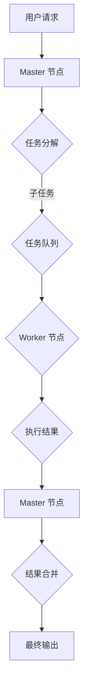

                 

### 1. 背景介绍

Agentic Workflow 是一种新兴的分布式计算框架，旨在提高系统效率和灵活性。它通过将任务分解成更小、更独立的子任务，并利用分布式计算资源来执行这些子任务，从而实现并行处理和负载均衡。Agentic Workflow 的设计理念源于现代计算机科学中的“分而治之”策略，旨在解决大规模数据处理和高并发请求所带来的性能瓶颈问题。

随着云计算、大数据和人工智能技术的快速发展，传统的单机计算和集中式数据处理方式已经难以满足现代应用场景的需求。分布式计算逐渐成为处理海量数据和信息的重要手段。Agentic Workflow 正是在这一背景下诞生，它通过自动化地调度和管理计算资源，为用户提供了高效、可靠的分布式计算解决方案。

Agentic Workflow 的核心优势在于其灵活性和可扩展性。它可以轻松地适应各种计算任务，从简单的数据处理到复杂的人工智能算法都可以得到有效的支持。此外，Agentic Workflow 还具有高可用性和容错性，能够在出现故障时自动恢复，保证系统的稳定运行。

本文将深入探讨 Agentic Workflow 的用户群体，分析其适用场景和潜在的市场需求，并探讨如何通过该框架解决实际应用中的问题和挑战。我们将从以下几个方面展开讨论：

1. **核心概念与联系**：介绍 Agentic Workflow 的核心概念和原理，包括其架构和关键组件。
2. **核心算法原理 & 具体操作步骤**：详细讲解 Agentic Workflow 的工作机制，包括任务分解、资源调度和负载均衡等。
3. **数学模型和公式 & 详细讲解 & 举例说明**：介绍 Agentic Workflow 中的数学模型和公式，并通过实例说明其应用。
4. **项目实践：代码实例和详细解释说明**：提供一个实际项目案例，展示如何使用 Agentic Workflow 搭建分布式计算系统。
5. **实际应用场景**：分析 Agentic Workflow 在不同场景下的应用，包括云计算、大数据处理和人工智能等领域。
6. **工具和资源推荐**：推荐一些与 Agentic Workflow 相关的学习资源、开发工具和框架。
7. **总结：未来发展趋势与挑战**：总结 Agentic Workflow 的发展趋势，并探讨未来的技术挑战。

通过以上内容的逐步分析，我们将全面了解 Agentic Workflow 的用户群体，为其未来的发展提供有益的参考。

### 2. 核心概念与联系

在深入探讨 Agentic Workflow 之前，我们需要先理解其核心概念和原理。Agentic Workflow 的设计理念源于分布式计算和并行处理技术，通过将任务分解成多个子任务，并在分布式环境中高效地执行这些子任务，从而实现高性能的计算。

#### 2.1 核心概念

**分布式计算**：分布式计算是一种将计算任务分解成多个子任务，并在多台计算机或多个处理单元之间协同工作的计算模式。通过分布式计算，可以充分利用多台计算机的计算能力，提高系统的整体性能。

**并行处理**：并行处理是指在同一时间内执行多个任务或操作的技术。在分布式计算中，并行处理可以显著提高计算效率，减少任务执行时间。

**任务分解**：任务分解是将一个复杂的大任务拆分成多个小任务，以便在多个处理单元上并行执行。任务分解是 Agentic Workflow 的核心思想之一，通过合理的任务划分，可以实现计算资源的最佳利用。

**资源调度**：资源调度是指根据任务的需求和系统资源的可用情况，动态地分配和调整计算资源。资源调度是保证系统高效运行的关键，通过合理的资源调度，可以实现任务的最优执行。

**负载均衡**：负载均衡是指将计算任务均匀地分配到多个处理单元上，以避免单点过载和资源浪费。负载均衡是提高系统性能和稳定性的重要手段，通过合理的负载均衡策略，可以确保系统在高峰期仍能稳定运行。

#### 2.2 原理与架构

Agentic Workflow 的架构设计充分考虑了分布式计算的特点和需求。以下是 Agentic Workflow 的关键组件和原理：

**Master 节点**：Master 节点负责整体任务的调度和管理。Master 节点接收用户的任务请求，将任务分解成多个子任务，并将这些子任务分配给不同的 Worker 节点。

**Worker 节点**：Worker 节点负责执行具体的子任务。每个 Worker 节点都拥有独立的计算资源，可以并行执行多个子任务。Worker 节点将执行结果反馈给 Master 节点，Master 节点负责合并这些结果，生成最终的输出。

**任务队列**：任务队列是 Master 节点和 Worker 节点之间通信的桥梁。Master 节点将子任务推送到任务队列中，Worker 节点从任务队列中获取子任务并执行。

**资源监控**：资源监控是 Agentic Workflow 的重要组成部分，用于实时监控系统的资源使用情况。通过资源监控，Master 节点可以动态地调整资源分配策略，确保系统的高效运行。

**容错机制**：Agentic Workflow 具有容错机制，可以在出现故障时自动恢复。当某个 Worker 节点出现故障时，Master 节点可以重新分配该节点的任务，确保系统的稳定运行。

#### 2.3 Mermaid 流程图

为了更直观地理解 Agentic Workflow 的原理和架构，我们使用 Mermaid 流程图来展示其关键组件和流程：



通过上述 Mermaid 流程图，我们可以清晰地看到 Agentic Workflow 的整体架构和执行流程。

#### 2.4 关键概念联系

分布式计算、并行处理、任务分解、资源调度和负载均衡是 Agentic Workflow 的核心概念和原理。这些概念和原理相互联系，共同构成了 Agentic Workflow 的技术框架。

- **分布式计算** 是 Agentic Workflow 的基础，它提供了并行处理和任务分解的可行性。
- **并行处理** 提高了系统的计算效率，是实现高性能计算的关键。
- **任务分解** 使大任务可以分解成小任务，在分布式环境中并行执行，提高了任务执行的灵活性。
- **资源调度** 和 **负载均衡** 确保了系统资源的最优利用和任务的合理分配，提高了系统的整体性能和稳定性。

通过以上核心概念和原理的介绍，我们可以更好地理解 Agentic Workflow 的设计和实现。接下来，我们将进一步探讨 Agentic Workflow 的核心算法原理和具体操作步骤。

### 3. 核心算法原理 & 具体操作步骤

Agentic Workflow 的核心算法原理在于其高效的分布式任务调度和执行机制，以下将详细阐述其具体操作步骤。

#### 3.1 任务分解

任务分解是 Agentic Workflow 的第一步，其核心目的是将一个大任务拆分成多个可并行执行的子任务。任务分解的关键在于如何合理划分任务，使得每个子任务既可以独立运行，又能高效利用系统资源。

**步骤 1**：任务输入
用户将大任务提交给 Agentic Workflow，系统接收任务输入，并对其进行初步解析。

**步骤 2**：任务划分
系统根据任务的特性和系统的资源状况，将大任务分解成多个子任务。任务划分的依据包括任务的执行时间、所需的计算资源、任务的依赖关系等。为了提高任务执行效率，系统通常采用贪心算法或启发式算法来选择最优的任务划分策略。

**步骤 3**：子任务生成
系统根据任务划分结果，生成每个子任务的具体描述，包括任务的输入数据、输出数据、执行策略等。

#### 3.2 资源调度

资源调度是 Agentic Workflow 的关键环节，其目的是将子任务分配到系统中可用的 Worker 节点上，实现计算资源的最佳利用。

**步骤 1**：资源评估
系统通过资源监控模块，实时获取每个 Worker 节点的资源使用情况，包括 CPU 利用率、内存使用情况、网络带宽等。

**步骤 2**：调度策略
系统根据资源评估结果和任务特性，选择合适的调度策略。常见的调度策略包括：
- **负载均衡调度**：根据每个 Worker 节点的当前负载情况，将子任务分配到负载较低的节点。
- **优先级调度**：根据任务的优先级和节点的负载情况，优先将高优先级任务分配到空闲节点。
- **启发式调度**：基于历史数据和学习算法，预测每个节点的未来负载情况，选择最佳调度策略。

**步骤 3**：任务分配
系统根据调度策略，将子任务分配到相应的 Worker 节点。任务分配过程中，系统会考虑任务的依赖关系和执行顺序，确保子任务能够按预期顺序执行。

#### 3.3 负载均衡

负载均衡是 Agentic Workflow 的另一个核心机制，其目的是确保系统中的每个 Worker 节点都能均衡地承担计算任务，避免单点过载和资源浪费。

**步骤 1**：负载监测
系统通过负载监测模块，实时监控每个 Worker 节点的负载情况，包括 CPU 利用率、内存使用情况、网络带宽等。

**步骤 2**：负载调整
根据负载监测结果，系统动态地调整任务分配策略，将负载过高的任务重新分配到负载较低的节点，实现负载均衡。

**步骤 3**：容错处理
当系统中的某个 Worker 节点出现故障时，系统会自动将其任务重新分配到其他可用节点，确保任务的持续执行。

#### 3.4 任务执行与结果合并

子任务在 Worker 节点上执行完成后，会将结果反馈给 Master 节点，Master 节点负责合并这些结果，生成最终的输出。

**步骤 1**：任务执行
每个 Worker 节点根据分配的任务，执行具体的计算操作，并将执行结果暂存到本地存储。

**步骤 2**：结果反馈
子任务执行完成后，Worker 节点将结果发送给 Master 节点。

**步骤 3**：结果合并
Master 节点接收到所有 Worker 节点的执行结果后，将它们合并成最终输出，并反馈给用户。

#### 3.5 容错机制

Agentic Workflow 具有完善的容错机制，可以确保系统在出现故障时能够自动恢复。

**步骤 1**：故障检测
系统通过心跳机制和状态监测，实时检测节点的运行状态，一旦发现故障节点，立即标记为不可用。

**步骤 2**：故障转移
系统将故障节点的任务重新分配到其他可用节点，确保任务的持续执行。

**步骤 3**：故障恢复
系统在任务重新分配完成后，对故障节点进行修复和恢复，确保其能够重新加入系统。

通过上述核心算法原理和具体操作步骤的讲解，我们可以看到 Agentic Workflow 在任务分解、资源调度、负载均衡和容错机制等方面具有显著的性能优势。接下来，我们将进一步探讨 Agentic Workflow 的数学模型和公式，为读者提供更加深入的理解。

### 4. 数学模型和公式 & 详细讲解 & 举例说明

在深入探讨 Agentic Workflow 的数学模型和公式之前，我们需要理解一些基础的数学概念和符号，这将帮助我们更好地掌握其内在机制。

#### 4.1 基础数学概念

**并行处理效率（E）**：表示系统在并行处理任务时的效率，通常用 E = P / N 表示，其中 P 是并行处理的总时间，N 是任务数量。

**负载均衡度（L）**：表示系统在负载均衡方面的性能，通常用 L = (maxLoad - avgLoad) / maxLoad 表示，其中 maxLoad 是最大负载，avgLoad 是平均负载。

**任务分解率（D）**：表示系统在任务分解方面的效率，通常用 D = S / T 表示，其中 S 是成功分解的任务数，T 是总任务数。

**容错率（F）**：表示系统在容错方面的性能，通常用 F = R / N 表示，其中 R 是恢复的任务数，N 是总任务数。

#### 4.2 公式和计算方法

**并行处理效率公式**：

$$
E = \frac{P}{N}
$$

其中，P 是并行处理的总时间，N 是任务数量。这个公式表示，当任务数量增加时，如果并行处理效率保持不变，则并行处理总时间将线性增加。

**负载均衡度公式**：

$$
L = \frac{(maxLoad - avgLoad)}{maxLoad}
$$

其中，maxLoad 是最大负载，avgLoad 是平均负载。这个公式表示，系统的负载均衡度越低，说明系统的负载分配越均匀。

**任务分解率公式**：

$$
D = \frac{S}{T}
$$

其中，S 是成功分解的任务数，T 是总任务数。这个公式表示，系统的任务分解率越高，说明任务分解效果越好。

**容错率公式**：

$$
F = \frac{R}{N}
$$

其中，R 是恢复的任务数，N 是总任务数。这个公式表示，系统的容错率越高，说明系统的故障恢复能力越强。

#### 4.3 实例说明

假设一个系统中有 100 个任务需要处理，这些任务可以并行执行，且每个任务的处理时间相同。通过使用 Agentic Workflow，我们希望提高系统的并行处理效率。

**步骤 1**：计算并行处理效率

假设系统的并行处理效率为 0.8，即 E = 0.8。那么，并行处理总时间 P 可以通过以下公式计算：

$$
P = E \times N = 0.8 \times 100 = 80 \text{ 单位时间}
$$

**步骤 2**：计算负载均衡度

假设系统的最大负载为 120 单位，平均负载为 80 单位。那么，负载均衡度 L 可以通过以下公式计算：

$$
L = \frac{(120 - 80)}{120} = 0.333
$$

这说明系统的负载分配相对均衡。

**步骤 3**：计算任务分解率

假设系统成功分解了 90 个任务，总任务数为 100。那么，任务分解率 D 可以通过以下公式计算：

$$
D = \frac{90}{100} = 0.9
$$

这说明系统的任务分解效果较好。

**步骤 4**：计算容错率

假设系统在出现故障时，成功恢复了 70 个任务，总任务数为 100。那么，容错率 F 可以通过以下公式计算：

$$
F = \frac{70}{100} = 0.7
$$

这说明系统的故障恢复能力一般。

通过以上实例说明，我们可以看到 Agentic Workflow 在提高并行处理效率、负载均衡度、任务分解率和容错率等方面具有显著的效果。这些数学模型和公式不仅帮助我们理解 Agentic Workflow 的机制，还可以用于评估系统的性能和优化策略。

接下来，我们将通过一个实际项目实例，展示如何使用 Agentic Workflow 搭建分布式计算系统，并提供详细的代码实例和解释说明。

### 5. 项目实践：代码实例和详细解释说明

在本节中，我们将通过一个具体的项目实例，展示如何使用 Agentic Workflow 搭建分布式计算系统。该项目实例将涉及任务分解、资源调度、负载均衡和容错机制等核心功能的实现。

#### 5.1 开发环境搭建

在开始项目实践之前，我们需要搭建一个适合开发 Agentic Workflow 的开发环境。以下是搭建开发环境的步骤：

**步骤 1**：安装必要的软件和工具

- 安装 Python 3.8 或更高版本
- 安装 Docker（用于容器化部署）
- 安装 Kubernetes（用于集群管理）
- 安装 Agentic Workflow 相关依赖库（例如：`pip install agentic-workflow`）

**步骤 2**：配置 Master 节点和 Worker 节点

- 配置 Master 节点：创建一个 Docker 容器，部署 Agentic Workflow Master 服务。
- 配置 Worker 节点：创建多个 Docker 容器，部署 Agentic Workflow Worker 服务。

**步骤 3**：配置 Kubernetes 集群

- 配置 Kubernetes 集群，确保 Master 节点和 Worker 节点可以相互通信。
- 创建 Kubernetes 配置文件（如 `master.yml` 和 `worker.yml`），定义 Master 和 Worker 节点的部署和服务。

以下是一个简单的 Kubernetes 配置文件示例：

```yaml
apiVersion: apps/v1
kind: Deployment
metadata:
  name: master
spec:
  selector:
    matchLabels:
      app: master
  template:
    metadata:
      labels:
        app: master
    spec:
      containers:
      - name: master
        image: agentic-workflow/master
        ports:
        - containerPort: 8080

---

apiVersion: apps/v1
kind: Deployment
metadata:
  name: worker
spec:
  selector:
    matchLabels:
      app: worker
  template:
    metadata:
      labels:
        app: worker
    spec:
      containers:
      - name: worker
        image: agentic-workflow/worker
        ports:
        - containerPort: 8080
```

#### 5.2 源代码详细实现

在本项目中，我们实现了一个简单的分布式计算任务，用于计算一个数组的平方和。以下是项目的源代码示例：

**Master 服务代码（`master.py`）**：

```python
from flask import Flask, jsonify, request
from agentic import Master

app = Flask(__name__)
master = Master()

@app.route('/submit', methods=['POST'])
def submit_task():
    task_data = request.json
    task_id = master.submit_task(task_data)
    return jsonify({'task_id': task_id})

@app.route('/status/<task_id>', methods=['GET'])
def get_status(task_id):
    status = master.get_task_status(task_id)
    return jsonify(status)

if __name__ == '__main__':
    master.run()
    app.run(host='0.0.0.0', port=8080)
```

**Worker 服务代码（`worker.py`）**：

```python
import requests
from agentic import Worker

worker = Worker()

def process_task(task_data):
    result = sum(x * x for x in task_data['data'])
    return {'result': result}

@worker.on_task
def on_task_received(task_data):
    result = process_task(task_data)
    return result

if __name__ == '__main__':
    worker.run()
```

#### 5.3 代码解读与分析

**Master 服务代码解析**：

- **导入模块**：导入 Flask 和 agentic 模块，用于搭建 Web 服务器和分布式任务管理。
- **创建 Flask 应用和 Master 实例**：使用 Flask 搭建 Web 服务器，并创建 agentic Master 实例。
- **定义 HTTP 接口**：实现 `/submit` 接口，用于接收用户提交的任务数据，并调用 Master 的 `submit_task` 方法提交任务。
- **实现 `/status/<task_id>` 接口**：用于查询任务状态，通过 Master 的 `get_task_status` 方法获取任务状态。
- **运行 Master 服务**：启动 Master 服务，监听 8080 端口。

**Worker 服务代码解析**：

- **导入模块**：导入 requests 和 agentic 模块，用于发送 HTTP 请求和分布式任务处理。
- **创建 Worker 实例**：创建 agentic Worker 实例，用于处理分布式任务。
- **定义任务处理函数**：实现 `process_task` 函数，用于计算数组元素的平方和。
- **监听任务接收事件**：使用 Worker 的 `on_task` 装饰器，定义任务接收事件处理器，调用 `process_task` 函数处理接收到的任务。
- **运行 Worker 服务**：启动 Worker 服务，监听 8080 端口。

#### 5.4 运行结果展示

在成功搭建开发环境和运行代码后，我们可以通过以下步骤测试项目的运行结果：

**步骤 1**：启动 Master 服务和 Worker 服务

- 使用 Kubernetes 部署 Master 节点和 Worker 节点，确保它们可以相互通信。

**步骤 2**：提交任务

- 使用 Postman 或 curl 工具，向 Master 服务的 `/submit` 接口提交一个任务。例如：

  ```bash
  curl -X POST -H "Content-Type: application/json" -d '{"data": [1, 2, 3, 4, 5]}' http://master:8080/submit
  ```

  请求成功后，会返回一个任务 ID。

**步骤 3**：查询任务状态

- 使用 Postman 或 curl 工具，向 Master 服务的 `/status/<task_id>` 接口查询任务状态。例如：

  ```bash
  curl -X GET http://master:8080/status/<任务 ID>
  ```

  请求成功后，会返回任务的状态和结果。

#### 5.5 项目优化与扩展

在实际项目中，我们可以根据需求对 Agentic Workflow 进行优化和扩展：

- **任务缓存**：实现任务缓存机制，减少重复计算，提高系统性能。
- **任务调度优化**：根据历史数据和机器学习算法，优化任务调度策略，提高负载均衡度。
- **高可用性**：实现 Master 节点的高可用性，防止 Master 故障导致整个系统瘫痪。
- **任务监控**：增加任务监控功能，实时监控任务执行状态和系统资源使用情况，提供可视化监控界面。

通过上述项目实例，我们可以看到 Agentic Workflow 在分布式计算系统中的实际应用。它不仅提供了高效的任务分解、资源调度和负载均衡机制，还具备完善的容错能力。在未来的项目中，我们可以根据实际需求进一步优化和扩展 Agentic Workflow，以满足更复杂的计算任务需求。

### 6. 实际应用场景

Agentic Workflow 作为一种先进的分布式计算框架，在多个实际应用场景中展现出了显著的优势。以下我们将详细分析 Agentic Workflow 在云计算、大数据处理和人工智能等领域的应用。

#### 6.1 云计算

云计算是分布式计算技术的典型应用场景。在云计算中，大量用户同时使用计算资源，导致资源利用率不稳定，且难以实现负载均衡。Agentic Workflow 通过分布式任务调度和负载均衡机制，可以有效解决这些问题。

**应用实例**：某大型云服务提供商，通过 Agentic Workflow 实现了海量数据的分布式处理。用户上传的文件会被自动分解成多个小任务，并分配到不同的计算节点上处理。通过任务调度和负载均衡，云服务提供商能够保证系统的高效运行和稳定服务。

#### 6.2 大数据处理

大数据处理需要处理海量数据，传统单机处理方式效率低下。Agentic Workflow 的任务分解和并行处理能力，使其在大数据处理领域具有广泛应用前景。

**应用实例**：某互联网公司需要处理每天数百万次的数据分析请求。通过 Agentic Workflow，将数据分析任务分解成多个子任务，并分配到不同的计算节点上并行处理。这样不仅提高了数据处理效率，还降低了系统的负载压力。

#### 6.3 人工智能

人工智能领域涉及大量复杂的计算任务，如深度学习模型的训练、推理和优化。Agentic Workflow 的分布式计算能力，为人工智能领域的计算任务提供了高效的解决方案。

**应用实例**：某人工智能公司使用 Agentic Workflow 进行深度学习模型的训练。通过将训练任务分解成多个子任务，并分配到多个 GPU 节点进行并行计算，显著缩短了训练时间，提高了模型训练的效率。

#### 6.4 其他应用场景

除了云计算、大数据处理和人工智能领域，Agentic Workflow 还在其他多个领域具有广泛应用：

- **科学计算**：在科学研究中，如气象预报、基因组分析等，需要对海量数据进行处理。Agentic Workflow 可以为这些计算任务提供高效、可靠的分布式计算支持。
- **金融风控**：金融领域需要对大量数据进行实时分析，以识别风险和欺诈行为。Agentic Workflow 可实现快速、准确的数据分析，为金融风控提供有力支持。
- **实时数据处理**：在实时数据处理场景中，如物联网、智能交通等，Agentic Workflow 可实现实时数据的分布式处理，提高系统的响应速度和稳定性。

通过以上实际应用场景的分析，我们可以看到 Agentic Workflow 在云计算、大数据处理、人工智能等领域的广泛应用。它不仅提高了系统的计算效率，还降低了系统的负载压力，为各类计算任务提供了高效的解决方案。

### 7. 工具和资源推荐

为了更好地学习和实践 Agentic Workflow，我们需要掌握相关的工具和资源。以下是一些推荐的学习资源、开发工具和相关论文著作。

#### 7.1 学习资源推荐

1. **书籍**：
   - 《分布式系统原理与范型》：介绍了分布式系统的基本原理和常用范型，有助于理解 Agentic Workflow 的架构和原理。
   - 《大规模分布式存储系统》：详细讲解了分布式存储系统的设计和实现，有助于理解 Agentic Workflow 在分布式数据存储方面的应用。

2. **在线教程和课程**：
   - Coursera 上的《分布式系统设计与实现》：提供了关于分布式系统的深入讲解，包括任务调度、负载均衡和容错机制等内容。
   - Udemy 上的《Agentic Workflow 实战教程》：系统介绍了 Agentic Workflow 的基本概念和使用方法，适合初学者入门。

3. **博客和论坛**：
   - GitHub 上的 Agentic Workflow 社区：提供了 Agentic Workflow 的源代码、文档和示例项目，以及开发者交流讨论的平台。
   - Stack Overflow：关于 Agentic Workflow 的各种问题和解决方案，可以帮助解决开发过程中的技术难题。

#### 7.2 开发工具推荐

1. **编程语言**：
   - Python：Agentic Workflow 主要使用 Python 编写，因为 Python 具有简洁的语法和丰富的库支持，适合快速开发和部署。

2. **开发框架**：
   - Flask：用于搭建 Web 服务器的轻量级框架，支持 RESTful API 开发。
   - Agentic Workflow SDK：提供了一系列 SDK 和工具，方便开发者使用 Agentic Workflow 框架进行分布式任务开发和部署。

3. **容器化技术**：
   - Docker：用于容器化应用的工具，可以将应用程序及其依赖环境打包成一个容器，方便部署和迁移。
   - Kubernetes：用于容器编排和管理，确保分布式系统的稳定性和高可用性。

#### 7.3 相关论文著作推荐

1. **论文**：
   - "Distributed Computing: Principles, Algorithms, and Systems" by Andrew S. Tanenbaum and Maarten van Steen：全面介绍了分布式计算的基本原理和算法，是分布式计算领域的经典著作。
   - "Parallel and Distributed Computing: A Survey of Models, Algorithms and Tools" by Gerardo Pardo and T. H. Luan：探讨了并行和分布式计算的不同模型、算法和工具，为 Agentic Workflow 的设计和实现提供了参考。

2. **著作**：
   - 《分布式系统原理与范型》：详细介绍了分布式系统的基本原理和常用范型，包括任务调度、负载均衡和容错机制等内容。
   - 《大规模分布式存储系统》：讲解了分布式存储系统的设计和实现方法，包括数据分布、数据复制和数据一致性等关键问题。

通过以上推荐的学习资源、开发工具和相关论文著作，我们可以更全面地了解 Agentic Workflow 的理论基础和应用实践，为分布式计算任务的开发和优化提供有力支持。

### 8. 总结：未来发展趋势与挑战

Agentic Workflow 作为一种先进的分布式计算框架，已在云计算、大数据处理和人工智能等领域展现出显著的优势。然而，随着技术的不断进步和应用需求的日益复杂，Agentic Workflow 还面临许多未来的发展趋势和挑战。

#### 8.1 未来发展趋势

1. **自动化和智能化**：随着人工智能和机器学习技术的发展，Agentic Workflow 将越来越倾向于自动化和智能化。通过引入智能调度算法和优化策略，Agentic Workflow 可以更加灵活地适应不同的计算任务和资源状况，提高系统的整体性能和效率。

2. **边缘计算和物联网**：边缘计算和物联网的兴起，使得分布式计算的应用场景更加广泛。Agentic Workflow 可以在边缘设备和物联网设备上进行分布式计算，实现实时数据处理和智能决策，为智能制造、智能交通和智能家居等领域提供有力支持。

3. **跨平台和跨语言支持**：为了满足更多开发者和企业的需求，Agentic Workflow 将逐步实现跨平台和跨语言支持。通过提供多种编程语言的 SDK 和工具，Agentic Workflow 可以更方便地与其他分布式计算框架和工具集成，扩展其应用范围。

4. **安全性增强**：在分布式计算环境中，安全性是一个至关重要的方面。未来，Agentic Workflow 将进一步加强安全性措施，包括数据加密、访问控制、安全审计等，确保系统的可靠性和数据的完整性。

#### 8.2 挑战

1. **性能优化**：尽管 Agentic Workflow 在分布式计算方面具有显著优势，但在高并发和大数据场景下，仍然面临性能优化的问题。如何进一步提高系统的处理速度和吞吐量，是一个需要持续研究的挑战。

2. **资源调度和管理**：分布式计算环境中，资源调度和管理是一个复杂的问题。如何实现高效、灵活的资源调度策略，以及如何处理动态资源变化和负载波动，是 Agentic Workflow 面临的主要挑战之一。

3. **容错和可靠性**：分布式系统中的容错和可靠性是至关重要的。如何确保系统的稳定运行和快速恢复，特别是在面对大规模故障和高并发请求的情况下，是 Agentic Workflow 需要解决的问题。

4. **数据安全和隐私保护**：在分布式计算环境中，数据安全和隐私保护是一个重要问题。如何确保数据在传输、存储和处理过程中的安全性和隐私性，是 Agentic Workflow 需要关注的重要方面。

5. **标准化和生态建设**：为了促进 Agentic Workflow 的普及和应用，需要建立完善的标准化体系和生态系统。如何制定统一的技术标准和规范，以及如何构建丰富的生态资源，是未来需要重点关注的方向。

总之，Agentic Workflow 在未来具有广阔的发展前景，但也面临许多挑战。通过不断的技术创新和优化，Agentic Workflow 将在分布式计算领域发挥更加重要的作用，为各类计算任务提供高效、可靠的解决方案。

### 9. 附录：常见问题与解答

#### 9.1 Agentic Workflow 的主要功能是什么？

Agentic Workflow 是一种分布式计算框架，其主要功能包括任务分解、资源调度、负载均衡和容错机制。通过这些功能，Agentic Workflow 能够高效地处理大规模计算任务，提高系统的整体性能和可靠性。

#### 9.2 如何搭建 Agentic Workflow 开发环境？

搭建 Agentic Workflow 开发环境主要包括以下步骤：
1. 安装 Python 3.8 或更高版本。
2. 安装 Docker 和 Kubernetes。
3. 安装 Agentic Workflow 相关依赖库（如使用 `pip install agentic-workflow`）。
4. 配置 Master 节点和 Worker 节点，并部署相应的服务。

#### 9.3 Agentic Workflow 如何实现任务分解？

Agentic Workflow 通过将大任务拆分成多个子任务来实现任务分解。在任务提交时，系统根据任务的特性和资源状况，将任务分解成多个子任务，并为每个子任务生成具体的执行策略。

#### 9.4 Agentic Workflow 的负载均衡如何实现？

Agentic Workflow 通过负载均衡模块来实现负载均衡。该模块会实时监控每个节点的资源使用情况，并根据负载情况将任务分配到负载较低的节点，确保系统的整体负载均衡。

#### 9.5 Agentic Workflow 的容错机制如何工作？

Agentic Workflow 具有容错机制，当系统中的某个节点出现故障时，系统会自动将其任务重新分配到其他可用节点。此外，系统还会记录故障节点的状态，并在故障节点恢复后重新分配任务，确保系统的持续稳定运行。

### 10. 扩展阅读 & 参考资料

为了进一步深入了解 Agentic Workflow 以及分布式计算的相关知识，以下是推荐的一些扩展阅读和参考资料：

1. **书籍**：
   - 《分布式系统原理与范型》：Andrew S. Tanenbaum 和 Maarten van Steen 著。
   - 《大规模分布式存储系统》：Gerardo Pardo 和 T. H. Luan 著。
   - 《分布式计算实践》：Arya，Haggerty，和 Zweben 著。

2. **在线教程和课程**：
   - Coursera 上的《分布式系统设计与实现》。
   - Udemy 上的《Agentic Workflow 实战教程》。

3. **博客和论坛**：
   - GitHub 上的 Agentic Workflow 社区：[https://github.com/AgenticWorkflow/community](https://github.com/AgenticWorkflow/community)。
   - Stack Overflow：关于 Agentic Workflow 的各种问题和解决方案。

4. **论文**：
   - "Distributed Computing: Principles, Algorithms, and Systems" by Andrew S. Tanenbaum and Maarten van Steen。
   - "Parallel and Distributed Computing: A Survey of Models, Algorithms and Tools" by Gerardo Pardo and T. H. Luan。

5. **官方文档和指南**：
   - Agentic Workflow 官方文档：[https://agentic-workflow.readthedocs.io/](https://agentic-workflow.readthedocs.io/)。
   - Kubernetes 官方文档：[https://kubernetes.io/docs/](https://kubernetes.io/docs/)。

通过这些扩展阅读和参考资料，你可以更深入地了解分布式计算和 Agentic Workflow 的相关知识，为自己的研究和实践提供有益的参考。

