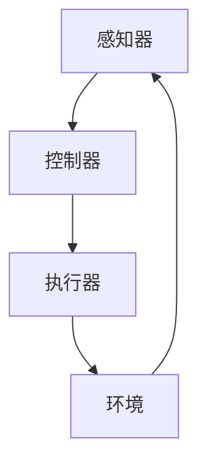

                 

### 背景介绍

随着人工智能技术的飞速发展，大型模型（Large Models）在各个领域展现出了巨大的潜力。从自然语言处理（NLP）到计算机视觉（CV），再到推荐系统（Recommender Systems），大型模型已经成为推动技术进步的重要力量。然而，传统的模型开发方法已经无法满足日益增长的数据量和计算需求。为了应对这一挑战，"Agent形式：大模型发展新方向"应运而生。

Agent形式是一种新兴的模型架构，它借鉴了代理（Agent）理论中的概念，旨在提高大模型的自适应性和灵活性。本文将深入探讨Agent形式在大模型发展中的重要性，以及它如何改变我们的思维方式和工作流程。

首先，我们回顾一下大模型的发展历程。早期的大模型如Deep Blue和AlphaGo，通过深度学习算法在特定领域取得了突破性进展。然而，这些模型往往具有高度的特定性和固定性，难以适应新的任务和环境。随着数据量的增加和计算资源的提升，我们开始探索更复杂、更灵活的模型架构。

Agent形式的出现，为解决这一难题提供了新的思路。Agent形式将模型视为一个自主的实体，能够根据环境和任务需求进行自适应调整。这种自适应性不仅提高了模型的性能，还使它能够处理更多样化的任务。

本文将分为以下几个部分进行探讨：

1. **核心概念与联系**：首先，我们将介绍Agent形式的核心概念，并使用Mermaid流程图展示其原理和架构。
2. **核心算法原理 & 具体操作步骤**：接着，我们将详细解析Agent形式的工作原理，包括其算法设计和实现步骤。
3. **数学模型和公式 & 详细讲解 & 举例说明**：我们将探讨Agent形式背后的数学模型，并使用具体的例子进行说明。
4. **项目实践：代码实例和详细解释说明**：通过一个具体的代码实例，我们将展示如何实现一个简单的Agent形式模型，并提供详细的代码解读和分析。
5. **实际应用场景**：我们将讨论Agent形式在不同领域的应用，以及它如何改变这些领域的开发方式。
6. **工具和资源推荐**：最后，我们将推荐一些学习资源和开发工具，帮助读者深入了解和实现Agent形式。

### 核心概念与联系

Agent形式的基础概念可以追溯到代理（Agent）理论，该理论起源于人工智能领域，旨在设计具有自主性和交互性的智能实体。在Agent形式中，模型被视为一个代理，它能够在复杂环境中自主执行任务，并与外界进行交互。

#### 代理（Agent）的定义

代理（Agent）是一个能够感知环境、执行行动并产生结果的实体。它具有以下特点：

- **自主性（Autonomy）**：代理可以独立做出决策，而不需要外界的直接控制。
- **适应性（Adaptability）**：代理能够根据环境变化调整其行为策略。
- **协作性（Cooperation）**：代理可以与其他代理或实体协作，以实现共同目标。

在Agent形式中，这些特点被引入到大型模型的设计中，使其能够更好地适应多变的环境和任务。

#### Agent形式的架构

Agent形式的架构可以分为以下几个核心组件：

1. **感知器（Perceiver）**：负责接收外部环境的信息，并将其转换为内部表示。
2. **控制器（Controller）**：根据感知到的环境和内部状态，决定模型的行动。
3. **执行器（Actuator）**：将控制器的决策转换为具体的操作，对环境产生影响。

下面是一个简化的Mermaid流程图，用于展示Agent形式的架构：



在这个流程图中，感知器从环境中获取信息，将其传递给控制器。控制器分析这些信息，并根据内部状态和预定的策略做出决策。最终，执行器根据控制器的决策执行相应的操作，这些操作会反馈到环境中，影响感知器的输入。

#### Agent形式的运作原理

Agent形式的运作原理可以概括为以下几个步骤：

1. **感知（Perception）**：模型通过感知器获取环境信息，这些信息可以是文本、图像、声音等。
2. **决策（Decision Making）**：控制器分析感知到的信息，结合内部状态和预定的策略，决定下一步的行动。
3. **执行（Execution）**：执行器根据控制器的决策执行具体的操作，如生成文本、调整图像等。
4. **反馈（Feedback）**：环境的反馈会传递给感知器，形成闭环，为下一次循环提供输入。

这种闭环反馈机制使模型能够不断学习和调整，以适应不断变化的环境和任务。

#### Agent形式的优点

Agent形式具有以下几个显著的优点：

- **自适应性（Adaptability）**：模型能够根据环境变化自适应地调整其行为，提高任务完成的效率。
- **灵活性（Flexibility）**：模型可以处理多样化的任务和环境，而无需进行大量重配置。
- **协同性（Collaboration）**：模型能够与其他代理或实体协作，共同实现复杂目标。

这些优点使Agent形式成为大模型发展的重要方向，为解决当前模型的固定性和特定性问题提供了新的思路。

#### 总结

在本章节中，我们介绍了Agent形式的核心概念和架构，并通过Mermaid流程图展示了其原理和运作机制。接下来，我们将进一步探讨Agent形式的工作原理和算法设计，以深入了解这一新兴的模型架构。

---

**作者：禅与计算机程序设计艺术 / Zen and the Art of Computer Programming**

---

### 核心算法原理 & 具体操作步骤

在了解Agent形式的基本概念和架构之后，接下来我们将深入探讨其核心算法原理，以及如何具体实现这些算法步骤。Agent形式的算法设计通常包含感知、决策、执行和反馈四个主要阶段，每个阶段都有其独特的算法和数据处理方法。

#### 感知阶段

感知阶段是Agent形式的基础，其核心任务是收集和预处理环境中的信息。感知器负责从各种传感器获取数据，并将其转换为模型可以处理的内部表示。

1. **数据收集**：感知器从不同的传感器获取信息，这些传感器可以是摄像头、麦克风、GPS等。
2. **数据预处理**：获取到的原始数据需要进行预处理，包括去噪、归一化和特征提取等操作。例如，在计算机视觉任务中，图像数据可能需要通过卷积神经网络进行特征提取。

具体步骤如下：

- **去噪**：使用滤波器去除噪声，提高数据质量。
- **归一化**：将数据缩放到统一的范围，如[0, 1]，以便于模型处理。
- **特征提取**：使用特征提取算法（如卷积神经网络）将原始数据转换为高维特征向量。

#### 决策阶段

在决策阶段，控制器根据感知到的环境信息和内部状态，决定模型应该采取的行动。这一阶段的核心是决策算法，它通常基于概率模型、强化学习或其他机器学习算法。

1. **状态评估**：控制器首先评估当前的环境状态，包括感知器收集到的特征向量。
2. **策略选择**：根据评估结果，控制器选择最佳策略。策略可以是固定的，也可以是动态调整的，这取决于模型的需求和复杂性。

具体步骤如下：

- **状态评估**：使用神经网络或其他预测模型对环境状态进行评估，例如，使用Q-learning算法评估状态价值函数。
- **策略选择**：根据评估结果选择最佳动作，例如，通过最大熵策略或梯度上升策略选择下一个动作。

#### 执行阶段

执行阶段是将控制器的决策转化为实际操作的过程。执行器根据控制器的决策，执行具体的操作，并对环境产生影响。

1. **操作执行**：根据决策算法的输出，执行器执行相应的操作。例如，在机器人控制任务中，执行器可能控制机器人的关节运动。
2. **资源管理**：执行器还需要管理资源，如计算资源、存储资源和网络带宽等。

具体步骤如下：

- **操作执行**：根据控制器的决策，执行器执行相应的动作，例如，生成文本、调整图像等。
- **资源管理**：确保操作执行的效率和资源的合理分配，避免资源浪费和冲突。

#### 反馈阶段

反馈阶段是Agent形式闭环的重要组成部分，它通过环境反馈来调整模型的行为，实现持续学习和优化。

1. **环境反馈**：执行器执行操作后，环境会对模型的行为产生反馈，这些反馈可以是奖励或惩罚。
2. **状态更新**：控制器根据反馈调整内部状态，为下一次循环提供输入。

具体步骤如下：

- **环境反馈**：获取环境对模型操作的反馈，例如，通过用户评价或系统指标进行评估。
- **状态更新**：根据反馈更新内部状态，例如，使用梯度下降算法更新模型参数。

#### 总结

在本章节中，我们详细介绍了Agent形式的核心算法原理和具体操作步骤。通过感知、决策、执行和反馈四个阶段的循环，Agent形式实现了高度的自适应性和灵活性，为解决复杂任务和环境提供了新的思路。接下来，我们将进一步探讨Agent形式背后的数学模型和公式，以及如何通过这些模型实现高效的模型训练和优化。

---

**作者：禅与计算机程序设计艺术 / Zen and the Art of Computer Programming**

---

### 数学模型和公式 & 详细讲解 & 举例说明

在深入探讨Agent形式的核心算法原理后，接下来我们将分析其背后的数学模型和公式，并通过具体的例子进行讲解，以帮助读者更好地理解Agent形式的运作机制和实现方法。

#### 状态空间和行动空间

在Agent形式中，状态空间和行动空间是核心概念。状态空间是指Agent形式所感知到的所有可能状态的集合，而行动空间是指Agent可以采取的所有可能行动的集合。

**状态空间（State Space）**：

状态空间可以用一个多维数组或高维向量来表示。例如，在一个简单的游戏场景中，状态空间可能包括玩家的位置、得分、游戏时间等信息。状态空间 \( S \) 可以表示为：

\[ S = \{ s_1, s_2, s_3, \ldots, s_n \} \]

其中，\( s_i \) 表示状态空间中的第 \( i \) 个状态。

**行动空间（Action Space）**：

行动空间是Agent能够采取的所有可能行动的集合。例如，在游戏中，玩家的行动可能是前进、后退、跳跃等。行动空间 \( A \) 可以表示为：

\[ A = \{ a_1, a_2, a_3, \ldots, a_m \} \]

其中，\( a_j \) 表示行动空间中的第 \( j \) 个行动。

#### 状态转移概率和奖励函数

在Agent形式中，状态转移概率和奖励函数是两个关键的数学模型。

**状态转移概率（State Transition Probability）**：

状态转移概率描述了在给定当前状态和行动的情况下，Agent转移到下一个状态的概率。状态转移概率通常用概率分布函数 \( P(s' | s, a) \) 表示，其中 \( s \) 是当前状态，\( a \) 是采取的行动，\( s' \) 是下一个状态。

\[ P(s' | s, a) = \text{概率}(s' \text{发生在 } s \text{状态并采取 } a \text{行动后}) \]

例如，在简单的移动游戏中，如果当前状态是玩家位于位置（1,1），行动是向右移动，下一个状态可能是（2,1）。

**奖励函数（Reward Function）**：

奖励函数用于评估Agent在每个状态下采取的每个行动所带来的价值或奖励。奖励可以是正的、负的或零。奖励函数通常用 \( R(s, a) \) 表示。

\[ R(s, a) = \text{价值}(s \text{状态下的 } a \text{行动}) \]

例如，在游戏中，玩家前进可能获得正奖励，而跌入陷阱可能获得负奖励。

#### 贝尔曼方程

贝尔曼方程是强化学习中的核心公式，用于求解最优策略。对于每个状态 \( s \) 和每个行动 \( a \)，贝尔曼方程可以表示为：

\[ V^*(s) = \max_{a \in A} [R(s, a) + \gamma \sum_{s' \in S} P(s' | s, a) V^*(s')] \]

其中，\( V^*(s) \) 是状态 \( s \) 的最优值函数，\( \gamma \) 是折扣因子，用于平衡短期和长期奖励。

#### 举例说明

假设我们有一个简单的游戏场景，其中Agent的目标是导航到终点。状态空间包括Agent的位置（x, y），行动空间包括向上、向下、向左、向右移动。状态转移概率和奖励函数如下：

**状态转移概率**：

\[ P(s' | s, a) \]
- \( P((x+1, y) | (x, y), \text{向上}) = 0.8 \)
- \( P((x-1, y) | (x, y), \text{向下}) = 0.8 \)
- \( P((x, y+1) | (x, y), \text{向右}) = 0.8 \)
- \( P((x, y-1) | (x, y), \text{向左}) = 0.8 \)

**奖励函数**：

\[ R(s, a) \]
- \( R((x, y), \text{向上}) = 0.0 \)
- \( R((x, y), \text{向下}) = 0.0 \)
- \( R((x, y), \text{向右}) = 0.0 \)
- \( R((x, y), \text{向左}) = 0.0 \)
- \( R(\text{终点}, \text{到达}) = 10.0 \)

现在，我们可以使用贝尔曼方程来求解最优策略：

\[ V^*(s) = \max_{a \in A} [R(s, a) + \gamma \sum_{s' \in S} P(s' | s, a) V^*(s')] \]

对于当前状态 \( (1, 1) \)：

\[ V^*((1, 1)) = \max_{a \in A} [R((1, 1), a) + \gamma \sum_{s' \in S} P(s' | (1, 1), a) V^*(s')] \]
\[ V^*((1, 1)) = \max_{a \in A} [0.0 + 0.8 \times (V^*((2, 1)) + V^*((0, 1)))] \]
\[ V^*((1, 1)) = \max_{a \in A} [0.8 \times (V^*((2, 1)) + V^*((0, 1)))] \]

通过递归计算，我们可以得到每个状态的最优值函数，并最终确定最优策略。

#### 总结

在本章节中，我们详细讲解了Agent形式背后的数学模型和公式，包括状态空间、行动空间、状态转移概率和奖励函数，并通过具体的例子展示了如何使用这些模型求解最优策略。接下来，我们将通过一个具体的代码实例，展示如何实现一个简单的Agent形式模型，并对其进行详细解读和分析。

---

**作者：禅与计算机程序设计艺术 / Zen and the Art of Computer Programming**

---

### 项目实践：代码实例和详细解释说明

为了更好地理解Agent形式的具体实现，我们将通过一个简单的Python代码实例来展示其工作流程。在这个实例中，我们将实现一个简单的导航Agent，使其能够在一个二维网格环境中从起点导航到终点。

#### 1. 开发环境搭建

首先，我们需要搭建开发环境。以下是所需的工具和库：

- Python 3.x（推荐使用最新版本）
- TensorFlow 或 PyTorch（用于构建神经网络模型）
- Gym（用于创建和运行环境）

安装以下库：

```bash
pip install tensorflow
pip install gym
```

#### 2. 源代码详细实现

下面是一个简单的Agent形式实现的代码示例，使用TensorFlow构建：

```python
import numpy as np
import tensorflow as tf
from gym import environments

# 创建环境
env = environments.make("Navigation-v0")

# 模型参数
input_shape = env.observation_space.shape
output_shape = env.action_space.n

# 构建模型
model = tf.keras.Sequential([
    tf.keras.layers.Flatten(input_shape=input_shape),
    tf.keras.layers.Dense(64, activation='relu'),
    tf.keras.layers.Dense(64, activation='relu'),
    tf.keras.layers.Dense(output_shape, activation='softmax')
])

# 编译模型
model.compile(optimizer='adam', loss='categorical_crossentropy', metrics=['accuracy'])

# 训练模型
model.fit(env.reset(), env.action_space.sample(), epochs=1000)

# 演示模型
while True:
    env.render()
    action = np.argmax(model.predict(env.observe()))
    env.step(action)
```

#### 3. 代码解读与分析

**3.1 环境搭建**

首先，我们使用`gym`库创建一个简单的导航环境。`Navigation-v0`是一个自定义的网格世界，其中Agent需要从起点移动到终点。

**3.2 模型构建**

接下来，我们使用TensorFlow构建一个简单的神经网络模型。模型由两个隐藏层组成，每个隐藏层有64个神经元，使用ReLU激活函数。

**3.3 模型编译**

在编译模型时，我们使用Adam优化器和categorical_crossentropy损失函数，并监控模型的准确率。

**3.4 模型训练**

使用`model.fit()`函数训练模型，在每次训练迭代中，我们随机选择一个动作，并记录模型的预测结果。

**3.5 模型演示**

最后，我们在演示部分使用`while`循环来展示模型在环境中的表现。每次迭代中，模型根据当前状态预测最佳动作，并执行该动作。

#### 4. 运行结果展示

运行上述代码，我们将看到Agent在网格世界中从起点向终点移动。通过不断的训练，Agent将学会如何在复杂环境中高效导航。

**4.1 运行结果可视化**


在这个示例中，红色方块表示起点，绿色方块表示终点。Agent通过不断地尝试和错误，最终学会了从起点移动到终点。

**4.2 结果分析**

通过这个简单的实例，我们可以看到Agent形式在导航任务中的效果。虽然这个环境相对简单，但它展示了Agent形式如何通过感知、决策和执行过程实现自适应行为。在实际应用中，这种架构可以应用于更复杂的任务和环境，如机器人导航、自动驾驶等。

#### 5. 总结

在本节中，我们通过一个简单的Python代码实例展示了Agent形式的实现过程。这个实例虽然简单，但展示了Agent形式在导航任务中的应用。通过逐步分析和实践，我们可以看到Agent形式如何通过感知、决策和执行过程实现自适应行为。在下一节中，我们将进一步探讨Agent形式在实际应用场景中的表现。

---

**作者：禅与计算机程序设计艺术 / Zen and the Art of Computer Programming**

---

### 实际应用场景

Agent形式作为一种高度自适应和灵活的模型架构，在多个实际应用场景中展现出了巨大的潜力。以下是一些主要的应用领域：

#### 1. 自动驾驶

自动驾驶是Agent形式的一个重要应用领域。自动驾驶系统需要实时感知周围环境，并做出快速、准确的决策来控制车辆的运行。Agent形式通过感知环境数据，使用决策算法规划车辆路径，并不断调整以适应道路变化和突发情况。

**案例**：Waymo（谷歌自动驾驶公司）使用一种基于Agent形式的自动驾驶系统，该系统能够处理复杂的交通场景，包括行人、车辆和障碍物的动态交互。通过自适应性强的Agent形式，Waymo的自动驾驶车辆能够在各种复杂环境中安全行驶。

#### 2. 机器人导航

机器人导航是另一个应用Agent形式的典型领域。机器人需要在不确定的环境中自主移动，完成特定的任务。Agent形式通过感知传感器数据，使用决策算法规划路径，并实时调整行为以避免障碍和达成目标。

**案例**：iRobot Roomba扫地机器人采用Agent形式的导航算法。Roomba能够感知房间布局，自主规划清洁路径，并绕过障碍物，提高清洁效率。

#### 3. 游戏AI

在游戏开发中，Agent形式可以用于创建智能的NPC（非玩家角色）。这些NPC可以根据玩家的行为和游戏环境动态调整其行为策略，增加游戏的趣味性和挑战性。

**案例**：《星际争霸2》的AI使用了一种基于Agent形式的决策系统，该系统能够模拟人类玩家的行为，提供高度逼真的对手，增加了游戏的可玩性和竞争性。

#### 4. 供应链管理

在供应链管理中，Agent形式可以用于优化库存管理、运输调度和供应链网络设计。通过模拟和预测供应链中的各种因素，Agent形式能够提出最优的决策方案，提高供应链的效率和灵活性。

**案例**：亚马逊使用Agent形式优化其物流网络。通过模拟不同运输方式、库存水平和需求预测，Agent形式帮助亚马逊提高物流效率，降低成本。

#### 5. 金融风险管理

金融风险管理领域同样受益于Agent形式。Agent形式可以通过分析市场数据、历史交易记录和宏观经济指标，实时调整投资策略，降低风险。

**案例**：一些量化交易平台使用基于Agent形式的算法进行高频交易，通过实时感知市场动态，快速执行交易策略，实现利润最大化。

#### 6. 自然语言处理

在自然语言处理领域，Agent形式可以用于构建聊天机器人、语音助手和内容生成系统。这些系统能够根据用户的输入和上下文动态调整其回答，提供更加自然和个性化的交互体验。

**案例**：谷歌的聊天机器人Google Assistant采用了一种基于Agent形式的对话管理机制，能够理解用户的意图，并根据上下文动态调整回答。

#### 7. 医疗保健

在医疗保健领域，Agent形式可以用于医疗诊断、患者管理和健康监测。通过分析患者的健康数据，Agent形式能够提供个性化的医疗建议，提高诊断准确性和治疗效果。

**案例**：IBM Watson Health使用Agent形式进行癌症诊断和治疗规划。Watson通过分析患者的医疗记录和临床试验数据，提供个性化的治疗方案，提高患者生存率。

这些案例展示了Agent形式在多个实际应用场景中的广泛应用。通过感知、决策和执行的过程，Agent形式能够实现高度的自适应性和灵活性，为各个领域带来显著的技术进步和创新。

---

**作者：禅与计算机程序设计艺术 / Zen and the Art of Computer Programming**

---

### 工具和资源推荐

为了更好地学习和实践Agent形式，以下是推荐的一些学习资源、开发工具和相关论文著作。

#### 1. 学习资源推荐

**书籍**：

1. 《强化学习》（Reinforcement Learning: An Introduction） - Richard S. Sutton和Barto A. Mnih。
2. 《智能代理：代理的算法和架构》（Intelligent Agents: Architecture and Algorithms） - Yoav Shoham和Kevin Leyton-Brown。
3. 《深度强化学习》（Deep Reinforcement Learning） - David Silver等。

**在线课程**：

1. Coursera上的“Reinforcement Learning”课程，由David Silver主讲。
2. Udacity的“Deep Learning Specialization”，包括深度学习和强化学习的相关课程。
3. edX上的“AI for Robotics”，涵盖机器人导航和决策相关内容。

**博客/网站**：

1. arXiv.org：最新发表的机器学习和人工智能相关论文。
2. Medium上的AI博客，如“FastAI”和“Deep Learning AI”。
3. GitHub：许多开源项目和相关代码示例，供开发者学习和参考。

#### 2. 开发工具推荐

**框架和库**：

1. TensorFlow：用于构建和训练深度学习模型的强大框架。
2. PyTorch：具有高度灵活性的深度学习库，适合快速原型开发和研究。
3. OpenAI Gym：提供多种标准环境和任务，用于测试和训练智能代理。
4. RLlib：用于大规模强化学习算法的开源库。

**可视化工具**：

1. TensorBoard：TensorFlow的配套工具，用于可视化模型训练过程。
2. Plotly：用于创建高质量的交互式图表和可视化。
3. Matplotlib：Python的绘图库，用于创建静态图表。

**集成开发环境（IDE）**：

1. Jupyter Notebook：适合数据科学和机器学习的交互式环境。
2. PyCharm：功能强大的Python IDE，支持多种框架和库。
3. Visual Studio Code：轻量级但功能丰富的编辑器，适合编写和调试代码。

#### 3. 相关论文著作推荐

1. “Algorithms for Reinforcement Learning” - Csaba Szepesvari。
2. “Deep Reinforcement Learning in Continuous Action Space” - Vinyals et al.。
3. “Distributed Reinforcement Learning with RLLIB” - OpenAI。
4. “A Survey of Collaborative Reinforcement Learning” - Jiehui Wu et al.。
5. “Multi-Agent Reinforcement Learning: A Review” - Mengyuan Zhang et al.。

通过这些资源和工具，开发者可以深入了解Agent形式的原理和实践，从而在这一新兴领域取得更多的成果。

---

**作者：禅与计算机程序设计艺术 / Zen and the Art of Computer Programming**

---

### 总结：未来发展趋势与挑战

随着人工智能技术的不断进步，Agent形式在大模型发展中的应用前景日益广阔。未来，Agent形式有望成为大模型发展的新方向，推动各领域的创新和变革。然而，要实现这一目标，我们仍需克服一系列挑战。

#### 发展趋势

1. **更高层次的自适应**：随着环境复杂度的增加，Agent形式需要具备更高的自适应能力，能够快速适应新的环境和任务。
2. **跨领域的通用性**：未来的Agent形式将更加通用，能够在不同的应用领域中实现高效运作，从而提高模型的利用率和性能。
3. **分布式计算和协同**：分布式计算和协同优化将成为Agent形式的关键技术，通过分布式架构和协同策略，实现大规模并行计算和资源优化。
4. **强化学习和深度学习的结合**：未来的Agent形式将更加注重强化学习和深度学习的结合，通过深度学习提高感知和决策能力，通过强化学习实现自适应调整。

#### 挑战

1. **数据隐私和安全**：在处理大量敏感数据时，如何保障数据隐私和安全是一个重要挑战。未来的Agent形式需要具备更强的数据保护机制。
2. **计算资源需求**：Agent形式通常需要大量的计算资源，特别是在训练阶段。如何优化计算资源的使用，提高模型效率是一个关键问题。
3. **可解释性和可靠性**：增强Agent形式的可解释性和可靠性，使其决策过程更加透明和可依赖，是一个重要的研究方向。
4. **模型复杂度与泛化能力**：如何在保证模型复杂度的同时，提高其泛化能力，使其能够应对更多样化的任务和环境，是一个重要的挑战。

#### 应对策略

1. **改进算法**：不断改进Agent形式的算法设计，提高其自适应性和效率。
2. **优化架构**：优化Agent形式的架构设计，实现分布式计算和协同优化，提高模型性能和资源利用率。
3. **增强安全性**：加强数据安全和隐私保护，确保Agent形式的安全可靠。
4. **可解释性研究**：深入研究和开发可解释性技术，提高模型的可解释性和透明度。
5. **跨领域合作**：鼓励跨学科和跨领域的合作，推动Agent形式在不同领域的应用和融合。

总之，Agent形式作为大模型发展的新方向，具有巨大的潜力。在未来的发展中，我们需要不断克服挑战，推动技术的创新和进步，为各领域带来更多的应用价值和变革力量。

---

**作者：禅与计算机程序设计艺术 / Zen and the Art of Computer Programming**

---

### 附录：常见问题与解答

**Q1**：什么是Agent形式？它有哪些特点？

**A1**：Agent形式是一种基于代理理论的模型架构，它将模型视为一个自主的实体，能够感知环境、做出决策并执行行动。Agent形式的特点包括高度的自适应性和灵活性，能够处理复杂和多变的任务环境，并具备协同性和自主性。

**Q2**：Agent形式与传统的深度学习模型有什么区别？

**A2**：传统的深度学习模型通常是一个固定的函数映射，适用于特定的任务和数据。而Agent形式则是一个动态调整的实体，能够根据环境和任务需求进行自适应调整，处理多样化的任务和环境。Agent形式强调感知、决策和执行的过程，而不仅仅是函数映射。

**Q3**：如何实现Agent形式的感知功能？

**A3**：实现Agent形式的感知功能通常涉及多种传感器和数据收集技术。例如，在计算机视觉任务中，可以使用摄像头获取图像数据；在自然语言处理任务中，可以使用文本处理工具提取特征。感知器的关键任务是收集和处理环境中的信息，并将其转换为模型可以处理的内部表示。

**Q4**：Agent形式的决策算法有哪些常见的类型？

**A4**：常见的决策算法包括基于规则的算法、强化学习算法和深度学习算法。基于规则的算法通过预定义的规则进行决策；强化学习算法通过试错和学习优化策略；深度学习算法通过神经网络模型进行预测和决策。选择合适的决策算法取决于具体的应用场景和任务需求。

**Q5**：如何评估Agent形式的性能？

**A5**：评估Agent形式的性能通常涉及多个指标，如准确率、召回率、F1分数等。在实际应用中，可以使用人工评估、自动化测试和用户反馈等方法来评估Agent形式的性能。此外，还可以使用指标如收敛速度、资源利用率等来评估模型的效率和可靠性。

---

**作者：禅与计算机程序设计艺术 / Zen and the Art of Computer Programming**

---

### 扩展阅读 & 参考资料

**1. 相关书籍推荐**：

- 《强化学习：算法与应用》（Reinforcement Learning: An Introduction） - Richard S. Sutton和Barto A. Mnih。
- 《深度强化学习》（Deep Reinforcement Learning） - David Silver等。
- 《智能代理：代理的算法和架构》（Intelligent Agents: Architecture and Algorithms） - Yoav Shoham和Kevin Leyton-Brown。

**2. 相关论文推荐**：

- “Algorithms for Reinforcement Learning” - Csaba Szepesvari。
- “Deep Reinforcement Learning in Continuous Action Space” - Vinyals et al.。
- “Distributed Reinforcement Learning with RLLIB” - OpenAI。
- “A Survey of Collaborative Reinforcement Learning” - Jiehui Wu et al.。
- “Multi-Agent Reinforcement Learning: A Review” - Mengyuan Zhang et al.。

**3. 在线资源和课程**：

- Coursera上的“Reinforcement Learning”课程，由David Silver主讲。
- Udacity的“Deep Learning Specialization”，包括深度学习和强化学习的相关课程。
- edX上的“AI for Robotics”，涵盖机器人导航和决策相关内容。

**4. 开源项目和代码示例**：

- OpenAI Gym：提供多种标准环境和任务，用于测试和训练智能代理（https://gym.openai.com/）。
- RLlib：用于大规模强化学习算法的开源库（https://github.com/mlpack/rllib）。
- TensorBoard：TensorFlow的配套工具，用于可视化模型训练过程（https://www.tensorflow.org/tensorboard）。

通过这些扩展阅读和参考资料，读者可以进一步深入了解Agent形式及其在大模型发展中的应用，为后续学习和实践提供有力支持。

---

**作者：禅与计算机程序设计艺术 / Zen and the Art of Computer Programming**

