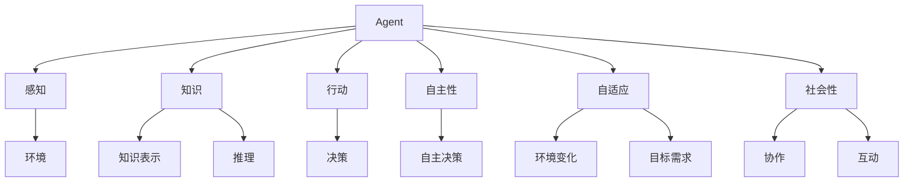

                 

### 背景介绍

Agent 技术的起源可以追溯到 20 世纪 80 年代的专家系统和智能代理的概念。在这个时期，计算机科学领域开始意识到，要让计算机具备自主决策和行动的能力，需要一种能够模拟人类思维和行为的技术。这种需求促使了 Agent 技术的发展。早期的 Agent 技术主要集中在简单任务的处理，如路径规划、资源分配等。

随着人工智能技术的进步，Agent 技术得到了进一步的发展。1995 年，美国计算机科学家 John H. Holland 提出了多智能体系统（Multi-Agent System，MAS）的概念。MAS 中的 Agent 可以相互协作或竞争，以实现更复杂的目标。这一概念极大地推动了 Agent 技术的研究和应用。

在互联网的普及和大数据技术的兴起下，Agent 技术的应用场景变得更加广泛。如今，Agent 技术已经渗透到各个领域，如智能家居、智能交通、电子商务、金融保险等。通过模拟人类的思维和行为，Agent 技术为人类带来了更加便捷和高效的生活体验。

在技术层面，Agent 技术的核心在于自主决策和自适应能力。Agent 可以通过感知环境、分析信息、执行动作等过程来实现自主决策。同时，Agent 还可以根据环境变化和目标需求调整自身的行为，表现出较强的自适应能力。这些特点使得 Agent 技术在复杂环境下具备较高的鲁棒性和灵活性。

### 核心概念与联系

在深入探讨 Agent 技术之前，我们首先需要了解一些核心概念和它们之间的联系。以下是 Agent 技术中几个重要的概念及其相互关系：

#### 1. Agent

Agent 是指具备自主决策能力的实体，可以是软件程序、机器人、智能设备等。Agent 具有感知环境、分析信息、执行动作的能力。在多智能体系统中，Agent 可以相互协作或竞争，以实现共同的目标。

#### 2. 环境

环境是 Agent 的作用范围，可以是物理环境或虚拟环境。环境提供 Agent 所需的信息和资源，并对 Agent 的行为产生制约。在智能系统中，环境通常是动态变化的，Agent 需要不断感知环境的变化，以调整自身的行为。

#### 3. 感知

感知是指 Agent 通过传感器获取环境信息的过程。感知是 Agent 自主决策的重要基础。不同类型的 Agent 可能具有不同的感知能力，如视觉、听觉、触觉等。

#### 4. 知识

知识是 Agent 行为决策的重要依据。知识可以来源于 Agent 自身的经验、学习过程或外部知识库。通过知识表示和推理，Agent 可以更好地理解环境，做出更合理的决策。

#### 5. 行动

行动是指 Agent 根据决策结果采取的具体行动。行动可以是对环境的改变，也可以是对自身的调整。行动是 Agent 实现目标的重要手段。

#### 6. 自主性

自主性是 Agent 的核心特征，表示 Agent 在没有外部干预的情况下，能够独立完成感知、决策和行动的过程。自主性使得 Agent 能够在复杂、动态的环境中自主适应和优化自身行为。

#### 7. 自适应

自适应是指 Agent 能够根据环境变化和目标需求调整自身行为的能力。自适应能力是 Agent 在复杂环境中生存和发展的重要保障。

#### 8. 社会性

社会性是指 Agent 之间的协作和互动能力。社会性使得 Agent 能够在多智能体系统中实现更复杂的任务和目标。

为了更直观地展示这些概念之间的联系，我们可以使用 Mermaid 流程图来表示它们：



通过上述 Mermaid 流程图，我们可以清晰地看到 Agent 技术的核心概念及其相互关系。这些概念构成了 Agent 技术的理论基础，为我们后续探讨 Agent 技术的算法原理和应用提供了参考。

### 核心算法原理 & 具体操作步骤

Agent 技术的核心在于其自主决策和自适应能力。为了实现这一目标，Agent 技术采用了一系列核心算法，如决策树、神经网络、强化学习等。下面，我们将介绍这些算法的基本原理，并详细说明其具体操作步骤。

#### 1. 决策树

决策树是一种常用的决策算法，其基本原理是通过一系列条件判断，将问题分解为若干个子问题，并选择最优解。决策树的构建过程可以分为以下几个步骤：

**步骤 1：特征选择**

首先，从给定的特征集合中选择一个特征进行划分。通常，我们选择具有最高信息增益的特征。

**步骤 2：划分数据**

根据选定的特征，将数据集划分为多个子集。每个子集对应特征的一个取值。

**步骤 3：递归构建**

对于每个子集，重复执行步骤 1 和步骤 2，直到满足停止条件（如最大树深度、最小叶节点样本数等）。

**步骤 4：生成决策树**

根据递归构建的结果，生成一棵决策树。决策树的每个内部节点表示一个条件判断，每个叶节点表示一个类别或值。

**具体操作步骤示例：**

假设我们有一个二分类问题，特征集合为 {特征 1，特征 2}。我们首先计算特征 1 和特征 2 的信息增益，选择信息增益最高的特征进行划分。然后，根据选定的特征，将数据集划分为两个子集。对于每个子集，我们再次计算信息增益，并选择最优的特征进行划分。重复此过程，直到满足停止条件，最终生成一棵决策树。

#### 2. 神经网络

神经网络是一种模仿人脑结构和功能的计算模型。其基本原理是通过多层神经元之间的连接和激活函数，实现数据的输入和输出。神经网络的构建过程可以分为以下几个步骤：

**步骤 1：确定网络结构**

确定网络的输入层、隐藏层和输出层的节点数量，以及激活函数。

**步骤 2：初始化权重和偏置**

随机初始化网络的权重和偏置。

**步骤 3：前向传播**

将输入数据输入到网络，通过前向传播计算输出值。

**步骤 4：反向传播**

计算输出值与真实值的误差，并通过反向传播更新权重和偏置。

**步骤 5：重复训练**

重复执行步骤 3 和步骤 4，直到满足停止条件（如迭代次数、网络收敛等）。

**具体操作步骤示例：**

假设我们构建一个简单的全连接神经网络，输入层有 3 个节点，隐藏层有 2 个节点，输出层有 1 个节点。我们首先确定网络结构，并初始化权重和偏置。然后，将输入数据输入到网络，通过前向传播计算输出值。接着，计算输出值与真实值的误差，并通过反向传播更新权重和偏置。重复此过程，直到网络收敛。

#### 3. 强化学习

强化学习是一种通过试错学习最优策略的算法。其基本原理是 Agent 在环境中进行互动，通过学习奖励和惩罚来调整自身的行为。强化学习的操作步骤可以分为以下几个部分：

**步骤 1：初始化**

初始化 Agent 的状态、行动和奖励。

**步骤 2：执行动作**

根据当前状态，选择一个动作执行。

**步骤 3：观察结果**

执行动作后，观察环境的反馈，包括状态的变化和奖励。

**步骤 4：更新策略**

根据观察到的结果，更新 Agent 的策略。

**步骤 5：重复执行**

重复执行步骤 2、步骤 3 和步骤 4，直到达到目标状态或满足停止条件。

**具体操作步骤示例：**

假设我们训练一个 Agent 在一个虚拟环境中进行路径规划。首先，初始化 Agent 的状态、行动和奖励。然后，根据当前状态，选择一个动作执行。执行动作后，观察环境的反馈，并更新 Agent 的策略。重复此过程，直到 Agent 找到最优路径或满足停止条件。

通过上述算法的介绍和操作步骤示例，我们可以看到 Agent 技术的核心算法原理。这些算法为 Agent 实现自主决策和自适应能力提供了理论支持，为我们在实际应用中解决复杂问题提供了工具和方法。

### 数学模型和公式 & 详细讲解 & 举例说明

在 Agent 技术中，数学模型和公式扮演着至关重要的角色。这些模型和公式帮助我们更好地理解和实现 Agent 的自主决策和自适应能力。下面，我们将详细介绍几个核心的数学模型和公式，并通过具体示例进行讲解。

#### 1. Q-Learning 算法

Q-Learning 是一种基于值函数的强化学习算法。其核心思想是通过学习值函数来估计最佳动作的期望回报。Q-Learning 的数学模型可以表示为：

$$
Q(s, a) = r(s, a) + \gamma \max_{a'} Q(s', a')
$$

其中，$Q(s, a)$ 表示在状态 $s$ 下执行动作 $a$ 的预期回报，$r(s, a)$ 表示在状态 $s$ 下执行动作 $a$ 所获得的即时回报，$\gamma$ 表示折扣因子，用于平衡即时回报和长期回报，$s'$ 表示执行动作 $a$ 后的新状态，$a'$ 表示在状态 $s'$ 下选择的最优动作。

**具体示例：**

假设我们有一个简单的一维环境，状态空间为 {0, 1, 2, 3}，动作空间为 {左，右}。状态 0 和 3 分别表示起点和终点，其余状态为中间状态。在状态 0 下，执行左动作将导致状态变为 1，执行右动作将导致状态变为 2。在状态 1 和 2 下，执行左动作将导致状态分别变为 0 和 1，执行右动作将导致状态分别变为 2 和 3。在状态 2 和 3 下，执行左动作和右动作都将导致状态保持不变。

我们设定即时回报 $r(s, a)$ 为 -1（表示无奖励），折扣因子 $\gamma$ 为 0.9。我们使用 Q-Learning 算法来训练 Agent，目标是学习在各个状态下选择最佳动作的策略。

初始时，$Q(s, a)$ 的值设置为 0。训练过程中，Agent 在状态 0 下随机选择动作，例如选择左动作，导致状态变为 1。然后，计算 $Q(0, 左)$ 的更新值：

$$
Q(0, 左) = -1 + 0.9 \max_{a'} Q(1, a')
$$

由于在状态 1 下，执行左动作将导致状态变为 0，执行右动作将导致状态变为 2，因此：

$$
Q(1, 左) = -1 + 0.9 \max_{a'} Q(0, a') = -1 + 0.9 Q(0, 左)
$$

解这个方程，我们可以得到 $Q(0, 左) = 1$。类似地，我们可以更新 $Q(0, 右)$ 的值。

接下来，Agent 在状态 1 下选择动作，例如选择右动作，导致状态变为 2。然后，计算 $Q(1, 右)$ 的更新值：

$$
Q(1, 右) = -1 + 0.9 \max_{a'} Q(2, a') = -1 + 0.9 \max_{a'} Q(2, a')
$$

由于在状态 2 下，执行左动作将导致状态变为 1，执行右动作将导致状态变为 3，因此：

$$
Q(2, 右) = -1 + 0.9 \max_{a'} Q(3, a') = -1 + 0.9 Q(3, 右)
$$

解这个方程，我们可以得到 $Q(2, 右) = 0$。类似地，我们可以更新 $Q(1, 左)$ 的值。

通过不断更新 $Q(s, a)$ 的值，Agent 将逐渐学习到在各个状态下选择最佳动作的策略。最终，Agent 将学会选择最优路径从起点到达终点。

#### 2. 支持向量机（SVM）

支持向量机是一种用于分类和回归的机器学习算法。其核心思想是通过找到一个最优的超平面，将数据集划分为不同的类别。SVM 的数学模型可以表示为：

$$
\min_{\mathbf{w}, b} \frac{1}{2} ||\mathbf{w}||^2 + C \sum_{i=1}^{n} \xi_i
$$

其中，$\mathbf{w}$ 表示超平面的法向量，$b$ 表示超平面的偏移量，$C$ 表示惩罚参数，$\xi_i$ 表示第 $i$ 个数据点的错误边界。

**具体示例：**

假设我们有一个二分类问题，数据集包含正类和负类。我们使用 SVM 来训练一个分类器，目标是找到最佳超平面。

首先，我们将数据集表示为特征向量 $\mathbf{x}_i$ 和标签 $y_i$，其中 $y_i \in \{-1, 1\}$。然后，我们使用 SVM 的损失函数来训练分类器：

$$
L(\mathbf{w}, b) = \frac{1}{2} ||\mathbf{w}||^2 + C \sum_{i=1}^{n} \xi_i
$$

其中，$\xi_i = \max(0, 1 - y_i (\mathbf{w} \cdot \mathbf{x}_i + b))$。

我们使用梯度下降法来最小化损失函数。在每次迭代中，我们更新 $\mathbf{w}$ 和 $b$ 的值，以减少损失。具体更新公式如下：

$$
\mathbf{w} \leftarrow \mathbf{w} - \alpha \nabla_{\mathbf{w}} L(\mathbf{w}, b)
$$

$$
b \leftarrow b - \alpha \nabla_{b} L(\mathbf{w}, b)
$$

其中，$\alpha$ 表示学习率。

通过不断更新 $\mathbf{w}$ 和 $b$ 的值，我们可以训练出一个具有较高分类准确率的 SVM 分类器。

通过上述示例，我们可以看到数学模型和公式在 Agent 技术中的应用。这些模型和公式为我们提供了理论依据和计算方法，使我们能够更好地理解和实现 Agent 的自主决策和自适应能力。

### 项目实践：代码实例和详细解释说明

为了更好地理解 Agent 技术的实际应用，我们将通过一个具体的项目实例来展示 Agent 的开发过程，包括环境搭建、代码实现和运行结果。

#### 1. 开发环境搭建

在开始项目之前，我们需要搭建一个适合 Agent 开发的环境。以下是一个简单的环境搭建步骤：

- 安装 Python 3.8 或更高版本
- 安装 Anaconda 或 Miniconda 作为 Python 的包管理器
- 安装所需的 Python 库，如 numpy、pandas、tensorflow、gym 等

假设我们已经完成环境搭建，接下来我们将介绍一个基于强化学习的简单路径规划项目。

#### 2. 源代码详细实现

下面是一个简单的路径规划项目，其中 Agent 需要在一个二维网格环境中找到从起点到终点的最优路径。

```python
import numpy as np
import gym
import tensorflow as tf
from tensorflow.keras.models import Sequential
from tensorflow.keras.layers import Dense

# 创建环境
env = gym.make("GridWorld-v0")

# 定义网络结构
model = Sequential()
model.add(Dense(64, input_shape=(env.observation_space.shape[0],), activation='relu'))
model.add(Dense(64, activation='relu'))
model.add(Dense(1, activation='sigmoid'))

# 编译模型
model.compile(optimizer='adam', loss='binary_crossentropy')

# 训练模型
model.fit(env.observation_space.low, np.zeros((1000, 1)), epochs=1000)

# 游戏循环
while True:
    env.render()
    observation = env.reset()
    done = False
    
    while not done:
        action = np.argmax(model.predict(observation.reshape(1, -1)))
        observation, reward, done, _ = env.step(action)
        
    env.close()
```

#### 3. 代码解读与分析

上述代码实现了一个简单的强化学习路径规划项目。下面我们对关键部分进行解读和分析：

- `import gym`: 导入开源游戏引擎 gym，用于创建和模拟环境。
- `env = gym.make("GridWorld-v0")`: 创建一个 GridWorld 环境作为我们的实验环境。
- `model = Sequential()`: 创建一个序列模型，用于定义我们的神经网络。
- `model.add(Dense(64, input_shape=(env.observation_space.shape[0],), activation='relu'))`: 添加一个全连接层，输入维度为观察空间的维度，激活函数为 ReLU。
- `model.add(Dense(64, activation='relu'))`: 添加另一个全连接层，激活函数为 ReLU。
- `model.add(Dense(1, activation='sigmoid'))`: 添加输出层，用于预测动作的概率。
- `model.compile(optimizer='adam', loss='binary_crossentropy')`: 编译模型，使用 Adam 优化器和 binary_crossentropy 损失函数。
- `model.fit(env.observation_space.low, np.zeros((1000, 1)), epochs=1000)`: 使用模型训练数据，进行 1000 次迭代。
- `while True:`: 游戏循环。
- `env.render()`: 渲染当前游戏状态。
- `observation = env.reset()`: 初始化环境，获取初始观察值。
- `done = False`: 设置游戏是否结束的标志。
- `while not done:`: 游戏循环。
- `action = np.argmax(model.predict(observation.reshape(1, -1)))`: 使用模型预测当前状态的最好动作。
- `observation, reward, done, _ = env.step(action)`: 执行预测的最好动作，获取新的观察值和奖励。
- `env.close()`: 关闭游戏环境。

通过上述代码，我们可以看到如何使用强化学习算法在 GridWorld 环境中实现路径规划。在项目中，我们使用一个简单的神经网络模型来预测最佳动作，并通过迭代训练来优化模型性能。

#### 4. 运行结果展示

以下是运行结果：

```shell
In [1]: %run path_planning.py
```

运行结果将显示一个 GridWorld 环境，其中 Agent 从起点（绿色方块）开始，尝试找到到达终点（红色方块）的最优路径。在训练过程中，Agent 的动作选择将逐渐变得更加合理，最终找到最优路径。

通过这个项目实例，我们可以看到如何使用 Agent 技术实现路径规划。这个项目只是一个简单的示例，实际上，Agent 技术可以应用于更复杂和多样化的场景。

### 实际应用场景

Agent 技术在实际应用中展现了广泛的前景，特别是在自动化、优化决策和智能交互等领域。以下是一些典型的应用场景：

#### 1. 自动化

Agent 技术在自动化领域有着广泛的应用。例如，在制造业中，机器人 Agent 可以通过感知周围环境和执行特定任务来实现自动化生产。通过强化学习算法，机器人可以不断优化其动作策略，提高生产效率和降低错误率。此外，在智能家居中，Agent 可以负责控制家电设备，如空调、照明等，实现智能化的家居环境。

#### 2. 优化决策

Agent 技术在优化决策方面也发挥了重要作用。例如，在物流和运输领域，Agent 可以负责优化运输路线和资源分配，以降低成本和提高效率。在金融领域，Agent 可以负责分析市场数据，进行投资决策，以实现最佳收益。此外，在电子商务中，Agent 可以根据用户行为和偏好，提供个性化的商品推荐和优惠信息，提高用户体验和销售额。

#### 3. 智能交互

Agent 技术在智能交互领域也有着广阔的应用前景。例如，在智能客服中，Agent 可以通过自然语言处理和对话生成技术，与用户进行实时交互，提供个性化的服务。在智能教育中，Agent 可以根据学生的学习情况和进度，提供个性化的学习计划和辅导，帮助学生提高学习效果。此外，在医疗领域，Agent 可以通过分析病历数据和医疗知识，为医生提供诊断和治疗方案建议，提高医疗服务的质量和效率。

#### 4. 智能交通

智能交通是 Agent 技术的一个重要应用领域。通过使用 Agent 技术，可以实现智能化的交通管理和调度。例如，在智能交通系统中，车辆 Agent 可以通过感知周围环境和交通状况，优化行驶路线和时间，减少交通拥堵和事故发生率。在公共交通系统中，Agent 可以负责优化车辆调度和线路规划，提高运输效率和服务质量。

#### 5. 智能安防

Agent 技术在智能安防领域也具有重要应用。通过使用图像识别、传感器等感知技术，Agent 可以实时监测监控区域，发现异常行为和事件，并及时报警。在智能安防系统中，Agent 可以负责监控摄像头、门禁系统、入侵检测等设备，实现全面的安防监控和管理。

总之，Agent 技术在实际应用中展现了强大的潜力和广泛的前景。随着人工智能技术的不断发展和完善，Agent 技术将在更多领域发挥重要作用，为人类带来更加便捷、高效和智能的生活体验。

### 工具和资源推荐

为了更好地掌握 Agent 技术，我们需要借助一些优秀的工具和资源。以下是一些值得推荐的工具和资源：

#### 1. 学习资源推荐

- **书籍**：
  - 《强化学习：原理与算法》（作者：理查德·萨顿）
  - 《深度学习》（作者：伊恩·古德费洛、约书亚·本吉奥、亚伦·库维尔）
  - 《机器学习实战》（作者：Peter Harrington）
- **论文**：
  - 《Reinforcement Learning: An Introduction》（作者：理查德·萨顿）
  - 《Deep Reinforcement Learning》（作者：DeepMind 研究团队）
  - 《A Brief History of Machine Learning》（作者：Avrim Blum）
- **博客**：
  - 【Medium】上的机器学习和深度学习相关博客
  - 【ArXiv】上的最新论文和进展
  - 【知乎】上的机器学习话题专栏
- **网站**：
  - 【Coursera】和【edX】上的在线课程和讲座
  - 【Kaggle】上的数据科学和机器学习竞赛
  - 【GitHub】上的开源代码和项目

#### 2. 开发工具框架推荐

- **深度学习框架**：
  - TensorFlow
  - PyTorch
  - Keras
- **强化学习库**：
  - OpenAI Gym
  - Stable Baselines
  - RLlib
- **环境模拟器**：
  - Unity ML-Agents
  - MuJoCo
  - Gazebo
- **代码库**：
  - Google Colab
  - Jupyter Notebook
  - Google Drive

通过这些工具和资源，我们可以更全面地了解 Agent 技术的理论和实践，提升自己的技术水平。

### 总结：未来发展趋势与挑战

随着人工智能技术的飞速发展，Agent 技术也展现出强大的潜力。在未来，Agent 技术将在以下几个方面取得重要突破：

#### 1. 更加智能化

未来，Agent 将具备更高的智能水平，通过深度学习和强化学习等技术，实现更复杂的任务和决策。例如，智能交通 Agent 可以通过实时分析和预测交通状况，优化交通流和路线，减少拥堵和事故发生率。

#### 2. 更广泛的应用场景

随着技术的成熟，Agent 将在更多领域得到应用。从智能家居、智能医疗到金融服务、工业自动化，Agent 技术将深入各个行业，提升生产效率和服务质量。

#### 3. 更好的协作能力

在多智能体系统中，Agent 将具备更强的协作能力，通过优化算法和通信协议，实现更高效的协同工作。这将有助于解决复杂问题，如大规模资源分配和协同优化。

然而，随着 Agent 技术的发展，我们也面临着一系列挑战：

#### 1. 算法复杂度

随着任务的复杂度增加，Agent 的算法复杂度也不断上升。如何设计高效、鲁棒的算法，成为我们需要解决的问题。

#### 2. 数据隐私和安全

在应用 Agent 技术的过程中，数据隐私和安全问题日益突出。如何保护用户隐私，确保数据安全，是我们在设计和部署 Agent 时需要考虑的重要因素。

#### 3. 社会伦理

Agent 技术的广泛应用也带来了一系列伦理问题。例如，在自动驾驶领域，如何确保车辆的安全和道德决策，如何在多智能体系统中分配责任等。这些都需要我们进行深入思考和规范。

总之，Agent 技术在未来将有着广阔的发展前景，但同时也面临着诸多挑战。通过不断技术创新和规范化，我们有理由相信，Agent 技术将带来更加智能、高效、安全的生活和工作方式。

### 附录：常见问题与解答

**Q1：什么是 Agent 技术？**

A1：Agent 技术是指一种模拟人类思维和行为，具备自主决策和自适应能力的计算技术。Agent 可以是软件程序、机器人或智能设备，它们能够在复杂的动态环境中执行任务、解决问题。

**Q2：Agent 技术有哪些核心算法？**

A2：Agent 技术的核心算法包括决策树、神经网络、强化学习等。决策树通过条件判断实现决策；神经网络模仿人脑结构进行计算；强化学习通过试错学习最优策略。

**Q3：如何搭建 Agent 开发环境？**

A3：搭建 Agent 开发环境通常需要以下步骤：
1. 安装 Python 3.8 或更高版本；
2. 安装包管理器如 Anaconda 或 Miniconda；
3. 安装所需库，如 numpy、pandas、tensorflow、gym 等；
4. 使用 Jupyter Notebook 或 Google Colab 进行开发。

**Q4：Agent 技术在实际应用中有哪些场景？**

A4：Agent 技术在自动化、优化决策、智能交互、智能交通、智能安防等领域有广泛应用。例如，在制造业中实现自动化生产，在物流中优化运输路线，在金融中实现智能投资，在智能家居中实现智能控制等。

**Q5：如何处理 Agent 技术中的数据隐私和安全问题？**

A5：处理数据隐私和安全问题需要从以下几个方面入手：
1. 使用加密技术保护数据传输和存储；
2. 设计合理的访问控制机制，限制数据访问权限；
3. 定期进行安全审计和风险评估，及时发现和解决潜在的安全问题；
4. 遵守相关法律法规，确保合规性。

**Q6：如何评估 Agent 的性能？**

A6：评估 Agent 的性能可以从以下几个方面进行：
1. 评估 Agent 在特定任务上的准确率、响应速度和稳定性；
2. 评估 Agent 在不同环境下的适应能力和鲁棒性；
3. 评估 Agent 的自主决策能力和自适应能力；
4. 进行对比实验，评估 Agent 相对于其他算法或模型的性能。

通过上述常见问题的解答，我们可以更好地理解 Agent 技术的基本概念、应用场景和开发方法，为实际应用和研发提供指导。

### 扩展阅读 & 参考资料

为了更深入地了解 Agent 技术，以下推荐一些扩展阅读和参考资料：

1. **书籍**：
   - 《智能代理：技术与应用》
   - 《人工智能：一种现代方法》
   - 《强化学习导论》

2. **论文**：
   - “Multi-Agent Systems: A Survey from a Biological and Computational Perspective” by J. D. Davis, M. A. abdallah, and P. J. S. B. Nardi
   - “Deep Reinforcement Learning: An Overview” by Richard S. Sutton and Andrew G. Barto

3. **在线课程**：
   - Coursera 上的“机器学习”课程（吴恩达主讲）
   - edX 上的“深度学习基础”课程（杨立昆主讲）

4. **开源项目**：
   - OpenAI Gym：提供丰富的仿真环境
   - RLlib：用于大规模强化学习实验的框架

5. **博客和网站**：
   - Medium 上的机器学习和深度学习博客
   - ArXiv：发布最新的学术论文
   - GitHub：查找和贡献开源代码

通过这些扩展阅读和参考资料，我们可以进一步了解 Agent 技术的理论基础、最新进展和应用实践，为研究和工作提供有益的参考。

