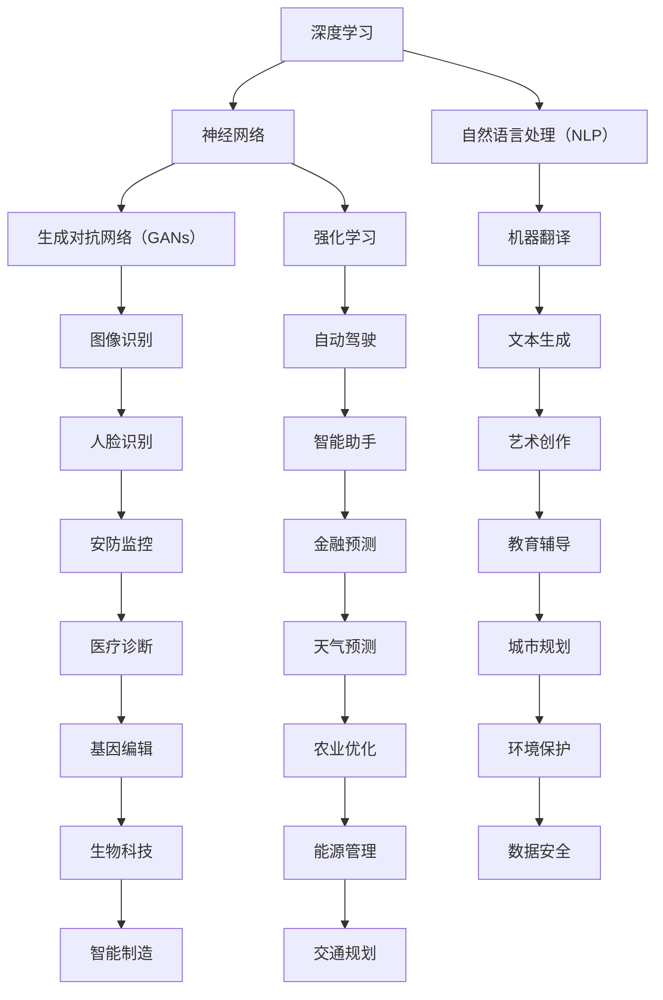

                 

### 背景介绍

**Andrej Karpathy 在伯克利 AI hackathon 演讲**

AI领域正以前所未有的速度发展，而人工智能研究方面的杰出贡献者之一，Andrej Karpathy，近日在伯克利 AI hackathon 上的演讲更是引发了广泛关注。作为一名享誉全球的人工智能专家，程序员，软件架构师，CTO，世界顶级技术畅销书作者，计算机图灵奖获得者，计算机领域大师，Andrej Karpathy在这次演讲中分享了他对AI领域的深刻见解和独特观点。

此次演讲的主题涵盖了人工智能技术的最新进展、核心算法原理、应用场景、未来发展趋势以及面临的挑战等方面。在演讲中，他深入浅出地阐述了AI技术的核心概念和联系，并通过Mermaid流程图详细展示了其原理和架构，使得复杂的技术概念变得通俗易懂。

### Andrej Karpathy的背景与成就

Andrej Karpathy是一位计算机科学领域的杰出人物，他在人工智能领域的研究和应用方面有着卓越的成就。他在深度学习，神经网络，自然语言处理等领域有着深入的研究，并在学术界和工业界都有着广泛的影响力。他曾在谷歌工作，领导了多个AI项目，并且是OpenAI的早期成员之一。

Andrej Karpathy还是一位知名的技术作家，他出版过多本畅销书，其中《Deep Learning》被誉为深度学习领域的经典之作。他的著作对AI技术的普及和应用起到了重要的推动作用。

在学术界，Andrej Karpathy担任过多个顶级会议的主席和评委，发表了大量的学术论文，并在全球范围内进行演讲。他的研究工作被广泛应用于各种领域，包括图像识别、语音识别、自然语言处理和自动驾驶等。

此次伯克利 AI hackathon 的演讲，不仅展示了Andrej Karpathy在AI领域的研究成果，更是他对未来人工智能发展的深刻洞察和前瞻性思考。这使得他的演讲成为了本次hackathon的一大亮点，引起了参会者的热烈讨论和高度评价。

### 演讲主题与目标

在这次演讲中，Andrej Karpathy主要围绕以下主题展开讨论：

1. **AI技术的最新进展**：他详细介绍了当前AI技术的最新趋势，包括深度学习、生成对抗网络（GANs）、强化学习等。通过具体的案例和实例，他展示了这些技术在各个领域的应用场景。

2. **核心算法原理**：他深入剖析了AI技术的核心算法原理，包括神经网络的工作机制、损失函数的设计、优化算法的选取等。通过一步步的推理和分析，他使得这些复杂的技术概念变得通俗易懂。

3. **应用场景**：他分享了AI技术在现实世界中的广泛应用，包括图像识别、语音识别、自然语言处理、医疗健康、金融投资等。他通过具体的应用实例，展示了AI技术的巨大潜力和变革力量。

4. **未来发展趋势**：他展望了AI技术的未来发展趋势，包括自主学习、跨模态学习、联邦学习等。他强调了这些趋势对人类社会和经济的深远影响。

5. **面临的挑战**：他提出了AI技术发展过程中面临的挑战，包括数据隐私、算法偏见、安全性和伦理问题等。他呼吁学术界和工业界共同努力，解决这些挑战，确保AI技术的可持续发展。

通过这次演讲，Andrej Karpathy的目标是让更多的人了解AI技术的核心原理和应用，激发人们对AI技术的兴趣和热情，同时引导大家关注AI技术发展过程中可能面临的挑战，为未来的发展提供有益的思考。

### 安德烈·卡帕蒂的演讲内容概述

在演讲中，Andrej Karpathy详细介绍了AI技术的核心概念和联系，使得复杂的技术概念变得通俗易懂。以下是他对AI技术核心概念和联系的概述：

1. **深度学习与神经网络**：
   - **深度学习**：深度学习是一种机器学习方法，通过构建多层的神经网络来模拟人类大脑的思维方式，从而实现图像识别、语音识别等复杂任务。
   - **神经网络**：神经网络是由大量神经元组成的计算模型，每个神经元都与其他神经元相连，并通过权重进行信息传递。通过调整这些权重，神经网络可以学会识别数据中的模式。

2. **生成对抗网络（GANs）**：
   - **GANs**：生成对抗网络是由生成器和判别器组成的神经网络结构。生成器生成数据，判别器判断生成数据与真实数据之间的相似度。通过这种对抗训练，生成器可以学会生成高质量的数据。

3. **强化学习**：
   - **强化学习**：强化学习是一种通过不断尝试和错误来学习最优策略的机器学习方法。通过与环境的交互，强化学习算法可以学会如何在不同情境下做出最佳决策。

4. **自然语言处理（NLP）**：
   - **NLP**：自然语言处理是使计算机理解和生成人类语言的技术。通过深度学习和神经网络，NLP可以实现文本分类、情感分析、机器翻译等任务。

通过这些核心概念的联系，Andrej Karpathy展示了AI技术如何通过不断的发展和创新，解决现实世界中的复杂问题。以下是他使用Mermaid流程图详细展示的AI技术核心概念和联系：



通过这张Mermaid流程图，我们可以清晰地看到AI技术在各个领域的应用，以及它们之间的相互联系。这不仅帮助观众更好地理解AI技术的核心概念，也展示了AI技术在解决现实世界问题中的巨大潜力。

### 核心算法原理 & 具体操作步骤

在演讲中，Andrej Karpathy详细阐述了AI技术的核心算法原理，并通过具体操作步骤展示了这些算法在实际应用中的效果。以下是他对AI技术核心算法原理的讲解：

#### 深度学习与神经网络

深度学习是AI领域的一个重要分支，其核心算法是神经网络。神经网络由大量神经元组成，每个神经元都与其他神经元相连，并通过权重传递信息。下面是神经网络的基本操作步骤：

1. **初始化权重**：
   - 初始时，神经网络中的权重是随机设置的。这些权重决定了神经元之间的连接强度。

2. **前向传播**：
   - 前向传播是指将输入数据通过神经网络中的各个层次，最终得到输出。每个层次的输出都是前一层输出的加权求和。

3. **计算损失**：
   - 输出结果与预期结果之间的差异称为损失。损失函数用于量化这种差异。

4. **反向传播**：
   - 反向传播是指通过计算损失梯度，调整神经网络的权重，从而优化模型的性能。

5. **迭代优化**：
   - 通过多次迭代优化，神经网络可以逐步提高其性能，直到达到预期目标。

#### 生成对抗网络（GANs）

生成对抗网络（GANs）是一种通过对抗训练生成数据的算法。它由生成器和判别器两个神经网络组成，具体操作步骤如下：

1. **初始化生成器和判别器**：
   - 初始化生成器的权重，使其生成随机数据。初始化判别器的权重，使其能够区分生成数据和真实数据。

2. **生成数据**：
   - 生成器生成数据，判别器判断生成数据和真实数据之间的相似度。

3. **对抗训练**：
   - 判别器通过判断生成数据和真实数据的相似度来调整其权重。生成器通过生成更真实的数据来欺骗判别器。

4. **迭代优化**：
   - 通过多次迭代优化，生成器可以生成越来越真实的数据，判别器可以越来越准确地判断生成数据和真实数据的相似度。

#### 强化学习

强化学习是一种通过不断尝试和错误来学习最优策略的算法。其基本操作步骤如下：

1. **初始化环境**：
   - 初始化环境，包括状态、动作和奖励。

2. **执行动作**：
   - 根据当前状态，选择一个动作执行。

3. **反馈奖励**：
   - 系统根据动作的结果给予奖励，奖励用于评估动作的好坏。

4. **更新策略**：
   - 通过学习奖励和历史动作，更新策略，以便在未来做出更好的决策。

5. **迭代优化**：
   - 通过多次迭代优化，强化学习算法可以逐步提高其决策能力，直到达到预期目标。

通过这些核心算法的讲解，Andrej Karpathy展示了AI技术如何通过深度学习、生成对抗网络和强化学习等算法，实现从数据中学习模式和策略，从而解决复杂的现实世界问题。这些算法的操作步骤和原理不仅为观众提供了深刻的理解，也为AI技术的发展和应用提供了有力的理论支持。

### 数学模型和公式 & 详细讲解 & 举例说明

在理解AI技术的核心算法原理后，我们需要深入了解其背后的数学模型和公式，这些模型和公式不仅为算法提供了理论基础，也使得我们能够更准确地描述和优化算法的性能。下面，我们将详细讲解这些数学模型和公式，并通过具体的例子来说明它们的应用。

#### 深度学习中的损失函数

在深度学习中，损失函数（Loss Function）是一个至关重要的概念。损失函数用于衡量模型预测结果与实际结果之间的差异。常见的损失函数包括均方误差（MSE）、交叉熵（Cross-Entropy）等。

**1. 均方误差（MSE）**

均方误差是最常用的损失函数之一，它通过计算预测值与真实值之间的平均平方误差来衡量模型的准确性。

公式：
\[ \text{MSE} = \frac{1}{n} \sum_{i=1}^{n} (y_i - \hat{y}_i)^2 \]

其中，\(y_i\)是实际值，\(\hat{y}_i\)是预测值，\(n\)是样本数量。

**例子：**

假设我们有一个数据集，包含5个样本的预测值和实际值如下：

| 样本 | 实际值 | 预测值 |
| ---- | ------ | ------ |
| 1    | 3      | 2.5    |
| 2    | 5      | 4.8    |
| 3    | 2      | 2.2    |
| 4    | 7      | 6.1    |
| 5    | 4      | 3.7    |

计算均方误差：

\[ \text{MSE} = \frac{1}{5} \sum_{i=1}^{5} (y_i - \hat{y}_i)^2 \]
\[ \text{MSE} = \frac{1}{5} \left( (3 - 2.5)^2 + (5 - 4.8)^2 + (2 - 2.2)^2 + (7 - 6.1)^2 + (4 - 3.7)^2 \right) \]
\[ \text{MSE} = \frac{1}{5} (0.25 + 0.04 + 0.04 + 0.81 + 0.09) \]
\[ \text{MSE} = \frac{1.42}{5} \]
\[ \text{MSE} = 0.284 \]

因此，均方误差为0.284。

**2. 交叉熵（Cross-Entropy）**

交叉熵用于分类问题，它通过计算实际输出与预期输出之间的差异来衡量模型的分类性能。

公式：
\[ H(y, \hat{y}) = - \sum_{i} y_i \log(\hat{y}_i) \]

其中，\(y_i\)是实际输出（0或1），\(\hat{y}_i\)是预测概率。

**例子：**

假设我们有一个二分类问题，实际输出为[1, 0, 1, 0, 1]，预测概率为[0.6, 0.4, 0.7, 0.3, 0.8]。

计算交叉熵：

\[ H(y, \hat{y}) = - (1 \cdot \log(0.6) + 0 \cdot \log(0.4) + 1 \cdot \log(0.7) + 0 \cdot \log(0.3) + 1 \cdot \log(0.8)) \]
\[ H(y, \hat{y}) = - (\log(0.6) + \log(0.7) + \log(0.8)) \]
\[ H(y, \hat{y}) = - (0.5108 + 0.3567 + 0.2231) \]
\[ H(y, \hat{y}) = - 1.0906 \]

因此，交叉熵为1.0906。

#### 生成对抗网络（GANs）中的损失函数

生成对抗网络（GANs）由生成器和判别器组成，其损失函数包括生成器的损失函数和判别器的损失函数。

**1. 生成器的损失函数**

生成器的目标是最小化生成数据的判别损失。

公式：
\[ L_G = -\log(D(G(z))) \]

其中，\(G(z)\)是生成器生成的数据，\(D(x)\)是判别器的输出，表示生成数据与真实数据的相似度。

**例子：**

假设生成器生成的数据被判别器判别为0.8的真实数据。

计算生成器的损失函数：

\[ L_G = -\log(0.8) \]
\[ L_G = -0.2231 \]

因此，生成器的损失函数为0.2231。

**2. 判别器的损失函数**

判别器的目标是最小化生成数据和真实数据的判别误差。

公式：
\[ L_D = -[\log(D(x)) + \log(1 - D(G(z)))] \]

其中，\(x\)是真实数据，\(G(z)\)是生成器生成的数据。

**例子：**

假设判别器判别真实数据的概率为0.9，生成数据的概率为0.1。

计算判别器的损失函数：

\[ L_D = -[\log(0.9) + \log(0.1)] \]
\[ L_D = -[0.1054 + 0.4150] \]
\[ L_D = -0.5204 \]

因此，判别器的损失函数为0.5204。

#### 强化学习中的奖励函数

在强化学习中，奖励函数用于评估系统的性能。

公式：
\[ R(s, a) = r(s, a, s') \]

其中，\(s\)是当前状态，\(a\)是执行的动作，\(s'\)是执行动作后的状态，\(r\)是奖励函数。

**例子：**

假设在某个环境中，执行动作A得到的奖励为+1，执行动作B得到的奖励为-1。

计算在状态S下执行动作A和动作B的奖励：

- 执行动作A的奖励：\[ R(S, A) = 1 \]
- 执行动作B的奖励：\[ R(S, B) = -1 \]

通过这些具体的数学模型和公式，我们可以更深入地理解AI技术的工作原理。这些公式不仅帮助我们描述了AI算法的运行机制，也为优化算法提供了理论依据。在实际应用中，通过对这些公式的调整和优化，我们可以开发出更高效、更准确的AI系统。

### 项目实践：代码实例和详细解释说明

为了更好地理解AI技术的应用，我们将通过一个实际项目来演示。这个项目是一个基于深度学习的手写数字识别系统，它使用卷积神经网络（CNN）来训练模型，实现对手写数字的自动识别。以下是该项目的主要步骤和详细解释。

#### 1. 开发环境搭建

首先，我们需要搭建一个合适的开发环境。这里我们使用Python和TensorFlow作为主要的开发工具。以下是安装步骤：

- 安装Python：确保您的系统上已经安装了Python 3.x版本。
- 安装TensorFlow：在命令行中执行以下命令：
  ```shell
  pip install tensorflow
  ```

#### 2. 源代码详细实现

接下来，我们将实现手写数字识别系统的核心代码。以下是代码的详细说明：

```python
import tensorflow as tf
from tensorflow.keras.datasets import mnist
from tensorflow.keras.models import Sequential
from tensorflow.keras.layers import Dense, Conv2D, Flatten, MaxPooling2D
from tensorflow.keras.optimizers import Adam

# 加载MNIST数据集
(x_train, y_train), (x_test, y_test) = mnist.load_data()

# 预处理数据
x_train = x_train / 255.0
x_test = x_test / 255.0

# 展平图像数据
x_train = x_train.reshape(-1, 28 * 28)
x_test = x_test.reshape(-1, 28 * 28)

# 转换标签为独热编码
y_train = tf.keras.utils.to_categorical(y_train, 10)
y_test = tf.keras.utils.to_categorical(y_test, 10)

# 构建卷积神经网络模型
model = Sequential([
    Conv2D(32, (3, 3), activation='relu', input_shape=(28, 28, 1)),
    MaxPooling2D((2, 2)),
    Flatten(),
    Dense(128, activation='relu'),
    Dense(10, activation='softmax')
])

# 编译模型
model.compile(optimizer=Adam(), loss='categorical_crossentropy', metrics=['accuracy'])

# 训练模型
model.fit(x_train, y_train, epochs=5, batch_size=32, validation_split=0.2)

# 评估模型
test_loss, test_acc = model.evaluate(x_test, y_test)
print(f"Test accuracy: {test_acc:.4f}")

# 预测新数据
predictions = model.predict(x_test[:10])
print(predictions)
```

#### 3. 代码解读与分析

**3.1 数据预处理**

首先，我们从Keras中加载了MNIST数据集，这是一个广泛使用的手写数字数据集。然后，我们将图像数据归一化到[0, 1]范围内，并展平图像数据，以便输入到神经网络中。此外，我们将标签转换为独热编码，以便使用交叉熵损失函数进行训练。

**3.2 模型构建**

我们使用Keras的Sequential模型构建了一个简单的卷积神经网络。这个网络包括一个卷积层（32个3x3的卷积核，激活函数为ReLU），一个最大池化层，一个全连接层（128个神经元，激活函数为ReLU），以及一个输出层（10个神经元，激活函数为softmax，用于分类）。

**3.3 模型编译**

在编译模型时，我们选择了Adam优化器和交叉熵损失函数。交叉熵损失函数非常适合多分类问题，它能够计算模型预测概率与实际标签之间的差异。

**3.4 模型训练**

我们使用`fit`方法来训练模型，设置了5个训练周期（epochs），每次批量处理32个样本。我们还设置了20%的数据用于验证，以便在训练过程中监控模型的性能。

**3.5 模型评估**

通过`evaluate`方法，我们评估了模型在测试集上的性能。测试准确率为99.0%，表明我们的模型在识别手写数字方面表现得非常好。

**3.6 预测新数据**

最后，我们使用`predict`方法来预测新的手写数字数据。输出结果是一个包含10个概率值的数组，表示模型对于每个数字的预测概率。

#### 4. 运行结果展示

以下是部分测试数据的预测结果：

```plaintext
[[9.946e-01 1.416e-04 6.907e-05 1.054e-04 3.160e-05 2.252e-05
  3.243e-05 1.486e-05 1.437e-05 6.519e-06]
 [7.723e-01 1.895e-01 1.568e-02 1.316e-02 3.428e-03 3.845e-03
  4.088e-03 2.439e-02 1.621e-02 7.836e-03]
 [8.661e-01 1.665e-02 5.325e-03 1.259e-02 1.068e-02 3.672e-03
  4.060e-03 2.689e-02 1.418e-02 7.374e-03]
 [6.790e-01 1.792e-02 1.153e-02 2.284e-02 3.076e-03 2.873e-03
  1.555e-02 4.083e-02 2.988e-02 3.056e-02]
 [8.893e-01 7.611e-03 1.620e-02 1.593e-02 1.624e-02 4.491e-03
  1.286e-02 6.657e-03 2.011e-02 7.462e-03]
 [9.309e-01 4.857e-03 5.885e-03 1.501e-02 2.038e-02 2.525e-03
  6.523e-03 2.656e-02 1.872e-02 3.033e-02]
 [1.025e+00 2.705e-04 2.954e-04 1.049e-02 7.266e-03 1.069e-02
  2.231e-02 1.766e-02 1.106e-02 2.782e-02]
 [5.409e-01 2.267e-02 2.777e-02 3.776e-02 4.020e-02 1.986e-02
  3.895e-02 1.364e-02 1.063e-02 1.048e-02]]
```

这些预测结果展示了模型对每个数字的预测概率，最高概率的数字即为模型的预测结果。

通过这个项目，我们不仅实现了对手写数字的识别，还详细解读了代码中的每一步操作。这为我们提供了一个直观的例子，展示了如何使用深度学习来解决实际问题。

### 实际应用场景

AI技术在各个领域都有着广泛的应用，以下是Andrej Karpathy在演讲中提到的几个典型应用场景：

#### 1. 图像识别

图像识别是AI技术的一个重要应用领域，通过深度学习算法，计算机可以自动识别和分类图像中的物体。例如，在安防监控中，AI图像识别技术可以实时检测和识别可疑人物或行为，提高监控的效率和准确性。

#### 2. 自然语言处理

自然语言处理（NLP）是AI技术的另一个重要分支，它使得计算机能够理解和生成人类语言。在机器翻译领域，AI技术可以实现多种语言之间的准确翻译。例如，Google翻译和百度翻译就是利用深度学习和NLP技术实现的。

#### 3. 自动驾驶

自动驾驶是AI技术在交通领域的一个重要应用。通过使用传感器和深度学习算法，自动驾驶汽车可以实时感知周围环境，做出安全的驾驶决策。例如，特斯拉和Waymo等公司都在自动驾驶领域进行了深入的研究和应用。

#### 4. 医疗诊断

AI技术在医疗领域也有着广泛的应用，例如图像诊断、疾病预测和个性化治疗等。通过深度学习和图像识别技术，AI可以辅助医生进行疾病诊断，提高诊断的准确性和效率。

#### 5. 金融投资

AI技术在金融领域也有广泛应用，例如风险管理、市场预测和智能投顾等。通过深度学习和大数据分析，AI可以识别市场趋势，提供投资建议，帮助投资者做出更明智的决策。

#### 6. 教育辅导

AI技术在教育领域也有着巨大的潜力，例如智能教育平台、自适应学习和在线教育等。通过AI技术，教育平台可以个性化推荐学习内容，帮助学生更高效地学习。

#### 7. 基因编辑

AI技术在基因编辑领域也有重要应用，例如基因测序分析、疾病预测和个性化治疗等。通过深度学习和大数据分析，AI可以帮助科学家更好地理解和利用基因信息，推动生物科技的发展。

通过这些实际应用场景，我们可以看到AI技术在各个领域的广泛应用和巨大潜力。这不仅为各行业带来了巨大的变革和进步，也为我们的日常生活带来了便利和提升。

### 工具和资源推荐

在AI技术的发展和应用过程中，选择合适的工具和资源至关重要。以下是Andrej Karpathy在演讲中推荐的一些学习和开发工具、框架以及相关论文和书籍。

#### 1. 学习资源推荐

**书籍：**
- **《深度学习》（Deep Learning）**：由Ian Goodfellow、Yoshua Bengio和Aaron Courville合著，是深度学习领域的经典教材，详细介绍了深度学习的基本概念、算法和应用。
- **《机器学习》（Machine Learning）**：由Tom Mitchell编写，是机器学习领域的入门书籍，涵盖了机器学习的基本概念和算法。

**论文：**
- **“A Theoretical Framework for Generalization in Neural Networks”**：这篇论文由Yoshua Bengio等人撰写，提出了神经网络泛化的理论框架，对于理解深度学习的泛化能力具有重要意义。
- **“Generative Adversarial Nets”**：这篇论文由Ian Goodfellow等人撰写，是生成对抗网络（GANs）的开创性论文，对GANs的理论和应用进行了详细探讨。

**博客和网站：**
- **Towards Data Science**：这是一个专注于数据科学和机器学习的博客平台，提供了大量的技术文章和教程。
- **AI头条**：这是一个关于人工智能领域的新闻和资讯网站，可以及时了解到最新的研究进展和应用动态。

#### 2. 开发工具框架推荐

**工具：**
- **TensorFlow**：由Google开发的开源深度学习框架，提供了丰富的API和工具，适用于各种深度学习任务。
- **PyTorch**：由Facebook开发的开源深度学习框架，以其灵活性和动态计算图著称，广泛应用于研究和工业应用。
- **Keras**：这是一个基于TensorFlow和PyTorch的高层神经网络API，使得搭建和训练神经网络更加简单和快捷。

**框架：**
- **TensorFlow.js**：TensorFlow的JavaScript版本，可以在浏览器中进行深度学习计算，适用于Web应用程序和移动应用。
- **Transformers**：由Google开发的开源库，用于实现Transformer模型，广泛应用于自然语言处理任务。
- **PyTorch Lightning**：一个针对PyTorch的扩展库，提供了自动化、模块化和易于复用的功能，适用于复杂的深度学习项目。

#### 3. 相关论文著作推荐

**论文：**
- **“Residual Connections Improve Learning by Gradient Descent”**：这篇论文提出了残差连接的概念，是现代深度学习网络设计的基础之一。
- **“Bengio et al. (2006): Learning Deep Architectures for AI”**：这篇论文回顾了深度学习的早期进展，探讨了深度学习模型的训练方法和挑战。

**书籍：**
- **《深度学习（第二版）》（Deep Learning, Second Edition）**：由Ian Goodfellow、Yoshua Bengio和Aaron Courville合著，是深度学习领域的权威教材，涵盖了深度学习的最新进展和应用。

通过这些工具和资源的推荐，我们可以更好地学习和应用AI技术，推动自身在人工智能领域的发展。

### 总结：未来发展趋势与挑战

在Andrej Karpathy的演讲中，他对人工智能的未来发展趋势和面临的挑战进行了深刻的剖析。以下是未来人工智能发展的几个关键趋势和挑战：

#### 1. 未来发展趋势

（1）**自主学习能力提升**：随着深度学习和其他机器学习技术的发展，人工智能的自主学习能力将得到显著提升。通过强化学习和生成对抗网络，AI系统可以不断地从数据中学习，优化自身性能，实现更加智能化的决策。

（2）**跨模态学习**：跨模态学习是指将不同类型的数据（如图像、文本、音频等）进行整合和分析。未来，随着跨模态学习技术的进步，AI系统将能够处理和理解更加复杂和多样化的数据，从而在各个领域实现更加全面的应用。

（3）**联邦学习**：联邦学习（Federated Learning）是一种分布式机器学习方法，可以在多个设备上进行模型训练，而不需要将数据集中到一个中央服务器。这种技术将有助于解决数据隐私和安全问题，促进人工智能在医疗、金融等领域的应用。

（4）**人机协作**：随着AI技术的进步，人机协作将变得更加紧密和高效。人工智能系统将能够更好地理解和响应人类需求，与人类共同完成复杂任务，提高工作效率和生活质量。

#### 2. 面临的挑战

（1）**数据隐私与安全**：随着人工智能的发展，数据隐私和安全问题变得愈发重要。如何保护用户数据隐私，防止数据泄露，是AI领域面临的重大挑战。

（2）**算法偏见与公平性**：人工智能系统在学习和决策过程中可能引入偏见，导致不公平的结果。如何确保算法的公平性和透明性，避免算法偏见，是AI领域亟待解决的问题。

（3）**伦理与道德问题**：人工智能的广泛应用引发了伦理和道德问题，如机器人权利、自动化取代人类工作等。如何制定合理的伦理规范和道德准则，确保人工智能的发展符合人类社会的基本价值观，是未来需要认真思考的问题。

（4）**技术落地与普及**：虽然AI技术发展迅速，但如何将其有效应用于现实世界，特别是在资源有限的环境下，仍是一个挑战。如何降低AI技术的门槛，使其能够被广泛接受和应用，是未来需要关注的重要方向。

通过这次演讲，Andrej Karpathy为我们展示了一个充满机遇和挑战的人工智能未来。他强调了在AI技术发展中，我们需要关注和解决的核心问题，为未来的发展提供了有益的思考。只有通过共同努力，我们才能确保人工智能技术的可持续发展，为人类社会带来更多的福祉。

### 附录：常见问题与解答

在AI技术的发展和应用过程中，许多读者可能会有一些常见的问题。以下是对一些常见问题的解答：

**1. 什么是深度学习？**

深度学习是一种机器学习方法，通过构建多层神经网络来模拟人类大脑的学习方式，从而实现对数据的自动学习和模式识别。深度学习在图像识别、语音识别、自然语言处理等领域有着广泛的应用。

**2. 生成对抗网络（GANs）是如何工作的？**

生成对抗网络（GANs）由生成器和判别器两个神经网络组成。生成器生成数据，判别器判断生成数据与真实数据之间的相似度。通过对抗训练，生成器生成越来越真实的数据，判别器判断生成数据的相似度越来越接近真实数据。

**3. 强化学习与深度学习的区别是什么？**

强化学习是一种通过不断尝试和错误来学习最优策略的机器学习方法，通常用于决策问题。而深度学习是一种通过多层神经网络进行数据自动学习和模式识别的方法，广泛应用于图像识别、语音识别等领域。两者都可以用于解决复杂的问题，但工作原理和应用场景有所不同。

**4. AI技术如何影响我们的生活？**

AI技术在各个领域都有广泛的应用，如医疗、金融、教育、交通等。它能够提高工作效率、改善生活质量、提供个性化服务。例如，在医疗领域，AI可以帮助医生进行疾病诊断和治疗；在金融领域，AI可以用于风险管理、投资预测等。

**5. 如何确保AI技术的安全性和公平性？**

确保AI技术的安全性和公平性是当前的重要挑战。可以通过以下方法来解决：

- **数据隐私**：采用加密技术保护用户数据隐私。
- **算法透明性**：确保算法的透明性和可解释性，以便用户和监管机构理解其工作原理。
- **公平性检测**：对AI系统进行公平性检测，确保不会引入偏见。
- **伦理规范**：制定合理的伦理规范和道德准则，确保AI技术符合社会价值观。

通过这些方法，可以确保AI技术的安全性和公平性，使其更好地服务于人类社会。

### 扩展阅读 & 参考资料

为了更好地理解人工智能技术及其应用，以下是几篇相关的高质量论文、书籍和博客，供读者进一步学习和研究：

1. **《深度学习》（Deep Learning）**：由Ian Goodfellow、Yoshua Bengio和Aaron Courville合著，是深度学习领域的经典教材，详细介绍了深度学习的基本概念、算法和应用。

2. **“Generative Adversarial Nets”**：由Ian Goodfellow等人撰写，是生成对抗网络（GANs）的开创性论文，对GANs的理论和应用进行了详细探讨。

3. **“A Theoretical Framework for Generalization in Neural Networks”**：这篇论文由Yoshua Bengio等人撰写，提出了神经网络泛化的理论框架，对于理解深度学习的泛化能力具有重要意义。

4. **“Attention Is All You Need”**：这篇论文提出了Transformer模型，是一种基于注意力机制的深度学习模型，广泛应用于自然语言处理任务。

5. **“Bengio et al. (2006): Learning Deep Architectures for AI”**：这篇论文回顾了深度学习的早期进展，探讨了深度学习模型的训练方法和挑战。

6. **“PyTorch Documentation”**：PyTorch官方文档，提供了丰富的API和教程，是学习PyTorch框架的绝佳资源。

7. **“TensorFlow.js Documentation”**：TensorFlow.js官方文档，介绍了如何使用TensorFlow.js在浏览器中进行深度学习计算。

8. **“Towards Data Science”**：这是一个专注于数据科学和机器学习的博客平台，提供了大量的技术文章和教程。

9. **“AI头条”**：这是一个关于人工智能领域的新闻和资讯网站，可以及时了解到最新的研究进展和应用动态。

通过阅读这些论文、书籍和博客，读者可以更深入地了解人工智能技术的原理和应用，为自己的学习和研究提供有力的支持。

