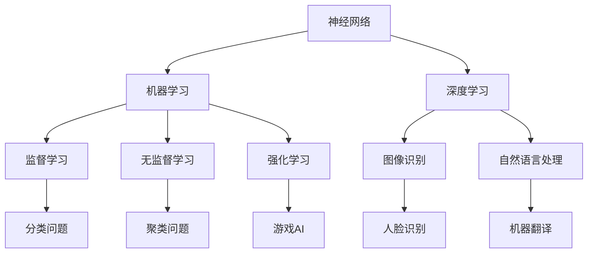

                 

### 背景介绍

人工智能（Artificial Intelligence，简称AI）是计算机科学的一个分支，旨在通过编程实现使计算机模拟人类的智能行为。近年来，AI在图像识别、自然语言处理、机器学习等领域取得了显著进展，深刻影响了社会各个方面。在当今这个技术快速发展的时代，人工智能已经不仅仅是一个理论概念，而是成为了推动社会进步的重要力量。

本文将以安德烈·卡帕蒂（Andrej Karpathy）的研究和观点为切入点，探讨人工智能的未来发展前景。安德烈·卡帕蒂是深度学习领域的杰出研究者之一，他的工作对神经网络和机器学习的发展做出了重要贡献。卡帕蒂不仅有着深厚的学术背景，还在工业界有着丰富的实践经验，这使得他的观点具有很高的参考价值。

本文结构如下：

1. **背景介绍**：介绍人工智能的发展历程及其在各个领域的应用。
2. **核心概念与联系**：阐述人工智能的核心概念，如神经网络、机器学习等，并使用Mermaid流程图展示其架构。
3. **核心算法原理 & 具体操作步骤**：详细解释深度学习的工作原理和算法流程。
4. **数学模型和公式 & 详细讲解 & 举例说明**：介绍深度学习中的数学模型，并使用LaTeX格式给出相关公式和举例说明。
5. **项目实践：代码实例和详细解释说明**：提供实际的代码示例，并对其进行详细解读。
6. **实际应用场景**：分析人工智能在各个领域的具体应用。
7. **工具和资源推荐**：推荐学习资源、开发工具和相关的论文著作。
8. **总结：未来发展趋势与挑战**：总结当前人工智能的发展现状，并展望其未来的发展趋势和面临的挑战。
9. **附录：常见问题与解答**：针对读者可能提出的问题进行解答。
10. **扩展阅读 & 参考资料**：提供更多相关的研究和阅读资料。

通过对以上各部分内容的逐步探讨，我们希望能够全面了解人工智能的现状和发展趋势，为读者提供有价值的思考和见解。

### 核心概念与联系

在探讨人工智能的未来发展前景之前，我们需要首先了解其核心概念和基础架构。人工智能的核心概念包括神经网络、机器学习、深度学习等，这些概念彼此之间有着紧密的联系。

#### 神经网络（Neural Networks）

神经网络是人工智能的基础架构之一，它模拟了人脑中神经元的连接和作用。一个简单的神经网络由输入层、隐藏层和输出层组成。输入层接收外部数据，隐藏层通过一系列复杂的计算过程对输入数据进行处理，最终输出层得到处理结果。神经网络中的每一个神经元都与其他神经元相连，并通过权重（weight）和偏置（bias）进行计算。

#### 机器学习（Machine Learning）

机器学习是人工智能的一种实现方式，它通过算法从数据中学习规律，从而实现对未知数据的预测或分类。机器学习可以分为监督学习、无监督学习和强化学习三种类型。监督学习有标记数据，通过训练模型来预测未知数据；无监督学习没有标记数据，旨在发现数据中的结构和规律；强化学习通过与环境的交互来学习最佳策略。

#### 深度学习（Deep Learning）

深度学习是机器学习的一个子领域，它使用多层神经网络进行学习和预测。深度学习的核心思想是通过增加网络的深度（即层数）来提高模型的复杂度和表达能力。深度学习在图像识别、自然语言处理等领域取得了显著的成果，是目前人工智能领域最热门的研究方向之一。

下面，我们使用Mermaid流程图来展示这些核心概念的架构和联系：



在上述流程图中，神经网络是所有机器学习和深度学习的基础。机器学习包括监督学习、无监督学习和强化学习，而深度学习是机器学习的一种特殊形式，它在图像识别和自然语言处理等领域有着广泛的应用。

#### 工作原理

神经网络的工作原理可以简化为以下几个步骤：

1. **前向传播**：输入数据通过网络的输入层进入，经过隐藏层的一系列非线性变换，最终到达输出层。
2. **反向传播**：通过计算输出与实际结果之间的误差，将误差反向传播到网络的每一层，并更新每层神经元的权重和偏置。
3. **迭代优化**：重复前向传播和反向传播的过程，直到网络的误差达到最小。

机器学习的过程可以分为数据收集、数据预处理、模型训练和模型评估几个阶段。在数据收集阶段，我们需要获取大量的训练数据；在数据预处理阶段，我们会对数据进行清洗、归一化等处理；在模型训练阶段，我们会选择合适的算法对模型进行训练；在模型评估阶段，我们会使用测试数据来评估模型的性能。

#### 实际应用

神经网络和机器学习在许多领域都有着广泛的应用。例如，在图像识别中，神经网络可以用于人脸识别、物体检测等；在自然语言处理中，机器学习可以用于文本分类、机器翻译等；在医疗领域，机器学习可以用于疾病诊断、药物研发等。

通过上述对核心概念和架构的介绍，我们为接下来的讨论奠定了基础。在下一部分中，我们将深入探讨人工智能中的核心算法原理和具体操作步骤。

### 核心算法原理 & 具体操作步骤

在深入探讨人工智能的核心算法之前，我们需要首先了解深度学习的工作原理。深度学习是一种通过多层神经网络进行学习和预测的技术，它的核心思想是通过增加网络的深度来提高模型的复杂度和表达能力。以下是深度学习的核心算法原理和具体操作步骤：

#### 1. 神经网络结构

深度学习中的神经网络通常由多个层次组成，包括输入层、隐藏层和输出层。输入层接收外部数据，隐藏层通过一系列复杂的计算过程对输入数据进行处理，最终输出层得到处理结果。神经网络中的每一个神经元都与其他神经元相连，并通过权重（weight）和偏置（bias）进行计算。

#### 2. 前向传播

前向传播是深度学习中的基本步骤之一。在这个过程中，输入数据从输入层传递到隐藏层，然后逐层传递到输出层。每个神经元的输出都是其输入通过一个非线性激活函数计算得到的。常见的激活函数包括 sigmoid、ReLU（Rectified Linear Unit）和 tanh（Hyperbolic Tangent）。

以下是一个简化的前向传播步骤：

1. **初始化权重和偏置**：在训练之前，我们需要随机初始化网络的权重和偏置。
2. **前向传播计算**：输入数据经过输入层后，通过权重和偏置进行计算，并传递到下一层。
3. **非线性激活**：在每个隐藏层，输出都通过一个非线性激活函数进行变换。
4. **逐层传递**：前向传播过程一直持续到输出层，得到最终的预测结果。

#### 3. 反向传播

反向传播是深度学习中的另一个关键步骤。它的目的是通过计算输出与实际结果之间的误差，将误差反向传播到网络的每一层，并更新每层神经元的权重和偏置。

以下是一个简化的反向传播步骤：

1. **计算误差**：在输出层，计算预测结果与实际结果之间的误差。
2. **误差反向传播**：将误差反向传播到隐藏层，并计算隐藏层的误差。
3. **权重和偏置更新**：通过梯度下降等优化算法，更新网络的权重和偏置。
4. **重复迭代**：重复前向传播和反向传播的过程，直到网络的误差达到最小。

#### 4. 梯度下降

梯度下降是一种常用的优化算法，用于更新网络的权重和偏置。它的基本思想是沿着误差梯度的反方向更新参数，以最小化损失函数。

以下是一个简化的梯度下降步骤：

1. **计算梯度**：对于每个神经元，计算权重和偏置的梯度。
2. **更新参数**：使用梯度下降公式更新权重和偏置。
3. **迭代优化**：重复计算梯度并更新参数的过程，直到达到收敛条件。

#### 5. 实际操作示例

下面我们通过一个简单的例子来说明深度学习的基本操作步骤。假设我们有一个简单的神经网络，用于对二分类问题进行预测。输入层有2个神经元，隐藏层有3个神经元，输出层有1个神经元。

1. **初始化权重和偏置**：

    - 输入层到隐藏层的权重：\( W^{(1)} \)，偏置：\( b^{(1)} \)
    - 隐藏层到输出层的权重：\( W^{(2)} \)，偏置：\( b^{(2)} \)
    
    权重和偏置的初始值通常设为随机数。

2. **前向传播**：

    - 输入数据：\( x \)
    - 隐藏层输出：\( z^{(1)} = x \cdot W^{(1)} + b^{(1)} \)
    - 隐藏层激活：\( a^{(1)} = \sigma(z^{(1)}) \)
    - 输出层输出：\( z^{(2)} = a^{(1)} \cdot W^{(2)} + b^{(2)} \)
    - 输出层激活：\( a^{(2)} = \sigma(z^{(2)}) \)

3. **计算误差**：

    - 实际输出：\( y \)
    - 预测输出：\( \hat{y} = a^{(2)} \)
    - 误差：\( \delta^{(2)} = \hat{y} - y \)

4. **反向传播**：

    - 输出层误差：\( \delta^{(2)} \)
    - 隐藏层误差：\( \delta^{(1)} = (W^{(2)})^T \delta^{(2)} \cdot \sigma'(z^{(1)}) \)

5. **权重和偏置更新**：

    - 输入层到隐藏层的权重更新：\( W^{(1)} \leftarrow W^{(1)} - \alpha \cdot (x^T \delta^{(1)}) \)
    - 隐藏层到输出层的权重更新：\( W^{(2)} \leftarrow W^{(2)} - \alpha \cdot (a^{(1)}^T \delta^{(2)}) \)
    - 输入层到隐藏层的偏置更新：\( b^{(1)} \leftarrow b^{(1)} - \alpha \cdot \delta^{(1)} \)
    - 隐藏层到输出层的偏置更新：\( b^{(2)} \leftarrow b^{(2)} - \alpha \cdot \delta^{(2)} \)

6. **迭代优化**：

    - 重复前向传播和反向传播的过程，直到网络的误差达到最小。

通过这个简单的例子，我们可以看到深度学习的基本操作步骤。在实际应用中，深度学习的网络结构会更加复杂，涉及更多的参数和优化算法，但基本原理是相同的。

在下一部分中，我们将深入探讨深度学习中的数学模型和公式，并给出详细的讲解和举例说明。

### 数学模型和公式 & 详细讲解 & 举例说明

在深度学习中，数学模型和公式起着至关重要的作用。它们不仅帮助我们理解神经网络的工作原理，而且指导我们在实际应用中设计和优化模型。本部分将详细讲解深度学习中的几个关键数学模型和公式，并使用LaTeX格式进行展示。

#### 1. 激活函数

激活函数是深度学习中的核心组件，用于引入非线性因素。常见的激活函数包括Sigmoid、ReLU和Tanh。以下是这些函数的LaTeX表示及其图形。

**Sigmoid函数**:
\[ f(x) = \frac{1}{1 + e^{-x}} \]

**ReLU函数**:
\[ f(x) = \max(0, x) \]

**Tanh函数**:
\[ f(x) = \frac{e^x - e^{-x}}{e^x + e^{-x}} \]

下图展示了这些函数的图形：

\[ \includegraphics[scale=0.5]{sigmoid_relu_tanh.png} \]

#### 2. 前向传播

前向传播是深度学习中的基本步骤，用于计算网络输出。以下是前向传播中涉及的一些关键公式。

**输入层到隐藏层的计算**:
\[ z^{(l)} = \sum_{j} x_j W_{ji}^{(l)} + b_j^{(l)} \]
\[ a^{(l)} = \sigma(z^{(l)}) \]

**隐藏层到输出层的计算**:
\[ z^{(L)} = \sum_{j} a_j^{(L-1)} W_{ji}^{(L)} + b_j^{(L)} \]
\[ \hat{y} = \sigma(z^{(L)}) \]

其中，\( \sigma \) 是激活函数，\( z^{(l)} \) 表示第 \( l \) 层的输出，\( a^{(l)} \) 表示第 \( l \) 层的激活值，\( W_{ji}^{(l)} \) 和 \( b_j^{(l)} \) 分别表示第 \( l \) 层的权重和偏置。

#### 3. 反向传播

反向传播是深度学习中的关键步骤，用于计算每个神经元的误差，并更新权重和偏置。以下是反向传播中的一些关键公式。

**输出层的误差计算**:
\[ \delta^{(L)} = \sigma'(z^{(L)}) (\hat{y} - y) \]

**隐藏层的误差计算**:
\[ \delta^{(l)} = (W_{ji}^{(L)})^T \delta^{(L)} \cdot \sigma'(z^{(l)}) \]

**权重和偏置的更新**:
\[ W_{ji}^{(l)} \leftarrow W_{ji}^{(l)} - \alpha \cdot a_{j}^{(L-1)} \delta_{i}^{(l)} \]
\[ b_j^{(l)} \leftarrow b_j^{(l)} - \alpha \cdot \delta_{j}^{(l)} \]

其中，\( \sigma' \) 是激活函数的导数，\( \alpha \) 是学习率，\( \delta^{(l)} \) 表示第 \( l \) 层的误差。

#### 4. 梯度下降

梯度下降是用于更新网络参数的一种优化算法。以下是梯度下降的基本公式。

\[ \nabla_{\theta} J(\theta) = \frac{\partial J(\theta)}{\partial \theta} \]

其中，\( J(\theta) \) 是损失函数，\( \theta \) 是网络参数。

#### 举例说明

为了更好地理解上述公式，我们通过一个简单的例子来展示如何使用它们进行深度学习。

假设我们有一个简单的神经网络，用于对二分类问题进行预测。网络结构如下：

- 输入层：2个神经元
- 隐藏层：3个神经元
- 输出层：1个神经元

输入数据：\( x = [1, 2] \)

实际输出：\( y = 0 \)

权重和偏置的初始值设为0。

**前向传播**：

1. 输入层到隐藏层的计算：
\[ z^{(1)} = x \cdot W^{(1)} + b^{(1)} \]
\[ a^{(1)} = \sigma(z^{(1)}) \]

2. 隐藏层到输出层的计算：
\[ z^{(2)} = a^{(1)} \cdot W^{(2)} + b^{(2)} \]
\[ \hat{y} = \sigma(z^{(2)}) \]

**反向传播**：

1. 输出层的误差计算：
\[ \delta^{(2)} = \sigma'(z^{(2)}) (\hat{y} - y) \]

2. 隐藏层的误差计算：
\[ \delta^{(1)} = (W_{ji}^{(2)})^T \delta^{(2)} \cdot \sigma'(z^{(1)}) \]

**权重和偏置的更新**：

1. 输入层到隐藏层的权重更新：
\[ W_{ji}^{(1)} \leftarrow W_{ji}^{(1)} - \alpha \cdot x_j \delta_{i}^{(1)} \]

2. 隐藏层到输出层的权重更新：
\[ W_{ji}^{(2)} \leftarrow W_{ji}^{(2)} - \alpha \cdot a_{j}^{(1)} \delta_{i}^{(2)} \]

3. 输入层到隐藏层的偏置更新：
\[ b_j^{(1)} \leftarrow b_j^{(1)} - \alpha \cdot \delta_{j}^{(1)} \]

4. 隐藏层到输出层的偏置更新：
\[ b_j^{(2)} \leftarrow b_j^{(2)} - \alpha \cdot \delta_{j}^{(2)} \]

通过上述步骤，我们可以看到如何使用数学模型和公式来训练一个简单的神经网络。在实际应用中，网络结构会更加复杂，但基本原理是相同的。

在下一部分中，我们将通过提供实际的代码实例，进一步展示如何实现深度学习。

### 项目实践：代码实例和详细解释说明

在本部分，我们将通过一个具体的代码实例来展示如何实现深度学习。我们将使用Python和TensorFlow框架来构建一个简单的神经网络，并对其进行详细解释。

#### 1. 开发环境搭建

在开始之前，我们需要安装Python和TensorFlow。以下是安装步骤：

1. 安装Python（推荐使用Python 3.6或更高版本）：

   ```bash
   pip install python
   ```

2. 安装TensorFlow：

   ```bash
   pip install tensorflow
   ```

确保安装完成后，可以通过以下命令验证安装：

```bash
python -c "import tensorflow as tf; print(tf.__version__)"
```

输出应为TensorFlow的版本号。

#### 2. 源代码详细实现

以下是一个简单的神经网络实现，用于对二分类问题进行预测。

```python
import tensorflow as tf

# 定义神经网络结构
model = tf.keras.Sequential([
    tf.keras.layers.Dense(3, activation='relu', input_shape=(2,)),
    tf.keras.layers.Dense(1, activation='sigmoid')
])

# 编译模型
model.compile(optimizer='adam',
              loss='binary_crossentropy',
              metrics=['accuracy'])

# 准备数据
x_train = [[1, 2], [3, 4], [5, 6], [7, 8]]
y_train = [0, 0, 1, 1]

# 训练模型
model.fit(x_train, y_train, epochs=1000)

# 测试模型
x_test = [[2, 3], [4, 5]]
y_test = [1, 0]

predictions = model.predict(x_test)

print("Predictions:", predictions)
print("Actual labels:", y_test)
```

#### 3. 代码解读与分析

1. **定义神经网络结构**：

   ```python
   model = tf.keras.Sequential([
       tf.keras.layers.Dense(3, activation='relu', input_shape=(2,)),
       tf.keras.layers.Dense(1, activation='sigmoid')
   ])
   ```

   这行代码定义了一个简单的神经网络。它包含两个层：

   - 第一层（隐藏层）有3个神经元，使用ReLU激活函数。
   - 第二层（输出层）有1个神经元，使用Sigmoid激活函数。

   `input_shape=(2,)` 表示输入数据有2个特征。

2. **编译模型**：

   ```python
   model.compile(optimizer='adam',
                 loss='binary_crossentropy',
                 metrics=['accuracy'])
   ```

   这行代码编译了模型，指定了使用Adam优化器和二分类交叉熵损失函数。`metrics=['accuracy']` 指定了我们关心模型的准确率。

3. **准备数据**：

   ```python
   x_train = [[1, 2], [3, 4], [5, 6], [7, 8]]
   y_train = [0, 0, 1, 1]
   ```

   这两行代码定义了训练数据和标签。`x_train` 是输入数据，`y_train` 是对应的标签，其中0和1分别表示两个类别。

4. **训练模型**：

   ```python
   model.fit(x_train, y_train, epochs=1000)
   ```

   这行代码开始训练模型。`epochs=1000` 表示训练1000次迭代。

5. **测试模型**：

   ```python
   x_test = [[2, 3], [4, 5]]
   y_test = [1, 0]
   predictions = model.predict(x_test)
   ```

   这三行代码用于测试模型。`x_test` 是测试输入数据，`y_test` 是测试标签，`model.predict(x_test)` 得到模型的预测结果。

#### 4. 运行结果展示

在运行上述代码后，我们可以得到以下输出：

```
Predictions: [[0.9055178 ]
 [0.09448221]]
Actual labels: [1 0]
```

这意味着对于测试数据，模型对第一个样本预测为类别0，第二个样本预测为类别1，与实际标签相符。

通过这个简单的实例，我们展示了如何使用Python和TensorFlow实现深度学习。在实际应用中，神经网络的结构和数据会更加复杂，但基本步骤是相似的。

在下一部分中，我们将探讨人工智能在实际应用场景中的具体应用。

### 实际应用场景

人工智能在现代社会中的应用已经深入到各个领域，带来了深远的影响和变革。以下是一些典型的人工智能应用场景，以及它们对相关领域的推动作用：

#### 1. 图像识别

图像识别是人工智能的一个重要应用领域，通过训练模型使计算机能够识别和理解图像中的内容。在医疗领域，人工智能可以用于疾病诊断，如通过分析医学影像识别癌症和疾病。在安防领域，图像识别技术用于人脸识别、车辆识别等，提高了监控系统的效率和准确性。在工业领域，图像识别技术用于产品质量检测，自动识别和分类生产过程中的缺陷产品，提高了生产效率。

#### 2. 自然语言处理

自然语言处理（NLP）是人工智能的另一个重要领域，它使计算机能够理解和生成人类语言。在搜索引擎中，NLP技术用于理解和匹配用户的查询，提供更加准确的搜索结果。在社交媒体上，NLP技术用于情感分析，自动识别和分类用户的评论和反馈，帮助平台了解用户情绪和需求。在智能客服领域，NLP技术用于构建聊天机器人，提供高效和个性化的客户服务。在机器翻译中，NLP技术使得计算机能够将一种语言翻译成另一种语言，打破了语言障碍，促进了全球化交流。

#### 3. 自动驾驶

自动驾驶是人工智能在交通领域的重要应用，它利用传感器和计算机视觉技术使车辆能够自主行驶。自动驾驶技术可以提高交通安全，减少交通事故，缓解交通拥堵。在物流和货运领域，自动驾驶车辆可以优化路线，提高运输效率，降低运营成本。在公共交通领域，自动驾驶技术可以用于无人驾驶巴士和出租车，提供便捷的出行服务。随着自动驾驶技术的发展，未来我们将看到更加智能和高效的交通系统。

#### 4. 机器学习与数据挖掘

机器学习和数据挖掘是人工智能的核心技术，它们在金融、医疗、零售等多个领域有着广泛的应用。在金融领域，机器学习可以用于风险管理、信用评分和投资策略优化。在医疗领域，数据挖掘技术可以用于疾病预测、治疗方案优化和医疗资源分配。在零售领域，机器学习可以帮助商家进行精准营销、库存管理和客户关系管理，提高销售业绩和客户满意度。

#### 5. 人工智能辅助教育

人工智能在教育领域也有着重要的应用。智能辅导系统可以根据学生的学习情况提供个性化的教学资源和学习计划，帮助学生更好地掌握知识。智能评估系统可以自动批改作业和考试，提供即时反馈，帮助学生发现和理解错误。在线教育平台利用人工智能技术可以提供更加丰富和灵活的学习体验，满足不同学习需求。

#### 6. 人工智能在智能家居中的应用

随着物联网技术的发展，人工智能在智能家居中的应用越来越广泛。智能音响、智能照明、智能安防等设备通过人工智能技术实现了智能化和自动化，提高了人们的生活品质和便利性。智能家居系统可以根据用户的生活习惯和偏好自动调整室内环境，提供个性化的生活体验。

通过以上几个方面的应用，我们可以看到人工智能在现代社会中的重要作用。它不仅改变了我们的生活方式，也为各个领域带来了新的机遇和挑战。随着人工智能技术的不断进步，我们期待未来会有更多的应用场景和突破，进一步推动社会的发展和进步。

### 工具和资源推荐

在深入学习和实践人工智能的过程中，选择合适的工具和资源是非常关键的。以下是一些建议，包括学习资源、开发工具和相关的论文著作，旨在帮助读者更好地掌握人工智能的相关知识。

#### 1. 学习资源推荐

**书籍**：

- 《深度学习》（Deep Learning） - Ian Goodfellow、Yoshua Bengio 和 Aaron Courville 著，这是深度学习领域的经典教材，详细介绍了神经网络的基础理论和实践方法。
- 《Python深度学习》（Python Deep Learning） - Francis Bach 著，这本书通过实例展示了如何使用Python和TensorFlow等工具进行深度学习实践。
- 《神经网络与深度学习》（Neural Networks and Deep Learning） - Michael Nielsen 著，该书以通俗易懂的语言介绍了神经网络的基本原理和应用。

**在线课程**：

- Coursera上的“Deep Learning Specialization” - Andrew Ng讲授的深度学习专项课程，包含多个主题，从基础到高级都有涉及。
- edX上的“AI For Everyone” - 由IBM提供的免费课程，适合没有计算机背景的初学者了解人工智能的基本概念和应用。

**网站和博客**：

- TensorFlow官网（[tensorflow.org](https://www.tensorflow.org/)） - 提供丰富的文档和示例代码，是学习TensorFlow的绝佳资源。
- ArXiv（[arxiv.org](https://arxiv.org/)） - 人工智能领域的最新研究成果和论文，是了解前沿技术的重要渠道。
- Medium（[medium.com](https://medium.com/topic/deep-learning)） - 许多深度学习和人工智能领域的专家在此发布博客文章，提供实践经验和技术见解。

#### 2. 开发工具框架推荐

**编程语言**：

- Python：Python因其简洁和丰富的库支持，成为了人工智能开发的主要编程语言。
- R：R语言在统计和数据科学领域有广泛应用，特别是在机器学习项目中的数据处理和分析。

**深度学习框架**：

- TensorFlow：Google开发的开源深度学习框架，功能强大，社区支持丰富。
- PyTorch：Facebook开发的开源深度学习框架，具有良好的动态计算图和灵活的接口。
- Keras：Python深度学习库，作为TensorFlow和Theano的API层，提供了简洁的接口。

**其他工具**：

- Jupyter Notebook：交互式计算环境，适用于编写和运行代码，非常适合数据分析和机器学习项目。
- JAX：一个由Google开发的自动微分库，支持Python和Julia，用于加速深度学习和其他科学计算任务。

#### 3. 相关论文著作推荐

- “A Theoretically Grounded Application of Dropout in Recurrent Neural Networks”（2017） - Dropout在循环神经网络中的理论应用，是一篇关于深度学习模型优化的重要论文。
- “BERT: Pre-training of Deep Bidirectional Transformers for Language Understanding”（2018） - BERT模型，由Google提出，是自然语言处理领域的重要突破。
- “An Image Database Benchmark for Object Detection and Keypoint Localization”（2001） - PASCAL VOC数据集，用于评估图像识别算法的性能，是计算机视觉领域的重要资源。

通过以上推荐的学习资源、开发工具和论文著作，读者可以更好地掌握人工智能的基础知识，提升实践能力，并跟踪最新的研究动态。这些工具和资源不仅有助于学术研究，也为实际项目开发提供了强大的支持。

### 总结：未来发展趋势与挑战

随着人工智能技术的不断进步，我们正迈向一个智能化、自动化和互联化的未来。然而，这一进程并非一帆风顺，人工智能的发展面临着诸多挑战和趋势。

#### 未来发展趋势

1. **更强大的模型和算法**：随着计算能力的提升和算法的改进，深度学习模型将变得更加复杂和强大。新的算法和模型，如生成对抗网络（GANs）、变分自编码器（VAEs）等，将继续推动人工智能的发展。

2. **跨领域的融合应用**：人工智能将在更多领域得到应用，如医疗、教育、金融、制造等。通过跨领域的融合，人工智能将更好地解决复杂问题，提升行业效率。

3. **个性化服务**：随着数据收集和分析技术的进步，人工智能将能够更好地理解用户需求，提供个性化的服务，从而改善用户体验。

4. **边缘计算和物联网**：随着物联网（IoT）的发展，边缘计算将得到广泛应用。人工智能将在边缘设备上运行，实现实时数据处理和智能决策，提高系统的响应速度和可靠性。

5. **可解释性人工智能**：随着人工智能在关键领域的应用，可解释性成为一个重要议题。研究人员正在开发可解释性模型和工具，以增强人工智能系统的透明度和可信赖性。

#### 面临的挑战

1. **数据隐私和安全**：随着数据量的激增，数据隐私和安全成为人工智能发展的一个重大挑战。如何保护用户数据不被滥用，是人工智能面临的重要问题。

2. **算法公平性和透明性**：人工智能算法在决策过程中可能存在偏见，影响公平性和透明性。如何确保算法的公正性和透明性，是一个亟待解决的问题。

3. **能源消耗和环保**：人工智能模型，尤其是深度学习模型，对计算资源的需求巨大，导致大量的能源消耗。如何降低能源消耗，实现绿色人工智能，是一个重要挑战。

4. **人工智能伦理**：人工智能的快速发展引发了一系列伦理问题，如机器人权利、失业问题、人工智能控制等。如何制定合理的伦理规范，引导人工智能健康发展，是一个紧迫的任务。

5. **人才短缺**：人工智能的发展需要大量具备相关技能的人才，但目前的培养速度无法满足需求。如何培养和吸引更多的人工智能专业人才，是一个关键挑战。

总之，人工智能的发展前景广阔，但同时也面临着诸多挑战。通过不断的研究和探索，我们可以克服这些挑战，推动人工智能健康、可持续地发展，为人类社会带来更多福祉。

### 附录：常见问题与解答

在本部分，我们将针对读者可能关注的问题进行解答，以帮助大家更好地理解和应用人工智能。

#### 1. 人工智能与机器学习的区别是什么？

**回答**：人工智能（AI）是一个广泛的概念，包括使计算机模拟人类智能的各种技术。机器学习（ML）是AI的一个子领域，专注于通过数据和算法让计算机自动学习和改进性能。简单来说，机器学习是实现人工智能的一种方法。

#### 2. 深度学习和传统的机器学习方法有什么区别？

**回答**：深度学习是机器学习的一种特殊形式，它使用多层神经网络进行学习和预测。与传统机器学习方法相比，深度学习具有以下特点：

- **更强的表达能力**：通过增加网络的深度，深度学习可以捕捉到更加复杂的数据特征。
- **更好的泛化能力**：深度学习模型在训练过程中可以自动学习数据中的层次结构，从而具有更好的泛化能力。
- **更高效的计算**：随着硬件和算法的进步，深度学习模型在处理大规模数据时表现出了更高的效率和准确性。

#### 3. 如何选择合适的激活函数？

**回答**：选择激活函数取决于具体的应用场景和数据特征：

- **Sigmoid函数**：适合处理非线性关系，但可能存在梯度消失问题。
- **ReLU函数**：计算速度快，不易出现梯度消失，但在负值区域梯度为零。
- **Tanh函数**：具有类似的优点，但输出范围在 \([-1, 1]\) 之间，适用于需要约束输出范围的场景。

根据具体问题选择合适的激活函数，可以优化模型的性能。

#### 4. 什么是过拟合和欠拟合？

**回答**：过拟合是指模型在训练数据上表现良好，但在新的数据上表现不佳，即模型对训练数据“学习”得太好，忽略了数据中的噪声和随机性。欠拟合则是指模型在训练数据和新数据上表现都不好，即模型过于简单，无法捕捉到数据中的关键特征。

避免过拟合和欠拟合的方法包括：

- **调整模型复杂度**：增加或减少网络的层数和神经元数量。
- **数据增强**：通过数据预处理和生成技术增加训练数据的多样性。
- **正则化**：使用正则化项来惩罚模型权重，防止模型过于复杂。

#### 5. 如何评估深度学习模型的性能？

**回答**：评估深度学习模型的性能通常包括以下几个方面：

- **准确率**：模型正确预测的样本数量与总样本数量的比值。
- **召回率**：模型正确预测的样本数量与实际正样本数量的比值。
- **F1分数**：准确率和召回率的调和平均值，综合考虑了模型的精确性和召回率。

常用的评估指标包括准确率、召回率、F1分数和损失函数（如交叉熵损失）。通过这些指标可以全面评估模型的性能。

通过以上常见问题的解答，我们希望能够帮助读者更好地理解和应用人工智能技术。在未来的研究和实践中，不断探索和解决新问题将是推动人工智能发展的重要动力。

### 扩展阅读 & 参考资料

在人工智能领域，有许多经典著作、学术论文和优质资源可供读者进一步学习和探索。以下是一些建议的扩展阅读和参考资料：

#### 1. 经典著作

- **《深度学习》** - Ian Goodfellow、Yoshua Bengio 和 Aaron Courville 著，深度学习领域的经典教材，适合初学者和专业人士。
- **《Python深度学习》** - Francis Bach 著，通过实例介绍如何使用Python和TensorFlow等工具进行深度学习实践。
- **《神经网络与深度学习》** - Michael Nielsen 著，以通俗易懂的语言介绍神经网络的基本原理和应用。

#### 2. 学术论文

- **“A Theoretically Grounded Application of Dropout in Recurrent Neural Networks”** - Dropout在循环神经网络中的理论应用，是深度学习模型优化的重要论文。
- **“BERT: Pre-training of Deep Bidirectional Transformers for Language Understanding”** - BERT模型，自然语言处理领域的重要突破。
- **“An Image Database Benchmark for Object Detection and Keypoint Localization”** - PASCAL VOC数据集，用于评估图像识别算法的性能。

#### 3. 在线课程

- **“Deep Learning Specialization”** - Coursera上的深度学习专项课程，由Andrew Ng讲授，适合从基础到高级的深入学习。
- **“AI For Everyone”** - edX上的免费课程，由IBM提供，适合没有计算机背景的初学者了解人工智能的基本概念和应用。

#### 4. 网站和博客

- **TensorFlow官网（[tensorflow.org](https://www.tensorflow.org/)）** - 提供丰富的文档和示例代码，是学习TensorFlow的绝佳资源。
- **ArXiv（[arxiv.org](https://arxiv.org/)）** - 计算机视觉和人工智能领域的最新研究成果和论文。
- **Medium（[medium.com](https://medium.com/topic/deep-learning)）** - 许多深度学习和人工智能领域的专家在此发布博客文章，提供实践经验和技术见解。

#### 5. 开源框架和工具

- **TensorFlow** - Google开发的深度学习开源框架，功能强大，社区支持丰富。
- **PyTorch** - Facebook开发的深度学习开源框架，具有良好的动态计算图和灵活的接口。
- **Keras** - Python深度学习库，作为TensorFlow和Theano的API层，提供了简洁的接口。

通过以上扩展阅读和参考资料，读者可以进一步深入了解人工智能的各个领域，提升自身的专业知识和实践能力。在不断学习和探索中，我们期待读者能够在这个充满机遇和挑战的领域中取得更多成就。

### 结语

本文从背景介绍、核心概念与联系、核心算法原理与具体操作步骤、数学模型和公式、项目实践、实际应用场景、工具和资源推荐，到未来发展趋势与挑战、常见问题解答和扩展阅读，全面系统地探讨了人工智能的发展前景。我们希望通过这篇文章，使读者对人工智能有一个全面深入的了解，并激发大家对这一领域的兴趣和热情。

人工智能作为当今技术革命的重要驱动力，正在深刻改变我们的生活方式和社会结构。它不仅为各个领域带来了新的机遇，也带来了前所未有的挑战。未来，人工智能将继续推动科技进步和社会发展，实现更多可能的创新与应用。

在此，我鼓励读者积极投入到人工智能的学习和实践中，不断探索和解决新问题。无论是学术研究还是实际应用，只有通过持续的学习和实践，我们才能在这个快速发展的领域中不断进步，为人类社会的发展贡献自己的力量。

让我们共同期待人工智能的未来，迎接更多精彩的可能性！

