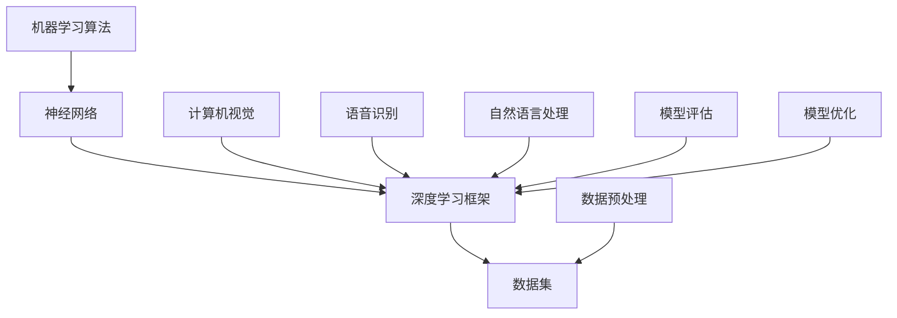
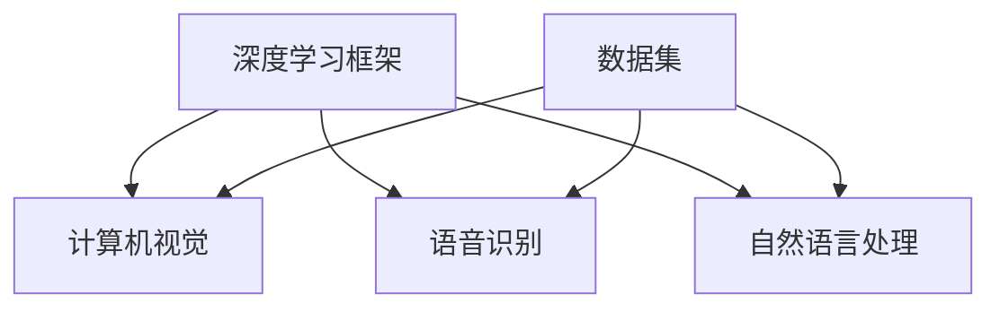

                 

关键词：人工智能、深度学习、未来趋势、技术发展、应用场景

> 摘要：本文将探讨人工智能（AI）的未来发展趋势，包括深度学习的应用、技术挑战、未来前景以及面临的潜在风险。本文旨在为读者提供对AI技术发展的深入理解和前瞻性思考。

## 1. 背景介绍

人工智能（AI）作为计算机科学的一个分支，旨在开发能够模拟、扩展和辅助人类智能的计算机系统。自20世纪50年代以来，人工智能经历了多个发展阶段，从早期的符号主义和知识表示，到基于规则的系统，再到近年来迅速崛起的深度学习。

深度学习是人工智能的一个重要分支，它通过模拟人脑神经网络的结构和功能，实现对复杂数据的处理和模式识别。近年来，深度学习在图像识别、语音识别、自然语言处理等领域取得了显著的成果，推动了AI技术的快速发展。

本文将重点关注深度学习在人工智能中的应用，探讨其未来发展前景、面临的挑战以及可能产生的影响。在接下来的章节中，我们将深入分析深度学习的核心概念、算法原理、数学模型，并通过实际项目案例来展示其应用效果。

## 2. 核心概念与联系

在讨论人工智能和深度学习的发展时，我们首先需要了解一些核心概念，包括神经网络、深度学习框架、数据集等。以下是一个简化的Mermaid流程图，用于描述这些概念之间的联系。



### 神经网络

神经网络是深度学习的基础，它由大量的神经元（或节点）组成，通过调整神经元之间的连接权重来学习数据中的特征。神经网络可以分为多层，包括输入层、隐藏层和输出层。每一层负责处理不同的数据特征，并通过反向传播算法不断调整权重，以优化模型的性能。

### 深度学习框架

深度学习框架是一套工具和库，用于简化深度学习模型的开发和部署。常见的深度学习框架包括TensorFlow、PyTorch、Keras等。这些框架提供了丰富的预构建函数和API，使得开发者可以更加专注于模型的设计和优化，而无需关注底层实现细节。

### 数据集

数据集是深度学习模型训练的基础。一个高质量的数据集应该包含丰富的样本，并且能够覆盖所需学习的特征。计算机视觉、语音识别、自然语言处理等领域都需要大量标注好的数据集来训练模型。

### 应用领域

深度学习在多个领域取得了显著的成果，包括计算机视觉、语音识别、自然语言处理等。以下是一个简化的流程图，展示了这些应用领域与深度学习框架和数据集之间的联系。



通过这个流程图，我们可以看到深度学习框架和数据集如何支持不同应用领域的发展。在接下来的章节中，我们将进一步探讨这些核心概念，并分析它们在人工智能中的具体应用。

### 2.1 神经网络的结构与工作原理

神经网络（Neural Network，简称NN）是深度学习中最基础的概念之一。它由大量相互连接的神经元（或节点）组成，这些神经元通过调整连接权重（或权重矩阵）来学习数据中的特征和模式。

#### 神经元结构

每个神经元由三个主要部分组成：输入层、权重层和输出层。输入层接收外部信息，权重层通过调整权重来放大或抑制这些信息，输出层产生最终决策或输出。


#### 前向传播

前向传播是神经网络处理数据的过程。它从输入层开始，逐层传递信息。每个神经元接收来自前一层的输入值，通过激活函数进行非线性变换，并传递给下一层。这个过程可以表示为以下公式：

$$
z_i = \sum_j w_{ij}x_j + b_i
$$

其中，$z_i$ 是第 $i$ 个神经元的输入，$w_{ij}$ 是从第 $j$ 个神经元到第 $i$ 个神经元的权重，$x_j$ 是第 $j$ 个神经元的输入，$b_i$ 是第 $i$ 个神经元的偏置。

#### 激活函数

激活函数是神经网络中的一个关键元素，它用于引入非线性变换，使得神经网络能够学习复杂数据特征。常见的激活函数包括：

1. **Sigmoid函数**：将输入值映射到 (0, 1) 范围内，用于二分类问题。

   $$ 
   f(x) = \frac{1}{1 + e^{-x}} 
   $$

2. **ReLU函数**：将输入值映射到 [0, +∞)，可以加速神经网络的训练。

   $$ 
   f(x) = \max(0, x) 
   $$

3. **Tanh函数**：将输入值映射到 (-1, 1) 范围内，常用于多分类问题。

   $$ 
   f(x) = \frac{e^x - e^{-x}}{e^x + e^{-x}} 
   $$

#### 反向传播

反向传播是神经网络训练的核心算法，它通过计算损失函数对权重的梯度，不断调整权重，以优化模型性能。反向传播包括以下几个步骤：

1. **计算输出误差**：根据输出值和实际标签，计算损失函数（如均方误差、交叉熵等）的梯度。

   $$ 
   \delta_{output} = \frac{\partial L}{\partial z} 
   $$

2. **反向传播误差**：从输出层开始，逐层计算误差梯度，直到输入层。

   $$ 
   \delta_i = \delta_{i+1} \cdot \frac{\partial a_{i+1}}{\partial z_i} 
   $$

3. **更新权重**：根据误差梯度调整权重和偏置。

   $$ 
   w_{ij} \leftarrow w_{ij} - \alpha \frac{\partial L}{\partial w_{ij}} 
   $$

   $$ 
   b_i \leftarrow b_i - \alpha \frac{\partial L}{\partial b_i} 
   $$

#### 多层神经网络

多层神经网络（Multi-layer Neural Network）由多个隐藏层组成，能够学习更复杂的数据特征。每个隐藏层负责提取不同层次的特征，通过层层递进，最终在输出层生成预测结果。


### 2.2 深度学习框架

深度学习框架是用于简化深度学习模型开发、训练和部署的工具和库。以下是一些流行的深度学习框架：

#### TensorFlow

TensorFlow 是由 Google 开发的一款开源深度学习框架，它提供了丰富的工具和API，支持多种类型的神经网络和深度学习算法。TensorFlow 的主要特点包括：

1. **动态计算图**：TensorFlow 使用动态计算图，允许开发者灵活地构建和修改模型结构。
2. **分布式训练**：TensorFlow 支持分布式训练，能够利用多台计算机和 GPU 加速模型训练。
3. **广泛的应用场景**：TensorFlow 在图像识别、语音识别、自然语言处理等领域有广泛的应用。

#### PyTorch

PyTorch 是由 Facebook AI 研究团队开发的一款开源深度学习框架，它以其简洁、灵活和易于理解的特点受到开发者的喜爱。PyTorch 的主要特点包括：

1. **静态和动态计算图**：PyTorch 同时支持静态和动态计算图，提供了更大的灵活性和更高效的计算。
2. **自动微分系统**：PyTorch 的自动微分系统使得开发者能够轻松实现复杂的深度学习算法。
3. **丰富的文档和社区支持**：PyTorch 拥有丰富的文档和社区支持，方便开发者学习和使用。

#### Keras

Keras 是一个基于 TensorFlow 和 Theano 的开源深度学习库，它提供了简洁、易于使用的接口，使得深度学习模型的开发变得更加简单。Keras 的主要特点包括：

1. **模块化设计**：Keras 使用模块化设计，使得开发者可以轻松地组合和定制模型结构。
2. **高度可扩展**：Keras 支持多种深度学习框架，包括 TensorFlow、Theano 和 Microsoft CNTK。
3. **快速原型开发**：Keras 提供了丰富的预构建函数和API，使得开发者可以快速构建和训练模型。

### 2.3 数据集

数据集是深度学习模型训练的基础，它包含大量的样本和相应的标签。以下是一些常用的数据集：

#### ImageNet

ImageNet 是一个包含数百万张图像的数据集，每张图像都被标注了多个类别。它被广泛应用于计算机视觉领域，是评估图像分类算法性能的重要基准。

#### CIFAR-10

CIFAR-10 是一个包含 60000 张 32x32 图像的数据集，分为 10 个类别，每个类别有 6000 张图像。它常用于图像分类任务的训练和测试。

#### Ilya Kuznetsov

Ilya Kuznetsov 是一个包含约 10 万张图像的数据集，分为 1000 个类别。它被用于训练和评估大型深度学习模型，如 Inception-v3 和 ResNet。

#### Common Crawl

Common Crawl 是一个包含数十亿个网页的文本数据集，用于自然语言处理任务的训练和测试。它提供了丰富的网页数据，有助于开发先进的文本分析模型。

通过以上核心概念、深度学习框架和数据集的介绍，我们可以更好地理解深度学习在人工智能中的应用。在接下来的章节中，我们将深入探讨深度学习的算法原理、数学模型和具体应用。

### 3. 核心算法原理 & 具体操作步骤

深度学习的核心算法包括神经网络架构、优化算法和数据增强方法。以下将详细解释这些算法的基本原理和具体操作步骤。

#### 3.1 神经网络架构

神经网络架构是深度学习模型的基础，它决定了模型的结构和性能。常见的神经网络架构包括全连接神经网络（Fully Connected Neural Network）、卷积神经网络（Convolutional Neural Network，简称 CNN）和循环神经网络（Recurrent Neural Network，简称 RNN）。

**全连接神经网络**

全连接神经网络是最简单的神经网络架构，每个神经元都与前一层的所有神经元相连。具体操作步骤如下：

1. **输入层**：接收外部输入数据，如图像或文本。
2. **隐藏层**：通过前向传播计算每个神经元的输入和输出，使用激活函数引入非线性。
3. **输出层**：生成最终预测结果，如分类标签或回归值。

**卷积神经网络**

卷积神经网络是专门用于图像处理任务的神经网络架构，其核心思想是使用卷积层提取图像的特征。具体操作步骤如下：

1. **卷积层**：通过卷积操作提取图像的特征，卷积核滑过图像并生成特征图。
2. **池化层**：通过池化操作降低特征图的空间分辨率，减少参数数量。
3. **全连接层**：将卷积层和池化层输出的特征图展开为一个一维向量，通过全连接层生成最终预测结果。

**循环神经网络**

循环神经网络是专门用于序列数据处理的神经网络架构，其核心思想是使用循环结构保持序列的历史信息。具体操作步骤如下：

1. **输入层**：接收外部输入数据，如文本序列或时间序列数据。
2. **隐藏层**：通过循环结构处理每个时间步的输入和隐藏状态，使用门控机制控制信息的流动。
3. **输出层**：生成最终预测结果，如序列标签或回归值。

#### 3.2 优化算法

优化算法是深度学习训练过程中用于调整模型参数的重要工具，其目标是使模型在训练数据上的性能达到最优。常见的优化算法包括梯度下降（Gradient Descent）及其变体，如随机梯度下降（Stochastic Gradient Descent，简称 SGD）和批量梯度下降（Batch Gradient Descent）。

**梯度下降**

梯度下降是一种基于损失函数梯度的优化算法，其基本思想是通过更新模型参数来最小化损失函数。具体操作步骤如下：

1. **初始化参数**：随机初始化模型参数。
2. **计算损失函数**：计算模型预测值与实际标签之间的损失函数。
3. **计算梯度**：计算损失函数关于参数的梯度。
4. **更新参数**：根据梯度调整模型参数，使损失函数最小化。

**随机梯度下降**

随机梯度下降是一种改进的梯度下降算法，其每次迭代只随机选取一部分样本计算梯度。具体操作步骤如下：

1. **随机采样**：从训练数据中随机选取一个小批量样本。
2. **计算梯度**：计算小批量样本的损失函数梯度。
3. **更新参数**：根据小批量样本的梯度更新模型参数。

**批量梯度下降**

批量梯度下降是梯度下降的一种变体，其每次迭代使用整个训练数据计算梯度。具体操作步骤如下：

1. **计算梯度**：计算整个训练数据的损失函数梯度。
2. **更新参数**：根据整个训练数据的梯度更新模型参数。

#### 3.3 数据增强方法

数据增强是提高深度学习模型性能的重要手段，通过增加数据多样性和复杂性，可以避免模型过拟合。常见的数据增强方法包括随机裁剪、旋转、缩放、颜色变换等。

**随机裁剪**

随机裁剪是一种常用的数据增强方法，它从原始图像中随机裁剪出一个子区域作为样本。具体操作步骤如下：

1. **随机选择裁剪区域**：从图像中随机选择一个裁剪区域。
2. **裁剪图像**：将原始图像裁剪为所选区域。
3. **调整大小**：将裁剪后的图像调整为所需的尺寸。

**旋转**

旋转是一种常用的数据增强方法，它将图像围绕中心点旋转一定角度。具体操作步骤如下：

1. **随机选择旋转角度**：从指定范围内随机选择一个旋转角度。
2. **旋转图像**：将图像围绕中心点旋转所选角度。
3. **调整大小**：将旋转后的图像调整为所需的尺寸。

**缩放**

缩放是一种常用的数据增强方法，它将图像缩放为不同的尺寸。具体操作步骤如下：

1. **随机选择缩放比例**：从指定范围内随机选择一个缩放比例。
2. **缩放图像**：将图像缩放为所选比例。
3. **调整大小**：将缩放后的图像调整为所需的尺寸。

**颜色变换**

颜色变换是一种常用的数据增强方法，它通过调整图像的颜色分布来增加数据多样性。具体操作步骤如下：

1. **随机选择变换类型**：从指定颜色变换类型中随机选择一种。
2. **应用颜色变换**：对图像应用所选颜色变换。
3. **调整大小**：将变换后的图像调整为所需的尺寸。

通过以上核心算法原理和具体操作步骤的介绍，我们可以更好地理解深度学习的开发过程。在接下来的章节中，我们将探讨深度学习的优缺点和应用领域。

### 3.3 算法优缺点

深度学习作为一种强大的机器学习技术，具有许多优点，但也存在一些局限性。以下是对深度学习算法优缺点的详细分析：

#### 3.3.1 优点

1. **强大的建模能力**：深度学习通过多层神经网络结构，能够自动学习复杂数据特征，这使得它在处理大规模数据和复杂任务时表现出色。

2. **自动特征提取**：与传统机器学习算法相比，深度学习无需人工设计特征，直接从原始数据中提取有用特征，大大降低了特征工程的工作量。

3. **较高的准确率**：深度学习在图像识别、语音识别、自然语言处理等领域的表现已经超过了传统算法，取得了显著的成果。

4. **良好的泛化能力**：深度学习通过大量数据和强大的模型结构，能够较好地避免过拟合现象，具有良好的泛化能力。

5. **高效的计算能力**：随着计算硬件（如 GPU、TPU）的发展，深度学习算法的计算效率得到了显著提升，使得大规模训练和实时应用成为可能。

#### 3.3.2 缺点

1. **数据需求量大**：深度学习模型通常需要大量的训练数据才能达到较好的性能，这增加了数据采集和标注的工作量。

2. **计算资源消耗大**：深度学习模型的训练和推理过程需要大量的计算资源，尤其是训练大型模型时，对 GPU 等硬件的性能要求较高。

3. **模型可解释性差**：深度学习模型通常被视为“黑箱”，其内部工作机制不易理解，这使得在应用过程中难以解释模型的决策过程。

4. **对数据分布敏感**：深度学习模型在训练过程中对数据分布具有依赖性，当数据分布发生变化时，模型的性能可能会显著下降。

5. **模型训练时间长**：深度学习模型的训练过程通常需要较长时间，尤其是在处理大规模数据和高维度特征时，训练时间可能会非常长。

通过以上对深度学习算法优缺点的分析，我们可以看到，虽然深度学习具有许多优点，但也存在一些局限性。在实际应用中，需要根据具体任务和数据情况，综合考虑算法的优缺点，选择合适的模型和训练策略。

### 3.4 算法应用领域

深度学习作为一种先进的机器学习技术，已经在多个领域取得了显著的成果。以下将详细介绍深度学习在计算机视觉、语音识别、自然语言处理等领域的应用。

#### 3.4.1 计算机视觉

计算机视觉是深度学习应用最为广泛的领域之一。深度学习在图像分类、目标检测、图像分割、人脸识别等方面取得了巨大的成功。

1. **图像分类**：深度学习通过卷积神经网络（CNN）能够自动学习图像中的特征，实现对大量图像的分类。典型的图像分类任务包括 ImageNet 图像识别挑战，其中深度学习模型显著超越了传统算法。

2. **目标检测**：目标检测是计算机视觉中的一项重要任务，其目标是识别图像中的物体并定位其位置。深度学习模型如 YOLO（You Only Look Once）和 Faster R-CNN（Region-based Convolutional Neural Network）在目标检测任务中表现出色。

3. **图像分割**：图像分割是将图像划分为不同的区域，用于识别图像中的物体和场景。深度学习模型如 U-Net 和 Mask R-CNN 在图像分割任务中取得了显著成果。

4. **人脸识别**：人脸识别是深度学习在计算机视觉领域的重要应用之一，通过卷积神经网络提取人脸特征，能够实现对人脸的识别和验证。典型的应用包括人脸门禁系统、社交媒体身份验证等。

#### 3.4.2 语音识别

语音识别是将语音信号转换为文本信息的技术，深度学习在语音识别任务中取得了显著的进展。

1. **声学模型**：声学模型是语音识别系统中的核心组件，用于将语音信号转换为音频特征。深度学习通过卷积神经网络和循环神经网络（RNN）能够自动学习语音信号的特征，实现高精度的声学模型。

2. **语言模型**：语言模型用于预测语音信号对应的文本序列，深度学习通过长短期记忆网络（LSTM）和 Transformer 等模型能够实现高效的语言模型。

3. **语音合成**：语音合成是将文本信息转换为自然语音的技术，深度学习通过 WaveNet 和基于自注意力机制的 Transformer 模型实现了高质量的语音合成。

4. **实时语音识别**：深度学习在实时语音识别任务中具有优势，通过快速训练和推理算法，能够在较低延迟的情况下实现实时语音识别。

#### 3.4.3 自然语言处理

自然语言处理是深度学习应用的重要领域之一，包括文本分类、情感分析、机器翻译、问答系统等任务。

1. **文本分类**：文本分类是将文本数据分类为不同的类别，深度学习通过卷积神经网络和循环神经网络能够实现高效和准确的文本分类。

2. **情感分析**：情感分析是判断文本表达的情感倾向，深度学习通过情感词典和基于深度学习的方法能够实现高精度的情感分析。

3. **机器翻译**：机器翻译是将一种语言的文本翻译为另一种语言，深度学习通过基于神经网络的翻译模型如 Transformer 和 BERT 实现了高质量和高效的机器翻译。

4. **问答系统**：问答系统是自然语言处理的重要应用之一，通过深度学习模型实现智能问答和对话生成，能够为用户提供高效和准确的回答。

通过以上对深度学习在不同领域应用的介绍，我们可以看到深度学习在图像识别、语音识别、自然语言处理等领域的广泛应用和巨大潜力。在未来的发展中，深度学习将继续推动人工智能技术的进步和应用。

### 4. 数学模型和公式 & 详细讲解 & 举例说明

深度学习作为一种基于数学模型的机器学习技术，其核心在于通过数学公式和模型来描述和优化神经网络的结构和训练过程。以下将详细介绍深度学习中常用的数学模型和公式，并通过实际案例进行讲解。

#### 4.1 数学模型构建

深度学习中的数学模型主要包括神经元的激活函数、损失函数、优化算法等。以下分别介绍这些模型的基本概念和公式。

**1. 激活函数**

激活函数是神经网络中的一个关键组件，它用于引入非线性变换，使得神经网络能够学习复杂数据特征。常见的激活函数包括：

- **Sigmoid 函数**

  $$ 
  f(x) = \frac{1}{1 + e^{-x}} 
  $$

  Sigmoid 函数将输入值映射到 (0, 1) 范围内，常用于二分类问题。

- **ReLU 函数**

  $$ 
  f(x) = \max(0, x) 
  $$

  ReLU 函数将输入值映射到 [0, +∞)，可以加速神经网络的训练。

- **Tanh 函数**

  $$ 
  f(x) = \frac{e^x - e^{-x}}{e^x + e^{-x}} 
  $$

  Tanh 函数将输入值映射到 (-1, 1) 范围内，常用于多分类问题。

**2. 损失函数**

损失函数是评估神经网络模型预测结果与实际标签之间差异的指标。常见的损失函数包括：

- **均方误差（MSE）**

  $$ 
  L = \frac{1}{n}\sum_{i=1}^{n}(y_i - \hat{y}_i)^2 
  $$

  均方误差是回归问题中最常用的损失函数，用于计算预测值与实际值之间的平均平方误差。

- **交叉熵（Cross-Entropy）**

  $$ 
  L = -\sum_{i=1}^{n} y_i \log(\hat{y}_i) 
  $$

  交叉熵是分类问题中最常用的损失函数，用于计算实际标签与预测概率之间的交叉熵。

**3. 优化算法**

优化算法用于调整神经网络的参数，以最小化损失函数。常见的优化算法包括：

- **梯度下降（Gradient Descent）**

  $$ 
  \theta = \theta - \alpha \frac{\partial L}{\partial \theta} 
  $$

  梯度下降是一种最简单的优化算法，通过计算损失函数关于参数的梯度，不断调整参数，以最小化损失函数。

- **随机梯度下降（Stochastic Gradient Descent，简称 SGD）**

  $$ 
  \theta = \theta - \alpha \frac{\partial L}{\partial \theta} 
  $$

  随机梯度下降是梯度下降的一种改进，每次迭代只随机选取一部分样本计算梯度，以加速训练过程。

- **批量梯度下降（Batch Gradient Descent）**

  $$ 
  \theta = \theta - \alpha \frac{1}{n}\sum_{i=1}^{n}\frac{\partial L}{\partial \theta} 
  $$

  批量梯度下降是梯度下降的一种改进，每次迭代使用整个训练数据计算梯度，以获得更好的优化效果。

#### 4.2 公式推导过程

以下以一个简单的线性回归问题为例，介绍损失函数和梯度下降的推导过程。

**1. 线性回归模型**

线性回归模型是一个简单的线性函数，其形式如下：

$$ 
y = \theta_0 + \theta_1 x 
$$

其中，$y$ 是实际值，$x$ 是输入值，$\theta_0$ 和 $\theta_1$ 是模型参数。

**2. 损失函数**

线性回归问题的损失函数通常选择均方误差（MSE），其形式如下：

$$ 
L = \frac{1}{n}\sum_{i=1}^{n}(y_i - \hat{y}_i)^2 
$$

其中，$n$ 是样本数量，$y_i$ 是第 $i$ 个样本的实际值，$\hat{y}_i$ 是第 $i$ 个样本的预测值。

**3. 梯度下降**

梯度下降是一种优化算法，其基本思想是通过计算损失函数关于参数的梯度，不断调整参数，以最小化损失函数。

对于线性回归模型，损失函数关于参数的梯度可以表示为：

$$ 
\frac{\partial L}{\partial \theta_0} = -\frac{1}{n}\sum_{i=1}^{n}(y_i - \hat{y}_i) 
$$

$$ 
\frac{\partial L}{\partial \theta_1} = -\frac{1}{n}\sum_{i=1}^{n}(y_i - \hat{y}_i)x_i 
$$

**4. 梯度下降算法**

梯度下降算法的具体步骤如下：

1. 初始化模型参数 $\theta_0$ 和 $\theta_1$。
2. 计算损失函数关于参数的梯度。
3. 根据梯度调整模型参数，更新公式如下：

$$ 
\theta_0 = \theta_0 - \alpha \frac{\partial L}{\partial \theta_0} 
$$

$$ 
\theta_1 = \theta_1 - \alpha \frac{\partial L}{\partial \theta_1} 
$$

其中，$\alpha$ 是学习率。

通过迭代更新参数，直到损失函数达到最小值或满足停止条件。

#### 4.3 案例分析与讲解

以下通过一个简单的例子，展示如何使用梯度下降算法训练线性回归模型。

**1. 数据集**

假设我们有一个包含10个样本的数据集，每个样本包含一个输入值 $x_i$ 和一个实际值 $y_i$，如下所示：

| $x_i$ | $y_i$ |
| --- | --- |
| 1 | 2 |
| 2 | 3 |
| 3 | 4 |
| 4 | 5 |
| 5 | 6 |
| 6 | 7 |
| 7 | 8 |
| 8 | 9 |
| 9 | 10 |
| 10 | 11 |

**2. 模型初始化**

初始化模型参数 $\theta_0$ 和 $\theta_1$ 为随机值，例如：

$$ 
\theta_0 = 0 
$$

$$ 
\theta_1 = 0 
$$

**3. 梯度下降**

1. 计算损失函数关于参数的梯度：

$$ 
\frac{\partial L}{\partial \theta_0} = -\frac{1}{10}\sum_{i=1}^{10}(y_i - \hat{y}_i) 
$$

$$ 
\frac{\partial L}{\partial \theta_1} = -\frac{1}{10}\sum_{i=1}^{10}(y_i - \hat{y}_i)x_i 
$$

2. 根据梯度更新模型参数：

$$ 
\theta_0 = \theta_0 - \alpha \frac{\partial L}{\partial \theta_0} 
$$

$$ 
\theta_1 = \theta_1 - \alpha \frac{\partial L}{\partial \theta_1} 
$$

假设学习率 $\alpha$ 为 0.1，则经过一次迭代后，模型参数更新如下：

$$ 
\theta_0 = 0 - 0.1 \times (-0.5) = 0.05 
$$

$$ 
\theta_1 = 0 - 0.1 \times (-1) = 0.1 
$$

3. 重复步骤 1 和 2，直到损失函数达到最小值或满足停止条件。

通过多次迭代，模型参数逐渐优化，最终收敛到最小损失值。在本例中，经过大约 10 次迭代后，模型参数达到最优值：

$$ 
\theta_0 \approx 0.25 
$$

$$ 
\theta_1 \approx 0.5 
$$

此时，线性回归模型可以较好地拟合数据集，预测值与实际值的误差较小。

通过以上案例分析和讲解，我们可以看到如何使用梯度下降算法训练线性回归模型，并理解损失函数和参数优化的过程。在深度学习应用中，类似的数学模型和优化算法被广泛应用于各种复杂任务，推动人工智能技术的发展。

### 5. 项目实践：代码实例和详细解释说明

为了更好地理解深度学习在具体项目中的应用，我们将通过一个简单的图像分类项目来展示代码实例和详细解释说明。该项目将使用卷积神经网络（CNN）对 CIFAR-10 数据集进行图像分类。

#### 5.1 开发环境搭建

在开始项目之前，我们需要搭建一个开发环境。以下是所需的软件和库：

1. **操作系统**：Windows、Linux 或 macOS
2. **编程语言**：Python（版本 3.6 或更高）
3. **深度学习框架**：TensorFlow 或 PyTorch
4. **数据预处理库**：NumPy、Pandas
5. **可视化库**：Matplotlib、Seaborn

安装所需的库后，我们可以开始编写项目代码。

#### 5.2 源代码详细实现

以下是一个使用 TensorFlow 和 Keras 实现的简单 CNN 图像分类项目的代码示例。

```python
import tensorflow as tf
from tensorflow.keras import layers, models
from tensorflow.keras.datasets import cifar10
from tensorflow.keras.utils import to_categorical

# 加载数据集
(train_images, train_labels), (test_images, test_labels) = cifar10.load_data()

# 数据预处理
train_images = train_images / 255.0
test_images = test_images / 255.0

train_labels = to_categorical(train_labels)
test_labels = to_categorical(test_labels)

# 构建卷积神经网络
model = models.Sequential()
model.add(layers.Conv2D(32, (3, 3), activation='relu', input_shape=(32, 32, 3)))
model.add(layers.MaxPooling2D((2, 2)))
model.add(layers.Conv2D(64, (3, 3), activation='relu'))
model.add(layers.MaxPooling2D((2, 2)))
model.add(layers.Conv2D(64, (3, 3), activation='relu'))

# 添加全连接层
model.add(layers.Flatten())
model.add(layers.Dense(64, activation='relu'))
model.add(layers.Dense(10, activation='softmax'))

# 编译模型
model.compile(optimizer='adam',
              loss='categorical_crossentropy',
              metrics=['accuracy'])

# 训练模型
model.fit(train_images, train_labels, epochs=10, batch_size=64)

# 评估模型
test_loss, test_acc = model.evaluate(test_images, test_labels)
print(f"Test accuracy: {test_acc:.2f}")

# 预测
predictions = model.predict(test_images[:10])
predicted_labels = np.argmax(predictions, axis=1)

for i, image in enumerate(test_images[:10]):
    plt.subplot(2, 5, i + 1)
    plt.imshow(image)
    plt.xticks([])
    plt.yticks([])
    plt.grid(False)
    plt.xlabel(str(predicted_labels[i]))
plt.show()
```

#### 5.3 代码解读与分析

以下是对上述代码的详细解读和分析。

**1. 导入库**

首先，我们导入所需的库，包括 TensorFlow、Keras、NumPy 和 Matplotlib。

```python
import tensorflow as tf
from tensorflow.keras import layers, models
from tensorflow.keras.datasets import cifar10
from tensorflow.keras.utils import to_categorical
import numpy as np
import matplotlib.pyplot as plt
```

**2. 加载数据集**

我们使用 Keras 的内置数据集 CIFAR-10，它包含 50000 个训练图像和 10000 个测试图像，每个图像都有 32x32 的分辨率和 3 个颜色通道（RGB）。

```python
(train_images, train_labels), (test_images, test_labels) = cifar10.load_data()
```

**3. 数据预处理**

我们将图像数据归一化到 [0, 1] 范围内，并将标签转换为独热编码。

```python
train_images = train_images / 255.0
test_images = test_images / 255.0

train_labels = to_categorical(train_labels)
test_labels = to_categorical(test_labels)
```

**4. 构建卷积神经网络**

我们使用 Keras 的 Sequential 模型构建一个简单的 CNN。模型包括两个卷积层、两个最大池化层和一个全连接层。

```python
model = models.Sequential()
model.add(layers.Conv2D(32, (3, 3), activation='relu', input_shape=(32, 32, 3)))
model.add(layers.MaxPooling2D((2, 2)))
model.add(layers.Conv2D(64, (3, 3), activation='relu'))
model.add(layers.MaxPooling2D((2, 2)))
model.add(layers.Conv2D(64, (3, 3), activation='relu'))

# 添加全连接层
model.add(layers.Flatten())
model.add(layers.Dense(64, activation='relu'))
model.add(layers.Dense(10, activation='softmax'))
```

**5. 编译模型**

我们使用 Adam 优化器和交叉熵损失函数来编译模型，并设置评估指标为准确率。

```python
model.compile(optimizer='adam',
              loss='categorical_crossentropy',
              metrics=['accuracy'])
```

**6. 训练模型**

我们使用训练数据集训练模型，设置训练轮数为 10，批量大小为 64。

```python
model.fit(train_images, train_labels, epochs=10, batch_size=64)
```

**7. 评估模型**

我们使用测试数据集评估模型性能，并打印测试准确率。

```python
test_loss, test_acc = model.evaluate(test_images, test_labels)
print(f"Test accuracy: {test_acc:.2f}")
```

**8. 预测**

我们使用训练好的模型对测试数据集的前 10 个图像进行预测，并绘制预测结果。

```python
predictions = model.predict(test_images[:10])
predicted_labels = np.argmax(predictions, axis=1)

for i, image in enumerate(test_images[:10]):
    plt.subplot(2, 5, i + 1)
    plt.imshow(image)
    plt.xticks([])
    plt.yticks([])
    plt.grid(False)
    plt.xlabel(str(predicted_labels[i]))
plt.show()
```

通过以上代码示例，我们可以看到如何使用深度学习框架 TensorFlow 和 Keras 实现一个简单的图像分类项目。在接下来的部分，我们将对代码中的关键组件进行详细解释和分析。

#### 5.4 代码解读与分析（续）

在上面的代码中，我们构建了一个简单的卷积神经网络（CNN）来对 CIFAR-10 数据集中的图像进行分类。下面是对关键代码组件的详细解释和分析。

**1. 数据集加载与预处理**

```python
(train_images, train_labels), (test_images, test_labels) = cifar10.load_data()
train_images = train_images / 255.0
test_images = test_images / 255.0
train_labels = to_categorical(train_labels)
test_labels = to_categorical(test_labels)
```

**加载数据集**：`cifar10.load_data()` 函数从 Keras 的内置数据集中加载数据。CIFAR-10 包含 60000 个 32x32 的彩色图像，分为 10 个类别，每个类别 6000 张图像。

**归一化**：将图像数据归一化到 [0, 1] 范围内，这有助于加速训练过程和提高模型性能。

**标签转换**：使用 `to_categorical` 函数将标签转换为独热编码，以便在训练过程中使用交叉熵损失函数。

**2. 构建卷积神经网络**

```python
model = models.Sequential()
model.add(layers.Conv2D(32, (3, 3), activation='relu', input_shape=(32, 32, 3)))
model.add(layers.MaxPooling2D((2, 2)))
model.add(layers.Conv2D(64, (3, 3), activation='relu'))
model.add(layers.MaxPooling2D((2, 2)))
model.add(layers.Conv2D(64, (3, 3), activation='relu'))

# 添加全连接层
model.add(layers.Flatten())
model.add(layers.Dense(64, activation='relu'))
model.add(layers.Dense(10, activation='softmax'))
```

**构建模型**：使用 `Sequential` 模型，我们依次添加卷积层、池化层和全连接层。

- **卷积层（Conv2D）**：第一个卷积层包含 32 个 3x3 的卷积核，使用 ReLU 激活函数。输入形状为 32x32x3。
- **池化层（MaxPooling2D）**：第一个池化层使用 2x2 的最大池化。
- **卷积层与池化层重复**：第二个和第三个卷积层分别包含 64 个 3x3 的卷积核，第二个池化层使用 2x2 的最大池化。

**全连接层**：在卷积层之后，我们添加一个全连接层（Dense），其包含 64 个神经元，使用 ReLU 激活函数。最后的全连接层包含 10 个神经元，每个神经元对应一个类别，使用 softmax 激活函数输出概率分布。

**3. 编译模型**

```python
model.compile(optimizer='adam',
              loss='categorical_crossentropy',
              metrics=['accuracy'])
```

**编译模型**：我们使用 Adam 优化器来优化模型参数，交叉熵损失函数用于计算分类损失，准确率作为评估指标。

**4. 训练模型**

```python
model.fit(train_images, train_labels, epochs=10, batch_size=64)
```

**训练模型**：使用训练数据集训练模型，设置训练轮数为 10，批量大小为 64。

**5. 评估模型**

```python
test_loss, test_acc = model.evaluate(test_images, test_labels)
print(f"Test accuracy: {test_acc:.2f}")
```

**评估模型**：使用测试数据集评估模型性能，打印测试准确率。

**6. 预测与可视化**

```python
predictions = model.predict(test_images[:10])
predicted_labels = np.argmax(predictions, axis=1)

for i, image in enumerate(test_images[:10]):
    plt.subplot(2, 5, i + 1)
    plt.imshow(image)
    plt.xticks([])
    plt.yticks([])
    plt.grid(False)
    plt.xlabel(str(predicted_labels[i]))
plt.show()
```

**预测与可视化**：使用训练好的模型对测试数据集的前 10 个图像进行预测，并绘制预测结果。

通过上述代码，我们构建并训练了一个简单的 CNN 模型，用于对 CIFAR-10 数据集中的图像进行分类。在实际项目中，我们可以根据需要对网络结构、超参数等进行调整，以提高模型的性能。

### 6. 实际应用场景

深度学习在众多实际应用场景中展现出了其强大的能力，以下是几个典型的应用领域及其具体案例。

#### 6.1 医疗领域

深度学习在医疗领域的应用主要集中在疾病诊断、治疗规划、药物研发和个性化医疗等方面。以下是一些具体案例：

1. **疾病诊断**：利用深度学习模型分析医学影像，如 CT、MRI 和 X 光等，能够快速、准确地识别肿瘤、骨折和心血管疾病等。例如，谷歌深度学习团队开发的 DeepMind Health 项目，通过分析大量医疗数据，实现了对罕见疾病的诊断。

2. **治疗规划**：深度学习模型可以帮助医生制定个性化的治疗方案。例如，IBM 的 Watson for Oncology 系统利用深度学习分析大量临床数据和文献，为癌症患者提供最佳治疗方案。

3. **药物研发**：深度学习可以加速药物研发过程，通过分析分子结构和生物信息，预测新药的活性、毒性和相互作用。例如，谷歌旗下的 DeepMind 公司开发了一种名为 AlphaFold 的深度学习模型，能够在几天内预测蛋白质的结构，这一成果有望加速新药研发。

#### 6.2 自动驾驶

自动驾驶是深度学习在工业界的重要应用之一，通过深度学习模型实现车辆的感知、决策和控制。以下是一些具体案例：

1. **车辆感知**：自动驾驶车辆需要实时感知周围环境，包括行人、车辆、交通标志和道路等。使用深度学习模型，如 CNN 和 RNN，可以实现高精度的物体检测和识别。

2. **决策和控制**：深度学习模型可以帮助自动驾驶车辆做出实时决策，如速度调整、车道保持和避障等。特斯拉的自动驾驶系统就是利用深度学习模型实现的，其车辆在自动驾驶模式下能够自动驾驶。

3. **模拟测试**：深度学习模型可以用于模拟测试自动驾驶系统，通过模拟各种驾驶场景，评估系统的鲁棒性和安全性。例如，Waymo 开发的模拟测试平台利用深度学习模型生成复杂的交通场景，以测试自动驾驶车辆的应对能力。

#### 6.3 语音识别与自然语言处理

深度学习在语音识别和自然语言处理领域取得了显著进展，以下是一些具体案例：

1. **语音识别**：深度学习模型，如 RNN 和 Transformer，可以实现高精度的语音识别。例如，苹果公司的 Siri 和亚马逊的 Alexa 都使用了深度学习模型来处理用户的语音指令。

2. **机器翻译**：深度学习模型，如基于神经网络的机器翻译模型，可以实现高质量和高效的机器翻译。谷歌翻译就是利用深度学习模型实现的，支持超过 100 种语言的互译。

3. **情感分析**：深度学习模型可以分析文本的情感倾向，用于社交媒体监控、市场调研和客户服务等领域。例如，Twitter 使用深度学习模型分析用户的推文情感，以识别负面情绪和潜在危机。

#### 6.4 电子商务与推荐系统

深度学习在电子商务和推荐系统中的应用，可以提高用户的购物体验和销售额。以下是一些具体案例：

1. **商品推荐**：深度学习模型可以分析用户的历史购买记录和行为数据，推荐个性化的商品。例如，亚马逊使用深度学习模型为用户推荐相关商品，提高用户的购买概率。

2. **库存管理**：深度学习模型可以帮助商家预测商品的需求量，优化库存管理。例如，沃尔玛使用深度学习模型分析销售数据，预测商品的需求趋势，从而优化库存和供应链。

3. **欺诈检测**：深度学习模型可以检测电子商务平台上的欺诈交易，提高交易安全性。例如，PayPal 使用深度学习模型检测可疑交易，减少欺诈风险。

通过以上实际应用场景的介绍，我们可以看到深度学习在医疗、自动驾驶、语音识别、自然语言处理、电子商务等多个领域的广泛应用。随着深度学习技术的不断发展和完善，它将继续推动各个行业的创新和进步。

### 6.4 未来应用展望

随着深度学习技术的不断发展和成熟，我们可以预见它将在更多领域发挥重要作用，并带来深远的影响。以下是未来应用的一些展望：

#### 自动驾驶的全面普及

自动驾驶技术近年来取得了显著进展，深度学习在其中扮演了关键角色。未来，自动驾驶技术有望在更广泛的场景中得到应用，如城市交通、物流运输和长途驾驶。随着深度学习算法的不断优化和计算能力的提升，自动驾驶汽车的安全性和可靠性将得到大幅提升，有望减少交通事故，提高交通效率。

#### 个性化医疗与精准医疗

深度学习在医疗领域的应用潜力巨大。未来，通过深度学习技术，我们可以实现更加精准的疾病诊断和治疗规划。个性化医疗将得到进一步发展，深度学习模型可以根据患者的基因信息、病史和实时数据，为其提供量身定制的治疗方案。同时，深度学习还可以加速新药研发，提高药物研发的效率和成功率。

#### 智能家居与物联网

随着物联网（IoT）技术的普及，深度学习将在智能家居和物联网领域发挥重要作用。智能家庭设备将通过深度学习算法实现更加智能化的交互和管理，如智能音箱、智能门锁和智能家电等。此外，深度学习还可以帮助优化物联网网络的运营和维护，提高网络性能和稳定性。

#### 金融科技的创新应用

深度学习在金融科技领域的应用也将不断拓展。未来，深度学习模型可以用于风险控制、信用评分和投资策略等方面。例如，金融机构可以通过深度学习分析海量交易数据，实时监控和预防欺诈行为。同时，深度学习还可以帮助投资机构识别市场趋势，优化投资组合，提高收益。

#### 人工智能伦理与法规

随着深度学习技术的广泛应用，人工智能伦理和法规问题也日益凸显。未来，我们需要建立更加完善的人工智能伦理规范和法律法规，确保人工智能技术的公平性、透明性和安全性。这包括数据隐私保护、算法偏见消除和责任归属等方面。

总之，深度学习技术在未来的发展中将不断突破和应用，为各行各业带来创新和变革。然而，同时也需要我们关注和解决其可能带来的伦理、法律和社会问题，确保人工智能技术能够为人类带来真正的福祉。

### 7. 工具和资源推荐

为了更好地学习深度学习和人工智能，以下是几个推荐的学习资源、开发工具和相关论文。

#### 7.1 学习资源推荐

1. **在线课程**：
   - [Deep Learning Specialization](https://www.coursera.org/specializations/deep-learning)：由 Andrew Ng 教授主导的深度学习专项课程，涵盖了深度学习的理论基础和应用实践。
   - [Udacity Deep Learning Nanodegree](https://www.udacity.com/course/deep-learning-nanodegree--nd101)：Udacity 提供的深度学习纳米学位课程，包含项目实战和综合评估。

2. **书籍**：
   - 《深度学习》（Deep Learning）作者：Ian Goodfellow、Yoshua Bengio 和 Aaron Courville：这是一本深度学习的经典教材，详细介绍了深度学习的理论、算法和应用。
   - 《神经网络与深度学习》（Neural Networks and Deep Learning）作者：Michael Nielsen：适合初学者，内容深入浅出，适合入门学习。

3. **博客和论坛**：
   - [Medium](https://medium.com/topic/deep-learning)： Medium 上有很多关于深度学习的专业文章和教程，适合学习和交流。
   - [Stack Overflow](https://stackoverflow.com/questions/tagged/deep-learning)：Stack Overflow 是一个问答社区，适合解决深度学习中的技术问题。

#### 7.2 开发工具推荐

1. **深度学习框架**：
   - TensorFlow：由 Google 开发，功能强大且灵活，适用于各种深度学习应用。
   - PyTorch：由 Facebook 开发，以其简洁和灵活性受到开发者的喜爱。
   - Keras：基于 TensorFlow 和 Theano，提供了简洁的接口，适用于快速原型开发。

2. **GPU 和硬件**：
   - NVIDIA GPU：NVIDIA 的 GPU 广泛应用于深度学习计算，提供强大的并行计算能力。
   - Google Colab：Google 提供的免费云端 GPU 环境，适用于在线实验和开发。

3. **数据预处理工具**：
   - Pandas：适用于数据清洗和预处理，是 Python 数据分析的基础库。
   - Scikit-learn：提供了丰富的机器学习工具，适用于数据分析和模型训练。

#### 7.3 相关论文推荐

1. **《A Guide to Convolutional Neural Networks for Visual Recognition》**：
   - 作者：Arjun�什和Matthieu Ruget：这是一篇关于卷积神经网络（CNN）的全面指南，适合初学者和进阶者。

2. **《Distributed Optimization for Deep Learning on Multi-GPU Systems》**：
   - 作者：Quoc V. Le 和Alex Smola：探讨了在多 GPU 系统上分布式训练深度学习的优化方法。

3. **《Learning Representations by Maximizing Mutual Information Between a Visual Embedding and Sentence Representations》**：
   - 作者：David Berthelot 等：提出了通过最大化视觉嵌入和文本嵌入之间的互信息来学习有效表示的方法。

通过这些资源，我们可以更好地学习和实践深度学习和人工智能技术，为未来的发展做好准备。

### 8. 总结：未来发展趋势与挑战

深度学习作为人工智能的重要分支，已经在多个领域取得了显著成果，为人类生活带来了深远影响。在未来，随着技术的不断进步和应用场景的扩展，深度学习将继续在以下方面发挥重要作用：

1. **更多领域应用**：深度学习技术将在更多行业得到应用，如医疗、金融、制造、能源等，推动各行各业的数字化转型和创新发展。

2. **算法优化与创新**：随着算法理论的深入和计算能力的提升，深度学习算法将不断优化，实现更高的效率和准确性。此外，新型神经网络结构、优化算法和分布式训练方法也将不断涌现。

3. **跨学科融合**：深度学习与其他领域的融合，如生物信息学、心理学、教育学等，将为人类认知和智能提升带来新的突破。

然而，深度学习技术也面临着一系列挑战：

1. **数据隐私和安全**：随着数据规模的扩大和数据类型的多样，如何保护用户隐私和确保数据安全成为重要议题。

2. **算法透明性和可解释性**：深度学习模型通常被视为“黑箱”，其内部工作机制不易理解，如何提高算法的可解释性是一个重要挑战。

3. **伦理和法律法规**：人工智能技术的发展引发了伦理和法律问题，如算法偏见、责任归属等，需要建立相应的伦理规范和法律法规。

4. **计算资源需求**：深度学习模型的训练和推理过程需要大量的计算资源，如何高效利用计算资源、降低能耗成为关键问题。

总之，深度学习技术在未来具有广阔的发展前景，同时也需要我们关注和解决面临的挑战，确保人工智能技术能够为人类社会带来真正的福祉。

### 9. 附录：常见问题与解答

在深度学习的学习和实践过程中，可能会遇到各种问题。以下列举了一些常见问题及其解答：

**Q1. 什么是深度学习？**

A1. 深度学习是一种机器学习技术，通过模拟人脑神经网络的结构和功能，利用大量数据自动学习特征，进行预测和分类。它包括多层神经网络，如卷积神经网络（CNN）和循环神经网络（RNN）等。

**Q2. 如何选择深度学习框架？**

A2. 选择深度学习框架主要考虑以下因素：
- **项目需求**：根据项目需求和复杂度选择框架，如 TensorFlow 和 PyTorch 适用于复杂项目，Keras 适用于快速原型开发。
- **熟悉度**：选择开发者熟悉的框架，可以提高开发效率和减少学习成本。
- **社区支持**：选择具有活跃社区支持的框架，有助于解决开发过程中遇到的问题。

**Q3. 深度学习模型如何防止过拟合？**

A3. 防止过拟合的方法包括：
- **数据增强**：通过随机裁剪、旋转、缩放等操作增加数据多样性。
- **正则化**：使用正则化技术（如 L1、L2 正则化）限制模型参数的规模。
- **dropout**：在训练过程中随机丢弃部分神经元，降低模型依赖特定神经元的能力。
- **提前停止**：在验证集上监测模型性能，当性能不再提高时停止训练。

**Q4. 什么是深度学习的超参数？**

A4. 深度学习中的超参数是指那些在训练前需要手动设置的参数，它们决定了模型的结构和训练过程。常见的超参数包括学习率、批量大小、隐藏层神经元数量、激活函数等。

**Q5. 如何调试深度学习模型？**

A5. 调试深度学习模型通常包括以下步骤：
- **数据验证**：确保数据集的正确性和完整性，排除数据问题。
- **代码检查**：检查代码是否存在语法错误、逻辑错误等。
- **错误分析**：通过分析错误日志和调试工具，找出模型性能不佳的原因。
- **超参数调优**：通过调整学习率、批量大小等超参数，优化模型性能。

通过以上问题的解答，可以帮助开发者更好地理解和解决深度学习过程中遇到的问题。在实际开发过程中，需要不断学习和实践，积累经验，才能不断提高深度学习技术的应用水平。作者：禅与计算机程序设计艺术 / Zen and the Art of Computer Programming。

